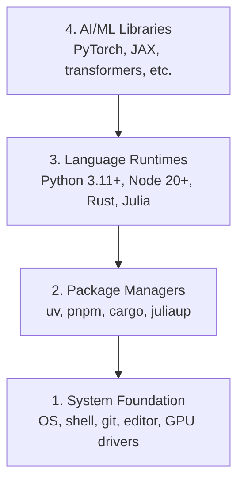

# 开发环境

> 工具塑造思维方式。环境只搭一次,一次就要搭对。

**类型:** 动手构建
**编程语言:** Python, Node.js, Rust
**前置要求:** 无
**预计耗时:** 约 45 分钟

## 学习目标

- 从零搭建 Python 3.11+、Node.js 20+ 和 Rust 工具链
- 配置虚拟环境和包管理器,实现可复现的构建
- 用 CUDA/MPS 验证 GPU 可用性,并运行一个张量测试运算
- 理解四层技术栈:系统、包管理器、运行时、AI 库

## 问题

你即将通过 200 多节课学习 AI 工程,涉及 Python、TypeScript、Rust 和 Julia。如果环境是坏的,每节课都会变成与工具链搏斗,而不是学习。

大多数人会跳过环境搭建,然后花好几个小时调试 import 报错、版本冲突和缺失的 CUDA 驱动。我们要一次到位,把环境搭对。

## 概念

一个 AI 工程环境分为四层:



我们自底向上安装,每一层都依赖它下面的一层。

```figure
s0-env-stack
```

## 动手构建

### 第 1 步:系统基础

检查你的系统,安装基础工具。

```bash
# macOS
xcode-select --install
brew install git curl wget

# Ubuntu/Debian
sudo apt update && sudo apt install -y build-essential git curl wget

# Windows (use WSL2)
wsl --install -d Ubuntu-24.04
```

### 第 2 步:用 uv 安装 Python

我们使用 `uv` —— 它比 pip 快 10-100 倍,还能自动管理虚拟环境。

```bash
curl -LsSf https://astral.sh/uv/install.sh | sh

uv python install 3.12

uv venv
source .venv/bin/activate  # or .venv\Scripts\activate on Windows

uv pip install numpy matplotlib jupyter
```

验证:

```python
import sys
print(f"Python {sys.version}")

import numpy as np
print(f"NumPy {np.__version__}")
a = np.array([1, 2, 3])
print(f"Vector: {a}, dot product with itself: {np.dot(a, a)}")
```

### 第 3 步:用 pnpm 安装 Node.js

供 TypeScript 课程使用(智能体(Agent)、MCP 服务器、Web 应用)。

```bash
curl -fsSL https://fnm.vercel.app/install | bash
fnm install 22
fnm use 22

npm install -g pnpm

node -e "console.log('Node', process.version)"
```

**macOS / Apple Silicon(M1/M2/M3/M4):** 如果安装器报 `Error: Cannot install under Rosetta 2 in ARM default prefix (/opt/homebrew)` 后中止,说明你的终端正运行在 Rosetta 2 下(`arch` 输出 `i386`),而 Homebrew 是原生 arm64 构建。强制以 arm64 方式安装 fnm,把它接入 shell,然后从 `fnm install 22` 开始重跑上面的命令:

```bash
arch -arm64 brew install fnm
echo 'eval "$(fnm env --use-on-cd)"' >> ~/.zshrc
source ~/.zshrc
```

### 第 4 步:Rust

用于性能敏感的课程(推理(inference)、系统开发)。

```bash
curl --proto '=https' --tlsv1.2 -sSf https://sh.rustup.rs | sh

rustc --version
cargo --version
```

### 第 5 步:Julia(可选)

用于数学密集型课程,Julia 在这类课程中表现出色。

```bash
curl -fsSL https://install.julialang.org | sh

julia -e 'println("Julia ", VERSION)'
```

### 第 6 步:GPU 配置(如果你有 GPU)

**NVIDIA(Linux / Windows):**

```bash
nvidia-smi

# Install PyTorch with CUDA
uv pip install torch torchvision torchaudio --index-url https://download.pytorch.org/whl/cu124
```

**macOS / Apple Silicon(M1/M2/M3/M4):** Mac 上没有 CUDA —— 这是正常现象,不是安装失败。**不要**传 `--index-url .../cuXXX` 参数(那些 wheel 只适用于 Linux/Windows,传了会安装失败)。直接安装普通版本即可,它自带 Apple 的 MPS(Metal)GPU 后端:

```bash
uv pip install torch torchvision torchaudio
```

验证(任何平台通用):

```python
import torch
print(f"CUDA available: {torch.cuda.is_available()}")           # False on macOS — expected
print(f"MPS available:  {torch.backends.mps.is_available()}")   # True on Apple Silicon
if torch.cuda.is_available():
    print(f"GPU: {torch.cuda.get_device_name(0)}")
```

没有 GPU?没问题。大多数课程在 CPU 上就能跑。训练量大的课程可以用 Google Colab 或云端 GPU。

### 第 7 步:全量验证

运行验证脚本:

```bash
python phases/00-setup-and-tooling/01-dev-environment/code/verify.py
```

## 投入使用

你的环境已经就绪,可以应对本课程的每一节课。各语言的使用场景如下:

| 语言 | 使用范围 | 包管理器 |
|----------|---------|-----------------|
| Python | 第 1-12 阶段(机器学习、深度学习、NLP、视觉、音频、大语言模型) | uv |
| TypeScript | 第 13-17 阶段(工具、智能体、智能体集群、基础设施) | pnpm |
| Rust | 第 12、15-17 阶段(性能敏感系统) | cargo |
| Julia | 第 1 阶段(数学基础) | Pkg |

## 交付

本节课的产出是一个验证脚本,任何人都可以运行它来检查自己的环境配置。

参见 `outputs/prompt-env-check.md`,其中提供了一个提示词(prompt),可帮助 AI 助手诊断环境问题。

## 练习

1. 运行验证脚本,修复所有失败项
2. 为本课程创建一个 Python 虚拟环境并安装 PyTorch
3. 用四种语言各写一个 "hello world" 并逐一运行
