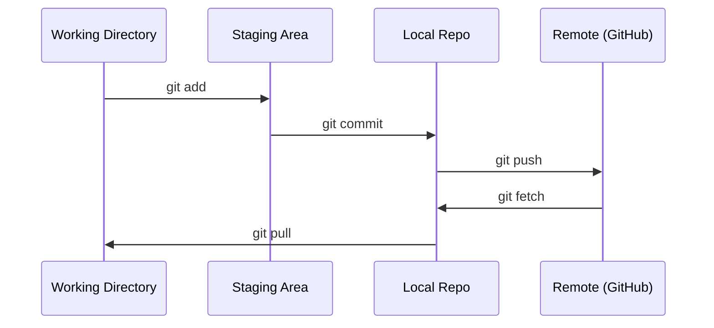

# Git 与协作

> 版本控制不是可选项。你在这里写下的每个实验、每个模型、每节课的成果,都要纳入跟踪。

**类型:** 学习
**编程语言:** --
**前置要求:** 第 0 阶段,第 01 课
**预计耗时:** 约 30 分钟

## 学习目标

- 配置 git 身份信息,掌握 add、commit、push 的日常工作流
- 创建并合并分支,在隔离环境中做实验而不破坏 main
- 编写 `.gitignore`,排除模型检查点和大型二进制文件
- 用 `git log` 浏览提交历史,了解项目的演进过程

## 问题

你即将在 20 个阶段中编写数百个代码文件。没有版本控制,你会丢失工作成果,改坏无法挽回的东西,也无法与他人协作。

Git 是工具,GitHub 是代码存放的地方。这节课只讲本课程用得上的内容,仅此而已。

## 概念



记住三件事:
1. 勤保存(`git commit`)
2. 推送到远端(`git push`)
3. 用分支做实验(`git checkout -b experiment`)

```figure
s0-commit-dag
```

## 动手构建

### 第 1 步:配置 git

```bash
git config --global user.name "Your Name"
git config --global user.email "you@example.com"
```

### 第 2 步:日常工作流

```bash
git status
git add file.py
git commit -m "Add perceptron implementation"
git push origin main
```

### 第 3 步:用分支做实验

```bash
git checkout -b experiment/new-optimizer

# ... make changes, commit ...

git checkout main
git merge experiment/new-optimizer
```

### 第 4 步:使用本课程仓库

你不能直接推送到课程仓库 —— 只有维护者有写权限。先在 GitHub 上 Fork(右上角的 Fork 按钮),让 `origin` 指向你自己的副本:

```bash
git clone https://github.com/YOUR-USERNAME/ai-engineering-from-scratch.git
cd ai-engineering-from-scratch

git checkout -b my-progress
# work through lessons, commit your code
git push origin my-progress
```

## 投入使用

本课程你只需要这些命令:

| 命令 | 何时使用 |
|---------|------|
| `git clone` | 获取课程仓库 |
| `git add` + `git commit` | 保存工作成果 |
| `git push` | 备份到 GitHub |
| `git checkout -b` | 尝试新东西而不破坏 main |
| `git log --oneline` | 看看你都做了什么 |

就这些。本课程用不到 rebase、cherry-pick 或 submodule。

## 练习

1. Fork 本仓库,克隆你的 Fork,创建一个名为 `my-progress` 的分支,新建一个文件,提交并推送
2. 创建一个 `.gitignore`,排除模型检查点文件(`.pt`、`.pth`、`.safetensors`)
3. 用 `git log --oneline` 查看本仓库的提交历史,看看各节课是如何陆续添加进来的

## 关键术语

| 术语 | 人们的说法 | 实际含义 |
|------|----------------|----------------------|
| 提交(Commit) | "保存" | 项目在某个时间点的完整快照 |
| 分支(Branch) | "一个副本" | 指向某个提交的指针,会随着你的工作向前移动 |
| 合并(Merge) | "合并代码" | 把一个分支上的改动应用到另一个分支 |
| 远端(Remote) | "云端" | 托管在其他地方(GitHub、GitLab)的仓库副本 |
