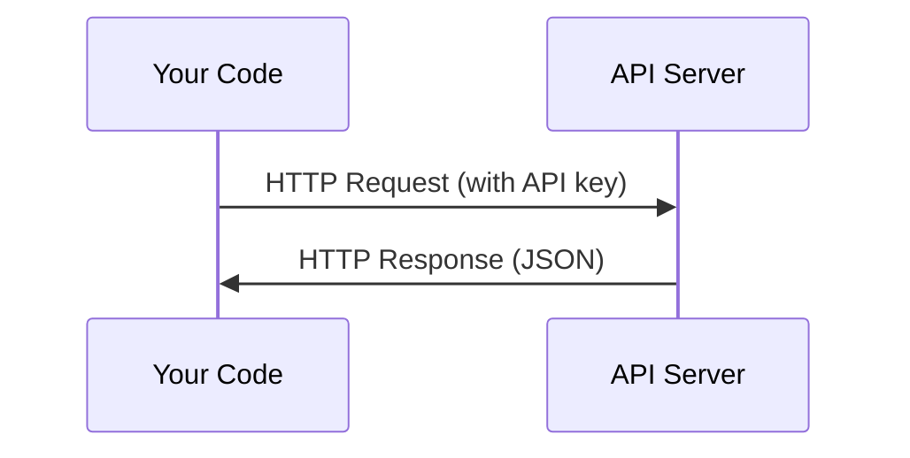

# API 与密钥

> 所有 AI API 的玩法都一样:发个请求,收个响应。细节千变万化,套路始终如一。

**类型:** 动手构建
**编程语言:** Python, TypeScript
**前置要求:** 第 0 阶段, 第 01 课
**预计耗时:** 约 30 分钟

## 学习目标

- 使用环境变量和 `.env` 文件安全地存放 API 密钥
- 分别用 Anthropic Python SDK 和裸 HTTP 发起一次大语言模型(LLM)API 调用
- 对比 SDK 与裸 HTTP 的请求/响应格式,为调试打好基础
- 识别并处理常见 API 错误,包括认证失败和速率限制

## 问题

从 第 11 阶段 开始,你就要调用各家 LLM API(Anthropic、OpenAI、Google)。到了 第 13 阶段-16,你还要构建在循环中使用这些 API 的智能体(Agent)。所以你得先搞清楚:API 密钥是怎么回事、怎么安全存放、怎么发出第一个 API 调用。

## 概念



每次 API 调用都包含四样东西:
1. 端点(URL)
2. API 密钥(认证)
3. 请求体(你想要什么)
4. 响应体(你拿到什么)

```figure
s0-secret-inject
```

## 动手构建

### 第 1 步:安全存放 API 密钥

永远不要把 API 密钥写进代码。用环境变量。

```bash
export ANTHROPIC_API_KEY="sk-ant-..."
export OPENAI_API_KEY="sk-..."
```

或者用 `.env` 文件(记得把它加进 `.gitignore`):

```
ANTHROPIC_API_KEY=sk-ant-...
OPENAI_API_KEY=sk-...
```

### 第 2 步:第一个 API 调用(Python)

```python
import os

import anthropic

client = anthropic.Anthropic()

MODEL = os.environ.get("LLM_MODEL", "claude-sonnet-5")

response = client.messages.create(
    model=MODEL,
    max_tokens=256,
    messages=[{"role": "user", "content": "What is a neural network in one sentence?"}]
)

print(response.content[0].text)
```

`LLM_MODEL` 用来指定 Anthropic 的模型 ID,默认值是不带日期的 Sonnet 别名。其他厂商(OpenAI、Google 等)也遵循同样的模式——密钥加模型 ID,但各家都有自己的 SDK、端点和请求/响应结构。

### 第 3 步:第一个 API 调用(TypeScript)

```typescript
import Anthropic from "@anthropic-ai/sdk";

const client = new Anthropic();

const MODEL = process.env.LLM_MODEL ?? "claude-sonnet-5";

const response = await client.messages.create({
  model: MODEL,
  max_tokens: 256,
  messages: [{ role: "user", content: "What is a neural network in one sentence?" }],
});

console.log(response.content[0].text);
```

### 第 4 步:裸 HTTP(不用 SDK)

```python
import os
import urllib.request
import json

url = "https://api.anthropic.com/v1/messages"
headers = {
    "Content-Type": "application/json",
    "x-api-key": os.environ["ANTHROPIC_API_KEY"],
    "anthropic-version": "2023-06-01",
}
body = json.dumps({
    "model": os.environ.get("LLM_MODEL", "claude-sonnet-5"),
    "max_tokens": 256,
    "messages": [{"role": "user", "content": "What is a neural network in one sentence?"}],
}).encode()

req = urllib.request.Request(url, data=body, headers=headers, method="POST")
with urllib.request.urlopen(req) as resp:
    result = json.loads(resp.read())
    print(result["content"][0]["text"])
```

SDK 在底层做的就是这件事。看懂裸 HTTP 调用,调试时心里才有底。

## 投入使用

本课程涉及的 API:

| API | 什么时候需要 | 免费额度 |
|-----|-----------------|-----------|
| Anthropic (Claude) | 第 11 阶段-16(智能体、工具) | 注册送 $5 |
| OpenAI | 第 11 阶段(对比用) | 注册送 $5 |
| Hugging Face | 第 4 阶段-10(模型、数据集) | 免费 |

不用现在就全部配齐。哪节课要用,到时候再配。

## 交付

本课产出:
- `outputs/prompt-api-troubleshooter.md` —— 诊断常见 API 错误

## 练习

1. 申请一个 Anthropic API 密钥,发出你的第一个 API 调用
2. 试试裸 HTTP 版本,对比它和 SDK 版本的响应格式
3. 故意用一个错误的 API 密钥,读一读报错信息

## 关键术语

| 术语 | 大家嘴里的说法 | 实际含义 |
|------|----------------|----------------------|
| API 密钥 | "API 的密码" | 一串唯一字符串,用来标识你的账户并授权请求 |
| 速率限制 | "他们给我限流了" | 每分钟/每小时的最大请求数,防止滥用、保证公平使用 |
| Token | "一个词"(API 语境下) | 计费单位:输入和输出的 token 分开计数、分开收费 |
| 流式输出 | "实时响应" | 逐字逐句地返回响应,而不是干等完整结果 |
