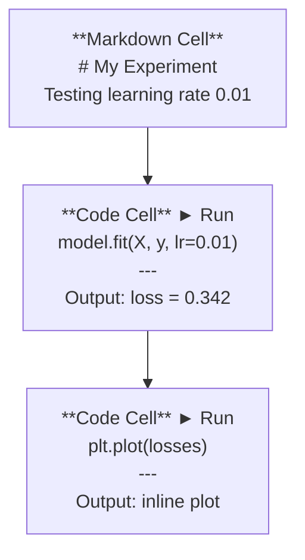
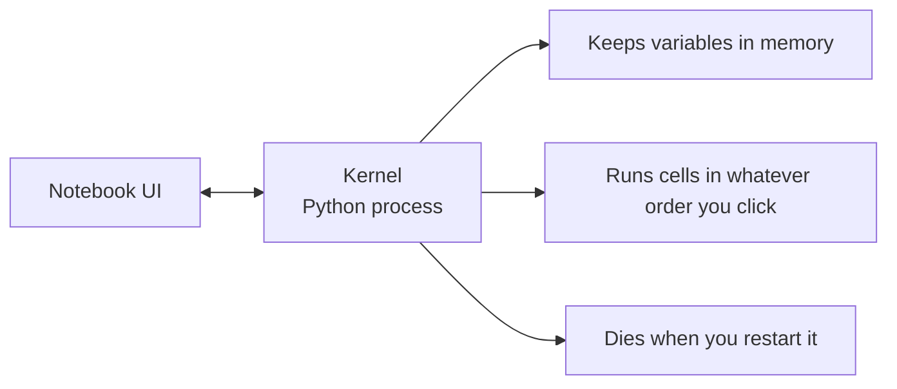

# Jupyter Notebooks

> Notebook 是 AI 工程的实验台。原型在这里做,验证可行的东西再搬进生产环境。

**类型:** 动手构建
**编程语言:** Python
**前置要求:** 第 0 阶段, 第 01 课
**预计耗时:** 约 30 分钟

## 学习目标

- 安装并启动 JupyterLab、Jupyter Notebook,或在 VS Code 中配置 Jupyter 扩展
- 使用魔法命令(`%timeit`、`%%time`、`%matplotlib inline`)做基准测试和内联可视化
- 分清什么时候用 notebook、什么时候用脚本,实践"探索用 notebook,交付用脚本"的工作流
- 识别并避开常见的 notebook 陷阱:乱序执行、隐藏状态、内存泄漏

## 问题

每一篇 AI 论文、每一份教程、每一场 Kaggle 比赛,用的都是 Jupyter notebook。它让你分段运行代码、内联查看输出、把代码和讲解混在一起写、快速迭代。学 AI 不用 notebook,就像做数学题没有草稿纸。

但 notebook 也有真实的坑。很多人拿它干所有事,包括它根本不擅长的事。搞清楚什么时候用 notebook、什么时候用脚本,能让你以后少踩很多调试的坑。

## 概念

Notebook 就是一串单元格(cell)。每个单元格要么是代码,要么是文本。



内核(kernel)是一个在后台运行的 Python 进程。你运行某个单元格时,代码被发给内核执行,结果再传回来。所有单元格共享同一个内核,所以变量在单元格之间是互通的。



"按你点击的顺序执行"这一点,既是超能力,也是走火的枪。

```figure
s0-cell-order
```

## 动手构建

### 第 1 步:选一个界面

三个选择,一种格式:

| 界面 | 安装 | 适合场景 |
|-----------|---------|----------|
| JupyterLab | `pip install jupyterlab` 然后 `jupyter lab` | 完整 IDE 体验:多标签、文件浏览器、终端 |
| Jupyter Notebook | `pip install notebook` 然后 `jupyter notebook` | 简单轻量,一次一个 notebook |
| VS Code | 安装 "Jupyter" 扩展 | 就在你的编辑器里,带 git 集成和调试 |

三者读写的是同一种 `.ipynb` 文件。挑顺手的就行。AI 领域用得最多的是 JupyterLab。

```bash
pip install jupyterlab
jupyter lab
```

### 第 2 步:重要的快捷键

你在两种模式之间切换。按 `Escape` 进入命令模式(左侧蓝条),按 `Enter` 进入编辑模式(绿条)。

**命令模式(最常用):**

| 按键 | 作用 |
|-----|--------|
| `Shift+Enter` | 运行当前单元格,移到下一个 |
| `A` | 在上方插入单元格 |
| `B` | 在下方插入单元格 |
| `DD` | 删除单元格 |
| `M` | 转成 markdown |
| `Y` | 转成代码 |
| `Z` | 撤销单元格操作 |
| `Ctrl+Shift+H` | 查看全部快捷键 |

**编辑模式:**

| 按键 | 作用 |
|-----|--------|
| `Tab` | 自动补全 |
| `Shift+Tab` | 显示函数签名 |
| `Ctrl+/` | 切换注释 |

`Shift+Enter` 是你一天要按上千次的键,先学它。

### 第 3 步:单元格类型

**代码单元格**运行 Python 并显示输出:

```python
import numpy as np
data = np.random.randn(1000)
data.mean(), data.std()
```

输出:`(0.0032, 0.9987)`

**Markdown 单元格**渲染格式化文本。用它来记录你在做什么、为什么这么做。支持标题、粗体、斜体、LaTeX 数学公式(`$E = mc^2$`)、表格和图片。

### 第 4 步:魔法命令

这些不是 Python,是 Jupyter 专属命令,以 `%`(行魔法)或 `%%`(单元格魔法)开头。

**给代码计时:**

```python
%timeit np.random.randn(10000)
```

输出:`45.2 us +/- 1.3 us per loop`

```python
%%time
model.fit(X_train, y_train, epochs=10)
```

输出:`Wall time: 2.34 s`

`%timeit` 会跑很多次取平均值,`%%time` 只跑一次。微基准测试用 `%timeit`,训练任务用 `%%time`。

**开启内联绘图:**

```python
%matplotlib inline
```

之后每个 `plt.plot()` 或 `plt.show()` 都会直接渲染在 notebook 里。

**不离开 notebook 装包:**

```python
!pip install scikit-learn
```

`!` 前缀可以执行任意 shell 命令。

**查看环境变量:**

```python
%env CUDA_VISIBLE_DEVICES
```

### 第 5 步:内联展示富输出

Notebook 会自动显示单元格最后一个表达式的结果。但你也可以主动控制:

```python
import pandas as pd

df = pd.DataFrame({
    "model": ["Linear", "Random Forest", "Neural Net"],
    "accuracy": [0.72, 0.89, 0.94],
    "training_time": [0.1, 2.3, 45.6]
})
df
```

这会渲染成格式化的 HTML 表格,而不是一坨文本。绘图也一样:

```python
import matplotlib.pyplot as plt

plt.figure(figsize=(8, 4))
plt.plot([1, 2, 3, 4], [1, 4, 2, 3])
plt.title("Inline Plot")
plt.show()
```

图就出现在单元格正下方。这就是 notebook 统治 AI 工作的原因:数据、图、代码,一目了然。

显示图片:

```python
from IPython.display import Image, display
display(Image(filename="architecture.png"))
```

### 第 6 步:Google Colab

Colab 是云端的免费 Jupyter notebook。送 GPU,预装好各种库,还能挂 Google Drive。零配置。

1. 打开 [colab.research.google.com](https://colab.research.google.com)
2. 上传本课程的任意 `.ipynb` 文件
3. Runtime > Change runtime type > T4 GPU(免费)

Colab 和本地 Jupyter 的区别:
- 文件不跨会话保留(要存到 Drive 或下载下来)
- 预装:numpy、pandas、matplotlib、torch、tensorflow、sklearn
- 用 `from google.colab import files` 上传/下载文件
- 用 `from google.colab import drive; drive.mount('/content/drive')` 挂载持久存储
- 空闲 90 分钟后会话超时(免费档)

## 投入使用

### Notebook 还是脚本:怎么选

| 用 notebook 的场景 | 用脚本的场景 |
|-------------------|-----------------|
| 探索数据集 | 训练流水线 |
| 模型原型 | 可复用工具函数 |
| 可视化结果 | 任何带 `if __name__` 的代码 |
| 讲解你的工作 | 定时运行的代码 |
| 快速实验 | 生产代码 |
| 课程练习 | 包和库 |

原则:**探索用 notebook,交付用脚本**。

AI 工作里常见的流程:
1. 在 notebook 里探索数据
2. 在 notebook 里做模型原型
3. 跑通之后,把代码搬到 `.py` 文件
4. 再把这些 `.py` 文件 import 回 notebook,继续实验

### 常见陷阱

**乱序执行。** 你先跑单元格 5,再跑 2,再跑 7。在你机器上好使,别人从头跑到尾就崩。对策:分享前做 Kernel > Restart & Run All。

**隐藏状态。** 你删了某个单元格,但它创建的变量还在内存里。notebook 看起来干干净净,实际上依赖一个幽灵单元格。对策:定期重启内核。

**内存泄漏。** 加载 4GB 数据集,训练模型,再加载另一个数据集,什么都不释放。对策:`del variable_name` 加 `gc.collect()`,或者干脆重启内核。

## 交付

本课产出:
- `outputs/prompt-notebook-helper.md`,用于调试 notebook 问题

## 练习

1. 打开 JupyterLab,新建一个 notebook,用 `%timeit` 对比列表推导式和 numpy 生成 10 万个随机数的性能差异
2. 创建一个同时包含 markdown 和代码单元格的 notebook:加载 CSV、显示 dataframe、画一张图。然后运行 Kernel > Restart & Run All,验证从头到尾能跑通
3. 把 `code/notebook_tips.py` 里的代码贴到 Colab notebook 里,用免费 GPU 跑一遍

## 关键术语

| 术语 | 大家嘴里的说法 | 实际含义 |
|------|----------------|----------------------|
| 内核(Kernel) | "跑我代码的那个东西" | 一个独立的 Python 进程,执行单元格并把变量留在内存里 |
| 单元格(Cell) | "一个代码块" | notebook 里可独立运行的单元,要么是代码,要么是 markdown |
| 魔法命令 | "Jupyter 小技巧" | 以 `%` 或 `%%` 开头的特殊命令,用来控制 notebook 环境 |
| `.ipynb` | "notebook 文件" | 一个 JSON 文件,包含单元格、输出和元数据。名字来自 IPython Notebook |

## 延伸阅读

- [JupyterLab 文档](https://jupyterlab.readthedocs.io/),了解完整功能集
- [Google Colab FAQ](https://research.google.com/colaboratory/faq.html),了解 Colab 的限制和特性
- [28 个 Jupyter Notebook 技巧](https://www.dataquest.io/blog/jupyter-notebook-tips-tricks-shortcuts/),进阶用户的快捷键
