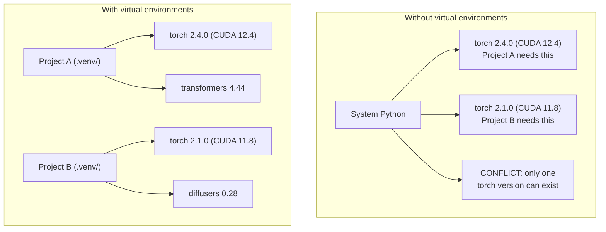

# Python 环境

> 依赖地狱是真实存在的。虚拟环境就是解药。

**类型:** 动手构建
**编程语言:** Shell
**前置要求:** 第 0 阶段, 第 01 课
**预计耗时:** 约 30 分钟

## 学习目标

- 用 `uv`、`venv` 或 `conda` 创建隔离的虚拟环境
- 编写带可选依赖分组的 `pyproject.toml`,并生成锁定文件(lockfile)保证可复现
- 诊断并修复常见坑:全局安装、pip/conda 混用、CUDA 版本不匹配
- 为依赖互相冲突的项目实施分阶段(per-phase)环境策略

## 问题

你给一个微调(fine-tuning)项目装了 PyTorch 2.4。下周另一个项目要 PyTorch 2.1,因为它的 CUDA 构建版本被钉死了。你全局升级,第一个项目挂了;你降级,第二个项目又挂了。

这就是依赖地狱。在 AI/ML 工作里它三天两头出现,因为:

- PyTorch、JAX、TensorFlow 各自打包了自己的 CUDA 绑定
- 模型库会钉死特定的框架版本
- 全局 `pip install` 会覆盖掉之前装的东西
- CUDA 11.8 的构建在 CUDA 12.x 驱动上跑不了(反过来也一样)

解法:每个项目都有自己独立的环境,装自己的包。

## 概念



```figure
s0-env-isolation
```

## 动手构建

### 方案一:uv venv(推荐)

`uv` 是目前最快的 Python 包管理器(比 pip 快 10-100 倍)。虚拟环境、Python 版本、依赖解析,一个工具全包。

```bash
curl -LsSf https://astral.sh/uv/install.sh | sh

uv python install 3.12

cd your-project
uv venv
source .venv/bin/activate
```

安装包:

```bash
uv pip install torch numpy
```

一步创建带 `pyproject.toml` 的项目:

```bash
uv init my-ai-project
cd my-ai-project
uv add torch numpy matplotlib
```

### 方案二:venv(内置)

如果装不了 `uv`,Python 自带 `venv`:

```bash
python3 -m venv .venv
source .venv/bin/activate  # Linux/macOS
.venv\Scripts\activate     # Windows

pip install torch numpy
```

比 `uv` 慢,但只要有 Python 的地方就能用。

### 方案三:conda(需要时才用)

Conda 能管理 Python 之外的依赖,比如 CUDA 工具包、cuDNN 和 C 库。以下场景用它:

- 需要特定的 CUDA 工具包版本,又不想装到系统里
- 在共享集群上,没有权限装系统包
- 某个库的安装说明写了"use conda"

```bash
# Install miniconda (not the full Anaconda)
curl -LsSf https://repo.anaconda.com/miniconda/Miniconda3-latest-Linux-x86_64.sh -o miniconda.sh
bash miniconda.sh -b

conda create -n myproject python=3.12
conda activate myproject

conda install pytorch torchvision torchaudio pytorch-cuda=12.4 -c pytorch -c nvidia
```

一条铁律:如果一个环境用了 conda,那里面所有的包都用 conda 装。往 conda 环境里混 `pip install`,会搞出调到你怀疑人生的依赖冲突。

### 本课程策略:按阶段分环境

你可以给整门课建一个环境。别这么做。不同阶段需要的依赖不同,有时还互相冲突。

策略:

```
ai-engineering-from-scratch/
├── .venv/                    <-- shared lightweight env for phases 0-3
├── phases/
│   ├── 04-neural-networks/
│   │   └── .venv/            <-- PyTorch env
│   ├── 05-cnns/
│   │   └── .venv/            <-- same PyTorch env (symlink or shared)
│   ├── 08-transformers/
│   │   └── .venv/            <-- might need different transformer versions
│   └── 11-llm-apis/
│       └── .venv/            <-- API SDKs, no torch needed
```

`code/env_setup.sh` 里的脚本会创建本课程的基础环境。

## pyproject.toml 基础

每个 Python 项目都应该有一个 `pyproject.toml`。它一个文件顶掉 `setup.py`、`setup.cfg` 和 `requirements.txt`。

```toml
[project]
name = "ai-engineering-from-scratch"
version = "0.1.0"
requires-python = ">=3.11"
dependencies = [
    "numpy>=1.26",
    "matplotlib>=3.8",
    "jupyter>=1.0",
    "scikit-learn>=1.4",
]

[project.optional-dependencies]
torch = ["torch>=2.3", "torchvision>=0.18"]
llm = ["anthropic>=0.39", "openai>=1.50"]
```

然后安装:

```bash
uv pip install -e ".[torch]"    # base + PyTorch
uv pip install -e ".[llm]"     # base + LLM SDKs
uv pip install -e ".[torch,llm]" # everything
```

## 锁定文件(Lockfile)

锁定文件把每个依赖(包括间接依赖)钉死到精确版本。这保证了可复现性:任何人按锁定文件安装,得到的包都一模一样。

```bash
# uv generates uv.lock automatically when using uv add
uv add numpy

# pip-tools approach
uv pip compile pyproject.toml -o requirements.lock
uv pip install -r requirements.lock
```

把锁定文件提交到 git。别人克隆仓库后按锁定文件安装,版本完全一致。

## 常见错误

### 1. 全局安装

```bash
pip install torch  # BAD: installs to system Python

source .venv/bin/activate
pip install torch  # GOOD: installs to virtual environment
```

检查你的包装到哪去了:

```bash
which python       # should show .venv/bin/python, not /usr/bin/python
which pip           # should show .venv/bin/pip
```

### 2. pip 和 conda 混用

```bash
conda create -n myenv python=3.12
conda activate myenv
conda install pytorch -c pytorch
pip install some-other-package   # BAD: can break conda's dependency tracking
conda install some-other-package # GOOD: let conda manage everything
```

如果必须在 conda 里用 pip(有些包只有 pip 版),先把 conda 包装完,最后才装 pip 包。

### 3. 忘记激活环境

```bash
python train.py           # uses system Python, missing packages
source .venv/bin/activate
python train.py           # uses project Python, packages found
```

你的 shell 提示符应该显示环境名:

```
(.venv) $ python train.py
```

### 4. 把 .venv 提交到 git

```bash
echo ".venv/" >> .gitignore
```

虚拟环境有 200MB-2GB,只在本地有效,没法跨机器搬。要提交的是 `pyproject.toml` 和锁定文件。

### 5. CUDA 版本不匹配

```bash
nvidia-smi                # shows driver CUDA version (e.g., 12.4)
python -c "import torch; print(torch.version.cuda)"  # shows PyTorch CUDA version

# These must be compatible.
# PyTorch CUDA version must be <= driver CUDA version.
```

## 投入使用

运行配置脚本,创建课程环境:

```bash
bash phases/00-setup-and-tooling/06-python-environments/code/env_setup.sh
```

它会在仓库根目录创建一个 `.venv`,装好核心依赖并做校验。

## 练习

1. 运行 `env_setup.sh`,确认所有检查通过
2. 再建一个虚拟环境,装一个不同版本的 numpy,验证两个环境互不影响
3. 为一个同时需要 PyTorch 和 Anthropic SDK 的项目写一份 `pyproject.toml`
4. 故意往全局装一个包(不激活 venv),看看它装去了哪,然后卸掉

## 关键术语

| 术语 | 大家嘴里的说法 | 实际含义 |
|------|----------------|----------------------|
| 虚拟环境 | "一个 venv" | 一个隔离目录,里面有自己的 Python 解释器和包,与系统 Python 分开 |
| 锁定文件(Lockfile) | "钉死的依赖" | 列出每个包及其精确版本的文件,保证不同机器上装出来一模一样 |
| pyproject.toml | "新时代的 setup.py" | Python 项目的标准配置文件,取代 setup.py/setup.cfg/requirements.txt |
| 间接依赖 | "依赖的依赖" | 包 B 依赖 C;你装了依赖 B 的 A,C 就是 A 的间接依赖 |
| CUDA 不匹配 | "我 GPU 不好使了" | PyTorch 编译时针对的 CUDA 版本,和你 GPU 驱动支持的版本对不上 |
