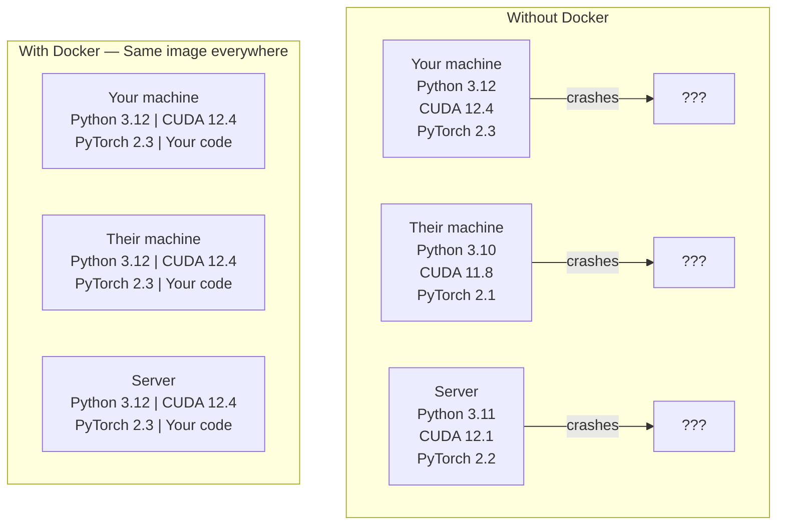

# Docker 与 AI

> 有了容器,"在我机器上明明是好的"这句话就成了历史。

**类型:** 动手构建
**编程语言:** Docker
**前置要求:** 第 0 阶段, Lessons 01 and 03
**预计耗时:** 约 60 分钟

## 学习目标

- 用 Dockerfile 构建带 CUDA、PyTorch 和 AI 库的 GPU 镜像
- 把宿主机目录挂载为卷(volume),让模型、数据集和代码在容器重建后不丢失
- 配置 NVIDIA Container Toolkit,让容器里能用 GPU
- 用 Docker Compose 编排多服务 AI 应用(推理服务 + 向量数据库)

## 问题

你在笔记本上训练了一个模型:PyTorch 2.3、CUDA 12.4、Python 3.12。你同事的环境是 PyTorch 2.1、CUDA 11.8、Python 3.10。你的模型在他机器上崩了。而你的 Dockerfile 在两边都能跑。

AI 项目是依赖噩梦。一套典型的技术栈包括 Python、PyTorch、CUDA 驱动、cuDNN、系统级 C 库,还有像 flash-attn 这种对编译器版本极度挑剔的包。Docker 把这一切打包进一个镜像,放到哪里跑都一样。

## 概念

Docker 把你的代码、运行时、库和系统工具包进一个隔离单元,叫容器(container)。可以把它理解成一台轻量虚拟机,只不过它共享宿主机内核,而不是自己跑一个,所以启动只要几秒,不用几分钟。



### 为什么 AI 项目尤其需要 Docker

1. **GPU 驱动很脆弱。** 为 CUDA 12.4 编的代码在 CUDA 11.8 上跑不了。Docker 把 CUDA 工具包隔离在容器内部,再通过 NVIDIA Container Toolkit 共享宿主机的 GPU 驱动。

2. **模型权重很大。** 一个 7B 参数的模型,fp16 精度下是 14 GB。你不会想每次重建容器都重新下载一遍。用 Docker 卷把宿主机的模型目录挂进来就行。

3. **多服务架构是常态。** 一个真实的 AI 应用不只是一个 Python 脚本,它通常是一个推理服务、一个给 RAG 用的向量数据库,可能再加个 Web 前端。Docker Compose 一条命令就能把这些都编排起来。

### 核心词汇

| 术语 | 含义 |
|------|---------------|
| 镜像(Image) | 只读模板。你的配方。由 Dockerfile 构建。 |
| 容器(Container) | 镜像的运行实例。你的厨房。 |
| Dockerfile | 构建镜像的说明书,一层一层来。 |
| 卷(Volume) | 容器重启后依然存在的持久存储。 |
| docker-compose | 用 YAML 定义多容器应用的工具。 |

### AI 领域常见的容器模式

```
Dev Container
  Full toolkit. Editor support. Jupyter. Debugging tools.
  Used during development and experimentation.

Training Container
  Minimal. Just the training script and dependencies.
  Runs on GPU clusters. No editor, no Jupyter.

Inference Container
  Optimized for serving. Small image. Fast cold start.
  Runs behind a load balancer in production.
```

```figure
s0-image-layers
```

## 动手构建

### 第 1 步:安装 Docker

```bash
# macOS
brew install --cask docker
open /Applications/Docker.app

# Ubuntu
curl -fsSL https://get.docker.com | sh
sudo usermod -aG docker $USER
# Log out and back in for group change to take effect
```

验证:

```bash
docker --version
docker run hello-world
```

### 第 2 步:安装 NVIDIA Container Toolkit(Linux + NVIDIA GPU)

这一步让 Docker 容器能访问你的 GPU。macOS 和 Windows(WSL2)用户可以跳过,Docker Desktop 在这两个平台上的 GPU 透传机制不一样。

```bash
distribution=$(. /etc/os-release;echo $ID$VERSION_ID)
curl -fsSL https://nvidia.github.io/libnvidia-container/gpgkey | sudo gpg --dearmor -o /usr/share/keyrings/nvidia-container-toolkit-keyring.gpg
curl -s -L https://nvidia.github.io/libnvidia-container/$distribution/libnvidia-container.list | \
    sed 's#deb https://#deb [signed-by=/usr/share/keyrings/nvidia-container-toolkit-keyring.gpg] https://#g' | \
    sudo tee /etc/apt/sources.list.d/nvidia-container-toolkit.list

sudo apt-get update
sudo apt-get install -y nvidia-container-toolkit
sudo nvidia-ctk runtime configure --runtime=docker
sudo systemctl restart docker
```

测试容器内的 GPU 访问:

```bash
docker run --rm --gpus all nvidia/cuda:12.4.1-base-ubuntu22.04 nvidia-smi
```

能看到你的 GPU 信息,就说明工具包配好了。

### 第 3 步:认识基础镜像

选对基础镜像,能省下几个小时的调试时间。

```
nvidia/cuda:12.4.1-devel-ubuntu22.04
  Full CUDA toolkit. Compilers included.
  Use for: building packages that need nvcc (flash-attn, bitsandbytes)
  Size: ~4 GB

nvidia/cuda:12.4.1-runtime-ubuntu22.04
  CUDA runtime only. No compilers.
  Use for: running pre-built code
  Size: ~1.5 GB

pytorch/pytorch:2.6.0-cuda12.4-cudnn9-runtime
  PyTorch pre-installed on top of CUDA.
  Use for: skipping the PyTorch install step
  Size: ~6 GB

python:3.12-slim
  No CUDA. CPU only.
  Use for: inference on CPU, lightweight tools
  Size: ~150 MB
```

### 第 4 步:写一个 AI 开发的 Dockerfile

这是 `code/Dockerfile` 里的文件,逐段过一遍:

```dockerfile
FROM nvidia/cuda:12.4.1-devel-ubuntu22.04

ENV DEBIAN_FRONTEND=noninteractive
ENV PYTHONUNBUFFERED=1

RUN apt-get update && apt-get install -y --no-install-recommends \
    software-properties-common \
    git \
    curl \
    build-essential \
    && add-apt-repository -y ppa:deadsnakes/ppa \
    && apt-get update && apt-get install -y --no-install-recommends \
    python3.12 \
    python3.12-venv \
    python3.12-dev \
    && rm -rf /var/lib/apt/lists/*

RUN update-alternatives --install /usr/bin/python python /usr/bin/python3.12 1

RUN curl -sSL https://raw.githubusercontent.com/pypa/get-pip/3b73145063be545b649ad9ca83ea8da5fc915a4f/public/get-pip.py -o /tmp/get-pip.py \
    && echo "a341e1a43e38001c551a1508a73ff23636a11970b61d901d9a1cad2a18f57055  /tmp/get-pip.py" | sha256sum -c - \
    && python /tmp/get-pip.py \
    && rm /tmp/get-pip.py \
    && update-alternatives --install /usr/bin/pip pip /usr/local/bin/pip3.12 1

RUN python -m pip install --no-cache-dir --upgrade pip setuptools wheel

RUN python -m pip install --no-cache-dir \
    torch==2.6.0+cu124 \
    torchvision==0.21.0+cu124 \
    torchaudio==2.6.0+cu124 \
    --index-url https://download.pytorch.org/whl/cu124

RUN python -m pip install --no-cache-dir \
    numpy \
    pandas \
    scikit-learn \
    matplotlib \
    jupyter \
    transformers \
    datasets \
    accelerate \
    safetensors

WORKDIR /workspace

VOLUME ["/workspace", "/models"]

EXPOSE 8888

CMD ["python"]
```

构建:

```bash
docker build -t ai-dev -f phases/00-setup-and-tooling/07-docker-for-ai/code/Dockerfile .
```

第一次构建会比较久(要下载 CUDA 基础镜像和 PyTorch)。之后的构建会走缓存层,很快。

运行:

```bash
docker run --rm -it --gpus all \
    -v $(pwd):/workspace \
    -v ~/models:/models \
    ai-dev python -c "import torch; print(f'PyTorch {torch.__version__}, CUDA: {torch.cuda.is_available()}')"
```

在容器里跑 Jupyter:

```bash
docker run --rm -it --gpus all \
    -v $(pwd):/workspace \
    -v ~/models:/models \
    -p 8888:8888 \
    ai-dev jupyter notebook --ip=0.0.0.0 --port=8888 --no-browser --allow-root
```

### 第 5 步:用卷挂载数据和模型

卷挂载对 AI 工作至关重要。没有它,容器一停,你 14 GB 的模型下载就没了。

```bash
# Mount your code
-v $(pwd):/workspace

# Mount a shared models directory
-v ~/models:/models

# Mount datasets
-v ~/datasets:/data
```

在训练脚本里,从挂载路径加载:

```python
from transformers import AutoModel

model = AutoModel.from_pretrained("/models/llama-7b")
```

模型存在宿主机的文件系统上。容器随便重建,都不用重新下载。

### 第 6 步:用 Docker Compose 编排多服务 AI 应用

一个真实的 RAG 应用需要一个推理服务和一个向量数据库。Docker Compose 一条命令把两者都拉起来。

见 `code/docker-compose.yml`:

```yaml
services:
  ai-dev:
    build:
      context: .
      dockerfile: Dockerfile
    deploy:
      resources:
        reservations:
          devices:
            - driver: nvidia
              count: all
              capabilities: [gpu]
    volumes:
      - ../../../:/workspace
      - ~/models:/models
      - ~/datasets:/data
    ports:
      - "8888:8888"
    stdin_open: true
    tty: true
    command: jupyter notebook --ip=0.0.0.0 --port=8888 --no-browser --allow-root

  qdrant:
    image: qdrant/qdrant:v1.12.5
    ports:
      - "6333:6333"
      - "6334:6334"
    volumes:
      - qdrant_data:/qdrant/storage

volumes:
  qdrant_data:
```

一键启动:

```bash
cd phases/00-setup-and-tooling/07-docker-for-ai/code
docker compose up -d
```

现在 AI 开发容器可以通过服务名访问向量数据库:`http://qdrant:6333`。Docker Compose 会自动创建一个共享网络。

在 AI 容器里测试连接:

```python
from qdrant_client import QdrantClient

client = QdrantClient(host="qdrant", port=6333)
print(client.get_collections())
```

停止所有服务:

```bash
docker compose down
```

加 `-v` 连 qdrant 的卷一起删掉:

```bash
docker compose down -v
```

### 第 7 步:AI 工作常用的 Docker 命令

```bash
# List running containers
docker ps

# List all images and their sizes
docker images

# Remove unused images (reclaim disk space)
docker system prune -a

# Check GPU usage inside a running container
docker exec -it <container_id> nvidia-smi

# Copy a file from container to host
docker cp <container_id>:/workspace/results.csv ./results.csv

# View container logs
docker logs -f <container_id>
```

## 投入使用

你现在有了一个可复现的 AI 开发环境。本课程后续:

- 用 `docker compose up` 同时拉起开发环境和向量数据库
- 把代码、模型、数据都挂载为卷,重建容器什么都不丢
- 某节课需要新 Python 包时,加进 Dockerfile 再重建
- 把你的 Dockerfile 分享给队友,他们得到的环境和你一模一样

### 没有 GPU?

去掉 `--gpus all` 参数和 NVIDIA 的 deploy 配置块。容器照样能跑基于 CPU 的课程。PyTorch 检测不到 CUDA 时会自动回退到 CPU。

## 练习

1. 构建这个 Dockerfile,在容器里运行 `python -c "import torch; print(torch.__version__)"`
2. 启动 docker-compose 栈,验证在 AI 容器里能访问 `http://qdrant:6333/collections`
3. 往 Dockerfile 里加 `flask`,重新构建,在 5000 端口跑一个简单的 API 服务,并用 `-p 5000:5000` 映射端口
4. 用 `docker images` 查看镜像大小。试试把基础镜像从 `devel` 换成 `runtime`,对比大小差异

## 关键术语

| 术语 | 大家嘴里的说法 | 实际含义 |
|------|----------------|----------------------|
| 容器(Container) | "轻量虚拟机" | 一个使用宿主机内核的隔离进程,有自己的文件系统和网络 |
| 镜像层(Image layer) | "缓存的步骤" | Dockerfile 每条指令产生一层。没变的层走缓存,所以重建很快。 |
| NVIDIA Container Toolkit | "Docker 里用 GPU" | 一个运行时钩子,通过 `--gpus` 参数把宿主机 GPU 暴露给容器 |
| 卷挂载(Volume mount) | "共享文件夹" | 把宿主机目录映射进容器。容器停了,改动还在。 |
| 基础镜像(Base image) | "起点" | Dockerfile 里 `FROM` 指定的镜像,决定了预装了什么。 |
