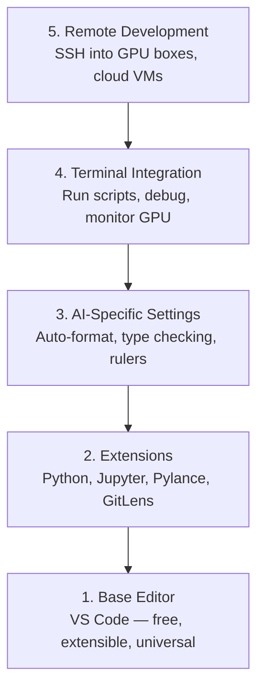

# 编辑器配置

> 编辑器是你的副驾驶。一次配好,它就不挡你的路,还能帮你干活。

**类型:** 动手构建
**编程语言:** --
**前置要求:** 第 0 阶段, 第 01 课
**预计耗时:** 约 20 分钟

## 学习目标

- 安装 VS Code 及 AI 工作必备扩展:Python、Jupyter、lint、Remote SSH
- 配置保存时自动格式化、类型检查、notebook 输出滚动等适合 AI 工作流的设置
- 配置 Remote SSH,像操作本地一样在远程 GPU 机器上编辑和调试代码
- 评估编辑器备选方案(Cursor、Windsurf、Neovim)及其在 AI 工作中的取舍

## 问题

你将要花几千个小时在编辑器里写 Python、跑 notebook、调试训练循环、SSH 到 GPU 机器上。编辑器没配好,每次干活都是折磨:没有自动补全、没有类型提示、没有内联报错、手动调格式、终端流程别扭。

正确的配置只要 20 分钟。不配的话,每天浪费 20 分钟。

## 概念

一套 AI 工程编辑器配置需要五样东西:



```figure
s0-lsp-roundtrip
```

## 动手构建

### 第 1 步:安装 VS Code

推荐用 VS Code。免费、全平台、对 Jupyter notebook 的支持是一流的,扩展生态也能覆盖 AI 工作的所有需求。

从 [code.visualstudio.com](https://code.visualstudio.com/) 下载。

在终端验证:

```bash
code --version
```

如果 macOS 上找不到 `code` 命令,打开 VS Code,按 `Cmd+Shift+P`,输入 "Shell Command",选择 "Install 'code' command in PATH"。

### 第 2 步:安装必备扩展

打开 VS Code 内置终端(全平台都是 `` Ctrl+` ``),安装这些 AI 工作真正用得上的扩展:

```bash
code --install-extension ms-python.python
code --install-extension ms-python.vscode-pylance
code --install-extension ms-toolsai.jupyter
code --install-extension eamodio.gitlens
code --install-extension ms-vscode-remote.remote-ssh
code --install-extension ms-python.debugpy
code --install-extension ms-python.black-formatter
code --install-extension charliermarsh.ruff
```

每个扩展的作用:

| 扩展 | 用途 |
|-----------|-----|
| Python | 语言支持、虚拟环境识别、运行/调试 |
| Pylance | 快速类型检查、自动补全、import 解析 |
| Jupyter | 在 VS Code 里跑 notebook,带变量查看器 |
| GitLens | 看谁改了什么,内联 git blame |
| Remote SSH | 像本地一样打开远程 GPU 机器上的文件夹 |
| Debugpy | Python 单步调试 |
| Black Formatter | 保存时自动格式化,风格统一 |
| Ruff | 快速 lint,抓常见错误 |

本课的 `code/.vscode/extensions.json` 里有完整推荐列表。打开项目文件夹时,VS Code 会提示你安装。

### 第 3 步:配置设置

复制本课 `code/.vscode/settings.json` 里的配置,或者通过 `Settings > Open Settings (JSON)` 手动添加。

AI 工作关键的设置:

```jsonc
{
    "python.analysis.typeCheckingMode": "basic",
    "editor.formatOnSave": true,
    "editor.rulers": [88, 120],
    "notebook.output.scrolling": true,
    "files.autoSave": "afterDelay"
}
```

为什么这几条重要:

- **类型检查开 basic**:运行前就能抓到参数类型错误。张量形状不匹配、API 参数写错这类问题,调试时间能省一大截。
- **保存时格式化**:再也不用想格式的事,Black 全包了。
- **参考线 88 和 120**:Black 在 88 列换行;120 那条线提醒你文档字符串和注释太长了。
- **Notebook 输出滚动**:训练循环一打印就是几千行,不开滚动输出面板直接爆炸。
- **自动保存**:你一定会忘记保存,然后训练脚本跑的是旧代码。自动保存杜绝这种事故。

### 第 4 步:终端集成

VS Code 的内置终端是你跑训练脚本、监控 GPU、管理环境的地方。

好好配一下:

```jsonc
{
    "terminal.integrated.defaultProfile.osx": "zsh",
    "terminal.integrated.defaultProfile.linux": "bash",
    "terminal.integrated.fontSize": 13,
    "terminal.integrated.scrollback": 10000
}
```

常用快捷键:

| 操作 | macOS | Linux/Windows |
|--------|-------|---------------|
| 显示/隐藏终端 | `` Ctrl+` `` | `` Ctrl+` `` |
| 新建终端 | `` Ctrl+Shift+` `` | `` Ctrl+Shift+` `` |
| 拆分终端 | `Cmd+\` | `Ctrl+Shift+5` |

拆分终端很实用:一边跑脚本,一边用 `nvidia-smi -l 1` 或 `watch -n 1 nvidia-smi` 盯 GPU。

### 第 5 步:远程开发(SSH 到 GPU 机器)

这是 AI 工作最重要的扩展。你的训练会跑在远程机器上(云虚拟机、实验室服务器、Lambda、Vast.ai)。Remote SSH 让你打开远程文件系统、编辑文件、开终端、调试,一切都像在本地。

配置步骤:

1. 安装 Remote SSH 扩展(第 2 步已装)。
2. 按 `Ctrl+Shift+P`(或 `Cmd+Shift+P`),输入 "Remote-SSH: Connect to Host"。
3. 输入 `user@your-gpu-box-ip`。
4. VS Code 会自动在远程机器上安装服务端组件。

想免密登录,配置 SSH 密钥:

```bash
ssh-keygen -t ed25519 -C "your-email@example.com"
ssh-copy-id user@your-gpu-box-ip
```

把主机写进 `~/.ssh/config` 更方便:

```
Host gpu-box
    HostName 203.0.113.50
    User ubuntu
    IdentityFile ~/.ssh/id_ed25519
    ForwardAgent yes
```

之后 `Remote-SSH: Connect to Host > gpu-box` 一键秒连。

## 备选方案

### Cursor

[cursor.com](https://cursor.com) 是 VS Code 的分支,内置 AI 代码生成。扩展生态和设置格式完全一样。如果你用 Cursor,本课内容全部适用,直接导入同一份 `settings.json` 和 `extensions.json`。

### Windsurf

[windsurf.com](https://windsurf.com) 是另一个 AI 优先的 VS Code 分支。同理:同样的扩展、同样的设置格式、同样支持 Remote SSH。

### Vim/Neovim

如果你已经是 Vim 或 Neovim 老手且效率很高,继续用。AI Python 工作的最小配置:

- **pyright** 或 **pylsp** 做类型检查(通过 Mason 或手动安装)
- **nvim-lspconfig** 接入语言服务器
- **jupyter-vim** 或 **molten-nvim** 实现类似 notebook 的执行
- **telescope.nvim** 做文件/符号搜索
- **none-ls.nvim** 配 black 和 ruff 做格式化/lint

如果你现在不会 Vim,别在这时候学。学习曲线会和学 AI 工程抢时间。用 VS Code。

## 投入使用

配好之后,你的日常工作流是这样:

1. 用 VS Code 打开项目文件夹(或通过 Remote SSH 连到 GPU 机器)。
2. 在编辑器里写 Python,有自动补全、类型提示、内联报错。
3. 用 Jupyter 扩展内联跑 notebook。
4. 用内置终端跑训练脚本、`uv pip install`、监控 GPU。
5. 提交前用 GitLens 过一遍改动。

## 练习

1. 安装 VS Code 和第 2 步列出的所有扩展
2. 把本课的 `settings.json` 复制到你的 VS Code 配置里
3. 打开一个 Python 文件,验证 Pylance 能显示类型提示、保存时 Black 自动格式化
4. 如果你有远程机器可用,配好 Remote SSH 并打开上面的一个文件夹

## 关键术语

| 术语 | 大家嘴里的说法 | 实际含义 |
|------|----------------|----------------------|
| LSP | "自动补全引擎" | 语言服务器协议(Language Server Protocol):一套标准,让编辑器从特定语言的服务器获取类型信息、补全和诊断 |
| Pylance | "那个 Python 插件" | 微软的 Python 语言服务器,基于 Pyright 做类型检查和 IntelliSense |
| Remote SSH | "在服务器上干活" | VS Code 扩展,在远程机器上跑一个轻量服务端,把界面流式传回你本地编辑器 |
| 保存时格式化 | "自动变好看" | 每次保存时编辑器自动运行格式化工具(Black、Ruff),代码风格始终统一 |
