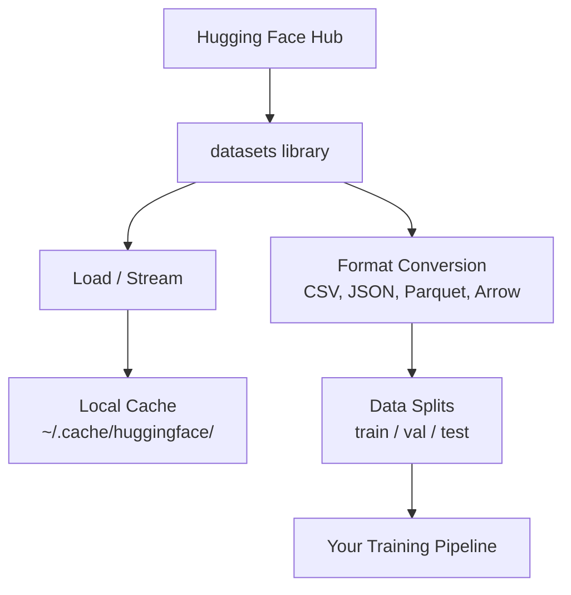

# 数据管理

> 数据是燃料。管理数据的方式,决定了你能跑多快。

**类型:** 动手构建
**编程语言:** Python
**前置要求:** 第 0 阶段, 第 01 课
**预计耗时:** 约 45 分钟

## 学习目标

- 用 Hugging Face `datasets` 库加载、流式读取和缓存数据集
- 在 CSV、JSON、Parquet、Arrow 格式之间转换,并讲清各自的取舍
- 用固定随机种子创建可复现的训练/验证/测试集划分
- 用 `.gitignore`、Git LFS 或 DVC 管理大型模型和数据集文件

## 问题

每个 AI 项目都从数据开始。你得找数据集、下载、转换格式、划分训练集和评估集,还要做版本管理,让实验可以复现。每次都手动做一遍,又慢又容易出错。你需要一套可重复的工作流。

## 概念



Hugging Face 的 `datasets` 库是 AI 工作加载数据的标准方式。下载、缓存、格式转换、流式读取,开箱即用。

```figure
s0-data-pipeline
```

## 动手构建

### 第 1 步:安装 datasets 库

```bash
pip install datasets huggingface_hub
```

### 第 2 步:加载数据集

```python
from datasets import load_dataset

dataset = load_dataset("stanfordnlp/imdb")
print(dataset)
print(dataset["train"][0])
```

这会下载 IMDB 电影评论数据集。第一次下载之后,就从 `~/.cache/huggingface/datasets/` 的缓存里加载。

### 第 3 步:流式读取大数据集

有些数据集大到磁盘都装不下。流式读取可以逐行处理,不用下载整个数据集。

```python
dataset = load_dataset("wikimedia/wikipedia", "20220301.en", split="train", streaming=True)

for i, example in enumerate(dataset):
    print(example["title"])
    if i >= 4:
        break
```

流式读取给你的是一个 `IterableDataset`,数据来一行处理一行。不管数据集多大,内存占用都是恒定的。

### 第 4 步:数据集格式

`datasets` 库底层用的是 Apache Arrow。你可以根据流水线的需要转成其他格式。

```python
dataset = load_dataset("stanfordnlp/imdb", split="train")

dataset.to_csv("imdb_train.csv")
dataset.to_json("imdb_train.json")
dataset.to_parquet("imdb_train.parquet")
```

格式对比:

| 格式 | 体积 | 读取速度 | 适用场景 |
|--------|------|-----------|----------|
| CSV | 大 | 慢 | 人类可读、电子表格 |
| JSON | 大 | 慢 | API、嵌套数据 |
| Parquet | 小 | 快 | 分析查询、列式查询 |
| Arrow | 小 | 最快 | 内存中处理(`datasets` 内部用的就是它) |

AI 工作中,Parquet 是最好的存储格式,Arrow 是内存里的工作格式,CSV 和 JSON 用来和外部交换数据。

### 第 5 步:数据集划分

每个 ML 项目都需要三份划分:

- **训练集(Train)**:模型从这里面学(通常 80%)
- **验证集(Validation)**:训练过程中检查进展(通常 10%)
- **测试集(Test)**:训练结束后做最终评估(通常 10%)

有些数据集自带划分。没有的话,自己切:

```python
dataset = load_dataset("stanfordnlp/imdb", split="train")

split = dataset.train_test_split(test_size=0.2, seed=42)
train_val = split["train"].train_test_split(test_size=0.125, seed=42)

train_ds = train_val["train"]
val_ds = train_val["test"]
test_ds = split["test"]

print(f"Train: {len(train_ds)}, Val: {len(val_ds)}, Test: {len(test_ds)}")
```

一定要设种子保证可复现。同样的种子,每次切出来的划分都一样。

### 第 6 步:下载和缓存模型

模型是大文件。`huggingface_hub` 库负责下载和缓存。

```python
from huggingface_hub import hf_hub_download, snapshot_download

model_path = hf_hub_download(
    repo_id="sentence-transformers/all-MiniLM-L6-v2",
    filename="config.json"
)
print(f"Cached at: {model_path}")

model_dir = snapshot_download("sentence-transformers/all-MiniLM-L6-v2")
print(f"Full model at: {model_dir}")
```

模型缓存到 `~/.cache/huggingface/hub/`。下载过一次,之后加载就是秒开。

### 第 7 步:处理大文件

模型权重和大数据集不该进 git。三个方案:

**方案 A:.gitignore(最简单)**

```
*.bin
*.safetensors
*.pt
*.onnx
data/*.parquet
data/*.csv
models/
```

**方案 B:Git LFS(用 git 追踪大文件)**

```bash
git lfs install
git lfs track "*.bin"
git lfs track "*.safetensors"
git add .gitattributes
```

Git LFS 在仓库里存指针,真正的文件存在另外的服务器上。GitHub 免费送 1 GB。

**方案 C:DVC(数据版本控制)**

```bash
pip install dvc
dvc init
dvc add data/training_set.parquet
git add data/training_set.parquet.dvc data/.gitignore
git commit -m "Track training data with DVC"
```

DVC 生成小小的 `.dvc` 文件指向你的数据。数据本体放在 S3、GCS 或其他远程存储里。

| 方案 | 复杂度 | 适用场景 |
|----------|-----------|----------|
| .gitignore | 低 | 个人项目、能重新下载的数据 |
| Git LFS | 中 | 团队通过 git 共享模型权重 |
| DVC | 高 | 需要复现的实验、大数据集、团队协作 |

本课程用 `.gitignore` 就够了。需要跨机器精确复现实验时,再上 DVC。

### 第 8 步:存储模式

**本地存储**适合 10 GB 以内的数据集,HF 缓存自动搞定。

**云存储**适合更大的数据集,或者需要跨机器共享的场景:

```python
import os

local_path = os.path.expanduser("~/.cache/huggingface/datasets/")

# s3_path = "s3://my-bucket/datasets/"
# gcs_path = "gs://my-bucket/datasets/"
```

DVC 可以直接对接 S3 和 GCS:

```bash
dvc remote add -d myremote s3://my-bucket/dvc-store
dvc push
```

本课程用本地存储就够了。等你开始在远程 GPU 实例上做微调时,云存储才会派上用场。

## 本课程用到的数据集

| 数据集 | 对应课程 | 大小 | 学什么 |
|---------|---------|------|----------------|
| IMDB | 分词、分类 | 84 MB | 文本分类基础 |
| WikiText | 语言建模 | 181 MB | 预测下一个 token |
| SQuAD | 问答系统 | 35 MB | 问答、文本片段抽取 |
| Common Crawl(子集) | 嵌入(embedding) | 不定 | 大规模文本处理 |
| MNIST | 视觉基础 | 21 MB | 图像分类基本功 |
| COCO(子集) | 多模态 | 不定 | 图文配对 |

现在不用全下载,每节课会写明需要什么。

## 投入使用

运行工具脚本,验证一切正常:

```bash
python code/data_utils.py
```

它会下载一个小数据集,做格式转换、划分,并打印摘要。

## 交付

本课产出:
- `code/data_utils.py` —— 可复用的数据加载与缓存工具
- `outputs/prompt-data-helper.md` —— 为任务找到合适数据集的提示词

## 练习

1. 加载 `glue` 数据集的 `mrpc` 配置,查看前 5 条样本
2. 流式读取 `c4` 数据集,数数 10 秒内你能处理多少条
3. 把一个数据集转成 Parquet,和 CSV 比比文件大小
4. 用固定种子做一个 70/15/15 的训练/验证/测试划分,验证各部分大小

## 关键术语

| 术语 | 大家嘴里的说法 | 实际含义 |
|------|----------------|----------------------|
| 数据集划分 | "训练数据" | 一份有名字的子集(train/val/test),用在 ML 生命周期的不同阶段 |
| 流式读取 | "懒加载" | 从远程数据源逐行处理数据,不下载整个数据集 |
| Parquet | "压缩版 CSV" | 一种列式文件格式,为分析查询和存储效率优化 |
| Arrow | "很快的 dataframe" | 一种内存列式格式,datasets 库内部用它实现零拷贝读取 |
| Git LFS | "大文件的 git" | 一个扩展,把大文件存在 git 仓库之外,版本控制里只留指针 |
| DVC | "数据的 git" | 面向数据集和模型的版本控制系统,可对接云存储 |
| 缓存(Cache) | "已经下载过了" | 之前拉取过的数据在本地留的副本,默认存在 ~/.cache/huggingface/ |
