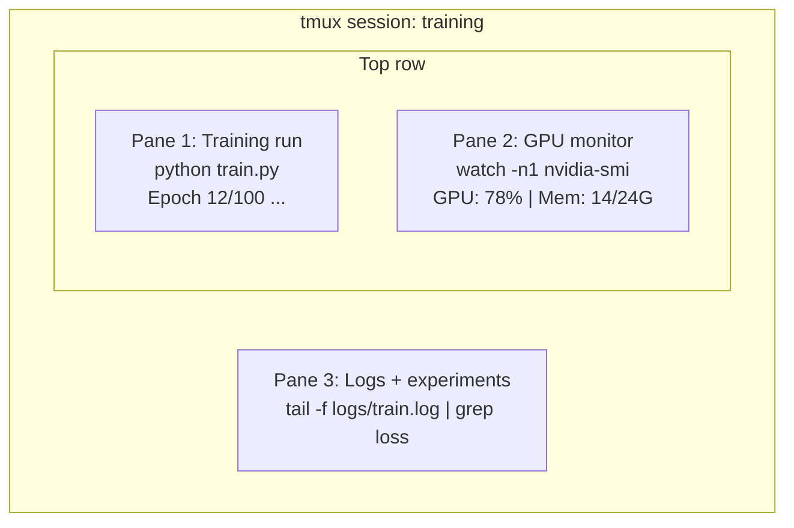

# 终端与 Shell

> AI 工程师活在终端里。在这儿混个脸熟。

**类型:** 学习
**编程语言:** --
**前置要求:** 第 0 阶段, 第 01 课
**预计耗时:** 约 35 分钟

## 学习目标

- 用管道、重定向和 `grep` 在命令行里过滤、处理训练日志
- 创建带多窗格的持久 tmux 会话,同时跑训练和监控 GPU
- 用 `htop`、`nvtop`、`nvidia-smi` 监控系统和 GPU 资源
- 用 SSH、`scp`、`rsync` 在本地和远程机器之间传文件

## 问题

你待在终端里的时间会比待在任何编辑器里都多。跑训练、盯 GPU、翻日志、远程 SSH、管环境——每条 AI 工作流都要过 shell 这一关。这里慢,处处慢。

本课只讲 AI 工作真正用得上的终端技能。不讲 Unix 历史,不深挖 Bash 脚本,只讲你需要的。

## 概念



三件事同时跑,只占一个终端。你可以 detach 走人、回家、SSH 回来再 attach,训练照跑不误。

```figure
s0-shell-pipeline
```

## 动手构建

### 第 1 步:认识你的 shell

看看你在用哪个 shell:

```bash
echo $SHELL
```

大多数系统用 `bash` 或 `zsh`,都行。本课程的命令两者通用。

必会的基本功:

```bash
# Move around
cd ~/projects/ai-engineering-from-scratch
pwd
ls -la

# History search (most useful shortcut you'll learn)
# Ctrl+R then type part of a previous command
# Press Ctrl+R again to cycle through matches

# Clear terminal
clear   # or Ctrl+L

# Cancel a running command
# Ctrl+C

# Suspend a running command (resume with fg)
# Ctrl+Z
```

### 第 2 步:管道与重定向

管道把命令串起来。处理日志、过滤输出、串联工具,全指望它。你会天天用。

```bash
# Count how many times "loss" appears in a log
cat train.log | grep "loss" | wc -l

# Extract just the loss values from training output
grep "loss:" train.log | awk '{print $NF}' > losses.txt

# Watch a log file update in real time, filtering for errors
tail -f train.log | grep --line-buffered "ERROR"

# Sort experiments by final accuracy
grep "final_accuracy" results/*.log | sort -t= -k2 -n -r

# Redirect stdout and stderr to separate files
python train.py > output.log 2> errors.log

# Redirect both to the same file
python train.py > train_full.log 2>&1
```

必会的三个重定向:

| 符号 | 作用 |
|--------|-------------|
| `>` | 把 stdout 写入文件(覆盖) |
| `>>` | 把 stdout 追加到文件 |
| `2>` | 把 stderr 写入文件 |
| `2>&1` | 把 stderr 送到 stdout 的去处 |
| `\|` | 把前一个命令的 stdout 作为后一个命令的 stdin |

### 第 3 步:后台进程

训练一跑就是几小时,你总不能让终端一直开着。

```bash
# Run in background (output still goes to terminal)
python train.py &

# Run in background, immune to hangup (closing terminal won't kill it)
nohup python train.py > train.log 2>&1 &

# Check what's running in background
jobs
ps aux | grep train.py

# Bring a background job to foreground
fg %1

# Kill a background process
kill %1
# or find its PID and kill that
kill $(pgrep -f "train.py")
```

`&`、`nohup`、`screen`/`tmux` 的区别:

| 方式 | 关掉终端还能活? | 能重新接管? |
|--------|-------------------------|---------------|
| `command &` | 不能 | 不能 |
| `nohup command &` | 能 | 不能(看日志文件) |
| `screen` / `tmux` | 能 | 能 |

超过几分钟的任务,一律用 tmux。

### 第 4 步:tmux

tmux 让你创建持久的终端会话,里面可以开多个窗格。管理训练任务,它是头号利器。

```bash
# Install
# macOS
brew install tmux
# Ubuntu
sudo apt install tmux

# Start a named session
tmux new -s training

# Split horizontally
# Ctrl+B then "

# Split vertically
# Ctrl+B then %

# Navigate between panes
# Ctrl+B then arrow keys

# Detach (session keeps running)
# Ctrl+B then d

# Reattach
tmux attach -t training

# List sessions
tmux ls

# Kill a session
tmux kill-session -t training
```

一个典型的 AI 工作流会话:

```bash
tmux new -s train

# Pane 1: start training
python train.py --epochs 100 --lr 1e-4

# Ctrl+B, " to split, then run GPU monitor
watch -n1 nvidia-smi

# Ctrl+B, % to split vertically, tail the logs
tail -f logs/experiment.log

# Now detach with Ctrl+B, d
# SSH out, go get coffee, come back
# tmux attach -t train
```

### 第 5 步:用 htop 和 nvtop 监控

```bash
# System processes (better than top)
htop

# GPU processes (if you have NVIDIA GPU)
# Install: sudo apt install nvtop (Ubuntu) or brew install nvtop (macOS)
nvtop

# Quick GPU check without nvtop
nvidia-smi

# Watch GPU usage update every second
watch -n1 nvidia-smi

# See which processes are using the GPU
nvidia-smi --query-compute-apps=pid,name,used_memory --format=csv
```

`htop` 常用按键:
- `F6` 或 `>` 按列排序(按内存排序可以揪出内存泄漏)
- `F5` 切换树状视图(看子进程)
- `F9` 杀掉进程
- `/` 按进程名搜索

### 第 6 步:SSH 连远程 GPU 机器

租云 GPU(Lambda、RunPod、Vast.ai)都是靠 SSH 连。

```bash
# Basic connection
ssh user@gpu-box-ip

# With a specific key
ssh -i ~/.ssh/my_gpu_key user@gpu-box-ip

# Copy files to remote
scp model.pt user@gpu-box-ip:~/models/

# Copy files from remote
scp user@gpu-box-ip:~/results/metrics.json ./

# Sync a whole directory (faster for many files)
rsync -avz ./data/ user@gpu-box-ip:~/data/

# Port forward (access remote Jupyter/TensorBoard locally)
ssh -L 8888:localhost:8888 user@gpu-box-ip
# Now open localhost:8888 in your browser

# SSH config for convenience
# Add to ~/.ssh/config:
# Host gpu
#     HostName 192.168.1.100
#     User ubuntu
#     IdentityFile ~/.ssh/gpu_key
#
# Then just:
# ssh gpu
```

### 第 7 步:AI 工作好用的别名(alias)

把下面这些加到你的 `~/.bashrc` 或 `~/.zshrc`:

```bash
source phases/00-setup-and-tooling/10-terminal-and-shell/code/shell_aliases.sh
```

或者挑你想要的复制过去。几个关键别名:

```bash
# GPU status at a glance
alias gpu='nvidia-smi --query-gpu=index,name,utilization.gpu,memory.used,memory.total,temperature.gpu --format=csv,noheader'

# Kill all Python training processes
alias killtraining='pkill -f "python.*train"'

# Quick virtual environment activate
alias ae='source .venv/bin/activate'

# Watch training loss
alias watchloss='tail -f logs/*.log | grep --line-buffered "loss"'
```

完整版见 `code/shell_aliases.sh`。

### 第 8 步:AI 终端常见套路

这些在实践中反复出现:

```bash
# Run training, log everything, notify when done
python train.py 2>&1 | tee train.log; echo "DONE" | mail -s "Training complete" you@email.com

# Compare two experiment logs side by side
diff <(grep "accuracy" exp1.log) <(grep "accuracy" exp2.log)

# Find the largest model files (clean up disk space)
find . -name "*.pt" -o -name "*.safetensors" | xargs du -h | sort -rh | head -20

# Download a model from Hugging Face
wget https://huggingface.co/model/resolve/main/model.safetensors

# Untar a dataset
tar xzf dataset.tar.gz -C ./data/

# Count lines in all Python files (see how big your project is)
find . -name "*.py" | xargs wc -l | tail -1

# Check disk space (training data fills disks fast)
df -h
du -sh ./data/*

# Environment variable check before training
env | grep -i cuda
env | grep -i torch
```

## 投入使用

本课程中各工具的出场时机:

| 工具 | 什么时候用 |
|------|----------------|
| tmux | 每一次训练(第 3 阶段 起) |
| `tail -f` + `grep` | 盯训练日志 |
| `nohup` / `&` | 临时的后台任务 |
| `htop` / `nvtop` | 排查训练变慢、OOM 错误 |
| SSH + `rsync` | 在云 GPU 上干活 |
| 管道 + 重定向 | 处理实验结果 |
| 别名 | 省掉重复敲命令的时间 |

## 练习

1. 安装 tmux,创建一个三窗格会话:一个跑 `htop`,一个跑 `watch -n1 date`,一个跑 Python 脚本。然后 detach 再 attach。
2. 把 `code/shell_aliases.sh` 里的别名加到你的 shell 配置,用 `source ~/.zshrc`(或 `~/.bashrc`)重新加载。
3. 用 `for i in $(seq 1 100); do echo "epoch $i loss: $(echo "scale=4; 1/$i" | bc)"; sleep 0.1; done > fake_train.log` 造一份假训练日志,然后用 `grep`、`tail`、`awk` 把 loss 值单独提取出来。
4. 给你能访问的某台服务器配一条 SSH config(没有的话用 `localhost` 练语法也行)。

## 关键术语

| 术语 | 大家嘴里的说法 | 实际含义 |
|------|----------------|----------------------|
| Shell | "那个终端" | 解释执行你命令的程序(bash、zsh、fish) |
| tmux | "终端复用器" | 一个程序,让你在一个窗口里跑多个终端会话,还能 detach/reattach |
| 管道(Pipe) | "那根竖线" | `\|` 操作符,把一个命令的输出送给另一个命令做输入 |
| PID | "进程 ID" | 每个运行中的进程分到的唯一编号,监控或杀进程时用它 |
| nohup | "不怕挂断" | 让命令对挂断信号免疫,关掉终端也杀不死它 |
| SSH | "连服务器" | Secure Shell,一种在远程机器上执行命令的加密协议 |
