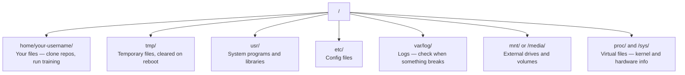

# AI 之 Linux 生存指南

> AI 大多跑在 Linux 上。你得学够本,别把自己卡住。

**类型:** 学习
**编程语言:** --
**前置要求:** 第 0 阶段, 第 01 课
**预计耗时:** 约 30 分钟

## 学习目标

- 在命令行里穿梭 Linux 文件系统,完成基本的文件操作
- 用 `chmod` 和 `chown` 管理文件权限,解决 "Permission denied" 报错
- 用 `apt` 安装系统软件包,把一台全新的 GPU 机器配成 AI 工作环境
- 识别 macOS 和 Linux 的常见差异,避免在远程机器上踩坑

## 问题

你平时在 macOS 或 Windows 上开发。但只要 SSH 上云 GPU、租一台 Lambda 实例、或者开一台 EC2,迎接你的就是 Ubuntu。终端是你唯一的界面:没有 Finder,没有资源管理器,没有图形界面。如果你不会用命令行逛文件系统、装软件包、管进程,那就只能一边为闲置的 GPU 时间烧钱,一边搜"Linux 怎么解压文件"。

这是一份生存指南,只讲你在远程 Linux 机器上做 AI 工作必需的东西。多一点都不讲。

## 文件系统布局

Linux 把所有东西组织在同一个根目录 `/` 下。没有 `C:\`,也没有 `/Volumes`。你真正会打交道的目录:



你的家目录是 `~`,也就是 `/home/your-username`。你几乎所有操作都发生在这里。

## 必会命令

下面 15 个命令,能覆盖你在远程 GPU 机器上 95% 的操作。

### 四处走动

```bash
pwd                         # Where am I?
ls                          # What's here?
ls -la                      # What's here, including hidden files with details?
cd /path/to/dir             # Go there
cd ~                        # Go home
cd ..                       # Go up one level
```

### 文件与目录

```bash
mkdir my-project            # Create a directory
mkdir -p a/b/c              # Create nested directories in one shot

cp file.txt backup.txt      # Copy a file
cp -r src/ src-backup/      # Copy a directory (recursive)

mv old.txt new.txt          # Rename a file
mv file.txt /tmp/           # Move a file

rm file.txt                 # Delete a file (no trash, it's gone)
rm -rf my-dir/              # Delete a directory and everything inside
```

`rm -rf` 是不可逆的,没有回收站,没有后悔药。敲回车前多看一眼路径。

### 读文件

```bash
cat file.txt                # Print entire file
head -20 file.txt           # First 20 lines
tail -20 file.txt           # Last 20 lines
tail -f log.txt             # Follow a log file in real time (Ctrl+C to stop)
less file.txt               # Scroll through a file (q to quit)
```

### 搜索

```bash
grep "error" training.log           # Find lines containing "error"
grep -r "learning_rate" .           # Search all files in current directory
grep -i "cuda" config.yaml          # Case-insensitive search

find . -name "*.py"                 # Find all Python files under current dir
find . -name "*.ckpt" -size +1G     # Find checkpoint files larger than 1GB
```

## 权限

Linux 里每个文件都有所有者和权限位。脚本跑不起来、目录写不进去,多半就是它在作怪。

```bash
ls -l train.py
# -rwxr-xr-- 1 user group 2048 Mar 19 10:00 train.py
#  ^^^             owner permissions: read, write, execute
#     ^^^          group permissions: read, execute
#        ^^        everyone else: read only
```

常见修法:

```bash
chmod +x train.sh           # Make a script executable
chmod 755 deploy.sh         # Owner: full, others: read+execute
chmod 644 config.yaml       # Owner: read+write, others: read only

chown user:group file.txt   # Change who owns a file (needs sudo)
```

遇到 "Permission denied",十有八九是权限问题。`chmod +x` 或 `sudo` 能解决大多数情况。

## 软件包管理(apt)

Ubuntu 用 `apt` 装系统级软件。

```bash
sudo apt update             # Refresh the package list (always do this first)
sudo apt install -y htop    # Install a package (-y skips confirmation)
sudo apt install -y build-essential  # C compiler, make, etc. Needed by many Python packages
sudo apt install -y tmux    # Terminal multiplexer (keep sessions alive after disconnect)

apt list --installed        # What's installed?
sudo apt remove htop        # Uninstall
```

一台全新的 GPU 机器上,你常装的包:

```bash
sudo apt update && sudo apt install -y \
    build-essential \
    git \
    curl \
    wget \
    tmux \
    htop \
    unzip \
    python3-venv
```

## 用户与 sudo

你一般以普通用户身份登录,有些操作需要 root(管理员)权限。

```bash
whoami                      # What user am I?
sudo command                # Run a single command as root
sudo su                     # Become root (exit to go back, use sparingly)
```

在云 GPU 实例上,你通常就是唯一的用户,自带 sudo 权限。别什么都用 root 跑,只在需要时用 sudo。

## 进程与 systemd

训练卡死了,或者想看看什么在跑:

```bash
htop                        # Interactive process viewer (q to quit)
ps aux | grep python        # Find running Python processes
kill 12345                  # Gracefully stop process with PID 12345
kill -9 12345               # Force kill (use when graceful doesn't work)
nvidia-smi                  # GPU processes and memory usage
```

systemd 管服务(后台守护进程)。跑推理服务时会用到:

```bash
sudo systemctl start nginx          # Start a service
sudo systemctl stop nginx           # Stop it
sudo systemctl restart nginx        # Restart it
sudo systemctl status nginx         # Check if it's running
sudo systemctl enable nginx         # Start automatically on boot
```

## 磁盘空间

GPU 机器的磁盘往往不大,模型和数据集很快就会把它塞满。

```bash
df -h                       # Disk usage for all mounted drives
df -h /home                 # Disk usage for /home specifically

du -sh *                    # Size of each item in current directory
du -sh ~/.cache             # Size of your cache (pip, huggingface models land here)
du -sh /data/checkpoints/   # Check how big your checkpoints are

# Find the biggest space hogs
du -h --max-depth=1 / 2>/dev/null | sort -hr | head -20
```

常用的省空间手段:

```bash
# Clear pip cache
pip cache purge

# Clear apt cache
sudo apt clean

# Remove old checkpoints you don't need
rm -rf checkpoints/epoch_01/ checkpoints/epoch_02/
```

## 网络

你会在命令行下载模型、传文件、调 API。

```bash
# Download files
wget https://example.com/model.bin                   # Download a file
curl -O https://example.com/data.tar.gz              # Same thing with curl
curl -s https://api.example.com/health | python3 -m json.tool  # Hit an API, pretty-print JSON

# Transfer files between machines
scp model.bin user@remote:/data/                     # Copy file to remote machine
scp user@remote:/data/results.csv .                  # Copy file from remote to local
scp -r user@remote:/data/checkpoints/ ./local-dir/   # Copy directory

# Sync directories (faster than scp for large transfers, resumes on failure)
rsync -avz --progress ./data/ user@remote:/data/
rsync -avz --progress user@remote:/results/ ./results/
```

大文件一律用 `rsync` 而不是 `scp`。它只传有变化的字节,连接断了还能续传。

## tmux:让会话常驻

SSH 到远程机器后,笔记本一合,训练就死了。tmux 能防这个。

```bash
tmux new -s train           # Start a new session named "train"
# ... start your training, then:
# Ctrl+B, then D            # Detach (training keeps running)

tmux ls                     # List sessions
tmux attach -t train        # Reattach to session

# Inside tmux:
# Ctrl+B, then %            # Split pane vertically
# Ctrl+B, then "            # Split pane horizontally
# Ctrl+B, then arrow keys   # Switch between panes
```

长时间训练任务,永远在 tmux 里跑。永远。

## Windows 用户的 WSL2

如果你用 Windows,WSL2 让你不用双系统也能有真正的 Linux 环境。

```bash
# In PowerShell (admin)
wsl --install -d Ubuntu-24.04

# After restart, open Ubuntu from Start menu
sudo apt update && sudo apt upgrade -y
```

WSL2 跑的是真正的 Linux 内核,本课所有内容在里面都适用。在 WSL 里,你的 Windows 文件位于 `/mnt/c/Users/YourName/`。

Windows 侧装好 NVIDIA 驱动后,GPU 透传就能用。装 Windows 版 NVIDIA 驱动(不是 Linux 版),WSL2 里面就能用 CUDA。

## 避坑:从 macOS 到 Linux

从 macOS 过来容易踩的坑:

| macOS | Linux | 备注 |
|-------|-------|-------|
| `brew install` | `sudo apt install` | 包名有时不一样。`brew install htop` 对 `sudo apt install htop` 没问题,但 `brew install readline` 对应的可不是 `sudo apt install readline`,而是 `libreadline-dev`。 |
| `open file.txt` | `xdg-open file.txt` | 但远程机器上没有图形界面,用 `cat` 或 `less`。 |
| `pbcopy` / `pbpaste` | 没有 | SSH 里不存在和剪贴板互传这回事。 |
| `~/.zshrc` | `~/.bashrc` | macOS 默认 zsh,Linux 服务器大多用 bash。 |
| `/opt/homebrew/` | `/usr/bin/`、`/usr/local/bin/` | 可执行文件放的地方不一样。 |
| `sed -i '' 's/a/b/' file` | `sed -i 's/a/b/' file` | macOS 的 sed 在 `-i` 后面要跟一个空字符串,Linux 不用。 |
| 大小写不敏感的文件系统 | 大小写敏感的文件系统 | 在 Linux 上,`Model.py` 和 `model.py` 是两个不同的文件。 |
| 换行符 `\n` | 换行符 `\n` | 一样。但 Windows 用 `\r\n`,会把 bash 脚本搞坏,跑 `dos2unix` 修一下。 |

## 速查卡

```
Navigation:     pwd, ls, cd, find
Files:          cp, mv, rm, mkdir, cat, head, tail, less
Search:         grep, find
Permissions:    chmod, chown, sudo
Packages:       apt update, apt install
Processes:      htop, ps, kill, nvidia-smi
Services:       systemctl start/stop/restart/status
Disk:           df -h, du -sh
Network:        curl, wget, scp, rsync
Sessions:       tmux new/attach/detach
```

```figure
s0-process-fork
```

## 练习

1. SSH 到任意一台 Linux 机器(或打开 WSL2),进入家目录。建一个项目文件夹,用 `touch` 在里面建三个空文件,再用 `ls -la` 列出来。
2. 用 apt 装 `htop`,运行它,找出占内存最多的进程。
3. 开一个 tmux 会话,在里面跑 `sleep 300`,detach,列出会话,再 attach 回去。
4. 用 `df -h` 看可用磁盘空间,再用 `du -sh ~/.cache/*` 找出缓存里最占地方的东西。
5. 用 `scp` 从本地往远程机器传一个文件,再用 `rsync` 传一次,对比一下体验。
