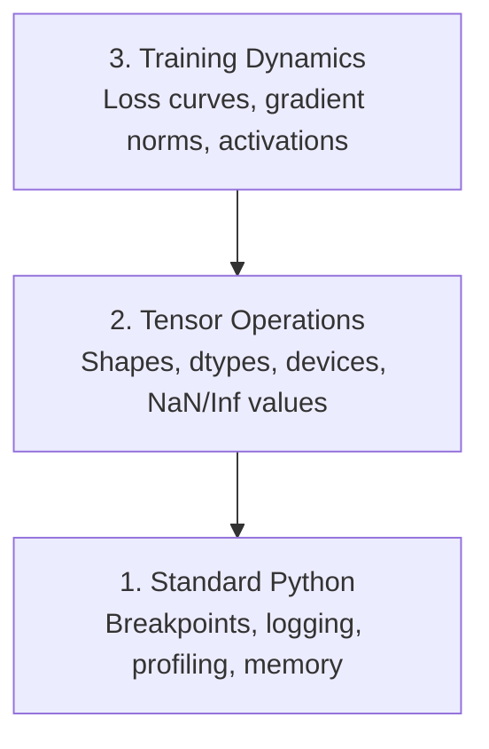

# 调试与性能分析

> 最要命的 AI bug 不会崩溃。它们悄无声息地拿垃圾数据训练,还给你画出一条漂亮的 loss 曲线。

**类型:** 动手构建
**编程语言:** Python
**前置要求:** 第 1 课(开发环境),基本的 PyTorch 使用经验
**预计耗时:** 约 60 分钟

## 学习目标

- 用条件 `breakpoint()` 和 `debug_print` 在训练途中检查张量形状、dtype 和 NaN 值
- 用 `cProfile`、`line_profiler`、`tracemalloc` 给训练循环做性能分析,揪出瓶颈
- 识别常见 AI bug:形状不匹配、NaN loss、数据泄漏、设备放错的张量
- 配置 TensorBoard,可视化 loss 曲线、权重直方图和梯度分布

## 问题

AI 代码的坏法和普通代码不一样。Web 应用崩了会给你堆栈信息。而一个配错的训练循环会跑上 8 小时、烧掉 $200 的 GPU 费用,最后产出一个对所有输入都预测均值的模型。代码从头到尾没报过任何错。bug 可能只是一个放错设备的张量、一个忘了写的 `.detach()`、或者标签混进了特征里。

你需要能在这些"静默失败"浪费你的时间和算力之前就把它们逮住的调试工具。

## 概念

AI 调试分三个层次:



大多数人直接跳到第 3 层(盯着 TensorBoard 看)。但 80% 的 AI bug 藏在第 1 层和第 2 层。

```figure
s0-flame-hot
```

## 动手构建

### 第 1 部分:print 调试(没错,就是好使)

print 调试总被人瞧不起,其实不该。对付张量代码,一条精准的 print 强过在调试器里单步,因为你要同时看到形状、dtype 和取值范围。

```python
def debug_print(name, tensor):
    print(f"{name}: shape={tensor.shape}, dtype={tensor.dtype}, "
          f"device={tensor.device}, "
          f"min={tensor.min().item():.4f}, max={tensor.max().item():.4f}, "
          f"mean={tensor.mean().item():.4f}, "
          f"has_nan={tensor.isnan().any().item()}")
```

在每个可疑操作后面调它。bug 找到后把 print 删掉。就这么简单。

### 第 2 部分:Python 调试器(pdb 和 breakpoint)

内置调试器在 AI 工作中被低估了。把 `breakpoint()` 丢进训练循环,就能交互式地检查张量。

```python
def training_step(model, batch, criterion, optimizer):
    inputs, labels = batch
    outputs = model(inputs)
    loss = criterion(outputs, labels)

    if loss.item() > 100 or torch.isnan(loss):
        breakpoint()

    loss.backward()
    optimizer.step()
```

进入调试器后,常用命令:

- `p outputs.shape` 看形状
- `p loss.item()` 看 loss 值
- `p torch.isnan(outputs).sum()` 数 NaN 个数
- `p model.fc1.weight.grad` 看梯度
- `c` 继续,`q` 退出

这叫条件调试:只在看起来不对劲的时候停下来。对于一万步的训练,这一点至关重要。

### 第 3 部分:Python 日志(logging)

当调试不再是"快速看一眼"就能解决时,把 print 换成 logging。

```python
import logging

logging.basicConfig(
    level=logging.INFO,
    format="%(asctime)s [%(levelname)s] %(message)s",
    handlers=[
        logging.FileHandler("training.log"),
        logging.StreamHandler()
    ]
)
logger = logging.getLogger(__name__)

logger.info("Starting training: lr=%.4f, batch_size=%d", lr, batch_size)
logger.warning("Loss spike detected: %.4f at step %d", loss.item(), step)
logger.error("NaN loss at step %d, stopping", step)
```

logging 给你时间戳、严重级别和文件输出。凌晨三点训练挂了,你要的是一份日志文件,而不是早就滚出屏幕的终端输出。

### 第 4 部分:给代码段计时

知道时间花在哪儿,是优化的第一步。

```python
import time

class Timer:
    def __init__(self, name=""):
        self.name = name

    def __enter__(self):
        self.start = time.perf_counter()
        return self

    def __exit__(self, *args):
        elapsed = time.perf_counter() - self.start
        print(f"[{self.name}] {elapsed:.4f}s")

with Timer("data loading"):
    batch = next(dataloader_iter)

with Timer("forward pass"):
    outputs = model(batch)

with Timer("backward pass"):
    loss.backward()
```

常见发现:数据加载占了训练时间的 60%。解法是 DataLoader 里设 `num_workers > 0`,而不是换更快的 GPU。

### 第 5 部分:cProfile 和 line_profiler

手动计时不够用时:

```bash
python -m cProfile -s cumtime train.py
```

它会按累计时间列出所有函数调用。想看逐行的耗时:

```bash
pip install line_profiler
```

```python
@profile
def train_step(model, data, target):
    output = model(data)
    loss = F.cross_entropy(output, target)
    loss.backward()
    return loss

# Run with: kernprof -l -v train.py
```

### 第 6 部分:内存分析

#### 用 tracemalloc 看 CPU 内存

```python
import tracemalloc

tracemalloc.start()

# your code here
model = build_model()
data = load_dataset()

snapshot = tracemalloc.take_snapshot()
top_stats = snapshot.statistics("lineno")
for stat in top_stats[:10]:
    print(stat)
```

#### 用 memory_profiler 看 CPU 内存

```bash
pip install memory_profiler
```

```python
from memory_profiler import profile

@profile
def load_data():
    raw = read_csv("data.csv")       # watch memory jump here
    processed = preprocess(raw)       # and here
    return processed
```

用 `python -m memory_profiler your_script.py` 运行,就能看到逐行的内存占用。

#### 用 PyTorch 看 GPU 内存

```python
import torch

if torch.cuda.is_available():
    print(torch.cuda.memory_summary())

    print(f"Allocated: {torch.cuda.memory_allocated() / 1e9:.2f} GB")
    print(f"Cached: {torch.cuda.memory_reserved() / 1e9:.2f} GB")
```

撞上 OOM(显存不足)时:

1. 减小批次大小(永远是第一招)
2. 用 `torch.cuda.empty_cache()` 释放缓存显存
3. 对大型中间张量,先 `del tensor` 再 `torch.cuda.empty_cache()`
4. 用混合精度(`torch.cuda.amp`)把显存占用减半
5. 对特别深的模型用梯度检查点(gradient checkpointing)

### 第 7 部分:常见 AI bug 及抓捕方法

#### 形状不匹配

最高发的 bug。张量是 `[batch, features]`,模型要的却是 `[batch, channels, height, width]`。

```python
def check_shapes(model, sample_input):
    print(f"Input: {sample_input.shape}")
    hooks = []

    def make_hook(name):
        def hook(module, inp, out):
            in_shape = inp[0].shape if isinstance(inp, tuple) else inp.shape
            out_shape = out.shape if hasattr(out, "shape") else type(out)
            print(f"  {name}: {in_shape} -> {out_shape}")
        return hook

    for name, module in model.named_modules():
        hooks.append(module.register_forward_hook(make_hook(name)))

    with torch.no_grad():
        model(sample_input)

    for h in hooks:
        h.remove()
```

拿一个样本批次跑一遍,模型里每一次形状变换都清清楚楚。

#### NaN 损失(NaN Loss)

NaN loss 意味着有东西炸了。常见原因:

- 学习率太高
- 自定义 loss 里除以零
- 对零或负数取了 log
- RNN 里梯度爆炸

```python
def detect_nan(model, loss, step):
    if torch.isnan(loss):
        print(f"NaN loss at step {step}")
        for name, param in model.named_parameters():
            if param.grad is not None:
                if torch.isnan(param.grad).any():
                    print(f"  NaN gradient in {name}")
                if torch.isinf(param.grad).any():
                    print(f"  Inf gradient in {name}")
        return True
    return False
```

#### 数据泄漏

模型在测试集上拿了 99% 准确率。听起来很美,其实是 bug。

```python
def check_data_leakage(train_set, test_set, id_column="id"):
    train_ids = set(train_set[id_column].tolist())
    test_ids = set(test_set[id_column].tolist())
    overlap = train_ids & test_ids
    if overlap:
        print(f"DATA LEAKAGE: {len(overlap)} samples in both train and test")
        return True
    return False
```

还要查时间维度的泄漏:用未来的数据预测过去。划分前先按时间戳排序。

#### 设备放错

张量在不同设备上(CPU 和 GPU 混着)会直接报运行时错误。但有时候某个张量悄悄留在 CPU 上,其他都在 GPU 上,训练只是变慢了,什么都不报。

```python
def check_devices(model, *tensors):
    model_device = next(model.parameters()).device
    print(f"Model device: {model_device}")
    for i, t in enumerate(tensors):
        if t.device != model_device:
            print(f"  WARNING: tensor {i} on {t.device}, model on {model_device}")
```

### 第 8 部分:TensorBoard 基础

TensorBoard 让你看到训练过程中随时间发生的一切。

```bash
pip install tensorboard
```

```python
from torch.utils.tensorboard import SummaryWriter

writer = SummaryWriter("runs/experiment_1")

for step in range(num_steps):
    loss = train_step(model, batch)

    writer.add_scalar("loss/train", loss.item(), step)
    writer.add_scalar("lr", optimizer.param_groups[0]["lr"], step)

    if step % 100 == 0:
        for name, param in model.named_parameters():
            writer.add_histogram(f"weights/{name}", param, step)
            if param.grad is not None:
                writer.add_histogram(f"grads/{name}", param.grad, step)

writer.close()
```

启动:

```bash
tensorboard --logdir=runs
```

看什么:

- **Loss 不降**:学习率太低,或模型结构有问题
- **Loss 剧烈震荡**:学习率太高
- **Loss 变成 NaN**:数值不稳定(见上面的 NaN 部分)
- **训练 loss 在降、验证 loss 在升**:过拟合
- **权重直方图塌缩到零**:梯度消失
- **梯度直方图爆炸**:该上梯度裁剪了

### 第 9 部分:VS Code 调试器

交互式调试,给 VS Code 配一个 `launch.json`:

```json
{
    "version": "0.2.0",
    "configurations": [
        {
            "name": "Debug Training",
            "type": "debugpy",
            "request": "launch",
            "program": "${file}",
            "console": "integratedTerminal",
            "justMyCode": false
        }
    ]
}
```

点行号旁边的边栏设断点。用变量面板查看张量属性。调试控制台可以在执行到一半时跑任意 Python 表达式。

单步跟踪数据预处理流水线、想看每一步变换时,这个特别好用。

## 投入使用

能逮住大多数 AI bug 的调试流程:

1. **训练前**:用样本批次跑 `check_shapes`,确认输入输出维度符合预期。
2. **头 10 步**:对 loss、输出、梯度用 `debug_print`,确认没有 NaN、取值在合理范围。
3. **训练中**:记录 loss、学习率、梯度范数,用 TensorBoard 可视化。
4. **出问题时**:在故障点丢一个 `breakpoint()`,交互式检查张量。
5. **搞性能时**:分别计时数据加载、前向、反向。快 OOM 了就做内存分析。

## 交付

运行调试工具脚本:

```bash
python phases/00-setup-and-tooling/12-debugging-and-profiling/code/debug_tools.py
```

另见 `outputs/prompt-debug-ai-code.md`,里面有一条帮你诊断 AI 专属 bug 的提示词。

## 练习

1. 运行 `debug_tools.py`,通读每一部分的输出。改动那个示例模型引入一个 NaN(提示:在前向传播里除以零),看检测器逮住它。
2. 用 `cProfile` 分析一个训练循环,找出最慢的函数。
3. 用 `tracemalloc` 找出数据加载流水线里分配内存最多的那一行。
4. 给一个简单训练任务配上 TensorBoard,判断模型是否过拟合。
5. 在训练循环里用 `breakpoint()`,练习在调试器提示符下检查张量形状、设备和梯度值。
