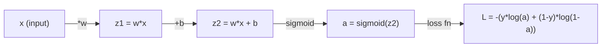
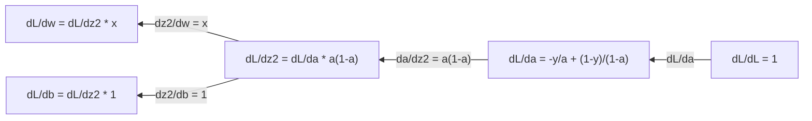
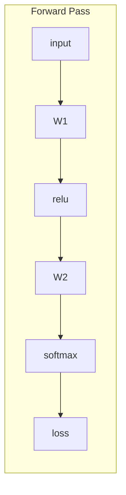
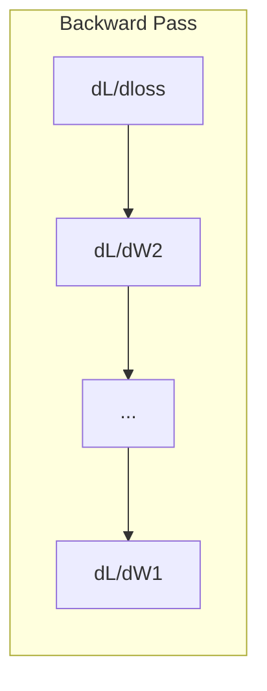

# 机器学习中的微积分

> 导数告诉你哪个方向是下坡。神经网络学习所需的全部,也就是这个。

**类型:** 学习
**编程语言:** Python
**前置要求:** 第 1 阶段,第 01–03 课
**预计耗时:** 约 60 分钟

## 学习目标

- 为机器学习中的常见函数(x²、sigmoid、交叉熵)计算数值导数和解析导数
- 从零实现梯度下降,在一维和二维中最小化损失函数
- 推导线性回归模型的梯度,并通过手动更新权重来训练它
- 解释 Hessian 矩阵、泰勒级数近似,以及它们与优化方法的联系

## 问题

你有一个神经网络,里面有上百万个权重。每个权重都是一个旋钮。你需要弄清楚每个旋钮该往哪个方向拧,才能让模型少错一点。微积分给你的就是这个方向。

没有微积分,训练神经网络只能靠瞎试乱改、祈祷好运。有了导数,你能精确知道每个权重对误差的影响——每次都把每个旋钮拧对方向。

## 概念

### 什么是导数?

导数衡量变化率。对于函数 y = f(x),导数 f'(x) 回答的是:把 x 轻轻拨动一丁点,y 会变化多少?

几何上,导数是函数在某点处切线的斜率。

**f(x) = x²:**

| x | f(x) | f'(x)(斜率) |
|---|------|---------------|
| 0 | 0    | 0(平的,在谷底) |
| 1 | 1    | 2 |
| 2 | 4    | 4(该点切线的斜率) |
| 3 | 9    | 6 |

在 x=2 处,斜率是 4:x 向右挪动一丁点,y 大约增加那丁点的 4 倍。在 x=0 处,斜率是 0——你正站在碗底。

形式化定义:

```
f'(x) = lim   f(x + h) - f(x)
        h->0  -----------------
                     h
```

在代码里,你跳过取极限这一步,直接用一个很小的 h。这就是数值导数。

### 偏导数:一次只看一个变量

真实函数有许多输入,神经网络的损失依赖成千上万个权重。偏导数把其他所有变量固定住,只对其中一个变量求导。

```
f(x, y) = x^2 + 3xy + y^2

df/dx = 2x + 3y     (treat y as a constant)
df/dy = 3x + 2y     (treat x as a constant)
```

每个偏导数回答的问题是:如果只拨动这一个权重,损失会怎么变?

### 梯度:所有偏导数组成的向量

梯度把每个偏导数收进一个向量。对函数 f(x, y, z),梯度是:

```
grad f = [ df/dx, df/dy, df/dz ]
```

梯度指向最陡的上升方向。要最小化一个函数,就往反方向走。

**f(x,y) = x² + y² 的等高线图:**

这个函数呈碗形,等高线是一圈圈同心圆,最小值在 (0, 0)。

| 点 | grad f | -grad f(下降方向) |
|-------|--------|----------------------------|
| (1, 1) | [2, 2](指向坡上,远离最小值) | [-2, -2](指向坡下,朝向最小值) |
| (0, 0) | [0, 0](平的,就在最小值处) | [0, 0] |

这就是画在图里的梯度下降:算梯度、取负、走一步。

### 与优化的联系

训练神经网络就是优化。你有一个损失函数 L(w1, w2, ..., wn),衡量模型错得有多离谱,而你想把它最小化。

```
Gradient descent update rule:

  w_new = w_old - learning_rate * dL/dw

For every weight:
  1. Compute the partial derivative of loss with respect to that weight
  2. Subtract a small multiple of it from the weight
  3. Repeat
```

学习率控制步长。太大,一步迈过头;太小,慢如蜗牛。

**损失地形(一维切片):**

损失函数 L(w) 随权重 w 变化,形成一条有峰有谷的曲线。

| 特征 | 描述 |
|---------|-------------|
| 全局最小值 | 整条曲线的最低点——最优解 |
| 局部最小值 | 比邻居低、但不是全局最低的山谷 |
| 斜率 | 从任意起点出发,梯度下降沿斜率向下走 |

梯度下降沿斜率下坡。它可能卡在局部最小值里,但在高维空间(上百万权重)中,这在实践中很少是问题。

### 数值导数 vs 解析导数

计算导数有两条路。

解析法:手动套用微积分规则。f(x) = x² 的导数是 f'(x) = 2x。精确、快速。

数值法:用定义逼近。取一个很小的 h,算出 f(x+h) 和 f(x-h),再求差。

```
Numerical (central difference):

f'(x) ~= f(x + h) - f(x - h)
          -----------------------
                  2h

h = 0.0001 works well in practice
```

数值导数较慢,但对任何函数都管用;解析导数快,但要求你推出公式。神经网络框架用的是第三条路:自动微分——机械地算出精确导数。你将在 第 3 阶段 见到它。

### 简单函数的手算导数

这些是你在机器学习里会反复见到的导数。

```
Function        Derivative       Used in
--------        ----------       -------
f(x) = x^2     f'(x) = 2x      Loss functions (MSE)
f(x) = wx + b  f'(w) = x        Linear layer (gradient w.r.t. weight)
                f'(b) = 1        Linear layer (gradient w.r.t. bias)
                f'(x) = w        Linear layer (gradient w.r.t. input)
f(x) = e^x     f'(x) = e^x     Softmax, attention
f(x) = ln(x)   f'(x) = 1/x     Cross-entropy loss
f(x) = 1/(1+e^-x)  f'(x) = f(x)(1-f(x))   Sigmoid activation
```

对于 f(x) = x²:

```
f(x) = x^2    f'(x) = 2x

  x    f(x)   f'(x)   meaning
  -2    4      -4      slope tilts left (decreasing)
  -1    1      -2      slope tilts left (decreasing)
   0    0       0      flat (minimum!)
   1    1       2      slope tilts right (increasing)
   2    4       4      slope tilts right (increasing)
```

对于 f(w) = wx + b,取 x=3、b=1:

```
f(w) = 3w + 1    f'(w) = 3

The derivative with respect to w is just x.
If x is big, a small change in w causes a big change in output.
```

### 链式法则

函数复合时,链式法则告诉你怎么求导。

```
If y = f(g(x)), then dy/dx = f'(g(x)) * g'(x)

Example: y = (3x + 1)^2
  outer: f(u) = u^2       f'(u) = 2u
  inner: g(x) = 3x + 1    g'(x) = 3
  dy/dx = 2(3x + 1) * 3 = 6(3x + 1)
```

神经网络就是一条函数链:输入 → 线性层 → 激活 → 线性层 → 激活 → 损失。反向传播(backpropagation)就是从输出端往输入端反复套用链式法则。这就是算法的全部。

### Hessian 矩阵

梯度告诉你斜率,Hessian 告诉你曲率。

Hessian 是二阶偏导数组成的矩阵。对函数 f(x1, x2, ..., xn),Hessian 的第 (i, j) 个元素是:

```
H[i][j] = d^2f / (dx_i * dx_j)
```

对于二元函数 f(x, y):

```
H = | d^2f/dx^2    d^2f/dxdy |
    | d^2f/dydx    d^2f/dy^2 |
```

**在临界点(梯度为 0 处),Hessian 告诉你什么:**

| Hessian 的性质 | 含义 | 对应曲面 |
|-----------------|---------|-----------------|
| 正定(所有特征值 > 0) | 局部最小值 | 开口向上的碗 |
| 负定(所有特征值 < 0) | 局部最大值 | 开口向下的碗 |
| 不定(特征值有正有负) | 鞍点 | 马鞍形 |

**例子:** f(x, y) = x² - y²(鞍面)

```
df/dx = 2x       df/dy = -2y
d^2f/dx^2 = 2    d^2f/dy^2 = -2    d^2f/dxdy = 0

H = | 2   0 |
    | 0  -2 |

Eigenvalues: 2 and -2 (one positive, one negative)
--> Saddle point at (0, 0)
```

对比一下 f(x, y) = x² + y²(碗面):

```
H = | 2  0 |
    | 0  2 |

Eigenvalues: 2 and 2 (both positive)
--> Local minimum at (0, 0)
```

**为什么 Hessian 在机器学习中重要:**

牛顿法利用 Hessian,能迈出比梯度下降更好的优化步子。它不只沿斜率走,还考虑曲率:

```
Newton's update:    w_new = w_old - H^(-1) * gradient
Gradient descent:   w_new = w_old - lr * gradient
```

牛顿法收敛更快,因为 Hessian 对梯度做了"重新缩放"——陡的方向步子变小,平的方向步子变大。

问题在于:有 N 个参数的神经网络,Hessian 就是 N×N。一个百万参数的模型需要一张万亿个元素的矩阵。所以我们用近似方法。

| 方法 | 用什么 | 代价 | 收敛速度 |
|--------|-------------|------|-------------|
| 梯度下降 | 只用一阶导数 | 每步 O(N) | 慢(线性) |
| 牛顿法 | 完整 Hessian | 每步 O(N³) | 快(二次) |
| L-BFGS | 由梯度历史近似 Hessian | 每步 O(N) | 中(超线性) |
| Adam | 逐参数自适应学习率(对角 Hessian 近似) | 每步 O(N) | 中 |
| 自然梯度 | Fisher 信息矩阵(统计意义上的 Hessian) | 每步 O(N²) | 快 |

实践中,Adam 是深度学习的默认优化器。它通过跟踪每个参数梯度的滑动均值和方差,以很低的代价近似二阶信息。

### 泰勒级数近似

任何光滑函数都可以在局部用多项式逼近:

```
f(x + h) = f(x) + f'(x)*h + (1/2)*f''(x)*h^2 + (1/6)*f'''(x)*h^3 + ...
```

项取得越多,逼近越好——但只在 x 附近成立。

**为什么泰勒级数对机器学习重要:**

- **一阶泰勒 = 梯度下降。** 当你写下 f(x + h) ≈ f(x) + f'(x)*h,你就是在做线性近似。梯度下降最小化这个线性模型,选出 h = -lr * f'(x)。

- **二阶泰勒 = 牛顿法。** 用 f(x + h) ≈ f(x) + f'(x)*h + (1/2)*f''(x)*h²,你得到一个二次模型。最小化它给出 h = -f'(x)/f''(x)——这就是牛顿步。

- **损失函数的设计。** MSE 和交叉熵都是光滑的,泰勒展开性态良好。这不是巧合——光滑的损失让优化行为可预测。

```
Approximation order    What it captures    Optimization method
-------------------    -----------------   -------------------
0th order (constant)   Just the value      Random search
1st order (linear)     Slope               Gradient descent
2nd order (quadratic)  Curvature           Newton's method
Higher orders          Finer structure     Rarely used in ML
```

关键洞见:所有基于梯度的优化,本质都是在局部逼近损失函数,然后一步迈到那个近似的最小值处。

### 机器学习中的积分

导数告诉你变化率,积分计算累积量——曲线下的面积。

在机器学习里,你很少手算积分,但这个概念无处不在:

**概率。** 对密度为 p(x) 的连续随机变量:
```
P(a < X < b) = integral from a to b of p(x) dx
```
概率密度曲线在 a 到 b 之间的面积,就是落在该区间的概率。

**期望。** 按概率加权的平均结果:
```
E[f(X)] = integral of f(x) * p(x) dx
```
数据分布上的期望损失就是一个积分,训练时最小化的正是它的经验近似。

**KL 散度。** 衡量两个分布差多远:
```
KL(p || q) = integral of p(x) * log(p(x) / q(x)) dx
```
用于 VAE、知识蒸馏和贝叶斯推断。

**归一化常数。** 在贝叶斯推断中:
```
p(w | data) = p(data | w) * p(w) / integral of p(data | w) * p(w) dw
```
分母是对所有可能参数值的积分。它往往不可解,这正是我们使用 MCMC、变分推断等近似方法的原因。

| 积分概念 | 在机器学习中出现在哪 |
|-----------------|----------------------|
| 曲线下面积 | 由密度函数得到概率 |
| 期望 | 损失函数、风险最小化 |
| KL 散度 | VAE、策略优化、蒸馏 |
| 归一化 | 贝叶斯后验、softmax 分母 |
| 边缘似然 | 模型比较、证据下界(ELBO) |

### 计算图中的多元链式法则

链式法则不只适用于一条线上的标量函数。在神经网络里,变量会分叉也会汇合。下面看导数如何流经一次简单的前向传播:



反向传播从右往左计算梯度:



每个箭头都乘上局部导数。任何参数的梯度,就是从损失到该参数这条路径上所有局部导数的乘积。路径分叉再汇合时,把各条贡献加起来(多元链式法则)。

反向传播的全部内容就是:在计算图中系统地套用链式法则,从输出一路回到输入。

### Jacobian 矩阵

当函数把向量映射成向量(比如一个神经网络层)时,它的导数是一个矩阵。Jacobian 包含每个输出对每个输入的全部偏导数。

对于 f: R^n -> R^m,Jacobian J 是一个 m × n 矩阵:

| | x1 | x2 | ... | xn |
|---|---|---|---|---|
| f1 | df1/dx1 | df1/dx2 | ... | df1/dxn |
| f2 | df2/dx1 | df2/dx2 | ... | df2/dxn |
| ... | ... | ... | ... | ... |
| fm | dfm/dx1 | dfm/dx2 | ... | dfm/dxn |

你不会手算神经网络的 Jacobian——PyTorch 会处理。但知道它存在,能帮你理解反向传播中的形状:如果一个层把 R^n 映射到 R^m,它的 Jacobian 就是 m × n,梯度通过这个矩阵的转置往回流动。

### 为什么这对神经网络重要

神经网络里每个权重都有一个梯度,梯度告诉你该怎么调整这个权重才能降低损失。





每个权重的更新:
- `W1 = W1 - lr * dL/dW1`
- `W2 = W2 - lr * dL/dW2`

前向传播算出预测和损失,反向传播算出损失对每个权重的梯度,然后每个权重朝下坡迈一小步。重复上百万步。这就是深度学习。

```figure
derivative-tangent
```

## 动手构建

### 第 1 步:从零实现数值导数

```python
def numerical_derivative(f, x, h=1e-7):
    return (f(x + h) - f(x - h)) / (2 * h)

def f(x):
    return x ** 2

for x in [-2, -1, 0, 1, 2]:
    numerical = numerical_derivative(f, x)
    analytical = 2 * x
    print(f"x={x:2d}  f'(x) numerical={numerical:.6f}  analytical={analytical:.1f}")
```

数值导数与解析导数吻合到小数点后很多位。

### 第 2 步:偏导数与梯度

```python
def numerical_gradient(f, point, h=1e-7):
    gradient = []
    for i in range(len(point)):
        point_plus = list(point)
        point_minus = list(point)
        point_plus[i] += h
        point_minus[i] -= h
        partial = (f(point_plus) - f(point_minus)) / (2 * h)
        gradient.append(partial)
    return gradient

def f_multi(point):
    x, y = point
    return x**2 + 3*x*y + y**2

grad = numerical_gradient(f_multi, [1.0, 2.0])
print(f"Numerical gradient at (1,2): {[f'{g:.4f}' for g in grad]}")
print(f"Analytical gradient at (1,2): [2*1+3*2, 3*1+2*2] = [{2*1+3*2}, {3*1+2*2}]")
```

### 第 3 步:用梯度下降找 f(x) = x² 的最小值

```python
x = 5.0
lr = 0.1
for step in range(20):
    grad = 2 * x
    x = x - lr * grad
    print(f"step {step:2d}  x={x:8.4f}  f(x)={x**2:10.6f}")
```

从 x=5 出发,每一步都离最小值 x=0 更近。

### 第 4 步:在二维函数上做梯度下降

```python
def f_2d(point):
    x, y = point
    return x**2 + y**2

point = [4.0, 3.0]
lr = 0.1
for step in range(30):
    grad = numerical_gradient(f_2d, point)
    point = [p - lr * g for p, g in zip(point, grad)]
    loss = f_2d(point)
    if step % 5 == 0 or step == 29:
        print(f"step {step:2d}  point=({point[0]:7.4f}, {point[1]:7.4f})  f={loss:.6f}")
```

### 第 5 步:对比数值导数与解析导数

```python
import math

test_functions = [
    ("x^2",      lambda x: x**2,          lambda x: 2*x),
    ("x^3",      lambda x: x**3,          lambda x: 3*x**2),
    ("sin(x)",   lambda x: math.sin(x),   lambda x: math.cos(x)),
    ("e^x",      lambda x: math.exp(x),   lambda x: math.exp(x)),
    ("1/x",      lambda x: 1/x,           lambda x: -1/x**2),
]

x = 2.0
print(f"{'Function':<12} {'Numerical':>12} {'Analytical':>12} {'Error':>12}")
print("-" * 50)
for name, f, df in test_functions:
    num = numerical_derivative(f, x)
    ana = df(x)
    err = abs(num - ana)
    print(f"{name:<12} {num:12.6f} {ana:12.6f} {err:12.2e}")
```

### 第 6 步:数值计算 Hessian

```python
def hessian_2d(f, x, y, h=1e-5):
    fxx = (f(x + h, y) - 2 * f(x, y) + f(x - h, y)) / (h ** 2)
    fyy = (f(x, y + h) - 2 * f(x, y) + f(x, y - h)) / (h ** 2)
    fxy = (f(x + h, y + h) - f(x + h, y - h) - f(x - h, y + h) + f(x - h, y - h)) / (4 * h ** 2)
    return [[fxx, fxy], [fxy, fyy]]

def saddle(x, y):
    return x ** 2 - y ** 2

def bowl(x, y):
    return x ** 2 + y ** 2

H_saddle = hessian_2d(saddle, 0.0, 0.0)
H_bowl = hessian_2d(bowl, 0.0, 0.0)
print(f"Saddle Hessian: {H_saddle}")  # [[2, 0], [0, -2]] -- mixed signs
print(f"Bowl Hessian:   {H_bowl}")    # [[2, 0], [0, 2]]  -- both positive
```

鞍面函数的 Hessian 特征值是 2 和 -2(一正一负,确认是鞍点);碗面的特征值是 2 和 2(都为正,确认是最小值)。

### 第 7 步:泰勒近似实战

```python
import math

def taylor_approx(f, f_prime, f_double_prime, x0, h, order=2):
    result = f(x0)
    if order >= 1:
        result += f_prime(x0) * h
    if order >= 2:
        result += 0.5 * f_double_prime(x0) * h ** 2
    return result

x0 = 0.0
for h in [0.1, 0.5, 1.0, 2.0]:
    true_val = math.sin(h)
    t1 = taylor_approx(math.sin, math.cos, lambda x: -math.sin(x), x0, h, order=1)
    t2 = taylor_approx(math.sin, math.cos, lambda x: -math.sin(x), x0, h, order=2)
    print(f"h={h:.1f}  sin(h)={true_val:.4f}  order1={t1:.4f}  order2={t2:.4f}")
```

在 x0=0 附近,sin(x) ≈ x(一阶泰勒)。h 小时近似极好,h 大时就崩了。这就是为什么梯度下降配小学习率效果最好——每一步都假设线性近似是准确的。

### 第 8 步:为什么这对神经网络重要

```python
import random

random.seed(42)

w = random.gauss(0, 1)
b = random.gauss(0, 1)
lr = 0.01

xs = [1.0, 2.0, 3.0, 4.0, 5.0]
ys = [3.0, 5.0, 7.0, 9.0, 11.0]

for epoch in range(200):
    total_loss = 0
    dw = 0
    db = 0
    for x, y in zip(xs, ys):
        pred = w * x + b
        error = pred - y
        total_loss += error ** 2
        dw += 2 * error * x
        db += 2 * error
    dw /= len(xs)
    db /= len(xs)
    total_loss /= len(xs)
    w -= lr * dw
    b -= lr * db
    if epoch % 40 == 0 or epoch == 199:
        print(f"epoch {epoch:3d}  w={w:.4f}  b={b:.4f}  loss={total_loss:.6f}")

print(f"\nLearned: y = {w:.2f}x + {b:.2f}")
print(f"Actual:  y = 2x + 1")
```

每个基于梯度的训练循环都遵循这个模式:预测、算损失、算梯度、更新权重。

## 投入使用

用 NumPy 写,同样的运算更快、更简洁:

```python
import numpy as np

x = np.array([1, 2, 3, 4, 5], dtype=float)
y = np.array([3, 5, 7, 9, 11], dtype=float)

w, b = np.random.randn(), np.random.randn()
lr = 0.01

for epoch in range(200):
    pred = w * x + b
    error = pred - y
    loss = np.mean(error ** 2)
    dw = np.mean(2 * error * x)
    db = np.mean(2 * error)
    w -= lr * dw
    b -= lr * db

print(f"Learned: y = {w:.2f}x + {b:.2f}")
```

你刚刚从零造出了梯度下降。PyTorch 把梯度计算自动化了,但更新循环一模一样。

## 练习

1. 用 `numerical_derivative` 调用两次,实现 `numerical_second_derivative(f, x)`。验证 x³ 在 x=2 处的二阶导数是 12。
2. 用梯度下降求 f(x, y) = (x - 3)² + (y + 1)² 的最小值,从 (0, 0) 出发,结果应收敛到 (3, -1)。
3. 给梯度下降循环加上动量(momentum):维护一个累积历史梯度的速度向量。在 f(x) = x⁴ - 3x² 上对比有无动量的收敛速度。

## 关键术语

| 术语 | 人们常说的 | 实际含义 |
|------|----------------|----------------------|
| 导数 | "斜率" | 函数在某点的变化率,告诉你输入变化一个单位时输出变化多少 |
| 偏导数 | "对单个变量的导数" | 固定其他所有变量,只对其中一个变量求导 |
| 梯度 | "最陡上升方向" | 所有偏导数组成的向量,指向函数增长最快的方向 |
| 梯度下降 | "往山下走" | 从参数中减去梯度(乘以学习率)以降低损失。神经网络训练的核心 |
| 学习率 | "步长" | 控制梯度下降每步多大的标量。太大:发散;太小:收敛慢 |
| 链式法则 | "导数乘起来" | 复合函数的求导规则:df/dx = df/dg * dg/dx。反向传播的数学基础 |
| Jacobian | "导数矩阵" | 函数把向量映射成向量时,Jacobian 是所有输出对所有输入偏导数组成的矩阵 |
| 数值导数 | "有限差分" | 在两个邻近点求函数值,用两点间斜率逼近导数 |
| 反向传播 | "反向模式自动微分" | 用链式法则从输出到输入逐层计算梯度。神经网络的学习方式 |
| Hessian | "二阶导数矩阵" | 所有二阶偏导数组成的矩阵,描述函数的曲率。临界点处 Hessian 正定意味着局部最小值 |
| 泰勒级数 | "多项式逼近" | 用函数在某点的导数逼近附近的函数值:f(x+h) ≈ f(x) + f'(x)h + (1/2)f''(x)h² + …。理解梯度下降和牛顿法为何有效的基础 |
| 积分 | "曲线下面积" | 一个量在某个区间上的累积。在机器学习中,积分定义了概率、期望和 KL 散度 |

## 延伸阅读

- [3Blue1Brown:微积分的本质](https://www.3blue1brown.com/topics/calculus) —— 导数、积分和链式法则的可视化直觉
- [Stanford CS231n:反向传播](https://cs231n.github.io/optimization-2/) —— 梯度如何流经神经网络的各层
