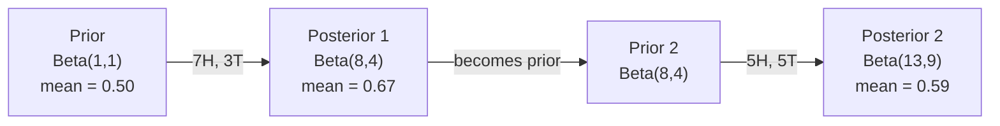

# 贝叶斯定理

> 概率论回答的是你期待什么,贝叶斯定理回答的是你学到了什么。

**类型:** 动手构建
**编程语言:** Python
**前置要求:** 第 1 阶段,第 06 课(概率基础)
**预计耗时:** 约 75 分钟

## 学习目标

- 运用贝叶斯定理,由先验、似然和证据计算后验概率
- 从零构建一个带拉普拉斯平滑和对数空间计算的朴素贝叶斯文本分类器
- 对比 MLE 与 MAP 估计,并解释 MAP 如何对应 L2 正则化
- 使用 Beta-Binomial 共轭先验实现序贯贝叶斯更新,用于 A/B 测试

## 问题

一项医学检测的准确率是 99%。你的检测结果呈阳性。你真正患病的概率是多少?

大多数人会说是 99%。真实答案取决于这种病有多罕见。如果每 1 万人中只有 1 人患病,阳性结果只意味着你大约有 1% 的患病概率。其余 99% 的阳性结果都是健康人的误报。

这不是脑筋急转弯,这就是贝叶斯定理。每一个垃圾邮件过滤器、每一项医学诊断、每一个量化不确定性的机器学习模型,用的都是这套推理。你先持有一个信念,看到证据,然后更新。

如果你在构建 ML 系统时不理解这一点,你就会误读模型输出、设错阈值,并把过度自信的预测发布上线。

## 概念

### 从联合概率到贝叶斯

你在第 06 课已经学过,条件概率是:

```
P(A|B) = P(A and B) / P(B)
```

对称地:

```
P(B|A) = P(A and B) / P(A)
```

两个式子共享同一个分子 P(A and B)。令它们相等并整理:

```
P(A and B) = P(A|B) * P(B) = P(B|A) * P(A)

Therefore:

P(A|B) = P(B|A) * P(A) / P(B)
```

这就是贝叶斯定理。四个量,一个方程。

### 四个组成部分

| 部分 | 名称 | 含义 |
|------|------|---------------|
| P(A\|B) | 后验(Posterior) | 看到证据 B 之后,你对 A 更新后的信念 |
| P(B\|A) | 似然(Likelihood) | 如果 A 为真,证据 B 出现的可能性有多大 |
| P(A) | 先验(Prior) | 在看到任何证据之前,你对 A 的信念 |
| P(B) | 证据(Evidence) | 在所有可能性下看到 B 的总概率 |

证据项 P(B) 起归一化作用。你可以用全概率公式展开它:

```
P(B) = P(B|A) * P(A) + P(B|not A) * P(not A)
```

### 医学检测示例

一种疾病影响 1 万人中的 1 人。检测准确率 99%(能查出 99% 的患者,假阳性率为 1%)。

```
P(sick)          = 0.0001     (prior: disease is rare)
P(positive|sick) = 0.99       (likelihood: test catches it)
P(positive|healthy) = 0.01    (false positive rate)

P(positive) = P(positive|sick) * P(sick) + P(positive|healthy) * P(healthy)
            = 0.99 * 0.0001 + 0.01 * 0.9999
            = 0.000099 + 0.009999
            = 0.010098

P(sick|positive) = P(positive|sick) * P(sick) / P(positive)
                 = 0.99 * 0.0001 / 0.010098
                 = 0.0098
                 = 0.98%
```

不到 1%。先验占主导地位。当一种情况很罕见时,即使是准确的检测,产生的大多数阳性也是假阳性。这就是医生会开复查确认的原因。

### 垃圾邮件过滤器示例

你收到一封含有 "lottery" 一词的邮件。它是垃圾邮件吗?

```
P(spam)                = 0.3      (30% of email is spam)
P("lottery"|spam)      = 0.05     (5% of spam emails contain "lottery")
P("lottery"|not spam)  = 0.001    (0.1% of legitimate emails contain "lottery")

P("lottery") = 0.05 * 0.3 + 0.001 * 0.7
             = 0.015 + 0.0007
             = 0.0157

P(spam|"lottery") = 0.05 * 0.3 / 0.0157
                  = 0.955
                  = 95.5%
```

一个词就把概率从 30% 推到了 95.5%。真正的垃圾邮件过滤器会同时对几百个词应用贝叶斯。

### 朴素贝叶斯:独立性假设

朴素贝叶斯把它推广到多个特征:假设给定类别时,所有特征条件独立:

```
P(class | feature_1, feature_2, ..., feature_n)
  = P(class) * P(feature_1|class) * P(feature_2|class) * ... * P(feature_n|class)
    / P(feature_1, feature_2, ..., feature_n)
```

"朴素"就朴素在这个独立性假设上。在文本里,词的出现并不独立("New" 和 "York" 是相关的)。但这个假设在实践中出奇地好用,因为分类器只需要给类别排序,不需要输出校准过的概率。

由于分母对所有类别都相同,你可以跳过它,只比较分子:

```
score(class) = P(class) * product of P(feature_i | class)
```

选得分最高的类别。

### 最大似然估计(MLE)

P(feature|class) 怎么从训练数据里来?数出来的。

```
P("free"|spam) = (number of spam emails containing "free") / (total spam emails)
```

这就是 MLE:选择让观测数据出现概率最大的参数值。你在最大化似然函数,而对离散计数来说,它就退化为相对频率。

问题:如果某个词在训练时从未在垃圾邮件里出现过,MLE 会给它零概率。一个没见过的词就能让整个连乘归零。用拉普拉斯平滑修复:

```
P(word|class) = (count(word, class) + 1) / (total_words_in_class + vocabulary_size)
```

给每个计数加 1,保证没有任何概率会是零。

### 最大后验估计(MAP)

MLE 问的是:什么参数最大化 P(data|parameters)?

MAP 问的是:什么参数最大化 P(parameters|data)?

由贝叶斯定理:

```
P(parameters|data) proportional to P(data|parameters) * P(parameters)
```

MAP 在参数本身之上加了一个先验。如果你相信参数应该比较小,就把这个信念编码成一个惩罚大取值的先验。这与 ML 中的 L2 正则化完全等价。岭回归里的 "ridge" 惩罚,字面上就是权重上的一个高斯先验。

| 估计方法 | 优化目标 | 对应的 ML 做法 |
|------------|-----------|---------------|
| MLE | P(data\|params) | 不加正则化的训练 |
| MAP | P(data\|params) * P(params) | L2 / L1 正则化 |

### 贝叶斯 vs 频率派:实践中的区别

频率派把参数当作固定的未知量。他们问:"如果我把这个实验重复很多次,会发生什么?"

贝叶斯派把参数当作分布。他们问:"根据我观测到的一切,我对参数应该抱有什么样的信念?"

对构建 ML 系统而言,实践上的区别是:

| 方面 | 频率派 | 贝叶斯派 |
|--------|-------------|----------|
| 输出 | 点估计 | 取值上的分布 |
| 不确定性 | 置信区间(关于流程) | 可信区间(关于参数) |
| 小数据 | 可能过拟合 | 先验充当正则化 |
| 计算 | 通常更快 | 常需采样(MCMC) |

大多数生产环境的 ML 是频率派的(SGD、点估计)。当你需要校准的不确定性(医疗决策、安全攸关系统)或数据稀缺(小样本学习、冷启动)时,贝叶斯方法大放异彩。

### 为什么贝叶斯思维对 ML 重要

这层联系远比类比深刻:

**先验就是正则化。** 权重上的高斯先验就是 L2 正则化,拉普拉斯先验就是 L1。每次你加正则项,都是在做一个贝叶斯式的陈述:你期望参数取什么样的值。

**后验就是不确定性。** 单个预测概率无法告诉你模型对这个估计有多自信。贝叶斯方法给你一个分布:"我认为 P(spam) 在 0.8 到 0.95 之间。"

**贝叶斯更新就是在线学习。** 今天的后验是明天的先验。当模型看到新数据时,它增量地更新信念,而不是从头重训。

**模型比较也是贝叶斯的。** 贝叶斯信息准则(BIC)、边际似然、贝叶斯因子,全都在用贝叶斯推理在不过拟合的前提下做模型选择。

```figure
bayes-update
```

## 动手构建

### 第 1 步:贝叶斯定理函数

```python
def bayes(prior, likelihood, false_positive_rate):
    evidence = likelihood * prior + false_positive_rate * (1 - prior)
    posterior = likelihood * prior / evidence
    return posterior

result = bayes(prior=0.0001, likelihood=0.99, false_positive_rate=0.01)
print(f"P(sick|positive) = {result:.4f}")
```

### 第 2 步:朴素贝叶斯分类器

```python
import math
from collections import defaultdict

class NaiveBayes:
    def __init__(self, smoothing=1.0):
        self.smoothing = smoothing
        self.class_counts = defaultdict(int)
        self.word_counts = defaultdict(lambda: defaultdict(int))
        self.class_word_totals = defaultdict(int)
        self.vocab = set()

    def train(self, documents, labels):
        for doc, label in zip(documents, labels):
            self.class_counts[label] += 1
            words = doc.lower().split()
            for word in words:
                self.word_counts[label][word] += 1
                self.class_word_totals[label] += 1
                self.vocab.add(word)

    def predict(self, document):
        words = document.lower().split()
        total_docs = sum(self.class_counts.values())
        vocab_size = len(self.vocab)
        best_class = None
        best_score = float("-inf")
        for cls in self.class_counts:
            score = math.log(self.class_counts[cls] / total_docs)
            for word in words:
                count = self.word_counts[cls].get(word, 0)
                total = self.class_word_totals[cls]
                score += math.log((count + self.smoothing) / (total + self.smoothing * vocab_size))
            if score > best_score:
                best_score = score
                best_class = cls
        return best_class
```

对数概率防止下溢。许多小概率连乘会产生浮点数无法表示的极小值。对数概率的求和在数值上稳定,在数学上等价。

### 第 3 步:在垃圾邮件数据上训练

```python
train_docs = [
    "win free money now",
    "free lottery ticket winner",
    "claim your prize today free",
    "urgent offer free cash",
    "congratulations you won free",
    "meeting tomorrow at noon",
    "project update attached",
    "can we schedule a call",
    "quarterly report review",
    "lunch on thursday sounds good",
    "team standup notes attached",
    "please review the pull request",
]

train_labels = [
    "spam", "spam", "spam", "spam", "spam",
    "ham", "ham", "ham", "ham", "ham", "ham", "ham",
]

classifier = NaiveBayes()
classifier.train(train_docs, train_labels)

test_messages = [
    "free money waiting for you",
    "meeting rescheduled to friday",
    "you won a free prize",
    "please review the attached report",
]

for msg in test_messages:
    print(f"  '{msg}' -> {classifier.predict(msg)}")
```

### 第 4 步:查看学到的概率

```python
def show_top_words(classifier, cls, n=5):
    vocab_size = len(classifier.vocab)
    total = classifier.class_word_totals[cls]
    probs = {}
    for word in classifier.vocab:
        count = classifier.word_counts[cls].get(word, 0)
        probs[word] = (count + classifier.smoothing) / (total + classifier.smoothing * vocab_size)
    sorted_words = sorted(probs.items(), key=lambda x: x[1], reverse=True)
    for word, prob in sorted_words[:n]:
        print(f"    {word}: {prob:.4f}")

print("\nTop spam words:")
show_top_words(classifier, "spam")
print("\nTop ham words:")
show_top_words(classifier, "ham")
```

## 投入使用

scikit-learn 自带生产级的朴素贝叶斯实现:

```python
from sklearn.feature_extraction.text import CountVectorizer
from sklearn.naive_bayes import MultinomialNB
from sklearn.metrics import classification_report

vectorizer = CountVectorizer()
X_train = vectorizer.fit_transform(train_docs)
clf = MultinomialNB()
clf.fit(X_train, train_labels)

X_test = vectorizer.transform(test_messages)
predictions = clf.predict(X_test)
for msg, pred in zip(test_messages, predictions):
    print(f"  '{msg}' -> {pred}")
```

同一个算法。CountVectorizer 负责分词和词表构建,MultinomialNB 内部处理平滑和对数概率。你从零写的版本用 40 行做了同样的事。

## 交付

这里构建的 NaiveBayes 类演示了完整流水线:分词、带拉普拉斯平滑的概率估计、对数空间预测。`code/bayes.py` 里的代码只依赖 Python 标准库即可端到端运行。

### 共轭先验

当先验和后验属于同一分布族时,这个先验就叫"共轭"先验。这让贝叶斯更新在代数上干净利落——无需数值积分就能得到闭式后验。

| 似然 | 共轭先验 | 后验 | 示例 |
|-----------|----------------|-----------|---------|
| Bernoulli | Beta(a, b) | Beta(a + successes, b + failures) | 抛硬币偏差估计 |
| Normal(已知方差) | Normal(mu_0, sigma_0) | Normal(加权均值,更小方差) | 传感器校准 |
| Poisson | Gamma(a, b) | Gamma(a + sum of counts, b + n) | 到达率建模 |
| Multinomial | Dirichlet(alpha) | Dirichlet(alpha + counts) | 主题模型、语言模型 |

为什么重要:没有共轭先验,你得靠蒙特卡洛采样或变分推断来逼近后验。有了共轭先验,你只需更新两个数字。

Beta 分布是实践中最常见的共轭先验。Beta(a, b) 表示你对一个概率参数的信念。均值是 a/(a+b)。a+b 越大,分布越集中(越自信)。

Beta 先验的几个特例:
- Beta(1, 1) = 均匀分布。你对参数毫无倾向。
- Beta(10, 10) = 峰值在 0.5。你强烈相信参数在 0.5 附近。
- Beta(1, 10) = 偏向 0。你相信参数很小。

更新规则简单至极:

```
Prior:     Beta(a, b)
Data:      s successes, f failures
Posterior: Beta(a + s, b + f)
```

没有积分,没有采样,只有加法。

### 序贯贝叶斯更新

贝叶斯推断天然是序贯的。今天的后验就是明天的先验。真实系统就是这样增量学习的,不必重处理全部历史数据。

具体例子:估计一枚硬币是否均匀。

**第 1 天:还没有数据。**
从 Beta(1, 1) 开始——均匀先验。你没有倾向。
- 先验均值:0.5
- 先验在 [0, 1] 上是平的

**第 2 天:观测到 7 次正面、3 次反面。**
后验 = Beta(1 + 7, 1 + 3) = Beta(8, 4)
- 后验均值:8/12 = 0.667
- 证据表明硬币偏向正面

**第 3 天:又观测到 5 次正面、5 次反面。**
用昨天的后验作为今天的先验。
后验 = Beta(8 + 5, 4 + 5) = Beta(13, 9)
- 后验均值:13/22 = 0.591
- 均衡的新数据把估计拉回了 0.5 附近



观测顺序无所谓。Beta(1,1) 一次性用全部 12 次正面、8 次反面更新,同样得到 Beta(13, 9)——结果相同。序贯更新和批量更新在数学上等价。但序贯更新让你每一步都能做决策,而不必存储原始数据。

这就是生产 ML 系统中在线学习的基石。多臂老虎机的 Thompson 采样、增量推荐系统、流式异常检测,用的都是这个模式。

### 与 A/B 测试的联系

A/B 测试就是披着外衣的贝叶斯推断。

场景:你在测试两种按钮颜色。变体 A(蓝色)和变体 B(绿色)。你想知道哪个点击率更高。

贝叶斯 A/B 测试:

1. **先验。** 两个变体都从 Beta(1, 1) 开始。无先验偏好。
2. **数据。** 变体 A:1000 次展示 50 次点击。变体 B:1000 次展示 65 次点击。
3. **后验。**
   - A:Beta(1 + 50, 1 + 950) = Beta(51, 951),均值 = 0.051
   - B:Beta(1 + 65, 1 + 935) = Beta(66, 936),均值 = 0.066
4. **决策。** 计算 P(B > A)——B 的真实转化率高于 A 的概率。

解析地计算 P(B > A) 很难,但蒙特卡洛让它变得 trivial:

```
1. Draw 100,000 samples from Beta(51, 951)  -> samples_A
2. Draw 100,000 samples from Beta(66, 936)  -> samples_B
3. P(B > A) = fraction of samples where B > A
```

如果 P(B > A) > 0.95,就上线变体 B。如果在 0.05 到 0.95 之间,就继续收集数据。如果 P(B > A) < 0.05,就上线变体 A。

相比频率派 A/B 测试的优势:
- 你能得到一个直接的概率陈述:"B 更好的概率是 97%"
- 没有 p 值困惑,没有"未能拒绝原假设"这种含糊其辞
- 你可以随时查看结果,而不会推高假阳性率(没有"偷看问题")
- 你可以纳入先验知识(例如以往测试表明转化率通常在 3-8%)

| 方面 | 频率派 A/B | 贝叶斯 A/B |
|--------|----------------|--------------|
| 输出 | p 值 | P(B > A) |
| 解读 | "如果 A=B,这数据有多反常?" | "B 比 A 好的可能性有多大?" |
| 提前停止 | 推高假阳性 | 任意时点都安全(在先验选择得当、模型设定正确的前提下) |
| 先验知识 | 不使用 | 编码为 Beta 先验 |
| 决策规则 | p < 0.05 | P(B > A) > 阈值 |

## 练习

1. **多次检测。** 一位患者在两次独立的检测中都呈阳性(两次都是 99% 准确率,疾病患病率 1/10000)。两次检测后 P(sick) 是多少?把第一次检测的后验当作第二次检测的先验。

2. **平滑的影响。** 分别以 0.01、0.1、1.0、10.0 的平滑值运行垃圾邮件分类器。高频词的概率如何变化?当 smoothing=0 且某个词只在正常邮件里出现时,会发生什么?

3. **增加特征。** 扩展 NaiveBayes 类,在词计数之外把消息长度(短/长)也作为特征。从训练数据估计 P(short|spam) 和 P(short|ham),并把它并入预测得分。

4. **手算 MAP。** 给定观测数据(10 次抛硬币 7 次正面),用 Beta(2,2) 先验计算偏差的 MAP 估计,并与 MLE 估计(7/10)比较。

## 关键术语

| 术语 | 大家口头的说法 | 实际含义 |
|------|----------------|----------------------|
| 先验(Prior) | "我的初始猜测" | 观测证据之前的 P(假设)。在 ML 里:正则项。 |
| 似然(Likelihood) | "数据拟合得多好" | P(证据\|假设)。在某个具体假设下,观测数据出现的可能性。 |
| 后验(Posterior) | "我更新后的信念" | P(假设\|证据)。先验乘以似然,再归一化。 |
| 证据(Evidence) | "归一化常数" | 所有假设下的 P(数据)。保证后验之和为 1。 |
| 朴素贝叶斯 | "那个简单的文本分类器" | 假设给定类别时特征相互独立的分类器。假设虽是假的,效果却很好。 |
| 拉普拉斯平滑 | "加一平滑" | 给每个特征加上一个小计数,防止未见数据产生零概率。 |
| MLE | "直接用频率就行" | 选择最大化 P(data\|parameters) 的参数。没有先验,小数据时可能过拟合。 |
| MAP | "带先验的 MLE" | 选择最大化 P(data\|parameters) * P(parameters) 的参数。等价于正则化的 MLE。 |
| 对数概率 | "在对数空间里算" | 用 log(P) 代替 P,避免许多小数连乘时的浮点下溢。 |
| 假阳性 | "误报" | 检测说阳性,真实状态却是阴性。它是基础比率谬误的根源。 |

## 延伸阅读

- [3Blue1Brown: Bayes' theorem](https://www.youtube.com/watch?v=HZGCoVF3YvM) - 用医学检测例子做的可视化讲解
- [Stanford CS229: Generative Learning Algorithms](https://cs229.stanford.edu/notes2022fall/cs229-notes2.pdf) - 朴素贝叶斯及其与判别模型的联系
- [Think Bayes](https://greenteapress.com/wp/think-bayes/) - 免费书,用 Python 代码讲贝叶斯统计
- [scikit-learn Naive Bayes](https://scikit-learn.org/stable/modules/naive_bayes.html) - 生产级实现及各变体的适用场景
