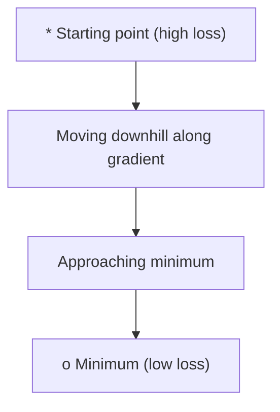
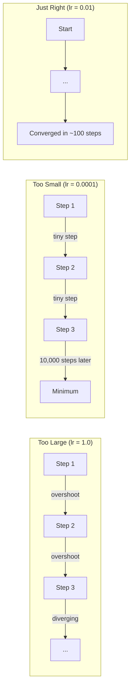
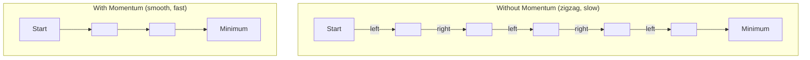
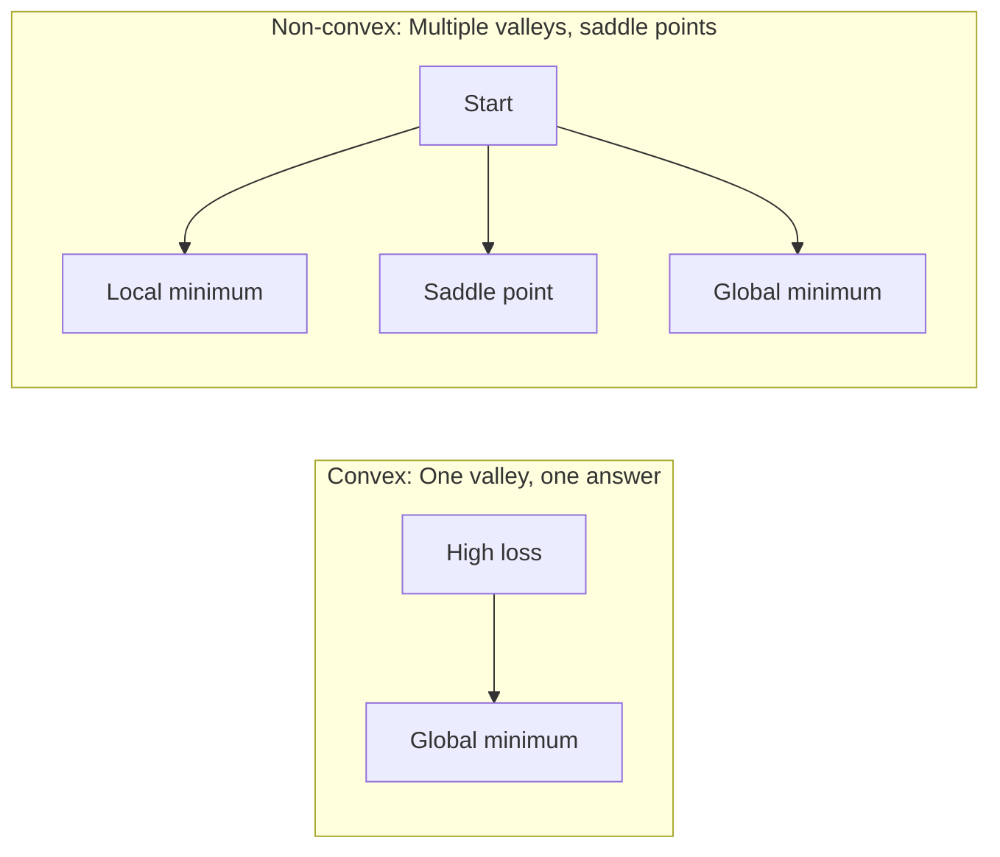
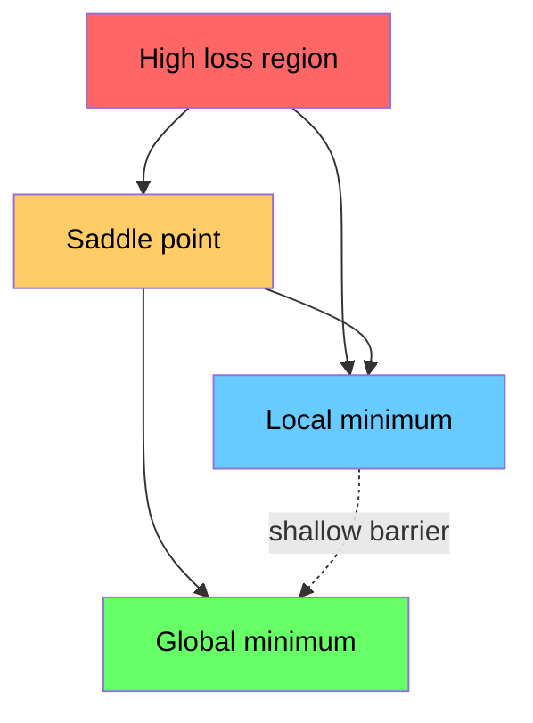

# 优化

> 训练神经网络,说到底就是找到谷底。

**类型:** 动手构建
**编程语言:** Python
**前置要求:** 第 1 阶段,第 04-05 课(导数、梯度)
**预计耗时:** 约 75 分钟

## 学习目标

- 从零实现朴素梯度下降、带动量的 SGD 和 Adam
- 在 Rosenbrock 函数上比较各优化器的收敛表现,并解释 Adam 为何能为每个权重自适应学习率
- 区分凸与非凸损失曲面,解释鞍点在高维空间中的角色
- 配置学习率调度(阶梯衰减、余弦退火、预热)以保证训练稳定

## 问题

你有一个损失函数,它告诉你模型错得有多离谱。你有梯度,它告诉你哪个方向会让损失变得更糟。现在你需要一套下山的策略。

最朴素的办法很简单:沿梯度反方向走,步长乘以一个叫学习率的数,重复。这就是梯度下降,它确实有效。但"有效"是有条件的。学习率太大,你会直接跨过山谷,在两壁之间来回弹跳;太小,你要爬几千步才能挪到答案;撞上鞍点,你还没找到最小值就停住不动了。

深度学习里的每一个优化器,回答的都是同一个问题:怎样更快、更稳地到达谷底?

## 概念

### 优化是什么

优化就是找到让函数最小(或最大)的输入值。在机器学习里,这个函数是损失,输入是模型的权重。训练即优化。

```
minimize L(w) where:
  L = loss function
  w = model weights (could be millions of parameters)
```

### 梯度下降(朴素版)

最简单的优化器。计算损失对每个权重的梯度,把每个权重沿其梯度反方向移动,步长用学习率缩放。

```
w = w - lr * gradient
```

这就是全部算法。一行。



### 学习率:最重要的超参数

学习率控制步长,它决定收敛的一切。



没有公式能算出正确的学习率,只能靠实验。常用起点:Adam 用 0.001,带动量的 SGD 用 0.01。

### SGD vs 批量 vs 小批量

朴素梯度下降走一步之前要在整个数据集上算梯度,这叫批量梯度下降。它稳定但慢。

随机梯度下降(SGD)在单个随机样本上算梯度,立即更新。它有噪声但快。

小批量梯度下降折中:在一小批样本(32、64、128、256 个)上算梯度再更新。这是大家实际在用的方法。

| 变体 | 批大小 | 梯度质量 | 每步速度 | 噪声 |
|---------|-----------|-----------------|---------------|-------|
| 批量 GD | 整个数据集 | 精确 | 慢 | 无 |
| SGD | 1 个样本 | 噪声很大 | 快 | 高 |
| 小批量 | 32-256 | 估计良好 | 均衡 | 中等 |

SGD 和小批量里的噪声不是缺陷,而是特性。它能帮你跳出浅的局部最小值和鞍点。

### 动量:滚下坡的球

朴素梯度下降只看当前梯度。如果梯度来回锯齿(在狭窄山谷里很常见),前进就很慢。动量把历史梯度累积成一个速度项,解决了这个问题。

```
v = beta * v + gradient
w = w - lr * v
```

打个比方:滚下坡的球。它不会每碰到一个凸起就停下重来。它在一致的方向上越滚越快,同时抑制震荡。



`beta`(通常取 0.9)控制保留多少历史。beta 越大,动量越强,路径越平滑,但对方向变化的响应越迟钝。

### Adam:自适应学习率

不同的权重需要不同的学习率。一个很少拿到大梯度的权重,好不容易来了一次就该迈大步;一个梯度常年巨大的权重,就应该迈小步。

Adam(自适应矩估计)为每个权重跟踪两个量:

1. 一阶矩(m):梯度的滑动平均(类似动量)
2. 二阶矩(v):梯度平方的滑动平均(梯度幅度)

```
m = beta1 * m + (1 - beta1) * gradient
v = beta2 * v + (1 - beta2) * gradient^2

m_hat = m / (1 - beta1^t)    bias correction
v_hat = v / (1 - beta2^t)    bias correction

w = w - lr * m_hat / (sqrt(v_hat) + epsilon)
```

除以 `sqrt(v_hat)` 是关键洞察。梯度大的权重除以一个大数(等效步长小),梯度小的权重除以一个小数(等效步长大)。每个权重都得到了自己的自适应学习率。

默认超参数:`lr=0.001, beta1=0.9, beta2=0.999, epsilon=1e-8`。这组默认值对大多数问题都好用。

### 学习率调度

固定学习率是一种妥协。训练初期你想要大步长快速推进,后期你想要小步长在最优点附近精调。

常见调度:

| 调度 | 公式 | 适用场景 |
|----------|---------|----------|
| 阶梯衰减 | 每 N 个 epoch,lr = lr * factor | 简单,手动控制 |
| 指数衰减 | lr = lr_0 * decay^t | 平滑缩减 |
| 余弦退火 | lr = lr_min + 0.5 * (lr_max - lr_min) * (1 + cos(pi * t / T)) | Transformer,现代训练 |
| 预热 + 衰减 | 先线性爬升,再衰减 | 大模型,防止早期不稳定 |

### 凸 vs 非凸

凸函数只有一个最小值,梯度下降总能找到它。像 `f(x) = x^2` 这样的二次函数就是凸的。

神经网络的损失函数是非凸的,布满许多局部最小值、鞍点和平坦区域。



实践中,高维神经网络的局部最小值很少是问题——大多数局部最小值的损失都接近全局最小值。鞍点(某些方向平、某些方向弯)才是真正的障碍。动量和小批量带来的噪声有助于逃离鞍点。

### 损失曲面可视化

损失是所有权重的函数。一个有 100 万权重的模型,其损失曲面位于 1000001 维空间。可视化的办法是:在权重空间里随机挑两个方向,沿这两个方向画出损失,得到一张 2D 曲面。



尖锐的最小值泛化差,平坦的最小值泛化好。这就是为什么在最终测试精度上,带动量的 SGD 常常胜过 Adam:它的噪声让参数不会落进尖锐的最小值。

```figure
gradient-descent
```

## 动手构建

### 第 1 步:定义测试函数

Rosenbrock 函数是经典的优化基准。它的最小值在 (1, 1),位于一条狭窄的弯曲山谷里——找到山谷容易,沿着山谷走到底难。

```
f(x, y) = (1 - x)^2 + 100 * (y - x^2)^2
```

```python
def rosenbrock(params):
    x, y = params
    return (1 - x) ** 2 + 100 * (y - x ** 2) ** 2

def rosenbrock_gradient(params):
    x, y = params
    df_dx = -2 * (1 - x) + 200 * (y - x ** 2) * (-2 * x)
    df_dy = 200 * (y - x ** 2)
    return [df_dx, df_dy]
```

### 第 2 步:朴素梯度下降

```python
class GradientDescent:
    def __init__(self, lr=0.001):
        self.lr = lr

    def step(self, params, grads):
        return [p - self.lr * g for p, g in zip(params, grads)]
```

### 第 3 步:带动量的 SGD

```python
class SGDMomentum:
    def __init__(self, lr=0.001, momentum=0.9):
        self.lr = lr
        self.momentum = momentum
        self.velocity = None

    def step(self, params, grads):
        if self.velocity is None:
            self.velocity = [0.0] * len(params)
        self.velocity = [
            self.momentum * v + g
            for v, g in zip(self.velocity, grads)
        ]
        return [p - self.lr * v for p, v in zip(params, self.velocity)]
```

### 第 4 步:Adam

```python
class Adam:
    def __init__(self, lr=0.001, beta1=0.9, beta2=0.999, epsilon=1e-8):
        self.lr = lr
        self.beta1 = beta1
        self.beta2 = beta2
        self.epsilon = epsilon
        self.m = None
        self.v = None
        self.t = 0

    def step(self, params, grads):
        if self.m is None:
            self.m = [0.0] * len(params)
            self.v = [0.0] * len(params)

        self.t += 1

        self.m = [
            self.beta1 * m + (1 - self.beta1) * g
            for m, g in zip(self.m, grads)
        ]
        self.v = [
            self.beta2 * v + (1 - self.beta2) * g ** 2
            for v, g in zip(self.v, grads)
        ]

        m_hat = [m / (1 - self.beta1 ** self.t) for m in self.m]
        v_hat = [v / (1 - self.beta2 ** self.t) for v in self.v]

        return [
            p - self.lr * mh / (vh ** 0.5 + self.epsilon)
            for p, mh, vh in zip(params, m_hat, v_hat)
        ]
```

### 第 5 步:运行并对比

```python
def optimize(optimizer, func, grad_func, start, steps=5000):
    params = list(start)
    history = [params[:]]
    for _ in range(steps):
        grads = grad_func(params)
        params = optimizer.step(params, grads)
        history.append(params[:])
    return history

start = [-1.0, 1.0]

gd_history = optimize(GradientDescent(lr=0.0005), rosenbrock, rosenbrock_gradient, start)
sgd_history = optimize(SGDMomentum(lr=0.0001, momentum=0.9), rosenbrock, rosenbrock_gradient, start)
adam_history = optimize(Adam(lr=0.01), rosenbrock, rosenbrock_gradient, start)

for name, history in [("GD", gd_history), ("SGD+M", sgd_history), ("Adam", adam_history)]:
    final = history[-1]
    loss = rosenbrock(final)
    print(f"{name:6s} -> x={final[0]:.6f}, y={final[1]:.6f}, loss={loss:.8f}")
```

预期结果:Adam 收敛最快。带动量的 SGD 路径更平滑。朴素 GD 沿狭窄山谷缓慢推进。

## 投入使用

实践中直接用 PyTorch 或 JAX 的优化器。它们处理参数分组、权重衰减、梯度裁剪和 GPU 加速。

```python
import torch

model = torch.nn.Linear(784, 10)

sgd = torch.optim.SGD(model.parameters(), lr=0.01, momentum=0.9)
adam = torch.optim.Adam(model.parameters(), lr=0.001)
adamw = torch.optim.AdamW(model.parameters(), lr=0.001, weight_decay=0.01)

scheduler = torch.optim.lr_scheduler.CosineAnnealingLR(adam, T_max=100)
```

经验法则:

- 从 Adam(lr=0.001)开始。它不调参就能应付大多数问题。
- 当你需要最好的最终精度、且负担得起更多调参时,换带动量的 SGD(lr=0.01,momentum=0.9)。
- Transformer 用 AdamW(解耦权重衰减的 Adam)。
- 训练超过几个 epoch,就一定要配学习率调度。
- 训练不稳定就降学习率,训练太慢就升学习率。

## 交付

本课产出一份选择优化器的提示词,见 `outputs/prompt-optimizer-guide.md`。

这里构建的优化器类会在第 3 阶段从零训练神经网络时再次登场。

## 练习

1. **学习率扫描。** 用朴素梯度下降在 Rosenbrock 函数上分别以学习率 [0.0001, 0.0005, 0.001, 0.005, 0.01] 运行。画出或打印每个学习率 5000 步后的最终损失。找出仍能收敛的最大学习率。

2. **动量对比。** 在 Rosenbrock 函数上分别用动量 [0.0, 0.5, 0.9, 0.99] 运行 SGD。记录每一步的损失。哪个动量值收敛最快?哪个会冲过头?

3. **逃离鞍点。** 定义函数 `f(x, y) = x^2 - y^2`(原点处是鞍点)。从 (0.01, 0.01) 出发,对比朴素 GD、带动量的 SGD 和 Adam 的表现。谁能逃出鞍点?

4. **实现学习率衰减。** 给 GradientDescent 类加上指数衰减调度:`lr = lr_0 * 0.999^step`。在 Rosenbrock 函数上对比有无衰减的收敛情况。

## 关键术语

| 术语 | 大家口头的说法 | 实际含义 |
|------|----------------|----------------------|
| 梯度下降 | "往山下走" | 从参数中减去梯度×学习率来更新参数。最基础的优化器。 |
| 学习率 | "步长" | 控制每次更新把权重移动多远的标量。太大会发散,太小浪费算力。 |
| 动量 | "继续滚" | 把历史梯度累积成速度向量。抑制震荡,在一致方向上加速。 |
| SGD | "随机采样" | 随机梯度下降。在随机子集而非全量数据上算梯度。实践中几乎总是指小批量 SGD。 |
| 小批量 | "一块数据" | 用于估计梯度的一小撮训练数据(32-256 个样本)。在速度与梯度精度之间取得平衡。 |
| Adam | "默认优化器" | 自适应矩估计。跟踪每个权重的梯度与梯度平方的滑动平均,让每个权重拥有自己的学习率。 |
| 偏差校正 | "修复冷启动" | Adam 的一阶、二阶矩初始为零。偏差校正除以 (1 - beta^t),补偿早期几步的偏差。 |
| 学习率调度 | "随时间调整 lr" | 训练过程中调整学习率的函数。早期大步,后期小步。 |
| 凸函数 | "一个山谷" | 任何局部最小值都是全局最小值的函数。梯度下降总能找到它。神经网络的损失不是凸的。 |
| 鞍点 | "平但不是最小值" | 梯度为零的点,但在某些方向是最小值、另一些方向是最大值。高维中很常见。 |
| 损失曲面 | "地形" | 损失函数在权重空间上的图像。通常沿两个随机方向切片可视化。 |
| 收敛 | "快到了" | 优化器到达了一个状态:再走也无法显著降低损失。 |

## 延伸阅读

- [Sebastian Ruder: An overview of gradient descent optimization algorithms](https://ruder.io/optimizing-gradient-descent/) - 所有主流优化器的综合综述
- [Why Momentum Really Works (Distill)](https://distill.pub/2017/momentum/) - 动量动力学的交互式可视化
- [Adam: A Method for Stochastic Optimization (Kingma & Ba, 2014)](https://arxiv.org/abs/1412.6980) - Adam 原始论文,短小易读
- [Visualizing the Loss Landscape of Neural Nets (Li et al., 2018)](https://arxiv.org/abs/1712.09913) - 揭示尖锐与平坦最小值之分的论文
