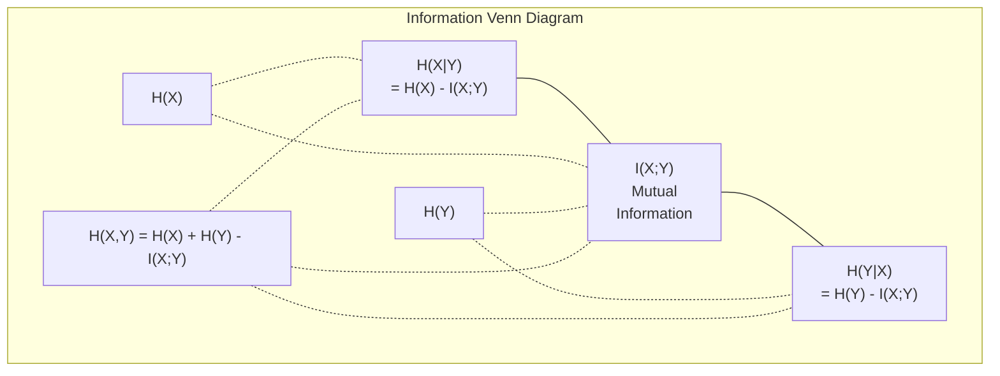

# 信息论

> 信息论度量的是"意外程度",损失函数正是建立在它之上的。

**类型:** 学习
**编程语言:** Python
**前置要求:** 第 1 阶段,第 06 课(概率)
**预计耗时:** 约 60 分钟

## 学习目标

- 从零计算熵、交叉熵和 KL 散度,并解释三者的关系
- 推导为什么最小化交叉熵损失等价于最大化对数似然
- 计算特征与目标之间的互信息,给特征重要性排序
- 把困惑度(perplexity)解释为语言模型实际面对的等效词表大小

## 问题

你每训练一个分类模型都会调用 `CrossEntropyLoss()`。每篇语言模型论文里都有 "perplexity"。VAE、知识蒸馏、RLHF 里到处都是 KL 散度。这些不是互不相干的概念,它们是同一个想法戴了不同的帽子。

信息论给你一套语言,用来推理不确定性、压缩和预测。Claude Shannon 在 1948 年发明它是为了解决通信问题。事实证明,训练神经网络也是一个通信问题:模型在试图通过由学习到的权重构成的噪声信道,把正确的标签"传输"出去。

本课把每个公式从零推一遍,让你看清它们从哪来、为什么管用。

## 概念

### 信息量(意外程度)

越不可能发生的事,携带的信息越多。硬币掷出正面?不意外。中彩票?非常意外。

一个概率为 p 的事件,其信息量是:

```
I(x) = -log(p(x))
```

log 取 2 为底,单位是比特(bit);取自然对数,单位是 nat。同一个想法,不同单位。

```
Event              Probability    Surprise (bits)
Fair coin heads    0.5            1.0
Rolling a 6        0.167          2.58
1-in-1000 event    0.001          9.97
Certain event      1.0            0.0
```

必然事件携带零信息——你早知道它会发生。

### 熵(平均意外程度)

熵是一个分布在所有可能结果上的期望意外程度。

```
H(P) = -sum( p(x) * log(p(x)) )  for all x
```

对二值变量,均匀硬币的熵最大:1 比特。有偏硬币(99% 正面)的熵很低:0.08 比特。你早知道结果会怎样,每次抛掷几乎不告诉你任何新东西。

```
Fair coin:    H = -(0.5 * log2(0.5) + 0.5 * log2(0.5)) = 1.0 bit
Biased coin:  H = -(0.99 * log2(0.99) + 0.01 * log2(0.01)) = 0.08 bits
```

熵度量一个分布中不可约的不确定性。任何压缩都无法突破它。

### 交叉熵(你天天在用的损失函数)

交叉熵度量:用分布 Q 去编码实际来自分布 P 的事件时,平均意外程度是多少。

```
H(P, Q) = -sum( p(x) * log(q(x)) )  for all x
```

P 是真实分布(标签),Q 是模型的预测。Q 与 P 完全一致时,交叉熵等于熵;有任何不匹配,它就更大。

分类问题中,P 是 one-hot 向量(真实类别概率为 1,其余为 0)。交叉熵于是简化为:

```
H(P, Q) = -log(q(true_class))
```

这就是分类问题交叉熵损失的全部公式:让正确类别的预测概率最大化。

### KL 散度(分布之间的距离)

KL 散度度量:用 Q 代替 P,你要多承受多少意外。

```
D_KL(P || Q) = sum( p(x) * log(p(x) / q(x)) )  for all x
             = H(P, Q) - H(P)
```

交叉熵 = 熵 + KL 散度。训练中真实分布的熵是常数,所以最小化交叉熵就等价于最小化 KL 散度——你在把模型的分布推向真实分布。

KL 散度不对称:D_KL(P || Q) != D_KL(Q || P)。它不是真正意义上的距离度量。

### 互信息

互信息度量:知道一个变量,能让你对另一个变量多了解多少。

```
I(X; Y) = H(X) - H(X|Y)
        = H(X) + H(Y) - H(X, Y)
```

如果 X 和 Y 独立,互信息为零——知道一个对另一个毫无帮助。如果两者完全相关,互信息等于任一变量的熵。

特征选择中,特征与目标之间的互信息高,说明这个特征有用;互信息低,说明它是噪声。

### 条件熵

H(Y|X) 度量:观测到 X 之后,关于 Y 还剩多少不确定性。

```
H(Y|X) = H(X,Y) - H(X)
```

两个极端:
- 如果 X 完全决定 Y,那么 H(Y|X) = 0。知道 X 就消除了关于 Y 的全部不确定性。例:X = 摄氏温度,Y = 华氏温度。
- 如果 X 对 Y 毫无信息量,那么 H(Y|X) = H(Y)。知道 X 一点也减不了你的不确定。例:X = 抛硬币,Y = 明天的天气。

条件熵永远非负,且不超过 H(Y):

```
0 <= H(Y|X) <= H(Y)
```

在机器学习里,条件熵出现在决策树中。每次分裂,算法都会挑选让 H(Y|X) 最小的特征 X——也就是最能消除标签 Y 不确定性的那个特征。

### 联合熵

H(X,Y) 是 X 和 Y 联合分布的熵。

```
H(X,Y) = -sum sum p(x,y) * log(p(x,y))   for all x, y
```

关键性质:

```
H(X,Y) <= H(X) + H(Y)
```

等号在 X 与 Y 独立时成立。两者若共享信息,联合熵就小于各自熵之和。"少了"的那部分熵,恰好就是互信息。



各量关系:
- H(X,Y) = H(X) + H(Y|X) = H(Y) + H(X|Y)
- I(X;Y) = H(X) - H(X|Y) = H(Y) - H(Y|X)
- H(X,Y) = H(X) + H(Y) - I(X;Y)

### 互信息(深入)

互信息 I(X;Y) 量化的是:知道一个变量,能让另一个变量的不确定性降低多少。

```
I(X;Y) = H(X) - H(X|Y)
       = H(Y) - H(Y|X)
       = H(X) + H(Y) - H(X,Y)
       = sum sum p(x,y) * log(p(x,y) / (p(x) * p(y)))
```

性质:
- I(X;Y) >= 0 恒成立。观测任何东西都不会让你损失信息。
- I(X;Y) = 0 当且仅当 X 与 Y 独立。
- I(X;Y) = I(Y;X)。它是对称的,这点与 KL 散度不同。
- I(X;X) = H(X)。一个变量与自身共享全部信息。

**用互信息做特征选择。** 在 ML 里,你想要对目标有信息量的特征。互信息提供了一套有理论依据的特征排序方法:

1. 对每个特征 X_i,计算 I(X_i; Y),Y 是目标变量。
2. 按 MI 得分给特征排序。
3. 保留前 k 个特征。

无论特征与目标之间是什么关系——线性、非线性、单调与否——这个方法都适用。相关系数只能抓线性关系,MI 什么都能抓到。

| 方法 | 能发现的关系 | 计算代价 | 支持类别型? |
|--------|---------|-------------------|---------------------|
| Pearson 相关 | 线性关系 | O(n) | 否 |
| Spearman 相关 | 单调关系 | O(n log n) | 否 |
| 互信息 | 任意统计依赖 | O(n log n)(需分箱) | 是 |

### 标签平滑与交叉熵

标准分类用硬目标:[0, 0, 1, 0]。真实类别概率为 1,其余为 0。标签平滑(label smoothing)把它换成软目标:

```
soft_target = (1 - epsilon) * hard_target + epsilon / num_classes
```

取 epsilon = 0.1、4 个类别时:
- 硬目标:[0, 0, 1, 0]
- 软目标:[0.025, 0.025, 0.925, 0.025]

从信息论视角看,标签平滑提高了目标分布的熵。one-hot 硬目标的熵是 0——毫无不确定性;软目标的熵为正。

为什么有用:
- 防止模型把 logit 推向极端值(在交叉熵下,要完美匹配 one-hot 目标需要无穷大的 logit)
- 起到正则化作用:模型无法做到 100% 自信
- 改善校准:预测概率更贴近真实的不确定性
- 缩小训练与推理行为之间的差距

带标签平滑的交叉熵损失变为:

```
L = (1 - epsilon) * CE(hard_target, prediction) + epsilon * H_uniform(prediction)
```

第二项惩罚偏离均匀分布的预测——对自信度的直接正则化。

### 为什么交叉熵是分类损失的不二之选

三个视角,同一个结论。

**信息论视角。** 交叉熵度量:用模型的分布代替真实分布,你浪费了多少比特。最小化它,就是让模型成为对现实最高效的编码器。

**最大似然视角。** 对 N 个训练样本,真实类别为 y_i:

```
Likelihood     = product( q(y_i) )
Log-likelihood = sum( log(q(y_i)) )
Negative log-likelihood = -sum( log(q(y_i)) )
```

最后一行就是交叉熵损失。最小化交叉熵 = 最大化训练数据在你模型下的似然。

**梯度视角。** 交叉熵对 logit 的梯度就是(预测值 - 真实值)。干净、稳定、算得快。这就是它与 softmax 天作之合的原因。

### 比特 vs Nat

唯一的区别是 log 的底。

```
log base 2   -> bits      (information theory tradition)
log base e   -> nats      (machine learning convention)
log base 10  -> hartleys  (rarely used)
```

1 nat = 1/ln(2) 比特 ≈ 1.4427 比特。PyTorch 和 TensorFlow 默认用自然对数(nat)。

### 困惑度(Perplexity)

困惑度是交叉熵的指数。它告诉你:模型平均而言相当于在多少个等概率选项之间犹豫。

```
Perplexity = 2^H(P,Q)   (if using bits)
Perplexity = e^H(P,Q)   (if using nats)
```

困惑度为 50 的语言模型,其困惑程度平均相当于要从 50 个候选 token 中均匀随机挑一个。越低越好。

GPT-2 在常见基准上的困惑度约为 30。现代模型在语料覆盖充分的领域已经降到个位数。

```figure
entropy-kl
```

## 动手构建

### 第 1 步:信息量与熵

```python
import math

def information_content(p, base=2):
    if p <= 0 or p > 1:
        return float('inf') if p <= 0 else 0.0
    return -math.log(p) / math.log(base)

def entropy(probs, base=2):
    return sum(
        p * information_content(p, base)
        for p in probs if p > 0
    )

fair_coin = [0.5, 0.5]
biased_coin = [0.99, 0.01]
fair_die = [1/6] * 6

print(f"Fair coin entropy:   {entropy(fair_coin):.4f} bits")
print(f"Biased coin entropy: {entropy(biased_coin):.4f} bits")
print(f"Fair die entropy:    {entropy(fair_die):.4f} bits")
```

### 第 2 步:交叉熵与 KL 散度

```python
def cross_entropy(p, q, base=2):
    total = 0.0
    for pi, qi in zip(p, q):
        if pi > 0:
            if qi <= 0:
                return float('inf')
            total += pi * (-math.log(qi) / math.log(base))
    return total

def kl_divergence(p, q, base=2):
    return cross_entropy(p, q, base) - entropy(p, base)

true_dist = [0.7, 0.2, 0.1]
good_model = [0.6, 0.25, 0.15]
bad_model = [0.1, 0.1, 0.8]

print(f"Entropy of true dist:     {entropy(true_dist):.4f} bits")
print(f"CE (good model):          {cross_entropy(true_dist, good_model):.4f} bits")
print(f"CE (bad model):           {cross_entropy(true_dist, bad_model):.4f} bits")
print(f"KL divergence (good):     {kl_divergence(true_dist, good_model):.4f} bits")
print(f"KL divergence (bad):      {kl_divergence(true_dist, bad_model):.4f} bits")
```

### 第 3 步:交叉熵作为分类损失

```python
def softmax(logits):
    max_logit = max(logits)
    exps = [math.exp(z - max_logit) for z in logits]
    total = sum(exps)
    return [e / total for e in exps]

def cross_entropy_loss(true_class, logits):
    probs = softmax(logits)
    return -math.log(probs[true_class])

logits = [2.0, 1.0, 0.1]
true_class = 0

probs = softmax(logits)
loss = cross_entropy_loss(true_class, logits)

print(f"Logits:      {logits}")
print(f"Softmax:     {[f'{p:.4f}' for p in probs]}")
print(f"True class:  {true_class}")
print(f"Loss:        {loss:.4f} nats")
print(f"Perplexity:  {math.exp(loss):.2f}")
```

### 第 4 步:交叉熵等于负对数似然

```python
import random

random.seed(42)

n_samples = 1000
n_classes = 3
true_labels = [random.randint(0, n_classes - 1) for _ in range(n_samples)]
model_logits = [[random.gauss(0, 1) for _ in range(n_classes)] for _ in range(n_samples)]

ce_loss = sum(
    cross_entropy_loss(label, logits)
    for label, logits in zip(true_labels, model_logits)
) / n_samples

nll = -sum(
    math.log(softmax(logits)[label])
    for label, logits in zip(true_labels, model_logits)
) / n_samples

print(f"Cross-entropy loss:      {ce_loss:.6f}")
print(f"Negative log-likelihood: {nll:.6f}")
print(f"Difference:              {abs(ce_loss - nll):.2e}")
```

### 第 5 步:互信息

```python
def mutual_information(joint_probs, base=2):
    rows = len(joint_probs)
    cols = len(joint_probs[0])

    margin_x = [sum(joint_probs[i][j] for j in range(cols)) for i in range(rows)]
    margin_y = [sum(joint_probs[i][j] for i in range(rows)) for j in range(cols)]

    mi = 0.0
    for i in range(rows):
        for j in range(cols):
            pxy = joint_probs[i][j]
            if pxy > 0:
                mi += pxy * math.log(pxy / (margin_x[i] * margin_y[j])) / math.log(base)
    return mi

independent = [[0.25, 0.25], [0.25, 0.25]]
dependent = [[0.45, 0.05], [0.05, 0.45]]

print(f"MI (independent): {mutual_information(independent):.4f} bits")
print(f"MI (dependent):   {mutual_information(dependent):.4f} bits")
```

## 投入使用

用 NumPy 实现同样的概念——这是你实际工作中的写法:

```python
import numpy as np

def np_entropy(p):
    p = np.asarray(p, dtype=float)
    mask = p > 0
    result = np.zeros_like(p)
    result[mask] = p[mask] * np.log(p[mask])
    return -result.sum()

def np_cross_entropy(p, q):
    p, q = np.asarray(p, dtype=float), np.asarray(q, dtype=float)
    mask = p > 0
    return -(p[mask] * np.log(q[mask])).sum()

def np_kl_divergence(p, q):
    return np_cross_entropy(p, q) - np_entropy(p)

true = np.array([0.7, 0.2, 0.1])
pred = np.array([0.6, 0.25, 0.15])
print(f"Entropy:    {np_entropy(true):.4f} nats")
print(f"Cross-ent:  {np_cross_entropy(true, pred):.4f} nats")
print(f"KL div:     {np_kl_divergence(true, pred):.4f} nats")
```

你从零造出了 `torch.nn.CrossEntropyLoss()` 内部在做的事。现在你知道训练时损失为什么会下降:模型的预测分布正在向真实分布靠拢,靠拢的程度以"浪费的信息量"(nat)计量。

## 练习

1. 假设英文字母表均匀分布(26 个字母),计算其熵。再用真实的字母频率估算一次。哪个更高,为什么?

2. 一个模型对真实类别为 1 的样本输出 logit [5.0, 2.0, 0.5]。手算交叉熵损失,再用你的 `cross_entropy_loss` 函数验证。什么样的 logit 会让损失为零?

3. 证明 KL 散度不对称。任选两个分布 P 和 Q,分别计算 D_KL(P || Q) 和 D_KL(Q || P)。解释它们为什么不同。

4. 写一个函数,对一串 token 预测计算困惑度。输入是 (true_token_index, predicted_logits) 对的列表,返回整个序列的困惑度。

## 关键术语

| 术语 | 大家口头的说法 | 实际含义 |
|------|----------------|----------------------|
| 信息量 | "意外程度" | 编码一个事件所需的比特(或 nat)数:-log(p) |
| 熵 | "随机性" | 一个分布在所有结果上的平均意外程度。度量不可约的不确定性。 |
| 交叉熵 | "那个损失函数" | 用模型分布 Q 编码来自真实分布 P 的事件时的平均意外程度。 |
| KL 散度 | "分布之间的距离" | 用 Q 代替 P 多浪费的比特数。等于交叉熵减去熵。不对称。 |
| 互信息 | "X 和 Y 有多相关" | 知道 Y 后 X 的不确定性减少量。为零意味着独立。 |
| Softmax | "把 logit 变成概率" | 取指数再归一化。把任意实数向量映射为合法的概率分布。 |
| 困惑度 | "模型有多困惑" | 交叉熵的指数。模型每一步实际面对的等效词表大小。 |
| 比特 | "香农的单位" | 以 2 为底 log 计量的信息。1 比特解决一次均匀硬币抛掷。 |
| Nat | "ML 的单位" | 以自然对数计量的信息。PyTorch 和 TensorFlow 默认使用。 |
| 负对数似然 | "NLL 损失" | one-hot 标签下与交叉熵损失完全等同。最小化它就是最大化预测正确的概率。 |

## 延伸阅读

- [Shannon 1948: A Mathematical Theory of Communication](https://people.math.harvard.edu/~ctm/home/text/others/shannon/entropy/entropy.pdf) - 原始论文,今天读来依然清晰
- [Visual Information Theory (Chris Olah)](https://colah.github.io/posts/2015-09-Visual-Information/) - 熵与 KL 散度最好的可视化讲解
- [PyTorch CrossEntropyLoss docs](https://pytorch.org/docs/stable/generated/torch.nn.CrossEntropyLoss.html) - 看框架如何实现你刚造的东西
