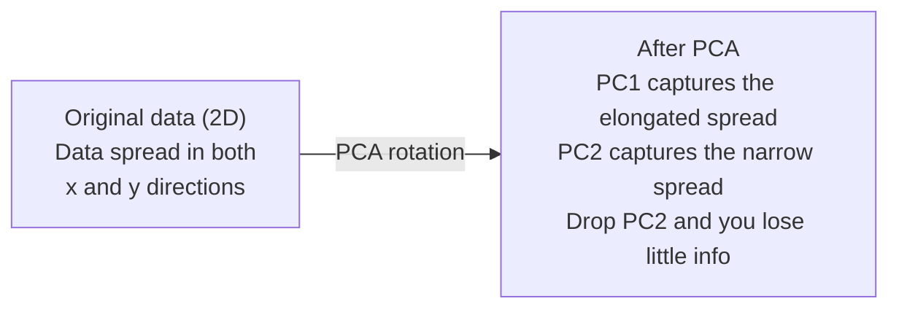

# 降维

> 高维数据自有其结构,关键在于从正确的角度去看。

**类型:** 动手构建
**编程语言:** Python
**前置要求:** 第 1 阶段,第 01 课(线性代数直觉)、02(向量、矩阵与运算)、03(特征值与特征向量)、06(概率与分布)
**预计耗时:** 约 90 分钟

## 学习目标

- 从零实现 PCA:数据中心化、计算协方差矩阵、特征分解、投影
- 用解释方差比和肘部法则选择主成分个数
- 对比 PCA、t-SNE、UMAP 在 MNIST 手写数字 2D 可视化上的表现,并解释各自的取舍
- 应用 RBF 核的核 PCA,分离标准 PCA 无法处理的非线性数据结构

## 问题

你手里有个数据集,每个样本 784 个特征。可能是手写数字的像素值,可能是基因表达水平,也可能是用户行为信号。784 个维度,你画不出来,想象不了,甚至没法思考。

但这 784 个特征里,大多数是冗余的。真正的信息存在于一个小得多的曲面上。描述一个手写的 "7",不需要 784 个独立的数字,只需要几个:笔画的倾斜角度、横杠的长度、整个字往哪边歪。其余都是噪声。

降维就是找到那个小曲面。它把 784 维的数据压缩到 2 维、10 维或 50 维,同时保住重要的结构。

## 概念

### 维度灾难

高维空间是反直觉的。维度一高,三样东西会失效。

**距离失去意义。** 高维中,任意两个随机点之间的距离会收敛到几乎相同的值。如果每个点到其他所有点的距离都差不多,最近邻搜索就没法用了。

```
Dimension    Avg distance ratio (max/min between random points)
2            ~5.0
10           ~1.8
100          ~1.2
1000         ~1.02
```

**体积集中在角落。** d 维单位超立方体有 2^d 个角。100 维时,几乎全部体积都在角落里,远离中心。数据点被甩到边缘,模型在内部区域严重缺数据。

**你需要指数级更多的数据。** 要在空间里维持同样的样本密度,从 2 维升到 20 维意味着你需要 10^18 倍的数据。你的数据永远不够。降维能把数据密度拉回可用的水平。

### PCA:找到重要的方向

主成分分析(PCA)找出数据方差最大的那些轴。它旋转你的坐标系,让第一个轴捕获最大的方差,第二个轴捕获次大的方差,依此类推。

算法步骤:

```
1. Center the data        (subtract the mean from each feature)
2. Compute covariance     (how features move together)
3. Eigendecomposition     (find the principal directions)
4. Sort by eigenvalue     (biggest variance first)
5. Project               (keep top k eigenvectors, drop the rest)
```

为什么要特征分解?协方差矩阵是对称半正定的,它的特征向量是特征空间里一组正交方向,特征值告诉你每个方向捕获了多少方差。特征值最大的特征向量,指向的就是方差最大的方向。



- **PCA 之前:** 数据云沿对角线摊在 x 轴和 y 轴上
- **PCA 之后:** 坐标系被旋转,PC1 与最大方差方向(拉长的散布)对齐,PC2 与最小方差方向(狭窄的散布)对齐
- **降维:** 丢掉 PC2,把数据投影到 PC1 上,损失的信息很少

### 解释方差比

每个主成分捕获总方差的一部分。解释方差比告诉你是多少。

```
Component    Eigenvalue    Explained ratio    Cumulative
PC1          4.73          0.473              0.473
PC2          2.51          0.251              0.724
PC3          1.12          0.112              0.836
PC4          0.89          0.089              0.925
...
```

当累计解释方差达到 0.95 时,说明这么多个成分已经捕获了 95% 的信息,再往后的基本是噪声。

### 选多少个成分

三种策略:

1. **阈值法。** 保留足够解释 90-95% 方差的成分数。
2. **肘部法则。** 画出每个成分的解释方差,找那个陡降的拐点。
3. **看下游表现。** 把 PCA 当预处理,扫一遍 k,看模型精度。精度不再提升的位置就是最好的 k。

### t-SNE:保住邻域关系

t 分布随机邻域嵌入(t-SNE)是为可视化而生的。它把高维数据映射到 2D(或 3D),同时保持哪些点彼此相邻这一关系。

直觉是这样的:在原空间中,基于点对之间的距离算一个概率分布——近的点对概率高,远的低。然后在 2D 里找一个排布,让同样的概率分布成立。784 维里是邻居的点,在 2D 里还是邻居。

t-SNE 的关键性质:
- 非线性。它能展开 PCA 无能为力的复杂流形。
- 随机性。不同次运行会得到不同的布局。
- 困惑度(perplexity)参数控制考虑多少个邻居(常见范围:5-50)。
- 输出里簇与簇之间的距离没有意义,只有簇本身有意义。
- 大数据集上慢,默认复杂度 O(n^2)。

### UMAP:更快,全局结构更好

均匀流形近似与投影(UMAP)思路与 t-SNE 类似,但有两个优势:
- 更快。它用近似的最近邻图,而不是计算所有点对距离。
- 全局结构更好。输出中簇的相对位置通常比 t-SNE 更有意义。

UMAP 先在高维空间构建一个加权图(所谓"模糊拓扑表示"),再找一个尽可能保持这张图结构的低维布局。

关键参数:
- `n_neighbors`:定义局部结构时考虑的邻居数(类似 perplexity)。值越大,保留的全局结构越多。
- `min_dist`:输出中点的紧凑程度。值越小,簇越致密。

### 该用哪个

| 方法 | 适用场景 | 保持的东西 | 速度 |
|--------|----------|-----------|-------|
| PCA | 训练前的预处理 | 全局方差 | 快(精确算法),百万级样本无压力 |
| PCA | 快速探索性可视化 | 线性结构 | 快 |
| t-SNE | 发表级的 2D 图 | 局部邻域 | 慢(最好 < 1 万样本) |
| UMAP | 大规模 2D 可视化 | 局部 + 部分全局结构 | 中(可处理百万级) |
| PCA | 为模型做特征缩减 | 按方差排序的特征 | 快 |
| t-SNE / UMAP | 理解聚类结构 | 簇间分离 | 中到慢 |

经验法则:预处理和数据压缩用 PCA;需要在 2D 里看结构时,用 t-SNE 或 UMAP。

### 核 PCA

标准 PCA 只能找线性子空间——旋转坐标系、丢轴。但如果数据躺在非线性流形上呢?2D 平面上的一个圆,任何直线都分不开它,标准 PCA 帮不上忙。

核 PCA 在核函数诱导的高维特征空间里做 PCA,却不需要显式计算那个空间里的坐标。这就是核技巧——和 SVM 背后的想法一脉相承。

算法步骤:
1. 计算核矩阵 K,其中 K_ij = k(x_i, x_j)
2. 在特征空间中对核矩阵做中心化
3. 对中心化后的核矩阵做特征分解
4. 顶部的特征向量(按 1/sqrt(特征值) 缩放)就是投影结果

常用核函数:

| 核 | 公式 | 适用 |
|--------|---------|----------|
| RBF(高斯) | exp(-gamma * \|\|x - y\|\|^2) | 大多数非线性数据、平滑流形 |
| 多项式 | (x . y + c)^d | 多项式关系 |
| Sigmoid | tanh(alpha * x . y + c) | 类神经网络的映射 |

核 PCA 与标准 PCA 的取舍:

| 对比项 | 标准 PCA | 核 PCA |
|-----------|-------------|------------|
| 数据结构 | 线性子空间 | 非线性流形 |
| 速度 | O(min(n^2 d, d^2 n)) | O(n^2 d + n^3) |
| 可解释性 | 成分是特征的线性组合 | 成分没有直接的特征解释 |
| 可扩展性 | 百万级样本可行 | 核矩阵是 n x n,受内存限制 |
| 重构 | 可直接逆变换 | 需要 pre-image 近似 |

经典例子:2D 里的同心圆。两圈点,一圈套一圈。标准 PCA 把两圈投到同一条直线上——对分类毫无用处。RBF 核的核 PCA 能把内圈和外圈映射到不同区域,使它们线性可分。

### 重构误差

你的降维效果有多好?你把 784 维压到了 50 维,到底丢了什么?

测量重构误差:
1. 投影到 k 维:X_reduced = X @ W_k
2. 重构:X_hat = X_reduced @ W_k^T
3. 计算 MSE:mean((X - X_hat)^2)

对 PCA 来说,重构误差与解释方差有干净的关系:

```
Reconstruction error = sum of eigenvalues NOT included
Total variance = sum of ALL eigenvalues
Fraction lost = (sum of dropped eigenvalues) / (sum of all eigenvalues)
```

每个成分的解释方差比是:

```
explained_ratio_k = eigenvalue_k / sum(all eigenvalues)
```

把累计解释方差对成分个数画出来,就是"肘部"曲线。合适的成分个数满足:
- 曲线变平(收益递减)
- 累计方差越过你的阈值(通常 0.90 或 0.95)
- 下游任务性能进入平台期

重构误差的用途不止于选 k。它还能做异常检测:重构误差高的样本是不符合所学子空间的离群点。生产系统中基于 PCA 的异常检测就是这么做的。

```figure
pca-axes
```

## 动手构建

### 第 1 步:从零实现 PCA

```python
import numpy as np

class PCA:
    def __init__(self, n_components):
        self.n_components = n_components
        self.components = None
        self.mean = None
        self.eigenvalues = None
        self.explained_variance_ratio_ = None

    def fit(self, X):
        self.mean = np.mean(X, axis=0)
        X_centered = X - self.mean

        cov_matrix = np.cov(X_centered, rowvar=False)

        eigenvalues, eigenvectors = np.linalg.eigh(cov_matrix)

        sorted_idx = np.argsort(eigenvalues)[::-1]
        eigenvalues = eigenvalues[sorted_idx]
        eigenvectors = eigenvectors[:, sorted_idx]

        self.components = eigenvectors[:, :self.n_components].T
        self.eigenvalues = eigenvalues[:self.n_components]
        total_var = np.sum(eigenvalues)
        self.explained_variance_ratio_ = self.eigenvalues / total_var

        return self

    def transform(self, X):
        X_centered = X - self.mean
        return X_centered @ self.components.T

    def fit_transform(self, X):
        self.fit(X)
        return self.transform(X)
```

### 第 2 步:在合成数据上测试

```python
np.random.seed(42)
n_samples = 500

t = np.random.uniform(0, 2 * np.pi, n_samples)
x1 = 3 * np.cos(t) + np.random.normal(0, 0.2, n_samples)
x2 = 3 * np.sin(t) + np.random.normal(0, 0.2, n_samples)
x3 = 0.5 * x1 + 0.3 * x2 + np.random.normal(0, 0.1, n_samples)

X_synthetic = np.column_stack([x1, x2, x3])

pca = PCA(n_components=2)
X_reduced = pca.fit_transform(X_synthetic)

print(f"Original shape: {X_synthetic.shape}")
print(f"Reduced shape:  {X_reduced.shape}")
print(f"Explained variance ratios: {pca.explained_variance_ratio_}")
print(f"Total variance captured: {sum(pca.explained_variance_ratio_):.4f}")
```

### 第 3 步:MNIST 数字降到 2D

```python
from sklearn.datasets import fetch_openml

mnist = fetch_openml("mnist_784", version=1, as_frame=False, parser="auto")
X_mnist = mnist.data[:5000].astype(float)
y_mnist = mnist.target[:5000].astype(int)

pca_mnist = PCA(n_components=50)
X_pca50 = pca_mnist.fit_transform(X_mnist)
print(f"50 components capture {sum(pca_mnist.explained_variance_ratio_):.2%} of variance")

pca_2d = PCA(n_components=2)
X_pca2d = pca_2d.fit_transform(X_mnist)
print(f"2 components capture {sum(pca_2d.explained_variance_ratio_):.2%} of variance")
```

### 第 4 步:与 sklearn 对比

```python
from sklearn.decomposition import PCA as SklearnPCA
from sklearn.manifold import TSNE

sklearn_pca = SklearnPCA(n_components=2)
X_sklearn_pca = sklearn_pca.fit_transform(X_mnist)

print(f"\nOur PCA explained variance:     {pca_2d.explained_variance_ratio_}")
print(f"Sklearn PCA explained variance: {sklearn_pca.explained_variance_ratio_}")

diff = np.abs(np.abs(X_pca2d) - np.abs(X_sklearn_pca))
print(f"Max absolute difference: {diff.max():.10f}")

tsne = TSNE(n_components=2, perplexity=30, random_state=42)
X_tsne = tsne.fit_transform(X_mnist)
print(f"\nt-SNE output shape: {X_tsne.shape}")
```

### 第 5 步:UMAP 对比

```python
try:
    from umap import UMAP

    reducer = UMAP(n_components=2, n_neighbors=15, min_dist=0.1, random_state=42)
    X_umap = reducer.fit_transform(X_mnist)
    print(f"UMAP output shape: {X_umap.shape}")
except ImportError:
    print("Install umap-learn: pip install umap-learn")
```

## 投入使用

把 PCA 作为分类器的预处理:

```python
from sklearn.decomposition import PCA as SklearnPCA
from sklearn.linear_model import LogisticRegression
from sklearn.model_selection import train_test_split
from sklearn.metrics import accuracy_score

X_train, X_test, y_train, y_test = train_test_split(
    X_mnist, y_mnist, test_size=0.2, random_state=42
)

results = {}
for k in [10, 30, 50, 100, 200]:
    pca_k = SklearnPCA(n_components=k)
    X_tr = pca_k.fit_transform(X_train)
    X_te = pca_k.transform(X_test)

    clf = LogisticRegression(max_iter=1000, random_state=42)
    clf.fit(X_tr, y_train)
    acc = accuracy_score(y_test, clf.predict(X_te))
    var_captured = sum(pca_k.explained_variance_ratio_)
    results[k] = (acc, var_captured)
    print(f"k={k:>3d}  accuracy={acc:.4f}  variance={var_captured:.4f}")
```

远在 784 维之前,性能就进入了平台期。那个平台就是你的工作点。

## 交付

本课产出:
- `outputs/skill-dimensionality-reduction.md` - 一份为给定任务选择合适降维技术的技能文档

## 练习

1. 修改 PCA 类,支持 `inverse_transform`。分别用 10、50、200 个成分重构 MNIST 数字,打印每个设置下的重构误差(与原图的均方差)。

2. 在同一个 MNIST 子集上,分别以困惑度 5、30、100 运行 t-SNE。描述输出的变化。为什么困惑度会影响簇的紧致程度?

3. 造一个 50 个特征、只有 5 个有信息量的数据集(用 `sklearn.datasets.make_classification` 生成)。应用 PCA,看解释方差曲线能否正确指出数据实际是 5 维的。

## 关键术语

| 术语 | 大家口头的说法 | 实际含义 |
|------|----------------|----------------------|
| 维度灾难 | "特征太多了" | 维度增长时,距离、体积和数据密度的表现都变得反直觉。模型需要指数级更多的数据来补偿。 |
| PCA | "降维" | 旋转坐标系,让坐标轴对齐方差最大的方向,然后丢掉低方差的轴。 |
| 主成分 | "重要的方向" | 协方差矩阵的特征向量。特征空间中数据方差最大的方向。 |
| 解释方差比 | "这个成分有多少信息量" | 单个主成分捕获的总方差占比。把前 k 个比值加起来,就知道 k 个成分保住了多少信息。 |
| 协方差矩阵 | "特征怎么相关" | 一个对称矩阵,(i,j) 位置的元素度量特征 i 和特征 j 如何协同变化。对角线元素是各自的方差。 |
| t-SNE | "那个聚类图" | 一种非线性方法,通过保持点对邻域概率把高维数据映射到 2D。适合可视化,不适合做预处理。 |
| UMAP | "更快的 t-SNE" | 基于拓扑数据分析的非线性方法。同时保持局部和部分全局结构。扩展性比 t-SNE 好。 |
| 困惑度(Perplexity) | "t-SNE 的旋钮" | 控制每个点考虑的有效邻居数。低困惑度关注极局部的结构,高困惑度捕捉更大范围的模式。 |
| 流形 | "数据所在的曲面" | 嵌入在高维空间中的低维曲面。一张在 3D 里被揉皱的纸就是一个 2D 流形。 |

## 延伸阅读

- [A Tutorial on Principal Component Analysis](https://arxiv.org/abs/1404.1100) (Shlens) - 从头清晰推导 PCA
- [How to Use t-SNE Effectively](https://distill.pub/2016/misread-tsne/) (Wattenberg et al.) - t-SNE 陷阱与参数选择的交互式指南
- [UMAP documentation](https://umap-learn.readthedocs.io/) - UMAP 作者撰写的理论与实践指南
