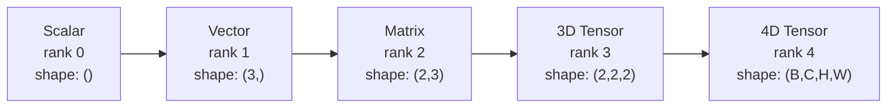
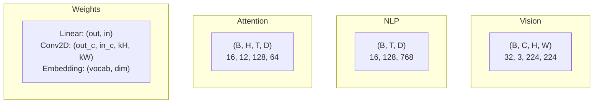
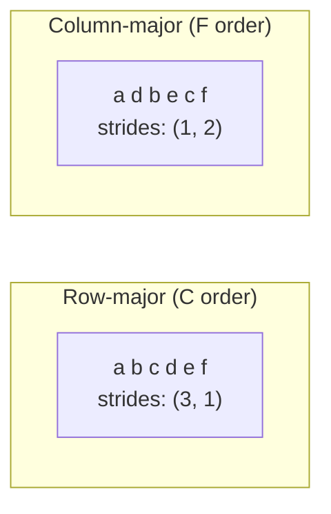
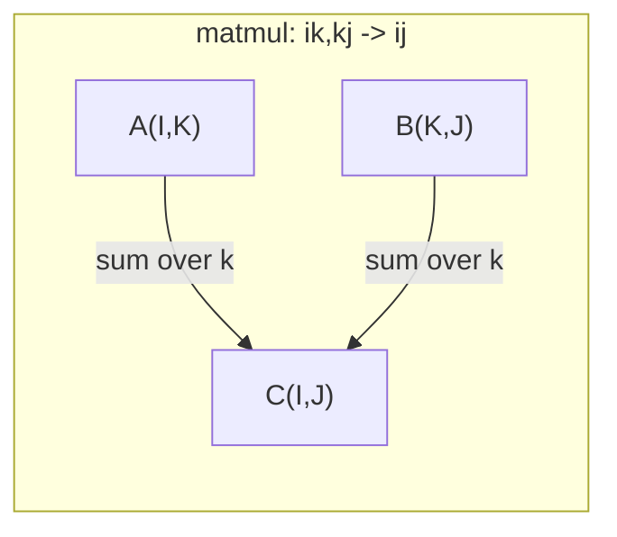

# 张量运算

> 张量是数据与深度学习之间的通用语言。每张图像、每个句子、每个梯度,都从张量中流过。

**类型:** 动手构建
**编程语言:** Python
**前置要求:** 第 1 阶段,第 01 课(线性代数直觉)、02(向量、矩阵与运算)
**预计耗时:** 约 90 分钟

## 学习目标

- 从零实现一个带形状、步幅、reshape、转置和逐元素运算的张量类
- 运用广播规则,在不复制数据的前提下对不同形状的张量做运算
- 用 einsum 表达式写出点积、矩阵乘法、外积和批量运算
- 逐步骤追踪多头注意力中每一个张量的确切形状

## 问题

你在搭一个 Transformer。前向传播代码看起来很干净。一运行,报错:`RuntimeError: mat1 and mat2 shapes cannot be multiplied (32x768 and 512x768)`。你盯着形状看,试了个转置。现在它说 `Expected 4D input (got 3D input)`。你加个 unsqueeze,别的地方又坏了。

形状错误是深度学习代码里最常见的 bug。概念上并不难——每个操作都有一份形状契约——但它们繁殖得极快。一个 Transformer 里有几十个 reshape、转置和广播串在一起,一个轴搞错,错误就级联放大。更糟的是,有些形状错误根本不报错:它们沿错误的维度广播、沿错误的轴求和,悄悄产出垃圾。

矩阵只能处理两组事物之间的两两关系。真实数据塞不进两个维度。一个批次 32 张 224x224 的 RGB 图像是 4D 张量:`(32, 3, 224, 224)`。12 个头的自注意力也是 4D:`(batch, heads, seq_len, head_dim)`。你需要一种能推广到任意维度、且运算能跨维度干净组合的数据结构。这个结构就是张量。掌握它的运算,形状错误就会变得极易调试。

## 概念

### 张量是什么

张量是具有统一数据类型的多维数值数组。维度的个数叫**秩**(rank,或 order)。每个维度叫一个**轴**(axis)。**形状**(shape)是一个元组,列出沿每个轴的大小。



元素总数 = 各维度大小的乘积。形状 `(2, 3, 4)` 装着 `2 * 3 * 4 = 24` 个元素。

### 深度学习中的张量形状

不同数据类型按惯例对应特定的张量形状。



PyTorch 用 NCHW(通道在前),TensorFlow 默认 NHWC(通道在后)。布局不匹配会导致静默的性能下降或报错。

### 内存布局是怎么回事

内存中的一个 2D 数组,实际是一段 1D 字节序列。**步幅**(strides)告诉你:沿每个轴前进一步,要跳过多少个元素。



转置并不搬动数据,它只是交换步幅。转置后的张量是**非连续**(non-contiguous)的——同一行的元素在内存中不再相邻。

### 广播规则

广播让你在不复制数据的情况下,对不同形状的张量做运算。形状从右往左对齐。两个维度兼容的条件是:相等,或其中一个为 1。维度少的在左侧补 1。

```
Tensor A:     (8, 1, 6, 1)
Tensor B:        (7, 1, 5)
Padded B:     (1, 7, 1, 5)
Result:       (8, 7, 6, 5)
```

### Einsum:万能张量运算

爱因斯坦求和约定给每个轴标一个字母。出现在输入中但没出现在输出中的轴会被求和,两边都出现的轴保留。



关键模式:`i,i->`(点积)、`i,j->ij`(外积)、`ii->`(迹)、`ij->ji`(转置)、`bij,bjk->bik`(批量矩阵乘法)、`bhtd,bhsd->bhts`(注意力分数)。

```figure
tensor-broadcast
```

## 动手构建

代码在 `code/tensors.py` 里。每一步对应那里的实现。

### 第 1 步:张量存储与步幅

一个张量存的是一串扁平的数字列表,外加形状元数据。步幅告诉索引逻辑:如何把多维下标映射到扁平位置。

```python
class Tensor:
    def __init__(self, data, shape=None):
        if isinstance(data, (list, tuple)):
            self._data, self._shape = self._flatten_nested(data)
        elif isinstance(data, np.ndarray):
            self._data = data.flatten().tolist()
            self._shape = tuple(data.shape)
        else:
            self._data = [data]
            self._shape = ()

        if shape is not None:
            total = reduce(lambda a, b: a * b, shape, 1)
            if total != len(self._data):
                raise ValueError(
                    f"Cannot reshape {len(self._data)} elements into shape {shape}"
                )
            self._shape = tuple(shape)

        self._strides = self._compute_strides(self._shape)

    @staticmethod
    def _compute_strides(shape):
        if len(shape) == 0:
            return ()
        strides = [1] * len(shape)
        for i in range(len(shape) - 2, -1, -1):
            strides[i] = strides[i + 1] * shape[i + 1]
        return tuple(strides)
```

对形状 `(3, 4)`,步幅是 `(4, 1)`——前进一行跳 4 个元素,前进一列跳 1 个。

### 第 2 步:reshape、squeeze、unsqueeze

reshape 改变形状但不改变元素顺序,元素总数必须保持不变。可以给一个维度用 `-1`,让框架推断它的大小。

```python
t = Tensor(list(range(12)), shape=(2, 6))
r = t.reshape((3, 4))
r = t.reshape((-1, 3))
```

squeeze 删掉大小为 1 的轴,unsqueeze 插入一个。unsqueeze 对广播至关重要——把偏置向量 `(D,)` 加到批次 `(B, T, D)` 上,需要先 unsqueeze 成 `(1, 1, D)`。

```python
t = Tensor(list(range(6)), shape=(1, 3, 1, 2))
s = t.squeeze()
v = Tensor([1, 2, 3])
u = v.unsqueeze(0)
```

### 第 3 步:转置与轴重排

转置交换两个轴,permute 重排所有轴。NCHW 和 NHWC 之间的转换靠的就是它。

```python
mat = Tensor(list(range(6)), shape=(2, 3))
tr = mat.transpose(0, 1)

t4d = Tensor(list(range(24)), shape=(1, 2, 3, 4))
perm = t4d.permute((0, 2, 3, 1))
```

转置或 permute 之后,张量在内存中是非连续的。在 PyTorch 里,`view` 对非连续张量会报错——用 `reshape`,或者先调 `.contiguous()`。

### 第 4 步:逐元素运算与归约

逐元素运算(加、乘、减)独立作用于每个元素,保持形状不变。归约(求和、均值、最大值)折叠一个或多个轴。

```python
a = Tensor([[1, 2], [3, 4]])
b = Tensor([[10, 20], [30, 40]])
c = a + b
d = a * 2
s = a.sum(axis=0)
```

CNN 里的全局平均池化:`(B, C, H, W).mean(axis=[2, 3])` 得到 `(B, C)`。NLP 里的序列均值池化:`(B, T, D).mean(axis=1)` 得到 `(B, D)`。

### 第 5 步:用 NumPy 做广播

`tensors.py` 里的 `demo_broadcasting_numpy()` 函数演示了核心模式。

```python
activations = np.random.randn(4, 3)
bias = np.array([0.1, 0.2, 0.3])
result = activations + bias

images = np.random.randn(2, 3, 4, 4)
scale = np.array([0.5, 1.0, 1.5]).reshape(1, 3, 1, 1)
result = images * scale

a = np.array([1, 2, 3]).reshape(-1, 1)
b = np.array([10, 20, 30, 40]).reshape(1, -1)
outer = a * b
```

用广播算两两距离:把 `(M, 2)` reshape 成 `(M, 1, 2)`、`(N, 2)` 成 `(1, N, 2)`,相减、平方、沿最后一个轴求和、开方。结果:`(M, N)`。

### 第 6 步:einsum 运算

`demo_einsum()` 和 `demo_einsum_gallery()` 两个函数逐个演示了所有常见模式。

```python
a = np.array([1.0, 2.0, 3.0])
b = np.array([4.0, 5.0, 6.0])
dot = np.einsum("i,i->", a, b)

A = np.array([[1, 2], [3, 4], [5, 6]], dtype=float)
B = np.array([[7, 8, 9], [10, 11, 12]], dtype=float)
matmul = np.einsum("ik,kj->ij", A, B)

batch_A = np.random.randn(4, 3, 5)
batch_B = np.random.randn(4, 5, 2)
batch_mm = np.einsum("bij,bjk->bik", batch_A, batch_B)
```

一次缩并(contraction)的计算量是所有下标大小(保留的和被求和的)的乘积。对 `bij,bjk->bik`,取 B=32、I=128、J=64、K=128:`32 * 128 * 64 * 128 = 33,554,432` 次乘加。

### 第 7 步:用 einsum 实现注意力机制

`demo_attention_einsum()` 函数端到端实现了多头注意力。

```python
B, H, T, D = 2, 4, 8, 16
E = H * D

X = np.random.randn(B, T, E)
W_q = np.random.randn(E, E) * 0.02

Q = np.einsum("bte,ek->btk", X, W_q)
Q = Q.reshape(B, T, H, D).transpose(0, 2, 1, 3)

scores = np.einsum("bhtd,bhsd->bhts", Q, K) / np.sqrt(D)
weights = softmax(scores, axis=-1)
attn_output = np.einsum("bhts,bhsd->bhtd", weights, V)

concat = attn_output.transpose(0, 2, 1, 3).reshape(B, T, E)
output = np.einsum("bte,ek->btk", concat, W_o)
```

每一步都是张量运算:投影(einsum 矩阵乘)、拆头(reshape + 转置)、注意力分数(einsum 批量矩阵乘)、加权和(einsum 批量矩阵乘)、并头(转置 + reshape)、输出投影(einsum 矩阵乘)。

## 投入使用

### 手写版 vs NumPy

| 操作 | 手写版(Tensor 类) | NumPy |
|---|---|---|
| 创建 | `Tensor([[1,2],[3,4]])` | `np.array([[1,2],[3,4]])` |
| Reshape | `t.reshape((3,4))` | `a.reshape(3,4)` |
| 转置 | `t.transpose(0,1)` | `a.T` 或 `a.transpose(0,1)` |
| Squeeze | `t.squeeze(0)` | `np.squeeze(a, 0)` |
| 求和 | `t.sum(axis=0)` | `a.sum(axis=0)` |
| Einsum | 无 | `np.einsum("ij,jk->ik", a, b)` |

### 手写版 vs PyTorch

```python
import torch

t = torch.tensor([[1, 2, 3], [4, 5, 6]], dtype=torch.float32)
t.shape
t.stride()
t.is_contiguous()

t.reshape(3, 2)
t.unsqueeze(0)
t.transpose(0, 1)
t.transpose(0, 1).contiguous()

torch.einsum("ik,kj->ij", A, B)
```

PyTorch 增加了自动微分、GPU 支持和优化的 BLAS 内核,但形状语义完全一致。看懂了手写版,PyTorch 的形状报错你就能读懂了。

### 每个神经网络层都是张量运算

| 操作 | 张量形式 | Einsum |
|---|---|---|
| 线性层 | `Y = X @ W.T + b` | `"bd,od->bo"` + 偏置 |
| 注意力 QKV | `Q = X @ W_q` | `"btd,dh->bth"` |
| 注意力分数 | `Q @ K.T / sqrt(d)` | `"bhtd,bhsd->bhts"` |
| 注意力输出 | `softmax(scores) @ V` | `"bhts,bhsd->bhtd"` |
| Batch norm | `(X - mu) / sigma * gamma` | 逐元素 + 广播 |
| Softmax | `exp(x) / sum(exp(x))` | 逐元素 + 归约 |

## 交付

本课产出两个可复用的提示词:

1. **`outputs/prompt-tensor-shapes.md`** —— 一个系统化调试张量形状不匹配的提示词。包含每种常见操作(matmul、广播、cat、Linear、Conv2d、BatchNorm、softmax)的决策表和修复速查表。

2. **`outputs/prompt-tensor-debugger.md`** —— 一个逐步调试提示词,当形状错误挡住你时,把它贴给任何 AI 助手。喂给它报错信息和你的张量形状,拿回精确的修复方案。

## 练习

1. **简单——reshape 往返。** 取一个形状为 `(2, 3, 4)` 的张量,reshape 成 `(6, 4)`,再成 `(24,)`,再回到 `(2, 3, 4)`。每一步打印扁平数据,验证元素顺序保持不变。

2. **中等——实现广播。** 给 `Tensor` 类加一个 `broadcast_to(shape)` 方法,把大小为 1 的维度扩展到目标形状。然后修改 `_elementwise_op`,在运算前自动广播。用形状 `(3, 1)` 和 `(1, 4)` 测试,应产出 `(3, 4)`。

3. **困难——从零实现 einsum。** 实现一个基础的 `einsum(subscripts, *tensors)` 函数,至少支持:点积(`i,i->`)、矩阵乘法(`ij,jk->ik`)、外积(`i,j->ij`)和转置(`ij->ji`)。解析下标字符串,识别被缩并的下标,遍历所有下标组合。把结果与 `np.einsum` 对比。

4. **困难——注意力形状追踪器。** 写一个函数,输入 `batch_size`、`seq_len`、`embed_dim`、`num_heads`,打印多头注意力每一步的确切形状:输入、Q/K/V 投影、拆头、注意力分数、softmax 权重、加权和、并头、输出投影。与 `demo_attention_einsum()` 的输出对照验证。

## 关键术语

| 术语 | 大家口头的说法 | 实际含义 |
|---|---|---|
| 张量(Tensor) | "维度更多的矩阵" | 类型统一的多维数组,带有明确的形状、步幅和运算定义 |
| 秩(Rank) | "维度的个数" | 轴的个数。矩阵的秩是 2,注意它与矩阵的"秩"(rank)不是一回事 |
| 形状(Shape) | "张量的大小" | 列出每个轴大小的元组。`(2, 3)` 表示 2 行 3 列 |
| 步幅(Stride) | "内存怎么布局" | 沿每个轴前进一个位置要跳过的元素个数 |
| 广播(Broadcasting) | "形状不同也能算" | 一套严格规则:从右对齐,维度要么相等、要么其一为 1 |
| 连续(Contiguous) | "正常的张量" | 元素在内存中顺序存放,与逻辑布局之间没有空隙或乱序 |
| Einsum | "写矩阵乘的高级方式" | 一种通用记号,一行表达任意张量缩并、外积、迹或转置 |
| 视图(View) | "和 reshape 一样" | 共享同一块内存缓冲区、但形状/步幅元数据不同的张量。对非连续数据会失败 |
| 缩并(Contraction) | "对一个下标求和" | 两个张量共享的下标相乘再求和、产出更低秩结果的通用操作 |
| NCHW / NHWC | "PyTorch 和 TensorFlow 的格式" | 图像张量的内存布局惯例。NCHW 通道在空间维度之前,NHWC 在之后 |

## 延伸阅读

- [NumPy Broadcasting](https://numpy.org/doc/stable/user/basics.broadcasting.html) -- 带可视化示例的权威规则
- [PyTorch Tensor Views](https://pytorch.org/docs/stable/tensor_view.html) -- 视图何时有效、何时会复制
- [einops](https://github.com/arogozhnikov/einops) -- 让张量 reshaping 可读且安全的库
- [The Illustrated Transformer](https://jalammar.github.io/illustrated-transformer/) -- 可视化流经注意力的张量形状
- [Einstein Summation in NumPy](https://numpy.org/doc/stable/reference/generated/numpy.einsum.html) -- 完整的 einsum 文档与示例
