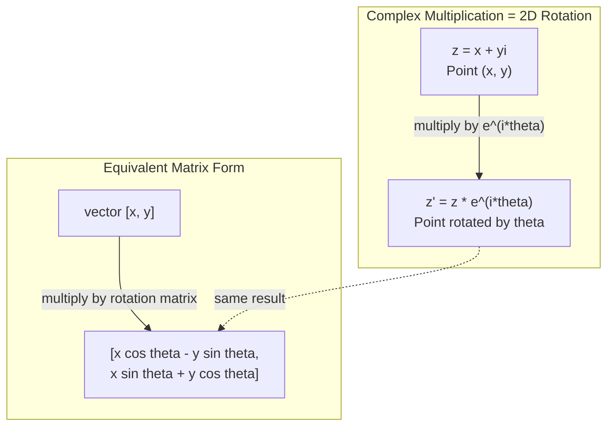
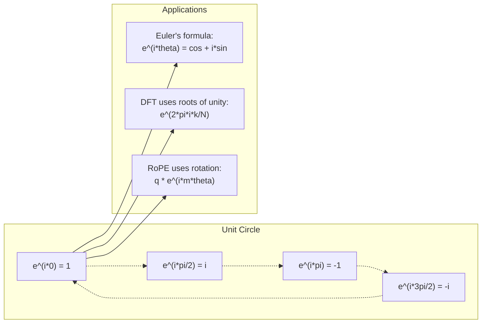

# 面向 AI 的复数

> -1 的平方根并不"虚"。它是理解旋转、频率以及半个信号处理世界的钥匙。

**类型:** 学习
**编程语言:** Python
**前置要求:** 第 1 阶段,第 01–04 课(线性代数、微积分)
**预计耗时:** 约 60 分钟

## 学习目标

- 在直角坐标形式和极坐标形式下进行复数运算(加、乘、除、共轭)
- 应用欧拉公式在复指数与三角函数之间相互转换
- 用复单位根实现离散傅里叶变换
- 解释复数旋转如何支撑 Transformer 中的 RoPE 与正弦位置编码

## 问题

你打开一篇讲傅里叶变换的论文,里面到处都是 `i`。你看 Transformer 的位置编码,看到不同频率的 `sin` 和 `cos`——那正是复指数的实部与虚部。你读量子计算的资料,发现一切都用复向量空间来表达。

复数看起来很抽象:一套建立在 -1 平方根之上的数系,感觉像个数学戏法。但它不是戏法,而是旋转与振荡的自然语言。凡是旋转、振动、波动的东西,复数都是最合适的工具。

不懂复数,你就无法理解离散傅里叶变换,无法理解 FFT,无法理解现代语言模型里 RoPE(旋转位置嵌入)的工作原理,也无法理解原始 Transformer 论文中的正弦位置编码为什么用那些频率。

本课从零构建复数运算,把它与几何联系起来,并精确展示复数出现在机器学习的哪些地方。

## 概念

### 什么是复数?

复数有两部分:实部和虚部。

```
z = a + bi

where:
  a is the real part
  b is the imaginary part
  i is the imaginary unit, defined by i^2 = -1
```

就这么多。你把数轴扩展成一个平面:实数躺在一根轴上,虚数躺在另一根轴上,每个复数都是这个平面上的一个点。

### 复数运算

**加法。** 实部加实部,虚部加虚部。

```
(a + bi) + (c + di) = (a + c) + (b + d)i

Example: (3 + 2i) + (1 + 4i) = 4 + 6i
```

**乘法。** 用分配律展开,记住 i^2 = -1。

```
(a + bi)(c + di) = ac + adi + bci + bdi^2
                 = ac + adi + bci - bd
                 = (ac - bd) + (ad + bc)i

Example: (3 + 2i)(1 + 4i) = 3 + 12i + 2i + 8i^2
                            = 3 + 14i - 8
                            = -5 + 14i
```

**共轭。** 把虚部的符号翻转。

```
conjugate of (a + bi) = a - bi
```

复数与它的共轭相乘,结果总是实数:

```
(a + bi)(a - bi) = a^2 + b^2
```

**除法。** 分子分母同乘分母的共轭。

```
(a + bi) / (c + di) = (a + bi)(c - di) / (c^2 + d^2)
```

这样消掉分母里的虚部,得到一个干净的复数。

### 复平面

复平面把每个复数映射到一个二维点。横轴是实轴,纵轴是虚轴。

```
z = 3 + 2i  corresponds to the point (3, 2)
z = -1 + 0i corresponds to the point (-1, 0) on the real axis
z = 0 + 4i  corresponds to the point (0, 4) on the imaginary axis
```

复数既是一个点,也是从原点出发的一个向量。正是这种双重身份,让复数在几何中大有用处。

### 极坐标形式

平面上任意一点,都可以用它到原点的距离和它与正实轴的夹角来描述。

```
z = r * (cos(theta) + i*sin(theta))

where:
  r = |z| = sqrt(a^2 + b^2)     (magnitude, or modulus)
  theta = atan2(b, a)             (phase, or argument)
```

直角坐标形式(a + bi)适合做加法,极坐标形式(r, theta)适合做乘法。

**极坐标下的乘法。** 模长相乘,辐角相加。

```
z1 = r1 * e^(i*theta1)
z2 = r2 * e^(i*theta2)

z1 * z2 = (r1 * r2) * e^(i*(theta1 + theta2))
```

这就是复数天生适合表示旋转的原因:乘以一个模长为 1 的复数,就是一次纯粹的旋转。

### 欧拉公式

连接复指数与三角函数的桥梁:

```
e^(i*theta) = cos(theta) + i*sin(theta)
```

这是本课最重要的公式。当 theta = pi 时:

```
e^(i*pi) = cos(pi) + i*sin(pi) = -1 + 0i = -1

Therefore: e^(i*pi) + 1 = 0
```

五个最基本的常数(e、i、pi、1、0)被一个等式串在一起。

### 欧拉公式对机器学习的意义

欧拉公式告诉我们:随着 theta 变化,`e^(i*theta)` 在单位圆上扫动。theta = 0 时在 (1, 0);theta = pi/2 时在 (0, 1);theta = pi 时在 (-1, 0);theta = 3*pi/2 时在 (0, -1)。转满一整圈是 theta = 2*pi。

这意味着复指数本身就是旋转,而旋转在信号处理和机器学习中无处不在。

### 与二维旋转的联系

把复数 (x + yi) 乘以 e^(i*theta),相当于把点 (x, y) 绕原点旋转角度 theta。

```
Rotation via complex multiplication:
  (x + yi) * (cos(theta) + i*sin(theta))
  = (x*cos(theta) - y*sin(theta)) + (x*sin(theta) + y*cos(theta))i

Rotation via matrix multiplication:
  [cos(theta)  -sin(theta)] [x]   [x*cos(theta) - y*sin(theta)]
  [sin(theta)   cos(theta)] [y] = [x*sin(theta) + y*cos(theta)]
```

两者结果完全一致。复数乘法就是二维旋转,旋转矩阵不过是复数乘法的矩阵写法。



### 相量与旋转信号

复指数 e^(i*omega*t) 是一个以角频率 omega 绕单位圆旋转的点。随着 t 增大,这个点在圆上不断转圈。

这个旋转点的实部是 cos(omega*t),虚部是 sin(omega*t)。一条正弦曲线,其实是一个旋转复数投下的影子。

```
e^(i*omega*t) = cos(omega*t) + i*sin(omega*t)

Real part:      cos(omega*t)    -- a cosine wave
Imaginary part: sin(omega*t)    -- a sine wave
```

这就是相量(phasor)表示法:你不再追踪一条扭来扭去的正弦波,而是追踪一支平滑旋转的箭头。相移变成角度偏移,幅度变化变成模长变化,信号相加变成向量相加。

### 单位根

N 次单位根是单位圆上 N 个等间距的点:

```
w_k = e^(2*pi*i*k/N)    for k = 0, 1, 2, ..., N-1
```

N = 4 时,单位根是 1、i、-1、-i(四个罗盘方向)。
N = 8 时,在四个罗盘方向之外再加上四个对角方向。

单位根是离散傅里叶变换的基石:DFT 把信号分解到这些等间隔频率的分量上。

### 与 DFT 的联系

信号 x[0], x[1], ..., x[N-1] 的离散傅里叶变换是:

```
X[k] = sum_{n=0}^{N-1} x[n] * e^(-2*pi*i*k*n/N)
```

每个 X[k] 衡量信号与第 k 个单位根(一个频率为 k 的复正弦)的相关程度。DFT 把信号拆成 N 个旋转相量,并告诉你每个相量的幅度与相位。

### 为什么 i 并不"虚"

"虚数"(imaginary)这个词是个历史误会——笛卡尔当年用它是带着轻蔑的。但 i 并不比负数更虚:人们当初也曾拒绝负数。负数回答的是"3 减去 5 得到什么",虚数单位回答的是"什么东西平方等于 -1"。

更有用的看法是:i 是一个 90 度旋转算子。实数乘一次 i,就转到虚轴方向,转了 90 度;再乘一次 i(即 i^2),又转 90 度——现在指向负实轴方向。这就是为什么 i^2 = -1。它并不神秘,只是两个四分之一圈拼成的一个半圈。

这就是复数在工程中无处不在的原因:凡是旋转的东西——电磁波、量子态、信号振荡、位置编码——用复数描述都最自然。

### 复指数 vs 三角函数

在欧拉公式之前,工程师把信号写成 A*cos(omega*t + phi):幅度 A、频率 omega、相位 phi。这样能行,但算术很痛苦——把两个不同相位的余弦加起来,得动用三角恒等式。

换成复指数,同一个信号就是 A*e^(i*(omega*t + phi))。两个信号相加就是两个复数相加;相乘(调制)就是模长相乘、辐角相加;相移变成角度相加;频移变成乘以一个相量。

整个信号处理领域之所以全面转向复指数记号,就是因为代数更干净。"真实信号"永远只是复数表示的实部,虚部只是顺带着做簿记,让所有代数自然成立。

### 与 Transformer 的联系

**正弦位置编码**(原始 Transformer 论文):

```
PE(pos, 2i) = sin(pos / 10000^(2i/d))
PE(pos, 2i+1) = cos(pos / 10000^(2i/d))
```

成对的 sin 和 cos,正是不同频率下复指数的实部与虚部。每个频率提供一种不同的"分辨率"来编码位置:低频变化慢(粗粒度位置),高频变化快(细粒度位置)。合在一起,每个位置都有了独一无二的频率指纹。

**RoPE(旋转位置嵌入)** 更进一步:它显式地用复数旋转矩阵去乘 query 和 key 向量。两个 token 之间的相对位置变成一个旋转角,注意力用旋转后的向量计算,于是模型通过复数乘法获得了对相对位置的感知能力。

| 运算 | 代数形式 | 几何意义 |
|-----------|---------------|-------------------|
| 加法 | (a+c) + (b+d)i | 平面上的向量相加 |
| 乘法 | (ac-bd) + (ad+bc)i | 旋转加缩放 |
| 共轭 | a - bi | 关于实轴镜像 |
| 模长 | sqrt(a^2 + b^2) | 到原点的距离 |
| 相位 | atan2(b, a) | 与正实轴的夹角 |
| 除法 | 乘以共轭 | 反向旋转并重新缩放 |
| 幂 | r^n * e^(i*n*theta) | 旋转 n 次,缩放 r^n 倍 |



```figure
roots-of-unity
```

## 动手构建

### 第 1 步:复数类

实现一个复数类,支持四则运算、模长、相位,以及直角坐标与极坐标之间的转换。

```python
import math

class Complex:
    def __init__(self, real, imag=0.0):
        self.real = real
        self.imag = imag

    def __add__(self, other):
        return Complex(self.real + other.real, self.imag + other.imag)

    def __mul__(self, other):
        r = self.real * other.real - self.imag * other.imag
        i = self.real * other.imag + self.imag * other.real
        return Complex(r, i)

    def __truediv__(self, other):
        denom = other.real ** 2 + other.imag ** 2
        r = (self.real * other.real + self.imag * other.imag) / denom
        i = (self.imag * other.real - self.real * other.imag) / denom
        return Complex(r, i)

    def magnitude(self):
        return math.sqrt(self.real ** 2 + self.imag ** 2)

    def phase(self):
        return math.atan2(self.imag, self.real)

    def conjugate(self):
        return Complex(self.real, -self.imag)
```

### 第 2 步:极坐标转换与欧拉公式

```python
def to_polar(z):
    return z.magnitude(), z.phase()

def from_polar(r, theta):
    return Complex(r * math.cos(theta), r * math.sin(theta))

def euler(theta):
    return Complex(math.cos(theta), math.sin(theta))
```

验证:`euler(theta).magnitude()` 应始终等于 1.0;`euler(0)` 应得到 (1, 0);`euler(pi)` 应得到 (-1, 0)。

### 第 3 步:旋转

把点 (x, y) 旋转角度 theta,只需一次复数乘法:

```python
point = Complex(3, 4)
rotated = point * euler(math.pi / 4)
```

模长不变,只有角度改变。

### 第 4 步:用复数运算实现 DFT

```python
def dft(signal):
    N = len(signal)
    result = []
    for k in range(N):
        total = Complex(0, 0)
        for n in range(N):
            angle = -2 * math.pi * k * n / N
            total = total + Complex(signal[n], 0) * euler(angle)
        result.append(total)
    return result
```

这是 O(N^2) 的 DFT。每个输出 X[k] 都是信号样本与单位根相乘后的累加。

### 第 5 步:逆 DFT

逆 DFT 从频谱重建原始信号。与正向 DFT 相比只有两处改动:指数符号翻转,并除以 N。

```python
def idft(spectrum):
    N = len(spectrum)
    result = []
    for n in range(N):
        total = Complex(0, 0)
        for k in range(N):
            angle = 2 * math.pi * k * n / N
            total = total + spectrum[k] * euler(angle)
        result.append(Complex(total.real / N, total.imag / N))
    return result
```

这样能得到完美重建:先做 DFT 再做 IDFT,就能在机器精度内还原原始信号,不丢失任何信息。

### 第 6 步:单位根

```python
def roots_of_unity(N):
    return [euler(2 * math.pi * k / N) for k in range(N)]
```

验证两条性质:
- 每个根的模长恰好为 1。
- 全部 N 个根之和为零(对称抵消)。

正是这两条性质让 DFT 可逆:单位根构成了频域的一组正交基。

## 投入使用

Python 内置复数支持,字面量 `j` 表示虚数单位。

```python
z = 3 + 2j
w = 1 + 4j

print(z + w)
print(z * w)
print(abs(z))

import cmath
print(cmath.phase(z))
print(cmath.exp(1j * cmath.pi))
```

对数组,numpy 原生处理复数:

```python
import numpy as np

z = np.array([1+2j, 3+4j, 5+6j])
print(np.abs(z))
print(np.angle(z))
print(np.conj(z))
print(np.real(z))
print(np.imag(z))

signal = np.sin(2 * np.pi * 5 * np.linspace(0, 1, 128))
spectrum = np.fft.fft(signal)
freqs = np.fft.fftfreq(128, d=1/128)
```

## 交付

运行 `code/complex_numbers.py`,生成 `outputs/skill-complex-arithmetic.md`。

## 练习

1. **手算复数运算。** 计算 (2 + 3i) * (4 - i),并用代码验证。再计算 (5 + 2i) / (1 - 3i)。把两个结果画在复平面上,确认乘法确实让第一个数发生了旋转和缩放。

2. **连续旋转。** 从点 (1, 0) 出发,连续 12 次乘以 e^(i*pi/6)。验证 12 次乘法后你回到了 (1, 0)。打印每步的坐标,确认它们构成一个正十二边形。

3. **已知信号的 DFT。** 构造一个信号:sin(2*pi*3*t) 与 0.5*sin(2*pi*7*t) 之和,采样 32 个点。运行你的 DFT,验证幅度谱在频率 3 和 7 处各有一个峰,且频率 7 处的峰高是频率 3 处的一半。

4. **单位根可视化。** 计算 8 次单位根,验证它们的和为零;再验证任意一个根乘以本原根 e^(2*pi*i/8) 都会得到下一个根。

5. **旋转矩阵等价性。** 随机取 10 个角度和 10 个点,验证复数乘法与 2x2 旋转矩阵的矩阵-向量乘法给出相同结果,并打印最大数值误差。

## 关键术语

| 术语 | 含义 |
|------|---------------|
| 复数(Complex number) | 形如 a + bi 的数,a 是实部,b 是虚部,i^2 = -1 |
| 虚数单位(Imaginary unit) | 数 i,由 i^2 = -1 定义。它并非哲学意义上的"虚"——它是一个旋转算子 |
| 复平面(Complex plane) | 横轴为实轴、纵轴为虚轴的二维平面,也叫 Argand 平面 |
| 模长(Magnitude / modulus) | 到原点的距离:sqrt(a^2 + b^2),记作 \|z\| |
| 相位(Phase / argument) | 与正实轴的夹角:atan2(b, a),记作 arg(z) |
| 共轭(Conjugate) | 关于实轴的镜像:a + bi 的共轭是 a - bi |
| 极坐标形式(Polar form) | 把 z 写成 r * e^(i*theta) 而非 a + bi,让乘法变简单 |
| 欧拉公式(Euler's formula) | e^(i*theta) = cos(theta) + i*sin(theta),连接指数与三角函数 |
| 相量(Phasor) | 表示正弦信号的旋转复数 e^(i*omega*t) |
| 单位根(Roots of unity) | k = 0 到 N-1 的 N 个复数 e^(2*pi*i*k/N),即单位圆上 N 个等间距的点 |
| DFT | 离散傅里叶变换,用单位根把信号分解为复正弦分量 |
| RoPE | 旋转位置嵌入,在 Transformer 注意力中用复数乘法编码相对位置 |

## 延伸阅读

- [Visual Introduction to Euler's Formula](https://betterexplained.com/articles/intuitive-understanding-of-eulers-formula/)——不用繁重记号建立几何直觉
- [Su et al.: RoFormer (2021)](https://arxiv.org/abs/2104.09864)——提出用复数旋转做旋转位置嵌入的论文
- [Vaswani et al.: Attention Is All You Need (2017)](https://arxiv.org/abs/1706.03762)——提出正弦位置编码的原始 Transformer 论文
- [3Blue1Brown: Euler's formula with introductory group theory](https://www.youtube.com/watch?v=mvmuCPvRoWQ)——直观讲解为什么 e^(i*pi) = -1
- [Needham: Visual Complex Analysis](https://global.oup.com/academic/product/visual-complex-analysis-9780198534464)——复数最佳的可视化著作,充满几何洞见
- [Strang: Introduction to Linear Algebra, Ch. 10](https://math.mit.edu/~gs/linearalgebra/)——线性代数与特征值视角下的复数
