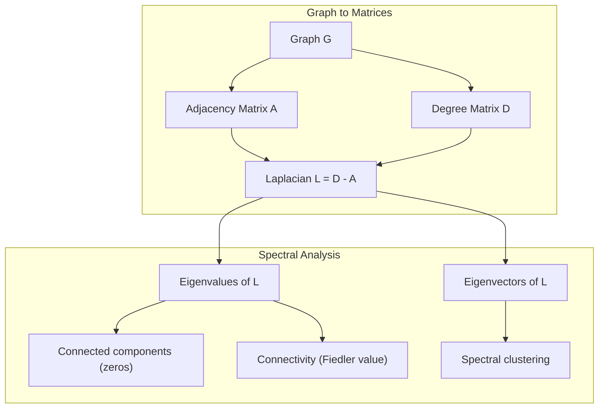
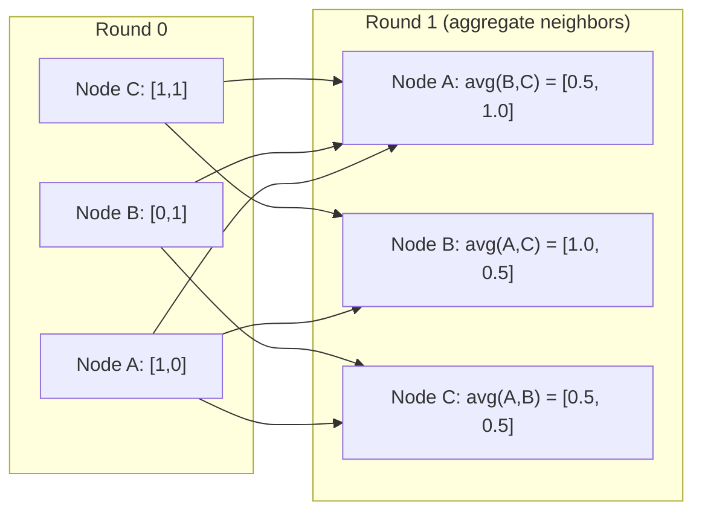

# 面向机器学习的图论

> 图是表达关系的数据结构。数据里有连接,你就需要图论。

**类型:** 动手构建
**编程语言:** Python
**前置要求:** 第 1 阶段,第 01–03 课(线性代数、矩阵)
**预计耗时:** 约 90 分钟

## 学习目标

- 用邻接矩阵/邻接表两种表示实现图类,并实现 BFS 与 DFS 遍历
- 计算图拉普拉斯矩阵,用它的特征值检测连通分量并对节点聚类
- 以归一化邻接矩阵乘法的形式,实现一轮 GNN 风格的消息传递
- 应用谱聚类,用 Fiedler 向量对图做划分

## 问题

社交网络、分子、知识库、引用网络、道路地图——全都是图。传统机器学习把数据当成扁平的表:每一行互相独立,每一列是一个特征。可当连接的结构本身重要时,表格就失效了。

以社交网络为例。你想预测某个用户会买什么产品:他自己的购买历史很重要,但他朋友们的购买历史更重要——连接里携带信号。

再看分子。你想预测它是否会与某种蛋白质结合:原子固然重要,但真正重要的是原子之间如何成键——结构本身就是数据。

图神经网络(GNN)是深度学习增长最快的方向,支撑着药物发现、社交推荐、欺诈检测和知识图谱推理。而每个 GNN 都建立在同一个地基之上:基础图论。

你需要四样东西:
1. 一种把图表示成矩阵的方法(这样才能做矩阵乘法)
2. 探索图结构的遍历算法
3. 拉普拉斯矩阵——谱图论中最重要的一张矩阵
4. 消息传递——让 GNN 运转起来的核心运算

## 概念

### 图:节点与边

图 G = (V, E) 由顶点(节点)V 和边 E 组成,每条边连接两个节点。

**有向与无向。** 无向图中,边 (u, v) 表示 u 连到 v 且 v 连到 u。有向图(digraph)中,边 (u, v) 表示 u 指向 v,反向则未必成立。

**加权与无权。** 无权图中,边只有存在与不存在两种状态。加权图中,每条边带一个数值权重——距离、成本或强度。

| 图类型 | 例子 |
|-----------|---------|
| 无向、无权 | Facebook 好友网络 |
| 有向、无权 | Twitter 关注网络 |
| 无向、加权 | 道路地图(距离) |
| 有向、加权 | 网页链接(PageRank 分数) |

### 邻接矩阵

邻接矩阵 A 是图的核心表示。对有 n 个节点的图:

```
A[i][j] = 1    if there is an edge from node i to node j
A[i][j] = 0    otherwise
```

无向图的 A 是对称的:A[i][j] = A[j][i]。加权图中 A[i][j] = 边 (i, j) 的权重。

**例子——三角形:**

```
Nodes: 0, 1, 2
Edges: (0,1), (1,2), (0,2)

A = [[0, 1, 1],
     [1, 0, 1],
     [1, 1, 0]]
```

邻接矩阵是每个 GNN 的输入:对 A 做矩阵运算,就对应着对图做操作。

### 度

节点的度是连接到它的边数。有向图里则分为入度(进来的边)和出度(出去的边)。

度矩阵 D 是对角矩阵:

```
D[i][i] = degree of node i
D[i][j] = 0    for i != j
```

三角形的例子中,D = diag(2, 2, 2),因为每个节点都连着另外两个。

度反映了节点的重要性:高度数 = 枢纽节点。网络的度分布揭示其结构——社交网络服从幂律分布(少数枢纽,大量边缘节点),随机图的度则服从泊松分布。

### BFS 与 DFS

两个最基本的图遍历算法,你都需要掌握。

**广度优先搜索(BFS):** 先访问所有邻居,再访问邻居的邻居。使用队列(FIFO)。

```
BFS from node 0:
  Visit 0
  Queue: [1, 2]        (neighbors of 0)
  Visit 1
  Queue: [2, 3]        (add neighbors of 1)
  Visit 2
  Queue: [3]           (neighbors of 2 already visited)
  Visit 3
  Queue: []            (done)
```

BFS 能在无权图中找到最短路径:起点到任意节点的距离,等于该节点在 BFS 中首次被发现时所在的层数。这就是社交网络用 BFS 计算"几度人脉"的原因。

**深度优先搜索(DFS):** 一条道走到黑,再回头。使用栈(LIFO)或递归。

```
DFS from node 0:
  Visit 0
  Stack: [1, 2]        (neighbors of 0)
  Visit 2               (pop from stack)
  Stack: [1, 3]         (add neighbors of 2)
  Visit 3               (pop from stack)
  Stack: [1]
  Visit 1               (pop from stack)
  Stack: []             (done)
```

DFS 适用于:
- 寻找连通分量(从未访问的节点出发反复跑 DFS)
- 环检测(DFS 树中的回边)
- 拓扑排序(DFS 结束顺序的逆序)

| 算法 | 数据结构 | 能找到 | 适用场景 |
|-----------|---------------|-------|----------|
| BFS | 队列 | 最短路径 | 社交网络距离、知识图谱遍历 |
| DFS | 栈 | 连通分量、环 | 连通性分析、拓扑排序 |

### 图拉普拉斯矩阵

L = D - A。谱图论中最重要的矩阵。

以三角形为例:

```
D = [[2, 0, 0],    A = [[0, 1, 1],    L = [[2, -1, -1],
     [0, 2, 0],         [1, 0, 1],         [-1, 2, -1],
     [0, 0, 2]]         [1, 1, 0]]         [-1, -1,  2]]
```

拉普拉斯矩阵有一组非凡的性质:

1. **L 是半正定的。** 所有特征值 >= 0。

2. **零特征值的个数等于连通分量的个数。** 连通图恰好有一个零特征值;有 3 个互不相连分量的图就有三个零特征值。

3. **最小的非零特征值(Fiedler 值)衡量连通性。** Fiedler 值大,说明图连通得好;Fiedler 值小,说明图存在弱点——瓶颈。

4. **Fiedler 值对应的特征向量(Fiedler 向量)揭示最佳划分。** 取值为正的节点归一组,取值为负的归另一组——这就是谱聚类。



### 谱性质

邻接矩阵和拉普拉斯矩阵的特征值,能在不做任何遍历的情况下揭示图的结构性质。

**谱聚类**的流程是:
1. 计算拉普拉斯矩阵 L
2. 求 L 的最小的 k 个特征向量(跳过第一个——连通图的它是全 1 向量)
3. 把这些特征向量当作每个节点的新坐标
4. 在这些坐标上跑 k-means

为什么有效?L 的特征向量编码的是图上"最平滑"的函数:连接紧密的节点会拿到相近的特征向量取值,被瓶颈隔开的节点取值则不同。特征向量天然把簇分开。

**与随机游走的联系。** 归一化拉普拉斯与图上的随机游走相关:随机游走的平稳分布正比于节点的度,而混合时间(游走收敛的速度)取决于谱隙。

### 消息传递

图神经网络的核心运算。每个节点从邻居那里收集消息,聚合之后更新自己的状态。

```
h_v^(k+1) = UPDATE(h_v^(k), AGGREGATE({h_u^(k) : u in neighbors(v)}))
```

最简单的形式里,AGGREGATE = 取平均,UPDATE = 线性变换加激活:

```
h_v^(k+1) = sigma(W * mean({h_u^(k) : u in neighbors(v)}))
```

这其实是伪装起来的矩阵乘法。设 H 是所有节点特征组成的矩阵,A 是邻接矩阵:

```
H^(k+1) = sigma(A_norm * H^(k) * W)
```

其中 A_norm 是归一化邻接矩阵(每行和为 1)。

一轮消息传递让每个节点"看见"自己的直接邻居;两轮让它看见邻居的邻居;K 轮之后,每个节点就掌握了它 K 跳邻域内的信息。



### 概念与机器学习应用对照

| 概念 | 机器学习应用 |
|---------|---------------|
| 邻接矩阵 | GNN 的输入表示 |
| 图拉普拉斯 | 谱聚类、社区发现 |
| BFS/DFS | 知识图谱遍历、路径查找 |
| 度分布 | 节点重要性、特征工程 |
| 消息传递 | GNN 层(GCN、GAT、GraphSAGE) |
| L 的特征值 | 社区发现、图划分 |
| 谱聚类 | 无监督节点分组 |
| PageRank | 节点重要性、网页搜索 |

```figure
graph-degree-distribution
```

## 动手构建

### 第 1 步:从零实现图类

```python
class Graph:
    def __init__(self, n_nodes, directed=False):
        self.n = n_nodes
        self.directed = directed
        self.adj = {i: {} for i in range(n_nodes)}

    def add_edge(self, u, v, weight=1.0):
        self.adj[u][v] = weight
        if not self.directed:
            self.adj[v][u] = weight

    def neighbors(self, node):
        return list(self.adj[node].keys())

    def degree(self, node):
        return len(self.adj[node])

    def adjacency_matrix(self):
        import numpy as np
        A = np.zeros((self.n, self.n))
        for u in range(self.n):
            for v, w in self.adj[u].items():
                A[u][v] = w
        return A

    def degree_matrix(self):
        import numpy as np
        D = np.zeros((self.n, self.n))
        for i in range(self.n):
            D[i][i] = self.degree(i)
        return D

    def laplacian(self):
        return self.degree_matrix() - self.adjacency_matrix()
```

邻接表(`self.adj`)高效存储邻居;转成邻接矩阵时用 numpy,因为所有谱操作都需要它。

### 第 2 步:BFS 与 DFS

```python
from collections import deque

def bfs(graph, start):
    visited = set()
    order = []
    distances = {}
    queue = deque([(start, 0)])
    visited.add(start)
    while queue:
        node, dist = queue.popleft()
        order.append(node)
        distances[node] = dist
        for neighbor in graph.neighbors(node):
            if neighbor not in visited:
                visited.add(neighbor)
                queue.append((neighbor, dist + 1))
    return order, distances


def dfs(graph, start):
    visited = set()
    order = []
    stack = [start]
    while stack:
        node = stack.pop()
        if node in visited:
            continue
        visited.add(node)
        order.append(node)
        for neighbor in reversed(graph.neighbors(node)):
            if neighbor not in visited:
                stack.append(neighbor)
    return order
```

BFS 用 deque(双端队列)实现 O(1) 的 popleft;DFS 用 list 当栈。两者都恰好访问每个节点一次,时间复杂度 O(V + E)。

### 第 3 步:连通分量与拉普拉斯特征值

```python
def connected_components(graph):
    visited = set()
    components = []
    for node in range(graph.n):
        if node not in visited:
            order, _ = bfs(graph, node)
            visited.update(order)
            components.append(order)
    return components


def laplacian_eigenvalues(graph):
    import numpy as np
    L = graph.laplacian()
    eigenvalues = np.linalg.eigvalsh(L)
    return eigenvalues
```

`eigvalsh` 用于对称矩阵——无向图的拉普拉斯矩阵总是对称的。它按升序返回特征值,数一数有几个零,就知道有几个连通分量。

### 第 4 步:谱聚类

```python
def spectral_clustering(graph, k=2):
    import numpy as np
    L = graph.laplacian()
    eigenvalues, eigenvectors = np.linalg.eigh(L)
    features = eigenvectors[:, 1:k+1]

    labels = np.zeros(graph.n, dtype=int)
    for i in range(graph.n):
        if features[i, 0] >= 0:
            labels[i] = 0
        else:
            labels[i] = 1
    return labels
```

k=2 时,按 Fiedler 向量的正负号把图分成两簇。k>2 时,在前 k 个特征向量(排除平凡的全 1 特征向量)上跑 k-means。

### 第 5 步:消息传递

```python
def message_passing(graph, features, weight_matrix):
    import numpy as np
    A = graph.adjacency_matrix()
    row_sums = A.sum(axis=1, keepdims=True)
    row_sums[row_sums == 0] = 1
    A_norm = A / row_sums
    aggregated = A_norm @ features
    output = aggregated @ weight_matrix
    return output
```

这就是一轮 GNN 消息传递:每个节点的新特征,是邻居特征的加权平均再经权重矩阵变换的结果。堆叠多轮,信息就能传播得更远。

## 投入使用

有了 networkx 和 numpy,同样的操作都是一行搞定:

```python
import networkx as nx
import numpy as np

G = nx.karate_club_graph()

A = nx.adjacency_matrix(G).toarray()
L = nx.laplacian_matrix(G).toarray()

eigenvalues = np.linalg.eigvalsh(L.astype(float))
print(f"Smallest eigenvalues: {eigenvalues[:5]}")
print(f"Connected components: {nx.number_connected_components(G)}")

communities = nx.community.greedy_modularity_communities(G)
print(f"Communities found: {len(communities)}")

pr = nx.pagerank(G)
top_nodes = sorted(pr.items(), key=lambda x: x[1], reverse=True)[:5]
print(f"Top 5 PageRank nodes: {top_nodes}")
```

networkx 依托优化的 C 后端,能处理任意规模的图。生产环境用它;你从零写的实现,用来理解它背后的原理。

### numpy 谱分析

```python
import numpy as np

A = np.array([
    [0, 1, 1, 0, 0],
    [1, 0, 1, 0, 0],
    [1, 1, 0, 1, 0],
    [0, 0, 1, 0, 1],
    [0, 0, 0, 1, 0]
])

D = np.diag(A.sum(axis=1))
L = D - A

eigenvalues, eigenvectors = np.linalg.eigh(L)
print(f"Eigenvalues: {np.round(eigenvalues, 4)}")
print(f"Fiedler value: {eigenvalues[1]:.4f}")
print(f"Fiedler vector: {np.round(eigenvectors[:, 1], 4)}")

fiedler = eigenvectors[:, 1]
group_a = np.where(fiedler >= 0)[0]
group_b = np.where(fiedler < 0)[0]
print(f"Cluster A: {group_a}")
print(f"Cluster B: {group_b}")
```

重活全由 Fiedler 向量干:正值归一簇,负值归另一簇。不需要迭代优化,一次特征分解就够了。

## 交付

本课产出:
- `outputs/skill-graph-analysis.md`——一份分析图结构数据的技能参考

## 知识联结

| 概念 | 出现位置 |
|---------|------------------|
| 邻接矩阵 | GCN、GAT、GraphSAGE 的输入 |
| 拉普拉斯 | 谱聚类、ChebNet 滤波器 |
| BFS | 知识图谱遍历、最短路径查询 |
| 消息传递 | 每一个 GNN 层、神经消息传递 |
| 谱隙 | 图连通性、随机游走混合时间 |
| 度分布 | 幂律网络、节点特征工程 |
| 连通分量 | 预处理、处理非连通图 |
| PageRank | 节点重要性排序、注意力初始化 |

GNN 值得专门一提。GCN(Kipf & Welling, 2017)中的图卷积运算,使用了加自环的邻接矩阵 A_hat = A + I:

```text
H^(l+1) = sigma(D_hat^(-1/2) * A_hat * D_hat^(-1/2) * H^(l) * W^(l))
```

其中 A_hat = A + I(邻接矩阵加自环),D_hat 是 A_hat 的度矩阵。自环保证每个节点在聚合时也包含自己的特征。这正是带对称归一化的消息传递:D_hat^(-1/2) * A_hat * D_hat^(-1/2) 就是归一化邻接矩阵。拉普拉斯在这里现身,是因为这种归一化与 L_sym = I - D^(-1/2) * A * D^(-1/2) 相关。理解了拉普拉斯,就理解了 GCN 为什么有效。

## 练习

1. **从零实现 PageRank。** 从均匀分数开始,每步更新:score(v) = (1-d)/n + d * sum(score(u)/out_degree(u)),对所有指向 v 的 u 求和。取 d=0.85,迭代到收敛(变化量 < 1e-6),在一个小型网页图上测试。

2. **用谱聚类发现社区。** 构造一个含两个明显分离簇的图(例如两个仅由一条边相连的团),运行谱聚类并验证划分正确。逐渐增加跨簇的边,会发生什么?

3. **实现 Dijkstra 算法**,求加权图的最短路径。与同一图上按等权重跑 BFS 的结果做比较。

4. **搭建两层消息传递网络。** 用不同的权重矩阵做两轮消息传递,证明两轮之后每个节点都掌握了它 2 跳邻域内的信息。

5. **分析一个真实图。** 使用空手道俱乐部图(Karate Club,34 个节点、78 条边),计算度分布、拉普拉斯特征值并做谱聚类,把谱聚类结果与已知的真实分裂做对比。

## 关键术语

| 术语 | 别人的说法 | 实际含义 |
|------|----------------|----------------------|
| 图(Graph) | "节点和边" | 编码成对关系的数学结构 G=(V,E) |
| 邻接矩阵(Adjacency matrix) | "连接表" | n x n 矩阵,节点 i 与 j 相连时 A[i][j] = 1 |
| 度(Degree) | "节点有多忙" | 与节点相连的边数 |
| 拉普拉斯(Laplacian) | "D 减 A" | L = D - A,其特征值揭示图结构的矩阵 |
| Fiedler 值(Fiedler value) | "代数连通度" | L 的最小非零特征值,衡量图的连通程度 |
| BFS | "逐层搜索" | 先访问所有邻居再深入的遍历,可求最短路径 |
| DFS | "先往深里走" | 沿一条路走到底再回退的遍历 |
| 消息传递(Message passing) | "节点与邻居交谈" | 每个节点聚合邻居的信息,GNN 的核心 |
| 谱聚类(Spectral clustering) | "按特征向量聚类" | 用拉普拉斯矩阵的特征向量对图做划分 |
| 连通分量(Connected component) | "独立的一块" | 任意两节点互相可达的极大子图 |

## 延伸阅读

- **Kipf & Welling (2017)**——"Semi-Supervised Classification with Graph Convolutional Networks"。开启现代 GNN 的论文,证明了谱图卷积可简化为消息传递。
- **Spielman (2012)**——"Spectral Graph Theory"讲义。拉普拉斯、谱隙与图划分的权威入门。
- **Hamilton (2020)**——"Graph Representation Learning"。从基础到应用覆盖 GNN 的专著。
- **Bronstein et al. (2021)**——"Geometric Deep Learning: Grids, Groups, Graphs, Geodesics, and Gauges"。统一框架论文。
- **Veličković et al. (2018)**——"Graph Attention Networks"。用注意力机制扩展消息传递。
