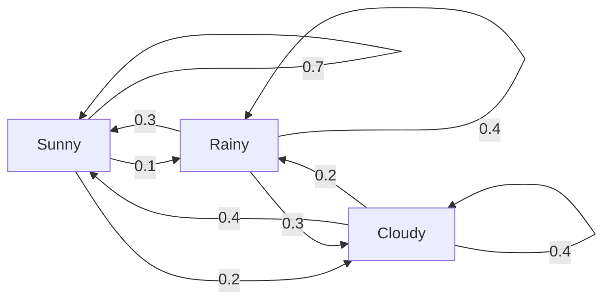
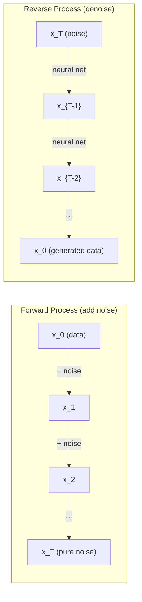

# 随机过程

> 有结构的随机性。随机游走、马尔可夫链与扩散模型背后的数学。

**类型:** 学习
**编程语言:** Python
**前置要求:** 第 1 阶段,第 06–07 课(概率、贝叶斯)
**预计耗时:** 约 75 分钟

## 学习目标

- 模拟一维和二维随机游走,验证位移的 sqrt(n) 标度律
- 构建马尔可夫链模拟器,用特征分解求它的平稳分布
- 实现 Metropolis-Hastings MCMC 与 Langevin 动力学,从目标分布中采样
- 把正向扩散过程与布朗运动联系起来,解释反向过程如何生成数据

## 问题

很多 AI 系统都涉及随时间演化的随机性——不是静态的随机,而是有结构、有顺序的随机:每一步都依赖于之前的每一步。

语言模型逐个生成 token,每个 token 都依赖前面的上下文。模型输出一个概率分布,从中采样,然后继续——这就是一个随机过程。

扩散模型一步步给图像加噪,直到它变成纯粹的雪花点;然后再把这个过程倒过来,一步步去噪,直到一张新图像浮现。正向过程是马尔可夫链,反向过程则是一条学出来的、倒着走的马尔可夫链。

强化学习智能体在环境中采取行动,每个行动都以某种概率导向一个新状态。智能体在随机的世界里执行随机的策略,整个系统就是一个马尔可夫决策过程。

MCMC 采样——贝叶斯推断的支柱——构造一条马尔可夫链,让它的平稳分布恰好是你要采样的后验分布。

所有这些都建立在四个基础概念之上:
1. 随机游走——最简单的随机过程
2. 马尔可夫链——带转移矩阵的结构化随机
3. Langevin 动力学——带噪声的梯度下降
4. Metropolis-Hastings——从任意分布中采样

## 概念

### 随机游走

从位置 0 出发,每步抛一枚均匀硬币:正面向右(+1),反面向左(-1)。

n 步之后,你的位置是 n 个随机 +/-1 之和。期望位置是 0(游走无偏),但到原点的期望距离按 sqrt(n) 增长。

这违反直觉:游走是公平的,两个方向都没有漂移,可它却会越走越远。n 步之后的标准差是 sqrt(n)。

```
Step 0:  Position = 0
Step 1:  Position = +1 or -1
Step 2:  Position = +2, 0, or -2
...
Step 100: Expected distance from origin ~ 10 (sqrt(100))
Step 10000: Expected distance from origin ~ 100 (sqrt(10000))
```

**在二维**,游走以相等概率向上、下、左、右移动,到原点的距离同样服从 sqrt(n) 标度,轨迹呈分形图案。

**为什么是 sqrt(n)?** 每步等概率取 +1 或 -1。n 步后位置 S_n = X_1 + X_2 + ... + X_n,每个 X_i 为 +/-1。每步方差为 1,且各步独立,所以 Var(S_n) = n,标准差 = sqrt(n)。由中心极限定理,S_n / sqrt(n) 收敛到标准正态分布。

这个 sqrt(n) 标度在机器学习中随处可见:SGD 噪声按 1/sqrt(batch_size) 缩放,嵌入维度按 sqrt(d) 缩放。平方根是"独立随机量相加"的签名。

**与布朗运动的联系。** 让步长为 1/sqrt(n)、单位时间走 n 步的随机游走取极限 n → ∞,它就收敛到布朗运动 B(t)——一个连续时间过程,其中 B(t) 服从均值 0、方差 t 的正态分布。

布朗运动是扩散的数学基础:它刻画流体中粒子的随机颤动、股票价格的波动,以及——最关键的——扩散模型中的加噪过程。

**赌徒破产问题。** 随机游走者从位置 k 出发,0 和 N 处是吸收壁。先到达 N 而不是 0 的概率是多少?对公平游走:P(到达 N) = k/N。答案简单优雅得出人意料。它与鞅(martingale)理论相连——公平的随机游走就是鞅(未来期望值 = 当前值)。

### 马尔可夫链

马尔可夫链是按固定概率在状态之间转移的系统。关键性质:下一个状态只取决于当前状态,与历史无关。

```
P(X_{t+1} = j | X_t = i, X_{t-1} = ...) = P(X_{t+1} = j | X_t = i)
```

这就是马尔可夫性质。它意味着整个动力学可以用一个转移矩阵 P 完整描述:

```
P[i][j] = probability of going from state i to state j
```

P 的每一行和为 1(总得去某个地方)。

**例子——天气:**

```
States: Sunny (0), Rainy (1), Cloudy (2)

P = [[0.7, 0.1, 0.2],    (if sunny: 70% sunny, 10% rainy, 20% cloudy)
     [0.3, 0.4, 0.3],    (if rainy: 30% sunny, 40% rainy, 30% cloudy)
     [0.4, 0.2, 0.4]]    (if cloudy: 40% sunny, 20% rainy, 40% cloudy)
```

从任意状态出发,经过多次转移后,状态分布会收敛到平稳分布 pi,满足 pi * P = pi——它是 P 的属于特征值 1 的左特征向量。

对这条天气链,平稳分布是 [0.55, 0.18, 0.27]:长期来看,无论从哪个状态出发,晴天的占比都是 55%。



**计算平稳分布。** 有两种方法:

1. **幂法**:把任意初始分布反复乘以 P,迭代足够多次后收敛。
2. **特征值法**:求 P 的属于特征值 1 的左特征向量,即 P^T 的属于特征值 1 的特征向量。

两种方法都要求链满足收敛条件。

**收敛条件。** 马尔可夫链收敛到唯一平稳分布,当且仅当它是:
- **不可约的**(irreducible):任意状态可达任意其他状态
- **非周期的**(aperiodic):链不以固定周期循环

机器学习里遇到的链大多同时满足这两个条件。

**吸收态。** 一旦进入就永远离开不了的状态,称为吸收态(P[i][i] = 1)。吸收马尔可夫链刻画带终态的过程——一局游戏的结束、一个流失的客户、一段碰到结束符的 token 序列。

**混合时间。** 链需要多少步才"接近"平稳分布?形式化地说,就是与平稳分布之间的总变差距离降到某个阈值以下所需的步数。混合快 = 所需步数少。P 的谱隙(1 减去第二大的特征值)控制混合时间:谱隙越大,混合越快。

### 与语言模型的联系

语言模型的 token 生成近似一个马尔可夫过程:给定当前上下文,模型输出下一个 token 的分布。温度(temperature)控制分布的尖锐程度:

```
P(token_i) = exp(logit_i / temperature) / sum(exp(logit_j / temperature))
```

- temperature = 1.0:标准分布
- temperature < 1.0:更尖锐(更确定)
- temperature > 1.0:更平坦(更随机)
- temperature → 0:argmax(贪心)

Top-k 采样把候选截断到概率最高的 k 个 token;top-p(核)采样截断到累计概率刚超过 p 的最小 token 集合。两者都在修改马尔可夫转移概率。

### 布朗运动

随机游走的连续时间极限。位置 B(t) 有三条性质:
1. B(0) = 0
2. B(t) - B(s) 服从均值 0、方差 t - s 的正态分布(t > s)
3. 不重叠区间上的增量相互独立

布朗运动处处连续但处处不可微——它在任何尺度上都在颤动。平面上的轨迹分形维数为 2。

离散模拟中,布朗运动用下式近似:

```
B(t + dt) = B(t) + sqrt(dt) * z,    where z ~ N(0, 1)
```

sqrt(dt) 这个标度很重要,它来自应用于随机游走的中心极限定理。

### Langevin 动力学

梯度下降找函数的最小值;Langevin 动力学找的是正比于 exp(-U(x)/T) 的概率分布,其中 U 是能量函数,T 是温度。

```
x_{t+1} = x_t - dt * gradient(U(x_t)) + sqrt(2 * T * dt) * z_t
```

粒子受两股力:
1. **梯度力**(-dt * gradient(U)):把它推向低能量处(和梯度下降一样)
2. **随机力**(sqrt(2*T*dt) * z):把它推向随机方向(探索)

温度 T = 0 时,这就是纯梯度下降;温度很高时,接近随机游走;温度合适时,粒子在能量地形上探索,并在低能量区域停留更久。

**与扩散模型的联系。** 扩散模型的正向过程是:

```
x_t = sqrt(alpha_t) * x_{t-1} + sqrt(1 - alpha_t) * noise
```

这是一条马尔可夫链,逐渐把数据与噪声混合。步数足够多之后,x_T 就是纯高斯噪声。

反向过程——从噪声回到数据——也是一条马尔可夫链,只是它的转移概率由神经网络学习。网络学会预测每一步加入的噪声,再把它减掉。



### MCMC:马尔可夫链蒙特卡洛

有时你需要从分布 p(x) 中采样,而这个分布你只能计算(差一个常数因子),却无法直接采样。贝叶斯后验是最经典的例子——你知道似然乘先验,但归一化常数算不出来。

**Metropolis-Hastings** 构造一条以 p(x) 为平稳分布的马尔可夫链:

1. 从某个位置 x 出发
2. 从提议分布 Q(x'|x) 提出一个新位置 x'
3. 计算接受比率:a = p(x') * Q(x|x') / (p(x) * Q(x'|x))
4. 以 min(1, a) 的概率接受 x',否则留在 x
5. 重复

如果 Q 对称(例如 Q(x'|x) = Q(x|x') = N(x, sigma^2)),比率简化为 a = p(x') / p(x)。你只需要概率之比——归一化常数被约掉了。

在宽松条件下,这条链保证收敛到 p(x)。但如果提议步长太小(变成随机游走)或太大(拒绝率过高),收敛会很慢。调提议分布正是 MCMC 的艺术。

**为什么有效。** 接受比率保证了细致平衡(detailed balance):位于 x 并移动到 x' 的概率,等于位于 x' 并移动到 x 的概率。细致平衡意味着 p(x) 是这条链的平稳分布。所以步数足够多之后,样本就来自 p(x)。

**实践要点:**
- **预烧(burn-in)**:丢掉前 N 个样本。链从起点走到平稳分布需要时间。
- **抽稀(thinning)**:每 k 个样本保留一个,降低自相关。
- **多链并行**:从不同起点跑几条链。若它们收敛到同一个分布,就是收敛的证据。
- **接受率**:对 d 维高斯提议,最优接受率约为 23%(Roberts & Rosenthal, 2001)。太高说明链几乎不动,太低说明它什么都拒绝。

### AI 中的随机过程

| 过程 | AI 应用 |
|---------|---------------|
| 随机游走 | 强化学习中的探索、Node2Vec 嵌入 |
| 马尔可夫链 | 文本生成、MCMC 采样 |
| 布朗运动 | 扩散模型(正向过程) |
| Langevin 动力学 | 基于分数的生成模型、SGLD |
| 马尔可夫决策过程 | 强化学习 |
| Metropolis-Hastings | 贝叶斯推断、后验采样 |

```figure
random-walk-diffusion
```

## 动手构建

### 第 1 步:随机游走模拟器

```python
import numpy as np

def random_walk_1d(n_steps, seed=None):
    rng = np.random.RandomState(seed)
    steps = rng.choice([-1, 1], size=n_steps)
    positions = np.concatenate([[0], np.cumsum(steps)])
    return positions


def random_walk_2d(n_steps, seed=None):
    rng = np.random.RandomState(seed)
    directions = rng.choice(4, size=n_steps)
    dx = np.zeros(n_steps)
    dy = np.zeros(n_steps)
    dx[directions == 0] = 1   # right
    dx[directions == 1] = -1  # left
    dy[directions == 2] = 1   # up
    dy[directions == 3] = -1  # down
    x = np.concatenate([[0], np.cumsum(dx)])
    y = np.concatenate([[0], np.cumsum(dy)])
    return x, y
```

一维游走存的是累计和:每步 +1 或 -1,n 步后的位置就是总和。方差随 n 线性增长,因此标准差按 sqrt(n) 增长。

### 第 2 步:马尔可夫链

```python
class MarkovChain:
    def __init__(self, transition_matrix, state_names=None):
        self.P = np.array(transition_matrix, dtype=float)
        self.n_states = len(self.P)
        self.state_names = state_names or [str(i) for i in range(self.n_states)]

    def step(self, current_state, rng=None):
        if rng is None:
            rng = np.random.RandomState()
        probs = self.P[current_state]
        return rng.choice(self.n_states, p=probs)

    def simulate(self, start_state, n_steps, seed=None):
        rng = np.random.RandomState(seed)
        states = [start_state]
        current = start_state
        for _ in range(n_steps):
            current = self.step(current, rng)
            states.append(current)
        return states

    def stationary_distribution(self):
        eigenvalues, eigenvectors = np.linalg.eig(self.P.T)
        idx = np.argmin(np.abs(eigenvalues - 1.0))
        stationary = np.real(eigenvectors[:, idx])
        stationary = stationary / stationary.sum()
        return np.abs(stationary)
```

平稳分布是 P 的属于特征值 1 的左特征向量。我们通过求 P^T 的特征向量来得到它(转置把左特征向量变成右特征向量)。

### 第 3 步:Langevin 动力学

```python
def langevin_dynamics(grad_U, x0, dt, temperature, n_steps, seed=None):
    rng = np.random.RandomState(seed)
    x = np.array(x0, dtype=float)
    trajectory = [x.copy()]
    for _ in range(n_steps):
        noise = rng.randn(*x.shape)
        x = x - dt * grad_U(x) + np.sqrt(2 * temperature * dt) * noise
        trajectory.append(x.copy())
    return np.array(trajectory)
```

梯度把 x 推向低能量处,噪声防止它卡住。达到平衡时,样本分布正比于 exp(-U(x)/temperature)。

### 第 4 步:Metropolis-Hastings

```python
def metropolis_hastings(target_log_prob, proposal_std, x0, n_samples, seed=None):
    rng = np.random.RandomState(seed)
    x = np.array(x0, dtype=float)
    samples = [x.copy()]
    accepted = 0
    for _ in range(n_samples - 1):
        x_proposed = x + rng.randn(*x.shape) * proposal_std
        log_ratio = target_log_prob(x_proposed) - target_log_prob(x)
        if np.log(rng.rand()) < log_ratio:
            x = x_proposed
            accepted += 1
        samples.append(x.copy())
    acceptance_rate = accepted / (n_samples - 1)
    return np.array(samples), acceptance_rate
```

算法提出一个新点,检查它的概率是否更高(或者以正比于概率比的机率接受),然后重复。要获得良好的混合,接受率应在 23–50% 左右。

## 投入使用

实际工作中,这些算法都有成熟库可用。但理解内部机制,对调试和调参至关重要。

```python
import numpy as np

rng = np.random.RandomState(42)
walk = np.cumsum(rng.choice([-1, 1], size=10000))
print(f"Final position: {walk[-1]}")
print(f"Expected distance: {np.sqrt(10000):.1f}")
print(f"Actual distance: {abs(walk[-1])}")
```

### numpy 处理转移矩阵

```python
import numpy as np

P = np.array([[0.7, 0.1, 0.2],
              [0.3, 0.4, 0.3],
              [0.4, 0.2, 0.4]])

distribution = np.array([1.0, 0.0, 0.0])
for _ in range(100):
    distribution = distribution @ P

print(f"Stationary distribution: {np.round(distribution, 4)}")
```

把初始分布反复乘以 P。迭代足够多次后,无论从哪儿出发都会收敛到平稳分布——这就是求主左特征向量的幂法。

### 与真实框架的联系

- **PyTorch 扩散:** Hugging Face `diffusers` 中的 `DDPMScheduler` 实现了正向与反向马尔可夫链
- **NumPyro / PyMC:** 用 MCMC(NUTS 采样器,Metropolis-Hastings 的改进版)做贝叶斯推断
- **Gymnasium(强化学习):** 环境的 step 函数定义了一个马尔可夫决策过程

### 验证马尔可夫链收敛

```python
import numpy as np

P = np.array([[0.9, 0.1], [0.3, 0.7]])

eigenvalues = np.linalg.eigvals(P)
spectral_gap = 1 - sorted(np.abs(eigenvalues))[-2]
print(f"Eigenvalues: {eigenvalues}")
print(f"Spectral gap: {spectral_gap:.4f}")
print(f"Approximate mixing time: {1/spectral_gap:.1f} steps")
```

谱隙告诉你链忘记初始状态有多快:谱隙 0.2 意味着大约 5 步完成混合,谱隙 0.01 意味着大约 100 步。跑长模拟之前务必先检查——混合慢的链纯属浪费算力。

## 交付

本课产出:
- `outputs/prompt-stochastic-process-advisor.md`——一个帮助判断给定问题适用哪种随机过程框架的提示词

## 知识联结

| 概念 | 出现位置 |
|---------|------------------|
| 随机游走 | Node2Vec 图嵌入、强化学习中的探索 |
| 马尔可夫链 | LLM 的 token 生成、MCMC 采样 |
| 布朗运动 | DDPM 的正向扩散过程、基于 SDE 的模型 |
| Langevin 动力学 | 基于分数的生成模型、随机梯度 Langevin 动力学(SGLD) |
| 平稳分布 | MCMC 的收敛目标、PageRank |
| Metropolis-Hastings | 贝叶斯后验采样、模拟退火 |
| 温度 | LLM 采样、强化学习中的玻尔兹曼探索、模拟退火 |
| 混合时间 | MCMC 收敛速度、谱隙分析 |
| 吸收态 | 序列结束符、强化学习中的终止状态 |
| 细致平衡 | MCMC 采样器正确性的保证 |

扩散模型值得专门关注。DDPM(Ho et al., 2020)定义的正向马尔可夫链是:

```
q(x_t | x_{t-1}) = N(x_t; sqrt(1-beta_t) * x_{t-1}, beta_t * I)
```

其中 beta_t 是噪声调度表。T 步之后,x_T 近似于 N(0, I)。反向过程由神经网络参数化,网络负责预测噪声:

```
p_theta(x_{t-1} | x_t) = N(x_{t-1}; mu_theta(x_t, t), sigma_t^2 * I)
```

生成的每一步,都是一条学出来的马尔可夫链上的一步。理解了马尔可夫链,就理解了扩散模型如何、为何能生成数据。

SGLD(随机梯度 Langevin 动力学)把小批量梯度下降与 Langevin 噪声结合起来:不算完整梯度,而是用随机估计,再加上校准过的噪声。随着学习率衰减,SGLD 从优化平滑过渡到采样——你免费得到近似的贝叶斯后验样本。这是从神经网络获取不确定性估计最简单的途径之一。

贯穿所有这些联系的核心洞见是:随机过程不只是理论工具,而是现代 AI 系统内部的计算机制。你调 LLM 的温度,就是在调一条马尔可夫链;你训练扩散模型,就是在学习逆转一个类似布朗运动的过程;你做贝叶斯推断,就是在构造一条收敛到后验的链。

## 练习

1. **模拟 1000 条各 10000 步的随机游走。** 画出终点位置的分布,验证它近似均值 0、标准差 sqrt(10000) = 100 的高斯分布。

2. **用马尔可夫链构建文本生成器。** 在一个小语料上训练:统计每个词转移到下一个词的次数,构建转移矩阵,然后从链中采样生成新句子。

3. **用 Metropolis-Hastings 实现模拟退火。** 从高温开始(几乎接受一切),逐渐降温(只接受改进)。用它求一个有许多局部极小值的函数的最小值。

4. **比较不同温度下的 Langevin 动力学。** 从双势阱 U(x) = (x^2 - 1)^2 中采样:低温时样本聚在一个阱里,高温时散布在两个阱之间。找出链能在两阱之间混合的临界温度。

5. **实现正向扩散过程。** 取一个一维信号(如正弦波),用线性噪声调度表在 100 步内逐渐加噪,展示信号如何退化为纯噪声。然后实现一个简易去噪器把过程逆转(哪怕只是简单地减去估计的噪声也行)。

## 关键术语

| 术语 | 别人的说法 | 实际含义 |
|------|----------------|----------------------|
| 随机游走(Random walk) | "抛硬币式移动" | 每步位置按随机增量变化的过程 |
| 马尔可夫性质(Markov property) | "无记忆" | 未来只取决于当前状态,与历史无关 |
| 转移矩阵(Transition matrix) | "概率表" | P[i][j] = 从状态 i 转移到状态 j 的概率 |
| 平稳分布(Stationary distribution) | "长期平均" | 满足 pi*P = pi 的分布,链的平衡态 |
| 布朗运动(Brownian motion) | "随机颤动" | 随机游走的连续时间极限,B(t) ~ N(0, t) |
| Langevin 动力学(Langevin dynamics) | "带噪声的梯度下降" | 把确定性梯度与随机扰动结合起来的更新规则 |
| MCMC | "朝目标走" | 构造一条平稳分布恰好是目标分布的马尔可夫链 |
| Metropolis-Hastings | "提议再决定接不接受" | 用接受比率保证收敛的 MCMC 算法 |
| 温度(Temperature) | "随机性旋钮" | 控制探索与利用之间权衡的参数 |
| 扩散过程(Diffusion process) | "噪声进,噪声出" | 正向:逐步加噪;反向:逐步去噪。可生成数据 |

## 延伸阅读

- **Ho, Jain, Abbeel (2020)**——"Denoising Diffusion Probabilistic Models"。开启扩散模型革命的 DDPM 论文,对正向与反向马尔可夫链有清晰的推导。
- **Song & Ermon (2019)**——"Generative Modeling by Estimating Gradients of the Data Distribution"。用 Langevin 动力学采样的基于分数的方法。
- **Roberts & Rosenthal (2004)**——"General state space Markov chains and MCMC algorithms"。MCMC 何时有效、为何有效的理论。
- **Norris (1997)**——"Markov Chains"。标准教材,涵盖收敛、平稳分布与首达时间。
- **Welling & Teh (2011)**——"Bayesian Learning via Stochastic Gradient Langevin Dynamics"。把 SGD 与 Langevin 动力学结合,做可扩展的贝叶斯推断。
