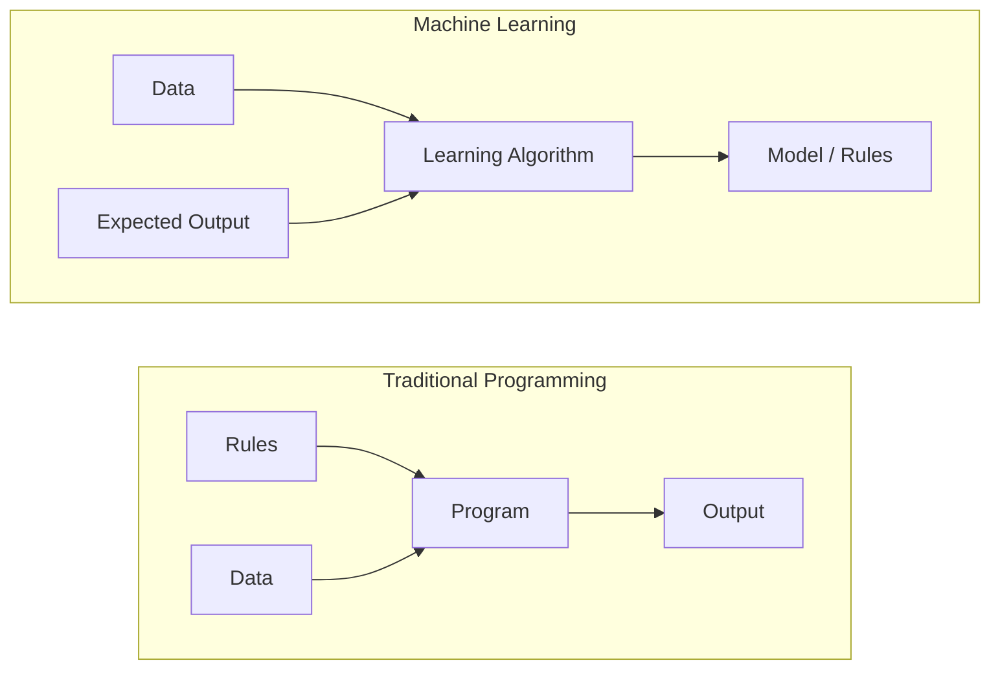
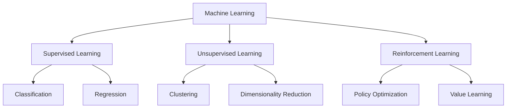
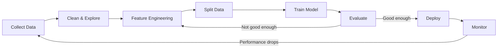
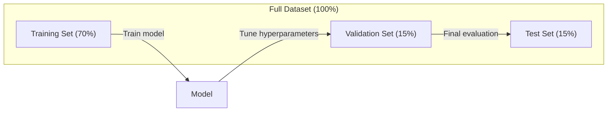
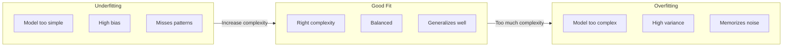
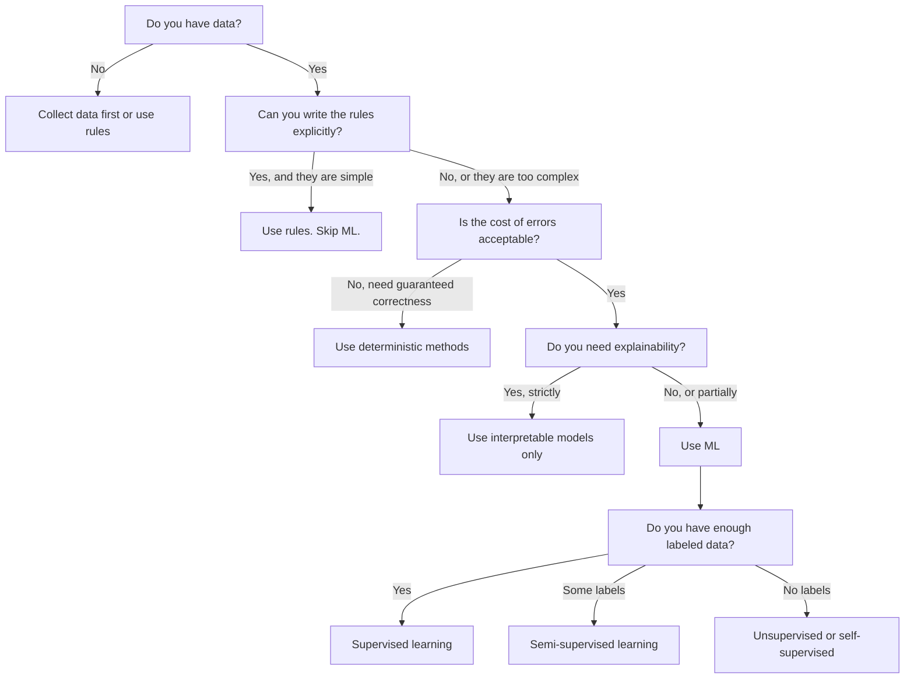

# 什么是机器学习

> 机器学习,就是让计算机从数据中自己发现规律,而不是靠人手写规则。

**类型:** 学习
**编程语言:** Python
**前置要求:** 第 1 阶段(数学基础)
**预计耗时:** 约 45 分钟

## 学习目标

- 讲清监督学习、无监督学习和强化学习的区别,并能判断给定问题属于哪一类
- 从零实现一个最近质心分类器,并用随机基线评估它的效果
- 区分分类任务与回归任务,并为各自选择合适的损失函数
- 判断一个业务问题适合用机器学习,还是用确定性规则解决更好

## 问题

你想做一个垃圾邮件过滤器。传统做法是:坐下来,手写几百条规则。"如果邮件里出现 'FREE MONEY',标记为垃圾邮件。如果感叹号超过 3 个,标记为垃圾邮件。"你花好几周写规则。然后垃圾邮件发送者换了措辞,你的规则全部失效。你再写更多规则。这个循环永远没有尽头。

机器学习把这个过程颠倒了过来。你不再写规则,而是给计算机成千上万封带标注的邮件("垃圾"或"非垃圾"),让它自己琢磨出规则。计算机会发现你根本想不到的模式。垃圾邮件发送者换了花样,你用新数据重新训练就行,不用重写代码。

从"编写规则"到"从数据中学习",这个转变就是机器学习的核心。每一个推荐引擎、语音助手、自动驾驶汽车和大语言模型,都是这么工作的。

## 概念

### 从数据中学习,而不是从规则出发

传统编程和机器学习,解决问题的方向正好相反。



传统编程:你来写规则,程序把规则应用到数据上,产生输出。

机器学习:你提供数据和期望的输出,算法自己去发现规则。

训练产出的"模型"就是规则本身,只不过以数字(权重、参数)的形式编码。它从见过的样本中归纳出规律,再对从未见过的数据做出预测。

### 机器学习的三大类型



**监督学习(Supervised Learning)**:你手里有"输入—输出"配对,模型学习从输入到输出的映射。
- "这是一万张标好猫或狗的照片,学会区分它们。"
- "这是房屋的特征和售价,学会预测价格。"

**无监督学习(Unsupervised Learning)**:你只有输入,没有标注,模型自己寻找数据中的结构。
- "这是一万名顾客的购买记录,找出天然的分组。"
- "这是一千个高维数据点,在保留结构的前提下压缩到二维。"

**强化学习(Reinforcement Learning, RL)**:智能体(Agent)在环境中采取行动,获得奖励或惩罚,并据此学出一套最大化总奖励的策略(policy)。
- "玩这个游戏,赢一局 +1 分,输一局 -1 分,自己摸索打法。"
- "控制这条机械臂,抓起物体 +1 分,每浪费一秒 -0.01 分。"

你在实际中构建的大多数东西都用监督学习。无监督学习常用于预处理和探索性分析。强化学习则驱动着游戏 AI、机器人,以及大语言模型的 RLHF。

### 三大类型之外

上面三类划分很干净,但真实世界的机器学习常常跨越边界。

**半监督学习(Semi-supervised learning)**同时使用少量带标注数据和大量无标注数据。比如你可能只有 100 张带标注的医学影像,却有 10 万张没标注的。常见技术包括:

- **标签传播(Label propagation):** 把相似的数据点连成一张图,标签沿着图从已标注节点扩散到未标注的邻居。
- **伪标签(Pseudo-labeling):** 先在带标注数据上训练模型,用它给无标注数据打标签,再把所有数据合在一起重新训练。模型自己给自己造训练集。
- **一致性正则化(Consistency regularization):** 对同一个输入及其轻微扰动后的版本,模型应给出相同的预测。这一招即使没有标签也有效。

**自监督学习(Self-supervised learning)**从数据本身构造监督信号,完全不需要人工标注。模型利用数据自身的结构,给自己出预测题。

- **掩码语言建模(BERT):** 把句子中 15% 的词遮住,训练模型预测被遮住的词。"标签"就来自原文。
- **对比学习(SimCLR):** 取一张图片,生成两个增强版本,训练模型认出它们来自同一张图,同时把它们与其他图片的增强版本区分开。
- **下一个 token 预测(GPT):** 给定前面所有的词,预测下一个词。每一篇文本都自动变成训练样本。

这些并不是与三大类型并列的新类别,而是把监督与无监督的思想组合起来的策略。自监督学习在技术上是监督学习(模型确实在预测某个东西),只是标签由程序自动生成,而不是由人来标。

### 分类 vs 回归

这是监督学习的两大主流任务。

| 方面 | 分类 | 回归 |
|--------|---------------|------------|
| 输出 | 离散的类别 | 连续的数值 |
| 例子 | "这封邮件是垃圾邮件吗?" | "这套房子能卖多少钱?" |
| 输出空间 | {猫, 狗, 鸟} | 任意实数 |
| 损失函数 | 交叉熵、准确率 | 均方误差、MAE |
| 学出的东西 | 类别之间的分界线 | 一条拟合数据的曲线 |

分类回答"是哪一类",回归回答"是多少"。

有些问题两种提法都成立。预测股票涨还是跌,是分类;预测具体价格,是回归。

### 机器学习工作流

无论用哪种算法,每个机器学习项目都遵循同一条流水线。



**收集数据**:汇集原始数据。数据几乎总是越多越好,但质量比数量更重要。

**清洗与探索**:处理缺失值、去重、可视化分布、发现异常。这一步常常占整个项目 60%–80% 的时间。

**特征工程(Feature Engineering)**:把原始数据变成模型能用的特征。把日期转成星期几,把数值列归一化,把类别变量编码成数字。好特征比花哨的算法更管用。

**划分数据**:把数据分成训练集、验证集和测试集。模型在训练集上学习,你在验证集上调超参数,最终在测试集上报告性能。

**训练模型**:把训练数据喂给算法,算法调整内部参数,使损失函数最小化。

**评估**:在验证集/测试集上衡量性能。如果不够好,就回头换特征、换算法或换超参数。

**部署**:把模型放到生产环境,让它对新数据做预测。

**监控**:持续跟踪性能。数据分布会随时间变化(数据漂移),模型效果会退化。性能下降时,重新训练。

### 训练集、验证集与测试集

这是新手最容易搞错的概念。你必须在训练时从未见过的数据上评估模型,否则你测量的是"背下来了多少",而不是"学会了多少"。



| 划分 | 用途 | 使用时机 | 典型比例 |
|-------|---------|-----------|-------------|
| 训练集 | 模型从这部分数据中学习 | 训练期间 | 60–80% |
| 验证集 | 调超参数、比较不同模型 | 每轮训练之后 | 10–20% |
| 测试集 | 得到最终无偏的性能估计 | 只在最后看一次 | 10–20% |

测试集是神圣不可侵犯的,只能看一次。如果你根据测试集表现反复调整模型,那实际上就是在测试集上训练,你报出来的数字就毫无意义。

数据集较小时,用 k 折交叉验证(k-fold cross-validation):把数据切成 k 份,每次用 k-1 份训练、剩下 1 份验证,轮流转一遍,最后取平均。

### 过拟合 vs 欠拟合



**欠拟合(Underfitting)**:模型太简单,抓不住数据中的规律。好比用一条直线去拟合弯曲的关系。训练误差高,测试误差也高。

**过拟合(Overfitting)**:模型太复杂,把训练数据连同噪声一起背了下来。就像一条扭来扭去的曲线,穿过每一个训练点,却在新数据上栽跟头。训练误差低,测试误差高。

**良好拟合**:模型抓住了真实规律,又没有死记噪声。训练误差和测试误差都比较低。

过拟合的迹象:
- 训练准确率远高于验证准确率
- 模型在训练数据上表现很好,在新数据上表现很差
- 增加训练数据能提升性能(说明模型之前是在背,而不是在学)

解决过拟合的办法:
- 收集更多训练数据
- 降低模型复杂度(减少参数、简化结构)
- 正则化(给过大的权重加惩罚)
- Dropout(训练时随机把一部分神经元置零)
- 早停(验证误差开始上升时就停止训练)

解决欠拟合的办法:
- 换更复杂的模型
- 增加更多特征
- 减弱正则化
- 延长训练时间

### 偏差—方差权衡

这是过拟合与欠拟合背后的数学框架。

**偏差(Bias)**:由模型的错误假设带来的误差。真实关系是非线性的,你却用线性模型,偏差就很高。高偏差导致欠拟合。

**方差(Variance)**:由模型对训练数据微小波动过度敏感带来的误差。高方差模型在数据的不同子集上训练,会给出差别很大的预测。高方差导致过拟合。

| 模型复杂度 | 偏差 | 方差 | 结果 |
|-----------------|------|----------|--------|
| 太低(用线性模型拟合弯曲数据) | 高 | 低 | 欠拟合 |
| 恰到好处 | 中 | 中 | 泛化良好 |
| 太高(用 20 次多项式拟合 10 个点) | 低 | 高 | 过拟合 |

总误差 = 偏差² + 方差 + 不可约噪声

不可约噪声无法消除(它是数据本身的随机性)。你要找的是让"偏差² + 方差"最小的那个甜点位置。

### 没有免费的午餐定理

不存在一个在所有问题上都最强的算法。在某类问题上表现好的算法,换一类问题就可能表现糟糕。所以数据科学家才会尝试多种算法、互相比较。

实践中,算法选择取决于:
- 你有多少数据
- 特征有多少个
- 关系是线性的还是非线性的
- 是否需要可解释性
- 你能负担多少算力

### 什么时候不该用机器学习

机器学习很强大,但并不总是正确的工具。伸手拿模型之前,先问问自己到底需不需要它。

**以下情况不要用机器学习:**

- **规则简单且明确。** 算税、排序算法、单位换算。如果几条 if 语句就能写完逻辑,上模型只会平白增加复杂度。
- **没有数据,或数据太少。** 机器学习需要样本来学习。只有 10 个数据点,什么有意义的东西都训不出来。先去收集数据。
- **出错的代价是灾难性的,且必须保证正确。** 药物剂量计算、核反应堆控制、密码学验证。机器学习模型是概率性的,总有出错的时候。如果"偶尔出错"不可接受,就用确定性方法。
- **查表或启发式规则就能解决问题。** 如果一个简单的阈值或一张表就能覆盖 99% 的情况,引入机器学习只会抬高维护成本,带不来实质提升。
- **无法解释决策,而场景又要求可解释。** 受监管行业(信贷、保险、刑事司法)有时要求每个决策都能完整解释。有些机器学习模型是可解释的(线性回归、小型决策树),大多数不是。
- **问题变化比你重新训练还快。** 如果规则天天变,而重新训练要一周,模型永远是过时的。

可以用这张决策流程图来判断:



```figure
f3-learning-boundary
```

## 动手构建

`code/ml_intro.py` 中的代码从零实现了一个最近质心分类器(nearest centroid classifier)——这是最简单的机器学习算法。它演示了核心思想:先从数据中学习,再对新数据做预测。

### 第 1 步:从零实现最近质心分类器

最近质心分类器会计算训练数据中每个类别的中心(均值)。预测时,把新样本分给中心离它最近的那个类别。

```python
class NearestCentroid:
    def fit(self, X, y):
        self.classes = np.unique(y)
        self.centroids = np.array([
            X[y == c].mean(axis=0) for c in self.classes
        ])

    def predict(self, X):
        distances = np.array([
            np.sqrt(((X - c) ** 2).sum(axis=1))
            for c in self.centroids
        ])
        return self.classes[distances.argmin(axis=0)]
```

这就是整个算法。fit 算两个均值,predict 算距离。没有梯度下降,没有迭代,没有超参数。

### 第 2 步:在合成数据上训练

我们生成一个二维分类数据集,两个类别略有重叠。质心分类器会在两个类中心之间画出一条线性决策边界。

```python
rng = np.random.RandomState(42)
X_class0 = rng.randn(100, 2) + np.array([1.0, 1.0])
X_class1 = rng.randn(100, 2) + np.array([-1.0, -1.0])
X = np.vstack([X_class0, X_class1])
y = np.array([0] * 100 + [1] * 100)
```

### 第 3 步:与基线对比

每个机器学习模型都应该和一个平凡基线(trivial baseline)比一比。这里的基线是随机猜一个类别。如果你的模型连随机猜都打不过,那一定是哪里出了问题。

```python
baseline_preds = rng.choice([0, 1], size=len(y_test))
baseline_acc = np.mean(baseline_preds == y_test)
```

在这份干净的数据集上,质心分类器的准确率应该在 90% 以上,而随机基线大约是 50%。

### 为什么这很重要

最近质心分类器简单到极致:没有超参数,没有迭代,没有梯度下降。但它完整体现了机器学习的基本模式:

1. **学习**:从训练数据中学出一种表示(质心)
2. **预测**:用学到的表示对新数据做预测(找最近距离)
3. **评估**:与基线对比(随机猜测)

从逻辑回归到 Transformer,每一个机器学习算法都遵循同样的三步模式。表示会越来越复杂,但工作流始终不变。

### 第 4 步:质心分类器做不到什么

最近质心分类器假设每个类别只成一团,它只能画出线性决策边界。以下情况它会失败:

- 一个类别包含多个簇(比如数字 "1" 可以有多种写法)
- 决策边界是非线性的(比如一个类别把另一个包围起来)
- 特征的量纲差异很大(距离会被量纲最大的特征主导)

正是这些局限,引出了你接下来要学的每一种算法。K 近邻能处理多簇的情况,决策树能处理非线性边界,特征缩放能解决量纲问题。每一课都建立在上一课的局限之上。

## 投入使用

sklearn 提供了 `NearestCentroid` 和合成数据生成器:

```python
from sklearn.neighbors import NearestCentroid
from sklearn.datasets import make_classification
from sklearn.model_selection import train_test_split

X, y = make_classification(
    n_samples=500, n_features=2, n_redundant=0,
    n_clusters_per_class=1, random_state=42
)
X_train, X_test, y_train, y_test = train_test_split(X, y, test_size=0.3)

clf = NearestCentroid()
clf.fit(X_train, y_train)
print(f"Accuracy: {clf.score(X_test, y_test):.3f}")
```

## 交付

本课会产出 `outputs/prompt-ml-problem-framer.md` ——一个把模糊的业务问题转化为具体机器学习任务的提示词。你给它一段问题描述(比如"我们想降低用户流失"或"预测下个季度的需求"),它会识别学习类型、定义预测目标、列出候选特征、选定成功指标、建立基线,并标记出数据泄漏、类别不平衡之类的坑。在任何机器学习项目开始时用它,避免建错东西。

## 关键术语

| 术语 | 人们常说的 | 实际含义 |
|------|----------------|----------------------|
| 模型(Model) | "那个 AI" | 一个带可学习参数的数学函数,把输入映射为输出 |
| 训练(Training) | "教 AI" | 运行优化算法调整模型参数,让预测贴近已知输出 |
| 特征(Feature) | "一列输入" | 数据的可测量属性,模型据此做预测 |
| 标签(Label) | "答案" | 训练样本的已知输出,用来计算误差信号 |
| 超参数(Hyperparameter) | "要调的设置" | 训练前设定的参数,控制学习过程(学习率、层数等) |
| 损失函数(Loss function) | "模型错得有多离谱" | 衡量预测输出与真实输出之间差距的函数,训练的目标就是把它最小化 |
| 过拟合(Overfitting) | "它把考题背下来了" | 模型学到的是训练数据特有的噪声而非一般规律,所以在新数据上失败 |
| 欠拟合(Underfitting) | "它啥也没学到" | 模型太简单,抓不住数据中的真实规律 |
| 泛化(Generalization) | "在新数据上也好使" | 模型在未训练过的数据上也能做出准确预测的能力 |
| 交叉验证(Cross-validation) | "换着块儿测" | 反复把数据切成不同的训练/测试折并取平均,得到更稳健的性能估计 |
| 正则化(Regularization) | "让权重别太大" | 在损失函数中加入惩罚项,抑制过于复杂的模型 |
| 数据漂移(Data drift) | "世界变了" | 输入数据的统计分布随时间变化,导致模型性能下降 |

## 练习

1. 任选一个数据集(如 Iris、Titanic),按 70/15/15 划分训练集、验证集和测试集。解释为什么不能拿测试集来调超参数。
2. 列出三个现实世界的问题。分别判断它们是分类、回归还是聚类,属于监督学习还是无监督学习。
3. 一个模型在训练数据上准确率 99%,在测试数据上只有 60%。诊断问题所在,并列出三种你会尝试的修复方法。

## 延伸阅读

- [An Introduction to Statistical Learning](https://www.statlearning.com/) ——免费教材,覆盖所有经典机器学习方法,附带实战示例
- [Google's Machine Learning Crash Course](https://developers.google.com/machine-learning/crash-course) ——简明直观的机器学习概念入门
- [Scikit-learn User Guide](https://scikit-learn.org/stable/user_guide.html) ——用 Python 实现机器学习的实用参考手册
