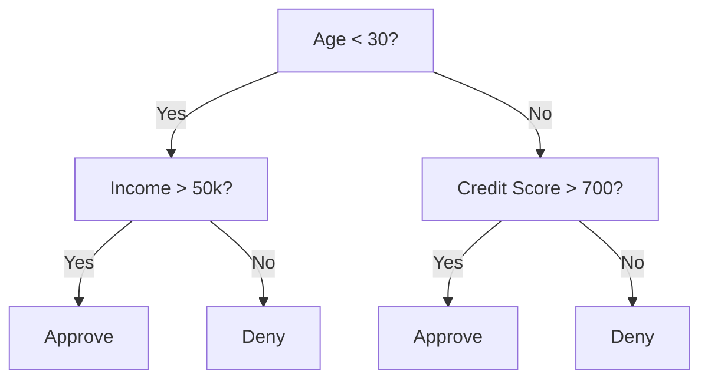
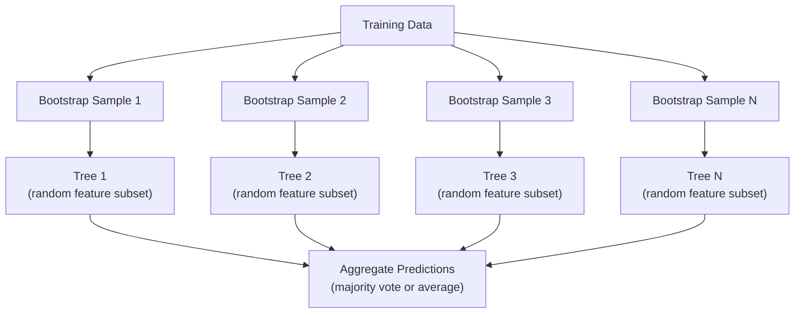

# 决策树与随机森林

> 决策树不过是一张流程图。但很多棵树组成的森林,却是机器学习中最强大的工具之一。

**类型:** 动手构建
**编程语言:** Python
**前置要求:** 第 1 阶段(第 09 课信息论、第 06 课概率)
**预计耗时:** 约 90 分钟

## 学习目标

- 实现基尼不纯度、熵和信息增益的计算,用于寻找决策树的最优划分
- 从零构建一个带预剪枝控制(最大深度、最小样本数)的决策树分类器
- 用自助采样和特征随机化构建随机森林,并解释它为什么能降低方差
- 比较 MDI 特征重要性与排列重要性,指出 MDI 在什么情况下有偏

## 问题

你手上是一份表格数据:行是样本,列是特征,还有一列是你想预测的目标。你可以直接上神经网络。但对表格数据而言,树模型(决策树、随机森林、梯度提升树)始终胜过深度学习。结构化数据上的 Kaggle 竞赛,统治者是 XGBoost 和 LightGBM,而不是 Transformer。

为什么?树模型无需预处理就能处理混合型特征(数值型和类别型),无需特征工程就能处理非线性关系。它们是可解释的:看一眼树,就能确切知道某个预测是怎么来的。而随机森林把许多棵树平均起来,在中等规模的数据集上极不容易过拟合。

本课先用递归划分从零构建决策树,再在其上搭出随机森林。你会亲手实现划分标准背后的数学(基尼不纯度、熵、信息增益),并理解为什么一群弱学习器组成的集成会变强。

## 概念

### 决策树在做什么

决策树通过一连串"是/否"提问,把特征空间划分成一个个矩形区域。



每个内部节点把一个特征和阈值做比较,每个叶子节点给出一个预测。要给新数据点分类,从根节点出发,沿着分支一直走到叶子。

树是自顶向下构建的:在每个节点,选出最能分开数据的特征和阈值。"最能"由划分标准来定义。

### 划分标准:度量不纯度

在每个节点,我们手上有一组样本。我们想把它们切开,让得到的子节点尽可能"纯"——也就是每个子节点里基本只有一个类别。

**基尼不纯度(Gini impurity)**度量的是:从节点中随机取一个样本,若按该节点的类别分布随机给它打标签,它被标错的概率。

```
Gini(S) = 1 - sum(p_k^2)

where p_k is the proportion of class k in set S.
```

纯节点(全是同一类)的 Gini = 0。二分类五五开时 Gini = 0.5。越小越好。

```
Example: 6 cats, 4 dogs

Gini = 1 - (0.6^2 + 0.4^2) = 1 - (0.36 + 0.16) = 0.48
```

**熵(Entropy)**度量节点中的信息量(混乱程度),第 1 阶段第 09 课讲过。

```
Entropy(S) = -sum(p_k * log2(p_k))
```

纯节点的熵 = 0。二分类五五开时熵 = 1.0。越小越好。

```
Example: 6 cats, 4 dogs

Entropy = -(0.6 * log2(0.6) + 0.4 * log2(0.4))
        = -(0.6 * -0.737 + 0.4 * -1.322)
        = 0.442 + 0.529
        = 0.971 bits
```

**信息增益(Information gain)**是划分之后不纯度(熵或基尼)的下降量。

```
IG(S, feature, threshold) = Impurity(S) - weighted_avg(Impurity(S_left), Impurity(S_right))

where the weights are the proportions of samples in each child.
```

每个节点上的贪心算法:尝试每个特征、每个可能的阈值,选出信息增益最大的(特征, 阈值)组合。

### 划分如何进行

假设数据有 n 个特征,当前节点有 m 个样本:

1. 对每个特征 j(j = 1 到 n):
   - 按特征 j 对样本排序
   - 把相邻不同取值之间的每个中点都当作候选阈值
   - 计算每个阈值的信息增益
2. 选出信息增益最大的特征和阈值
3. 把数据切成左子集(特征 <= 阈值)和右子集(特征 > 阈值)
4. 对每个子节点递归重复

贪心方法不保证得到全局最优的树——找最优树是 NP 难的。但贪心划分在实践中效果很好。

### 停止条件

不加停止条件,树会一直长到每个叶子都纯为止(每个叶子只剩一个样本)。这等于把训练数据原样背了下来,泛化能力极差。

**预剪枝(Pre-pruning)**在树长全之前就喊停:
- 最大深度:树到达设定深度就停止划分
- 叶节点最小样本数:节点样本少于 k 个就停止
- 最小信息增益:最佳划分带来的不纯度下降低于阈值就停止
- 最大叶子数:限制叶子总数

**后剪枝(Post-pruning)**先把树长全,再往回修:
- 代价复杂度剪枝(scikit-learn 用的就是它):按叶子数量加惩罚,惩罚越大,树越小
- 降低错误剪枝:如果移除某个子树不会让验证误差上升,就移除它

预剪枝更简单、更快。后剪枝往往能产出更好的树,因为它不会过早砍掉那些本可以引出有用后续划分的分支。

### 用决策树做回归

做回归时,叶子的预测值是该叶子中目标值的均值。划分标准也要换:

**方差缩减(Variance reduction)**取代信息增益:

```
VR(S, feature, threshold) = Var(S) - weighted_avg(Var(S_left), Var(S_right))
```

选出方差下降最多的划分。树把输入空间切成若干区域,每个区域预测一个常数(均值)。

### 随机森林:集成的力量

单棵决策树方差很大:数据稍动一动,就可能长出完全不同的树。随机森林通过把许多棵树平均起来解决这个问题。



两股随机性让树与树之间足够多样:

**Bagging(bootstrap aggregating,自助聚合):** 每棵树在一个自助样本上训练——从训练集中有放回地随机抽样。每个自助样本大约包含原始样本的 63%(剩下的称为袋外样本,可用来验证)。

**特征随机化:** 每次划分时,只从随机抽出的一部分特征中挑选。分类任务默认取 sqrt(n_features),回归任务取 n_features/3。这防止所有树都在同一个主导特征上划分。

关键洞见:把许多棵互不相关的树平均起来,能在不增加偏差的前提下降低方差。单棵树可能平平无奇,集成起来却很强大。

### 特征重要性

随机森林天然能给出特征重要性分数。最常用的方法是:

**平均不纯度下降(Mean Decrease in Impurity,MDI):** 对每个特征,把它在所有树、所有被用到节点上带来的不纯度下降累加起来。在越靠前的划分中带来越大不纯度下降的特征,越重要。

```
importance(feature_j) = sum over all nodes where feature_j is used:
    (n_samples_at_node / n_total_samples) * impurity_decrease
```

这个方法很快(训练时顺手就算完了),但它偏向高基数特征和可选切分点多的特征。

**排列重要性(Permutation importance)**是替代方案:把某个特征的取值随机打乱,看模型准确率下降多少。更可靠,但更慢。

### 什么时候树胜过神经网络

在表格数据上,树和森林压过神经网络。原因有几个:

| 因素 | 树 | 神经网络 |
|--------|-------|----------------|
| 混合类型(数值 + 类别) | 原生支持 | 需要编码 |
| 小数据集(< 1 万行) | 表现好 | 容易过拟合 |
| 特征交互 | 通过划分自动发现 | 需要设计网络结构 |
| 可解释性 | 完全透明 | 黑盒 |
| 训练时间 | 分钟级 | 小时级 |
| 超参数敏感度 | 低 | 高 |

当数据带有空间或时序结构时(图像、文本、音频),神经网络胜出。对平平整整的特征表格,树是默认选择。

```figure
decision-tree-depth
```

## 动手构建

### 第 1 步:基尼不纯度与熵

从零实现两个划分标准,并验证它们对"什么是好划分"的判断是一致的。

```python
import math

def gini_impurity(labels):
    n = len(labels)
    if n == 0:
        return 0.0
    counts = {}
    for label in labels:
        counts[label] = counts.get(label, 0) + 1
    return 1.0 - sum((c / n) ** 2 for c in counts.values())

def entropy(labels):
    n = len(labels)
    if n == 0:
        return 0.0
    counts = {}
    for label in labels:
        counts[label] = counts.get(label, 0) + 1
    return -sum(
        (c / n) * math.log2(c / n) for c in counts.values() if c > 0
    )
```

### 第 2 步:寻找最佳划分

尝试每个特征和每个阈值,返回信息增益最大的那个。

```python
def information_gain(parent_labels, left_labels, right_labels, criterion="gini"):
    measure = gini_impurity if criterion == "gini" else entropy
    n = len(parent_labels)
    n_left = len(left_labels)
    n_right = len(right_labels)
    if n_left == 0 or n_right == 0:
        return 0.0
    parent_impurity = measure(parent_labels)
    child_impurity = (
        (n_left / n) * measure(left_labels) +
        (n_right / n) * measure(right_labels)
    )
    return parent_impurity - child_impurity
```

### 第 3 步:构建 DecisionTree 类

包含递归划分、预测和特征重要性统计。`_build` 是树的核心:节点纯净或触及预剪枝上限时就收手,否则采用最佳划分,并对两个子节点递归下去。

```python
import random

class DecisionTree:
    def __init__(self, max_depth=None, min_samples_split=2,
                 min_samples_leaf=1, criterion="gini",
                 max_features=None):
        self.max_depth = max_depth
        self.min_samples_split = min_samples_split
        self.min_samples_leaf = min_samples_leaf
        self.criterion = criterion
        self.max_features = max_features
        self.tree = None
        self.feature_importances_ = None

    def fit(self, X, y):
        self.n_features = len(X[0])
        self.feature_importances_ = [0.0] * self.n_features
        self.n_samples = len(X)
        self.tree = self._build(X, y, depth=0)
        total = sum(self.feature_importances_)
        if total > 0:
            self.feature_importances_ = [
                fi / total for fi in self.feature_importances_
            ]

    def predict(self, X):
        return [self._predict_one(x, self.tree) for x in X]

    def _build(self, X, y, depth):
        if len(set(y)) == 1:
            return {"leaf": True, "value": y[0]}

        if self.max_depth is not None and depth >= self.max_depth:
            return self._make_leaf(y)

        if len(y) < self.min_samples_split:
            return self._make_leaf(y)

        best_feature, best_threshold, best_gain = self._best_split(X, y)

        if best_feature is None or best_gain <= 0:
            return self._make_leaf(y)

        left_X, left_y, right_X, right_y = self._split_data(
            X, y, best_feature, best_threshold
        )

        if len(left_y) < self.min_samples_leaf or len(right_y) < self.min_samples_leaf:
            return self._make_leaf(y)

        weight = len(y) / self.n_samples
        self.feature_importances_[best_feature] += weight * best_gain

        return {
            "leaf": False,
            "feature": best_feature,
            "threshold": best_threshold,
            "left": self._build(left_X, left_y, depth + 1),
            "right": self._build(right_X, right_y, depth + 1),
        }

    def _make_leaf(self, y):
        counts = {}
        for label in y:
            counts[label] = counts.get(label, 0) + 1
        return {"leaf": True, "value": max(counts, key=counts.get)}

    def _best_split(self, X, y):
        best_feature = None
        best_threshold = None
        best_gain = -1.0

        if self.max_features == "sqrt":
            k = max(1, int(math.sqrt(self.n_features)))
            feature_indices = random.sample(range(self.n_features), k)
        elif isinstance(self.max_features, int):
            if self.max_features < 1:
                raise ValueError("max_features must be at least 1 when given as an integer")
            k = min(self.max_features, self.n_features)
            feature_indices = random.sample(range(self.n_features), k)
        else:
            feature_indices = list(range(self.n_features))

        for feature_idx in feature_indices:
            values = sorted(set(X[i][feature_idx] for i in range(len(X))))
            if len(values) <= 1:
                continue

            for i in range(len(values) - 1):
                threshold = (values[i] + values[i + 1]) / 2.0
                left_y = [y[j] for j in range(len(X)) if X[j][feature_idx] <= threshold]
                right_y = [y[j] for j in range(len(X)) if X[j][feature_idx] > threshold]

                if len(left_y) < self.min_samples_leaf or len(right_y) < self.min_samples_leaf:
                    continue

                gain = information_gain(y, left_y, right_y, self.criterion)
                if gain > best_gain:
                    best_gain = gain
                    best_feature = feature_idx
                    best_threshold = threshold

        return best_feature, best_threshold, best_gain

    def _split_data(self, X, y, feature, threshold):
        left_X, left_y, right_X, right_y = [], [], [], []
        for i in range(len(X)):
            if X[i][feature] <= threshold:
                left_X.append(X[i])
                left_y.append(y[i])
            else:
                right_X.append(X[i])
                right_y.append(y[i])
        return left_X, left_y, right_X, right_y

    def _predict_one(self, x, node):
        if node["leaf"]:
            return node["value"]
        if x[node["feature"]] <= node["threshold"]:
            return self._predict_one(x, node["left"])
        return self._predict_one(x, node["right"])
```

### 第 4 步:构建 RandomForest 类

自助采样、特征随机化和多数投票。

```python
class RandomForest:
    def __init__(self, n_trees=100, max_depth=None,
                 min_samples_split=2, max_features="sqrt",
                 criterion="gini"):
        self.n_trees = n_trees
        self.max_depth = max_depth
        self.min_samples_split = min_samples_split
        self.max_features = max_features
        self.criterion = criterion
        self.trees = []

    def fit(self, X, y):
        n = len(X)
        for _ in range(self.n_trees):
            indices = [random.randint(0, n - 1) for _ in range(n)]
            X_boot = [X[i] for i in indices]
            y_boot = [y[i] for i in indices]
            tree = DecisionTree(
                max_depth=self.max_depth,
                min_samples_split=self.min_samples_split,
                max_features=self.max_features,
                criterion=self.criterion,
            )
            tree.fit(X_boot, y_boot)
            self.trees.append(tree)

    def predict(self, X):
        all_preds = [tree.predict(X) for tree in self.trees]
        predictions = []
        for i in range(len(X)):
            votes = {}
            for preds in all_preds:
                v = preds[i]
                votes[v] = votes.get(v, 0) + 1
            predictions.append(max(votes, key=votes.get))
        return predictions
```

完整实现(含所有辅助方法)见 `code/trees.py`。

## 投入使用

用 scikit-learn,训练一个随机森林只要三行:

```python
from sklearn.ensemble import RandomForestClassifier
from sklearn.datasets import load_iris
from sklearn.model_selection import train_test_split

X, y = load_iris(return_X_y=True)
X_train, X_test, y_train, y_test = train_test_split(X, y, random_state=42)

rf = RandomForestClassifier(n_estimators=100, random_state=42)
rf.fit(X_train, y_train)
print(f"Accuracy: {rf.score(X_test, y_test):.4f}")
print(f"Feature importances: {rf.feature_importances_}")
```

实践中,梯度提升树(XGBoost、LightGBM、CatBoost)往往比随机森林更强,因为它们按顺序建树,每棵树都在纠正前面树的错误。但随机森林更难配错,几乎不需要调超参数。

## 交付

本课会产出 `outputs/prompt-tree-interpreter.md` ——一个把决策树的划分解释给业务人员的提示词。喂给它一棵训练好的树的结构(深度、特征、划分阈值、准确率),它会把模型翻译成大白话规则,给特征重要性排序,标记过拟合或数据泄漏的迹象,并给出下一步建议。凡是需要向不看代码的人解释树模型的场合,都可以用它。

## 练习

1. 在一个包含 3 个类别的二维数据集上训练单棵决策树。手动追踪每一次划分,画出矩形的决策边界。比较 max_depth=2 与 max_depth=10 时边界的差别。

2. 为回归树实现方差缩减划分。生成 y = sin(x) + 噪声 的 200 个点,拟合你的回归树。把树的分段常数预测与真实曲线画在一起对比。

3. 分别用 1、5、10、50、200 棵树构建随机森林。画出训练准确率和测试准确率随树数量变化的曲线。观察测试准确率会进入平台期,但不会下降(森林抗过拟合)。

4. 在 5 个不同的数据集上比较基尼不纯度与熵作为划分标准的差异,记录准确率和树深度。多数情况下两者结果几乎一致。解释为什么。

5. 实现排列重要性。构造一个包含高基数纯噪声特征的数据集,把排列重要性和 MDI 重要性对比。MDI 会把噪声特征排得很高,排列重要性不会。

## 关键术语

| 术语 | 人们常说的 | 实际含义 |
|------|----------------|----------------------|
| 决策树(Decision tree) | "用来预测的流程图" | 通过学习一串 if/else 划分,把特征空间切成矩形区域的模型 |
| 基尼不纯度(Gini impurity) | "节点有多混" | 在节点上随机取样并随机标错标签的概率。0 = 纯净,二分类时 0.5 = 最大不纯度 |
| 熵(Entropy) | "节点有多乱" | 节点的信息量。0 = 纯净,二分类时 1.0 = 最大不确定性。来自信息论 |
| 信息增益(Information gain) | "这一刀切得好不好" | 划分后不纯度的下降量,贪心选划分的标准 |
| 预剪枝(Pre-pruning) | "让树早点停" | 通过设定最大深度、最小样本数或最小增益阈值,提前停止树的生长 |
| 后剪枝(Post-pruning) | "长完再修" | 先把树长全,再移除不能改善验证性能的子树 |
| Bagging | "在随机子集上训练" | 自助聚合(bootstrap aggregating)。每个模型在一份不同的有放回随机样本上训练 |
| 随机森林(Random forest) | "一堆树" | 决策树的集成:每棵树在自助样本上训练,每次划分只看随机特征子集 |
| 特征重要性(MDI) | "哪些特征重要" | 每个特征在所有树、所有节点上贡献的不纯度下降总量 |
| 排列重要性(Permutation importance) | "打乱再看看" | 随机打乱某特征的取值后准确率的下降量。对噪声特征比 MDI 更可靠 |
| 方差缩减(Variance reduction) | "回归版的信息增益" | 信息增益在回归树上的对应物,选出让目标方差下降最多的划分 |
| 自助样本(Bootstrap sample) | "可重复的随机抽样" | 从原始数据集中有放回地抽出的随机样本,大小相同,但会有重复 |

## 延伸阅读

- [Breiman: Random Forests (2001)](https://link.springer.com/article/10.1023/A:1010933404324) ——随机森林的原始论文
- [Grinsztajn et al.: Why do tree-based models still outperform deep learning on tabular data? (2022)](https://arxiv.org/abs/2207.08815) ——树模型与神经网络在表格任务上的严谨对比
- [scikit-learn Decision Trees documentation](https://scikit-learn.org/stable/modules/tree.html) ——带可视化工具的实用指南
- [XGBoost: A Scalable Tree Boosting System (Chen & Guestrin, 2016)](https://arxiv.org/abs/1603.02754) ——统治 Kaggle 的梯度提升论文
