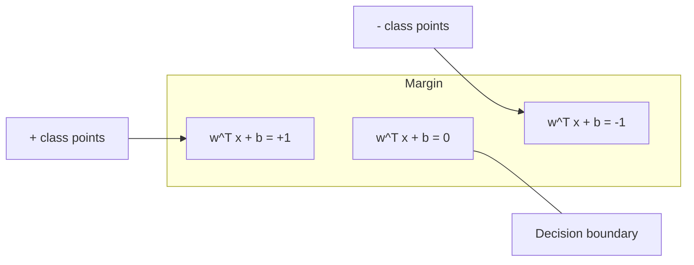
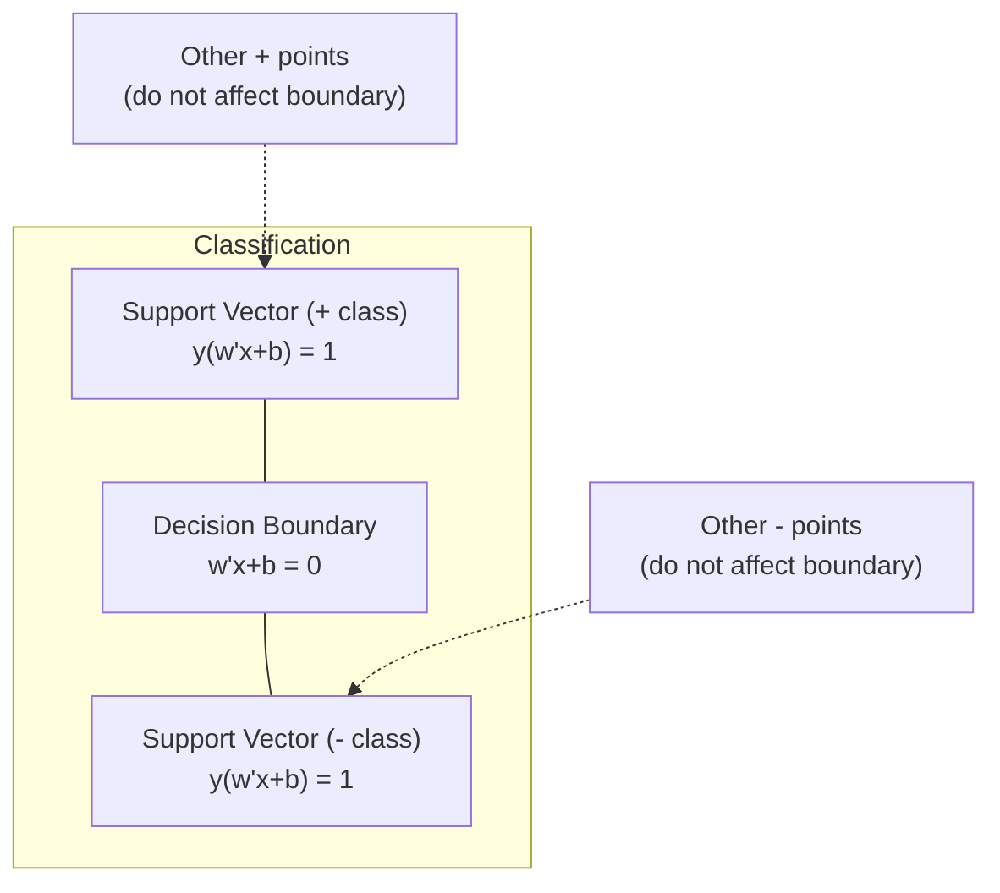
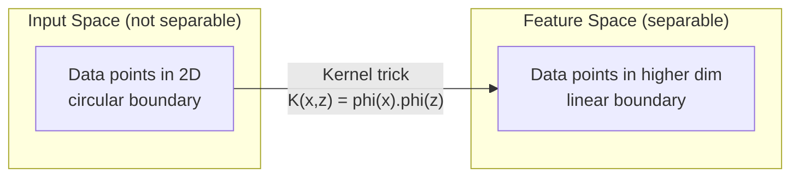

# 支持向量机

> 在两个类别之间,找到那条最宽的"街道"。这就是全部思想。

**类型:** 动手构建
**编程语言:** Python
**前置要求:** 第 1 阶段(第 08 课优化、第 14 课范数与距离、第 18 课凸优化)
**预计耗时:** 约 90 分钟

## 学习目标

- 用 hinge 损失和梯度下降,在原始(primal)形式上从零实现线性 SVM
- 解释最大间隔原则,并能在训练好的模型中找出支持向量
- 比较线性核、多项式核与 RBF 核,解释核技巧如何避免显式的高维映射
- 评估 C 参数在"间隔宽度"与"分类错误"之间控制的权衡

## 问题

你有两类数据点,需要画一条线(或超平面)把它们分开。能用的线有无穷多条,该选哪一条?

选间隔最大的那条。间隔(margin)是决策边界与两侧最近数据点之间的距离。间隔越宽,分类器越"有底气",对未见数据的泛化也越好。

这个直觉引出了支持向量机(SVM)——机器学习中数学上最优雅的算法之一。在深度学习崛起之前,SVM 是分类任务的统治者。直到今天,它依然是以下场景的最佳选择:小数据集、高维数据,以及那些需要有理论保证、原理清晰的模型的问题。

SVM 与第 1 阶段的内容直接呼应:它的优化问题是凸的(第 18 课),间隔用范数来度量(第 14 课),而核技巧利用点积处理非线性边界,全程无需在高维空间里真正计算。

## 概念

### 最大间隔分类器

给定线性可分的数据,标签 y_i 属于 {-1, +1},特征向量为 x_i。我们要找一个能分开两类的超平面 w^T x + b = 0。

点 x_i 到超平面的距离是:

```
distance = |w^T x_i + b| / ||w||
```

对分类正确的点,有 y_i * (w^T x_i + b) > 0。间隔是超平面到两侧最近点距离的两倍。



优化问题:

```
maximize    2 / ||w||     (the margin width)
subject to  y_i * (w^T x_i + b) >= 1  for all i
```

等价地(最小化 ||w||^2 更好优化):

```
minimize    (1/2) ||w||^2
subject to  y_i * (w^T x_i + b) >= 1  for all i
```

这是一个凸二次规划问题,有唯一的全局最优解。恰好落在间隔边界上(满足 y_i * (w^T x_i + b) = 1)的数据点,就是支持向量(support vectors)。只有它们决定决策边界——移动或删除任何非支持向量的点,边界都不会变。

### 支持向量:关键的少数



大多数训练点无关紧要,只有支持向量说了算。这就是为什么 SVM 在预测时内存效率高:你只需要存支持向量,不用存整个训练集。

支持向量的数量还给泛化误差提供了一个上界:相对于数据集规模,支持向量越少,泛化越好。

### 软间隔:用 C 参数容忍噪声

真实数据很少是完全可分的。有些点会落在边界的错误一侧,或落在间隔之内。软间隔(soft margin)形式通过引入松弛变量(slack variables)允许这些违规存在。

```
minimize    (1/2) ||w||^2 + C * sum(xi_i)
subject to  y_i * (w^T x_i + b) >= 1 - xi_i
            xi_i >= 0  for all i
```

松弛变量 xi_i 度量第 i 个点违反间隔的程度。C 控制权衡:

| C 的取值 | 行为 |
|---------|----------|
| C 大 | 重罚违规。间隔窄,误分类少,容易过拟合 |
| C 小 | 容忍更多违规。间隔宽,误分类多,容易欠拟合 |

C 就是正则化强度的倒数:C 大 = 正则化弱,C 小 = 正则化强。

### Hinge 损失:SVM 的损失函数

软间隔 SVM 可以改写成一个无约束优化问题:

```
minimize    (1/2) ||w||^2 + C * sum(max(0, 1 - y_i * (w^T x_i + b)))
```

其中 max(0, 1 - y_i * f(x_i)) 这项就是 hinge 损失。当点被正确分类且在间隔之外时,它为零;当点落入间隔之内或被误分类时,它随距离线性增长。

```
Hinge loss for a single point:

loss
  |
  | \
  |  \
  |   \
  |    \
  |     \_______________
  |
  +-----|-----|-------->  y * f(x)
       0     1

Zero loss when y*f(x) >= 1 (correctly classified, outside margin).
Linear penalty when y*f(x) < 1.
```

与 logistic 损失(逻辑回归)对比:

```
Hinge:     max(0, 1 - y*f(x))          Hard cutoff at margin
Logistic:  log(1 + exp(-y*f(x)))        Smooth, never exactly zero
```

Hinge 损失产生稀疏解(只有支持向量的贡献非零),logistic 损失则用到所有数据点。这正是 SVM 预测时更省内存的原因。

### 用梯度下降训练线性 SVM

不解约束二次规划,也可以直接对"hinge 损失 + L2 正则"做梯度下降来训练线性 SVM:

```
L(w, b) = (lambda/2) * ||w||^2 + (1/n) * sum(max(0, 1 - y_i * (w^T x_i + b)))

Gradient with respect to w:
  If y_i * (w^T x_i + b) >= 1:  dL/dw = lambda * w
  If y_i * (w^T x_i + b) < 1:   dL/dw = lambda * w - y_i * x_i

Gradient with respect to b:
  If y_i * (w^T x_i + b) >= 1:  dL/db = 0
  If y_i * (w^T x_i + b) < 1:   dL/db = -y_i
```

这称为原始形式(primal formulation)。每个 epoch 的开销是 O(n * d),n 是样本数,d 是特征数。对于大规模稀疏高维数据(比如文本分类),它很快。

### 对偶形式与核技巧

SVM 问题的拉格朗日对偶(来自第 1 阶段第 18 课的 KKT 条件)是:

```
maximize    sum(alpha_i) - (1/2) * sum_ij(alpha_i * alpha_j * y_i * y_j * (x_i . x_j))
subject to  0 <= alpha_i <= C
            sum(alpha_i * y_i) = 0
```

对偶形式只涉及数据点之间的点积 x_i . x_j,这是关键所在。把每个点积替换成核函数 K(x_i, x_j),SVM 就能学习非线性边界,而且全程无需显式计算那个高维变换。

```
Linear kernel:      K(x, z) = x . z
Polynomial kernel:  K(x, z) = (x . z + c)^d
RBF (Gaussian):     K(x, z) = exp(-gamma * ||x - z||^2)
```

RBF 核把数据映射到无穷维空间。输入空间中相近的点,核值接近 1;离得远的点,核值接近 0。它能学出任何光滑的决策边界。



核技巧在不进入高维空间的前提下,算出了那个空间里的点积。对 D 维输入上的 d 次多项式核,显式特征空间有 O(D^d) 维,但 K(x, z) 的计算只需 O(D) 时间。

### 用 SVM 做回归(SVR)

支持向量回归(SVR)在数据周围拟合一条宽度为 epsilon 的"管道"。管道内的点损失为零,管道外的点被线性惩罚。

```
minimize    (1/2) ||w||^2 + C * sum(xi_i + xi_i*)
subject to  y_i - (w^T x_i + b) <= epsilon + xi_i
            (w^T x_i + b) - y_i <= epsilon + xi_i*
            xi_i, xi_i* >= 0
```

epsilon 参数控制管道宽度:管道越宽,支持向量越少,拟合越平滑;管道越窄,支持向量越多,拟合越紧。

### SVM 为什么输给了深度学习(以及它何时仍能赢)

从 1990 年代末到 2010 年代初,SVM 统治了机器学习。深度学习在几个方面超过了它:

| 因素 | SVM | 深度学习 |
|--------|------|---------------|
| 特征工程 | 需要人工做 | 自动学习特征 |
| 可扩展性 | 核方法 O(n^2) 到 O(n^3) | SGD 每 epoch O(n) |
| 图像/文本/音频 | 依赖手工特征 | 从原始数据直接学习 |
| 大数据集(>10 万) | 慢 | 扩展性好 |
| GPU 加速 | 收益有限 | 加速巨大 |

SVM 在以下场景仍然胜出:
- 小数据集(几百到几千个样本)
- 高维稀疏数据(如 TF-IDF 特征的文本)
- 需要数学保证(间隔界)时
- 训练时间必须极短时(线性 SVM 非常快)
- 间隔结构清晰的二分类问题
- 异常检测(单类 SVM,one-class SVM)

```figure
svm-margin
```

## 动手构建

### 第 1 步:hinge 损失与梯度

打地基:计算一个批次的 hinge 损失及其梯度。

```python
def hinge_loss(X, y, w, b):
    n = len(X)
    total_loss = 0.0
    for i in range(n):
        margin = y[i] * (dot(w, X[i]) + b)
        total_loss += max(0.0, 1.0 - margin)
    return total_loss / n
```

### 第 2 步:用梯度下降实现线性 SVM

通过最小化带正则的 hinge 损失来训练,无需 QP 求解器。

```python
class LinearSVM:
    def __init__(self, lr=0.001, lambda_param=0.01, n_epochs=1000):
        self.lr = lr
        self.lambda_param = lambda_param
        self.n_epochs = n_epochs
        self.w = None
        self.b = 0.0

    def fit(self, X, y):
        n_features = len(X[0])
        self.w = [0.0] * n_features
        self.b = 0.0

        for epoch in range(self.n_epochs):
            for i in range(len(X)):
                margin = y[i] * (dot(self.w, X[i]) + self.b)
                if margin >= 1:
                    self.w = [wj - self.lr * self.lambda_param * wj
                              for wj in self.w]
                else:
                    self.w = [wj - self.lr * (self.lambda_param * wj - y[i] * X[i][j])
                              for j, wj in enumerate(self.w)]
                    self.b -= self.lr * (-y[i])

    def predict(self, X):
        return [1 if dot(self.w, x) + self.b >= 0 else -1 for x in X]
```

### 第 3 步:核函数

实现线性核、多项式核和 RBF 核。

```python
def linear_kernel(x, z):
    return dot(x, z)

def polynomial_kernel(x, z, degree=3, c=1.0):
    return (dot(x, z) + c) ** degree

def rbf_kernel(x, z, gamma=0.5):
    diff = [xi - zi for xi, zi in zip(x, z)]
    return math.exp(-gamma * dot(diff, diff))
```

### 第 4 步:间隔与支持向量识别

训练完成后,找出哪些点是支持向量,并计算间隔宽度。

```python
def find_support_vectors(X, y, w, b, tol=1e-3):
    support_vectors = []
    for i in range(len(X)):
        margin = y[i] * (dot(w, X[i]) + b)
        if abs(margin - 1.0) < tol:
            support_vectors.append(i)
    return support_vectors
```

完整实现(含所有演示)见 `code/svm.py`。

## 投入使用

用 scikit-learn:

```python
from sklearn.svm import SVC, LinearSVC, SVR
from sklearn.preprocessing import StandardScaler
from sklearn.pipeline import Pipeline

clf = Pipeline([
    ("scaler", StandardScaler()),
    ("svm", SVC(kernel="rbf", C=1.0, gamma="scale")),
])
clf.fit(X_train, y_train)
print(f"Accuracy: {clf.score(X_test, y_test):.4f}")
print(f"Support vectors: {clf['svm'].n_support_}")
```

重要:训练 SVM 之前务必做特征缩放。SVM 对特征量纲很敏感,因为间隔依赖于 ||w||,未缩放的特征会扭曲几何结构。

大数据集上,用 `LinearSVC`(原始形式,每 epoch O(n))而不是 `SVC`(对偶形式,O(n^2) 到 O(n^3)):

```python
from sklearn.svm import LinearSVC

clf = Pipeline([
    ("scaler", StandardScaler()),
    ("svm", LinearSVC(C=1.0, max_iter=10000)),
])
```

## 练习

1. 生成一个二维线性可分数据集,训练你的 LinearSVM 并找出支持向量。验证支持向量确实是离决策边界最近的点。

2. 在带噪声的数据集上,让 C 从 0.001 变化到 1000,画出每个 C 值对应的决策边界。观察从宽间隔(欠拟合)到窄间隔(过拟合)的转变。

3. 构造一个类别边界为圆形(非线性)的数据集,展示线性 SVM 的失败。计算 RBF 核矩阵,展示在核诱导的特征空间中类别变得可分。

4. 在同一数据集上比较 hinge 损失与 logistic 损失:训练一个线性 SVM 和一个逻辑回归,数一数各有多少训练点参与了决策边界的决定(支持向量 vs 所有点)。

5. 实现 SVR(epsilon 不敏感损失),拟合 y = sin(x) + 噪声。画出预测周围的 epsilon 管道,并高亮支持向量(管道外的点)。

## 关键术语

| 术语 | 实际含义 |
|------|----------------------|
| 支持向量(Support vectors) | 离决策边界最近的训练点,是唯一决定超平面的点 |
| 间隔(Margin) | 决策边界与最近支持向量之间的距离,SVM 要把它最大化 |
| Hinge 损失 | max(0, 1 - y*f(x))。正确分类且在间隔外时为零,否则线性惩罚 |
| C 参数 | 在间隔宽度与分类错误之间的权衡。C 大 = 间隔窄,C 小 = 间隔宽 |
| 软间隔(Soft margin) | 通过松弛变量允许间隔违规的 SVM 形式,可处理不可分数据 |
| 核技巧(Kernel trick) | 不显式映射到高维特征空间,却能算出该空间中点积的方法 |
| 线性核(Linear kernel) | K(x, z) = x . z,等同于普通点积,用于线性可分数据 |
| RBF 核 | K(x, z) = exp(-gamma * \|\|x-z\|\|^2)。映射到无穷维,可学出任意光滑边界 |
| 多项式核(Polynomial kernel) | K(x, z) = (x . z + c)^d,映射到多项式组合构成的特征空间 |
| 对偶形式(Dual formulation) | SVM 问题的改写形式,只依赖数据点之间的点积,使核方法成为可能 |
| SVR | 支持向量回归。在数据周围拟合一条 epsilon 管道,管道内损失为零 |
| 松弛变量(Slack variables) | xi_i:度量一个点违反间隔的程度。间隔外正确分类的点为零 |
| 最大间隔(Maximum margin) | 选择使各类最近点距离最大的超平面的原则 |

## 延伸阅读

- [Vapnik: The Nature of Statistical Learning Theory (1995)](https://link.springer.com/book/10.1007/978-1-4757-3264-1) ——SVM 与统计学习理论的奠基之作
- [Cortes & Vapnik: Support-vector networks (1995)](https://link.springer.com/article/10.1007/BF00994018) ——SVM 的原始论文
- [Platt: Sequential Minimal Optimization (1998)](https://www.microsoft.com/en-us/research/publication/sequential-minimal-optimization-a-fast-algorithm-for-training-support-vector-machines/) ——让 SVM 训练变得实用的 SMO 算法
- [scikit-learn SVM documentation](https://scikit-learn.org/stable/modules/svm.html) ——含实现细节的实用指南
- [LIBSVM: A Library for Support Vector Machines](https://www.csie.ntu.edu.tw/~cjlin/libsvm/) ——大多数 SVM 实现背后的 C++ 库
