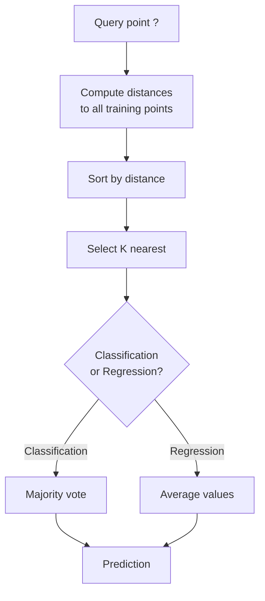
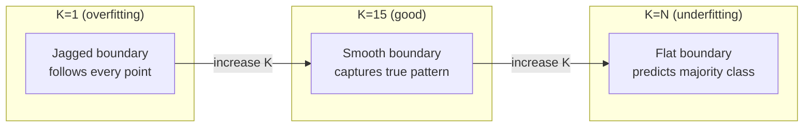
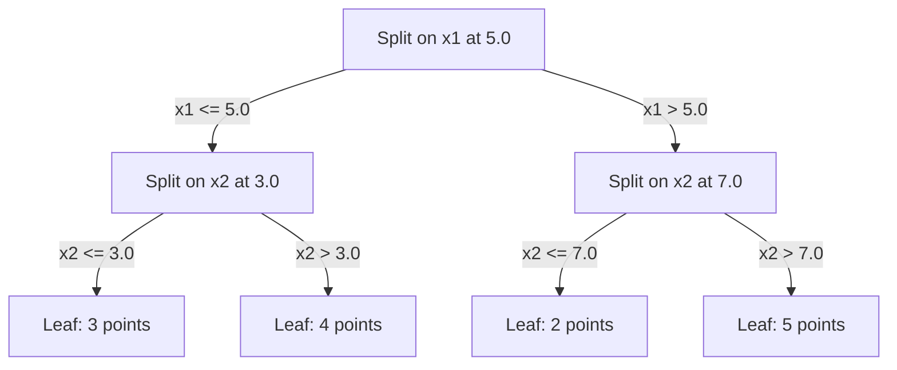

# K 近邻与距离

> 把所有数据存下来,预测时看看邻居怎么说。这是最简单的、却真正管用的算法。

**类型:** 动手构建
**编程语言:** Python
**前置要求:** 第 1 阶段(第 14 课范数与距离)
**预计耗时:** 约 90 分钟

## 学习目标

- 从零实现 KNN 分类与回归,支持可配置的 K 和距离加权投票
- 比较 L1、L2、余弦和闵可夫斯基距离,并能为给定数据类型选出合适的一种
- 解释维度灾难,并演示为什么 KNN 在高维空间中退化
- 构建 KD 树实现高效的最近邻搜索,并分析它何时优于暴力搜索

## 问题

你有一个数据集。来了一个新的数据点,你要对它分类,或预测它的数值。KNN 的做法是:不从数据中学参数(像线性回归或 SVM 那样),而是直接找出离新点最近的 K 个训练点,让它们投票。

这就是 K 近邻(K-nearest neighbors,KNN)。没有训练阶段,没有要学的参数,没有要最小化的损失函数。你把整个训练集存下来,在预测时算距离。

听起来简单得不像话。但 KNN 在很多问题上出人意料地有竞争力,尤其是中小规模数据集。深入理解它,会牵出一串基础概念:距离度量的选择(呼应第 1 阶段第 14 课)、维度灾难,以及懒惰学习与急切学习的区别。

KNN 也无处不在,只是换了名字出现在现代 AI 里:向量数据库在嵌入(embedding)上做的正是 KNN 搜索;检索增强生成(RAG)找的是最近的 K 个文档块;推荐系统找的是相似的用户或物品。算法是同一个,只是规模不同、数据结构不同。

## 概念

### KNN 的工作方式

给定一个带标签的数据集和一个新的查询点:

1. 计算查询点到数据集中每个点的距离
2. 按距离排序
3. 取最近的 K 个点
4. 分类:K 个邻居多数投票
5. 回归:取 K 个邻居目标值的均值(或加权平均)



这就是整个算法。没有拟合,没有梯度下降,没有 epoch。

### 选择 K

K 是唯一的超参数,它控制着偏差—方差权衡:

| K | 行为 |
|---|----------|
| K = 1 | 决策边界贴着每个点走。训练误差为零,方差高,过拟合 |
| K 较小(3–5) | 对局部结构敏感,能捕捉复杂边界 |
| K 较大 | 边界更平滑,对噪声更稳健,可能欠拟合 |
| K = N | 对任何点都预测多数类,偏差最大 |

对含 N 个点的数据集,常见的起点是 K = sqrt(N)。二分类时用奇数 K,避免平票。



### 距离度量

距离函数定义了什么叫"近"。不同的度量产生不同的邻居,也产生不同的预测。

**L2(欧氏距离)**是默认选择,即直线距离。

```
d(a, b) = sqrt(sum((a_i - b_i)^2))
```

它对特征量纲敏感。用 L2 跑 KNN 之前,务必先做特征标准化。

**L1(曼哈顿距离)**把各维度的绝对差相加。因为不做平方,它比 L2 更抗离群点。

```
d(a, b) = sum(|a_i - b_i|)
```

**余弦距离(Cosine distance)**度量向量之间的夹角,忽略模长。对文本和嵌入数据来说是刚需。

```
d(a, b) = 1 - (a . b) / (||a|| * ||b||)
```

**闵可夫斯基距离(Minkowski)**用参数 p 把 L1 和 L2 统一起来。

```
d(a, b) = (sum(|a_i - b_i|^p))^(1/p)

p=1: Manhattan
p=2: Euclidean
p->inf: Chebyshev (max absolute difference)
```

用哪种度量,取决于数据:

| 数据类型 | 最佳度量 | 原因 |
|-----------|------------|-----|
| 数值特征,量纲相近 | L2(欧氏) | 默认选择,适合空间数据 |
| 数值特征,有离群点 | L1(曼哈顿) | 稳健,不会放大巨大差异 |
| 文本嵌入 | 余弦 | 模长是噪声,方向才是含义 |
| 高维稀疏 | 余弦或 L1 | L2 深受维度灾难之苦 |
| 混合类型 | 自定义距离 | 按特征类型组合多种度量 |

### 加权 KNN

标准 KNN 对 K 个邻居一视同仁。但距离 0.1 的邻居,理应比距离 5.0 的邻居更有发言权。

**距离加权 KNN**让每个邻居的权重与距离成反比:

```
weight_i = 1 / (distance_i + epsilon)

For classification: weighted vote
For regression:     weighted average = sum(w_i * y_i) / sum(w_i)
```

epsilon 防止查询点恰好与训练点重合时除以零。

加权 KNN 对 K 的选择不那么敏感,因为无论 K 取多大,远处的邻居贡献都微乎其微。

### 维度灾难

KNN 在高维下会退化。这不是泛泛的担忧,而是数学事实。

**问题一:距离趋于相等。** 维度升高时,最大距离与最小距离的比值趋近于 1。所有点到查询点的距离都变得差不多"远"。

```
In d dimensions, for random uniform points:

d=2:    max_dist / min_dist = varies widely
d=100:  max_dist / min_dist ~ 1.01
d=1000: max_dist / min_dist ~ 1.001

When all distances are nearly equal, "nearest" is meaningless.
```

**问题二:体积爆炸。** 要让邻域覆盖固定比例的数据点,搜索半径就得伸到特征空间中大得多的区域。高维下的"邻域",实际上囊括了大半个空间。

**问题三:角落称王。** 在 d 维单位超立方体中,大部分体积集中在角落附近,而不是中心。随着 d 增大,立方体内切球所占的体积比例趋近于零。

实际结论:KNN 在大约 20–50 个特征以内表现良好。超过这个范围,要么先做降维(PCA、UMAP、t-SNE)再上 KNN,要么改用能利用数据内在低维结构的树形搜索结构。

### KD 树:快速最近邻搜索

暴力 KNN 要计算查询点到每个训练点的距离,单次查询 O(n * d)。数据集一大,就慢得受不了。

KD 树沿特征轴递归地切分空间:每一层在某个维度上按中位数切开。



找最近邻时,先沿树走到包含查询点的叶子,然后回溯——只有那些可能藏有更近点的相邻分区才需要检查。

低维下平均查询时间为 O(log n)。但高维时(d > 20)KD 树会退化成 O(n),因为回溯时能砍掉的枝条越来越少。

### 球树:更适合中等维度

球树(Ball tree)用嵌套的超球而不是轴向对齐的盒子来划分数据。每个节点定义一个球(球心 + 半径),包含该子树中的所有点。

相比 KD 树的优势:
- 中等维度下(约 50 维以内)表现更好
- 能处理非轴向对齐的结构
- 包围体更紧凑,搜索时能剪掉更多分支

KD 树和球树都是精确算法。真正大规模的搜索(上百万个点、上百维)要用近似最近邻方法(HNSW、IVF、乘积量化)。这些内容在第 1 阶段第 14 课讲过。

### 懒惰学习 vs 急切学习

KNN 是懒惰学习器(lazy learner):训练时什么都不做,所有工作都堆在预测时。大多数其他算法(线性回归、SVM、神经网络)是急切学习器(eager learner):训练时做大量计算,把知识压进一个紧凑的模型,预测就很快。

| 方面 | 懒惰(KNN) | 急切(SVM、神经网络) |
|--------|------------|------------------------|
| 训练时间 | O(1),存下数据即可 | O(n * epochs) |
| 预测时间 | 每次查询 O(n * d) | O(d) 或 O(参数量) |
| 预测时的内存 | 要存整个训练集 | 只存模型参数 |
| 适应新数据 | 直接加点即可 | 需要重新训练 |
| 决策边界 | 隐式,即时算出来 | 显式,训练完即固定 |

以下场景适合懒惰学习:
- 数据集频繁变动(增删数据点无需重新训练)
- 查询次数很少
- 要求零训练时间
- 数据集小到暴力搜索也够快

### 用 KNN 做回归

KNN 回归不做多数投票,而是取 K 个邻居目标值的平均。

```
prediction = (1/K) * sum(y_i for i in K nearest neighbors)

Or with distance weighting:
prediction = sum(w_i * y_i) / sum(w_i)
where w_i = 1 / distance_i
```

KNN 回归的预测是分段常数的(加权时则分段平滑)。它无法外推到训练数据范围之外:如果训练目标都在 0 到 100 之间,KNN 永远预测不出 200。

```figure
knn-smoothness
```

## 动手构建

### 第 1 步:距离函数

实现 L1、L2、余弦和闵可夫斯基距离。它们与第 1 阶段第 14 课直接呼应。

```python
import math

def l2_distance(a, b):
    return math.sqrt(sum((ai - bi) ** 2 for ai, bi in zip(a, b)))

def l1_distance(a, b):
    return sum(abs(ai - bi) for ai, bi in zip(a, b))

def cosine_distance(a, b):
    dot_val = sum(ai * bi for ai, bi in zip(a, b))
    norm_a = math.sqrt(sum(ai ** 2 for ai in a))
    norm_b = math.sqrt(sum(bi ** 2 for bi in b))
    if norm_a == 0 or norm_b == 0:
        return 1.0
    return 1.0 - dot_val / (norm_a * norm_b)

def minkowski_distance(a, b, p=2):
    if p == float('inf'):
        return max(abs(ai - bi) for ai, bi in zip(a, b))
    return sum(abs(ai - bi) ** p for ai, bi in zip(a, b)) ** (1 / p)
```

### 第 2 步:KNN 分类器与回归器

构建完整的 KNN,支持可配置的 K、距离度量和可选的距离加权。

```python
class KNN:
    def __init__(self, k=5, distance_fn=l2_distance, weighted=False,
                 task="classification"):
        self.k = k
        self.distance_fn = distance_fn
        self.weighted = weighted
        self.task = task
        self.X_train = None
        self.y_train = None

    def fit(self, X, y):
        self.X_train = X
        self.y_train = y

    def predict(self, X):
        return [self._predict_one(x) for x in X]
```

### 第 3 步:用 KD 树加速搜索

从零构建一棵 KD 树,在每个维度上按中位数递归切分。

```python
class KDTree:
    def __init__(self, X, indices=None, depth=0):
        # Recursively partition the data
        self.axis = depth % len(X[0])
        # Split on median of the current axis
        ...

    def query(self, point, k=1):
        # Traverse to leaf, then backtrack
        ...
```

完整实现(含所有辅助方法与演示)见 `code/knn.py`。

### 第 4 步:特征缩放

KNN 要求特征缩放,因为距离对特征量纲敏感。一个取值 0 到 1000 的特征,会完全压制取值 0 到 1 的特征。

```python
def standardize(X):
    n = len(X)
    d = len(X[0])
    means = [sum(X[i][j] for i in range(n)) / n for j in range(d)]
    stds = [
        max(1e-10, (sum((X[i][j] - means[j]) ** 2 for i in range(n)) / n) ** 0.5)
        for j in range(d)
    ]
    return [[((X[i][j] - means[j]) / stds[j]) for j in range(d)] for i in range(n)], means, stds
```

## 投入使用

用 scikit-learn:

```python
from sklearn.neighbors import KNeighborsClassifier
from sklearn.preprocessing import StandardScaler
from sklearn.pipeline import Pipeline

clf = Pipeline([
    ("scaler", StandardScaler()),
    ("knn", KNeighborsClassifier(n_neighbors=5, metric="euclidean")),
])
clf.fit(X_train, y_train)
print(f"Accuracy: {clf.score(X_test, y_test):.4f}")
```

当数据集足够大、维度足够低时,scikit-learn 会自动使用 KD 树或球树;高维数据则回退到暴力搜索。可以用 `algorithm` 参数手动控制。

大规模最近邻搜索(上百万向量)请用 FAISS、Annoy 或向量数据库:

```python
import faiss

index = faiss.IndexFlatL2(dimension)
index.add(embeddings)
distances, indices = index.search(query_vectors, k=5)
```

## 练习

1. 在包含 3 个类别的二维数据集上实现 KNN 分类。分别画出 K=1、K=5、K=15 和 K=N 的决策边界,观察从过拟合到欠拟合的转变。

2. 在 2、5、10、50、100、500 维中各生成 1000 个随机点。对每个维度,计算"最远点对距离 / 最近点对距离"的比值,画出比值随维度变化的曲线,直观展示维度灾难。

3. 在文本分类问题上(TF-IDF 向量)比较 L1、L2 和余弦距离。哪种度量准确率最高?为什么文本场景下余弦往往胜出?

4. 实现 KD 树,在 2 维、10 维、50 维下,分别对 1k、10k、10 万点的数据集测量它与暴力搜索的查询时间。到什么维度,KD 树不再比暴力搜索快?

5. 为 y = sin(x) + 噪声 构建加权 KNN 回归器,在 K=3、10、30 下与不加权 KNN 对比。展示加权能产生更平滑的预测,尤其是 K 较大时。

## 关键术语

| 术语 | 实际含义 |
|------|----------------------|
| K 近邻(KNN) | 非参数算法:找到离查询点最近的 K 个训练点,据此做出预测 |
| 懒惰学习(Lazy learning) | 训练时不做任何计算,所有工作都在预测时发生。KNN 是典型代表 |
| 急切学习(Eager learning) | 训练时做大量计算,构建紧凑的模型。大多数机器学习算法属于此类 |
| 维度灾难(Curse of dimensionality) | 高维下距离趋于相等、邻域膨胀到覆盖大半个空间,KNN 因此失效 |
| KD 树(KD-tree) | 沿特征轴递归切分空间的二叉树,低维下查询 O(log n) |
| 球树(Ball tree) | 由嵌套超球组成的树,中等维度(约 50 维以内)下优于 KD 树 |
| 加权 KNN(Weighted KNN) | 邻居按距离反比加权,越近的邻居对预测影响越大 |
| 特征缩放(Feature scaling) | 把特征归一到可比较的范围,是 KNN 这类基于距离方法的前置要求 |
| 多数投票(Majority vote) | 统计 K 个邻居中出现最多的类别作为分类结果 |
| 暴力搜索(Brute force search) | 计算到每个训练点的距离,单次查询 O(n*d)。精确,但 n 大时很慢 |
| 近似最近邻(Approximate nearest neighbor) | 以快得多的速度找到近似最近点的算法(HNSW、LSH、IVF) |
| 维诺图(Voronoi diagram) | 把空间划分成若干区域,每个区域内的点离某个训练点最近。K=1 的 KNN 产生的就是维诺边界 |

## 延伸阅读

- [Cover & Hart: Nearest Neighbor Pattern Classification (1967)](https://ieeexplore.ieee.org/document/1053964) ——KNN 的奠基论文,证明了其误差率不超过贝叶斯最优误差的两倍
- [Friedman, Bentley, Finkel: An Algorithm for Finding Best Matches in Logarithmic Expected Time (1977)](https://dl.acm.org/doi/10.1145/355744.355745) ——KD 树的原始论文
- [Beyer et al.: When Is "Nearest Neighbor" Meaningful? (1999)](https://link.springer.com/chapter/10.1007/3-540-49257-7_15) ——对最近邻维度灾难的形式化分析
- [scikit-learn Nearest Neighbors documentation](https://scikit-learn.org/stable/modules/neighbors.html) ——含算法选择的实用指南
- [FAISS: A Library for Efficient Similarity Search](https://github.com/facebookresearch/faiss) ——Meta 出品的十亿级近似最近邻搜索库
