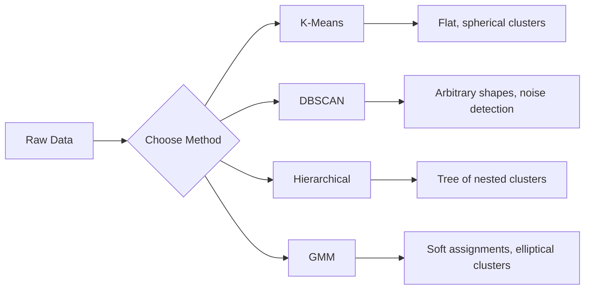

# 无监督学习

> 没有标签,没有老师。算法自己找出结构。

**类型:** 动手构建
**编程语言:** Python
**前置要求:** 第 1 阶段(范数与距离、概率与分布),第 2 阶段 第 1-6 课
**预计耗时:** 约 90 分钟

## 学习目标

- 从零实现 K-Means、DBSCAN 和高斯混合模型(GMM),对比它们的聚类行为
- 用轮廓系数(silhouette score)和肘部法则评估聚类质量,选出最优 K 值
- 讲清什么时候 DBSCAN 优于 K-Means,以及哪个算法能处理非球形簇和离群点
- 用聚类方法搭一条异常检测流水线,把偏离正常模式的点标记出来

## 问题

到目前为止,每一节 ML 课都假设数据带标签:"这是输入,这是正确输出。"但现实世界里标签很贵。医院有上百万条病历,但没人手工给每条标注疾病类别;电商网站有上百万个用户会话,但没人手工划分客户群体;安全团队有网络日志,但没人逐条标记异常。

无监督学习在没有人告诉它找什么的情况下发现模式。它把相似的数据点分组、挖掘隐藏结构、揪出异常。如果说监督学习是拿着带答案的教科书学习,无监督学习就是盯着原始数据看,直到模式自己浮现出来。

麻烦在于:没有标签,就没法直接衡量"对"与"错"。要判断算法找到的结构有没有意义,你需要另一套工具。

## 概念

### 聚类:把相似的东西归到一起

聚类把每个数据点分到一个组(簇),让同组的点彼此相似,异组的点彼此疏远。核心问题永远是:"相似"是什么意思?



### K-Means:主力军

K-Means 把数据切成恰好 K 个簇。每个簇有一个质心(簇的重心),每个点都属于离它最近的那个质心。

Lloyd 算法:

1. 随机挑 K 个点作为初始质心
2. 把每个数据点分配给最近的质心
3. 把每个质心重新算成它所辖点的均值
4. 重复第 2-3 步,直到分配不再变化

目标函数(惯性,inertia)衡量所有点到各自质心的平方距离之和。K-Means 最小化它,但只能找到局部最小值。不同的初始化可能给出不同结果。

### 选 K 值

两种标准方法:

**肘部法则:** 分别用 K = 1, 2, 3, ..., n 跑 K-Means,画出惯性随 K 变化的曲线。找那个"手肘"——过了这个点,再加簇也显著降不动惯性了。

**轮廓系数:** 对每个点,衡量它与本簇的相似度(a)和与最近的相邻簇的相似度(b)。轮廓系数是 (b - a) / max(a, b),取值从 -1(分错簇)到 +1(分得很好)。对所有点取平均,得到全局分数。

### DBSCAN:基于密度的聚类

K-Means 假设簇是球形的,还要求你事先定好 K。DBSCAN 两个假设都不要。它把簇看作"被稀疏区域隔开的稠密区域"。

两个参数:
- **eps**:邻域半径
- **min_samples**:构成稠密区域所需的最少点数

三种点:
- **核心点**:eps 距离内至少有 min_samples 个点
- **边界点**:在某个核心点的 eps 范围内,但自己不是核心点
- **噪声点**:既不是核心点也不是边界点。这些就是离群点。

DBSCAN 把彼此在 eps 范围内的核心点连成同一个簇。边界点归入邻近核心点所在的簇。噪声点不属于任何簇。

优点:能找到任意形状的簇、自动确定簇数、识别离群点。缺点:对付不了密度差异很大的簇。

### 层次聚类

构建一棵嵌套簇的树(树状图,dendrogram)。

凝聚式(自底向上):
1. 一开始每个点自成一簇
2. 合并距离最近的两个簇
3. 重复,直到只剩一个簇
4. 在想要的高度剪断树状图,得到 K 个簇

簇之间的"远近"可以这样度量:
- **单链接(single linkage)**:两簇间任意两点距离的最小值
- **全链接(complete linkage)**:两簇间任意两点距离的最大值
- **平均链接(average linkage)**:所有点对距离的平均值
- **Ward 法**:使簇内方差总增幅最小的那次合并

### 高斯混合模型(GMM)

K-Means 是硬分配:每个点只属于一个簇。GMM 是软分配:每个点对每个簇都有一个归属概率。

GMM 假设数据由 K 个高斯分布混合生成,每个高斯有自己的均值和协方差。期望最大化(EM)算法在两步之间交替:

- **E 步**:计算每个点属于每个高斯的概率
- **M 步**:更新每个高斯的均值、协方差和混合权重,最大化数据的似然

GMM 能拟合椭圆形簇(不像 K-Means 只会球形),天然能处理互相重叠的簇。

### 怎么选

| 方法 | 最适合 | 避免用于 |
|--------|----------|------------|
| K-Means | 大数据集、球形簇、已知 K | 形状不规则、有离群点 |
| DBSCAN | K 未知、任意形状、需要检测离群点 | 密度不均、维度很高 |
| 层次聚类 | 小数据集、需要树状图、K 未知 | 大数据集(O(n^2) 内存) |
| GMM | 簇有重叠、需要软分配 | 数据集很大、维度太多 |

### 用聚类做异常检测

聚类天然支持异常检测:
- **K-Means**:离所有质心都远的点是异常
- **DBSCAN**:噪声点按定义就是异常
- **GMM**:在所有高斯下概率都很低的点是异常

```figure
kmeans-step
```

## 动手构建

### 第 1 步:从零实现 K-Means

```python
import math
import random


def euclidean_distance(a, b):
    return math.sqrt(sum((ai - bi) ** 2 for ai, bi in zip(a, b)))


def kmeans(data, k, max_iterations=100, seed=42):
    random.seed(seed)
    n_features = len(data[0])

    centroids = random.sample(data, k)

    for iteration in range(max_iterations):
        clusters = [[] for _ in range(k)]
        assignments = []

        for point in data:
            distances = [euclidean_distance(point, c) for c in centroids]
            nearest = distances.index(min(distances))
            clusters[nearest].append(point)
            assignments.append(nearest)

        new_centroids = []
        for cluster in clusters:
            if len(cluster) == 0:
                new_centroids.append(random.choice(data))
                continue
            centroid = [
                sum(point[j] for point in cluster) / len(cluster)
                for j in range(n_features)
            ]
            new_centroids.append(centroid)

        if all(
            euclidean_distance(old, new) < 1e-6
            for old, new in zip(centroids, new_centroids)
        ):
            print(f"  Converged at iteration {iteration + 1}")
            break

        centroids = new_centroids

    return assignments, centroids
```

### 第 2 步:肘部法则与轮廓系数

```python
def compute_inertia(data, assignments, centroids):
    total = 0.0
    for point, cluster_id in zip(data, assignments):
        total += euclidean_distance(point, centroids[cluster_id]) ** 2
    return total


def silhouette_score(data, assignments):
    n = len(data)
    if n < 2:
        return 0.0

    clusters = {}
    for i, c in enumerate(assignments):
        clusters.setdefault(c, []).append(i)

    if len(clusters) < 2:
        return 0.0

    scores = []
    for i in range(n):
        own_cluster = assignments[i]
        own_members = [j for j in clusters[own_cluster] if j != i]

        if len(own_members) == 0:
            scores.append(0.0)
            continue

        a = sum(euclidean_distance(data[i], data[j]) for j in own_members) / len(own_members)

        b = float("inf")
        for cluster_id, members in clusters.items():
            if cluster_id == own_cluster:
                continue
            avg_dist = sum(euclidean_distance(data[i], data[j]) for j in members) / len(members)
            b = min(b, avg_dist)

        if max(a, b) == 0:
            scores.append(0.0)
        else:
            scores.append((b - a) / max(a, b))

    return sum(scores) / len(scores)


def find_best_k(data, max_k=10):
    print("Elbow method:")
    inertias = []
    for k in range(1, max_k + 1):
        assignments, centroids = kmeans(data, k)
        inertia = compute_inertia(data, assignments, centroids)
        inertias.append(inertia)
        print(f"  K={k}: inertia={inertia:.2f}")

    print("\nSilhouette scores:")
    for k in range(2, max_k + 1):
        assignments, centroids = kmeans(data, k)
        score = silhouette_score(data, assignments)
        print(f"  K={k}: silhouette={score:.4f}")

    return inertias
```

### 第 3 步:从零实现 DBSCAN

```python
def dbscan(data, eps, min_samples):
    n = len(data)
    labels = [-1] * n
    cluster_id = 0

    def region_query(point_idx):
        neighbors = []
        for i in range(n):
            if euclidean_distance(data[point_idx], data[i]) <= eps:
                neighbors.append(i)
        return neighbors

    visited = [False] * n

    for i in range(n):
        if visited[i]:
            continue
        visited[i] = True

        neighbors = region_query(i)

        if len(neighbors) < min_samples:
            labels[i] = -1
            continue

        labels[i] = cluster_id
        seed_set = list(neighbors)
        seed_set.remove(i)

        j = 0
        while j < len(seed_set):
            q = seed_set[j]

            if not visited[q]:
                visited[q] = True
                q_neighbors = region_query(q)
                if len(q_neighbors) >= min_samples:
                    for nb in q_neighbors:
                        if nb not in seed_set:
                            seed_set.append(nb)

            if labels[q] == -1:
                labels[q] = cluster_id

            j += 1

        cluster_id += 1

    return labels
```

### 第 4 步:高斯混合模型(EM 算法)

```python
def gmm(data, k, max_iterations=100, seed=42):
    random.seed(seed)
    n = len(data)
    d = len(data[0])

    indices = random.sample(range(n), k)
    means = [list(data[i]) for i in indices]
    variances = [1.0] * k
    weights = [1.0 / k] * k

    def gaussian_pdf(x, mean, variance):
        d = len(x)
        coeff = 1.0 / ((2 * math.pi * variance) ** (d / 2))
        exponent = -sum((xi - mi) ** 2 for xi, mi in zip(x, mean)) / (2 * variance)
        return coeff * math.exp(max(exponent, -500))

    for iteration in range(max_iterations):
        responsibilities = []
        for i in range(n):
            probs = []
            for j in range(k):
                probs.append(weights[j] * gaussian_pdf(data[i], means[j], variances[j]))
            total = sum(probs)
            if total == 0:
                total = 1e-300
            responsibilities.append([p / total for p in probs])

        old_means = [list(m) for m in means]

        for j in range(k):
            r_sum = sum(responsibilities[i][j] for i in range(n))
            if r_sum < 1e-10:
                continue

            weights[j] = r_sum / n

            for dim in range(d):
                means[j][dim] = sum(
                    responsibilities[i][j] * data[i][dim] for i in range(n)
                ) / r_sum

            variances[j] = sum(
                responsibilities[i][j]
                * sum((data[i][dim] - means[j][dim]) ** 2 for dim in range(d))
                for i in range(n)
            ) / (r_sum * d)
            variances[j] = max(variances[j], 1e-6)

        shift = sum(
            euclidean_distance(old_means[j], means[j]) for j in range(k)
        )
        if shift < 1e-6:
            print(f"  GMM converged at iteration {iteration + 1}")
            break

    assignments = []
    for i in range(n):
        assignments.append(responsibilities[i].index(max(responsibilities[i])))

    return assignments, means, weights, responsibilities
```

### 第 5 步:生成测试数据,全部跑一遍

```python
def make_blobs(centers, n_per_cluster=50, spread=0.5, seed=42):
    random.seed(seed)
    data = []
    true_labels = []
    for label, (cx, cy) in enumerate(centers):
        for _ in range(n_per_cluster):
            x = cx + random.gauss(0, spread)
            y = cy + random.gauss(0, spread)
            data.append([x, y])
            true_labels.append(label)
    return data, true_labels


def make_moons(n_samples=200, noise=0.1, seed=42):
    random.seed(seed)
    data = []
    labels = []
    n_half = n_samples // 2
    for i in range(n_half):
        angle = math.pi * i / n_half
        x = math.cos(angle) + random.gauss(0, noise)
        y = math.sin(angle) + random.gauss(0, noise)
        data.append([x, y])
        labels.append(0)
    for i in range(n_half):
        angle = math.pi * i / n_half
        x = 1 - math.cos(angle) + random.gauss(0, noise)
        y = 1 - math.sin(angle) - 0.5 + random.gauss(0, noise)
        data.append([x, y])
        labels.append(1)
    return data, labels


if __name__ == "__main__":
    centers = [[2, 2], [8, 3], [5, 8]]
    data, true_labels = make_blobs(centers, n_per_cluster=50, spread=0.8)

    print("=== K-Means on 3 blobs ===")
    assignments, centroids = kmeans(data, k=3)
    print(f"  Centroids: {[[round(c, 2) for c in cent] for cent in centroids]}")
    sil = silhouette_score(data, assignments)
    print(f"  Silhouette score: {sil:.4f}")

    print("\n=== Elbow Method ===")
    find_best_k(data, max_k=6)

    print("\n=== DBSCAN on 3 blobs ===")
    db_labels = dbscan(data, eps=1.5, min_samples=5)
    n_clusters = len(set(db_labels) - {-1})
    n_noise = db_labels.count(-1)
    print(f"  Found {n_clusters} clusters, {n_noise} noise points")

    print("\n=== GMM on 3 blobs ===")
    gmm_assignments, gmm_means, gmm_weights, _ = gmm(data, k=3)
    print(f"  Means: {[[round(m, 2) for m in mean] for mean in gmm_means]}")
    print(f"  Weights: {[round(w, 3) for w in gmm_weights]}")
    gmm_sil = silhouette_score(data, gmm_assignments)
    print(f"  Silhouette score: {gmm_sil:.4f}")

    print("\n=== DBSCAN on moons (non-spherical clusters) ===")
    moon_data, moon_labels = make_moons(n_samples=200, noise=0.1)
    moon_db = dbscan(moon_data, eps=0.3, min_samples=5)
    n_moon_clusters = len(set(moon_db) - {-1})
    n_moon_noise = moon_db.count(-1)
    print(f"  Found {n_moon_clusters} clusters, {n_moon_noise} noise points")

    print("\n=== K-Means on moons (will fail to separate) ===")
    moon_km, moon_centroids = kmeans(moon_data, k=2)
    moon_sil = silhouette_score(moon_data, moon_km)
    print(f"  Silhouette score: {moon_sil:.4f}")
    print("  K-Means splits moons poorly because they are not spherical")

    print("\n=== Anomaly detection with DBSCAN ===")
    anomaly_data = list(data)
    anomaly_data.append([20.0, 20.0])
    anomaly_data.append([-5.0, -5.0])
    anomaly_data.append([15.0, 0.0])
    anomaly_labels = dbscan(anomaly_data, eps=1.5, min_samples=5)
    anomalies = [
        anomaly_data[i]
        for i in range(len(anomaly_labels))
        if anomaly_labels[i] == -1
    ]
    print(f"  Detected {len(anomalies)} anomalies")
    for a in anomalies[-3:]:
        print(f"    Point {[round(v, 2) for v in a]}")
```

## 投入使用

用 scikit-learn,同样的算法都是一行的事:

```python
from sklearn.cluster import KMeans, DBSCAN, AgglomerativeClustering
from sklearn.mixture import GaussianMixture
from sklearn.metrics import silhouette_score as sklearn_silhouette

km = KMeans(n_clusters=3, random_state=42).fit(data)
db = DBSCAN(eps=1.5, min_samples=5).fit(data)
agg = AgglomerativeClustering(n_clusters=3).fit(data)
gmm_model = GaussianMixture(n_components=3, random_state=42).fit(data)
```

从零实现的版本让你看清这些库到底在算什么:K-Means 在"分配"和"重算质心"之间迭代;DBSCAN 从稠密的种子点往外扩张成簇;GMM 在 E 步和 M 步之间交替。库的版本只是加了数值稳定性、更聪明的初始化(K-Means++)和 GPU 加速,核心逻辑一模一样。

## 交付

本课产出了 K-Means、DBSCAN 和 GMM 的可用从零实现。这些聚类代码可以复用,作为更高级无监督方法的地基。

## 练习

1. 实现 K-Means++ 初始化:不再纯随机选质心,而是第一个随机选,之后每个质心按"与最近已有质心的平方距离"成正比的概率选出。对比它和随机初始化的收敛速度。
2. 给代码加上凝聚式层次聚类:实现 Ward 链接,产出树状图(用嵌套的合并列表表示)。在不同高度剪切,和 K-Means 的结果对比。
3. 搭一条简单的异常检测流水线:在同一份数据上同时跑 DBSCAN 和 GMM,把两个方法都判定为离群的点标出来(DBSCAN 里的噪声、GMM 里的低概率)。统计两者的重合度,讨论它们什么时候意见不合。

## 关键术语

| 术语 | 大家嘴里的说法 | 实际含义 |
|------|----------------|----------------------|
| 聚类(Clustering) | "把相似的东西分组" | 按某种距离度量把数据切成子集,使组内相似度大于组间相似度 |
| 质心(Centroid) | "簇的中心" | 一个簇里所有点的均值,K-Means 用它代表整个簇 |
| 惯性(Inertia) | "簇有多紧" | 每个点到其质心的平方距离之和,越小越紧 |
| 轮廓系数 | "簇分得开不开" | 对每个点算 (b - a) / max(a, b),a 是簇内平均距离,b 是到最近邻簇的平均距离 |
| 核心点 | "稠密区域里的点" | DBSCAN 中,eps 距离内至少有 min_samples 个邻居的点 |
| EM 算法 | "软版 K-Means" | 期望最大化:迭代计算归属概率(E 步)、更新分布参数(M 步) |
| 树状图(Dendrogram) | "簇的树" | 层次聚类里记录簇合并顺序和合并距离的树形图 |
| 异常点 | "离群点" | 不符合预期模式的数据点,被 DBSCAN 判为噪声或被 GMM 判为低概率 |

## 延伸阅读

- [Stanford CS229 - Unsupervised Learning](https://cs229.stanford.edu/notes2022fall/main_notes.pdf) —— Andrew Ng 关于聚类和 EM 的讲义
- [scikit-learn 聚类指南](https://scikit-learn.org/stable/modules/clustering.html) —— 全部聚类算法的实战对比,带可视化示例
- [DBSCAN 原始论文(Ester et al., 1996)](https://www.aaai.org/Papers/KDD/1996/KDD96-037.pdf) —— 提出密度聚类的开山之作
