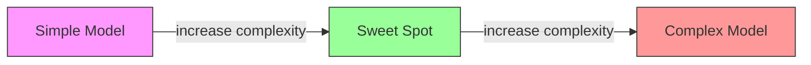
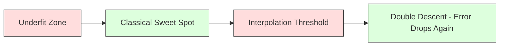
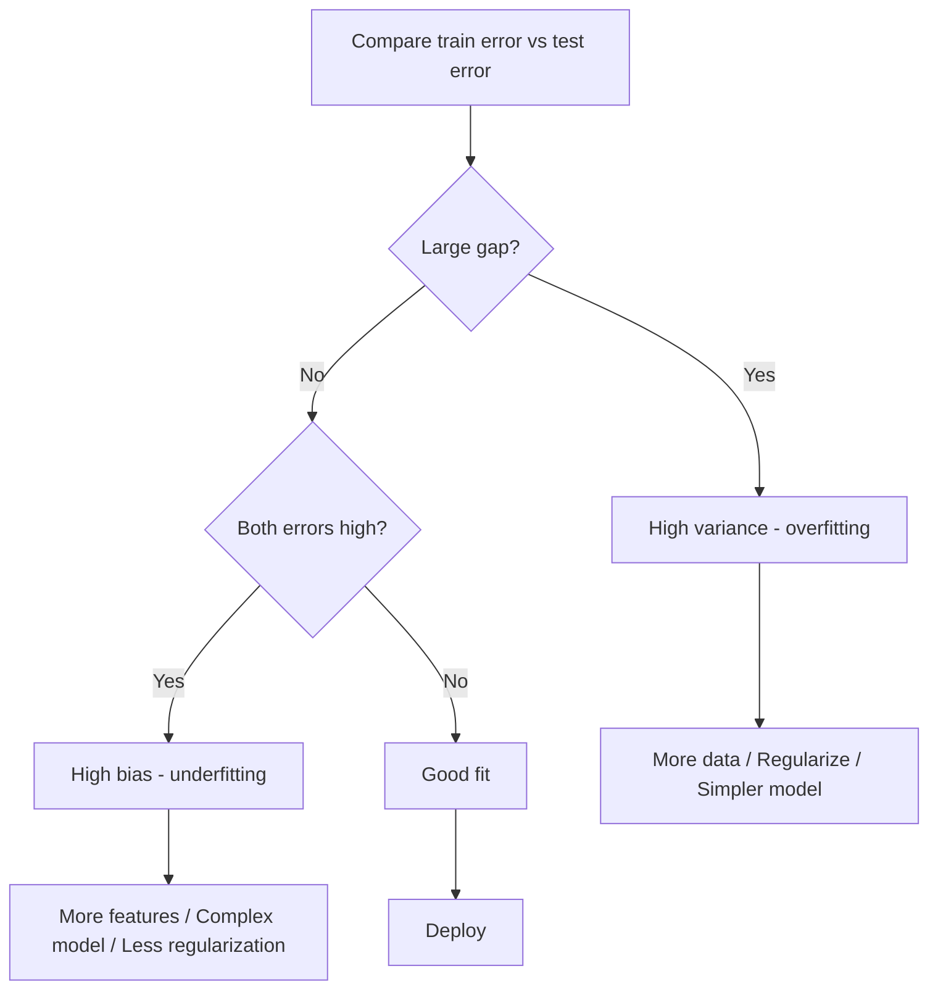
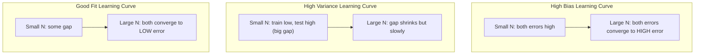
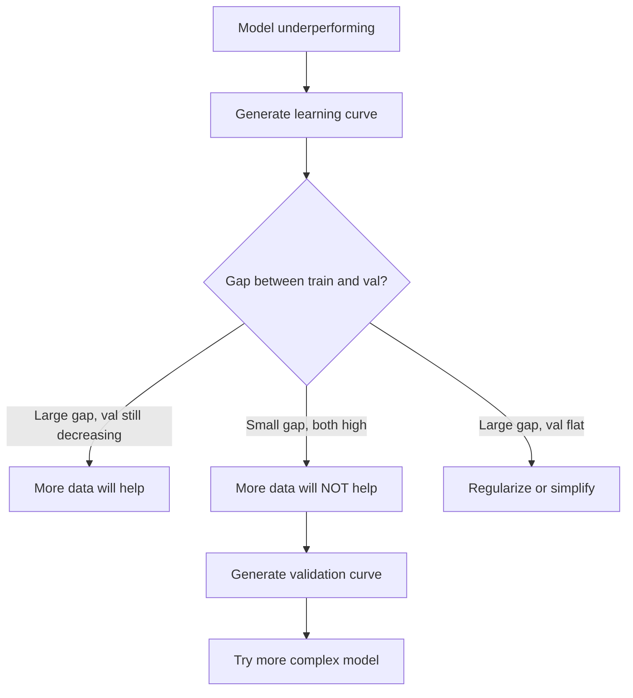

# 偏差-方差权衡

> 每个模型误差都来自三个源头之一:偏差、方差,或噪声。你能控制的只有前两个。

**类型:** 学习
**编程语言:** Python
**前置要求:** 第 2 阶段 第 01-09 课(ML 基础、回归、分类、评估)
**预计耗时:** 约 75 分钟

## 学习目标

- 推导期望预测误差的偏差-方差分解,解释不可约噪声的角色
- 根据训练误差和测试误差的模式,诊断模型是高偏差还是高方差
- 解释正则化技术(L1、L2、dropout、早停)如何用偏差换方差
- 实现实验,在复杂度递增的模型上可视化偏差-方差权衡

## 问题

你训练了一个模型,它在测试数据上有一些误差。这些误差从哪来的?

如果模型太简单(在弯曲的数据集上硬套线性回归),它会系统性地错过真实模式。这是偏差。如果模型太复杂(15 个数据点配 20 阶多项式),它会把训练数据拟合得完美,但在新数据上预测得天差地别。这是方差。

在模型容量固定时,两者没法同时最小化。压低偏差,方差就抬头;压低方差,偏差就抬头。理解这个权衡,是机器学习里最有用的诊断技能,没有之一。它告诉你该把模型调得更复杂还是更简单,该去搞更多数据还是构造更好的特征,该加强还是减弱正则化。

## 概念

### 偏差:系统性误差

偏差衡量的是:模型预测的平均值离真实值有多远。用同一分布抽出来的许多不同训练集,训练同一个模型,把预测取平均——平均值和真值之间的差,就是偏差。

高偏差意味着模型太僵硬,抓不住真实模式。往抛物线上拟合直线,给再多数据也永远对不上曲线。这就是欠拟合。

```
High bias (underfitting):
  Model always predicts roughly the same wrong thing.
  Training error: HIGH
  Test error: HIGH
  Gap between them: SMALL
```

### 方差:对训练数据的敏感度

方差衡量的是:换一批训练数据,预测会变动多大。训练集稍微变一点,模型就大变样,说明方差高。

高方差意味着模型在拟合训练数据里的噪声,而不是底层的信号。20 阶多项式会穿过每一个训练点,但在点与点之间疯狂震荡。这就是过拟合。

```
High variance (overfitting):
  Model fits training data perfectly but fails on new data.
  Training error: LOW
  Test error: HIGH
  Gap between them: LARGE
```

### 分解公式

对任意点 x,平方损失下的期望预测误差可以精确分解:

```
Expected Error = Bias^2 + Variance + Irreducible Noise

where:
  Bias^2   = (E[f_hat(x)] - f(x))^2
  Variance = E[(f_hat(x) - E[f_hat(x)])^2]
  Noise    = E[(y - f(x))^2]             (sigma^2)
```

- `f(x)` 是真实函数
- `f_hat(x)` 是模型的预测
- `E[...]` 是对不同训练集取的期望
- `y` 是观察到的标签(真实函数加噪声)

噪声项是不可约的。数据带噪时,任何模型都好不过 sigma²。你的任务是在 bias² 和 variance 之间找到恰当的平衡点。

### 模型复杂度与误差



经典的 U 形曲线:

| 复杂度 | 偏差 | 方差 | 总误差 |
|-----------|------|----------|-------------|
| 太低 | 高 | 低 | 高(欠拟合) |
| 刚刚好 | 适中 | 适中 | 最低 |
| 太高 | 低 | 高 | 高(过拟合) |

### 正则化:偏差-方差的调节旋钮

正则化故意牺牲偏差来压低方差。它约束模型,不让它去追噪声。

- **L2(Ridge)**:把所有权重往零收缩。保留全部特征,但削弱它们的影响力。
- **L1(Lasso)**:把一部分权重恰好压到零。顺带做了特征选择。
- **Dropout**:训练时随机禁用神经元,迫使网络学出冗余表示。
- **早停(Early stopping)**:在模型完全拟合训练数据之前停下训练。

正则化强度(lambda、dropout 比率、训练轮数)直接决定你坐在偏差-方差曲线的哪个位置。正则化越强,偏差越大,方差越小。

### 双重下降:现代视角

经典理论说:过了甜点位,复杂度越高越糟。但 2019 年以来的研究发现了意想不到的现象:如果继续把模型容量推高,越过插值阈值(模型参数量刚好足以完美拟合训练数据的点)很远,测试误差会再次下降。



这个"双重下降"(double descent)现象解释了为什么严重过参数化的神经网络(参数量远超训练样本数)依然能良好泛化。经典的偏差-方差权衡没有错,但对现代 regime 来说它不完整。

关于双重下降的关键观察:
- 它在线性模型、决策树和神经网络里都会出现
- 在插值区间,更多数据反而可能有害(样本维度的双重下降)
- 训练轮数过多也可能引发它(epoch 维度的双重下降)
- 正则化能抹平那个峰,但无法彻底消除它

为什么会这样?在插值阈值处,模型的容量刚好够拟合所有训练点,被逼进一个非常特定的解——必须穿过每一个点,数据稍微扰动一下,拟合结果就大变。方差在这里达到峰值。越过阈值之后,能完美拟合数据的解有一大把,学习算法(比如带隐式正则化的梯度下降)倾向于从中挑出最简单的那个。这种对简单解的隐式偏好,就是过参数化模型能泛化的原因。

| 区间 | 参数量 vs 样本量 | 行为 |
|--------|----------------------|----------|
| 欠参数化 | p << n | 经典权衡适用 |
| 插值阈值 | p ~ n | 方差到顶,测试误差飙升 |
| 过参数化 | p >> n | 隐式正则化生效,测试误差回落 |

实践结论:如果你在用神经网络或大型树集成,别停在插值阈值上。要么明显低于它(配显式正则化),要么远远超过它。最糟的位置,就是恰好卡在阈值上。

### 诊断你的模型



| 症状 | 诊断 | 对策 |
|---------|-----------|-----|
| 训练误差高,测试误差高 | 偏差 | 加特征、换复杂模型、减弱正则化 |
| 训练误差低,测试误差高 | 方差 | 加数据、正则化、简化模型、dropout |
| 训练误差低,测试误差低 | 拟合良好 | 上线 |
| 训练误差在降,测试误差在升 | 正在过拟合 | 早停 |

### 实战策略

**当问题是偏差时:**
- 加多项式或交互特征
- 换更灵活的模型(树集成替代线性模型)
- 减弱正则化强度
- 训练更久(如果还没收敛)

**当问题是方差时:**
- 搞更多训练数据
- 用 bagging(随机森林)
- 加强正则化(更大的 lambda、更多的 dropout)
- 做特征选择(删掉噪声特征)
- 用交叉验证尽早发现它

### 集成方法与方差削减

集成方法是对付方差最实用的武器。

**Bagging(Bootstrap 聚合)** 在训练数据的不同 bootstrap 抽样上训练多个模型,再把预测取平均。单个模型方差高,但平均之后方差大幅下降。随机森林就是应用在决策树上的 bagging。

数学上为什么有效:对 N 个独立预测取平均,每个方差是 sigma²,平均值的方差就是 sigma² / N。这些模型并非真正独立(它们看到的数据相似),所以降幅不到 1/N,但依然可观。

**Boosting** 通过按序建模来降低偏差:每个新模型都专注于集成目前的残差。梯度提升和 AdaBoost 是主要代表。模型加得太多,boosting 也会过拟合,所以要早停或正则化。

| 方法 | 主要作用 | 偏差变化 | 方差变化 |
|--------|---------------|-------------|-----------------|
| Bagging | 降方差 | 不变 | 下降 |
| Boosting | 降偏差 | 下降 | 可能上升 |
| Stacking | 两者都降 | 取决于元学习器 | 取决于基模型 |
| Dropout | 隐式 bagging | 略升 | 下降 |

**实战法则:** 基模型方差高(深树、高阶多项式)就用 bagging;基模型偏差高(浅树桩、简单线性模型)就用 boosting。

### 学习曲线

学习曲线画出训练误差和验证误差随训练集大小变化的轨迹。它是你手里最实用的诊断工具。和单次的训练/测试对比不同,学习曲线让你看到模型的走势,并告诉你加数据有没有用。



怎么读:

| 场景 | 训练误差 | 验证误差 | 差距 | 含义 | 对策 |
|----------|---------------|-----------------|-----|---------------|------------|
| 高偏差 | 高 | 高 | 小 | 模型抓不住模式 | 加特征、换复杂模型、减弱正则化 |
| 高方差 | 低 | 高 | 大 | 模型在背训练数据 | 加数据、正则化、简化模型 |
| 拟合良好 | 适中 | 适中 | 小 | 模型泛化良好 | 上线 |
| 高方差、在改善 | 低 | 随数据增加在降 | 在收窄 | 数据能治的方差问题 | 收集更多数据 |
| 高偏差、平的 | 高 | 高且平 | 小且平 | 加数据没用 | 改模型结构 |

关键洞察:如果两条曲线都走平了,差距小但两个误差都高,那加数据是没用的,你需要更好的模型。如果差距大且还在收窄,加数据就有用。

### 怎么生成学习曲线

有两种做法:

**做法一:变训练集大小,固定模型。** 模型和超参数不动,用越来越大的训练子集训练,在每个规模上记录训练误差和验证误差。这是标准的学习曲线。

**做法二:变模型复杂度,固定数据。** 数据不动,扫一个复杂度参数(多项式阶数、树深度、网络层数),在每个复杂度上记录训练误差和验证误差。这是验证曲线,直接展示偏差-方差权衡。

两种做法互补:第一个告诉你加数据有没有用,第二个告诉你换模型有没有用。决定下一步之前,两个都跑。



```figure
bias-variance
```

## 动手构建

`code/bias_variance.py` 里的代码会跑完整的偏差-方差分解实验。下面是逐步的思路。

### 第 1 步:用已知函数生成合成数据

我们用 `f(x) = sin(1.5x) + 0.5x`,加高斯噪声。知道真实函数,才能算出精确的偏差和方差。

```python
def true_function(x):
    return np.sin(1.5 * x) + 0.5 * x

def generate_data(n_samples=30, noise_std=0.5, x_range=(-3, 3), seed=None):
    rng = np.random.RandomState(seed)
    x = rng.uniform(x_range[0], x_range[1], n_samples)
    y = true_function(x) + rng.normal(0, noise_std, n_samples)
    return x, y
```

### 第 2 步:Bootstrap 抽样与多项式拟合

对每个多项式阶数,我们抽很多 bootstrap 训练集,拟合多项式,在固定的测试网格上记录预测。这样每个测试点上都有一个预测的分布。

```python
def fit_polynomial(x_train, y_train, degree, lam=0.0):
    X = np.column_stack([x_train ** d for d in range(degree + 1)])
    if lam > 0:
        penalty = lam * np.eye(X.shape[1])
        penalty[0, 0] = 0
        w = np.linalg.solve(X.T @ X + penalty, X.T @ y_train)
    else:
        w = np.linalg.lstsq(X, y_train, rcond=None)[0]
    return w
```

我们在 200 个不同的 bootstrap 样本上拟合。每个 bootstrap 样本来自同一个底层分布,但包含的点不同。

### 第 3 步:计算 Bias² 与方差分解

每个测试点上有了 200 组预测,就可以按定义直接算分解:

```python
mean_pred = predictions.mean(axis=0)
bias_sq = np.mean((mean_pred - y_true) ** 2)
variance = np.mean(predictions.var(axis=0))
total_error = np.mean(np.mean((predictions - y_true) ** 2, axis=1))
```

- `mean_pred` 是从 bootstrap 样本估出的 E[f_hat(x)]
- `bias_sq` 是平均预测与真值之差的平方
- `variance` 是各 bootstrap 样本间预测的平均离散度
- `total_error` 应约等于 bias² + variance + noise

### 第 4 步:学习曲线

学习曲线在固定模型复杂度的情况下扫训练集大小,告诉你模型是受制于数据还是受制于容量。

```python
def demo_learning_curves():
    sizes = [10, 15, 20, 30, 50, 75, 100, 150, 200, 300]
    degree = 5

    for n in sizes:
        train_errors = []
        test_errors = []
        for seed in range(50):
            x_train, y_train = generate_data(n_samples=n, seed=seed * 100)
            w = fit_polynomial(x_train, y_train, degree)
            train_pred = predict_polynomial(x_train, w)
            train_mse = np.mean((train_pred - y_train) ** 2)
            test_pred = predict_polynomial(x_test, w)
            test_mse = np.mean((test_pred - y_test) ** 2)
            train_errors.append(train_mse)
            test_errors.append(test_mse)
        # Average over runs gives the learning curve point
```

对高方差模型(5 阶配小数据),你会看到:
- 训练误差一开始很低,数据变多、死记硬背变难,误差随之上升
- 测试误差一开始很高,模型拿到更多信号后下降
- 两者的差距随数据增加而收窄

对高偏差模型(1 阶),两个误差很快收敛到同一个高水平,加再多数据也没用。

### 第 5 步:正则化扫描

代码里还有 `demo_regularization_sweep()`:固定一个高阶多项式(15 阶),把 Ridge 正则化强度从 0.001 扫到 100。这从另一个角度展示偏差-方差权衡:不变模型复杂度,改约束强度。

```python
def demo_regularization_sweep():
    alphas = [0.001, 0.005, 0.01, 0.05, 0.1, 0.5, 1.0, 5.0, 10.0, 50.0, 100.0]
    for alpha in alphas:
        results = bias_variance_decomposition([15], lam=alpha)
        r = results[15]
        print(f"alpha={alpha:.3f}  bias={r['bias_sq']:.4f}  var={r['variance']:.4f}")
```

alpha 小的时候,15 阶多项式几乎不受约束,模型在每个 bootstrap 样本上追噪声,方差占主导。alpha 大的时候,惩罚强到模型几乎变成一个常数函数,偏差占主导。最优 alpha 在两者之间。

这和扫多项式阶数得到的是同一条 U 形曲线,只不过控制旋钮从离散的阶数换成了连续的强度。实践中,正则化是调节权衡的首选方式,因为它能精细调节,又不用动特征集。

## 投入使用

sklearn 提供了 `learning_curve` 和 `validation_curve`,不用自己写 bootstrap 循环就能做这些诊断。

### 验证曲线:扫模型复杂度

```python
from sklearn.model_selection import validation_curve
from sklearn.pipeline import make_pipeline
from sklearn.preprocessing import PolynomialFeatures
from sklearn.linear_model import Ridge

degrees = list(range(1, 16))
train_scores_all = []
val_scores_all = []

for d in degrees:
    pipe = make_pipeline(PolynomialFeatures(d), Ridge(alpha=0.01))
    train_scores, val_scores = validation_curve(
        pipe, X, y, param_name="polynomialfeatures__degree",
        param_range=[d], cv=5, scoring="neg_mean_squared_error"
    )
    train_scores_all.append(-train_scores.mean())
    val_scores_all.append(-val_scores.mean())
```

这直接给出偏差-方差权衡曲线。验证分数相对训练分数差得最多的地方,方差占主导;两个都差的地方,偏差占主导。

### 学习曲线:扫训练集大小

```python
from sklearn.model_selection import learning_curve

pipe = make_pipeline(PolynomialFeatures(5), Ridge(alpha=0.01))
train_sizes, train_scores, val_scores = learning_curve(
    pipe, X, y, train_sizes=np.linspace(0.1, 1.0, 10),
    cv=5, scoring="neg_mean_squared_error"
)
train_mse = -train_scores.mean(axis=1)
val_mse = -val_scores.mean(axis=1)
```

把 `train_mse` 和 `val_mse` 对 `train_sizes` 画出来,曲线形状会告诉你关于模型的一切。

### 交叉验证配正则化扫描

```python
from sklearn.model_selection import cross_val_score

alphas = [0.001, 0.01, 0.1, 1.0, 10.0, 100.0]
for alpha in alphas:
    pipe = make_pipeline(PolynomialFeatures(10), Ridge(alpha=alpha))
    scores = cross_val_score(pipe, X, y, cv=5, scoring="neg_mean_squared_error")
    print(f"alpha={alpha:>7.3f}  MSE={-scores.mean():.4f} +/- {scores.std():.4f}")
```

这是在固定模型复杂度下扫正则化强度。你会看到同一个权衡:alpha 小则方差高,alpha 大则偏差高。

### 串起来:一套完整的诊断流程

实践中,按顺序跑这些诊断:

1. 训练模型,算训练误差和测试误差。
2. 两个都高:偏差问题,跳到第 4 步。
3. 训练低、测试高:方差问题。生成学习曲线,看加数据有没有用。没用就正则化。
4. 生成验证曲线,扫你的主复杂度参数,找甜点位。
5. 在甜点位生成学习曲线。差距还大,就需要更多数据或正则化。
6. 用 `cross_val_score` 试不同的 Ridge/Lasso alpha,选交叉验证误差最低的那个。

大多数表格数据集上,这套流程只要 10-15 分钟算力,能省掉几小时的瞎猜。

## 交付

本课产出:`outputs/prompt-model-diagnostics.md`

## 练习

1. 把 `noise_std=0`(无噪声)重跑分解。不可约误差项会变成什么?最优复杂度会变吗?

2. 把训练集大小从 30 加到 300。方差分量会如何变化?最优多项式阶数会移动吗?

3. 给实验加上 L2 正则化(Ridge 回归)。固定 15 阶多项式,把 lambda 从 0 扫到 100,画出 bias² 和 variance 随 lambda 变化的曲线。

4. 把真实函数从多项式改成 `sin(x)`。偏差-方差分解会有什么变化?还有清晰的最优阶数吗?

5. 实现一个简单的 bagging 包装器:在 bootstrap 样本上训练 10 个模型,预测取平均。展示它能降方差而不怎么升偏差。

## 关键术语

| 术语 | 大家嘴里的说法 | 实际含义 |
|------|----------------|----------------------|
| 偏差(Bias) | "模型太简单了" | 来自错误假设的系统性误差,即平均模型预测与真值之间的差距 |
| 方差(Variance) | "模型过拟合了" | 来自对训练数据敏感的误差,即换不同训练集时预测的变动幅度 |
| 不可约误差 | "数据里的噪声" | 来自数据生成过程本身随机性的误差,任何模型都消不掉 |
| 欠拟合 | "没学够" | 模型偏差高,连训练数据上的真实模式都抓不住 |
| 过拟合 | "把数据背下来了" | 模型方差高,拟合了训练数据里无法泛化的噪声 |
| 正则化 | "约束模型" | 加惩罚项降低模型复杂度,用偏差换更低的方差 |
| 双重下降 | "参数多反而好" | 模型容量远超插值阈值后,测试误差再次下降的现象 |
| 模型复杂度 | "模型有多灵活" | 模型拟合任意模式的容量,由结构、特征或正则化控制 |

## 延伸阅读

- [Hastie, Tibshirani, Friedman: Elements of Statistical Learning, Ch. 7](https://hastie.su.domains/ElemStatLearn/) —— 偏差-方差分解的权威论述
- [Belkin et al., Reconciling modern machine learning practice and the bias-variance trade-off (2019)](https://arxiv.org/abs/1812.11118) —— 双重下降原始论文
- [Nakkiran et al., Deep Double Descent (2019)](https://arxiv.org/abs/1912.02292) —— epoch 维度与样本维度的双重下降
- [Scott Fortmann-Roe: Understanding the Bias-Variance Tradeoff](http://scott.fortmann-roe.com/docs/BiasVariance.html) —— 清晰的可视化讲解
