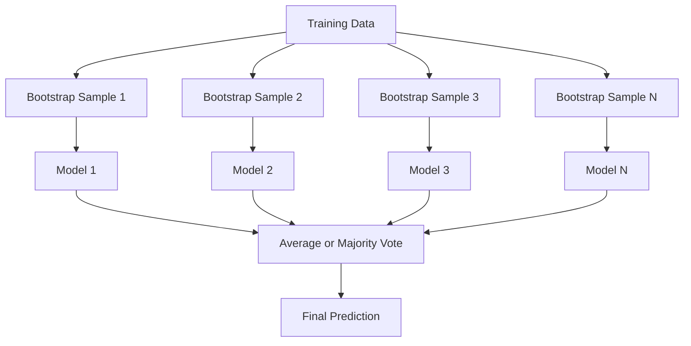
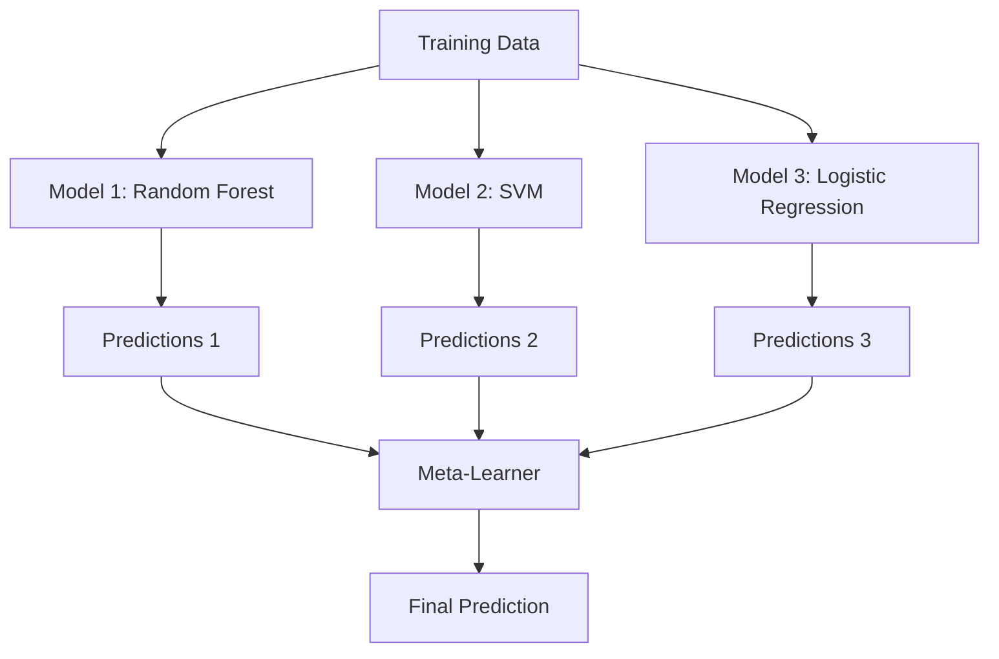

# 集成方法

> 一群弱学习器,组合得当,就是强学习器。这不是比喻,是定理。

**类型:** 动手构建
**编程语言:** Python
**前置要求:** 第 2 阶段 第 10 课(偏差-方差权衡)
**预计耗时:** 约 120 分钟

## 学习目标

- 从零实现 AdaBoost 和梯度提升,解释 boosting 如何按序降低偏差
- 构建 bagging 集成,展示对去相关的模型取平均如何在不升偏差的前提下降低方差
- 对比 bagging、boosting、stacking 各自针对哪种误差成分
- 评估集成的多样性,解释为什么弱学习器越独立,多数投票的准确率越高

## 问题

单棵决策树训练快、好解释,但会过拟合。单个线性模型在复杂边界上会欠拟合。你可以花好几天打磨完美的模型结构——或者,把一堆不完美的模型组合起来,得到比任何一个都好的结果。

集成方法干的就是这件事。它是 Kaggle 表格数据竞赛里最靠谱的获胜技术,驱动着大多数生产级 ML 系统,还是偏差-方差权衡的活教材。Bagging 降方差,Boosting 降偏差,Stacking 学会在什么输入上信哪个模型。

## 概念

### 集成为什么有效

假设你有 N 个相互独立的分类器,每个准确率 p > 0.5。多数投票的准确率是:

```
P(majority correct) = sum over k > N/2 of C(N,k) * p^k * (1-p)^(N-k)
```

21 个各有 60% 准确率的分类器,多数投票后准确率约 74%。101 个时,涨到 84%。当模型们犯不同的错误时,误差互相抵消了。

关键前提是**多样性**。如果所有模型犯一模一样的错,组合起来毫无意义。集成之所以有效,是因为它通过以下方式制造多样的模型:

- 不同的训练子集(bagging)
- 不同的特征子集(随机森林)
- 按序纠错(boosting)
- 不同的模型家族(stacking)

### Bagging(Bootstrap 聚合)

Bagging 让每个模型在训练数据的不同 bootstrap 抽样上训练,以此制造多样性。



Bootstrap 抽样是从原始数据里有放回地抽取、大小与原数据相同。每个 bootstrap 样本大约覆盖 63.2% 的不同样本;剩下 36.8%(袋外样本,out-of-bag)就是一个白送的验证集。

Bagging 降方差,而且几乎不升偏差。每棵树各自在自己的 bootstrap 样本上过拟合,但每棵树过拟合的方式不同,取平均就把噪声抵消了。

**随机森林**是加了一个变化的 bagging:每次分裂时,只考虑一个随机抽出的特征子集。这迫使树与树之间更加多样。分类时候选特征数通常取 `sqrt(n_features)`,回归取 `n_features / 3`。

### Boosting(按序纠错)

Boosting 按顺序训练模型。每个新模型专注于之前模型搞错的样本。


Boosting 降偏差。每个新模型纠正集成到目前为止的系统性误差。最终预测是所有模型的加权和,表现好的模型权重更高。

代价是:轮数太多,boosting 会过拟合,因为它会一直去拟合越来越难的样本,其中一些可能只是噪声。

### AdaBoost

AdaBoost(自适应提升)是第一个实用的 boosting 算法。它适用于任何基学习器,最常用的是决策树桩(深度为 1 的树)。

算法流程:

```
1. Initialize sample weights: w_i = 1/N for all i

2. For t = 1 to T:
   a. Train weak learner h_t on weighted data
   b. Compute weighted error:
      err_t = sum(w_i * I(h_t(x_i) != y_i)) / sum(w_i)
   c. Compute model weight:
      alpha_t = 0.5 * ln((1 - err_t) / err_t)
   d. Update sample weights:
      w_i = w_i * exp(-alpha_t * y_i * h_t(x_i))
   e. Normalize weights to sum to 1

3. Final prediction: H(x) = sign(sum(alpha_t * h_t(x)))
```

误差越低的模型,alpha 越高。被错分的样本权重变大,下一个模型就会把注意力放在它们身上。

### 梯度提升

梯度提升把 boosting 推广到任意损失函数。它不再重设样本权重,而是让每个新模型去拟合当前集成的残差(损失的负梯度)。

```
1. Initialize: F_0(x) = argmin_c sum(L(y_i, c))

2. For t = 1 to T:
   a. Compute pseudo-residuals:
      r_i = -dL(y_i, F_{t-1}(x_i)) / dF_{t-1}(x_i)
   b. Fit a tree h_t to the residuals r_i
   c. Find optimal step size:
      gamma_t = argmin_gamma sum(L(y_i, F_{t-1}(x_i) + gamma * h_t(x_i)))
   d. Update:
      F_t(x) = F_{t-1}(x) + learning_rate * gamma_t * h_t(x)

3. Final prediction: F_T(x)
```

对平方误差损失,伪残差就是真实残差:`r_i = y_i - F_{t-1}(x_i)`。每棵树就是在实打实地拟合前一个集成的误差。

学习率(shrinkage)控制每棵树的贡献幅度。学习率越小,需要的树越多,但泛化越好。常用值:0.01 到 0.3。

### XGBoost:它为什么统治表格数据

XGBoost(极端梯度提升)是梯度提升加上一系列工程优化,让它又快又准又抗过拟合:

- **正则化目标函数**:对叶子权重加 L1、L2 惩罚,防止单棵树过于自信
- **二阶近似**:同时利用损失的一阶和二阶导数,分裂决策更准
- **稀疏感知分裂**:原生处理缺失值,在每个分裂点学习缺失数据的最佳去向
- **列子采样**:像随机森林一样,每次分裂抽样特征以增加多样性
- **加权分位数草图**:在分布式数据上高效寻找连续特征的分裂点
- **缓存感知块结构**:内存布局针对 CPU 缓存行优化

在表格数据上,XGBoost(以及它的后辈 LightGBM)稳定地胜过神经网络,这一点短期内不会变。只要你的数据能放进一张有行有列的表,就从梯度提升开始。

### Stacking(元学习)

Stacking 把多个基模型的预测当作特征,喂给一个元学习器。



元学习器学会在什么输入上信哪个基模型。如果随机森林在某些区域更强、SVM 在另一些区域更强,元学习器会学会按需路由。

要避免数据泄漏,基模型的预测必须通过训练集上的交叉验证来生成。永远不能用同一份数据既训练基模型、又生成元特征。

### 投票(Voting)

最简单的集成,直接组合预测。

- **硬投票**:对类别标签做多数投票。
- **软投票**:对预测概率取平均,选平均概率最高的类别。通常更好,因为它利用了置信度信息。

```figure
f3-ensemble-average
```

## 动手构建

### 第 1 步:决策树桩(基学习器)

`code/ensembles.py` 里的代码全部从零实现。我们从决策树桩开始:只有一次性分裂的树。

```python
class DecisionStump:
    def __init__(self):
        self.feature_idx = None
        self.threshold = None
        self.polarity = 1
        self.alpha = None

    def fit(self, X, y, weights):
        n_samples, n_features = X.shape
        best_error = float("inf")

        for f in range(n_features):
            thresholds = np.unique(X[:, f])
            for thresh in thresholds:
                for polarity in [1, -1]:
                    pred = np.ones(n_samples)
                    pred[polarity * X[:, f] < polarity * thresh] = -1
                    error = np.sum(weights[pred != y])
                    if error < best_error:
                        best_error = error
                        self.feature_idx = f
                        self.threshold = thresh
                        self.polarity = polarity

    def predict(self, X):
        n = X.shape[0]
        pred = np.ones(n)
        idx = self.polarity * X[:, self.feature_idx] < self.polarity * self.threshold
        pred[idx] = -1
        return pred
```

### 第 2 步:从零实现 AdaBoost

```python
class AdaBoostScratch:
    def __init__(self, n_estimators=50):
        self.n_estimators = n_estimators
        self.stumps = []
        self.alphas = []

    def fit(self, X, y):
        n = X.shape[0]
        weights = np.full(n, 1 / n)

        for _ in range(self.n_estimators):
            stump = DecisionStump()
            stump.fit(X, y, weights)
            pred = stump.predict(X)

            err = np.sum(weights[pred != y])
            err = np.clip(err, 1e-10, 1 - 1e-10)

            alpha = 0.5 * np.log((1 - err) / err)
            weights *= np.exp(-alpha * y * pred)
            weights /= weights.sum()

            stump.alpha = alpha
            self.stumps.append(stump)
            self.alphas.append(alpha)

    def predict(self, X):
        total = sum(a * s.predict(X) for a, s in zip(self.alphas, self.stumps))
        return np.sign(total)
```

### 第 3 步:从零实现梯度提升

```python
class GradientBoostingScratch:
    def __init__(self, n_estimators=100, learning_rate=0.1, max_depth=3):
        self.n_estimators = n_estimators
        self.lr = learning_rate
        self.max_depth = max_depth
        self.trees = []
        self.initial_pred = None

    def fit(self, X, y):
        self.initial_pred = np.mean(y)
        current_pred = np.full(len(y), self.initial_pred)

        for _ in range(self.n_estimators):
            residuals = y - current_pred
            tree = SimpleRegressionTree(max_depth=self.max_depth)
            tree.fit(X, residuals)
            update = tree.predict(X)
            current_pred += self.lr * update
            self.trees.append(tree)

    def predict(self, X):
        pred = np.full(X.shape[0], self.initial_pred)
        for tree in self.trees:
            pred += self.lr * tree.predict(X)
        return pred
```

### 第 4 步:与 sklearn 对比

代码验证了从零实现的版本在准确率上与 sklearn 的 `AdaBoostClassifier`、`GradientBoostingClassifier` 相当,并把所有方法并排对比。

## 投入使用

### 各方法的适用场景

| 方法 | 降低 | 最适合 | 注意 |
|--------|---------|----------|---------------|
| Bagging / 随机森林 | 方差 | 噪声多的数据、特征多 | 对偏差没帮助 |
| AdaBoost | 偏差 | 干净数据、简单基学习器 | 对离群值和噪声敏感 |
| 梯度提升 | 偏差 | 表格数据、竞赛 | 训练慢,不调参容易过拟合 |
| XGBoost / LightGBM | 两者 | 生产环境的表格 ML | 超参数多 |
| Stacking | 两者 | 榨取最后 1-2% 的准确率 | 复杂,元学习器有过拟合风险 |
| 投票 | 方差 | 快速组合多个多样的模型 | 模型不多样就没用 |

### 表格数据的生产级组合拳

大多数表格预测问题,按这个顺序试:

1. **LightGBM 或 XGBoost**,先用默认参数
2. 调 n_estimators、learning_rate、max_depth、min_child_weight
3. 如果还要榨最后 0.5%,用 3-5 个多样的模型搭 stacking 集成
4. 全程用交叉验证

尽管研究界不断尝试,神经网络在表格数据上几乎总是输给梯度提升。TabNet、NODE 之类的架构偶尔能打平,但很少能击败调好的 XGBoost。

## 交付

本课产出 `outputs/prompt-ensemble-selector.md` —— 一条帮你为给定数据集挑选合适集成方法的提示词。描述你的数据(规模、特征类型、噪声水平、类别均衡)和你要解决的问题,这条提示词会带你过一遍决策清单、推荐方法、给出起步超参数,并提醒该方法的常见坑。另产出 `outputs/skill-ensemble-builder.md`,内含完整的选择指南。

## 练习

1. 修改 AdaBoost 实现,记录每一轮后的训练准确率,画出准确率随估计器数量变化的曲线。它什么时候收敛?

2. 给回归树加上随机特征子采样,从零实现一个随机森林。用 `max_features=sqrt(n_features)` 训练 100 棵树并平均预测。和单棵树对比方差削减效果。

3. 在梯度提升实现里加早停:每轮后跟踪验证损失,连续 10 轮没有改善就停。它实际需要多少棵树?

4. 用三个基模型(逻辑回归、决策树、K 近邻)和一个逻辑回归元学习器搭一个 stacking 集成。用 5 折交叉验证生成元特征,和每个基模型单独的表现对比。

5. 在同一数据集上用默认参数跑 XGBoost,和你的从零版梯度提升对比准确率,并给两者计时。速度差有多大?

## 关键术语

| 术语 | 大家嘴里的说法 | 实际含义 |
|------|----------------|----------------------|
| Bagging | "在随机子集上训练" | Bootstrap 聚合:在 bootstrap 样本上训练多个模型,平均预测以降方差 |
| Boosting | "专攻难样本" | 按序训练模型,每个纠正集成目前的误差,以降偏差 |
| AdaBoost | "给数据调权重" | 通过更新样本权重来 boosting:被错分的点在下一轮权重更大 |
| 梯度提升 | "拟合残差" | 让每个新模型拟合损失函数负梯度的 boosting |
| XGBoost | "Kaggle 大杀器" | 带正则化、二阶优化和系统级提速技巧的梯度提升 |
| Stacking | "模型上面叠模型" | 把基模型的预测当作输入特征,训练一个元学习器 |
| 随机森林 | "很多随机的树" | 决策树上的 bagging,每次分裂再做随机特征子采样以增加多样性 |
| 集成多样性 | "犯不同的错" | 各模型的误差必须互不相关,集成才能胜过个体 |
| 袋外误差 | "白送的验证" | 没进入某次 bootstrap 抽样的样本(约 36.8%)可以充当验证集,无需留出法 |

## 延伸阅读

- [Schapire & Freund: Boosting: Foundations and Algorithms](https://mitpress.mit.edu/9780262526036/) —— AdaBoost 作者亲笔的专著
- [Friedman: Greedy Function Approximation: A Gradient Boosting Machine (2001)](https://statweb.stanford.edu/~jhf/ftp/trebst.pdf) —— 梯度提升原始论文
- [Chen & Guestrin: XGBoost (2016)](https://arxiv.org/abs/1603.02754) —— XGBoost 论文
- [Wolpert: Stacked Generalization (1992)](https://www.sciencedirect.com/science/article/abs/pii/S0893608005800231) —— Stacking 原始论文
- [scikit-learn 集成方法](https://scikit-learn.org/stable/modules/ensemble.html) —— 实战参考
