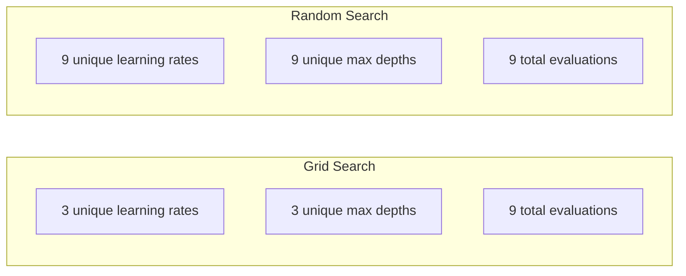
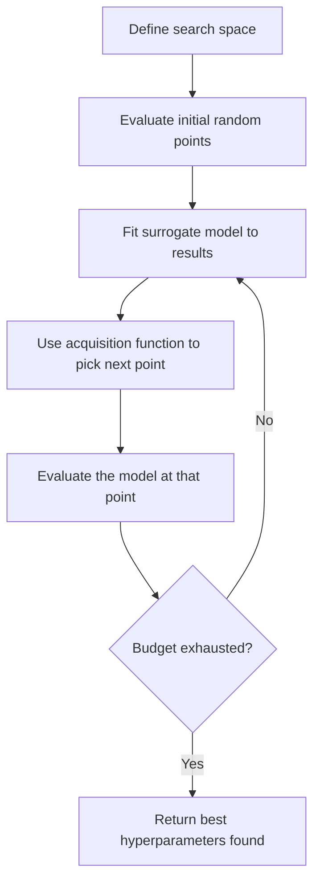
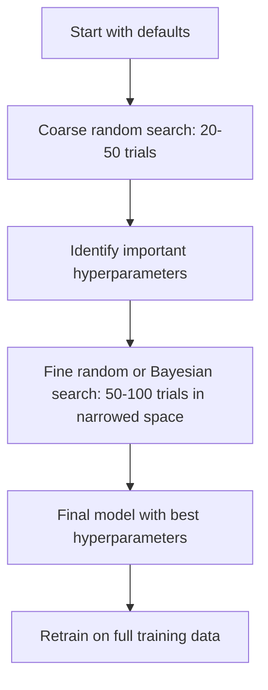
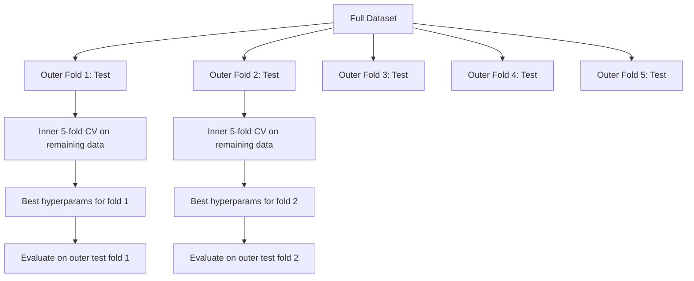

# 超参数调优

> 超参数是训练开始之前你要拧的旋钮。拧得好不好,就是平庸模型和出色模型的差别。

**类型:** 动手构建
**编程语言:** Python
**前置要求:** 第 2 阶段 第 11 课(集成方法)
**预计耗时:** 约 90 分钟

## 学习目标

- 从零实现网格搜索、随机搜索和贝叶斯优化,对比它们的样本效率
- 解释为什么当大多数超参数有效维度低时,随机搜索胜过网格搜索
- 用代理模型(surrogate model)和采集函数(acquisition function)搭一个贝叶斯优化循环来引导搜索
- 设计一套超参数调优策略,通过规范的交叉验证避免对验证集过拟合

## 问题

你的梯度提升模型有学习率、树的数量、最大深度、每叶最小样本数、行采样比例、列采样比例。六个超参数。每个取 5 个合理值,网格上就有 5^6 = 15,625 种组合。每次训练 10 秒,全试一遍要 43 小时算力。

网格搜索是最直觉的做法,也是规模化之后最烂的做法。随机搜索用更少算力做得更好;贝叶斯优化更进一步,能从过往评估中学习。知道该用哪种策略、哪些超参数真正重要,能省下好几天的 GPU 浪费。

## 概念

### 参数 vs 超参数

参数是训练中学出来的(权重、偏置、分裂阈值)。超参数是训练开始前定好的,控制学习如何发生。

| 超参数 | 控制什么 | 常见范围 |
|---------------|-----------------|---------------|
| 学习率 | 每次更新的步长 | 0.001 到 1.0 |
| 树的数量 / epoch 数 | 训练多久 | 10 到 10,000 |
| 最大深度 | 模型复杂度 | 1 到 30 |
| 正则化强度(lambda) | 防过拟合 | 0.0001 到 100 |
| 批次大小 | 梯度估计的噪声 | 16 到 512 |
| Dropout 比率 | 被丢弃神经元的比例 | 0.0 到 0.5 |

### 网格搜索

网格搜索评估指定值的每一种组合。它穷举、好懂,但代价随超参数个数指数膨胀。

```
Grid for 2 hyperparameters:

  learning_rate: [0.01, 0.1, 1.0]
  max_depth:     [3, 5, 7]

  Evaluations: 3 x 3 = 9 combinations

  (0.01, 3)  (0.01, 5)  (0.01, 7)
  (0.1,  3)  (0.1,  5)  (0.1,  7)
  (1.0,  3)  (1.0,  5)  (1.0,  7)
```

网格搜索有个根本缺陷:如果一个超参数重要、另一个不重要,大部分评估都白花了。9 次评估里,重要参数只试到了 3 个不同的值。

### 随机搜索

随机搜索不沿网格走,而是从分布里采样超参数。同样 9 次评估的预算,每个超参数都能试到 9 个不同的值。



随机为什么赢网格(Bergstra & Bengio, 2012):

- 大多数超参数的有效维度很低。6 个超参数里,对某个具体问题真正重要的通常只有 1-2 个。
- 网格搜索在不重要的维度上浪费评估。
- 同样的预算,随机搜索在重要维度上铺得更密。
- 做 60 次随机试验,你有 95% 的概率找到距最优点 5% 以内的配置(前提是搜索空间里确实存在这样的点)。

### 贝叶斯优化

随机搜索不看结果。它不会学到"学习率太高会发散"或者"深度 3 稳定胜过深度 10"。贝叶斯优化利用过往的评估结果,决定下一步往哪里搜。



两个核心组件:

**代理模型(Surrogate model):** 一个评估成本很低的模型(通常是高斯过程),用来近似那个昂贵的目标函数。它能给出搜索空间里任意点的预测值和不确定性估计。

**采集函数(Acquisition function):** 通过平衡"利用"(在已知的好点附近搜)和"探索"(在不确定性高的地方搜),决定下一个评估点。常见选择:

- **期望改进(EI)**:在这个点上,我们预期能比当前最优改进多少?
- **上置信界(UCB)**:预测值加上不确定性的倍数。UCB 高,意味着要么有前途,要么没探过。
- **改进概率(PI)**:这个点超过当前最优的概率有多大?

贝叶斯优化通常能用比随机搜索少 2-5 倍的评估找到更好的超参数。拟合代理模型的开销,相比训练真正的模型可以忽略不计。

### 早停(Early Stopping)

不是每次训练都得跑完。一个配置跑到第 10 个 epoch 明显很烂,就停掉换下一个。这就是超参数搜索语境下的早停。

策略:
- **耐心值法**:验证损失连续 N 个 epoch 没有改善就停
- **中位数剪枝**:如果当前试验的中间结果差于已完成试验在同一步数的中位数,就停
- **Hyperband**:给很多配置各分一点预算,然后逐步给表现最好的加预算

Hyperband 尤其高效:先用各 1 个 epoch 启动 81 个配置,留下前三分之一、给 3 个 epoch,再留前三分之一……如此往复。相比全预算跑完所有配置,它能快 10-50 倍找到好配置。

### 学习率调度器

学习率几乎永远是最重要的超参数。调度器不让它一成不变,而是在训练过程中调整它。

| 调度器 | 公式 | 什么时候用 |
|-----------|---------|-------------|
| 阶梯衰减 | 每 N 个 epoch 乘 0.1 | 经典 CNN 训练 |
| 余弦退火 | lr * 0.5 * (1 + cos(pi * t / T)) | 现代默认 |
| 预热 + 衰减 | 先线性升温再余弦衰减 | Transformer |
| One-cycle | 一个周期内先升后降 | 快速收敛 |
| 平台期衰减 | 指标停滞时按比例下调 | 稳妥的默认选择 |

### 超参数重要性

不是所有超参数都同等重要。对随机森林(Probst et al., 2019)和梯度提升的研究,结论很一致:

**高重要性:**
- 学习率(永远第一个调)
- 估计器数量 / epoch 数(用早停代替调它)
- 正则化强度

**中重要性:**
- 最大深度 / 层数
- 每叶最小样本数 / 权重衰减
- 子采样比例

**低重要性:**
- 最大特征数(随机森林)
- 具体选哪个激活函数
- 批次大小(在合理区间内)

先调重要的,其余的留在默认值。

### 实战策略



具体工作流:

1. **从库的默认值开始。** 它们是经验丰富的从业者选出来的,往往已经到位了 80%。
2. **粗粒度随机搜索。** 范围放宽,跑 20-50 次试验。用早停快速杀掉烂配置。
3. **分析结果。** 哪些超参数和性能相关?收窄搜索空间。
4. **细搜索。** 在收窄后的空间里做贝叶斯优化或聚焦的随机搜索,50-100 次试验。
5. **用找到的最优超参数,在全量训练数据上重训。**

### 与交叉验证结合

在单份验证划分上调超参数是危险的:最优超参数可能对这一折过拟合。嵌套交叉验证用两层循环解决这个问题:

- **外环**(评估):把数据切成"训练+验证"和"测试",报告无偏的性能。
- **内环**(调优):把"训练+验证"再切成"训练"和"验证",找最优超参数。



每个外折独立地找自己的最优超参数。外环分数是泛化性能的无偏估计。

用 sklearn:

```python
from sklearn.model_selection import cross_val_score, GridSearchCV
from sklearn.ensemble import GradientBoostingRegressor

inner_cv = GridSearchCV(
    GradientBoostingRegressor(),
    param_grid={
        "learning_rate": [0.01, 0.05, 0.1],
        "max_depth": [2, 3, 5],
        "n_estimators": [50, 100, 200],
    },
    cv=5,
    scoring="neg_mean_squared_error",
)

outer_scores = cross_val_score(
    inner_cv, X, y, cv=5, scoring="neg_mean_squared_error"
)

print(f"Nested CV MSE: {-outer_scores.mean():.4f} +/- {outer_scores.std():.4f}")
```

这很贵(5 个外折 x 5 个内折 x 27 个网格点 = 675 次拟合),但给你的性能估计是靠得住的。写论文报告最终结果、或者决策风险很高时,用它。

### 实战建议

**先调学习率。** 对基于梯度的方法,它永远是最重要的超参数。学习率不对,其他都白搭。其他超参数固定在默认值,先扫学习率。

**学习率和正则化用对数均匀分布。** 0.001 和 0.01 的差别,与 0.1 和 1.0 的差别一样大。线性搜索会把预算浪费在大值那一头。

**用早停代替调 n_estimators。** 对 boosting 和神经网络,把 n_estimators 或 epoch 数设大,让早停决定何时收手。这样搜索空间里少一个超参数。

**预算分配。** 60% 的调优预算花在最重要的前 2 个超参数上,剩下 40% 给其余。性能的差异大半由前 2 个贡献。

**量纲要对。** 批次大小千万别用对数尺度搜(16、32、64 线性选就好);学习率一定要用对数尺度搜。让搜索分布匹配超参数影响模型的方式。

| 模型类型 | 最重要的超参数 | 推荐搜索方式 | 预算 |
|-----------|--------------------|--------------------|--------|
| 随机森林 | n_estimators, max_depth, min_samples_leaf | 随机搜索,50 次 | 低(训练快) |
| 梯度提升 | learning_rate, n_estimators, max_depth | 贝叶斯,100 次 + 早停 | 中 |
| 神经网络 | learning_rate, weight_decay, batch_size | 贝叶斯或随机,100+ 次 | 高(训练慢) |
| SVM | C, gamma(RBF 核) | 对数尺度网格,25-50 次 | 低(就 2 个参数) |
| Lasso/Ridge | alpha | 对数尺度一维搜索,20 次 | 很低 |
| XGBoost | learning_rate, max_depth, subsample, colsample | 贝叶斯,100-200 次 + 早停 | 中 |

**拿不准的时候:** 随机搜索,试验次数至少取超参数个数的两倍(比如 6 个超参数就至少 12 次)。你会惊讶地发现:精心设计的网格搜索,常常输给 50 次随机搜索。

```figure
k-fold-cv
```

## 动手构建

### 第 1 步:从零实现网格搜索

`code/tuning.py` 里的代码从零实现了网格搜索、随机搜索和一个简化版贝叶斯优化器。

```python
def grid_search(model_fn, param_grid, X_train, y_train, X_val, y_val):
    keys = list(param_grid.keys())
    values = list(param_grid.values())
    best_score = -float("inf")
    best_params = None
    n_evals = 0

    for combo in itertools.product(*values):
        params = dict(zip(keys, combo))
        model = model_fn(**params)
        model.fit(X_train, y_train)
        score = evaluate(model, X_val, y_val)
        n_evals += 1

        if score > best_score:
            best_score = score
            best_params = params

    return best_params, best_score, n_evals
```

### 第 2 步:从零实现随机搜索

```python
def random_search(model_fn, param_distributions, X_train, y_train,
                  X_val, y_val, n_iter=50, seed=42):
    rng = np.random.RandomState(seed)
    best_score = -float("inf")
    best_params = None

    for _ in range(n_iter):
        params = {k: sample(v, rng) for k, v in param_distributions.items()}
        model = model_fn(**params)
        model.fit(X_train, y_train)
        score = evaluate(model, X_val, y_val)

        if score > best_score:
            best_score = score
            best_params = params

    return best_params, best_score, n_iter
```

### 第 3 步:贝叶斯优化(简化版)

核心思想:把高斯过程拟合到已观察的(超参数, 分数)数据对上,再用采集函数决定下一步看哪里。

```python
class SimpleBayesianOptimizer:
    def __init__(self, search_space, n_initial=5):
        self.search_space = search_space
        self.n_initial = n_initial
        self.X_observed = []
        self.y_observed = []

    def _kernel(self, x1, x2, length_scale=1.0):
        dists = np.sum((x1[:, None, :] - x2[None, :, :]) ** 2, axis=2)
        return np.exp(-0.5 * dists / length_scale ** 2)

    def _fit_gp(self, X_new):
        X_obs = np.array(self.X_observed)
        y_obs = np.array(self.y_observed)
        y_mean = y_obs.mean()
        y_centered = y_obs - y_mean

        K = self._kernel(X_obs, X_obs) + 1e-4 * np.eye(len(X_obs))
        K_star = self._kernel(X_new, X_obs)

        L = np.linalg.cholesky(K)
        alpha = np.linalg.solve(L.T, np.linalg.solve(L, y_centered))
        mu = K_star @ alpha + y_mean

        v = np.linalg.solve(L, K_star.T)
        var = 1.0 - np.sum(v ** 2, axis=0)
        var = np.maximum(var, 1e-6)

        return mu, var

    def _expected_improvement(self, mu, var, best_y):
        sigma = np.sqrt(var)
        z = (mu - best_y) / (sigma + 1e-10)
        ei = sigma * (z * norm_cdf(z) + norm_pdf(z))
        return ei

    def suggest(self):
        if len(self.X_observed) < self.n_initial:
            return sample_random(self.search_space)

        candidates = [sample_random(self.search_space) for _ in range(500)]
        X_cand = np.array([to_vector(c) for c in candidates])
        mu, var = self._fit_gp(X_cand)
        ei = self._expected_improvement(mu, var, max(self.y_observed))
        return candidates[np.argmax(ei)]

    def observe(self, params, score):
        self.X_observed.append(to_vector(params))
        self.y_observed.append(score)
```

高斯过程代理在每个候选点上给出两样东西:预测的分数(mu)和不确定性(var)。期望改进在两者之间做平衡:它偏爱预测分数高的点,也偏爱不确定性高的点。早期,大多数点不确定性高,优化器到处探索;后期,它聚焦在最有希望的区域。

### 第 4 步:三种方法同台对比

在同一个合成目标函数上跑全部三种方法做对比。这次对比用一个简化的包装器,让优化器直接调用目标函数(不做模型训练),所以 API 和上面基于模型的实现略有不同:

```python
def synthetic_objective(params):
    lr = params["learning_rate"]
    depth = params["max_depth"]
    return -(np.log10(lr) + 2) ** 2 - (depth - 4) ** 2 + 10

param_grid = {
    "learning_rate": [0.001, 0.01, 0.1, 1.0],
    "max_depth": [2, 3, 4, 5, 6, 7, 8],
}

grid_best = None
grid_score = -float("inf")
grid_history = []
for combo in itertools.product(*param_grid.values()):
    params = dict(zip(param_grid.keys(), combo))
    score = synthetic_objective(params)
    grid_history.append((params, score))
    if score > grid_score:
        grid_score = score
        grid_best = params

param_dist = {
    "learning_rate": ("log_float", 0.001, 1.0),
    "max_depth": ("int", 2, 8),
}

rand_best = None
rand_score = -float("inf")
rand_history = []
rng = np.random.RandomState(42)
for _ in range(28):
    params = {k: sample(v, rng) for k, v in param_dist.items()}
    score = synthetic_objective(params)
    rand_history.append((params, score))
    if score > rand_score:
        rand_score = score
        rand_best = params

optimizer = SimpleBayesianOptimizer(param_dist, n_initial=5)
bayes_history = []
for _ in range(28):
    params = optimizer.suggest()
    score = synthetic_objective(params)
    optimizer.observe(params, score)
    bayes_history.append((params, score))
bayes_score = max(s for _, s in bayes_history)

print(f"{'Method':<20} {'Best Score':>12} {'Evaluations':>12}")
print("-" * 50)
print(f"{'Grid Search':<20} {grid_score:>12.4f} {len(grid_history):>12}")
print(f"{'Random Search':<20} {rand_score:>12.4f} {len(rand_history):>12}")
print(f"{'Bayesian Opt':<20} {bayes_score:>12.4f} {len(bayes_history):>12}")
```

同样的预算下,贝叶斯优化通常最快找到最高分,因为它不在明显糟糕的区域浪费评估。随机搜索的覆盖面比网格搜索大。网格搜索只在超参数很少、你又穷取得起的时候才赢。

## 投入使用

### Optuna 实战

Optuna 是认真做超参数调优的首选库。剪枝、分布式搜索、可视化,开箱即用。

```python
import optuna

def objective(trial):
    lr = trial.suggest_float("learning_rate", 1e-4, 1e-1, log=True)
    n_est = trial.suggest_int("n_estimators", 50, 500)
    max_depth = trial.suggest_int("max_depth", 2, 10)

    model = GradientBoostingRegressor(
        learning_rate=lr,
        n_estimators=n_est,
        max_depth=max_depth,
    )
    model.fit(X_train, y_train)
    return mean_squared_error(y_val, model.predict(X_val))

study = optuna.create_study(direction="minimize")
study.optimize(objective, n_trials=100)

print(f"Best params: {study.best_params}")
print(f"Best MSE: {study.best_value:.4f}")
```

Optuna 的关键特性:
- `suggest_float(..., log=True)` 用于适合对数尺度搜索的参数(学习率、正则化)
- `suggest_int` 用于整数参数
- `suggest_categorical` 用于离散选项
- 内置 MedianPruner,可以早停烂试验
- `study.trials_dataframe()` 用于分析

### Optuna 配剪枝

剪枝提前停掉没前途的试验,省下大量算力。写法如下:

```python
import optuna
from sklearn.model_selection import cross_val_score

def objective(trial):
    params = {
        "learning_rate": trial.suggest_float("lr", 1e-4, 0.5, log=True),
        "max_depth": trial.suggest_int("max_depth", 2, 10),
        "n_estimators": trial.suggest_int("n_estimators", 50, 500),
        "subsample": trial.suggest_float("subsample", 0.5, 1.0),
    }

    model = GradientBoostingRegressor(**params)
    scores = cross_val_score(model, X_train, y_train, cv=3,
                             scoring="neg_mean_squared_error")
    mean_score = -scores.mean()

    trial.report(mean_score, step=0)
    if trial.should_prune():
        raise optuna.TrialPruned()

    return mean_score

pruner = optuna.pruners.MedianPruner(n_startup_trials=10, n_warmup_steps=5)
study = optuna.create_study(direction="minimize", pruner=pruner)
study.optimize(objective, n_trials=200)
```

`MedianPruner` 会在某次试验的中间值差于已完成试验同一步数的中位数时把它停掉。剪枝需要调 `trial.report()` 上报中间指标、调 `trial.should_prune()` 检查是否该停。`n_startup_trials=10` 保证至少有 10 次试验完整跑完之后剪枝才介入。这通常能省 40-60% 的总算力。

### sklearn 自带的调优器

快速实验可以用 sklearn 的 `GridSearchCV`、`RandomizedSearchCV` 和 `HalvingRandomSearchCV`:

```python
from sklearn.model_selection import RandomizedSearchCV
from scipy.stats import loguniform, randint

param_dist = {
    "learning_rate": loguniform(1e-4, 0.5),
    "max_depth": randint(2, 10),
    "n_estimators": randint(50, 500),
}

search = RandomizedSearchCV(
    GradientBoostingRegressor(),
    param_dist,
    n_iter=100,
    cv=5,
    scoring="neg_mean_squared_error",
    random_state=42,
    n_jobs=-1,
)
search.fit(X_train, y_train)
print(f"Best params: {search.best_params_}")
print(f"Best CV MSE: {-search.best_score_:.4f}")
```

学习率和正则化用 scipy 的 `loguniform`,整数超参数用 `randint`。`n_jobs=-1` 把所有 CPU 核都用上并行。

### 超参数调优的常见错误

**预处理造成的数据泄漏。** 如果你在交叉验证之前就在全量数据上拟合缩放器,验证折的信息就漏进了训练。永远把预处理放进 `Pipeline`,让它只在训练折上拟合。

**对验证集过拟合。** 跑上千次试验,实际上等于在验证集上训练。最终性能估计用嵌套交叉验证,或者单独留一份调优全程绝不碰的测试集。

**搜索范围太窄。** 如果最优值落在你搜索空间的边界上,说明你搜得不够宽,真正的最优可能在范围之外。永远检查最优参数是不是顶在边上。

**忽略交互效应。** 在 boosting 里,学习率和估计器数量强相关:学习率越低,需要的估计器越多。独立地调它们,不如联合地调。

**对迭代式模型不用早停。** 对梯度提升和神经网络,把 n_estimators 或 epoch 数设大,用早停。这严格优于把迭代次数当超参数调。

## 练习

1. 用同样的总预算(比如 50 次评估)跑网格搜索和随机搜索,对比找到的最好分数。换不同种子重复 10 次,随机搜索赢几次?

2. 从零实现 Hyperband:启动 81 个配置,各训练 1 个 epoch;每轮留下前三分之一、预算翻三倍。对比总算力(所有配置的 epoch 总和)和全预算跑 81 个配置。

3. 给第 11 课的梯度提升实现加一个学习率调度器(余弦退火)。和固定学习率比,有没有帮助?

4. 用 Optuna 在真实数据集(比如 sklearn 的乳腺癌数据集)上调 RandomForestClassifier。用 `optuna.visualization.plot_param_importances(study)` 看哪些超参数最重要。和本课给出的重要性排序一致吗?

5. 实现一个简单的采集函数(期望改进),演示探索与利用的权衡。画出代理模型的均值和不确定性,展示 EI 选择的下一个评估点。

## 关键术语

| 术语 | 大家嘴里的说法 | 实际含义 |
|------|----------------|----------------------|
| 超参数 | "你自己选的一个设置" | 训练前设定的值,控制学习过程本身,不从数据中学出 |
| 网格搜索 | "每种组合都试" | 对指定参数网格做穷举搜索,代价指数级 |
| 随机搜索 | "随机采样就行" | 从分布中采样超参数,在重要维度上的覆盖好于网格搜索 |
| 贝叶斯优化 | "聪明的搜索" | 用目标函数的代理模型决定下一个评估点,平衡探索与利用 |
| 代理模型 | "便宜的近似" | 一个用已有评估结果近似昂贵目标函数的模型(通常是高斯过程) |
| 采集函数 | "下一步看哪" | 按期望改进与不确定性给候选点打分,EI 和 UCB 是常见选择 |
| 早停 | "别浪费时间" | 验证性能不再改善时提前终止训练 |
| Hyperband | "配置的淘汰赛" | 自适应资源分配:很多配置各给小预算起步,留优者并逐步加预算 |
| 学习率调度器 | "训练中调学习率" | 在训练过程中调整学习率的函数,让收敛更好 |

## 延伸阅读

- [Bergstra & Bengio: Random Search for Hyper-Parameter Optimization (2012)](https://jmlr.org/papers/v13/bergstra12a.html) —— 证明随机胜过网格的那篇论文
- [Snoek et al., Practical Bayesian Optimization of Machine Learning Algorithms (2012)](https://arxiv.org/abs/1206.2944) —— 面向 ML 的贝叶斯优化
- [Li et al., Hyperband: A Novel Bandit-Based Approach (2018)](https://jmlr.org/papers/v18/16-558.html) —— Hyperband 论文
- [Optuna: A Next-generation Hyperparameter Optimization Framework](https://arxiv.org/abs/1907.10902) —— Optuna 论文
- [Probst et al., Tunability: Importance of Hyperparameters (2019)](https://jmlr.org/papers/v20/18-444.html) —— 哪些超参数重要
