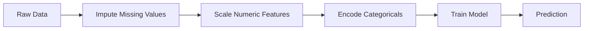
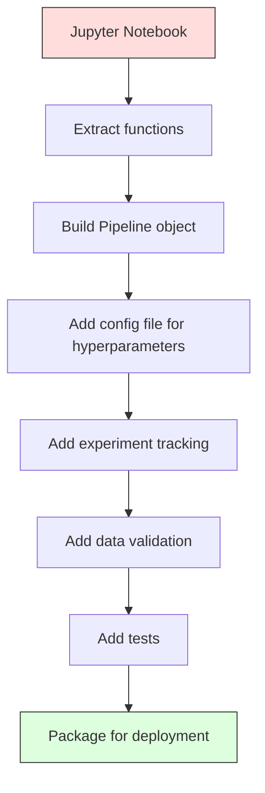

# 机器学习流水线

> 模型不是产品,流水线才是。流水线覆盖从原始数据到上线预测的每一步,而每一步都必须可复现。

**类型:** 动手构建
**编程语言:** Python
**前置要求:** 第 2 阶段,第 12 课(超参数调优)
**预计耗时:** 约 120 分钟

## 学习目标

- 从零构建一条机器学习流水线,把缺失值填充、缩放、编码和模型训练串成单一可复现对象
- 识别数据泄漏场景,并解释流水线如何通过"只在训练数据上拟合变换器"来防止泄漏
- 构建 ColumnTransformer,对数值型和分类型特征施加不同的预处理
- 实现流水线序列化,并验证同一条拟合好的流水线在训练和生产中产生完全一致的结果

## 问题

你有一个 notebook:加载数据、用中位数填缺失值、缩放特征、训练模型、打印准确率。能跑,于是你上线了。

一个月后,有人重新训练模型,结果却不一样。中位数是在包含测试集的完整数据上算的(数据泄漏);缩放参数没存下来,推理时用的是另一套统计量;特征工程代码在训练和推理两处复制粘贴,两份拷贝早已分叉;生产环境里某个类别列冒出了编码器从未见过的新取值。

这些都不是假设——它们是机器学习系统在生产环境翻车最常见的原因。流水线把每个变换步骤打包成一个有序、可复现的对象,一次性解决所有这些问题。

## 概念

### 什么是流水线

流水线是一串有序的数据变换,最后接一个模型。每一步以上一步的输出为输入。整条流水线只在训练数据上拟合一次;推理时,用同一条拟合好的流水线变换新数据并产出预测。



流水线保证:
- 变换只在训练数据上拟合(无泄漏)
- 推理时施加完全相同的变换
- 整个对象可以序列化,作为单一产物部署
- 交叉验证按折(fold)分别套用流水线,防止隐蔽的泄漏

### 数据泄漏:隐形杀手

当测试集或未来数据的信息混进训练过程,就发生了数据泄漏。流水线能防住最常见的几种。

**有泄漏(错误):**
```python
X = df.drop("target", axis=1)
y = df["target"]

scaler = StandardScaler()
X_scaled = scaler.fit_transform(X)

X_train, X_test = X_scaled[:800], X_scaled[800:]
y_train, y_test = y[:800], y[800:]
```

缩放器见过了测试数据——均值和标准差里混进了测试样本,准确率估计因此被抬高。

**正确做法:**
```python
X_train, X_test = X[:800], X[800:]

scaler = StandardScaler()
X_train_scaled = scaler.fit_transform(X_train)
X_test_scaled = scaler.transform(X_test)
```

用了流水线,你根本不用操心这个——它会自动处理好。

### sklearn 的 Pipeline

sklearn 的 `Pipeline` 把变换器和估计器串起来,暴露 `.fit()`、`.predict()`、`.score()`,按顺序执行所有步骤。

```python
from sklearn.pipeline import Pipeline
from sklearn.preprocessing import StandardScaler
from sklearn.linear_model import LogisticRegression

pipe = Pipeline([
    ("scaler", StandardScaler()),
    ("model", LogisticRegression()),
])

pipe.fit(X_train, y_train)
predictions = pipe.predict(X_test)
```

调用 `pipe.fit(X_train, y_train)` 时:
1. 缩放器对 X_train 调用 `fit_transform`
2. 模型对缩放后的 X_train 调用 `fit`

调用 `pipe.predict(X_test)` 时:
1. 缩放器对 X_test 调用 `transform`(不是 fit_transform)
2. 模型对缩放后的 X_test 调用 `predict`

拟合阶段,缩放器从头到尾没见过测试数据。这就是流水线的全部意义。

### ColumnTransformer:给不同列配不同流水线

真实数据集既有数值列也有类别列,需要的预处理不同。`ColumnTransformer` 就是干这个的。

```python
from sklearn.compose import ColumnTransformer
from sklearn.preprocessing import StandardScaler, OneHotEncoder
from sklearn.impute import SimpleImputer

numeric_pipe = Pipeline([
    ("impute", SimpleImputer(strategy="median")),
    ("scale", StandardScaler()),
])

categorical_pipe = Pipeline([
    ("impute", SimpleImputer(strategy="most_frequent")),
    ("encode", OneHotEncoder(handle_unknown="ignore")),
])

preprocessor = ColumnTransformer([
    ("num", numeric_pipe, ["age", "income", "score"]),
    ("cat", categorical_pipe, ["city", "gender", "plan"]),
])

full_pipeline = Pipeline([
    ("preprocess", preprocessor),
    ("model", GradientBoostingClassifier()),
])
```

OneHotEncoder 里的 `handle_unknown="ignore"` 对生产环境至关重要:新类别出现时(一个模型从未见过的城市),它会输出全零向量,而不是直接崩溃。

### 实验追踪

流水线让训练可复现,但你还需要跨实验记录发生过什么:用了哪些超参数、哪版数据集、指标是多少、跑的是哪份代码。

**MLflow** 是最常用的开源方案:

```python
import mlflow

with mlflow.start_run():
    mlflow.log_param("max_depth", 5)
    mlflow.log_param("n_estimators", 100)
    mlflow.log_param("learning_rate", 0.1)

    pipe.fit(X_train, y_train)
    accuracy = pipe.score(X_test, y_test)

    mlflow.log_metric("accuracy", accuracy)
    mlflow.sklearn.log_model(pipe, "model")
```

每次运行都会记录参数、指标、产物和完整模型。你可以对比各次运行、复现任何一次实验、部署任意模型版本。

**Weights & Biases(wandb)** 提供同样的功能,还带托管的仪表盘:

```python
import wandb

wandb.init(project="my-pipeline")
wandb.config.update({"max_depth": 5, "n_estimators": 100})

pipe.fit(X_train, y_train)
accuracy = pipe.score(X_test, y_test)

wandb.log({"accuracy": accuracy})
```

### 模型版本管理

有了实验追踪,接着要管理模型版本:哪个模型在生产?哪个在预发?哪个是上周的?

MLflow 的 Model Registry 提供:
- **版本跟踪:** 每个保存的模型都有版本号
- **阶段流转:** "Staging"、"Production"、"Archived"
- **审批工作流:** 模型必须被显式提升才能上生产
- **回滚:** 一键切回之前的版本

### 用 DVC 做数据版本管理

代码用 git 做版本管理,数据也该有版本,但 git 扛不住大文件。DVC(Data Version Control)解决的就是这个问题。

```
dvc init
dvc add data/training.csv
git add data/training.csv.dvc data/.gitignore
git commit -m "Track training data"
dvc push
```

DVC 把真实数据存在远程存储(S3、GCS、Azure),git 里只留一个记录哈希的小 `.dvc` 文件。当你 checkout 某个 git 提交时,`dvc checkout` 会精确还原当时使用的数据。

这意味着每个 git 提交同时钉住了代码和数据——完全可复现。

### 可复现实验

一个可复现的实验需要四样东西:

1. **固定随机种子:** 给 numpy、random 和所用框架(torch、sklearn)都设上种子
2. **钉死依赖:** requirements.txt 或 poetry.lock 写死精确版本
3. **数据有版本:** DVC 或同类工具
4. **配置文件:** 所有超参数放配置里,不硬编码

```python
import numpy as np
import random

def set_seed(seed=42):
    random.seed(seed)
    np.random.seed(seed)
    try:
        import torch
        torch.manual_seed(seed)
        torch.cuda.manual_seed_all(seed)
        torch.backends.cudnn.deterministic = True
    except ImportError:
        pass
```

### 从 Notebook 到生产流水线



典型的演进路径:

1. **Notebook 探索:** 快速实验、可视化、特征点子
2. **抽取函数:** 把预处理、特征工程、评估搬进模块
3. **构建 Pipeline:** 把变换串成 sklearn Pipeline 或自定义类
4. **配置管理:** 所有超参数移入 YAML/JSON 配置
5. **实验追踪:** 接入 MLflow 或 wandb 日志
6. **数据校验:** 训练前检查 schema、分布和缺失值模式
7. **测试:** 变换器的单元测试,整条流水线的集成测试
8. **部署:** 序列化流水线,包一层 API(FastAPI、Flask),容器化

### 常见的流水线错误

| 错误 | 为什么有害 | 修复 |
|---------|-------------|-----|
| 拆分前在完整数据上拟合 | 数据泄漏 | 用 Pipeline 配 cross_val_score |
| 特征工程放在流水线外 | 训练与推理变换不一致 | 所有变换都放进 Pipeline |
| 不处理未知类别 | 生产环境遇到新值就崩 | OneHotEncoder(handle_unknown="ignore") |
| 硬编码列名 | schema 一变就挂 | 列名清单放配置文件 |
| 不做数据校验 | 坏数据悄悄产出错误预测 | 预测前加 schema 检查 |
| 训练/推理不一致(skew) | 模型在生产看到的特征不一样 | 训练和推理共用同一个 Pipeline 对象 |

```figure
f3-pipeline-flow
```

## 动手构建

`code/pipeline.py` 中的代码从零构建了一条完整的机器学习流水线:

### 第 1 步:自定义变换器

```python
class CustomTransformer:
    def __init__(self):
        self.means = None
        self.stds = None

    def fit(self, X):
        self.means = np.mean(X, axis=0)
        self.stds = np.std(X, axis=0)
        self.stds[self.stds == 0] = 1.0
        return self

    def transform(self, X):
        return (X - self.means) / self.stds

    def fit_transform(self, X):
        return self.fit(X).transform(X)
```

### 第 2 步:从零实现 Pipeline

```python
class PipelineFromScratch:
    def __init__(self, steps):
        self.steps = steps

    def fit(self, X, y=None):
        X_current = X.copy()
        for name, step in self.steps[:-1]:
            X_current = step.fit_transform(X_current)
        name, model = self.steps[-1]
        model.fit(X_current, y)
        return self

    def predict(self, X):
        X_current = X.copy()
        for name, step in self.steps[:-1]:
            X_current = step.transform(X_current)
        name, model = self.steps[-1]
        return model.predict(X_current)
```

### 第 3 步:带流水线的交叉验证

代码演示了带流水线的交叉验证如何防止数据泄漏:缩放器在每一折的训练数据上单独拟合。

### 第 4 步:用 sklearn 搭完整生产流水线

一条完整的流水线,包含 `ColumnTransformer`、多条预处理路径和一个模型,用规范的交叉验证训练,并记录实验日志。

## 交付

本课产出:
- `outputs/prompt-ml-pipeline.md` —— 一个构建与调试机器学习流水线的技能文档
- `code/pipeline.py` —— 从零实现到 sklearn 的完整流水线

## 练习

1. 构建一条流水线,处理一个含 3 个数值列和 2 个类别列的数据集。用 `ColumnTransformer` 对数值列做中位数填充 + 缩放,对类别列做众数填充 + one-hot 编码。用 5 折交叉验证训练。

2. 故意引入数据泄漏:拆分前在完整数据集上拟合缩放器。对比(有泄漏的)交叉验证分数与(干净的)流水线交叉验证分数。差距有多大?

3. 用 `joblib.dump` 序列化你的流水线,在另一个脚本里加载并运行预测,验证预测结果完全一致。

4. 给流水线加一个自定义变换器,为最重要的两个数值列生成二次多项式特征。它应该放在流水线的哪个位置?

5. 为流水线配置 MLflow 追踪。用不同超参数跑 5 组实验,通过 MLflow UI(`mlflow ui`)对比各次运行,选出最佳模型。

## 关键术语

| 术语 | 人们常说的 | 实际含义 |
|------|----------------|----------------------|
| 流水线 | "一串变换加模型" | 一串有序拟合的变换器加一个模型,作为一个整体应用,防止泄漏 |
| 数据泄漏 | "测试信息漏进训练" | 用训练集之外的信息构建模型,导致性能估计虚高 |
| ColumnTransformer | "每列不同预处理" | 对不同的列子集施加不同的流水线,再合并结果 |
| 实验追踪 | "记录每次运行" | 为每次训练运行记录参数、指标、产物和代码版本 |
| MLflow | "追踪和部署模型" | 开源平台,提供实验追踪、模型注册和部署 |
| DVC | "数据界的 Git" | 面向大型数据文件的版本控制系统,git 里存哈希,数据存远程 |
| 模型注册表 | "模型版本目录" | 跟踪模型版本并打上阶段标签(staging、production、archived)的系统 |
| 训练/推理不一致 | "notebook 里明明好的" | 训练与推理时数据处理方式不一致,导致静默出错 |
| 可复现性 | "同代码,同结果" | 用相同的代码、数据和配置,能得到完全一致的结果 |

## 延伸阅读

- [scikit-learn Pipeline 文档](https://scikit-learn.org/stable/modules/compose.html) —— 官方流水线参考
- [MLflow 文档](https://mlflow.org/docs/latest/index.html) —— 实验追踪与模型注册
- [DVC 文档](https://dvc.org/doc) —— 数据版本管理
- [Sculley 等,《机器学习系统中隐藏的技术债》(2015)](https://papers.nips.cc/paper/2015/hash/86df7dcfd896fcaf2674f757a2463eba-Abstract.html) —— 机器学习系统复杂性的奠基论文
- [Google 机器学习最佳实践:Rules of ML](https://developers.google.com/machine-learning/guides/rules-of-ml) —— 实用的生产环境机器学习建议
