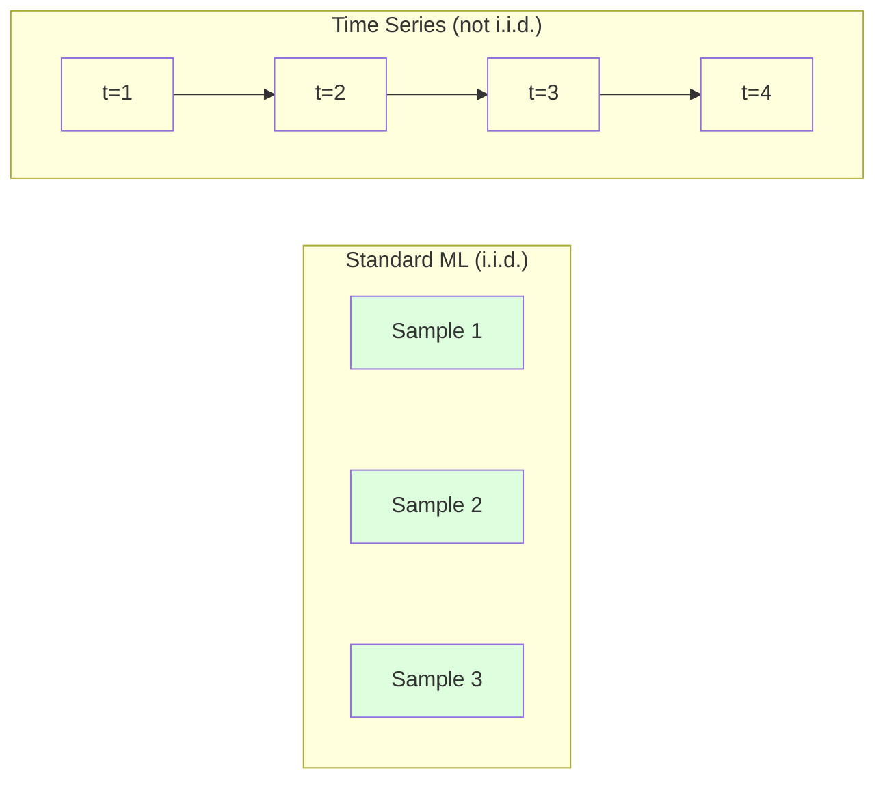
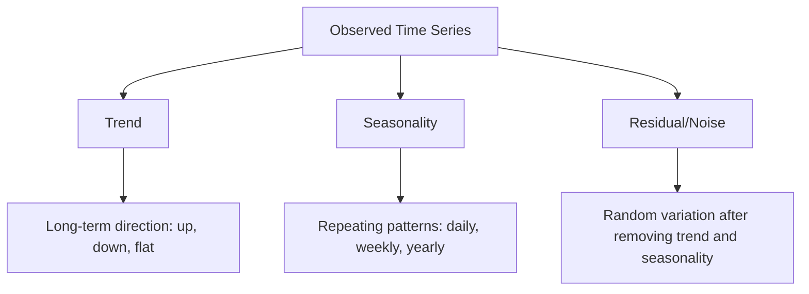
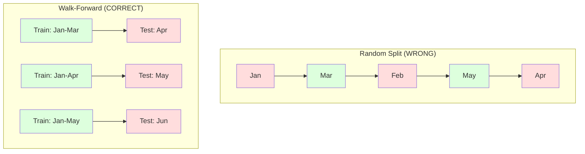

# 时间序列基础

> 历史业绩确实能预测未来表现——前提是你先检查平稳性。

**类型:** 动手构建
**编程语言:** Python
**前置要求:** 第 2 阶段,第 01–09 课
**预计耗时:** 约 90 分钟

## 学习目标

- 把时间序列分解为趋势、季节性和残差三部分,并检验平稳性
- 实现滞后特征(lag features)和滚动统计量,把时间序列转成监督学习问题
- 构建前向滚动(walk-forward)验证框架,防止未来数据泄漏进训练
- 解释为什么随机划分训练/测试集对时间序列无效,并演示它与规范时间划分的性能差距

## 问题

你手上的数据按时间排列:每日销售额、每小时气温、每分钟 CPU 占用、每周股价。你想预测下一个值、下一周、下一季度。

你伸手去拿标准机器学习工具箱:随机划分训练/测试集、交叉验证、特征矩阵进、预测出。每一步都是错的。

时间序列打破了标准机器学习依赖的假设:样本不独立——今天的气温依赖昨天的;随机划分把未来信息泄漏进过去;回测里表现亮眼的特征上了生产就失效,因为它们依赖的模式会随时间漂移。

一个模型用随机交叉验证能拿 95% 准确率,用规范的时间评估可能只剩 55%。这个差距不是细节问题——它是"纸面上能用的模型"和"生产上能用的模型"之间的差距。

本课讲基础:时间数据为何不同、如何诚实地评估模型、如何把时间序列变成标准机器学习模型能消化的特征。

## 概念

### 时间序列有何不同

标准机器学习假设 i.i.d.——独立同分布:每个样本独立地从同一分布中抽取。时间序列两条都违反:

- **不独立。** 今天的股价依赖昨天的,本周的销量与上周相关。
- **不同分布。** 分布随时间漂移,12 月的销售和 3 月的销售长得不一样。

这些违反不是小事。它们改变了你构造特征的方式、评估模型的方式,以及哪些算法管用。



在标准机器学习里,样本可以互换,打乱顺序毫无影响。在时间序列里,顺序就是一切——打乱就毁了信号。

### 时间序列的成分

每条时间序列都是以下几部分的组合:



- **趋势(Trend):** 长期方向。营收每年增长 10%,全球气温上升。
- **季节性(Seasonality):** 以固定间隔重复的模式。零售额每年 12 月飙升,空调用量 7 月见顶。
- **残差(Residual):** 去掉趋势和季节性后剩下的部分。残差若像白噪声,说明分解抓住了信号。

### 平稳性

如果时间序列的统计性质(均值、方差、自相关)不随时间变化,它就是平稳的。大多数预测方法都假设平稳。

**为什么重要:** 非平稳序列的均值会漂移。用 1 月数据训出的模型学到的是一个均值,2 月的数据却是另一个——它会系统性地出错。

**怎么检查:** 在滑动窗口上计算滚动均值和滚动标准差。若它们漂移,序列非平稳。

**怎么修:** 差分(differencing)。不建模原始值,改为建模相邻值之间的变化:

```
diff[t] = value[t] - value[t-1]
```

一轮差分不够平稳,就再来一轮(二阶差分)。真实世界的序列最多需要两轮。

**例子:**

原始序列:[100, 102, 106, 112, 120]
一阶差分:[2, 4, 6, 8](仍在向上走)
二阶差分:[2, 2, 2](常数——平稳了)

原序列带二次趋势,一阶差分把它变成线性趋势,二阶差分把它拉平。实践中你很少需要两轮以上。

**正式检验:** 增广迪基-富勒(ADF)检验是标准的平稳性统计检验,原假设是"序列非平稳",p 值小于 0.05 即可拒绝原假设、判定平稳。我们不从零实现 ADF(它需要渐近分布表),但代码里的滚动统计方法给出了实用的可视化检查。

### 自相关

自相关衡量 t 时刻的值与 t-k 时刻(k 步之前)的值相关多少。自相关函数(ACF)把每个滞后 k 的相关性画出来。

**ACF 告诉你:**
- 序列的记忆有多长。若 ACF 在滞后 5 之后归零,5 步之前的值就无关紧要。
- 是否存在季节性。若 ACF 在滞后 12 处突刺(月度数据),说明有年度季节性。
- 该造多少个滞后特征。滞后数取到 ACF 可以忽略的位置即可。

**PACF(偏自相关函数)** 剔除间接相关。如果今天与 3 天前的相关,仅仅是因为两者都与昨天相关,那么滞后 3 处的 PACF 为零而 ACF 不为零。

### 滞后特征:把时间序列变成监督学习

标准机器学习模型需要特征矩阵 X 和目标 y,时间序列只给你一列值。两者之间的桥梁就是滞后特征。

取序列 [10, 12, 14, 13, 15],造 lag-1 和 lag-2 特征:

| lag_2 | lag_1 | target |
|-------|-------|--------|
| 10    | 12    | 14     |
| 12    | 14    | 13     |
| 14    | 13    | 15     |

现在它是一个标准的回归问题。任何机器学习模型(线性回归、随机森林、梯度提升)都能从滞后值预测目标。

还可以工程化这些特征:
- **滚动统计量:** 最近 k 个值的均值、标准差、最小值、最大值
- **日历特征:** 星期几、月份、是否节假日、是否周末
- **差分值:** 相对上一步的变化
- **扩展统计量:** 累积均值、累积和
- **比率特征:** 当前值 / 滚动均值(离近期均值有多远)
- **交互特征:** lag_1 × 星期几( weekday 对动量的影响)

**用多少个滞后?** 看自相关函数。ACF 到滞后 10 都显著,就至少用 10 个;有周季节性,就包含滞后 7(可能还有 14)。滞后越多,模型可用的历史越长,但要拟合的特征也越多,过拟合风险越大。

**目标对齐陷阱。** 造滞后特征时,目标必须是 t 时刻的值,所有特征必须用 t-1 或更早时刻的值。如果不小心把 t 时刻的值也放进了特征,你就得到了一个完美的预测器——和一个完全没用的模型。这是时间序列特征工程中最常见的 bug。

### 前向滚动验证

这是本课最重要的概念。标准 k 折交叉验证随机把样本分进训练集和测试集——对时间序列,这会泄漏未来信息。



前向滚动验证:
1. 用 t 时刻之前的数据训练
2. 预测 t+1 时刻(多步预测则是 t+1 到 t+k)
3. 窗口向前滑动
4. 重复

每个测试折都只包含在所有训练数据之后的数据,没有未来泄漏。这样得到的是模型部署后真实表现的诚实估计。

**扩展窗口(expanding window)** 用全部历史数据训练(窗口不断变大);**滑动窗口(sliding window)** 用固定大小的训练窗口(窗口向前滑)。认为旧数据仍然相关时用扩展窗口;世界在变、旧数据帮倒忙时用滑动窗口。

### ARIMA 直觉

ARIMA 是经典的时间序列模型,有三个成分:

- **AR(自回归):** 用过去的值做预测。AR(p) 用最近 p 个值。
- **I(差分整合):** 通过差分实现平稳。I(d) 表示做 d 轮差分。
- **MA(移动平均):** 用过去的预测误差做预测。MA(q) 用最近 q 个误差。

ARIMA(p, d, q) 把三者合起来。p、d、q 的选取基于 ACF/PACF 分析或自动搜索(auto-ARIMA)。

我们不从零实现 ARIMA——它需要的数值优化超出本课范围。关键是理解每个成分在做什么,这样你能读懂 ARIMA 的结果、知道什么时候该用它。

### 什么情况用什么

| 方法 | 最适合 | 处理季节性 | 处理外部特征 |
|----------|---------|-------------------|------------------------|
| 滞后特征 + ML | 带大量外部特征的表格问题 | 靠日历特征 | 能 |
| ARIMA | 单变量序列、短期预测 | 用 SARIMA 变体 | 不能(ARIMAX 有限支持) |
| 指数平滑 | 简单趋势 + 季节性 | 能(Holt-Winters) | 不能 |
| Prophet | 业务预测、节假日 | 能(Fourier 项) | 有限 |
| 神经网络(LSTM、Transformer) | 长序列、多条序列 | 自动学到 | 能 |

对大多数实际问题,"滞后特征 + 梯度提升"是最强的起点:天然支持外部特征、不要求平稳、容易调试。

### 预测时域与策略

单步预测只看未来一个时间步,多步预测要看多个。有三种策略:

**递归式(迭代):** 预测一步,把预测值当作下一步的输入。简单,但误差会累积——每个预测都建立在上一个预测之上,错误会复合。

**直接式:** 每个时域单训一个模型。Model-1 预测 t+1,Model-5 预测 t+5。不累积误差,但每个模型的训练样本更少,且互不共享信息。

**多输出式:** 训一个模型同时输出所有时域。跨时域共享信息,但需要支持多输出的模型(或自定义损失函数)。

实践中的起点:短时域(1–5 步)用递归式,长时域用直接式。

### 时间序列常见错误

| 错误 | 为什么会犯 | 怎么修 |
|---------|---------------|-----------|
| 随机划分训练/测试集 | 标准 ML 的习惯 | 用前向滚动或时间顺序划分 |
| 用了未来特征 | 误把 t 时刻的特征放了进去 | 逐个审计特征的时间对齐 |
| 过拟合季节性 | 模型背下了日历模式 | 测试集留出一个完整季节周期 |
| 忽视量级变化 | 营收翻倍但模式照旧 | 建模百分比变化而非绝对值 |
| 滞后特征太多 | "历史越长越好" | 用 ACF 确定相关滞后数 |
| 不做差分 | "模型自己会搞定" | 树模型能处理趋势,线性模型需要平稳 |

```figure
f3-series-decompose
```

## 动手构建

`code/time_series.py` 中的代码从零实现了核心构件。

### 滞后特征生成器

```python
def make_lag_features(series, n_lags):
    n = len(series)
    X = np.full((n, n_lags), np.nan)
    for lag in range(1, n_lags + 1):
        X[lag:, lag - 1] = series[:-lag]
    valid = ~np.isnan(X).any(axis=1)
    return X[valid], series[valid]
```

它把一维序列转成特征矩阵:每行用最近 `n_lags` 个值作特征,当前值作目标。

### 前向滚动交叉验证

```python
def walk_forward_split(n_samples, n_splits=5, min_train=50):
    assert min_train < n_samples, "min_train must be less than n_samples"
    step = max(1, (n_samples - min_train) // n_splits)
    for i in range(n_splits):
        train_end = min_train + i * step
        test_end = min(train_end + step, n_samples)
        if train_end >= n_samples:
            break
        yield slice(0, train_end), slice(train_end, test_end)
```

每个划分都保证训练数据严格早于测试数据,训练窗口逐折扩大。

### 简单自回归模型

纯 AR 模型就是在滞后特征上做线性回归:

```python
class SimpleAR:
    def __init__(self, n_lags=5):
        self.n_lags = n_lags
        self.weights = None
        self.bias = None

    def fit(self, series):
        X, y = make_lag_features(series, self.n_lags)
        # Solve via normal equations
        X_b = np.column_stack([np.ones(len(X)), X])
        theta = np.linalg.lstsq(X_b, y, rcond=None)[0]
        self.bias = theta[0]
        self.weights = theta[1:]
        return self
```

概念上与第 02 课的线性回归完全相同,只是作用在同一变量的时间滞后版本上。

### 平稳性检查

代码计算滚动统计量,从可视化和数值两方面评估平稳性:

```python
def check_stationarity(series, window=50):
    rolling_mean = np.array([
        series[max(0, i - window):i].mean()
        for i in range(1, len(series) + 1)
    ])
    rolling_std = np.array([
        series[max(0, i - window):i].std()
        for i in range(1, len(series) + 1)
    ])
    return rolling_mean, rolling_std
```

滚动均值漂移或滚动标准差变化,说明序列非平稳——做差分,再查一遍。

代码还通过比较序列前半段与后半段来检查平稳性:均值相差超过半个标准差,或方差比超过 2 倍,就标记为非平稳。

### 自相关

```python
def autocorrelation(series, max_lag=20):
    n = len(series)
    mean = series.mean()
    var = series.var()
    acf = np.zeros(max_lag + 1)
    for k in range(max_lag + 1):
        cov = np.mean((series[:n-k] - mean) * (series[k:] - mean))
        acf[k] = cov / var if var > 0 else 0
    return acf
```

## 投入使用

用 sklearn,滞后特征可以直接接任何回归器:

```python
from sklearn.linear_model import Ridge
from sklearn.ensemble import GradientBoostingRegressor

X, y = make_lag_features(series, n_lags=10)

for train_idx, test_idx in walk_forward_split(len(X)):
    model = Ridge(alpha=1.0)
    model.fit(X[train_idx], y[train_idx])
    predictions = model.predict(X[test_idx])
```

ARIMA 用 statsmodels:

```python
from statsmodels.tsa.arima.model import ARIMA

model = ARIMA(train_series, order=(5, 1, 2))
fitted = model.fit()
forecast = fitted.forecast(steps=30)
```

`time_series.py` 中的代码演示了两种方法,并用前向滚动验证做了对比。

### sklearn 的 TimeSeriesSplit

sklearn 提供的 `TimeSeriesSplit` 就是前向滚动验证的实现:

```python
from sklearn.model_selection import TimeSeriesSplit

tscv = TimeSeriesSplit(n_splits=5)
for train_index, test_index in tscv.split(X):
    X_train, X_test = X[train_index], X[test_index]
    y_train, y_test = y[train_index], y[test_index]
    model.fit(X_train, y_train)
    score = model.score(X_test, y_test)
```

它等价于我们从零写的 `walk_forward_split`,但集成在 sklearn 的交叉验证框架里,可以配合 `cross_val_score` 使用:

```python
from sklearn.model_selection import cross_val_score

scores = cross_val_score(model, X, y, cv=TimeSeriesSplit(n_splits=5))
print(f"Mean score: {scores.mean():.4f} +/- {scores.std():.4f}")
```

### 评估指标

时间序列预测用回归指标,但要带上时间意识:

- **MAE(平均绝对误差):** |y_true - y_pred| 的平均。用原始单位,好解释:"预测平均偏差 3.2 度。"
- **RMSE(均方根误差):** 均方误差的平方根。比 MAE 更惩罚大误差——大错误比许多小错误更糟时用它。
- **MAPE(平均绝对百分比误差):** |误差 / 真实值| × 100 的平均。与量纲无关,适合跨序列比较。但真实值为零时无定义。
- **朴素基线对比:** 永远要和简单基线比。季节朴素基线直接预测上一个周期的值(昨天、上周同一天)。你的模型连朴素基线都打不过,就说明出了问题。

### 滚动特征

代码演示了在滞后特征之上加入滚动统计量(7 天和 14 天窗口的均值、标准差、最小值、最大值)。它们给模型提供近期趋势和波动率的信息——光靠滞后特征抓不住这些。

比如,滚动均值在涨,提示上行趋势;滚动标准差在变大,提示波动加剧。这类模式,树模型学得到,线性模型学不到。

## 交付

本课产出:
- `outputs/prompt-time-series-advisor.md` —— 一个用于界定时间序列问题的提示词
- `code/time_series.py` —— 滞后特征、前向滚动验证、AR 模型、平稳性检查

### 必须打败的基线

建模之前,先立好基线:

1. **上一值(持续性)。** 预测明天等于今天。对很多序列,这意外地难被超越。
2. **季节朴素。** 预测今天等于上周同一天(或去年同一天)。连这都打不过,说明模型除了季节性什么也没学到。
3. **移动平均。** 预测最近 k 个值的均值。能平滑噪声,但抓不住突变。

如果你的高级 ML 模型输给季节朴素基线,那是有 bug 了。最常见的原因是:特征里混入了未来泄漏、评估方法不对,或者这个序列本来就是随机不可预测的。

### 实战建议

1. **先画图。** 建模之前先把原始序列画出来,找趋势、季节性、离群点、结构性突变(行为突然改变)。30 秒的肉眼检查,常常比一小时的自动化分析告诉你更多。

2. **先差分,再建模。** 序列有明显趋势,就在造滞后特征之前先差分。树模型能处理趋势,线性模型不行,而差分永远没坏处。

3. **至少留出一个完整季节周期做测试。** 有周季节性,测试集至少要一整个星期;月季节性,至少一整个月。否则你无法评估模型是否抓住了季节模式。

4. **生产中持续监控。** 世界在变,时间序列模型会退化。滚动跟踪预测误差,误差开始上升时,用近期数据重训模型。

5. **警惕 regime 切换。** 用疫情前数据训出的模型预测不了疫情后的行为。把已知 regime 切换的指示变量做成特征,或者用会遗忘旧数据的滑动窗口。

6. **右偏序列取对数。** 营收、价格、计数常常右偏。取对数能稳定方差,把乘法模式变加法,线性模型就能处理了。在对数空间预测,再取指数换回原始单位。

## 练习

1. **平稳性实验。** 生成一个带线性趋势的序列,用滚动统计量检查平稳性,做一阶差分,再查。二次趋势需要几轮差分?

2. **滞后选择。** 在季节性序列(周期 = 7)上计算 ACF。哪些滞后的自相关最高?只用这些滞后(而非连续滞后)造特征,与用滞后 1–7 相比,准确率提升了吗?

3. **前向滚动 vs 随机划分。** 在滞后特征上训练 Ridge 回归,分别用随机 80/20 划分和前向滚动验证评估。随机划分把性能高估了多少?

4. **特征工程。** 在滞后特征上加滚动均值(窗口 7)、滚动标准差(窗口 7)和星期几特征。用前向滚动验证,对比有无这些额外特征的准确率。

5. **多步预测。** 改造 AR 模型,从预测 1 步改为预测 5 步。对比两种策略:(a) 预测一步、把预测值作为下一步输入(递归式),(b) 每个时域单训一个模型(直接式)。哪个更准?

## 关键术语

| 术语 | 人们常说的 | 实际含义 |
|------|----------------|----------------------|
| 平稳性 | "统计量不随时间变" | 均值、方差和自相关结构都不随时间变化的序列 |
| 差分 | "相邻值相减" | 计算 y[t] - y[t-1],去除趋势、实现平稳 |
| 自相关(ACF) | "序列和自己有多相关" | 时间序列与其滞后副本之间的相关性,随滞后天数变化的函数 |
| 偏自相关(PACF) | "只要直接相关" | 剔除所有更短滞后的影响之后,滞后 k 处的自相关 |
| 滞后特征 | "拿过去当输入" | 用 y[t-1]、y[t-2]、…、y[t-k] 作特征来预测 y[t] |
| 前向滚动验证 | "尊重时间的交叉验证" | 训练数据在时间上永远早于测试数据的评估方式 |
| ARIMA | "经典时间序列模型" | 自回归差分移动平均:组合过去值(AR)、差分(I)和过去误差(MA) |
| 季节性 | "重复的日历模式" | 时间序列中与日历周期(日、周、年)绑定的规律、可预测的循环 |
| 趋势 | "长期方向" | 序列水平随时间的持续上升或下降 |
| 扩展窗口 | "用上全部历史" | 训练集逐折增大的前向滚动验证 |
| 滑动窗口 | "固定长度历史" | 训练集为固定长度、向前滑动的前向滚动验证 |

## 延伸阅读

- [Hyndman 与 Athanasopoulos,《预测:原理与实践》(第 3 版)](https://otexts.com/fpp3/) —— 最好的时间序列预测免费教材
- [scikit-learn TimeSeriesSplit 文档](https://scikit-learn.org/stable/modules/generated/sklearn.model_selection.TimeSeriesSplit.html) —— sklearn 的前向滚动划分器
- [statsmodels ARIMA 文档](https://www.statsmodels.org/stable/generated/statsmodels.tsa.arima.model.ARIMA.html) —— 带诊断的 ARIMA 实现
- [Makridakis 等,M5 竞赛(2022)](https://www.sciencedirect.com/science/article/pii/S0169207021001874) —— 大规模预测竞赛,对比 ML 方法与统计方法
