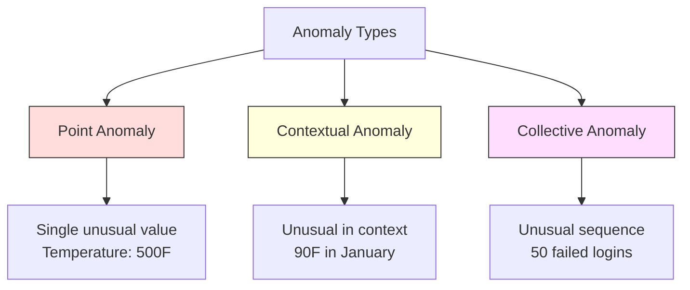
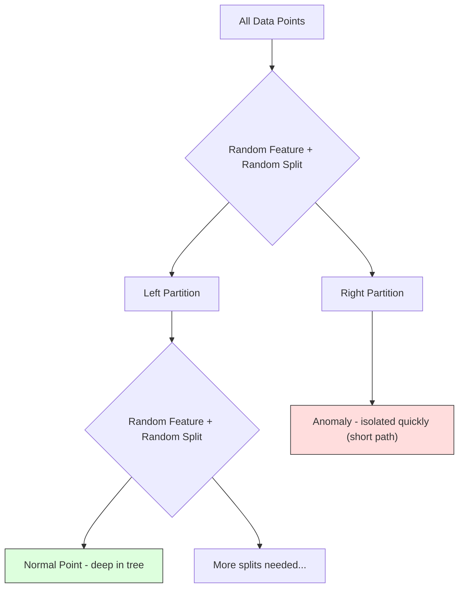
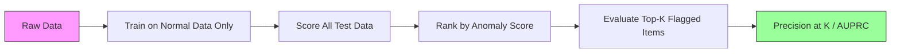

# 异常检测

> 定义"正常"很容易,"异常"就是所有不合群的东西。

**类型:** 动手构建
**编程语言:** Python
**前置要求:** 第 2 阶段,第 01–09 课
**预计耗时:** 约 75 分钟

## 学习目标

- 从零实现 Z-score、IQR 和孤立森林(Isolation Forest)异常检测方法
- 区分点异常、上下文异常和集合异常,并为每种选择合适的检测方法
- 解释为什么异常检测的框架是"建模正常数据",而不是"分类异常"
- 对比无监督异常检测与有监督分类,权衡新型异常覆盖率与精确率之间的取舍

## 问题

一张信用卡下午 2 点在纽约刷卡,2:05 又在东京刷了一笔;工厂传感器读数 150 度,而正常范围是 80–120;一台服务器每秒发出 5 万个请求,而日均值是 200。

这些都是异常,而发现异常很重要:欺诈造成数以十亿计的损失,设备故障造成停机,网络入侵造成数据泄漏。

难就难在:你很少有带标注的异常样本。欺诈只占交易的 0.1%,设备故障一年才几次。标准分类器没法训——"异常"类里几乎没什么可学的。就算有一些标注,你见过的异常也不是你会遇到的全部类型:明天的欺诈手法和今天的不一样。

异常检测把问题翻了过来:不学习"什么是异常",而是学习"什么是正常"。任何偏离正常的东西都可疑。这条路不需要标注,能适应新型异常,还能扩展到海量数据。

## 概念

### 异常的类型

异常并不都一样:

- **点异常。** 单个数据点,放到任何上下文里都反常。500 度的温度读数;一个平时只花 50 美元的账户突然交易 5 万美元。
- **上下文异常。** 在特定上下文中才反常的数据点。90 华氏度在夏天正常,在冬天就是异常。值相同,上下文不同。
- **集合异常。** 一串数据点作为整体反常,尽管每个单点可能都正常。连续 5 次登录失败很正常,连续 50 次就是暴力破解攻击。

大多数方法检测的是点异常。上下文异常需要时间或位置特征,集合异常需要感知序列的方法。



### 无监督框架

标准分类里,两个类别都有标注。异常检测里,你通常处于三种情形之一:

1. **完全无监督。** 没有任何标注。在全部数据上拟合检测器,祈祷异常足够少,不至于污染"正常"模型。
2. **半监督。** 手上有一份只有正常数据的干净数据集,在这份干净数据上拟合,给其他一切打分。条件许可时这是最强的设定。
3. **弱监督。** 有少量带标注的异常。拿来做评估,不做训练:无监督训练,然后在标注子集上测精确率/召回率。

关键认识:异常检测和分类本质上是两件事——你建模的是正常数据的分布,而不是两个类别之间的决策边界。

### 有监督 vs 无监督:权衡

如果你确实有带标注的异常,该拿它们训练(有监督分类)还是只做评估(无监督检测)?

**有监督(当分类问题做):**
- 能抓住你见过的那些异常类型
- 已知异常类型上精确率更高
- 对全新类型的异常完全漏检
- 新型异常出现时需要重训
- 需要足够多的异常样本(往往不够)

**无监督(建模正常,标记偏离):**
- 能抓住任何偏离正常的东西,包括全新类型
- 不需要标注异常
- 误报率更高(不寻常不等于有害)
- 对分布漂移更鲁棒

实践中,最好的系统是两者结合:无监督检测负责广覆盖,有监督模型盯已知的高优先级异常类型,拿不准的交给人审。

### Z-score 方法

最简单的方法:算每个特征的均值和标准差,任何离均值超过 k 个标准差的点就标记。

```text
z_score = (x - mean) / std
anomaly if |z_score| > threshold
```

默认阈值 3.0(对高斯分布,99.7% 的正常数据落在 3 个标准差之内)。

**优点:** 简单、快、可解释("这个值偏离正常 4.5 个标准差")。

**缺点:** 假设数据正态分布;对训练数据中的离群点敏感(离群点会拉动均值、吹大标准差,让自己更难被查出来);多峰分布上失效。

**适用:** 单特征监控、数据大致呈钟形。服务器响应时间、制造公差、基线稳定的传感器读数。

**失效:** 多簇数据(两个办公地点基线温度不同)、偏斜数据(交易额里 1000 美元少见但不算异常)、训练集里已有离群点。

### IQR 方法

比 Z-score 更鲁棒,用四分位距代替均值和标准差。

```
Q1 = 25th percentile
Q3 = 75th percentile
IQR = Q3 - Q1
lower_bound = Q1 - factor * IQR
upper_bound = Q3 + factor * IQR
anomaly if x < lower_bound or x > upper_bound
```

默认系数 1.5。

**优点:** 对离群点鲁棒(百分位数不受极端值影响);适用于偏斜分布;不需要正态假设。

**缺点:** 只能单变量用(每个特征独立判断);检测不到"只有联合看才异常"的点(一个点每个特征单独看都正常,联合空间里却是异常)。

**实践提示:** IQR 的 1.5 系数对应箱线图的须线,须线之外的点是潜在离群点。用 3.0 代替 1.5 会让检测器更保守(标记更少、误报更少)。系数取多少,取决于你对误报的容忍度。

### 孤立森林

核心洞察:异常既少又不同。在对数据的随机划分中,异常更容易被孤立——把它们从其余数据里切出来,需要的随机分裂更少。



**工作原理:**
1. 构建许多随机树(一片孤立森林)
2. 每个节点随机选一个特征,在该特征的最小最大值之间随机取一个分裂值
3. 不断分裂,直到每个点都被孤立(独占一个叶子)
4. 异常点在所有树上的平均路径长度更短

**为什么有效:** 正常点住在稠密区域,要很多次随机分裂才能把它和邻居分开;异常点住在稀疏区域,一两次随机分裂就足以孤立它。

异常分数基于所有树上的平均路径长度,并用随机二叉搜索树的期望路径长度归一化:

```
score(x) = 2^(-average_path_length(x) / c(n))
```

其中 `c(n)` 是 n 个样本的期望路径长度。分数接近 1 是异常,接近 0.5 是正常,接近 0 是非常正常(深藏于稠密簇中)。

**优点:** 无分布假设;高维可用;扩展性好(每棵树只用子样本,对样本量次线性);能处理混合特征类型。

**缺点:** 对藏在稠密区域的异常力不从心(掩蔽效应);无关特征多时,随机分裂效果打折。

**关键超参数:**
- `n_estimators`:树的数量。100 通常够用。树越多分数越稳,但越慢。
- `max_samples`:每棵树的样本数,原论文默认 256。更小的值让单棵树不那么准,但增加多样性。子采样正是孤立森林快的原因——每棵树只见数据的一小部分。
- `contamination`:预期的异常占比,只用于设定阈值,不影响分数本身。

### 局部离群因子(LOF)

LOF 把一个点周围的局部密度与它邻居周围的密度比较。一个身处稀疏区域、四周却是稠密区域的点,就是异常。

**工作原理:**
1. 对每个点,找它的 k 个最近邻
2. 计算局部可达密度(邻域有多稠密)
3. 把每个点的密度与其邻居的密度比较
4. 密度远低于邻居的点,就是离群点

**LOF 分数:**
- 接近 1.0:与邻居密度相近(正常)
- 大于 1.0:密度低于邻居(可能异常)
- 远大于 1.0(如 2.0+):密度显著更低(很可能是异常)

"局部"二字是关键。设想数据集有两个簇:一个 1000 点的稠密簇,一个 50 点的稀疏簇。稀疏簇边缘的点在全局看并不反常——它有 50 个邻居;但若它的近邻密度都比它高,它在局部就是反常的。LOF 能捕捉到全局方法漏掉的这种细微差别。

**优点:** 能检测局部异常(在邻域内反常、全局看未必反常的点);适用于密度不同的簇。

**缺点:** 大数据集上慢(朴素实现 O(n²));对 k 的选择敏感;很高维时效果不好(距离计算受维度灾难影响)。

### 对比

| 方法 | 假设 | 速度 | 高维表现 | 检测局部异常 |
|--------|------------|-------|-------------------|------------------------|
| Z-score | 正态分布 | 极快 | 好(逐特征) | 不能 |
| IQR | 无(逐特征) | 极快 | 好(逐特征) | 不能 |
| 孤立森林 | 无 | 快 | 好 | 部分可以 |
| LOF | 距离须有意义 | 慢 | 差 | 能 |

### 评估的难点

评估异常检测器比评估分类器更难:

- **极端类别不平衡。** 异常占 0.1% 时,全部预测"正常"也有 99.9% 准确率。准确率毫无用处。
- **AUROC 有误导性。** 重度不平衡下,即使模型在实用阈值上漏掉大部分异常,AUROC 也可能很好看。
- **更好的指标:** Precision@k(被标记的前 k 个里有多少是真异常)、AUPRC(精确率-召回率曲线下面积),以及固定误报率下的召回率。



### 异常检测流水线

实践中,异常检测遵循这个流程:

1. **收集基线数据。** 最好是一段你确定没有(或极少)异常的时期。
2. **特征工程。** 原始特征加衍生特征(滚动统计、时间特征、比率)。
3. **训练检测器。** 在基线数据上拟合,模型学到"正常"长什么样。
4. **给新数据打分。** 每个新观测得到一个异常分数。
5. **选阈值。** 划定分数界线。这是业务决策:阈值越高,误报越少,漏检越多。
6. **告警与调查。** 被标记的点进入人工审查或自动响应。
7. **收集反馈。** 记录被标记项是真异常还是误报,用这些数据评估检测器、随时间调整阈值。

这条流水线永远没有"完工"的一天:数据分布在漂移,新型异常在出现,阈值需要不断调整。把异常检测当作一个活的系统,而不是一次性的模型。

```figure
f3-anomaly-fence
```

## 动手构建

`code/anomaly_detection.py` 中的代码从零实现了 Z-score、IQR 和孤立森林。

### Z-score 检测器

```python
def zscore_detect(X, threshold=3.0):
    mean = X.mean(axis=0)
    std = X.std(axis=0)
    std[std == 0] = 1.0
    z = np.abs((X - mean) / std)
    return z.max(axis=1) > threshold
```

简单而向量化:任一特征超过阈值即标记该点。

### IQR 检测器

```python
def iqr_detect(X, factor=1.5):
    q1 = np.percentile(X, 25, axis=0)
    q3 = np.percentile(X, 75, axis=0)
    iqr = q3 - q1
    iqr[iqr == 0] = 1.0
    lower = q1 - factor * iqr
    upper = q3 + factor * iqr
    outside = (X < lower) | (X > upper)
    return outside.any(axis=1)
```

### 从零实现孤立森林

从零实现会构建随机划分特征空间的孤立树:

```python
class IsolationTree:
    def __init__(self, max_depth):
        self.max_depth = max_depth

    def fit(self, X, depth=0):
        n, p = X.shape
        if depth >= self.max_depth or n <= 1:
            self.is_leaf = True
            self.size = n
            return self
        self.is_leaf = False
        self.feature = np.random.randint(p)
        x_min = X[:, self.feature].min()
        x_max = X[:, self.feature].max()
        if x_min == x_max:
            self.is_leaf = True
            self.size = n
            return self
        self.threshold = np.random.uniform(x_min, x_max)
        left_mask = X[:, self.feature] < self.threshold
        self.left = IsolationTree(self.max_depth).fit(X[left_mask], depth + 1)
        self.right = IsolationTree(self.max_depth).fit(X[~left_mask], depth + 1)
        return self
```

孤立一个点所需的路径长度决定其异常分数:路径越短,越异常。

`IsolationForest` 类把多棵树包起来:

```python
class IsolationForest:
    def __init__(self, n_estimators=100, max_samples=256, seed=42):
        self.n_estimators = n_estimators
        self.max_samples = max_samples

    def fit(self, X):
        sample_size = min(self.max_samples, X.shape[0])
        max_depth = int(np.ceil(np.log2(sample_size)))
        for _ in range(self.n_estimators):
            idx = rng.choice(X.shape[0], size=sample_size, replace=False)
            tree = IsolationTree(max_depth=max_depth)
            tree.fit(X[idx])
            self.trees.append(tree)

    def anomaly_score(self, X):
        avg_path = average path length across all trees
        scores = 2.0 ** (-avg_path / c(max_samples))
        return scores
```

归一化因子 `c(n)` 是 n 个元素的二叉搜索树中一次不成功搜索的期望路径长度,等于 `2 * H(n-1) - 2*(n-1)/n`,其中 `H` 是调和数。这个归一化保证不同规模数据集上的分数可比较。

### 演示场景

代码生成多个测试场景:

1. **单簇带离群点。** 一个二维高斯簇,在远离中心处注入异常。所有方法在这里都应该有效。
2. **多峰数据。** 三个大小、密度各不相同的簇,簇与簇之间的点是异常。Z-score 在这里吃力,因为逐特征的取值范围太宽。
3. **高维数据。** 50 个特征,异常只在其中 5 个上有差异。检验各方法能否在特征子集中发现异常。

每个演示都用精确率、召回率、F1 和 Precision@k 对比所有方法。

## 投入使用

用 sklearn(用库实现,不用从零写):

```python
from sklearn.ensemble import IsolationForest
from sklearn.neighbors import LocalOutlierFactor

iso = IsolationForest(n_estimators=100, contamination=0.05, random_state=42)
iso.fit(X_train)
predictions = iso.predict(X_test)

lof = LocalOutlierFactor(n_neighbors=20, contamination=0.05, novelty=True)
lof.fit(X_train)
predictions = lof.predict(X_test)
```

注意 `contamination` 设的是预期的异常占比。设对它很重要——太低漏检,太高误报。

`anomaly_detection.py` 中的代码在相同数据上对比了从零实现与 sklearn。

### sklearn 的 contamination 参数

sklearn 里的 `contamination` 决定把连续异常分数转成二值预测的阈值,不改变底层分数本身。

```python
iso_5 = IsolationForest(contamination=0.05)
iso_10 = IsolationForest(contamination=0.10)
```

两者产出的异常分数相同,但 `iso_5` 标记前 5%,`iso_10` 标记前 10%。如果你不知道真实的异常率(通常都不知道),把 contamination 设为 "auto",直接用原始分数,再根据误报与漏报的成本权衡自己定阈值。

### One-Class SVM

另一个值得了解的无监督异常检测器。One-Class SVM 在高维特征空间中(借助核技巧)围绕正常数据拟合一个边界。

```python
from sklearn.svm import OneClassSVM

oc_svm = OneClassSVM(kernel="rbf", gamma="auto", nu=0.05)
oc_svm.fit(X_train)
predictions = oc_svm.predict(X_test)
```

`nu` 参数近似异常占比。One-Class SVM 在中小数据集上表现不错,但扩不到非常大的数据(核矩阵随样本数平方增长)。

### 自编码器方法(预告)

自编码器是学习压缩并重建数据的神经网络。在正常数据上训练;测试时,异常的重建误差高——因为网络只学过怎么重建正常模式。

这部分在 第 3 阶段(深度学习)详讲,但原理相同:建模正常,标记偏离。

### 集成式异常检测

正如集成方法提升分类效果(第 11 课),组合多个异常检测器也能提升检测效果。最简单的做法:

1. 跑多个检测器(Z-score、IQR、孤立森林、LOF)
2. 把每个检测器的分数归一化到 [0, 1]
3. 取归一化分数的平均
4. 平均分超过阈值的点即标记

这样能减少误报,因为不同方法有不同的失败模式。被四种方法同时标记的点几乎肯定是异常;只被一种方法标记的,可能只是那种方法的怪癖。

更精细的集成会按各检测器的估计可靠性加权(如果有已知异常的验证集,就在上面测量)。

### 生产环境注意事项

1. **阈值漂移。** 数据分布在变,固定阈值会过时。监控异常分数的分布,定期调整。
2. **告警疲劳。** 误报太多,运维就会视而不见。先用高阈值(告警少但更可靠),信任建立起来再慢慢调低。
3. **集成方法。** 生产环境组合多个检测器,只有多个方法一致认定异常才标记。这能显著降低误报。
4. **特征工程。** 原始特征很少够用。加上滚动统计、比率、距上次事件的时间、领域特定特征。好特征比选哪个检测器更重要。
5. **反馈回路。** 运维调查被标记项并确认或排除后,把结果喂回系统。随时间积累标注数据,用来评估和改进检测器。

## 交付

本课产出:
- `outputs/skill-anomaly-detector.md` —— 一个挑选合适检测器的决策技能文档
- `code/anomaly_detection.py` —— 从零实现的 Z-score、IQR 和孤立森林,附 sklearn 对比

### 如何选阈值

异常分数是连续的,要做二值决策就得有阈值。这是业务决策,不是技术决策。

看两个场景:
- **欺诈检测。** 漏掉欺诈代价高昂(拒付、客户信任),而一次误报只花分析员 5 分钟核查。阈值定低些,多抓欺诈,容忍更多误报。
- **设备维护。** 一次误报意味着一次不必要的停机,成本 5 万美元;一次漏检意味着 50 万美元的大修。按这些成本来平衡阈值。

两种情况下,最优阈值都取决于误报与漏报的成本之比。画出不同阈值下的精确率和召回率,叠上成本函数,取成本最低点。

### 扩展到生产

生产环境的实时异常检测:

1. **批量训练,在线打分。** 定期(每天、每周)在近期正常数据上重训模型,新观测一到就打分。
2. **特征计算必须一致。** 训练时用了 30 天滚动统计,给新观测算特征就需要 30 天历史。把所需历史缓冲起来。
3. **分数分布监控。** 跟踪异常分数随时间的分布。中位数分数向上漂移,要么数据在变,要么模型过时了。
4. **可解释性。** 标记异常时,说明为什么。Z-score:"特征 X 高出正常 4.2 个标准差。"孤立森林:"这个点平均 3.1 次分裂即被孤立(正常点要 8.5 次)。"

## 练习

1. **阈值调优。** 用 1.0 到 5.0、步长 0.5 的阈值跑 Z-score 检测器,画出每个阈值下的精确率和召回率。你的数据上最佳点在哪?

2. **多变量异常。** 构造二维数据:每个特征单独看都正常,但组合起来异常(比如远离主簇对角线的点)。证明逐特征 Z-score 漏掉它们,而孤立森林抓得到。

3. **从零实现 LOF。** 用 k 近邻实现局部离群因子,在相同数据上与 sklearn 的 LocalOutlierFactor 对比。分别用 k=10 和 k=50——k 的选择如何影响结果?

4. **流式异常检测。** 改造 Z-score 检测器以支持流式场景:新点到达时用 Welford 在线算法更新滑动均值和方差。与批量 Z-score 在相同数据上对比。

5. **真实数据评估。** 取一个有已知异常的数据集(比如 Kaggle 的信用卡欺诈数据),用 precision@100、precision@500 和 AUPRC 评估全部四种方法。哪种最好?为什么?

## 关键术语

| 术语 | 人们常说的 | 实际含义 |
|------|----------------|----------------------|
| 异常 | "离群点、不寻常的点" | 显著偏离正常数据预期模式的数据点 |
| 点异常 | "单个怪值" | 无论上下文如何都反常的单个观测 |
| 上下文异常 | "值正常,场合不对" | 在给定上下文(时间、地点等)中反常、换个上下文可能正常的观测 |
| 孤立森林 | "随机分裂找离群点" | 一种随机树集成:孤立异常所需的分裂次数比正常点少 |
| 局部离群因子 | "和邻居比密度" | 标记局部密度远低于邻居密度的点的方法 |
| Z-score | "离均值几个标准差" | (x - mean) / std,以标准差为单位衡量一个点离中心多远 |
| IQR | "四分位距" | Q3 - Q1,衡量中间 50% 数据的离散程度,用于鲁棒的离群点检测 |
| contamination | "预期的异常占比" | 告诉检测器应把多大比例的数据标为异常的超参数 |
| Precision@k | "前 k 个标记里有几个真的" | 只在最可疑的 k 个点上计算的精确率,适合不平衡的异常检测 |
| AUPRC | "精确率-召回率曲线下面积" | 跨所有阈值总结精确率-召回率表现的指标,不平衡数据下优于 AUROC |

## 延伸阅读

- [Liu 等,《Isolation Forest》(2008)](https://cs.nju.edu.cn/zhouzh/zhouzh.files/publication/icdm08b.pdf) —— 孤立森林原始论文
- [Breunig 等,《LOF:识别基于密度的局部离群点》(2000)](https://dl.acm.org/doi/10.1145/342009.335388) —— LOF 原始论文
- [scikit-learn 离群点检测文档](https://scikit-learn.org/stable/modules/outlier_detection.html) —— sklearn 全部异常检测器概览
- [Chandola 等,《异常检测综述》(2009)](https://dl.acm.org/doi/10.1145/1541880.1541882) —— 异常检测方法的全面综述
- [Goldstein 与 Uchida,《无监督异常检测算法的比较评估》(2016)](https://journals.plos.org/plosone/article?id=10.1371/journal.pone.0152173) —— 10 种方法在真实数据集上的实证对比
