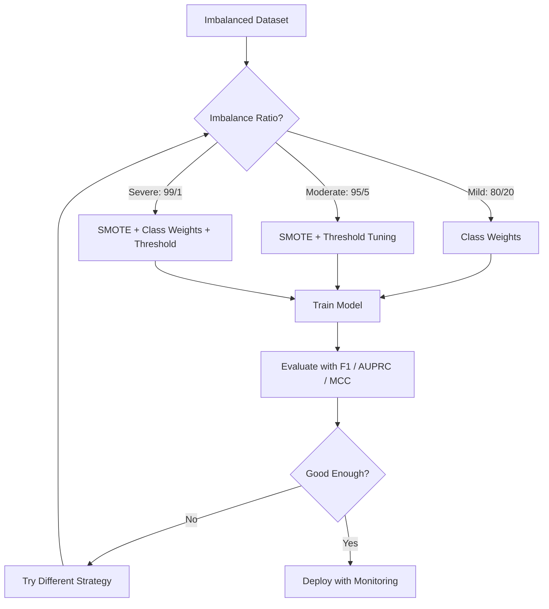
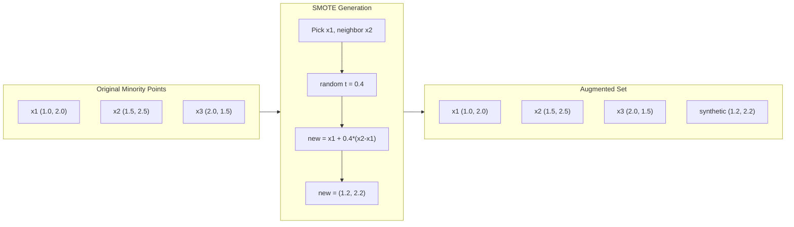
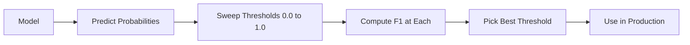
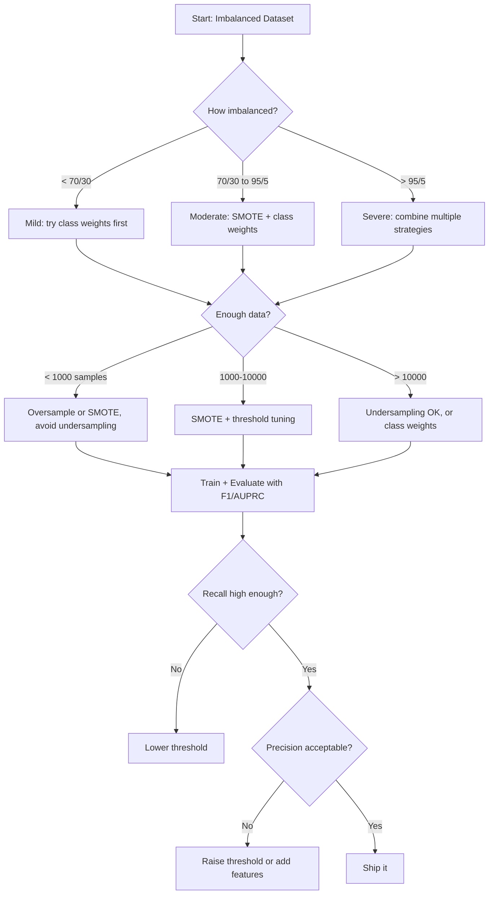

# 处理不平衡数据

> 当 99% 的数据都是"正常"时,准确率就是一句谎话。

**类型:** 动手构建
**编程语言:** Python
**前置要求:** 第 2 阶段,第 01–09 课(尤其是评估指标)
**预计耗时:** 约 90 分钟

## 学习目标

- 从零实现 SMOTE,并解释合成过采样与随机复制的区别
- 用 F1、AUPRC 和马修斯相关系数(MCC)替代准确率来评估不平衡分类器
- 对比类别加权、阈值调优和重采样策略,并针对给定的不平衡比例选出合适方案
- 构建一条完整的不平衡数据流水线,组合 SMOTE、类别权重和阈值优化

## 问题

你做了一个欺诈检测模型,准确率 99.9%。你开香槟庆祝,然后发现它对每一笔交易都预测"不是欺诈"。

这不是 bug。当只有 0.1% 的交易是欺诈时,永远猜多数类就是让总体误差最小的理性选择。模型技术上是正确的,实际上毫无用处。

但凡分类真正要紧的地方,这事都在发生:疾病诊断,阳性率 1%;网络入侵,攻击占 0.01%;制造缺陷,不良率 0.5%;垃圾邮件过滤,垃圾占 20%;流失预测,流失用户 5%。少数类越是性命攸关,它往往就越稀有。

准确率之所以失效,是因为它对所有预测正确的情形一视同仁:正确标记一笔正常交易得一分,正确抓住一笔欺诈也得一分。可抓住欺诈正是这个模型存在的全部意义。我们需要能逼着模型关注那个稀有但重要类别的指标、技巧和训练策略。

## 概念

### 为什么准确率会失效

看一个 1000 样本的数据集:990 个负例,10 个正例。一个永远预测负例的模型:

|  | 预测为正 | 预测为负 |
|--|---|---|
| 实际为正 | 0(TP) | 10(FN) |
| 实际为负 | 0(FP) | 990(TN) |

准确率 = (0 + 990) / 1000 = 99.0%

这个模型抓住的欺诈为零、疾病为零、缺陷为零。但准确率说 99%。这就是准确率在不平衡问题上的危险之处。

### 更好的指标

**精确率(Precision)** = TP / (TP + FP)。被标记为正例的东西里,有多少真是正例?精确率高 = 误报少。

**召回率(Recall)** = TP / (TP + FN)。所有真正的正例里,我们抓住了多少?召回率高 = 漏检少。

**F1 分数** = 2 · precision · recall / (precision + recall)。调和平均。相比算术平均,它对精确率与召回率的极端失衡惩罚更重。

**F-beta 分数** = (1 + β²) · precision · recall / (β² · precision + recall)。β > 1 时更看重召回率,β < 1 时更看重精确率。欺诈检测常用 F2(漏掉欺诈比误报更糟)。

**AUPRC**(精确率-召回率曲线下面积)。类似 AUC-ROC,但对不平衡数据更有信息量。随机分类器的 AUPRC 等于正类占比(而不像 ROC 的 0.5),这让提升更容易看清。

**马修斯相关系数(MCC)** = (TP·TN − FP·FN) / sqrt((TP+FP)(TP+FN)(TN+FP)(TN+FN))。取值 -1 到 +1,只有当模型在两个类别上都表现好才给高分。类别规模悬殊时依然平衡。

对上面那个"永远预测负例"的模型:precision = 0/0(未定义,通常按 0 计),recall = 0/10 = 0,F1 = 0,MCC = 0。这些指标正确地判定它一文不值。

### 不平衡数据处理流水线



### SMOTE:合成少数类过采样技术

随机过采样复制已有的少数类样本。管用,但有想过拟合风险——模型会反复看到一模一样的点。

SMOTE 造出合理但不重复的新少数类样本。算法:

1. 对每个少数类样本 x,在其他少数类样本中找它的 k 个最近邻
2. 随机挑一个邻居
3. 在 x 与该邻居的连线上生成一个新样本

公式:`new_sample = x + random(0, 1) * (neighbor - x)`

这是在真实少数类点之间插值,在特征空间的同一区域造出新样本,而不是简单复制已有数据。



### 采样策略对比

**随机过采样**:复制少数类样本,补齐到多数类的数量。
- 优点:简单,不丢信息
- 缺点:完全相同的副本导致过拟合,训练时间变长

**随机欠采样**:删掉多数类样本,对齐少数类数量。
- 优点:训练快,简单
- 缺点:扔掉可能有用的多数类数据,方差更大

**SMOTE**:通过插值合成新的少数类样本。
- 优点:生成新数据点,比随机过采样更不易过拟合
- 缺点:可能在决策边界附近造出噪声样本,且不考虑多数类的分布

| 策略 | 数据如何变化 | 风险 | 何时使用 |
|----------|-------------|------|-------------|
| 过采样 | 复制少数类 | 过拟合 | 小数据集、中度不平衡 |
| 欠采样 | 删除多数类 | 信息损失 | 大数据集、要快速训练 |
| SMOTE | 加入合成少数类 | 边界噪声 | 中度不平衡、少数类样本够做 k-NN |

### 类别权重

不改数据,改模型对待错误的方式:给误分类少数类赋予更高的权重。

一个二分类问题,950 个负例、50 个正例:
- 负类权重 = n_samples / (2 · n_negative) = 1000 / (2 · 950) = 0.526
- 正类权重 = n_samples / (2 · n_positive) = 1000 / (2 · 50) = 10.0

正类权重是负类的 19 倍:错分一个正例的代价等于错分 19 个负例。模型被迫关注少数类。

在逻辑回归里,这相当于修改损失函数:

```
weighted_loss = -sum(w_i * [y_i * log(p_i) + (1-y_i) * log(1-p_i)])
```

其中 w_i 取决于样本 i 的类别。

类别权重在期望意义上与过采样数学等价,但不产生新数据点——所以更快,也没有复制样本带来的过拟合风险。

### 阈值调优

大多数分类器输出概率,默认阈值 0.5:P(positive) ≥ 0.5 就预测正例。但 0.5 是任意取的。类别不平衡时,最优阈值通常低得多。

流程:
1. 训练模型
2. 在验证集上取预测概率
3. 从 0.0 到 1.0 扫一遍阈值
4. 在每个阈值上算 F1(或你选定的指标)
5. 取指标最大的阈值



模型可能对一笔欺诈交易只输出 P(fraud) = 0.15。阈值 0.5 时它被放走,阈值 0.10 时它被正确抓住。概率校准得好不好没那么重要,重要的是排序——只要欺诈的概率排得比非欺诈高,就存在一个能把它们分开的阈值。

### 代价敏感学习

类别权重的推广。不用统一代价,给不同误分类指定具体代价:

| | 预测为正 | 预测为负 |
|--|---|---|
| 实际为正 | 0(正确) | C_FN = 100 |
| 实际为负 | C_FP = 1 | 0(正确) |

漏掉一笔欺诈交易(FN)的代价是一次误报(FP)的 100 倍。模型优化的是总代价,而不是错误总数。

当你能估计真实世界的代价时,这是最讲原则的做法:漏诊一次癌症,和误报一次导致多做一次活检,代价天差地别。把这些代价写明白,模型才会做出正确的取舍。

### 决策流程图



```figure
class-imbalance
```

## 动手构建

### 第 1 步:生成不平衡数据集

```python
import numpy as np


def make_imbalanced_data(n_majority=950, n_minority=50, seed=42):
    rng = np.random.RandomState(seed)

    X_maj = rng.randn(n_majority, 2) * 1.0 + np.array([0.0, 0.0])
    X_min = rng.randn(n_minority, 2) * 0.8 + np.array([2.5, 2.5])

    X = np.vstack([X_maj, X_min])
    y = np.concatenate([np.zeros(n_majority), np.ones(n_minority)])

    shuffle_idx = rng.permutation(len(y))
    return X[shuffle_idx], y[shuffle_idx]
```

### 第 2 步:从零实现 SMOTE

```python
def euclidean_distance(a, b):
    return np.sqrt(np.sum((a - b) ** 2))


def find_k_neighbors(X, idx, k):
    distances = []
    for i in range(len(X)):
        if i == idx:
            continue
        d = euclidean_distance(X[idx], X[i])
        distances.append((i, d))
    distances.sort(key=lambda x: x[1])
    return [d[0] for d in distances[:k]]


def smote(X_minority, k=5, n_synthetic=100, seed=42):
    rng = np.random.RandomState(seed)
    n_samples = len(X_minority)
    k = min(k, n_samples - 1)
    synthetic = []

    for _ in range(n_synthetic):
        idx = rng.randint(0, n_samples)
        neighbors = find_k_neighbors(X_minority, idx, k)
        neighbor_idx = neighbors[rng.randint(0, len(neighbors))]
        t = rng.random()
        new_point = X_minority[idx] + t * (X_minority[neighbor_idx] - X_minority[idx])
        synthetic.append(new_point)

    return np.array(synthetic)
```

### 第 3 步:随机过采样与欠采样

```python
def random_oversample(X, y, seed=42):
    rng = np.random.RandomState(seed)
    classes, counts = np.unique(y, return_counts=True)
    max_count = counts.max()

    X_resampled = list(X)
    y_resampled = list(y)

    for cls, count in zip(classes, counts):
        if count < max_count:
            cls_indices = np.where(y == cls)[0]
            n_needed = max_count - count
            chosen = rng.choice(cls_indices, size=n_needed, replace=True)
            X_resampled.extend(X[chosen])
            y_resampled.extend(y[chosen])

    X_out = np.array(X_resampled)
    y_out = np.array(y_resampled)
    shuffle = rng.permutation(len(y_out))
    return X_out[shuffle], y_out[shuffle]


def random_undersample(X, y, seed=42):
    rng = np.random.RandomState(seed)
    classes, counts = np.unique(y, return_counts=True)
    min_count = counts.min()

    X_resampled = []
    y_resampled = []

    for cls in classes:
        cls_indices = np.where(y == cls)[0]
        chosen = rng.choice(cls_indices, size=min_count, replace=False)
        X_resampled.extend(X[chosen])
        y_resampled.extend(y[chosen])

    X_out = np.array(X_resampled)
    y_out = np.array(y_resampled)
    shuffle = rng.permutation(len(y_out))
    return X_out[shuffle], y_out[shuffle]
```

### 第 4 步:带类别权重的逻辑回归

```python
def sigmoid(z):
    return 1.0 / (1.0 + np.exp(-np.clip(z, -500, 500)))


def logistic_regression_weighted(X, y, weights, lr=0.01, epochs=200):
    n_samples, n_features = X.shape
    w = np.zeros(n_features)
    b = 0.0

    for _ in range(epochs):
        z = X @ w + b
        pred = sigmoid(z)
        error = pred - y
        weighted_error = error * weights

        gradient_w = (X.T @ weighted_error) / n_samples
        gradient_b = np.mean(weighted_error)

        w -= lr * gradient_w
        b -= lr * gradient_b

    return w, b


def compute_class_weights(y):
    classes, counts = np.unique(y, return_counts=True)
    n_samples = len(y)
    n_classes = len(classes)
    weight_map = {}
    for cls, count in zip(classes, counts):
        weight_map[cls] = n_samples / (n_classes * count)
    return np.array([weight_map[yi] for yi in y])
```

### 第 5 步:阈值调优

```python
def find_optimal_threshold(y_true, y_probs, metric="f1"):
    best_threshold = 0.5
    best_score = -1.0

    for threshold in np.arange(0.05, 0.96, 0.01):
        y_pred = (y_probs >= threshold).astype(int)
        tp = np.sum((y_pred == 1) & (y_true == 1))
        fp = np.sum((y_pred == 1) & (y_true == 0))
        fn = np.sum((y_pred == 0) & (y_true == 1))

        if metric == "f1":
            precision = tp / (tp + fp) if (tp + fp) > 0 else 0.0
            recall = tp / (tp + fn) if (tp + fn) > 0 else 0.0
            score = 2 * precision * recall / (precision + recall) if (precision + recall) > 0 else 0.0
        elif metric == "recall":
            score = tp / (tp + fn) if (tp + fn) > 0 else 0.0
        elif metric == "precision":
            score = tp / (tp + fp) if (tp + fp) > 0 else 0.0

        if score > best_score:
            best_score = score
            best_threshold = threshold

    return best_threshold, best_score
```

### 第 6 步:评估函数

```python
def confusion_matrix_values(y_true, y_pred):
    tp = np.sum((y_pred == 1) & (y_true == 1))
    tn = np.sum((y_pred == 0) & (y_true == 0))
    fp = np.sum((y_pred == 1) & (y_true == 0))
    fn = np.sum((y_pred == 0) & (y_true == 1))
    return tp, tn, fp, fn


def compute_metrics(y_true, y_pred):
    tp, tn, fp, fn = confusion_matrix_values(y_true, y_pred)
    accuracy = (tp + tn) / (tp + tn + fp + fn)
    precision = tp / (tp + fp) if (tp + fp) > 0 else 0.0
    recall = tp / (tp + fn) if (tp + fn) > 0 else 0.0
    f1 = 2 * precision * recall / (precision + recall) if (precision + recall) > 0 else 0.0

    denom = np.sqrt(float((tp + fp) * (tp + fn) * (tn + fp) * (tn + fn)))
    mcc = (tp * tn - fp * fn) / denom if denom > 0 else 0.0

    return {
        "accuracy": accuracy,
        "precision": precision,
        "recall": recall,
        "f1": f1,
        "mcc": mcc,
    }
```

### 第 7 步:对比所有方法

```python
X, y = make_imbalanced_data(950, 50, seed=42)
split = int(0.8 * len(y))
X_train, X_test = X[:split], X[split:]
y_train, y_test = y[:split], y[split:]

# Baseline: no treatment
w_base, b_base = logistic_regression_weighted(
    X_train, y_train, np.ones(len(y_train)), lr=0.1, epochs=300
)
probs_base = sigmoid(X_test @ w_base + b_base)
preds_base = (probs_base >= 0.5).astype(int)

# Oversampled
X_over, y_over = random_oversample(X_train, y_train)
w_over, b_over = logistic_regression_weighted(
    X_over, y_over, np.ones(len(y_over)), lr=0.1, epochs=300
)
preds_over = (sigmoid(X_test @ w_over + b_over) >= 0.5).astype(int)

# SMOTE
minority_mask = y_train == 1
X_minority = X_train[minority_mask]
synthetic = smote(X_minority, k=5, n_synthetic=len(y_train) - 2 * int(minority_mask.sum()))
X_smote = np.vstack([X_train, synthetic])
y_smote = np.concatenate([y_train, np.ones(len(synthetic))])
w_sm, b_sm = logistic_regression_weighted(
    X_smote, y_smote, np.ones(len(y_smote)), lr=0.1, epochs=300
)
preds_smote = (sigmoid(X_test @ w_sm + b_sm) >= 0.5).astype(int)

# Class weights
sample_weights = compute_class_weights(y_train)
w_cw, b_cw = logistic_regression_weighted(
    X_train, y_train, sample_weights, lr=0.1, epochs=300
)
probs_cw = sigmoid(X_test @ w_cw + b_cw)
preds_cw = (probs_cw >= 0.5).astype(int)

# Threshold tuning (tune on held-out validation set, not test set)
probs_val = sigmoid(X_val @ w_cw + b_cw)
best_thresh, best_f1 = find_optimal_threshold(y_val, probs_val, metric="f1")
preds_thresh = (probs_cw >= best_thresh).astype(int)
```

代码文件把这一切放进一个脚本里运行并打印结果。

## 投入使用

用 scikit-learn 和 imbalanced-learn,这些技术都是一行起:

```python
from sklearn.linear_model import LogisticRegression
from sklearn.metrics import classification_report, f1_score
from sklearn.model_selection import train_test_split
from imblearn.over_sampling import SMOTE
from imblearn.under_sampling import RandomUnderSampler
from imblearn.pipeline import Pipeline

X_train, X_test, y_train, y_test = train_test_split(X, y, stratify=y)

model_weighted = LogisticRegression(class_weight="balanced")
model_weighted.fit(X_train, y_train)
print(classification_report(y_test, model_weighted.predict(X_test)))

smote = SMOTE(random_state=42)
X_resampled, y_resampled = smote.fit_resample(X_train, y_train)
model_smote = LogisticRegression()
model_smote.fit(X_resampled, y_resampled)
print(classification_report(y_test, model_smote.predict(X_test)))

pipeline = Pipeline([
    ("smote", SMOTE()),
    ("model", LogisticRegression(class_weight="balanced")),
])
pipeline.fit(X_train, y_train)
print(classification_report(y_test, pipeline.predict(X_test)))
```

从零实现让你看清每种技术的本质:SMOTE 就是在少数类上做 k-NN 插值;类别权重就是给损失乘个系数;阈值调优就是一个遍历截断点的 for 循环。没有魔法。

## 交付

本课产出:
- `outputs/skill-imbalanced-data.md` —— 一份处理不平衡分类问题的决策清单

## 练习

1. **Borderline-SMOTE**:改造 SMOTE 实现,只为靠近决策边界的少数类点(其 k 近邻中包含多数类样本的那些)生成合成样本。在类别有重叠的数据集上与标准 SMOTE 对比。

2. **代价矩阵优化**:实现以代价矩阵为参数的代价敏感学习。写一个函数:输入代价矩阵,返回使期望代价最小的最优预测。用不同代价比(1:10、1:100、1:1000)测试,画出精确率-召回率权衡如何变化。

3. **阈值校准**:实现 Platt 缩放(在模型原始输出上拟合一个逻辑回归,产出校准后的概率)。对比校准前后的精确率-召回率曲线。证明校准不改变排序(AUC 不变),但让概率更有意义。

4. **平衡装袋集成**:训练多个模型,每个都用一份平衡的自助采样(全部少数类 + 随机部分多数类),平均它们的预测。与"单模型 + SMOTE"对比,同时测量性能和跨多次运行的方差。

5. **不平衡比例实验**:取一个平衡数据集,逐步加大不平衡比例(50/50、70/30、90/10、95/5、99/1)。每个比例分别用和不用 SMOTE 训练,画出两条 F1 随不平衡比例变化的曲线。SMOTE 从哪个比例开始产生明显差异?

## 关键术语

| 术语 | 人们常说的 | 实际含义 |
|------|----------------|----------------------|
| 类别不平衡 | "一类样本远多于另一类" | 数据集中类别分布严重偏斜,导致模型偏向多数类 |
| SMOTE | "合成过采样" | 在已有少数类样本与其 k 个最近少数类邻居之间插值,生成新的少数类样本 |
| 类别权重 | "让稀有类上的错误更贵" | 给损失函数乘上类别特定的权重,让模型更重地惩罚少数类的误分类 |
| 阈值调优 | "移动决策边界" | 把分类的概率截断点从默认 0.5 改为能优化目标指标的值 |
| 精确率-召回率权衡 | "鱼和熊掌不可兼得" | 降低阈值能抓住更多正例(召回率升),但也会标记更多假正例(精确率降),反之亦然 |
| AUPRC | "PR 曲线下面积" | 把精确率-召回率曲线汇总成一个数;类别严重不平衡时比 AUC-ROC 更有信息量 |
| 马修斯相关系数 | "那个平衡的指标" | 预测标签与真实标签之间的相关系数,只有两个类别都表现好才给高分 |
| 代价敏感学习 | "不同的错误代价不同" | 把真实世界的误分类代价纳入训练目标,让模型优化总代价而非错误数 |
| 随机过采样 | "复制少数类" | 重复少数类样本以平衡类别数;简单,但有对复制点过拟合的风险 |

## 延伸阅读

- [Chawla 等,《SMOTE:合成少数类过采样技术》(2002)](https://arxiv.org/abs/1106.1813) —— SMOTE 原始论文,至今仍是不平衡学习领域被引最多的工作
- [He 与 Garcia,《从不平衡数据中学习》(2009)](https://ieeexplore.ieee.org/document/5128907) —— 涵盖采样、代价敏感和算法层面方法的全面综述
- [imbalanced-learn 文档](https://imbalanced-learn.org/stable/) —— Python 库,含 SMOTE 各变体、欠采样策略和流水线集成
- [Saito 与 Rehmsmeier,《精确率-召回率图比 ROC 图更有信息量》(2015)](https://journals.plos.org/plosone/article?id=10.1371/journal.pone.0118432) —— 不平衡问题上何时以及为何该用 PR 曲线替代 ROC 曲线
