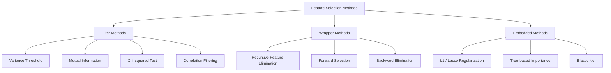
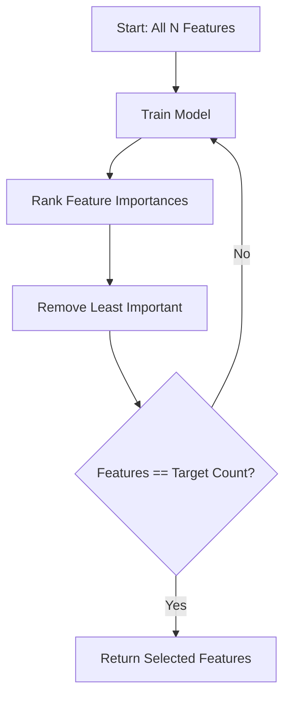
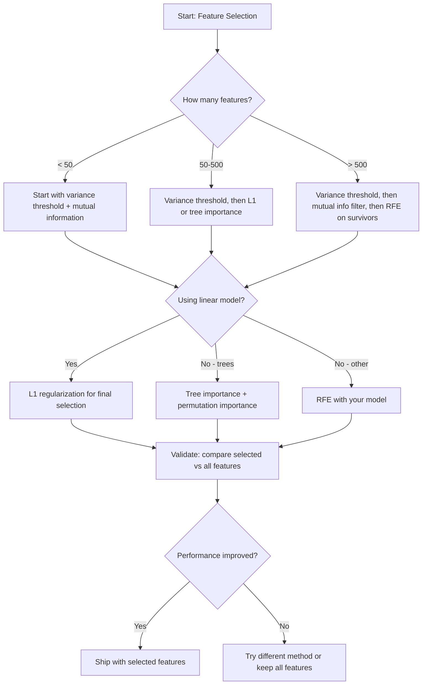

# 特征选择

> 特征多不如特征对。

**类型:** 动手构建
**编程语言:** Python
**前置要求:** 第 2 阶段,第 01–09、08 课(特征工程)
**预计耗时:** 约 75 分钟

## 学习目标

- 从零实现过滤式方法(方差阈值、互信息、卡方)和包裹式方法(RFE、前向选择)
- 解释为什么互信息能捕捉到相关性漏掉的非线性特征-目标关系
- 对比 L1 正则化(嵌入式选择)与 RFE(包裹式选择),评估两者的计算代价权衡
- 构建一条组合多种方法的特征选择流水线,并在留出数据上证明泛化能力提升

## 问题

你有 500 个特征。模型训练慢、天天过拟合,还没人说得清它学到了什么。你指望加更多特征来提升性能——结果更糟了。

这就是维度灾难在作怪。特征数量增长,特征空间的体积爆炸,数据点变得稀疏,点与点之间的距离趋于相等。模型需要指数级更多的数据才能找到真正的模式;噪声特征淹没了信号特征;过拟合成了默认结局。

特征选择就是解药:剥掉噪声,去掉冗余,只留下真正携带目标信息的特征。换来的是:训练更快、泛化更好、模型解释得清。

目标不是用上所有可用信息,而是用对信息。

## 概念

### 特征选择的三大类

每种特征选择方法都落在三类之一:



**过滤式方法**用统计量独立地给每个特征打分,不用模型。快,但看不到特征间的交互。

**包裹式方法**训练模型来评估特征子集,用模型性能当分数。效果更好,但贵——模型要重训很多次。

**嵌入式方法**在模型训练的过程中顺手完成选择:L1 正则化把权重压到零,决策树在最有用的特征上分裂。选择发生在拟合之中,而不是单独的一步。

### 方差阈值

最简单的过滤器。一个特征在样本间几乎不变化,它就几乎不携带信息。

想象一个特征在 1000 个样本里有 999 个是 0.0,方差接近零,任何模型都拿它区分不了类别。删掉。

```
variance(x) = mean((x - mean(x))^2)
```

设一个阈值(比如 0.01),方差低于它的特征全删。完全不需要看目标变量,就能去掉常量或近常量特征。

什么时候用:作为其他方法之前的预处理步骤。代价几乎为零,能抓住明显没用的特征。

局限:方差高的特征也可能是纯噪声。方差阈值是必要非充分条件。

### 互信息

互信息衡量:知道特征 X 的取值,能让目标 Y 的不确定性减少多少。

```
I(X; Y) = sum_x sum_y p(x, y) * log(p(x, y) / (p(x) * p(y)))
```

若 X 与 Y 独立,则 p(x, y) = p(x)·p(y),log 项为零,I(X; Y) = 0。X 透露 Y 的信息越多,互信息越大。

相对相关性的关键优势:互信息能捕捉非线性关系。一个特征与目标的相关系数可以是零,互信息却很高——因为关系是二次的或周期性的。

对连续特征,先分箱离散化(基于直方图的估计)。箱数影响估计:太少丢信息,太多引入噪声。常用取法:sqrt(n) 个箱,或 Sturges 规则(1 + log2(n))。


### 递归特征消除(RFE)

RFE 是包裹式方法,借模型自身的特征重要性迭代剪枝:

1. 用全部特征训练模型
2. 按重要性给特征排序(线性模型看系数,树看不纯度下降)
3. 删掉最不重要的特征
4. 重复,直到剩到目标数量



RFE 考虑特征交互,因为模型每次都同时看到所有剩余特征——删掉一个特征会改变其他特征的重要性。这比过滤式方法更周全。

代价:模型要训练 N − 目标数次。500 个特征选 10 个,就是 490 次训练。模型贵的话,这很慢。可以每步多删几个特征来加速(比如每轮砍掉垫底的 10%)。

### L1(Lasso)正则化

L1 正则化把权重的绝对值加进损失函数:

```
loss = prediction_error + alpha * sum(|w_i|)
```

alpha 控制剪枝的力度:alpha 越大,越多权重被压到精确的零。

为什么是精确的零?L1 惩罚在权重空间里造出一个菱形约束区域,最优解倾向落在菱形的角上——那里恰好有一个或多个权重为零。L2 正则化(岭回归)造出的是圆形约束,权重只会缩小,很难碰到零。

这就是嵌入式特征选择:模型在训练中自己学会忽略哪些特征。权重为零的特征等于被删掉了。

优点:只训一次;能处理相关特征(挑一个留下,其余归零);大多数线性模型实现里都内置了。

局限:只适用于线性模型,捕捉不到非线性的特征重要性。

### 基于树的特征重要性

决策树及其集成(随机森林、梯度提升)天然会给特征排序。每次分裂都降低不纯度(分类用基尼或熵,回归用方差),带来更大不纯度下降的特征更重要。

对有 T 棵树的随机森林:

```
importance(feature_j) = (1/T) * sum over all trees of
    sum over all nodes splitting on feature_j of
        (n_samples * impurity_decrease)
```

这给每个特征一个归一化的重要性分数,自动处理非线性关系和特征交互。

注意:基于树的重要性偏向唯一值多的特征(高基数)。一个随机 ID 列会显得很重要,因为它能把每个样本完美劈开。用排列重要性做交叉验证。

### 排列重要性

一种模型无关的方法:

1. 训练模型,记录它在验证数据上的基线性能
2. 对每个特征:随机打乱它的取值,测量性能下降多少
3. 掉得越多,特征越重要

打乱某特征后性能无损,说明模型不依赖它;性能崩塌,说明该特征至关重要。

排列重要性避开了树重要性的基数偏差。但它慢:每个特征一次完整评估,为求稳定还要重复多遍。

### 对比表

| 方法 | 类型 | 速度 | 非线性 | 特征交互 |
|--------|------|-------|-----------|---------------------|
| 方差阈值 | 过滤式 | 极快 | 否 | 否 |
| 互信息 | 过滤式 | 快 | 是 | 否 |
| 相关性过滤 | 过滤式 | 快 | 否 | 否 |
| RFE | 包裹式 | 慢 | 取决于模型 | 是 |
| L1 / Lasso | 嵌入式 | 快 | 否(线性) | 否 |
| 树重要性 | 嵌入式 | 中 | 是 | 是 |
| 排列重要性 | 模型无关 | 慢 | 是 | 是 |

### 决策流程图



```figure
f3-feature-prune
```

## 动手构建

### 第 1 步:生成特征结构已知的合成数据

```python
import numpy as np


def make_feature_selection_data(n_samples=500, seed=42):
    rng = np.random.RandomState(seed)

    x1 = rng.randn(n_samples)
    x2 = rng.randn(n_samples)
    x3 = rng.randn(n_samples)
    x4 = x1 + 0.1 * rng.randn(n_samples)
    x5 = x2 + 0.1 * rng.randn(n_samples)

    informative = np.column_stack([x1, x2, x3, x4, x5])

    correlated = np.column_stack([
        x1 * 0.9 + 0.1 * rng.randn(n_samples),
        x2 * 0.8 + 0.2 * rng.randn(n_samples),
        x3 * 0.7 + 0.3 * rng.randn(n_samples),
        x1 * 0.5 + x2 * 0.5 + 0.1 * rng.randn(n_samples),
        x2 * 0.6 + x3 * 0.4 + 0.1 * rng.randn(n_samples),
    ])

    noise = rng.randn(n_samples, 10) * 0.5

    X = np.hstack([informative, correlated, noise])
    y = (2 * x1 - 1.5 * x2 + x3 + 0.5 * rng.randn(n_samples) > 0).astype(int)

    feature_names = (
        [f"info_{i}" for i in range(5)]
        + [f"corr_{i}" for i in range(5)]
        + [f"noise_{i}" for i in range(10)]
    )

    return X, y, feature_names
```

我们知道真实答案:特征 0–4 是有信息量的(其中 3、4 是 0、1 的相关副本),特征 5–9 与有信息特征相关,特征 10–19 是纯噪声。好的选择方法应该把 0–4 排最高、10–19 排最低。

### 第 2 步:方差阈值

```python
def variance_threshold(X, threshold=0.01):
    variances = np.var(X, axis=0)
    mask = variances > threshold
    return mask, variances
```

### 第 3 步:互信息(离散化)

```python
def discretize(x, n_bins=10):
    min_val, max_val = x.min(), x.max()
    if max_val == min_val:
        return np.zeros_like(x, dtype=int)
    bin_edges = np.linspace(min_val, max_val, n_bins + 1)
    binned = np.digitize(x, bin_edges[1:-1])
    return binned


def mutual_information(X, y, n_bins=10):
    n_samples, n_features = X.shape
    mi_scores = np.zeros(n_features)

    y_vals, y_counts = np.unique(y, return_counts=True)
    p_y = y_counts / n_samples

    for f in range(n_features):
        x_binned = discretize(X[:, f], n_bins)
        x_vals, x_counts = np.unique(x_binned, return_counts=True)
        p_x = dict(zip(x_vals, x_counts / n_samples))

        mi = 0.0
        for xv in x_vals:
            for yi, yv in enumerate(y_vals):
                joint_mask = (x_binned == xv) & (y == yv)
                p_xy = np.sum(joint_mask) / n_samples
                if p_xy > 0:
                    mi += p_xy * np.log(p_xy / (p_x[xv] * p_y[yi]))
        mi_scores[f] = mi

    return mi_scores
```

### 第 4 步:递归特征消除

```python
def simple_logistic_importance(X, y, lr=0.1, epochs=100):
    n_samples, n_features = X.shape
    w = np.zeros(n_features)
    b = 0.0

    for _ in range(epochs):
        z = X @ w + b
        pred = 1.0 / (1.0 + np.exp(-np.clip(z, -500, 500)))
        error = pred - y
        w -= lr * (X.T @ error) / n_samples
        b -= lr * np.mean(error)

    return w, b


def rfe(X, y, n_features_to_select=5, lr=0.1, epochs=100):
    n_total = X.shape[1]
    remaining = list(range(n_total))
    rankings = np.ones(n_total, dtype=int)
    rank = n_total

    while len(remaining) > n_features_to_select:
        X_subset = X[:, remaining]
        w, _ = simple_logistic_importance(X_subset, y, lr, epochs)
        importances = np.abs(w)

        least_idx = np.argmin(importances)
        original_idx = remaining[least_idx]
        rankings[original_idx] = rank
        rank -= 1
        remaining.pop(least_idx)

    for idx in remaining:
        rankings[idx] = 1

    selected_mask = rankings == 1
    return selected_mask, rankings
```

### 第 5 步:L1 特征选择

```python
def soft_threshold(w, alpha):
    return np.sign(w) * np.maximum(np.abs(w) - alpha, 0)


def l1_feature_selection(X, y, alpha=0.1, lr=0.01, epochs=500):
    n_samples, n_features = X.shape
    w = np.zeros(n_features)
    b = 0.0

    for _ in range(epochs):
        z = X @ w + b
        pred = 1.0 / (1.0 + np.exp(-np.clip(z, -500, 500)))
        error = pred - y

        gradient_w = (X.T @ error) / n_samples
        gradient_b = np.mean(error)

        w -= lr * gradient_w
        w = soft_threshold(w, lr * alpha)
        b -= lr * gradient_b

    selected_mask = np.abs(w) > 1e-6
    return selected_mask, w
```

### 第 6 步:基于树的重要性(简单决策树)

```python
def gini_impurity(y):
    if len(y) == 0:
        return 0.0
    classes, counts = np.unique(y, return_counts=True)
    probs = counts / len(y)
    return 1.0 - np.sum(probs ** 2)


def best_split(X, y, feature_idx):
    values = np.unique(X[:, feature_idx])
    if len(values) <= 1:
        return None, -1.0

    best_threshold = None
    best_gain = -1.0
    parent_gini = gini_impurity(y)
    n = len(y)

    for i in range(len(values) - 1):
        threshold = (values[i] + values[i + 1]) / 2.0
        left_mask = X[:, feature_idx] <= threshold
        right_mask = ~left_mask

        n_left = np.sum(left_mask)
        n_right = np.sum(right_mask)

        if n_left == 0 or n_right == 0:
            continue

        gain = parent_gini - (n_left / n) * gini_impurity(y[left_mask]) - (n_right / n) * gini_impurity(y[right_mask])

        if gain > best_gain:
            best_gain = gain
            best_threshold = threshold

    return best_threshold, best_gain


def tree_importance(X, y, n_trees=50, max_depth=5, seed=42):
    rng = np.random.RandomState(seed)
    n_samples, n_features = X.shape
    importances = np.zeros(n_features)

    for _ in range(n_trees):
        sample_idx = rng.choice(n_samples, size=n_samples, replace=True)
        feature_subset = rng.choice(n_features, size=max(1, int(np.sqrt(n_features))), replace=False)

        X_boot = X[sample_idx]
        y_boot = y[sample_idx]

        tree_imp = _build_tree_importance(X_boot, y_boot, feature_subset, max_depth)
        importances += tree_imp

    total = importances.sum()
    if total > 0:
        importances /= total

    return importances


def _build_tree_importance(X, y, feature_subset, max_depth, depth=0):
    n_features = X.shape[1]
    importances = np.zeros(n_features)

    if depth >= max_depth or len(np.unique(y)) <= 1 or len(y) < 4:
        return importances

    best_feature = None
    best_threshold = None
    best_gain = -1.0

    for f in feature_subset:
        threshold, gain = best_split(X, y, f)
        if gain > best_gain:
            best_gain = gain
            best_feature = f
            best_threshold = threshold

    if best_feature is None or best_gain <= 0:
        return importances

    importances[best_feature] += best_gain * len(y)

    left_mask = X[:, best_feature] <= best_threshold
    right_mask = ~left_mask

    importances += _build_tree_importance(X[left_mask], y[left_mask], feature_subset, max_depth, depth + 1)
    importances += _build_tree_importance(X[right_mask], y[right_mask], feature_subset, max_depth, depth + 1)

    return importances
```

### 第 7 步:运行所有方法并对比

代码文件在同一个合成数据集上运行全部五种方法,打印对比表,展示每种方法选出了哪些特征。

## 投入使用

用 scikit-learn,特征选择直接内建在流水线里:

```python
from sklearn.feature_selection import (
    VarianceThreshold,
    mutual_info_classif,
    RFE,
    SelectFromModel,
)
from sklearn.linear_model import Lasso, LogisticRegression
from sklearn.ensemble import RandomForestClassifier

vt = VarianceThreshold(threshold=0.01)
X_filtered = vt.fit_transform(X)

mi_scores = mutual_info_classif(X, y)
top_k = np.argsort(mi_scores)[-10:]

rfe_selector = RFE(LogisticRegression(), n_features_to_select=10)
rfe_selector.fit(X, y)
X_rfe = rfe_selector.transform(X)

lasso_selector = SelectFromModel(Lasso(alpha=0.01))
lasso_selector.fit(X, y)
X_lasso = lasso_selector.transform(X)

rf = RandomForestClassifier(n_estimators=100)
rf.fit(X, y)
importances = rf.feature_importances_
```

从零实现让你看清每种方法内部在做什么。方差阈值就是算 `var(X, axis=0)` 再套掩码;互信息就是在列联表里数联合频率和边缘频率;RFE 就是"训练、排序、剪枝"的循环;L1 就是带软阈值步骤的梯度下降;树重要性就是跨分裂累积不纯度下降。没有魔法——只有统计和循环。

sklearn 版本增加了鲁棒性(比如 mutual_info_classif 用 k-NN 密度估计代替分箱)、速度(C 实现)和流水线集成。

## 交付

本课产出:
- `outputs/skill-feature-selector.md` —— 一份挑选特征选择方法的速查决策树

## 练习

1. **前向选择**:实现 RFE 的反面。从零个特征开始,每步加入最能提升模型性能的特征,直到加特征不再有收益。与 RFE 的入选特征对比。哪个更快?哪个效果更好?

2. **稳定性选择**:跑 50 次 L1 特征选择,每次用随机 80% 的数据子采样,alpha 值略有不同。统计每个特征被选中的次数,选中率超过 80% 的特征算"稳定特征"。与单次 L1 选择的结果对比。哪个更可靠?

3. **多重共线性检测**:计算所有特征的相关系数矩阵。实现一个函数:给定相关性阈值(如 0.9),从每对高相关特征中删一个(保留与目标互信息更高的那个)。在合成数据集上测试,验证它确实删掉了冗余的相关特征。

4. **特征选择流水线**:把方差阈值、互信息过滤、RFE 串成一条流水线:先删近零方差特征,再按互信息保留前 50%,最后对幸存者跑 RFE。与直接在全部特征上跑 RFE 对比。流水线更快吗?准确率相当吗?

5. **从零实现排列重要性**:实现排列重要性——每个特征打乱 10 次,测量 F1 的平均降幅。把排序与基于树的重要性对比,找出两者不一致的情形并解释原因(提示:相关特征)。

## 关键术语

| 术语 | 人们常说的 | 实际含义 |
|------|----------------|----------------------|
| 过滤式方法 | "独立给特征打分" | 不训练模型、用统计量给特征排序的选择方法,每个特征孤立评估 |
| 包裹式方法 | "用模型挑特征" | 通过训练模型、以其性能作为选择标准来评估特征子集的方法 |
| 嵌入式方法 | "模型训练时顺手选特征" | 在模型拟合过程中完成的选择,如 L1 正则化把权重压到零 |
| 互信息 | "一个变量能告诉你另一个多少" | 已知 X 时 Y 不确定性的减少量,同时捕捉线性和非线性依赖 |
| 递归特征消除 | "训练、排序、剪枝、重复" | 迭代式包裹方法:训练模型、删掉最不重要的特征,重复直到达到目标数量 |
| L1 / Lasso 正则化 | "杀死特征的惩罚项" | 把权重绝对值之和加进损失函数,把不重要特征的权重精确压到零 |
| 方差阈值 | "删掉常量特征" | 删除跨样本方差低于指定阈值的特征,滤掉不携带信息的特征 |
| 特征重要性 | "哪些特征最要紧" | 表示每个特征对模型预测贡献多大的分数,来自分裂增益(树)或系数大小(线性) |
| 排列重要性 | "打乱它,看伤多重" | 随机打乱每个特征的取值、测量模型性能降幅,以此来评估特征重要性 |
| 维度灾难 | "特征太多,数据太少" | 增加特征使特征空间体积指数增长、数据变稀疏、距离失去意义的现象 |

## 延伸阅读

- [Guyon 与 Elisseeff,《变量与特征选择导论》(2003)](https://jmlr.org/papers/v3/guyon03a.html) —— 特征选择方法的奠基性综述,至今仍被广泛引用
- [scikit-learn 特征选择指南](https://scikit-learn.org/stable/modules/feature_selection.html) —— 过滤式、包裹式、嵌入式方法的实用参考,含代码示例
- [Meinshausen 与 Bühlmann,《稳定性选择》(2010)](https://arxiv.org/abs/0809.2932) —— 把子采样与特征选择结合,获得稳健、可复现的结果
- [Strobl 等,《当心默认的随机森林重要性》(2007)](https://bmcbioinformatics.biomedcentral.com/articles/10.1186/1471-2105-8-25) —— 展示了基于树的重要性的基数偏差,并提出条件重要性作为替代
