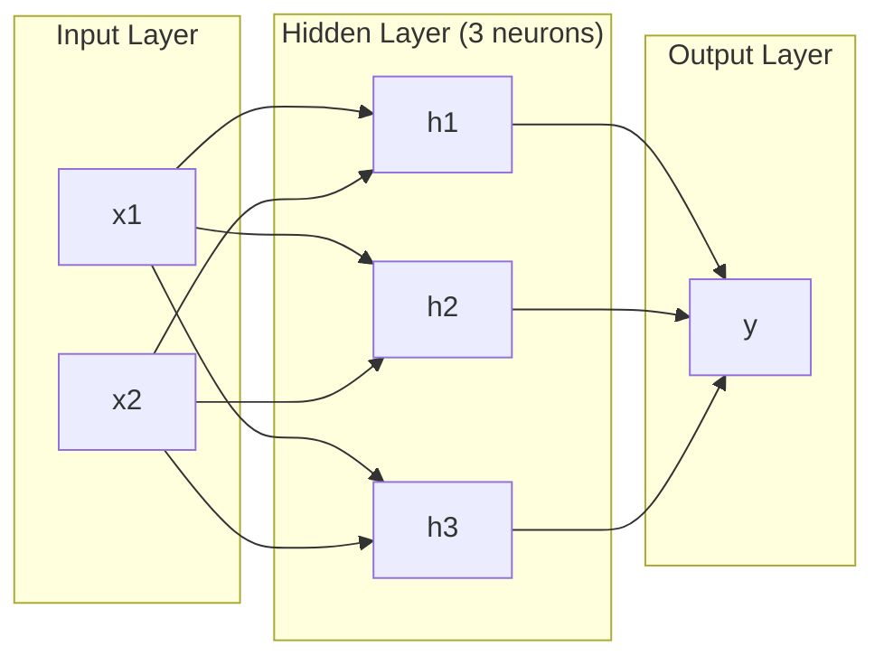
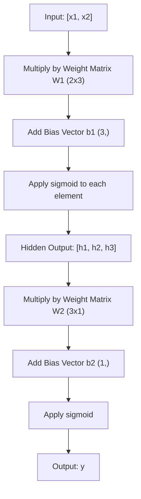
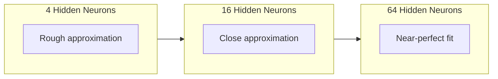

# 多层网络与前向传播

> 一个神经元画一条线。把它们堆起来,什么都能画。

**类型:** 动手构建
**编程语言:** Python
**前置要求:** 第 01 阶段(数学基础),第 03.01 课(感知机)
**预计耗时:** 约 90 分钟

## 学习目标

- 用 Layer 和 Network 类从零构建多层网络,完成一次完整的前向传播
- 追踪每一层的矩阵维度,识别形状不匹配的问题
- 解释堆叠非线性激活为什么能让网络学会弯曲的决策边界
- 用 2-2-1 结构和手工调好的 sigmoid 权重解决 XOR 问题

## 问题

单个神经元只会画线。就这样:在你的数据里画一条直线。而 AI 里的每个真实问题——图像识别、语言理解、下围棋——需要的都是曲线。把神经元堆成层,才能得到曲线。

1969 年,Minsky 和 Papert 证明了这个限制是致命的:单层网络学不会 XOR。不是"学起来费劲",而是数学上不可能。XOR 真值表把 [0,1] 和 [1,0] 放在一边,[0,0] 和 [1,1] 放在另一边,任何一条直线都分不开它们。

这让神经网络研究的资金断流了十多年。事后看,解法显而易见:别再用一层。把神经元堆成层,让第一层把输入空间雕刻成新特征,再让第二层把这些特征组合成任何单条直线都做不出的决策。

这个堆叠体就是多层网络,它是今天所有生产环境中的深度学习模型的地基。而前向传播——数据从输入流经隐藏层到达输出的过程——是你必须最先搭出来的东西,否则后面的一切都无从谈起。

## 概念

### 层:输入、隐藏、输出

多层网络有三种层:

**输入层**——其实算不上真正的层。它只是存放原始数据:两个特征就是两个输入节点,这里不发生任何计算。

**隐藏层**——真正干活的地方。每个神经元接收上一层所有输出,施加权重和偏置,再把结果送进激活函数。叫"隐藏",是因为你在训练数据里永远看不到这些值。

**输出层**——最终答案。二分类用一个 sigmoid 神经元;多分类则每类一个神经元。



这是一个 2-3-1 网络:两个输入、三个隐藏神经元、一个输出。每条连接带一个权重,每个神经元(输入除外)带一个偏置。

每一层产出一个数字向量,叫隐藏状态(hidden state)。处理文本时,隐藏状态提升维度——把一个词编码成 768 个数字以捕捉语义;处理图像时,隐藏状态降低维度——把上百万像素压缩成可管理的表示。学习的成果,就藏在隐藏状态里。

### 神经元与激活

每个神经元做三件事:

1. 把每个输入乘上对应的权重
2. 把所有乘积加起来,再加上偏置
3. 把和送进激活函数

目前我们用的激活函数是 sigmoid:

```
sigmoid(z) = 1 / (1 + e^(-z))
```

sigmoid 把任何数压进 (0, 1) 区间:大的正输入被推向 1,大的负输入被推向 0,零映射到 0.5。学习之所以可能,靠的正是这条光滑曲线——与感知机的生硬阶跃不同,sigmoid 处处有梯度。

### 前向传播:数据如何流动

前向传播把输入数据逐层推过网络,直到输出。前向传播中不发生任何学习,它是纯计算:乘、加、激活,重复。



每一层依次发生三个操作:

```
z = W * input + b       (linear transformation)
a = sigmoid(z)           (activation)
```

一层的输出成为下一层的输入。这就是前向传播的全部。

### 矩阵维度

追踪维度是深度学习中最重要的调试技能,没有之一。以这个 2-3-1 网络为例:

| 步骤 | 运算 | 维度 | 结果形状 |
|------|-----------|------------|-------------|
| 输入 | x | -- | (2,) |
| 隐藏层线性变换 | W1 * x + b1 | W1: (3, 2), b1: (3,) | (3,) |
| 隐藏层激活 | sigmoid(z1) | -- | (3,) |
| 输出层线性变换 | W2 * h + b2 | W2: (1, 3), b2: (1,) | (1,) |
| 输出层激活 | sigmoid(z2) | -- | (1,) |

规则:第 k 层的权重矩阵 W 形状为 (第 k 层神经元数, 第 k-1 层神经元数)。行数对应当前层,列数对应前一层。形状对不上,就是有 bug。

### 万能逼近定理

1989 年,George Cybenko 证明了一件了不起的事:只有一个隐藏层、但神经元足够多的神经网络,可以以任意精度逼近任何连续函数。

这不意味着单隐藏层总是最佳选择,它只说明这种结构在理论上够用。实践中,更深的网络(层数多、每层神经元少)能用少得多的总参数学出同样的函数,胜过浅而宽的网络——这正是深度学习行之有效的原因。

直觉是:隐藏层里每个神经元学一个"凸起"、一种特征。足够多的凸起摆在正确的位置上,就能逼近任何光滑曲线。神经元越多,凸起越多,逼近越好。



### 可组合性

神经网络是可组合的:可以堆叠、串联、并联。Whisper 模型用一个编码器网络处理音频、一个独立的解码器网络生成文本;现代 LLM 只有解码器;BERT 只有编码器;T5 是编码器-解码器。架构的选择决定了模型能做什么。

```figure
mlp-forward
```

## 动手构建

纯 Python,不用 numpy,每个矩阵运算都从零写。

### 第 1 步:sigmoid 激活

```python
import math

def sigmoid(x):
    x = max(-500.0, min(500.0, x))
    return 1.0 / (1.0 + math.exp(-x))
```

截断到 [-500, 500] 是为了防止溢出:`math.exp(500)` 很大但有限,`math.exp(1000)` 就是无穷了。

### 第 2 步:Layer 类

整个深度学习里最重要的运算是矩阵乘法。每一层、每个注意力头、每次前向传播——往下拆全是矩阵乘。线性层接收输入向量,乘上权重矩阵,加上偏置向量:y = Wx + b。这一个式子占了神经网络 90% 的计算量。

一个层持有一个权重矩阵和一个偏置向量,它的 forward 方法接收输入向量,返回激活后的输出。

```python
class Layer:
    def __init__(self, n_inputs, n_neurons, weights=None, biases=None):
        if weights is not None:
            self.weights = weights
        else:
            import random
            self.weights = [
                [random.uniform(-1, 1) for _ in range(n_inputs)]
                for _ in range(n_neurons)
            ]
        if biases is not None:
            self.biases = biases
        else:
            self.biases = [0.0] * n_neurons

    def forward(self, inputs):
        self.last_input = inputs
        self.last_output = []
        for neuron_idx in range(len(self.weights)):
            z = sum(
                w * x for w, x in zip(self.weights[neuron_idx], inputs)
            )
            z += self.biases[neuron_idx]
            self.last_output.append(sigmoid(z))
        return self.last_output
```

权重矩阵形状为 (n_neurons, n_inputs):每行是一个神经元对所有输入的权重。forward 方法遍历神经元,算加权和加偏置,过 sigmoid,收集结果。

### 第 3 步:Network 类

网络就是一列层。前向传播把它们串起来:第 k 层的输出喂给第 k+1 层。

```python
class Network:
    def __init__(self, layers):
        self.layers = layers

    def forward(self, inputs):
        current = inputs
        for layer in self.layers:
            current = layer.forward(current)
        return current
```

这就是前向传播的全部:四行逻辑。数据进去,流过每一层,从另一端出来。

### 第 4 步:用手调权重解 XOR

在第 01 课,我们用 OR、NAND、AND 三个感知机组合解决了 XOR。现在用 Layer 和 Network 类做同样的事。2-2-1 结构:两个输入、两个隐藏神经元、一个输出。

```python
hidden = Layer(
    n_inputs=2,
    n_neurons=2,
    weights=[[20.0, 20.0], [-20.0, -20.0]],
    biases=[-10.0, 30.0],
)

output = Layer(
    n_inputs=2,
    n_neurons=1,
    weights=[[20.0, 20.0]],
    biases=[-30.0],
)

xor_net = Network([hidden, output])

xor_data = [
    ([0, 0], 0),
    ([0, 1], 1),
    ([1, 0], 1),
    ([1, 1], 0),
]

for inputs, expected in xor_data:
    result = xor_net.forward(inputs)
    predicted = 1 if result[0] >= 0.5 else 0
    print(f"  {inputs} -> {result[0]:.6f} (rounded: {predicted}, expected: {expected})")
```

大权重(20、-20)让 sigmoid 表现得像阶跃函数。第一个隐藏神经元近似 OR,第二个近似 NAND,输出神经元把它们组合成 AND——合起来就是 XOR。

### 第 5 步:圆形分类

一个更难的问题:把二维点分成"在原点半径 0.5 的圆内"和"圆外"两类。这需要弯曲的决策边界,单个感知机做不到。

```python
import random
import math

random.seed(42)

data = []
for _ in range(200):
    x = random.uniform(-1, 1)
    y = random.uniform(-1, 1)
    label = 1 if (x * x + y * y) < 0.25 else 0
    data.append(([x, y], label))

circle_net = Network([
    Layer(n_inputs=2, n_neurons=8),
    Layer(n_inputs=8, n_neurons=1),
])
```

随机权重下网络分类效果很差,但前向传播照样能跑。这正是要点:前向传播只是计算。学会正确的权重是反向传播的事,第 03 课再讲。

```python
correct = 0
for inputs, expected in data:
    result = circle_net.forward(inputs)
    predicted = 1 if result[0] >= 0.5 else 0
    if predicted == expected:
        correct += 1

print(f"Accuracy with random weights: {correct}/{len(data)} ({100*correct/len(data):.1f}%)")
```

随机权重的准确率很糟——常常比直接猜多数类还差。经过训练之后(第 03 课),同样是这个 8 隐藏神经元的结构,会画出一条弯曲边界,把圆内和圆外分开。

## 投入使用

PyTorch 用四行做完上面的一切:

```python
import torch
import torch.nn as nn

model = nn.Sequential(
    nn.Linear(2, 8),
    nn.Sigmoid(),
    nn.Linear(8, 1),
    nn.Sigmoid(),
)

x = torch.tensor([[0.0, 0.0], [0.0, 1.0], [1.0, 0.0], [1.0, 1.0]])
output = model(x)
print(output)
```

`nn.Linear(2, 8)` 就是你的 Layer 类:权重矩阵形状 (8, 2),偏置向量形状 (8,)。`nn.Sigmoid()` 就是你的 sigmoid 函数,逐元素施加。`nn.Sequential` 就是你的 Network 类:按顺序串联各层。

差别在速度和规模:PyTorch 跑在 GPU 上,处理百万级样本的批次,还能自动为反向传播计算梯度。但前向传播的逻辑,与你刚从零写出来的一模一样。

## 交付

本课产出一个可复用的网络架构设计提示词:

- `outputs/prompt-network-architect.md`

当你需要决定用多少层、每层多少神经元、用哪种激活函数时,用它。

## 练习

1. 构建一个 2-4-2-1 网络(两个隐藏层),用随机权重在 XOR 数据上跑前向传播。打印中间隐藏层的输出,观察表示如何逐层变换。

2. 把圆形分类器的隐藏层从 8 改成 2,再改成 32,每次都用随机权重跑前向传播。隐藏神经元的数量会改变输出的范围或分布吗?为什么?

3. 在 Network 类上实现 `count_parameters` 方法,返回可训练权重与偏置的总数。在一个 784-256-128-10 网络(经典 MNIST 结构)上测试。它有多少参数?

4. 为一个 3-4-4-2 网络实现前向传播。喂给它 RGB 颜色值(归一化到 0–1),观察两个输出。这就是一个两类颜色分类器的结构。

5. 把 sigmoid 换成"泄漏阶跃"函数:z < 0 时返回 0.01 * z,否则返回 1.0。用第 4 步那组手调权重在 XOR 上跑前向传播,还行得通吗?为什么光滑的 sigmoid 优于生硬的截断?

## 关键术语

| 术语 | 别人的说法 | 实际含义 |
|------|----------------|----------------------|
| 前向传播(Forward pass) | "跑模型" | 把输入推过每一层——乘权重、加偏置、激活——得到输出 |
| 隐藏层(Hidden layer) | "中间那部分" | 输入与输出之间的任何层,其取值在数据中不可直接观测 |
| 多层网络(Multi-layer network) | "深度神经网络" | 神经元按顺序堆叠成层,每层输出喂给下一层输入 |
| 激活函数(Activation function) | "那个非线性" | 施加在线性变换之后的函数,为决策边界引入弯曲 |
| sigmoid | "那条 S 曲线" | sigma(z) = 1/(1+e^(-z)),把任意实数压到 (0,1),光滑且处处可微 |
| 权重矩阵(Weight matrix) | "那些参数" | 形状为 (当前层神经元数, 前一层神经元数) 的矩阵 W,装着可学习的连接强度 |
| 偏置向量(Bias vector) | "那个偏移" | 矩阵乘之后加上的向量,让输入全零时神经元也能激活 |
| 万能逼近(Universal approximation) | "神经网络什么都能学" | 单隐藏层加足够多神经元可逼近任何连续函数——但"足够多"可能意味着数十亿 |
| 线性变换(Linear transformation) | "矩阵乘那一步" | z = W * x + b,激活之前的计算,把输入映射到新空间 |
| 决策边界(Decision boundary) | "分类器翻脸的地方" | 输入空间中网络输出跨越分类阈值的曲面 |

## 延伸阅读

- Michael Nielsen,"Neural Networks and Deep Learning"第 1–2 章(http://neuralnetworksanddeeplearning.com/)——免费且最清晰的前向传播与网络结构讲解,带交互式可视化
- Cybenko,"Approximation by Superpositions of a Sigmoidal Function"(1989)——万能逼近定理原始论文,出乎意料地易读
- 3Blue1Brown,"But what is a neural network?"(https://www.youtube.com/watch?v=aircAruvnKk)——20 分钟可视化讲解层、权重与前向传播,帮你建立正确的心智模型
- Goodfellow, Bengio, Courville,"Deep Learning"第 6 章(https://www.deeplearningbook.org/)——多层网络的标准参考,网上免费
