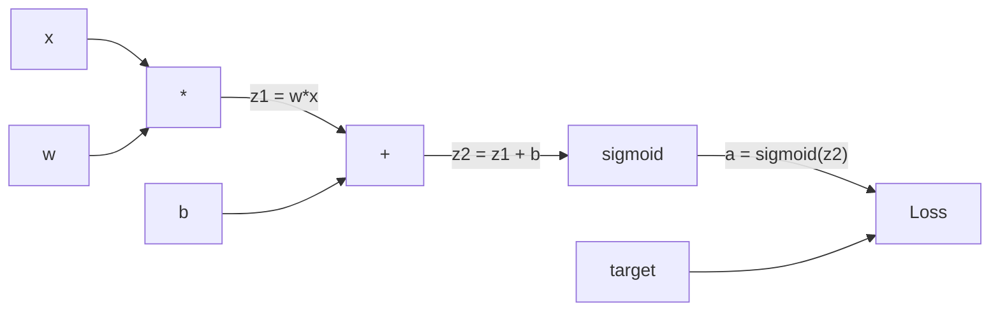
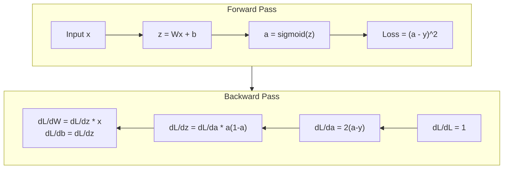
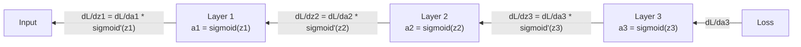

# 从零实现反向传播

> 反向传播是让学习成为可能的算法。没有它,神经网络只是一台昂贵的随机数生成器。

**类型:** 动手构建
**编程语言:** Python
**前置要求:** 第 03.02 课(多层网络)
**预计耗时:** 约 120 分钟

## 学习目标

- 实现一个基于 Value 的自动求导引擎:构建计算图,并通过拓扑排序计算梯度
- 用链式法则推导加法、乘法和 sigmoid 的反向传播
- 只用自己的反向传播引擎,在 XOR 和圆形分类上训练多层网络
- 识别深层 sigmoid 网络中的梯度消失问题,解释梯度为何指数级缩小

## 问题

你的网络有一个隐藏层:768 个输入,3072 个输出。那是 2,359,296 个权重。它做出了一次错误预测。是哪些权重造成了这个误差?逐个权重测试意味着 230 万次前向传播。而反向传播用一次反向 pass 就能算出全部 230 万个梯度。这不是优化技巧,这是"可训练"与"不可能"之间的差别。

朴素做法是:取一个权重,微小地拨动它,重跑前向传播,看损失升了还是降了——得到这个权重的梯度。然后对网络里每个权重都做一遍,再乘上数千个训练步、数百万个数据点。想训出任何有用的东西,你得用地质年代来计算。

反向传播解决了这个问题:一次前向传播,一次反向传播,所有梯度全部算出。诀窍就是把微积分里的链式法则系统地应用到计算图上。正是这个算法让深度学习变得实用——没有它,我们至今还困在玩具问题上。

## 概念

### 链式法则,作用于网络

你在第 01 阶段第 05 课见过链式法则。快速回顾:若 y = f(g(x)),则 dy/dx = f'(g(x)) * g'(x)。沿着链条把导数乘起来。

在神经网络中,"链条"是从输入到损失的一串操作:每层施加权重、加偏置、过激活,损失函数把最终输出与目标比较。反向传播沿这条链倒着走,计算每个操作对误差贡献了多少。

### 计算图

每一次前向传播都会构建一张图:每个节点是一个运算(乘、加、sigmoid),每条边前向传递数值、反向传递梯度。



前向传播:数值从左向右流。x 和 w 产生 z1 = w*x;加 b 得 z2;sigmoid 得激活 a;损失函数比较 a 与目标 y。

反向传播:梯度从右向左流。从 dL/da(损失对激活的变化率)出发,乘上 da/dz2(sigmoid 的导数)得到 dL/dz2;再拆成 dL/db(等于 dL/dz2,因为 z2 = z1 + b)和 dL/dz1;然后 dL/dw = dL/dz1 * x、dL/dx = dL/dz1 * w。

图中每个节点在反向传播时只做一件事:接住上游来的梯度,乘上自己的局部导数,传给下游。

### 前向 vs 反向



前向传播会存储每个中间值:z、a、每层的输入。反向传播需要这些存下来的值来算梯度。这就是反向传播核心的内存-计算权衡:用内存(存激活)换速度(一次传播代替数百万次)。

### 梯度如何流过网络

对一个 3 层网络,梯度逐层链式传递:



每过一层,梯度都要乘一次 sigmoid 的导数。sigmoid 的导数是 a * (1 - a),最大值只有 0.25(当 a = 0.5 时)。三层之后,梯度最多被乘了 0.25^3 = 0.0156;十层之后:0.25^10 = 0.000001。

### 梯度消失

这就是梯度消失问题:sigmoid 把输出压到 0 和 1 之间,它的导数永远小于 0.25。sigmoid 层堆得够多,梯度就缩到趋近于零。靠前的层几乎学不到东西,因为它们收到的梯度接近于零。

```
sigmoid(z):     Output range [0, 1]
sigmoid'(z):    Max value 0.25 (at z = 0)

After 5 layers:   gradient * 0.25^5 = 0.001x original
After 10 layers:  gradient * 0.25^10 = 0.000001x original
```

这就是为什么深层 sigmoid 网络几乎训练不动。解药——ReLU 及其变体——是第 04 课的主题。现在你要明白的是:反向传播本身工作得完美无缺,问题出在它穿行其间的那些函数上。

### 推导两层网络的梯度

具体推一遍:输入 x、隐藏层 sigmoid、输出层 sigmoid、MSE 损失。

前向传播:
```
z1 = W1 * x + b1
a1 = sigmoid(z1)
z2 = W2 * a1 + b2
a2 = sigmoid(z2)
L = (a2 - y)^2
```

反向传播(逐步应用链式法则):
```
dL/da2 = 2(a2 - y)
da2/dz2 = a2 * (1 - a2)
dL/dz2 = dL/da2 * da2/dz2 = 2(a2 - y) * a2 * (1 - a2)

dL/dW2 = dL/dz2 * a1
dL/db2 = dL/dz2

dL/da1 = dL/dz2 * W2
da1/dz1 = a1 * (1 - a1)
dL/dz1 = dL/da1 * da1/dz1

dL/dW1 = dL/dz1 * x
dL/db1 = dL/dz1
```

每个梯度都是从损失回溯的一串局部导数之积。反向传播的全部内容,就是这些。

```figure
backprop-vanishing
```

## 动手构建

### 第 1 步:Value 节点

计算中的每个数字都变成一个 Value。它存自己的数值、梯度,以及它是如何被创造出来的(这样它就知道反向怎么算梯度)。

```python
class Value:
    def __init__(self, data, children=(), op=''):
        self.data = data
        self.grad = 0.0
        self._backward = lambda: None
        self._children = set(children)
        self._op = op

    def __repr__(self):
        return f"Value(data={self.data:.4f}, grad={self.grad:.4f})"
```

梯度初始为 0.0,反向函数初始为空操作。`_children` 记录了哪些 Value 产生了这一个,方便稍后对图做拓扑排序。

### 第 2 步:带反向函数的运算

每个运算创建一个新 Value,并定义梯度如何经它反向流动。

```python
def __add__(self, other):
    other = other if isinstance(other, Value) else Value(other)
    out = Value(self.data + other.data, (self, other), '+')

    def _backward():
        self.grad += out.grad
        other.grad += out.grad

    out._backward = _backward
    return out

def __mul__(self, other):
    other = other if isinstance(other, Value) else Value(other)
    out = Value(self.data * other.data, (self, other), '*')

    def _backward():
        self.grad += other.data * out.grad
        other.grad += self.data * out.grad

    out._backward = _backward
    return out
```

加法:d(a+b)/da = 1,d(a+b)/db = 1,所以两个输入直接各拿一份输出的梯度。

乘法:d(a*b)/da = b,d(a*b)/db = a,每个输入拿到的是对方的数值乘上输出的梯度。

`+=` 至关重要:一个 Value 可能被多个运算使用,它的梯度是所有路径贡献之和。

### 第 3 步:sigmoid 与损失

```python
import math

def sigmoid(self):
    x = self.data
    x = max(-500, min(500, x))
    s = 1.0 / (1.0 + math.exp(-x))
    out = Value(s, (self,), 'sigmoid')

    def _backward():
        self.grad += (s * (1 - s)) * out.grad

    out._backward = _backward
    return out
```

sigmoid 的导数是 sigmoid(x) * (1 - sigmoid(x))。前向传播时我们已经算出了 sigmoid(x) = s,直接复用,零额外开销。

```python
def mse_loss(predicted, target):
    diff = predicted + Value(-target)
    return diff * diff
```

单输出的 MSE:(predicted - target)^2。我们把减法表达为与取负的 Value 相加。

### 第 4 步:反向传播

拓扑排序保证按正确顺序处理节点——一个节点的梯度被完整累加之后,才会通过它继续传播。

```python
def backward(self):
    topo = []
    visited = set()

    def build_topo(v):
        if v not in visited:
            visited.add(v)
            for child in v._children:
                build_topo(child)
            topo.append(v)

    build_topo(self)
    self.grad = 1.0
    for v in reversed(topo):
        v._backward()
```

从损失出发(梯度 = 1.0,因为 dL/dL = 1),沿排好序的图倒着走。每个节点的 `_backward` 把梯度推给它的子节点。

### 第 5 步:层与网络

```python
import random

class Neuron:
    def __init__(self, n_inputs):
        scale = (2.0 / n_inputs) ** 0.5
        self.weights = [Value(random.uniform(-scale, scale)) for _ in range(n_inputs)]
        self.bias = Value(0.0)

    def __call__(self, x):
        act = sum((wi * xi for wi, xi in zip(self.weights, x)), self.bias)
        return act.sigmoid()

    def parameters(self):
        return self.weights + [self.bias]


class Layer:
    def __init__(self, n_inputs, n_outputs):
        self.neurons = [Neuron(n_inputs) for _ in range(n_outputs)]

    def __call__(self, x):
        out = [n(x) for n in self.neurons]
        return out[0] if len(out) == 1 else out

    def parameters(self):
        params = []
        for n in self.neurons:
            params.extend(n.parameters())
        return params


class Network:
    def __init__(self, sizes):
        self.layers = []
        for i in range(len(sizes) - 1):
            self.layers.append(Layer(sizes[i], sizes[i + 1]))

    def __call__(self, x):
        for layer in self.layers:
            x = layer(x)
            if not isinstance(x, list):
                x = [x]
        return x[0] if len(x) == 1 else x

    def parameters(self):
        params = []
        for layer in self.layers:
            params.extend(layer.parameters())
        return params

    def zero_grad(self):
        for p in self.parameters():
            p.grad = 0.0
```

Neuron 接收输入,算加权和加偏置,过 sigmoid。权重初始化按 sqrt(2/n_inputs) 缩放,防止深层网络中 sigmoid 饱和。Layer 是一列 Neuron,Network 是一列 Layer。`parameters()` 方法收集所有可学习的 Value,以便更新。

### 第 6 步:在 XOR 上训练

```python
random.seed(42)
net = Network([2, 4, 1])

xor_data = [
    ([0.0, 0.0], 0.0),
    ([0.0, 1.0], 1.0),
    ([1.0, 0.0], 1.0),
    ([1.0, 1.0], 0.0),
]

learning_rate = 1.0

for epoch in range(1000):
    total_loss = Value(0.0)
    for inputs, target in xor_data:
        x = [Value(i) for i in inputs]
        pred = net(x)
        loss = mse_loss(pred, target)
        total_loss = total_loss + loss

    net.zero_grad()
    total_loss.backward()

    for p in net.parameters():
        p.data -= learning_rate * p.grad

    if epoch % 100 == 0:
        print(f"Epoch {epoch:4d} | Loss: {total_loss.data:.6f}")

print("\nXOR Results:")
for inputs, target in xor_data:
    x = [Value(i) for i in inputs]
    pred = net(x)
    print(f"  {inputs} -> {pred.data:.4f} (expected {target})")
```

观察损失下降:从随机预测到正确的 XOR 输出,完全由反向传播计算梯度、把权重推向正确方向所驱动。

### 第 7 步:圆形分类

第 02 课里,圆形分类的权重是你手调的。现在让网络自己学。

```python
random.seed(7)

def generate_circle_data(n=100):
    data = []
    for _ in range(n):
        x1 = random.uniform(-1.5, 1.5)
        x2 = random.uniform(-1.5, 1.5)
        label = 1.0 if x1 * x1 + x2 * x2 < 1.0 else 0.0
        data.append(([x1, x2], label))
    return data

circle_data = generate_circle_data(80)

circle_net = Network([2, 8, 1])
learning_rate = 0.5

for epoch in range(2000):
    random.shuffle(circle_data)
    total_loss_val = 0.0
    for inputs, target in circle_data:
        x = [Value(i) for i in inputs]
        pred = circle_net(x)
        loss = mse_loss(pred, target)
        circle_net.zero_grad()
        loss.backward()
        for p in circle_net.parameters():
            p.data -= learning_rate * p.grad
        total_loss_val += loss.data

    if epoch % 200 == 0:
        correct = 0
        for inputs, target in circle_data:
            x = [Value(i) for i in inputs]
            pred = circle_net(x)
            predicted_class = 1.0 if pred.data > 0.5 else 0.0
            if predicted_class == target:
                correct += 1
        accuracy = correct / len(circle_data) * 100
        print(f"Epoch {epoch:4d} | Loss: {total_loss_val:.4f} | Accuracy: {accuracy:.1f}%")
```

这里用的是在线 SGD——每个样本之后就更新权重,而不是累积整个批次。这样能更快打破对称性,也避免在完整损失曲面上让 sigmoid 饱和。每个 epoch 打乱数据,防止网络记住样本顺序。

没有任何手调,网络自己发现了圆形决策边界。这就是反向传播的威力:你定义结构、损失函数和数据,算法自己搞定权重。

## 投入使用

PyTorch 几行就能做完上面的一切,核心思想完全相同——autograd 在前向传播时构建计算图,再沿图反向追踪计算梯度。

```python
import torch
import torch.nn as nn

model = nn.Sequential(
    nn.Linear(2, 4),
    nn.Sigmoid(),
    nn.Linear(4, 1),
    nn.Sigmoid(),
)
optimizer = torch.optim.SGD(model.parameters(), lr=1.0)
criterion = nn.MSELoss()

X = torch.tensor([[0,0],[0,1],[1,0],[1,1]], dtype=torch.float32)
y = torch.tensor([[0],[1],[1],[0]], dtype=torch.float32)

for epoch in range(1000):
    pred = model(X)
    loss = criterion(pred, y)
    optimizer.zero_grad()
    loss.backward()
    optimizer.step()

print("PyTorch XOR Results:")
with torch.no_grad():
    for i in range(4):
        pred = model(X[i])
        print(f"  {X[i].tolist()} -> {pred.item():.4f} (expected {y[i].item()})")
```

`loss.backward()` 就是你的 `total_loss.backward()`;`optimizer.step()` 就是你手写的 `p.data -= lr * p.grad`;`optimizer.zero_grad()` 就是你的 `net.zero_grad()`。同一个算法,工业级实现。PyTorch 处理 GPU 加速、混合精度、梯度检查点和数百种层类型,但反向传播仍是同一个链式法则作用在同一张计算图上。

训练 = 前向传播 + 反向传播 + 更新权重;推理(inference)只跑前向传播,不算梯度、不做更新。这个区分很重要,因为生产环境里跑的是推理:你调用 Claude 或 GPT 这样的 API 时,你的提示词前向流过网络,token 从另一端出来,没有任何权重发生变化。而理解反向传播之所以重要,是因为那个网络里的每一个权重都是它塑造的。

## 交付

本课产出:
- `outputs/prompt-gradient-debugger.md`——一个可复用的提示词,用于诊断任意神经网络中的梯度问题(消失、爆炸、NaN)

## 练习

1. 给 Value 类添加 `__sub__` 方法(a - b = a + (-1 * b)),再实现 `__neg__` 方法。用一个简单表达式如 (a - b)^2 手算对比,验证梯度正确。

2. 给 Value 添加 `relu` 方法(输出 max(0, x),导数在 x > 0 时为 1,否则为 0)。把隐藏层的 sigmoid 换成 relu,重新在 XOR 上训练,比较收敛速度。你应该会看到训练变快——这是第 04 课的预告。

3. 给 Value 实现整数次幂的 `__pow__` 方法,用它把 `mse_loss` 换成正规的 `(predicted - target) ** 2` 写法,验证梯度与原实现一致。

4. 在训练循环里加梯度裁剪:调用 `backward()` 后,把所有梯度截断到 [-1, 1]。训练一个更深的网络(4 层以上 sigmoid),对比加与不加裁剪的损失曲线。这是你对抗梯度爆炸的第一道防线。

5. 做一个可视化:在 XOR 上训练完成后,打印网络中每个参数的梯度,找出梯度最小的是哪一层。这就是你在"概念"一节读到的梯度消失问题的实证。

## 关键术语

| 术语 | 别人的说法 | 实际含义 |
|------|----------------|----------------------|
| 反向传播(Backpropagation) | "网络在学习" | 沿计算图反向应用链式法则,算出每个权重的 dL/dw 的算法 |
| 计算图(Computational graph) | "网络结构" | 一张有向无环图:节点是运算,边前向传数值、反向传梯度 |
| 链式法则(Chain rule) | "把导数乘起来" | 若 y = f(g(x)),则 dy/dx = f'(g(x)) * g'(x)——反向传播的数学基础 |
| 梯度(Gradient) | "最陡上升方向" | 损失对某参数的偏导数——告诉你怎么改这个参数能让损失下降 |
| 梯度消失(Vanishing gradient) | "深网络学不动" | 梯度穿过 sigmoid 这类饱和激活时逐层指数级缩小 |
| 前向传播(Forward pass) | "跑网络" | 从输入依次施加每层运算得到输出,并存储中间值 |
| 反向传播(Backward pass) | "算梯度" | 逆序遍历计算图,用链式法则在每个节点累加梯度 |
| 学习率(Learning rate) | "学多快" | 控制权重更新步长的标量:w_new = w_old - lr * gradient |
| 拓扑排序(Topological sort) | "正确的顺序" | 让图中每个节点都排在它依赖的所有节点之后——保证梯度先累加完整再传播 |
| 自动求导(Autograd) | "自动微分" | 在前向计算时构建计算图并自动算梯度的系统——PyTorch 引擎做的事 |

## 延伸阅读

- Rumelhart, Hinton & Williams,"Learning representations by back-propagating errors"(1986)——让反向传播成为主流、解锁多层网络训练的论文
- 3Blue1Brown,"Neural Networks"系列(https://www.youtube.com/playlist?list=PLZHQObOWTQDNU6R1_67000Dx_ZCJB-3pi)——反向传播与网络中梯度流动的最佳可视化讲解
