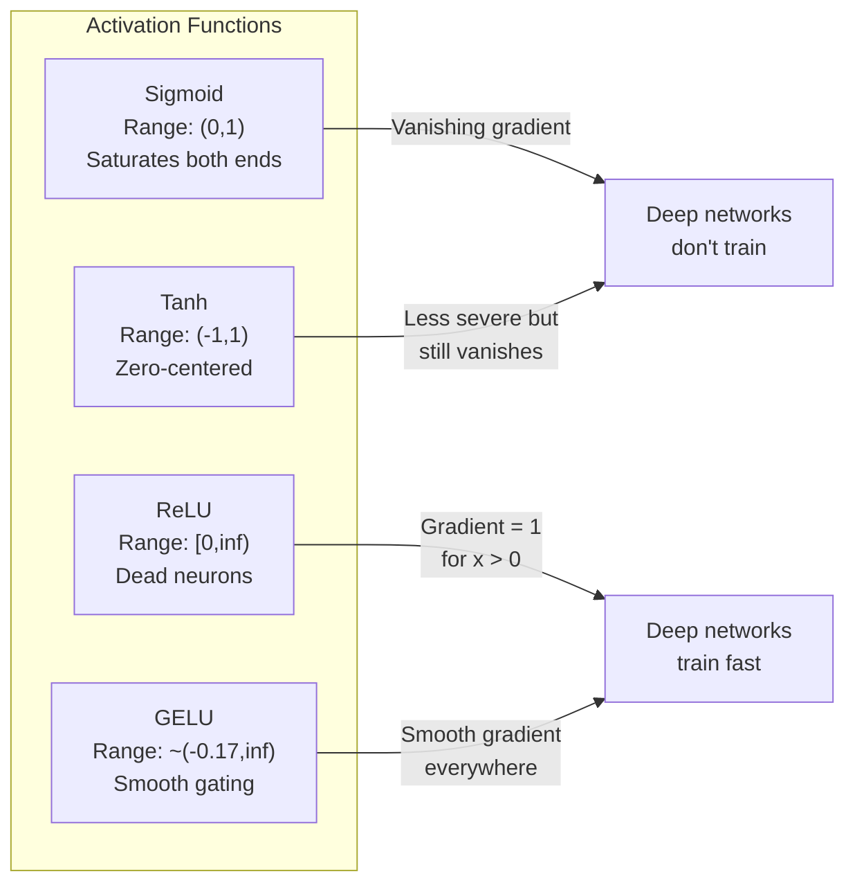
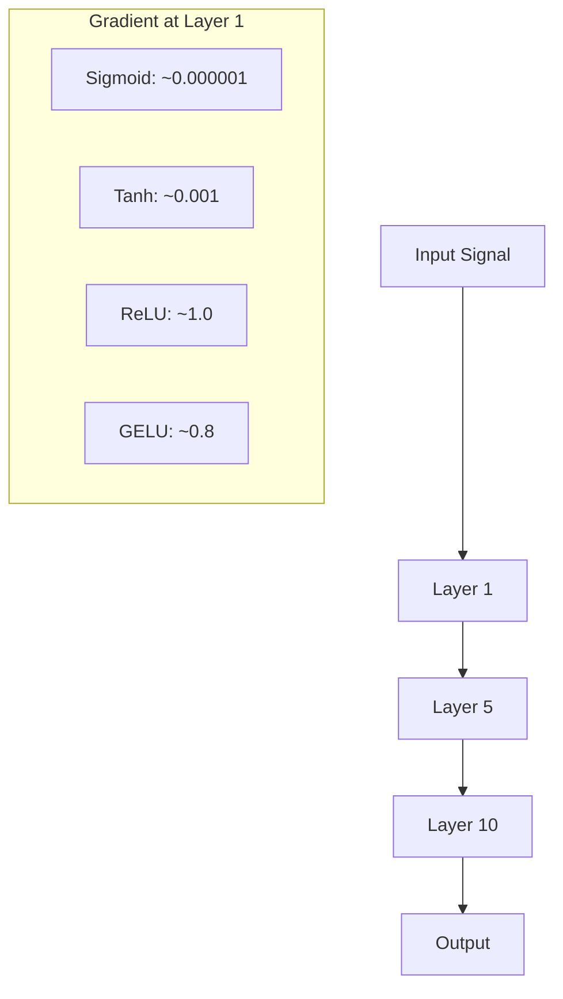
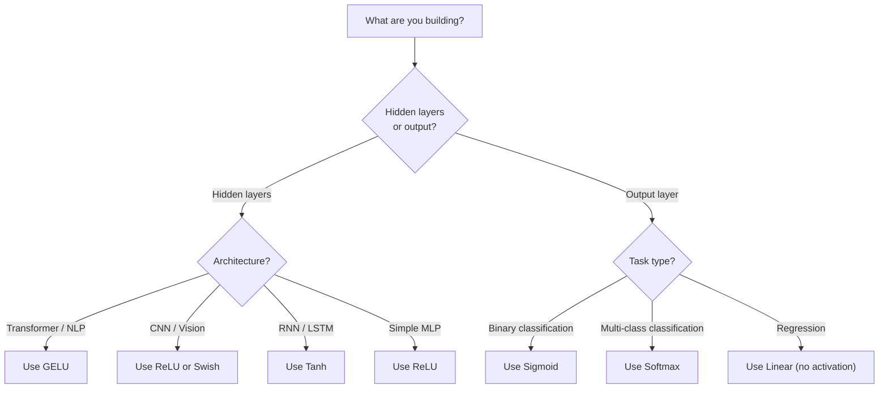

# 激活函数

> 没有非线性,你的 100 层网络只是一次花哨的矩阵乘法。激活函数是让神经网络学会"拐弯"的闸门。

**类型:** 动手构建
**编程语言:** Python
**前置要求:** 第 03.03 课(反向传播)
**预计耗时:** 约 75 分钟

## 学习目标

- 从零实现 sigmoid、tanh、ReLU、Leaky ReLU、GELU、Swish 和 softmax 及其导数
- 通过测量 10 层以上网络中不同激活下的激活幅度,诊断梯度消失问题
- 检测 ReLU 网络中的死亡神经元,解释 GELU 为何能避免这种失效模式
- 为给定架构(Transformer、CNN、RNN、输出层)选择正确的激活函数

## 问题

把两个线性变换叠起来:y = W2(W1x + b1) + b2。展开:y = W2W1x + W2b1 + b2。这就是 y = Ax + c——一个线性变换。无论叠多少线性层,结果都会塌缩成一次矩阵乘法。你的 100 层网络和单层网络的表示能力一模一样。

这不是理论上的猎奇。它意味着一个深度线性网络真的学不会 XOR,分不开螺旋数据集,认不出一张脸。没有激活函数,深度就是幻觉。

激活函数打破线性:它们把每层的输出扭过一个非线性函数,让网络有能力弯曲决策边界、逼近任意函数、真正学出东西。但选错激活函数,你的梯度会消失到零(深层网络用 sigmoid)、爆炸到无穷(无界激活配上不当初始化),或者神经元永久死亡(ReLU 配上大的负偏置)。激活函数的选择,直接决定你的网络到底学不学得动。

## 概念

### 为什么非线性必不可少

矩阵乘法是可复合的:向量先乘矩阵 A 再乘矩阵 B,等同于直接乘 AB。这意味着叠十个线性层,数学上等价于一个装着大矩阵的线性层。那么多参数、那么深——全浪费了。你需要一个东西打断这条链,这就是激活函数的作用。

证明如下。线性层计算 f(x) = Wx + b,叠两层:

```
Layer 1: h = W1 * x + b1
Layer 2: y = W2 * h + b2
```

代入:

```
y = W2 * (W1 * x + b1) + b2
y = (W2 * W1) * x + (W2 * b1 + b2)
y = A * x + c
```

只剩一层。现在在两层之间插入非线性激活 g():

```
h = g(W1 * x + b1)
y = W2 * h + b2
```

代入法失效了:W2 * g(W1 * x + b1) + b2 无法再化简成单个线性变换。网络从此可以表示非线性函数,每多一个带激活的层,就多一份表示能力。

### Sigmoid

神经网络最初的激活函数。

```
sigmoid(x) = 1 / (1 + e^(-x))
```

输出范围:(0, 1)。光滑、可微,把任意实数映射成一个类似概率的值。

导数:

```
sigmoid'(x) = sigmoid(x) * (1 - sigmoid(x))
```

这个导数的最大值是 0.25,出现在 x = 0 处。反向传播中梯度逐层连乘,十层 sigmoid 意味着梯度最多被乘上十次 0.25:

```
0.25^10 = 0.000000953674
```

不到原始信号的百万分之一。这就是梯度消失问题:靠前层里的梯度小到权重几乎不更新。网络看起来在学——靠后层的损失在降——但第一层已经冻住了。深层 sigmoid 网络根本训不动。

另一个问题:sigmoid 的输出恒为正(0 到 1),这意味着权重上的梯度永远同号,导致梯度下降时走之字形路线。

### Tanh

居中版的 sigmoid。

```
tanh(x) = (e^x - e^(-x)) / (e^x + e^(-x))
```

输出范围:(-1, 1)。以零为中心,消除了之字形问题。

导数:

```
tanh'(x) = 1 - tanh(x)^2
```

最大导数为 1.0,出现在 x = 0 处——比 sigmoid 好四倍。但梯度消失问题依然存在:输入很大或很小时,导数趋近于零。十层之后梯度照样被压垮,只是下手没那么狠。

### ReLU:破局者

修正线性单元(Rectified Linear Unit)。由 Nair 和 Hinton 于 2010 年引入深度学习(函数本身可追溯到 Fukushima 1969 年的工作),它改变了一切。

```
relu(x) = max(0, x)
```

输出范围:[0, 无穷)。导数简单到不能再简单:

```
relu'(x) = 1  if x > 0
            0  if x <= 0
```

正输入时没有梯度消失:梯度恰好是 1,原样穿过。深度网络因此变得可训练——ReLU 保住了梯度在层间的幅度。

但它有一种失效模式:神经元死亡问题。如果某个神经元的加权输入永远是负的(源于大的负偏置或倒霉的权重初始化),它的输出就永远是零,梯度永远是零,永远不会再更新——它永久死亡了。实践中,ReLU 网络里 10–40% 的神经元可能在训练中死亡。

### Leaky ReLU

对付死亡神经元最简单的办法。

```
leaky_relu(x) = x        if x > 0
                alpha * x if x <= 0
```

alpha 是个很小的常数,通常取 0.01。负侧保留一个小斜率而不是零,于是死亡神经元仍能收到梯度信号,有机会复活。

### GELU:现代默认选择

高斯误差线性单元(Gaussian Error Linear Unit),由 Hendrycks 和 Gimpel 于 2016 年提出,是 BERT、GPT 及大多数现代 Transformer 的默认激活。

```
gelu(x) = x * Phi(x)
```

其中 Phi(x) 是标准正态分布的累积分布函数。实践中用的近似式:

```
gelu(x) ~= 0.5 * x * (1 + tanh(sqrt(2/pi) * (x + 0.044715 * x^3)))
```

GELU 处处光滑,允许小的负值(不像 ReLU 把负值硬截到零),还有概率解释:它按每个输入在高斯分布下为正的概率来加权这个输入。这种平滑门控在 Transformer 架构中优于 ReLU,因为它提供更好的梯度流,并彻底避免了神经元死亡问题。

### Swish / SiLU

自门控激活函数,由 Ramachandran 等人于 2017 年通过自动搜索发现。

```
swish(x) = x * sigmoid(x)
```

Swish 的形式就是 x * sigmoid(x)。Google 通过对激活函数空间的自动搜索发现了它——一个神经网络在为神经网络设计部件。

和 GELU 一样,它光滑、非单调、允许小的负值。差别很微妙:Swish 用 sigmoid 做门控,GELU 用高斯 CDF。实践中性能几乎一致:Swish 用在 EfficientNet 和一些视觉模型里,GELU 则统治语言模型。

### Softmax:输出层激活

不用于隐藏层。softmax 把原始分数(logits)向量转换成概率分布。

```
softmax(x_i) = e^(x_i) / sum(e^(x_j) for all j)
```

每个输出都在 0 到 1 之间,全部输出之和为 1。这使它成为多分类问题的标准末层激活:最大的 logit 得到最高概率,但与 argmax 不同,softmax 可微,并且保留了相对置信度的信息。

### 形状对比



### 梯度流对比



### 什么场景用什么激活



```figure
softmax-temperature
```

## 动手构建

### 第 1 步:实现所有激活函数及其导数

每个函数接收一个 float、返回一个 float;每个导数函数接收同样的输入、返回梯度。

```python
import math

def sigmoid(x):
    x = max(-500, min(500, x))
    return 1.0 / (1.0 + math.exp(-x))

def sigmoid_derivative(x):
    s = sigmoid(x)
    return s * (1 - s)

def tanh_act(x):
    return math.tanh(x)

def tanh_derivative(x):
    t = math.tanh(x)
    return 1 - t * t

def relu(x):
    return max(0.0, x)

def relu_derivative(x):
    return 1.0 if x > 0 else 0.0

def leaky_relu(x, alpha=0.01):
    return x if x > 0 else alpha * x

def leaky_relu_derivative(x, alpha=0.01):
    return 1.0 if x > 0 else alpha

def gelu(x):
    return 0.5 * x * (1 + math.tanh(math.sqrt(2 / math.pi) * (x + 0.044715 * x ** 3)))

def gelu_derivative(x):
    phi = 0.5 * (1 + math.erf(x / math.sqrt(2)))
    pdf = math.exp(-0.5 * x * x) / math.sqrt(2 * math.pi)
    return phi + x * pdf

def swish(x):
    return x * sigmoid(x)

def swish_derivative(x):
    s = sigmoid(x)
    return s + x * s * (1 - s)

def softmax(xs):
    max_x = max(xs)
    exps = [math.exp(x - max_x) for x in xs]
    total = sum(exps)
    return [e / total for e in exps]
```

### 第 2 步:可视化梯度在哪里死掉

在 -5 到 5 之间取 100 个等间距点计算梯度,打印文本直方图,展示每个激活函数的梯度在哪些区域接近零。

```python
def gradient_scan(name, derivative_fn, start=-5, end=5, n=100):
    step = (end - start) / n
    near_zero = 0
    healthy = 0
    for i in range(n):
        x = start + i * step
        g = derivative_fn(x)
        if abs(g) < 0.01:
            near_zero += 1
        else:
            healthy += 1
    pct_dead = near_zero / n * 100
    print(f"{name:15s}: {healthy:3d} healthy, {near_zero:3d} near-zero ({pct_dead:.0f}% dead zone)")

gradient_scan("Sigmoid", sigmoid_derivative)
gradient_scan("Tanh", tanh_derivative)
gradient_scan("ReLU", relu_derivative)
gradient_scan("Leaky ReLU", leaky_relu_derivative)
gradient_scan("GELU", gelu_derivative)
gradient_scan("Swish", swish_derivative)
```

### 第 3 步:梯度消失实验

让一个信号分别用 sigmoid 和 ReLU 前向穿过 N 层,测量激活幅度如何变化。

```python
import random

def vanishing_gradient_experiment(activation_fn, name, n_layers=10, n_inputs=5):
    random.seed(42)
    values = [random.gauss(0, 1) for _ in range(n_inputs)]

    print(f"\n{name} through {n_layers} layers:")
    for layer in range(n_layers):
        weights = [random.gauss(0, 1) for _ in range(n_inputs)]
        z = sum(w * v for w, v in zip(weights, values))
        activated = activation_fn(z)
        magnitude = abs(activated)
        bar = "#" * int(magnitude * 20)
        print(f"  Layer {layer+1:2d}: magnitude = {magnitude:.6f} {bar}")
        values = [activated] * n_inputs

vanishing_gradient_experiment(sigmoid, "Sigmoid")
vanishing_gradient_experiment(relu, "ReLU")
vanishing_gradient_experiment(gelu, "GELU")
```

### 第 4 步:死亡神经元检测器

创建一个 ReLU 网络,灌入随机输入,数一数有多少神经元从未激活。

```python
def dead_neuron_detector(n_inputs=5, hidden_size=20, n_samples=1000):
    random.seed(0)
    weights = [[random.gauss(0, 1) for _ in range(n_inputs)] for _ in range(hidden_size)]
    biases = [random.gauss(0, 1) for _ in range(hidden_size)]

    fire_counts = [0] * hidden_size

    for _ in range(n_samples):
        inputs = [random.gauss(0, 1) for _ in range(n_inputs)]
        for neuron_idx in range(hidden_size):
            z = sum(w * x for w, x in zip(weights[neuron_idx], inputs)) + biases[neuron_idx]
            if relu(z) > 0:
                fire_counts[neuron_idx] += 1

    dead = sum(1 for c in fire_counts if c == 0)
    rarely_fire = sum(1 for c in fire_counts if 0 < c < n_samples * 0.05)
    healthy = hidden_size - dead - rarely_fire

    print(f"\nDead Neuron Report ({hidden_size} neurons, {n_samples} samples):")
    print(f"  Dead (never fired):     {dead}")
    print(f"  Barely alive (<5%):     {rarely_fire}")
    print(f"  Healthy:                {healthy}")
    print(f"  Dead neuron rate:       {dead/hidden_size*100:.1f}%")

    for i, c in enumerate(fire_counts):
        status = "DEAD" if c == 0 else "WEAK" if c < n_samples * 0.05 else "OK"
        bar = "#" * (c * 40 // n_samples)
        print(f"  Neuron {i:2d}: {c:4d}/{n_samples} fires [{status:4s}] {bar}")

dead_neuron_detector()
```

### 第 5 步:训练对比——Sigmoid vs ReLU vs GELU

用同一个两层网络、三种不同激活函数,在圆形数据集(圆内为类 1,圆外为类 0)上训练,比较收敛速度。

```python
def make_circle_data(n=200, seed=42):
    random.seed(seed)
    data = []
    for _ in range(n):
        x = random.uniform(-2, 2)
        y = random.uniform(-2, 2)
        label = 1.0 if x * x + y * y < 1.5 else 0.0
        data.append(([x, y], label))
    return data


class ActivationNetwork:
    def __init__(self, activation_fn, activation_deriv, hidden_size=8, lr=0.1):
        random.seed(0)
        self.act = activation_fn
        self.act_d = activation_deriv
        self.lr = lr
        self.hidden_size = hidden_size

        self.w1 = [[random.gauss(0, 0.5) for _ in range(2)] for _ in range(hidden_size)]
        self.b1 = [0.0] * hidden_size
        self.w2 = [random.gauss(0, 0.5) for _ in range(hidden_size)]
        self.b2 = 0.0

    def forward(self, x):
        self.x = x
        self.z1 = []
        self.h = []
        for i in range(self.hidden_size):
            z = self.w1[i][0] * x[0] + self.w1[i][1] * x[1] + self.b1[i]
            self.z1.append(z)
            self.h.append(self.act(z))

        self.z2 = sum(self.w2[i] * self.h[i] for i in range(self.hidden_size)) + self.b2
        self.out = sigmoid(self.z2)
        return self.out

    def backward(self, target):
        error = self.out - target
        d_out = error * self.out * (1 - self.out)

        for i in range(self.hidden_size):
            d_h = d_out * self.w2[i] * self.act_d(self.z1[i])
            self.w2[i] -= self.lr * d_out * self.h[i]
            for j in range(2):
                self.w1[i][j] -= self.lr * d_h * self.x[j]
            self.b1[i] -= self.lr * d_h
        self.b2 -= self.lr * d_out

    def train(self, data, epochs=200):
        losses = []
        for epoch in range(epochs):
            total_loss = 0
            correct = 0
            for x, y in data:
                pred = self.forward(x)
                self.backward(y)
                total_loss += (pred - y) ** 2
                if (pred >= 0.5) == (y >= 0.5):
                    correct += 1
            avg_loss = total_loss / len(data)
            accuracy = correct / len(data) * 100
            losses.append(avg_loss)
            if epoch % 50 == 0 or epoch == epochs - 1:
                print(f"    Epoch {epoch:3d}: loss={avg_loss:.4f}, accuracy={accuracy:.1f}%")
        return losses


data = make_circle_data()

configs = [
    ("Sigmoid", sigmoid, sigmoid_derivative),
    ("ReLU", relu, relu_derivative),
    ("GELU", gelu, gelu_derivative),
]

results = {}
for name, act_fn, act_d_fn in configs:
    print(f"\n=== Training with {name} ===")
    net = ActivationNetwork(act_fn, act_d_fn, hidden_size=8, lr=0.1)
    losses = net.train(data, epochs=200)
    results[name] = losses

print("\n=== Final Loss Comparison ===")
for name, losses in results.items():
    print(f"  {name:10s}: start={losses[0]:.4f} -> end={losses[-1]:.4f} (improvement: {(1 - losses[-1]/losses[0])*100:.1f}%)")
```

## 投入使用

PyTorch 以函数式和模块式两种形式提供了所有这些激活:

```python
import torch
import torch.nn as nn
import torch.nn.functional as F

x = torch.randn(4, 10)

relu_out = F.relu(x)
gelu_out = F.gelu(x)
sigmoid_out = torch.sigmoid(x)
swish_out = F.silu(x)

logits = torch.randn(4, 5)
probs = F.softmax(logits, dim=1)

model = nn.Sequential(
    nn.Linear(10, 64),
    nn.GELU(),
    nn.Linear(64, 32),
    nn.GELU(),
    nn.Linear(32, 5),
)
```

Transformer 的隐藏层用 GELU;CNN 的隐藏层用 ReLU;分类任务的输出层用 softmax;回归任务的输出层不加激活(线性);要输出概率用 sigmoid。就这么多。先用这些默认值,有了证据再改。

RNN 和 LSTM 的隐藏状态用 tanh、门控用 sigmoid,但如果你今天从零造轮子,大概率不会用 RNN。如果你的 ReLU 网络里神经元在死亡,就换 GELU——除非有具体理由,否则别急着用 Leaky ReLU:GELU 既解决神经元死亡问题,又提供更好的梯度流。

## 交付

本课产出:
- `outputs/prompt-activation-selector.md`——一个可复用的提示词,帮你为任意架构挑选合适的激活函数

## 练习

1. 实现 Parametric ReLU(PReLU),让负侧斜率 alpha 成为可学习参数。在圆形数据集上训练,与固定斜率的 Leaky ReLU 对比。

2. 把梯度消失实验加到 50 层。画出 sigmoid、tanh、ReLU、GELU 各自的逐层幅度曲线。每种激活的信号分别在哪一层实际上归零?

3. 实现 ELU(指数线性单元):elu(x) = x(x > 0 时),alpha * (e^x - 1)(x <= 0 时)。在同一个网络上对比它与 ReLU 的神经元死亡率。

4. 构建一个"梯度健康监视器",在训练过程中运行:每个 epoch 计算各层的平均梯度幅度,当某层梯度低于 0.001 或超过 100 时打印警告。

5. 把训练对比实验的数据集从圆形换成第 01 课的 XOR。哪种激活在 XOR 上收敛最快?为什么结果与圆形数据集不同?

## 关键术语

| 术语 | 别人的说法 | 实际含义 |
|------|----------------|----------------------|
| 激活函数(Activation function) | "非线性的那部分" | 施加在每个神经元输出上的函数,打破线性,让网络能学习非线性映射 |
| 梯度消失(Vanishing gradient) | "深网络里梯度没了" | 激活函数导数小于 1 时,梯度逐层指数缩小,靠前的层无法训练 |
| 梯度爆炸(Exploding gradient) | "梯度炸了" | 等效乘数大于 1 时,梯度逐层指数增长,训练失稳 |
| 死亡神经元(Dead neuron) | "不学了的神经元" | 输入恒为负的 ReLU 神经元,输出恒为零、梯度恒为零 |
| sigmoid | "把值压到 0-1" | logistic 函数 1/(1+e^-x),历史地位重要,但在深层网络中导致梯度消失 |
| ReLU | "把负的截成零" | max(0, x)——靠保住梯度幅度让深度学习变得实用的激活函数 |
| GELU | "Transformer 的激活" | 高斯误差线性单元,一种按输入为正的概率加权的平滑激活 |
| Swish/SiLU | "自门控 ReLU" | x * sigmoid(x),通过自动搜索发现,用于 EfficientNet |
| softmax | "把分数变成概率" | 把 logits 向量归一化为概率分布:所有值在 (0,1) 且和为 1 |
| Leaky ReLU | "不会死的 ReLU" | max(alpha*x, x),alpha 很小(0.01),靠允许小的负梯度防止神经元死亡 |
| 饱和(Saturation) | "sigmoid 的平坦区" | 激活函数导数趋近于零的区域,梯度流被阻断 |
| logit | "softmax 之前的原始分数" | 应用 softmax 或 sigmoid 之前,最后一层的未归一化输出 |

## 延伸阅读

- Nair & Hinton,"Rectified Linear Units Improve Restricted Boltzmann Machines"(2010)——把 ReLU 引入深度学习、让深层网络可训练的论文
- Hendrycks & Gimpel,"Gaussian Error Linear Units (GELUs)"(2016)——提出了后来成为 Transformer 默认选择的激活函数
- Ramachandran et al.,"Searching for Activation Functions"(2017)——用自动搜索发现 Swish,证明激活函数的设计可以自动化
- Glorot & Bengio,"Understanding the difficulty of training deep feedforward neural networks"(2010)——诊断梯度消失/爆炸问题并提出 Xavier 初始化的论文
- Goodfellow, Bengio, Courville,"Deep Learning"第 6.3 章(https://www.deeplearningbook.org/)——对隐藏单元与激活函数的严谨论述
