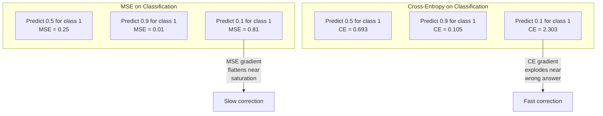
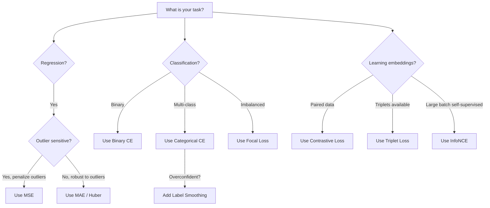
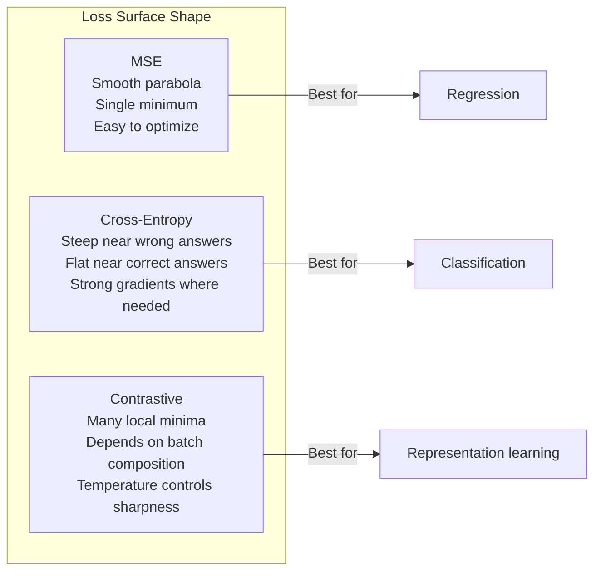

# 损失函数

> 网络做出预测,真值说不对。错得有多离谱?这个数字就是损失。选错损失函数,你的模型就是在为完全错误的目标做优化。

**类型:** 动手构建
**编程语言:** Python
**前置要求:** 第 03.04 课(激活函数)
**预计耗时:** 约 75 分钟

## 学习目标

- 从零实现 MSE、二元交叉熵、多类交叉熵和对比损失(InfoNCE)及其梯度
- 通过演示"对所有输入都预测 0.5"这一失效模式,解释 MSE 为什么不适合分类
- 对交叉熵应用标签平滑,说明它如何防止过度自信的预测
- 为回归、二分类、多分类和嵌入学习任务选择正确的损失函数

## 问题

在分类问题上最小化 MSE 的模型,会自信地对所有输入都预测 0.5。它确实在最小化损失,它也确实是废物。

损失函数是你的模型真正优化的唯一东西——不是准确率,不是 F1,不是你汇报给经理的随便什么指标。优化器取损失函数的梯度,调整权重让那个数字变小。如果损失函数没有捕捉到你真正在乎的东西,模型就会找到数学上最省事的办法来满足它,而那几乎从来不是你想要的。

举个具体的例子。你有一个二分类任务,两类各占 50%,用 MSE 作损失。模型对每个输入都预测 0.5,平均 MSE 是 0.25——不学任何东西就能达到的最小值。模型判别能力为零,但技术上它已经把你的损失函数压到了最小。换成交叉熵,同一个模型就被迫把预测推向 0 或 1:因为 -log(0.5) = 0.693 是糟糕的损失,而 -log(0.99) = 0.01 会奖励自信且正确的预测。损失函数的选择,就是"会学习的模型"和"会钻指标空子的模型"之间的差别。

更麻烦的还在后面。自监督学习里你连标签都没有,对比损失定义了全部学习信号:什么算相似、什么算不同、模型该用多大力气把它们推开。对比损失搞错了,你的嵌入就会塌缩成一个点——每个输入都映射到同一个向量。技术上损失为零,实际上一文不值。

## 概念

### 均方误差(MSE)

回归问题的默认选择:计算预测与目标的平方差,对所有样本取平均。

```
MSE = (1/n) * sum((y_pred - y_true)^2)
```

平方为什么重要:它按平方级惩罚大误差。误差为 2,代价是误差为 1 的 4 倍;误差为 10,代价是 100 倍。这让 MSE 对离群点敏感——一个错得离谱的预测会主导整个损失。

真实数字:你的模型预测房价,大多数房子误差 1 万美元,但有一栋豪宅差了 20 万美元,MSE 就会拼命去修那一栋豪宅,代价可能是损害另外 99 栋房子上的表现。

MSE 对预测的梯度:

```
dMSE/dy_pred = (2/n) * (y_pred - y_true)
```

对误差是线性的:误差越大,梯度越大。这在回归里是优点(大误差需要大修正),在分类里却是缺陷(你想按指数级惩罚自信的错误答案,而不是线性)。

### 交叉熵损失

分类问题的损失函数,根植于信息论——它衡量预测概率分布与真实分布之间的差异。

**二元交叉熵(BCE):**

```
BCE = -(y * log(p) + (1 - y) * log(1 - p))
```

其中 y 是真实标签(0 或 1),p 是预测概率。

为什么 -log(p) 有效:真实标签为 1 时,预测 p = 0.99 的损失是 -log(0.99) = 0.01;预测 p = 0.01 的损失是 -log(0.01) = 4.6。460 倍的差距,这就是交叉熵有效的原因:它无情地惩罚自信的错误预测,对自信的正确预测几乎不罚。

梯度讲的是同一个故事:

```
dBCE/dp = -(y/p) + (1-y)/(1-p)
```

当 y = 1 且 p 接近零时,梯度是 -1/p,趋向负无穷——模型收到一个巨大的纠偏信号。当 p 接近 1 时,梯度微乎其微:已经对了,没什么可修的。

**多类交叉熵:**

用于目标为 one-hot 编码的多分类问题。

```
CCE = -sum(y_i * log(p_i))
```

只有真实类别对损失有贡献(因为其他 y_i 都是零)。10 个类别时,正确类别只拿到概率 0.1(相当于瞎猜),损失是 -log(0.1) = 2.3;正确类别拿到概率 0.9,损失是 -log(0.9) = 0.105。模型由此学会把概率质量集中到正确答案上。

### 为什么 MSE 不适合分类



预测接近 0 或 1 时,MSE 的梯度会变平(sigmoid 饱和所致)。交叉熵的梯度恰好补上这个缺口:-log 抵消了 sigmoid 的平坦区域,在最需要的地方给出强梯度。

### 标签平滑

标准的 one-hot 标签是在宣称"这个样本 100% 是第 3 类,其余类别都是 0%"。这是个很强的断言。标签平滑把它软化:

```
smooth_label = (1 - alpha) * one_hot + alpha / num_classes
```

alpha = 0.1、10 个类别时,目标不再是 [0, 0, 1, 0, ...],而是 [0.01, 0.01, 0.91, 0.01, ...]。模型瞄准的是 0.91,而不是 1.0。

为什么有效:想通过 softmax 输出精确的 1.0,模型就得把 logit 推向无穷大。这导致过度自信、损害泛化,并让模型对分布偏移变得脆弱。标签平滑把目标封顶在 0.9(alpha=0.1 时),让 logit 保持在合理范围。GPT 和大多数现代模型都使用标签平滑或等价手段。

### 对比损失

没有标签,没有类别,只有成对的输入和一个问题:这两个像不像?

**SimCLR 风格的对比损失(NT-Xent / InfoNCE):**

取一张图,做两个增强视图(裁剪、旋转、颜色抖动),它们是"正样本对"——嵌入应该相似;批次里其他所有图与它组成"负样本对"——嵌入应该不同。

```
L = -log(exp(sim(z_i, z_j) / tau) / sum(exp(sim(z_i, z_k) / tau)))
```

其中 sim() 是余弦相似度,z_i 和 z_j 是正样本对,求和遍历所有负样本,tau(温度)控制分布的尖锐程度。温度越低,负样本越"难",分离越激进。

真实数字:批次大小 256 意味着每个正样本对有 255 个负样本;温度 tau = 0.07(SimCLR 默认值)。这个损失长得像对相似度做 softmax——它希望正样本对的相似度在全部 256 个候选中最高。

**三元组损失(Triplet Loss):**

接收三个输入:锚点、正样本(同类)、负样本(异类)。

```
L = max(0, d(anchor, positive) - d(anchor, negative) + margin)
```

间隔 margin(通常 0.2–1.0)强制正、负样本距离之间留出最小间隙。如果负样本已经离得够远,损失为零——没有梯度、不做更新。这让训练高效,但需要小心的三元组挖掘(挑选离锚点近的难负样本)。

### Focal Loss

为不平衡数据集设计。标准交叉熵对所有分对的样本一视同仁;focal loss 给容易样本降权:

```
FL = -alpha * (1 - p_t)^gamma * log(p_t)
```

其中 p_t 是真实类别的预测概率,gamma 控制聚焦程度。gamma = 0 时就是标准交叉熵;gamma = 2(默认值)时:

- 容易样本(p_t = 0.9):权重 = (0.1)^2 = 0.01,实际上被忽略。
- 困难样本(p_t = 0.1):权重 = (0.9)^2 = 0.81,拿到完整的梯度信号。

Focal loss 由 Lin 等人提出,用于目标检测——那里 99% 的候选区域是背景(容易负样本)。没有 focal loss,模型会淹没在海量容易的背景样本里,永远学不会检测物体;有了它,模型就能把容量集中在真正重要的困难、模糊样本上。

### 损失函数决策树



### 损失曲面



```figure
cross-entropy-loss
```

## 动手构建

### 第 1 步:MSE 及其梯度

```python
def mse(predictions, targets):
    n = len(predictions)
    total = 0.0
    for p, t in zip(predictions, targets):
        total += (p - t) ** 2
    return total / n

def mse_gradient(predictions, targets):
    n = len(predictions)
    grads = []
    for p, t in zip(predictions, targets):
        grads.append(2.0 * (p - t) / n)
    return grads
```

### 第 2 步:二元交叉熵

log(0) 的问题是真实存在的:模型对正样本恰好预测 0 时,log(0) = 负无穷。截断(clip)可以防止这种情况。

```python
import math

def binary_cross_entropy(predictions, targets, eps=1e-15):
    n = len(predictions)
    total = 0.0
    for p, t in zip(predictions, targets):
        p_clipped = max(eps, min(1 - eps, p))
        total += -(t * math.log(p_clipped) + (1 - t) * math.log(1 - p_clipped))
    return total / n

def bce_gradient(predictions, targets, eps=1e-15):
    grads = []
    for p, t in zip(predictions, targets):
        p_clipped = max(eps, min(1 - eps, p))
        grads.append(-(t / p_clipped) + (1 - t) / (1 - p_clipped))
    return grads
```

### 第 3 步:softmax + 多类交叉熵

softmax 把原始 logit 转成概率,然后对 one-hot 目标计算交叉熵。

```python
def softmax(logits):
    max_val = max(logits)
    exps = [math.exp(x - max_val) for x in logits]
    total = sum(exps)
    return [e / total for e in exps]

def categorical_cross_entropy(logits, target_index, eps=1e-15):
    probs = softmax(logits)
    p = max(eps, probs[target_index])
    return -math.log(p)

def cce_gradient(logits, target_index):
    probs = softmax(logits)
    grads = list(probs)
    grads[target_index] -= 1.0
    return grads
```

softmax + 交叉熵的梯度化简得极为漂亮:真实类别是(预测概率 - 1),其余类别就是(预测概率)。这个优雅的化简不是巧合——这正是 softmax 与交叉熵总是成对出现的原因。

### 第 4 步:标签平滑

```python
def label_smoothed_cce(logits, target_index, num_classes, alpha=0.1, eps=1e-15):
    probs = softmax(logits)
    loss = 0.0
    for i in range(num_classes):
        if i == target_index:
            smooth_target = 1.0 - alpha + alpha / num_classes
        else:
            smooth_target = alpha / num_classes
        p = max(eps, probs[i])
        loss += -smooth_target * math.log(p)
    return loss
```

### 第 5 步:对比损失(简化 InfoNCE)

```python
def cosine_similarity(a, b):
    dot = sum(x * y for x, y in zip(a, b))
    norm_a = math.sqrt(sum(x * x for x in a))
    norm_b = math.sqrt(sum(x * x for x in b))
    if norm_a < 1e-10 or norm_b < 1e-10:
        return 0.0
    return dot / (norm_a * norm_b)

def contrastive_loss(anchor, positive, negatives, temperature=0.07):
    sim_pos = cosine_similarity(anchor, positive) / temperature
    sim_negs = [cosine_similarity(anchor, neg) / temperature for neg in negatives]

    max_sim = max(sim_pos, max(sim_negs)) if sim_negs else sim_pos
    exp_pos = math.exp(sim_pos - max_sim)
    exp_negs = [math.exp(s - max_sim) for s in sim_negs]
    total_exp = exp_pos + sum(exp_negs)

    return -math.log(max(1e-15, exp_pos / total_exp))
```

### 第 6 步:分类上 MSE vs 交叉熵

用第 04 课的同一个网络(圆形数据集),分别用两种损失训练,看交叉熵收敛得更快。

```python
import random

def sigmoid(x):
    x = max(-500, min(500, x))
    return 1.0 / (1.0 + math.exp(-x))

def make_circle_data(n=200, seed=42):
    random.seed(seed)
    data = []
    for _ in range(n):
        x = random.uniform(-2, 2)
        y = random.uniform(-2, 2)
        label = 1.0 if x * x + y * y < 1.5 else 0.0
        data.append(([x, y], label))
    return data


class LossComparisonNetwork:
    def __init__(self, loss_type="bce", hidden_size=8, lr=0.1):
        random.seed(0)
        self.loss_type = loss_type
        self.lr = lr
        self.hidden_size = hidden_size

        self.w1 = [[random.gauss(0, 0.5) for _ in range(2)] for _ in range(hidden_size)]
        self.b1 = [0.0] * hidden_size
        self.w2 = [random.gauss(0, 0.5) for _ in range(hidden_size)]
        self.b2 = 0.0

    def forward(self, x):
        self.x = x
        self.z1 = []
        self.h = []
        for i in range(self.hidden_size):
            z = self.w1[i][0] * x[0] + self.w1[i][1] * x[1] + self.b1[i]
            self.z1.append(z)
            self.h.append(max(0.0, z))

        self.z2 = sum(self.w2[i] * self.h[i] for i in range(self.hidden_size)) + self.b2
        self.out = sigmoid(self.z2)
        return self.out

    def backward(self, target):
        if self.loss_type == "mse":
            d_loss = 2.0 * (self.out - target)
        else:
            eps = 1e-15
            p = max(eps, min(1 - eps, self.out))
            d_loss = -(target / p) + (1 - target) / (1 - p)

        d_sigmoid = self.out * (1 - self.out)
        d_out = d_loss * d_sigmoid

        for i in range(self.hidden_size):
            d_relu = 1.0 if self.z1[i] > 0 else 0.0
            d_h = d_out * self.w2[i] * d_relu
            self.w2[i] -= self.lr * d_out * self.h[i]
            for j in range(2):
                self.w1[i][j] -= self.lr * d_h * self.x[j]
            self.b1[i] -= self.lr * d_h
        self.b2 -= self.lr * d_out

    def compute_loss(self, pred, target):
        if self.loss_type == "mse":
            return (pred - target) ** 2
        else:
            eps = 1e-15
            p = max(eps, min(1 - eps, pred))
            return -(target * math.log(p) + (1 - target) * math.log(1 - p))

    def train(self, data, epochs=200):
        losses = []
        for epoch in range(epochs):
            total_loss = 0.0
            correct = 0
            for x, y in data:
                pred = self.forward(x)
                self.backward(y)
                total_loss += self.compute_loss(pred, y)
                if (pred >= 0.5) == (y >= 0.5):
                    correct += 1
            avg_loss = total_loss / len(data)
            accuracy = correct / len(data) * 100
            losses.append((avg_loss, accuracy))
            if epoch % 50 == 0 or epoch == epochs - 1:
                print(f"    Epoch {epoch:3d}: loss={avg_loss:.4f}, accuracy={accuracy:.1f}%")
        return losses
```

## 投入使用

PyTorch 提供了所有标准损失函数,并内置数值稳定性:

```python
import torch
import torch.nn as nn
import torch.nn.functional as F

predictions = torch.tensor([0.9, 0.1, 0.7], requires_grad=True)
targets = torch.tensor([1.0, 0.0, 1.0])

mse_loss = F.mse_loss(predictions, targets)
bce_loss = F.binary_cross_entropy(predictions, targets)

logits = torch.randn(4, 10)
labels = torch.tensor([3, 7, 1, 9])
ce_loss = F.cross_entropy(logits, labels)
ce_smooth = F.cross_entropy(logits, labels, label_smoothing=0.1)
```

要用 `F.cross_entropy`(而不是 `F.nll_loss` 加手动 softmax)。它把 log-softmax 和负对数似然合成一步数值稳定的运算。先单独做 softmax 再取 log 稳定性更差——大指数相减会丢精度。

做对比学习,多数团队用自定义实现或 `lightly`、`pytorch-metric-learning` 这类库。核心循环永远相同:算两两相似度、对正负样本做 softmax、反向传播。

## 交付

本课产出:
- `outputs/prompt-loss-function-selector.md`——一个可复用的损失函数选型提示词
- `outputs/prompt-loss-debugger.md`——损失曲线不对劲时的诊断提示词

## 练习

1. 实现 Huber 损失(平滑 L1 损失):小误差时是 MSE,大误差时是 MAE。训练一个回归网络拟合 y = sin(x),给 5% 的训练目标加上随机噪声(离群点),比较 MSE 与 Huber 的最终测试误差。

2. 把 focal loss 加入二分类训练循环。构造一个不平衡数据集(90% 类 0,10% 类 1),训练 200 个 epoch 后,比较标准 BCE 与 focal loss(gamma=2)在少数类召回率上的差异。

3. 实现带"半难负样本挖掘"的三元组损失。生成 5 个类别的二维嵌入数据:对每个锚点,找出仍比正样本更远的最难负样本(半难)。与随机选三元组的收敛速度做对比。

4. 重跑 MSE vs 交叉熵对比实验,但这次记录训练中每层的梯度幅度,画出每个 epoch 的平均梯度范数。验证在模型最不确定的早期 epoch,交叉熵产生了更大的梯度。

5. 实现 KL 散度损失,验证当真实分布为 one-hot 时,最小化 KL(真实 || 预测)与交叉熵给出相同梯度。然后尝试软目标(如知识蒸馏):让"真实"分布来自教师模型的 softmax 输出。

## 关键术语

| 术语 | 别人的说法 | 实际含义 |
|------|----------------|----------------------|
| 损失函数(Loss function) | "模型有多错" | 把预测和目标映射到一个标量的可微函数,优化器负责最小化它 |
| MSE | "平均平方误差" | 预测与目标平方差的均值,按平方级惩罚大误差 |
| 交叉熵(Cross-entropy) | "分类用的损失" | 用 -log(p) 衡量预测概率分布与真实分布之间的差异 |
| 二元交叉熵(Binary cross-entropy) | "BCE" | 两类情形的交叉熵:-(y*log(p) + (1-y)*log(1-p)) |
| 标签平滑(Label smoothing) | "把目标放软" | 用软值(如 0.1/0.9)替换硬 0/1 目标,防止过度自信、改善泛化 |
| 对比损失(Contrastive loss) | "拉近推远" | 通过让相似对在嵌入空间靠近、不相似对远离来学习表示的损失 |
| InfoNCE | "CLIP/SimCLR 的损失" | 对相似度分数做温度缩放的归一化交叉熵,把对比学习当作分类 |
| Focal loss | "数据不平衡的解药" | 用 (1-p_t)^gamma 加权的交叉熵,降低容易样本权重、聚焦困难样本 |
| 三元组损失(Triplet loss) | "锚点-正样本-负样本" | 在嵌入空间中,让锚点到正样本的距离比到负样本至少近一个 margin |
| 温度(Temperature) | "尖锐度旋钮" | 施加在 logit/相似度上的标量除数,控制分布的尖锐程度;越低越尖锐 |

## 延伸阅读

- Lin et al.,"Focal Loss for Dense Object Detection"(2017)——为处理目标检测(RetinaNet)中极端类别不平衡而提出 focal loss
- Chen et al.,"A Simple Framework for Contrastive Learning of Visual Representations"(SimCLR, 2020)——用 NT-Xent 损失定义了现代对比学习流水线
- Szegedy et al.,"Rethinking the Inception Architecture"(2016)——把标签平滑作为正则化技术引入,如今已是大多数大模型的标配
- Hinton et al.,"Distilling the Knowledge in a Neural Network"(2015)——用软目标和 KL 散度做知识蒸馏,模型压缩的奠基之作
