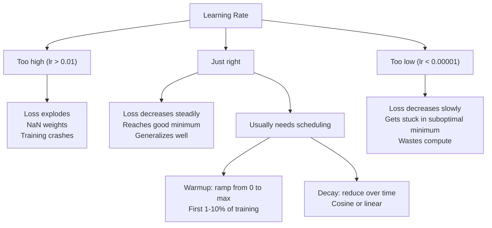
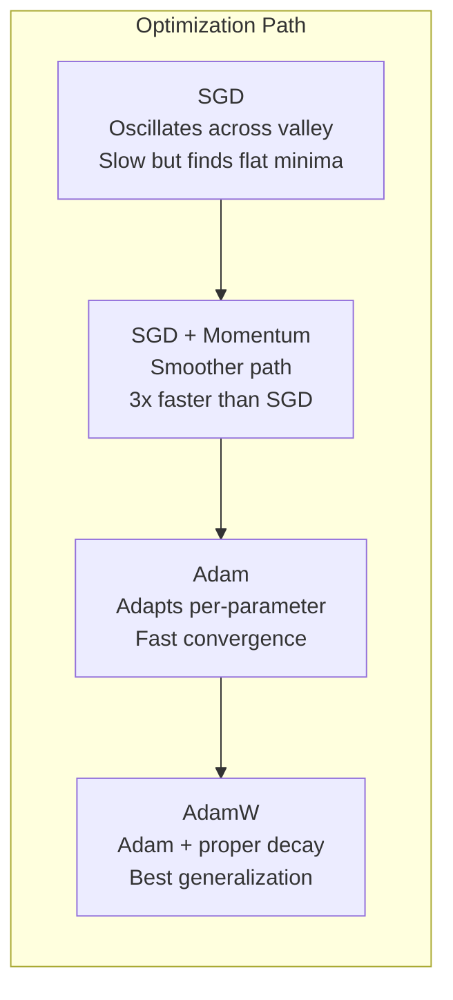
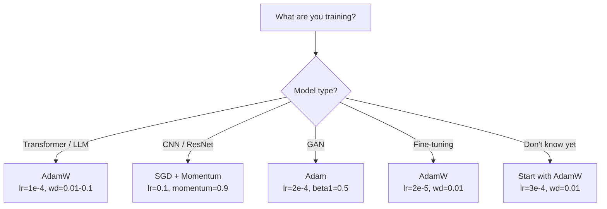

# 优化器

> 梯度下降告诉你往哪个方向走,却不说走多远、走多快。SGD 是指南针,Adam 是带实时路况的 GPS。

**类型:** 动手构建
**编程语言:** Python
**前置要求:** 第 03.05 课(损失函数)
**预计耗时:** 约 75 分钟

## 学习目标

- 用 Python 从零实现 SGD、带动量的 SGD、Adam 和 AdamW
- 解释 Adam 的偏差校正如何补偿训练初期从零初始化的矩估计
- 在同一任务上演示:为什么 AdamW 比"Adam + L2 正则"泛化更好
- 为 Transformer、CNN、GAN 和微调场景选择合适的优化器与默认超参数

## 问题

梯度算出来了。你知道第 4,721 号权重应该减小 0.003 才能降低损失。但 0.003 是什么单位?按什么缩放?第 1 步和第 1,000 步该走一样的幅度吗?

朴素的梯度下降对每一步的每个参数都施加同一个学习率:w = w - lr * gradient。这带来三个问题,让神经网络的训练在实践中痛苦不堪。

第一,震荡。损失曲面很少是光滑的碗形,更像一条狭长的山谷。梯度指向横切山谷的方向(陡峭方向),而不是沿山谷的方向(平缓方向)。梯度下降在窄的方向上左右弹跳,在有用的方向上却只前进一点点。你见过这种现象:损失快速下降然后卡住——不是模型收敛了,而是它在震荡。

第二,所有参数共用一个学习率是错的。有些权重需要大步更新(它们还处在欠拟合的早期),另一些只需要微调(它们已经接近最优值)。适合前者的学习率会摧毁后者,反之亦然。

第三,鞍点。高维空间中,损失曲面有大片平坦区域,梯度接近于零。朴素 SGD 只能以梯度的速度爬过这些区域——实际上就是寸步难行。模型看起来卡住了,其实没卡:它只是在一片平地上,有用的下坡就在另一侧,但 SGD 没有任何机制能冲过去。

Adam 把三个问题全解决了。它为每个参数维护两个滑动平均——梯度均值(动量,对付震荡)和梯度平方均值(自适应速率,对付尺度差异),再加上针对最初几步的偏差校正,给你一个用默认超参数就能搞定 80% 问题的优化器。本课带你从零实现它,让你弄清楚剩下那 20% 里它何时、为何会失效。

## 概念

### 随机梯度下降(SGD)

最简单的优化器:在一个小批量上计算梯度,朝反方向走一步。

```
w = w - lr * gradient
```

"随机"指的是用数据的随机子集(小批量)来估计梯度,而不是用全量数据。这个噪声其实有用——它能帮你跳出尖锐的局部极小值,但噪声也会引起震荡。

学习率是唯一的旋钮。太高,损失发散;太低,训练漫无止境。最优值取决于架构、数据、批次大小和训练所处的阶段。现代网络上朴素 SGD 的典型取值在 0.01 到 0.1 之间,但即便在同一次训练里,理想学习率也在不断变化。

### 动量

"小球滚下山"这个比喻被用滥了,但它确实准确:不再只按梯度走步,而是维护一个累积了过去梯度的速度。

```
m_t = beta * m_{t-1} + gradient
w = w - lr * m_t
```

beta(通常取 0.9)控制保留多少历史。beta = 0.9 时,动量大体相当于最近 10 个梯度的平均(1 / (1 - 0.9) = 10)。

为什么这能治震荡:方向一致的梯度不断累积,方向来回翻转的梯度互相抵消。在那条狭长山谷里,"横向"分量每步变号,被阻尼掉;"纵向"分量始终一致,被放大。结果就是在有用方向上平滑加速。

真实数字:在病态条件(badly conditioned)的损失曲面上,裸 SGD 可能要 10,000 步;同问题上带动量的 SGD(beta=0.9)通常 3,000–5,000 步。提速不是一点半点。

### RMSProp

第一个真正有效的逐参数自适应学习率方法,由 Hinton 在 Coursera 课程中提出(从未正式发表)。

```
s_t = beta * s_{t-1} + (1 - beta) * gradient^2
w = w - lr * gradient / (sqrt(s_t) + epsilon)
```

s_t 追踪梯度平方的滑动平均。梯度一直很大的参数会被除以一个很大的数(有效学习率变小);梯度很小的参数被除以很小的数(有效学习率变大)。

这就解决了"所有参数共用一个学习率"的问题:一直在接受大更新的权重多半已接近目标——放慢它;一直只有微小更新的权重可能训练不足——加快它。

epsilon(通常 1e-8)防止某参数尚未更新时出现除零。

### Adam:动量 + RMSProp

Adam 把两种思想合在一起。它为每个参数维护两个指数滑动平均:

```
m_t = beta1 * m_{t-1} + (1 - beta1) * gradient        (first moment: mean)
v_t = beta2 * v_{t-1} + (1 - beta2) * gradient^2       (second moment: variance)
```

**偏差校正**是大多数讲解会跳过的关键细节。第 1 步时,m_1 = (1 - beta1) * gradient。beta1 = 0.9 时,这只是 0.1 * gradient——小了十倍,因为滑动平均还没"热起来"。偏差校正补上这段差距:

```
m_hat = m_t / (1 - beta1^t)
v_hat = v_t / (1 - beta2^t)
```

beta1 = 0.9 时,第 1 步:m_hat = m_1 / (1 - 0.9) = m_1 / 0.1,恰好就是真实梯度。第 100 步:(1 - 0.9^100) 约等于 1.0,校正自然消失。偏差校正只在前 ~10 步重要,~50 步之后无关紧要。

更新公式:

```
w = w - lr * m_hat / (sqrt(v_hat) + epsilon)
```

Adam 默认值:lr = 0.001,beta1 = 0.9,beta2 = 0.999,epsilon = 1e-8。这组默认值对 80% 的问题有效。无效时,先调 lr,再调 beta2,beta1 和 epsilon 几乎永远不动。

### AdamW:把权重衰减做对

L2 正则往损失里加 lambda * w^2。在朴素 SGD 里,这等价于权重衰减(每步从权重中减去 lambda * w)。但在 Adam 里,这个等价关系不成立。

Loshchilov 和 Hutter 的洞见是:把 L2 加进损失后,梯度经过 Adam 处理时,自适应学习率会把正则项也一起缩放——梯度方差大的参数受到的正则变少,方差小的参数受到的正则变多。这不是你想要的:你要的是与梯度统计无关的均匀正则化。

AdamW 的修法:把权重衰减从梯度里解耦出来,在 Adam 更新之后直接作用于权重:

```
w = w - lr * m_hat / (sqrt(v_hat) + epsilon) - lr * lambda * w
```

权重衰减项(lr * lambda * w)不被 Adam 的自适应因子缩放,每个参数都按同样比例收缩。

这看起来像个小细节,实则不然:在几乎所有任务上,AdamW 都比"Adam + L2 正则"收敛到更好的解。它是 PyTorch 里训练 Transformer、扩散模型和大多数现代架构的默认优化器。BERT、GPT、LLaMA、Stable Diffusion——全是 AdamW 训出来的。

### 学习率:最重要的超参数



如果只调一个超参数,就调学习率。学习率差 10 倍,比你做的任何架构决策都更影响结果。常用默认值:

- SGD:lr = 0.01 到 0.1
- Adam/AdamW:lr = 1e-4 到 3e-4
- 微调预训练模型:lr = 1e-5 到 5e-5
- 学习率预热(warmup):在前 1–10% 步数内线性爬升

### 优化器对比



### 各优化器的主场



```figure
optimizer-trajectory
```

## 动手构建

### 第 1 步:朴素 SGD

```python
class SGD:
    def __init__(self, lr=0.01):
        self.lr = lr

    def step(self, params, grads):
        for i in range(len(params)):
            params[i] -= self.lr * grads[i]
```

### 第 2 步:带动量的 SGD

```python
class SGDMomentum:
    def __init__(self, lr=0.01, beta=0.9):
        self.lr = lr
        self.beta = beta
        self.velocities = None

    def step(self, params, grads):
        if self.velocities is None:
            self.velocities = [0.0] * len(params)
        for i in range(len(params)):
            self.velocities[i] = self.beta * self.velocities[i] + grads[i]
            params[i] -= self.lr * self.velocities[i]
```

### 第 3 步:Adam

```python
import math

class Adam:
    def __init__(self, lr=0.001, beta1=0.9, beta2=0.999, epsilon=1e-8):
        self.lr = lr
        self.beta1 = beta1
        self.beta2 = beta2
        self.epsilon = epsilon
        self.m = None
        self.v = None
        self.t = 0

    def step(self, params, grads):
        if self.m is None:
            self.m = [0.0] * len(params)
            self.v = [0.0] * len(params)

        self.t += 1

        for i in range(len(params)):
            self.m[i] = self.beta1 * self.m[i] + (1 - self.beta1) * grads[i]
            self.v[i] = self.beta2 * self.v[i] + (1 - self.beta2) * grads[i] ** 2

            m_hat = self.m[i] / (1 - self.beta1 ** self.t)
            v_hat = self.v[i] / (1 - self.beta2 ** self.t)

            params[i] -= self.lr * m_hat / (math.sqrt(v_hat) + self.epsilon)
```

### 第 4 步:AdamW

```python
class AdamW:
    def __init__(self, lr=0.001, beta1=0.9, beta2=0.999, epsilon=1e-8, weight_decay=0.01):
        self.lr = lr
        self.beta1 = beta1
        self.beta2 = beta2
        self.epsilon = epsilon
        self.weight_decay = weight_decay
        self.m = None
        self.v = None
        self.t = 0

    def step(self, params, grads):
        if self.m is None:
            self.m = [0.0] * len(params)
            self.v = [0.0] * len(params)

        self.t += 1

        for i in range(len(params)):
            self.m[i] = self.beta1 * self.m[i] + (1 - self.beta1) * grads[i]
            self.v[i] = self.beta2 * self.v[i] + (1 - self.beta2) * grads[i] ** 2

            m_hat = self.m[i] / (1 - self.beta1 ** self.t)
            v_hat = self.v[i] / (1 - self.beta2 ** self.t)

            params[i] -= self.lr * m_hat / (math.sqrt(v_hat) + self.epsilon)
            params[i] -= self.lr * self.weight_decay * params[i]
```

### 第 5 步:训练对比

用第 05 课的圆形数据集和同一个两层网络,分别用四种优化器训练,比较收敛情况。

```python
import random

def sigmoid(x):
    x = max(-500, min(500, x))
    return 1.0 / (1.0 + math.exp(-x))

def make_circle_data(n=200, seed=42):
    random.seed(seed)
    data = []
    for _ in range(n):
        x = random.uniform(-2, 2)
        y = random.uniform(-2, 2)
        label = 1.0 if x * x + y * y < 1.5 else 0.0
        data.append(([x, y], label))
    return data


class OptimizerTestNetwork:
    def __init__(self, optimizer, hidden_size=8):
        random.seed(0)
        self.hidden_size = hidden_size
        self.optimizer = optimizer

        self.w1 = [[random.gauss(0, 0.5) for _ in range(2)] for _ in range(hidden_size)]
        self.b1 = [0.0] * hidden_size
        self.w2 = [random.gauss(0, 0.5) for _ in range(hidden_size)]
        self.b2 = 0.0

    def get_params(self):
        params = []
        for row in self.w1:
            params.extend(row)
        params.extend(self.b1)
        params.extend(self.w2)
        params.append(self.b2)
        return params

    def set_params(self, params):
        idx = 0
        for i in range(self.hidden_size):
            for j in range(2):
                self.w1[i][j] = params[idx]
                idx += 1
        for i in range(self.hidden_size):
            self.b1[i] = params[idx]
            idx += 1
        for i in range(self.hidden_size):
            self.w2[i] = params[idx]
            idx += 1
        self.b2 = params[idx]

    def forward(self, x):
        self.x = x
        self.z1 = []
        self.h = []
        for i in range(self.hidden_size):
            z = self.w1[i][0] * x[0] + self.w1[i][1] * x[1] + self.b1[i]
            self.z1.append(z)
            self.h.append(max(0.0, z))

        self.z2 = sum(self.w2[i] * self.h[i] for i in range(self.hidden_size)) + self.b2
        self.out = sigmoid(self.z2)
        return self.out

    def compute_grads(self, target):
        eps = 1e-15
        p = max(eps, min(1 - eps, self.out))
        d_loss = -(target / p) + (1 - target) / (1 - p)
        d_sigmoid = self.out * (1 - self.out)
        d_out = d_loss * d_sigmoid

        grads = [0.0] * (self.hidden_size * 2 + self.hidden_size + self.hidden_size + 1)
        idx = 0
        for i in range(self.hidden_size):
            d_relu = 1.0 if self.z1[i] > 0 else 0.0
            d_h = d_out * self.w2[i] * d_relu
            grads[idx] = d_h * self.x[0]
            grads[idx + 1] = d_h * self.x[1]
            idx += 2

        for i in range(self.hidden_size):
            d_relu = 1.0 if self.z1[i] > 0 else 0.0
            grads[idx] = d_out * self.w2[i] * d_relu
            idx += 1

        for i in range(self.hidden_size):
            grads[idx] = d_out * self.h[i]
            idx += 1

        grads[idx] = d_out
        return grads

    def train(self, data, epochs=300):
        losses = []
        for epoch in range(epochs):
            total_loss = 0.0
            correct = 0
            for x, y in data:
                pred = self.forward(x)
                grads = self.compute_grads(y)
                params = self.get_params()
                self.optimizer.step(params, grads)
                self.set_params(params)

                eps = 1e-15
                p = max(eps, min(1 - eps, pred))
                total_loss += -(y * math.log(p) + (1 - y) * math.log(1 - p))
                if (pred >= 0.5) == (y >= 0.5):
                    correct += 1
            avg_loss = total_loss / len(data)
            accuracy = correct / len(data) * 100
            losses.append((avg_loss, accuracy))
            if epoch % 75 == 0 or epoch == epochs - 1:
                print(f"    Epoch {epoch:3d}: loss={avg_loss:.4f}, accuracy={accuracy:.1f}%")
        return losses
```

## 投入使用

PyTorch 的优化器处理参数分组、梯度裁剪和学习率调度:

```python
import torch
import torch.optim as optim

model = torch.nn.Sequential(
    torch.nn.Linear(784, 256),
    torch.nn.ReLU(),
    torch.nn.Linear(256, 10),
)

optimizer = optim.AdamW(model.parameters(), lr=3e-4, weight_decay=0.01)

scheduler = optim.lr_scheduler.CosineAnnealingLR(optimizer, T_max=100)

for epoch in range(100):
    optimizer.zero_grad()
    output = model(torch.randn(32, 784))
    loss = torch.nn.functional.cross_entropy(output, torch.randint(0, 10, (32,)))
    loss.backward()
    torch.nn.utils.clip_grad_norm_(model.parameters(), max_norm=1.0)
    optimizer.step()
    scheduler.step()
```

模式永远是:zero_grad、前向、loss、backward、(裁剪)、step、(调度)。记住这个顺序——搞错(比如在 optimizer.step() 之前调用 scheduler.step())是一类常见而隐蔽的 bug 来源。

训练 CNN 时,很多实践者仍偏爱 SGD + 动量(lr=0.1、momentum=0.9、weight_decay=1e-4)配 step 或 cosine 调度:SGD 能找到更平坦的极小值,往往泛化更好。训练 Transformer 和 LLM 时,AdamW 加预热加 cosine 衰减是公认的默认。没有实测依据,不要与共识对着干。

## 交付

本课产出:
- `outputs/prompt-optimizer-selector.md`——一个为任意架构选择优化器与学习率的决策提示词

## 练习

1. 实现 Nesterov 动量:在"前瞻"位置(w - lr * beta * v)而非当前位置计算梯度。在圆形数据集上与标准动量比较收敛速度。

2. 实现学习率预热:前 10% 步数从 0 线性升到 max_lr,然后 cosine 衰减到 0。对比 Adam + 预热与无预热的 Adam,统计在圆形数据集上达到 90% 准确率各需多少 epoch。

3. 在 Adam 训练过程中追踪每个参数的有效学习率(lr * m_hat / (sqrt(v_hat) + eps))。分别画出第 10、50、200 步时有效学习率的分布。所有参数的更新速度一样吗?

4. 实现梯度裁剪(按全局范数裁剪),最大梯度范数设为 1.0。用较高的学习率(Adam 取 lr=0.01)分别做加裁剪与不加裁剪的训练,各跑 10 个随机种子,统计损失发散(NaN)的次数。

5. 在大权重网络上比较 Adam 与 AdamW:把所有权重初始化为 [-5, 5] 的随机值(远大于正常),以 weight_decay=0.1 训练 200 个 epoch,画出两种优化器训练过程中权重的 L2 范数曲线。AdamW 的权重收缩应该更快。

## 关键术语

| 术语 | 别人的说法 | 实际含义 |
|------|----------------|----------------------|
| 学习率(Learning rate) | "步长" | 乘在梯度更新上的标量,训练中影响最大的单一超参数 |
| SGD | "基础梯度下降" | 随机梯度下降:在小批量上算梯度,按 w -= lr * gradient 更新 |
| 动量(Momentum) | "滚球比喻" | 过去梯度的指数滑动平均,抑制震荡、加速一致方向 |
| RMSProp | "自适应学习率" | 用各参数近期梯度的 RMS 滑动值去除它的梯度,拉平各参数的学习率 |
| Adam | "默认优化器" | 动量(一阶矩)加 RMSProp(二阶矩),并对最初几步做偏差校正 |
| AdamW | "做对了的 Adam" | 解耦权重衰减的 Adam:正则直接作用于权重,而不是经由梯度 |
| 偏差校正(Bias correction) | "滑动平均的预热" | 除以 (1 - beta^t),补偿 Adam 矩估计从零初始化带来的偏差 |
| 权重衰减(Weight decay) | "收缩权重" | 每步减去权重值的一个固定比例,惩罚大权重的正则化手段 |
| 学习率调度(Learning rate schedule) | "随时间改 lr" | 训练中调整学习率的函数,预热 + cosine 衰减是现代默认 |
| 梯度裁剪(Gradient clipping) | "给梯度范数封顶" | 梯度范数超过阈值时按比例缩小梯度向量,防止梯度爆炸式更新 |

## 延伸阅读

- Kingma & Ba,"Adam: A Method for Stochastic Optimization"(2014)——Adam 原始论文,含收敛性分析与偏差校正的推导
- Loshchilov & Hutter,"Decoupled Weight Decay Regularization"(2017)——证明了 L2 正则与权重衰减在 Adam 中不等价,并提出 AdamW
- Smith,"Cyclical Learning Rates for Training Neural Networks"(2017)——提出 LR range test 与循环学习率调度,免去了调固定学习率的麻烦
- Ruder,"An Overview of Gradient Descent Optimization Algorithms"(2016)——优化器变体的最佳综述,对比清晰、直觉到位
