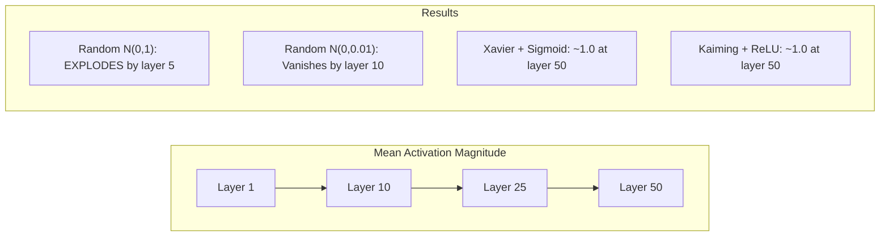
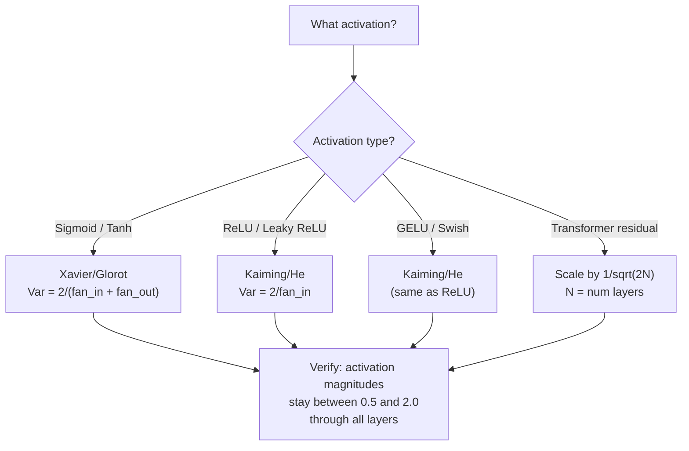

# 权重初始化与训练稳定性

> 初始化错了,训练根本不会开始;初始化对了,50 层也能像 3 层一样平稳训练。

**类型:** 动手构建
**编程语言:** Python
**前置要求:** 第 03.04 课(激活函数)、第 03.07 课(正则化)
**预计耗时:** 约 90 分钟

## 学习目标

- 实现零初始化、随机初始化、Xavier/Glorot 初始化和 Kaiming/He 初始化,并测量它们对 50 层网络中激活值幅度的影响
- 推导为什么 Xavier 初始化用 Var(w) = 2/(fan_in + fan_out),Kaiming 用 Var(w) = 2/fan_in
- 演示零初始化的对称性问题,并解释为什么只靠随机尺度远远不够
- 给激活函数配对正确的初始化策略:sigmoid/tanh 配 Xavier,ReLU/GELU 配 Kaiming

## 问题

把所有权重初始化为零。什么都学不到。每个神经元计算同一个函数,收到同一个梯度,做出同样的更新。10000 个 epoch 之后,你那 512 个神经元的隐藏层,仍然是同一个神经元的 512 份拷贝。你付了 512 个参数的钱,只买到 1 个。

初始化得太大。激活值在网络中爆炸式膨胀。到第 10 层,数值冲到 1e15;到第 20 层,溢出成无穷大。梯度沿反方向走出同样的轨迹。

从标准正态分布随机初始化。3 层网络没问题。到了 50 层,信号要么坍缩到零,要么炸到无穷大——取决于随机尺度是偏小一点还是偏大了一点。"能跑"和"跑不了"之间的边界,薄如刀刃。

权重初始化是深度学习中最被低估的决策。架构有论文写,优化器有博客吹,初始化只有一句脚注。但一旦搞错,其他一切都无所谓——你的网络在训练开始前就已经死了。

## 概念

### 对称性问题

一层里的每个神经元结构都一样:输入乘权重、加偏置、过激活函数。如果所有权重初始值相同(零是极端情况),每个神经元的输出就相同。反向传播时,每个神经元收到相同的梯度;参数更新时,每个神经元变化相同的量。

你卡住了。网络有几百个参数,但它们步调一致地动。这叫对称性(symmetry),而随机初始化就是打破它的蛮力手段。每个神经元从权重空间的不同位置出发,于是各自学到不同的特征。

但光有"随机"还不够。随机的*尺度*决定了网络能不能训练。

### 逐层的方差传播

考虑一个有 fan_in 个输入的单层:

```
z = w1*x1 + w2*x2 + ... + w_n*x_n
```

如果每个权重 wi 取自方差为 Var(w) 的分布,每个输入 xi 的方差为 Var(x),那么输出的方差是:

```
Var(z) = fan_in * Var(w) * Var(x)
```

若 Var(w) = 1 且 fan_in = 512,输出方差是输入方差的 512 倍。10 层之后:512^10 = 1.2e27。信号爆炸了。

若 Var(w) = 0.001,输出方差每层缩小 0.001 * 512 = 0.512 倍。10 层之后:0.512^10 = 0.00013。信号消失了。

目标:选择 Var(w),使得 Var(z) = Var(x)。信号幅度在各层之间保持稳定。

### Xavier/Glorot 初始化

Glorot 和 Bengio(2010)为 sigmoid 和 tanh 激活推导出了答案。要让方差在前向和反向传播中都保持不变:

```
Var(w) = 2 / (fan_in + fan_out)
```

实践中,权重从以下分布抽取:

```
w ~ Uniform(-limit, limit)  where limit = sqrt(6 / (fan_in + fan_out))
```

或者:

```
w ~ Normal(0, sqrt(2 / (fan_in + fan_out)))
```

之所以有效,是因为 sigmoid 和 tanh 在零附近近似线性,而正确初始化的激活值恰好就生活在那个区域。方差可以稳定地穿过几十层。

### Kaiming/He 初始化

ReLU 会杀掉一半输出(负的全部归零)。平均而言一半输入被清零,有效 fan_in 减半。Xavier 初始化没有考虑这一点——它低估了所需的方差。

He 等人(2015)修正了公式:

```
Var(w) = 2 / fan_in
```

权重从以下分布抽取:

```
w ~ Normal(0, sqrt(2 / fan_in))
```

因子 2 补偿了 ReLU 把一半激活值清零的影响。没有它,信号每层衰减约 0.5 倍。50 层:0.5^50 = 8.8e-16。Kaiming 初始化防止了这一点。

### Transformer 的初始化

GPT-2 引入了另一种模式。残差连接把每个子层的输出加回其输入:

```
x = x + sublayer(x)
```

每次相加都增加方差。有 N 个残差层时,方差随 N 成比例增长。GPT-2 把残差层的权重按 1/sqrt(2N) 缩放(N 是层数),让累积的信号幅度保持稳定。

Llama 3(4050 亿参数、126 层)用了类似的方案。没有这种缩放,残差流会在 126 层注意力和前馈块中无界增长。

```mermaid
flowchart TD
    subgraph "Zero Init"
        Z1["Layer 1<br/>All weights = 0"] --> Z2["Layer 2<br/>All neurons identical"]
        Z2 --> Z3["Layer 3<br/>Still identical"]
        Z3 --> ZR["Result: 1 effective neuron<br/>regardless of width"]
    end

    subgraph "Xavier Init"
        X1["Layer 1<br/>Var = 2/(fan_in+fan_out)"] --> X2["Layer 2<br/>Signal stable"]
        X2 --> X3["Layer 50<br/>Signal stable"]
        X3 --> XR["Result: Trains with<br/>sigmoid/tanh"]
    end

    subgraph "Kaiming Init"
        K1["Layer 1<br/>Var = 2/fan_in"] --> K2["Layer 2<br/>Signal stable"]
        K2 --> K3["Layer 50<br/>Signal stable"]
        K3 --> KR["Result: Trains with<br/>ReLU/GELU"]
    end
```



### 50 层中的激活值幅度



### 如何选择正确的初始化



```figure
weight-init-variance
```

## 动手构建

### 第 1 步:初始化策略

初始化权重矩阵的四种方式。每种都返回一个列表的列表(2D 矩阵),fan_in 列、fan_out 行。

```python
import math
import random


def zero_init(fan_in, fan_out):
    return [[0.0 for _ in range(fan_in)] for _ in range(fan_out)]


def random_init(fan_in, fan_out, scale=1.0):
    return [[random.gauss(0, scale) for _ in range(fan_in)] for _ in range(fan_out)]


def xavier_init(fan_in, fan_out):
    std = math.sqrt(2.0 / (fan_in + fan_out))
    return [[random.gauss(0, std) for _ in range(fan_in)] for _ in range(fan_out)]


def kaiming_init(fan_in, fan_out):
    std = math.sqrt(2.0 / fan_in)
    return [[random.gauss(0, std) for _ in range(fan_in)] for _ in range(fan_out)]
```

### 第 2 步:激活函数

需要 sigmoid、tanh 和 ReLU,好让每种初始化策略与它对应的激活函数搭配测试。

```python
def sigmoid(x):
    x = max(-500, min(500, x))
    return 1.0 / (1.0 + math.exp(-x))


def tanh_act(x):
    return math.tanh(x)


def relu(x):
    return max(0.0, x)
```

### 第 3 步:50 层前向传播

让随机数据穿过一个深层网络,测量每层的平均激活幅度。

```python
def forward_deep(init_fn, activation_fn, n_layers=50, width=64, n_samples=100):
    random.seed(42)
    layer_magnitudes = []

    inputs = [[random.gauss(0, 1) for _ in range(width)] for _ in range(n_samples)]

    for layer_idx in range(n_layers):
        weights = init_fn(width, width)
        biases = [0.0] * width

        new_inputs = []
        for sample in inputs:
            output = []
            for neuron_idx in range(width):
                z = sum(weights[neuron_idx][j] * sample[j] for j in range(width)) + biases[neuron_idx]
                output.append(activation_fn(z))
            new_inputs.append(output)
        inputs = new_inputs

        magnitudes = []
        for sample in inputs:
            magnitudes.append(sum(abs(v) for v in sample) / width)
        mean_mag = sum(magnitudes) / len(magnitudes)
        layer_magnitudes.append(mean_mag)

    return layer_magnitudes
```

### 第 4 步:实验

跑遍所有组合:零初始化、随机 N(0,1)、随机 N(0,0.01)、Xavier + sigmoid、Xavier + tanh、Kaiming + ReLU。打印关键层的幅度。

```python
def run_experiment():
    configs = [
        ("Zero init + Sigmoid", lambda fi, fo: zero_init(fi, fo), sigmoid),
        ("Random N(0,1) + ReLU", lambda fi, fo: random_init(fi, fo, 1.0), relu),
        ("Random N(0,0.01) + ReLU", lambda fi, fo: random_init(fi, fo, 0.01), relu),
        ("Xavier + Sigmoid", xavier_init, sigmoid),
        ("Xavier + Tanh", xavier_init, tanh_act),
        ("Kaiming + ReLU", kaiming_init, relu),
    ]

    print(f"{'Strategy':<30} {'L1':>10} {'L5':>10} {'L10':>10} {'L25':>10} {'L50':>10}")
    print("-" * 80)

    for name, init_fn, act_fn in configs:
        mags = forward_deep(init_fn, act_fn)
        row = f"{name:<30}"
        for idx in [0, 4, 9, 24, 49]:
            val = mags[idx]
            if val > 1e6:
                row += f" {'EXPLODED':>10}"
            elif val < 1e-6:
                row += f" {'VANISHED':>10}"
            else:
                row += f" {val:>10.4f}"
        print(row)
```

### 第 5 步:对称性演示

展示零初始化会产生完全相同的神经元。

```python
def symmetry_demo():
    random.seed(42)
    weights = zero_init(2, 4)
    biases = [0.0] * 4

    inputs = [0.5, -0.3]
    outputs = []
    for neuron_idx in range(4):
        z = sum(weights[neuron_idx][j] * inputs[j] for j in range(2)) + biases[neuron_idx]
        outputs.append(sigmoid(z))

    print("\nSymmetry Demo (4 neurons, zero init):")
    for i, out in enumerate(outputs):
        print(f"  Neuron {i}: output = {out:.6f}")
    all_same = all(abs(outputs[i] - outputs[0]) < 1e-10 for i in range(len(outputs)))
    print(f"  All identical: {all_same}")
    print(f"  Effective parameters: 1 (not {len(weights) * len(weights[0])})")
```

### 第 6 步:逐层幅度报告

打印 50 层激活幅度的可视化条形图。

```python
def magnitude_report(name, magnitudes):
    print(f"\n{name}:")
    for i, mag in enumerate(magnitudes):
        if i % 5 == 0 or i == len(magnitudes) - 1:
            if mag > 1e6:
                bar = "X" * 50 + " EXPLODED"
            elif mag < 1e-6:
                bar = "." + " VANISHED"
            else:
                bar_len = min(50, max(1, int(mag * 10)))
                bar = "#" * bar_len
            print(f"  Layer {i+1:3d}: {bar} ({mag:.6f})")
```

## 投入使用

PyTorch 把这些都做成了内置函数:

```python
import torch
import torch.nn as nn

layer = nn.Linear(512, 256)

nn.init.xavier_uniform_(layer.weight)
nn.init.xavier_normal_(layer.weight)

nn.init.kaiming_uniform_(layer.weight, nonlinearity='relu')
nn.init.kaiming_normal_(layer.weight, nonlinearity='relu')

nn.init.zeros_(layer.bias)
```

当你调用 `nn.Linear(512, 256)` 时,PyTorch 默认用 Kaiming 均匀初始化。这就是为什么大多数简单网络"开箱即用"——PyTorch 已经替你做了正确的选择。但当你搭建自定义架构、或者网络深过 20 层时,你需要理解背后发生了什么,必要时覆盖默认值。

对 Transformer 来说,HuggingFace 的模型通常在 `_init_weights` 方法里处理初始化。GPT-2 的实现把残差投影按 1/sqrt(N) 缩放。如果你从零搭 Transformer,这部分要自己加上。

## 交付

本课产出:
- `outputs/prompt-init-strategy.md` -- 一个诊断权重初始化问题并推荐正确策略的提示词

## 练习

1. 增加 LeCun 初始化(Var = 1/fan_in,为 SELU 激活设计)。用 LeCun 初始化 + tanh 跑 50 层实验,与 Xavier + tanh 对比。

2. 实现 GPT-2 的残差缩放:每层输出乘以 1/sqrt(2*N) 再加进残差流。分别在有缩放和无缩放下跑 50 层,测量残差幅度增长的速度。

3. 写一个"初始化健康检查"函数:输入网络的各层维度和激活函数类型,推荐正确的初始化方案;如果当前初始化会出问题,给出警告。

4. 分别以 fan_in = 16 和 fan_in = 1024 跑实验。Xavier 和 Kaiming 会自适应 fan_in,随机初始化不会。展示层越大,"能跑"与"跑不了"之间的差距拉得越开。

5. 实现正交初始化(生成随机矩阵,做 SVD,取正交矩阵 U)。在 50 层 ReLU 网络上与 Kaiming 对比。

## 关键术语

| 术语 | 大家口头的说法 | 实际含义 |
|------|----------------|----------------------|
| 权重初始化 | "随机设个初始权重" | 选择初始权重值的策略,它决定了网络到底能不能训练 |
| 对称性打破 | "让神经元不一样" | 用随机初始化确保神经元学到不同的特征,而不是计算同一个函数 |
| Fan-in | "神经元的输入数" | 传入连接的数量,决定输入方差如何在加权求和中累积 |
| Fan-out | "神经元的输出数" | 传出连接的数量,关系到反向传播中梯度方差的保持 |
| Xavier/Glorot 初始化 | "sigmoid 的初始化" | Var(w) = 2/(fan_in + fan_out),设计目标是在 sigmoid 和 tanh 激活下保持方差 |
| Kaiming/He 初始化 | "ReLU 的初始化" | Var(w) = 2/fan_in,补偿了 ReLU 把一半激活值清零的影响 |
| 方差传播 | "信号逐层变大还是变小" | 对激活方差如何随权重尺度逐层变化的数学分析 |
| 残差缩放 | "GPT-2 的初始化技巧" | 把残差连接的权重按 1/sqrt(2N) 缩放,防止方差在 N 层 Transformer 中增长 |
| 死网络 | "什么都训不动" | 初始化不当导致所有梯度为零、或所有激活值饱和的网络 |
| 激活值爆炸 | "数值冲向无穷" | 权重方差过大,激活幅度逐层指数增长 |

## 延伸阅读

- Glorot & Bengio, "Understanding the difficulty of training deep feedforward neural networks" (2010) -- Xavier 初始化原始论文,含方差分析
- He et al., "Delving Deep into Rectifiers" (2015) -- 针对 ReLU 网络提出 Kaiming 初始化
- Radford et al., "Language Models are Unsupervised Multitask Learners" (2019) -- GPT-2 论文,提出残差缩放初始化
- Mishkin & Matas, "All You Need is a Good Init" (2016) -- 逐层序贯单位方差初始化,解析公式之外的经验派替代方案
