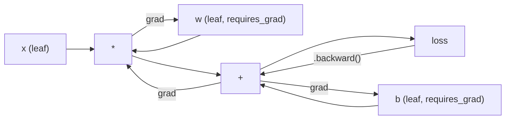
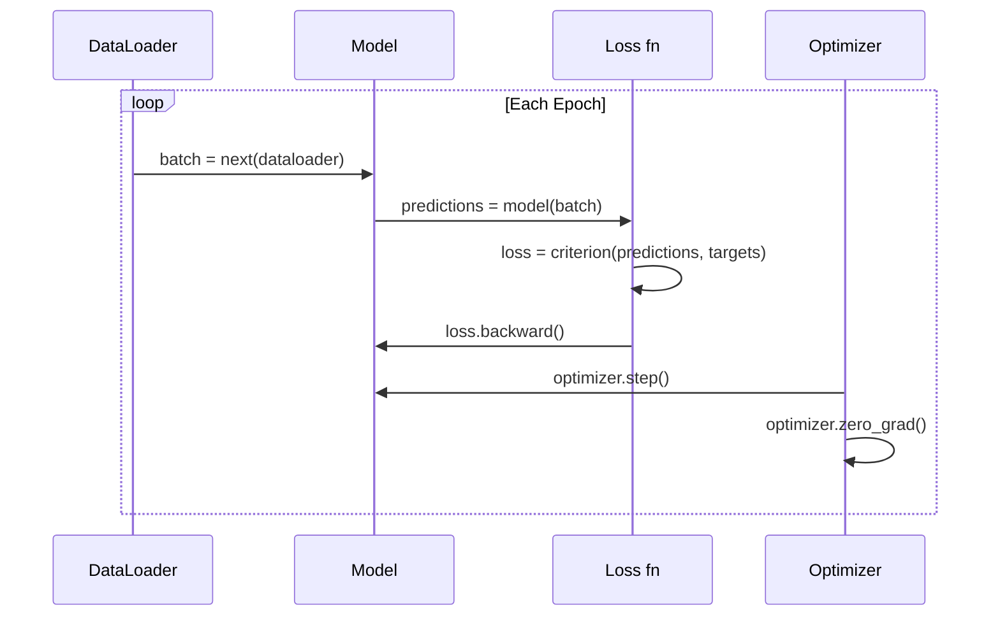

# PyTorch 入门

> 你用活塞和曲轴造过一台引擎。现在来学大家都开的那台。

**类型:** 动手构建
**编程语言:** Python
**前置要求:** 第 03.10 课(构建你自己的迷你框架)
**预计耗时:** 约 75 分钟

## 学习目标

- 用 PyTorch 的 nn.Module、nn.Sequential 和 autograd 构建并训练神经网络
- 使用 PyTorch 张量、GPU 加速和标准训练循环(zero_grad、forward、loss、backward、step)
- 把你从零写的迷你框架组件转换成 PyTorch 等价物
- 在同一任务上对比你的纯 Python 框架与 PyTorch 的训练速度

## 问题

你有一个能跑的迷你框架。Linear 层、ReLU、dropout、批归一化、Adam、DataLoader、训练循环,纯 Python 在 circle 分类问题上训练一个 4 层网络。

但在同一个问题上,它比 PyTorch 慢 500 倍。

你的迷你框架用嵌套的 Python 循环一次处理一个样本;PyTorch 把同样的操作分派给跑在 GPU 上的优化过的 C++/CUDA 内核。在一块 NVIDIA A100 上,PyTorch 在 ImageNet(128 万张图)上训练 ResNet-50(2560 万参数)大约要 6 小时。你的框架干同样的活大约要 3000 小时——如果它没有先把内存耗尽的话。

速度不是唯一的差距。你的框架没有 GPU 支持;没有自动微分——每个模块的 backward() 都是你手写的;没有序列化;没有分布式训练;没有混合精度;除了 print 之外没有任何调试梯度流的手段。

PyTorch 把这些缺口全部填上了。而且它保持的心智模型与你已经造出来的完全相同:Module、forward()、parameters()、backward()、optimizer.step()。概念一一对应,语法几乎一致。区别只在于:PyTorch 在你从零设计的同一个接口背后,塞进了十年的系统工程。

## 概念

### PyTorch 为什么赢了

2015 年,TensorFlow 要求你在运行任何东西之前先定义一个静态计算图。你搭好图、编译它,再把数据喂进去。调试意味着盯着图可视化看;改架构意味着从零重建整张图。

PyTorch 在 2017 年带着另一种哲学登场:即时执行(eager execution)。你写 Python,它立刻运行。`y = model(x)` 是真的当场算出 y,而不是"往图里加一个以后才会算 y 的节点"。这意味着标准 Python 调试工具可用了:print() 能用,pdb 能用,前向传播里写 if/else 也能用。

到 2020 年,市场已经给出了答案。PyTorch 在 ML 研究论文中的占比从 7%(2017)涨到超过 75%(2022)。Meta、Google DeepMind、OpenAI、Anthropic 和 Hugging Face 全都以 PyTorch 为主力框架。TensorFlow 2.x 也转而采用即时执行——等于默认了 PyTorch 的设计是对的。

经验教训:开发者体验会复利增长。一个慢 10% 但调试快 50% 的框架,每次都赢。

### 张量

张量是一个多维数组,带三个关键属性:形状(shape)、dtype 和设备(device)。

```python
import torch

x = torch.zeros(3, 4)           # shape: (3, 4), dtype: float32, device: cpu
x = torch.randn(2, 3, 224, 224) # batch of 2 RGB images, 224x224
x = torch.tensor([1, 2, 3])     # from a Python list
```

**形状**是维度信息。标量的形状是 (),向量是 (n,),矩阵是 (m, n),一批图像是 (batch, channels, height, width)。

**dtype** 控制精度和内存占用。

| dtype | 位数 | 范围 | 适用场景 |
|-------|------|-------|----------|
| float32 | 32 | 约 7 位十进制有效数字 | 默认训练 |
| float16 | 16 | 约 3.3 位十进制有效数字 | 混合精度 |
| bfloat16 | 16 | 范围与 float32 相同,精度更低 | LLM 训练 |
| int8 | 8 | -128 到 127 | 量化推理 |

**设备**决定计算发生在哪里。

```python
device = torch.device("cuda" if torch.cuda.is_available() else "cpu")
x = torch.randn(3, 4, device=device)
x = x.to("cuda")
x = x.cpu()
```

每个操作都要求所有张量在同一设备上。这是新手最常撞上的 PyTorch 报错,没有之一:`RuntimeError: Expected all tensors to be on the same device`。修法:计算前把所有东西移到同一设备。

**改变形状**是常数时间操作——改的是元数据,不是数据。

```python
x = torch.randn(2, 3, 4)
x.view(2, 12)      # reshape to (2, 12) -- must be contiguous
x.reshape(6, 4)    # reshape to (6, 4) -- works always
x.permute(2, 0, 1) # reorder dimensions
x.unsqueeze(0)     # add dimension: (1, 2, 3, 4)
x.squeeze()        # remove size-1 dimensions
```

### Autograd

你的迷你框架要求你为每个模块实现 backward(),PyTorch 不用。它把张量上的每个操作记录成一张有向无环图(计算图),然后逆序遍历这张图,自动计算梯度。



与你的框架的关键区别:PyTorch 用磁带式(tape-based)自动微分。前向传播时,每个操作都追加到一条"磁带"上;调用 `.backward()` 时,把磁带倒放一遍。

```python
x = torch.randn(3, requires_grad=True)
y = x ** 2 + 3 * x
z = y.sum()
z.backward()
print(x.grad)  # dz/dx = 2x + 3
```

autograd 三条规则:

1. 只有 `requires_grad=True` 的叶子张量会累积梯度
2. 梯度默认累积——每次反向传播前调用 `optimizer.zero_grad()`
3. `torch.no_grad()` 关闭梯度追踪(评估时使用)

### nn.Module

`nn.Module` 是 PyTorch 中所有神经网络组件的基类。你在第 10 课已经造过这个抽象。PyTorch 的版本增加了自动参数注册、递归模块发现、设备管理和 state dict 序列化。

```python
import torch.nn as nn

class MLP(nn.Module):
    def __init__(self, input_dim, hidden_dim, output_dim):
        super().__init__()
        self.layer1 = nn.Linear(input_dim, hidden_dim)
        self.relu = nn.ReLU()
        self.layer2 = nn.Linear(hidden_dim, output_dim)

    def forward(self, x):
        x = self.layer1(x)
        x = self.relu(x)
        x = self.layer2(x)
        return x
```

当你在 `__init__` 里把一个 `nn.Module` 或 `nn.Parameter` 赋为属性时,PyTorch 会自动注册它。`model.parameters()` 递归收集所有已注册的参数。这就是为什么你永远不必像在迷你框架里那样手动收集权重。

关键构件:

| 模块 | 作用 | 参数量 |
|--------|-------------|------------|
| nn.Linear(in, out) | Wx + b | in*out + out |
| nn.Conv2d(in_ch, out_ch, k) | 2D 卷积 | in_ch*out_ch*k*k + out_ch |
| nn.BatchNorm1d(features) | 归一化激活值 | 2 * features |
| nn.Dropout(p) | 随机置零 | 0 |
| nn.ReLU() | max(0, x) | 0 |
| nn.GELU() | 高斯误差线性单元 | 0 |
| nn.Embedding(vocab, dim) | 查找表 | vocab * dim |
| nn.LayerNorm(dim) | 逐样本归一化 | 2 * dim |

### 损失函数与优化器

PyTorch 自带你造过的所有东西的生产级版本。

**损失函数**(来自 `torch.nn`):

| 损失 | 任务 | 输入 |
|------|------|-------|
| nn.MSELoss() | 回归 | 任意形状 |
| nn.CrossEntropyLoss() | 多分类 | Logit(不要过 softmax) |
| nn.BCEWithLogitsLoss() | 二分类 | Logit(不要过 sigmoid) |
| nn.L1Loss() | 回归(稳健) | 任意形状 |
| nn.CTCLoss() | 序列对齐 | 对数概率 |

注意:`CrossEntropyLoss` 内部合并了 `LogSoftmax` + `NLLLoss`。传原始 logit,不要传 softmax 输出。这是个常见错误,会静默地产出错误的梯度。

**优化器**(来自 `torch.optim`):

| 优化器 | 何时使用 | 典型学习率 |
|-----------|-------------|-----------|
| SGD(params, lr, momentum) | CNN、调好的流水线 | 0.01--0.1 |
| Adam(params, lr) | 默认起点 | 1e-3 |
| AdamW(params, lr, weight_decay) | Transformer、微调 | 1e-4--1e-3 |
| LBFGS(params) | 小规模、二阶方法 | 1.0 |

### 训练循环

每个 PyTorch 训练循环都遵循同样的 5 步模式。你在第 10 课已经见过了。



标准写法:

```python
for epoch in range(num_epochs):
    model.train()
    for inputs, targets in train_loader:
        inputs, targets = inputs.to(device), targets.to(device)
        optimizer.zero_grad()
        outputs = model(inputs)
        loss = criterion(outputs, targets)
        loss.backward()
        optimizer.step()
```

批次循环里就这五行。GPT-4、Stable Diffusion 和 LLaMA 都是这五行训练出来的。架构会变,数据会变,这五行不变。

### Dataset 与 DataLoader

PyTorch 的 `Dataset` 是一个抽象类,只有两个方法:`__len__` 和 `__getitem__`。`DataLoader` 在它外面包上分批、洗牌和多进程数据加载。

```python
from torch.utils.data import Dataset, DataLoader

class MNISTDataset(Dataset):
    def __init__(self, images, labels):
        self.images = images
        self.labels = labels

    def __len__(self):
        return len(self.labels)

    def __getitem__(self, idx):
        return self.images[idx], self.labels[idx]

loader = DataLoader(dataset, batch_size=64, shuffle=True, num_workers=4)
```

`num_workers=4` 会启动 4 个进程并行加载数据,GPU 同时在当前批次上训练。在磁盘受限的负载上(大图、音频),光这一项就能让训练速度翻倍。

### GPU 训练

把模型移到 GPU:

```python
device = torch.device("cuda" if torch.cuda.is_available() else "cpu")
model = model.to(device)
```

这会递归地把所有参数和缓冲区移到 GPU。然后训练中移动每个批次:

```python
inputs, targets = inputs.to(device), targets.to(device)
```

**混合精度**在现代 GPU(A100、H100、RTX 4090)上让显存占用减半、吞吐翻倍:前向/反向用 float16 跑,主权重保持 float32:

```python
from torch.amp import autocast, GradScaler

scaler = GradScaler()
for inputs, targets in loader:
    with autocast(device_type="cuda"):
        outputs = model(inputs)
        loss = criterion(outputs, targets)
    scaler.scale(loss).backward()
    scaler.step(optimizer)
    scaler.update()
    optimizer.zero_grad()
```

### 对比:迷你框架 vs PyTorch vs JAX

| 特性 | 迷你框架(第 10 课) | PyTorch | JAX |
|---------|---------------------|---------|-----|
| 自动微分 | 手写 backward() | 磁带式 autograd | 函数式变换 |
| 执行方式 | 即时执行(Python 循环) | 即时执行(C++ 内核) | 追踪 + JIT 编译 |
| GPU 支持 | 无 | 有(CUDA、ROCm、MPS) | 有(CUDA、TPU) |
| 速度(MNIST MLP) | 约 300 秒/epoch | 约 0.5 秒/epoch | 约 0.3 秒/epoch |
| 模块系统 | 自定义 Module 类 | nn.Module | 无状态函数(Flax/Equinox) |
| 调试 | print() | print()、pdb、breakpoint() | 更难(JIT 追踪会让 print 失效) |
| 生态 | 无 | Hugging Face、Lightning、timm | Flax、Optax、Orbax |
| 学习曲线 | 你自己造的 | 中等 | 陡(函数式范式) |
| 生产使用 | 玩具问题 | Meta、OpenAI、Anthropic、HF | Google DeepMind、Midjourney |

```figure
dropout-mask
```

## 动手构建

只用 PyTorch 原语在 MNIST 上训练一个 3 层 MLP。不用高级封装,不用 `torchvision.datasets`——原始数据我们自己下载、自己解析。

### 第 1 步:从原始文件加载 MNIST

MNIST 以 4 个 gzip 文件发布:训练图像(60000 x 28 x 28)、训练标签、测试图像(10000 x 28 x 28)、测试标签。我们下载它们并解析二进制格式。

```python
import torch
import torch.nn as nn
import struct
import gzip
import urllib.request
import os

def download_mnist(path="./mnist_data"):
    base_url = "https://storage.googleapis.com/cvdf-datasets/mnist/"
    files = [
        "train-images-idx3-ubyte.gz",
        "train-labels-idx1-ubyte.gz",
        "t10k-images-idx3-ubyte.gz",
        "t10k-labels-idx1-ubyte.gz",
    ]
    os.makedirs(path, exist_ok=True)
    for f in files:
        filepath = os.path.join(path, f)
        if not os.path.exists(filepath):
            urllib.request.urlretrieve(base_url + f, filepath)

def load_images(filepath):
    with gzip.open(filepath, "rb") as f:
        magic, num, rows, cols = struct.unpack(">IIII", f.read(16))
        data = f.read()
        images = torch.frombuffer(bytearray(data), dtype=torch.uint8)
        images = images.reshape(num, rows * cols).float() / 255.0
    return images

def load_labels(filepath):
    with gzip.open(filepath, "rb") as f:
        magic, num = struct.unpack(">II", f.read(8))
        data = f.read()
        labels = torch.frombuffer(bytearray(data), dtype=torch.uint8).long()
    return labels
```

### 第 2 步:定义模型

一个 3 层 MLP:784 -> 256 -> 128 -> 10。ReLU 激活,dropout 做正则化。为简单起见不加批归一化。

```python
class MNISTModel(nn.Module):
    def __init__(self):
        super().__init__()
        self.net = nn.Sequential(
            nn.Linear(784, 256),
            nn.ReLU(),
            nn.Dropout(0.2),
            nn.Linear(256, 128),
            nn.ReLU(),
            nn.Dropout(0.2),
            nn.Linear(128, 10),
        )

    def forward(self, x):
        return self.net(x)
```

输出层产出 10 个原始 logit(每个数字一个)。不加 softmax——`CrossEntropyLoss` 内部会处理。

参数量:784*256 + 256 + 256*128 + 128 + 128*10 + 10 = 235,146。按现代标准小得可怜——GPT-2 small 有 1.24 亿。这个模型几秒钟就能训完。

### 第 3 步:训练循环

标准的 forward-loss-backward-step 模式。

```python
def train_one_epoch(model, loader, criterion, optimizer, device):
    model.train()
    total_loss = 0
    correct = 0
    total = 0
    for images, labels in loader:
        images, labels = images.to(device), labels.to(device)
        optimizer.zero_grad()
        outputs = model(images)
        loss = criterion(outputs, labels)
        loss.backward()
        optimizer.step()
        total_loss += loss.item() * images.size(0)
        _, predicted = outputs.max(1)
        correct += predicted.eq(labels).sum().item()
        total += labels.size(0)
    return total_loss / total, correct / total


def evaluate(model, loader, criterion, device):
    model.eval()
    total_loss = 0
    correct = 0
    total = 0
    with torch.no_grad():
        for images, labels in loader:
            images, labels = images.to(device), labels.to(device)
            outputs = model(images)
            loss = criterion(outputs, labels)
            total_loss += loss.item() * images.size(0)
            _, predicted = outputs.max(1)
            correct += predicted.eq(labels).sum().item()
            total += labels.size(0)
    return total_loss / total, correct / total
```

注意评估时的 `torch.no_grad()`。它关闭 autograd,减少内存占用、加快推理。没有它,PyTorch 会构建一张你根本用不上的计算图。

### 第 4 步:把一切接起来

```python
def main():
    device = torch.device("cuda" if torch.cuda.is_available() else "cpu")

    download_mnist()
    train_images = load_images("./mnist_data/train-images-idx3-ubyte.gz")
    train_labels = load_labels("./mnist_data/train-labels-idx1-ubyte.gz")
    test_images = load_images("./mnist_data/t10k-images-idx3-ubyte.gz")
    test_labels = load_labels("./mnist_data/t10k-labels-idx1-ubyte.gz")

    train_dataset = torch.utils.data.TensorDataset(train_images, train_labels)
    test_dataset = torch.utils.data.TensorDataset(test_images, test_labels)
    train_loader = torch.utils.data.DataLoader(
        train_dataset, batch_size=64, shuffle=True
    )
    test_loader = torch.utils.data.DataLoader(
        test_dataset, batch_size=256, shuffle=False
    )

    model = MNISTModel().to(device)
    criterion = nn.CrossEntropyLoss()
    optimizer = torch.optim.Adam(model.parameters(), lr=1e-3)

    num_params = sum(p.numel() for p in model.parameters())
    print(f"Device: {device}")
    print(f"Parameters: {num_params:,}")
    print(f"Train samples: {len(train_dataset):,}")
    print(f"Test samples: {len(test_dataset):,}")
    print()

    for epoch in range(10):
        train_loss, train_acc = train_one_epoch(
            model, train_loader, criterion, optimizer, device
        )
        test_loss, test_acc = evaluate(
            model, test_loader, criterion, device
        )
        print(
            f"Epoch {epoch+1:2d} | "
            f"Train Loss: {train_loss:.4f} | Train Acc: {train_acc:.4f} | "
            f"Test Loss: {test_loss:.4f} | Test Acc: {test_acc:.4f}"
        )

    torch.save(model.state_dict(), "mnist_mlp.pt")
    print(f"\nModel saved to mnist_mlp.pt")
    print(f"Final test accuracy: {test_acc:.4f}")
```

10 个 epoch 后的预期输出:测试精度约 97.8%。CPU 训练时间约 30 秒,GPU 约 5 秒。用你的迷你框架跑同样架构:约 45 分钟。

## 投入使用

### 快速对比:迷你框架 vs PyTorch

| 迷你框架(第 10 课) | PyTorch |
|---------------------------|---------|
| `model = Sequential(Linear(784, 256), ReLU(), ...)` | `model = nn.Sequential(nn.Linear(784, 256), nn.ReLU(), ...)` |
| `pred = model.forward(x)` | `pred = model(x)` |
| `optimizer.zero_grad()` | `optimizer.zero_grad()` |
| `grad = criterion.backward()` 然后 `model.backward(grad)` | `loss.backward()` |
| `optimizer.step()` | `optimizer.step()` |
| 没有 GPU | `model.to("cuda")` |
| 每个模块手写反向 | Autograd 全包 |

接口几乎一模一样,差别全在水面之下。

### 保存与加载模型

```python
torch.save(model.state_dict(), "model.pt")

model = MNISTModel()
model.load_state_dict(torch.load("model.pt", weights_only=True))
model.eval()
```

永远保存 `state_dict()`(参数字典),不要保存模型对象。保存模型对象用的是 pickle,代码一重构就会坏。state dict 是可移植的。

### 学习率调度

```python
scheduler = torch.optim.lr_scheduler.CosineAnnealingLR(
    optimizer, T_max=10
)
for epoch in range(10):
    train_one_epoch(model, train_loader, criterion, optimizer, device)
    scheduler.step()
```

PyTorch 自带 15 种以上调度器:StepLR、ExponentialLR、CosineAnnealingLR、OneCycleLR、ReduceLROnPlateau。全部插入同一个优化器接口。

## 交付

本课产出两个工件:

- `outputs/prompt-pytorch-debugger.md` -- 一个诊断常见 PyTorch 训练故障的提示词
- `outputs/skill-pytorch-patterns.md` -- 一份 PyTorch 训练模式的技能参考

## 练习

1. **加批归一化。** 在每个线性层之后(激活之前)插入 `nn.BatchNorm1d`。与只用 dropout 的版本对比测试精度和训练速度。BatchNorm 应该能用更少的 epoch 达到 98%+。

2. **实现学习率查找器。** 用一个 epoch 的时间,让学习率从 1e-7 指数增长到 1.0。画出损失对学习率的曲线。最优学习率就在损失开始爬升之前。用它为 MNIST 模型挑一个更好的学习率。

3. **移植到 GPU 并启用混合精度。** 在训练循环中加入 `torch.amp.autocast` 和 `GradScaler`。测量有无混合精度时的吞吐(样本/秒)。A100 上预期约 2 倍加速。

4. **构建自定义 Dataset。** 下载 Fashion-MNIST(格式与 MNIST 相同,内容是服饰)。实现一个带 `__getitem__` 和 `__len__` 的 `FashionMNISTDataset(Dataset)` 类。训练同一个 MLP 并对比精度。Fashion-MNIST 更难——预期约 88%,而 MNIST 约 98%。

5. **把 Adam 换成 SGD + 动量。** 用 `SGD(params, lr=0.01, momentum=0.9)` 训练,对比收敛曲线。再加上 `CosineAnnealingLR` 调度器,看 SGD 到第 10 个 epoch 能否追上 Adam。

## 关键术语

| 术语 | 大家口头的说法 | 实际含义 |
|------|----------------|----------------------|
| 张量(Tensor) | "多维数组" | 带类型、感知设备的数组,每个操作都内置了自动微分支持 |
| Autograd | "自动反向传播" | 磁带式系统:前向时记录操作,然后倒放以计算精确梯度 |
| nn.Module | "一层" | 任何可微计算块的基类——注册参数、支持嵌套、处理 train/eval 模式 |
| state_dict | "模型权重" | 把参数名映射到张量的 OrderedDict——训练好的模型可移植、可序列化的表示 |
| .backward() | "算梯度" | 逆序遍历计算图,为每个 requires_grad=True 的叶子张量计算并累积梯度 |
| .to(device) | "移到 GPU" | 递归地把所有参数和缓冲区转移到指定设备(CPU、CUDA、MPS) |
| DataLoader | "数据管线" | 一个迭代器,对 Dataset 做分批、洗牌,可选并行加载 |
| 混合精度 | "用 float16" | 前向/反向用 float16 求速度,主权重保持 float32 保数值稳定 |
| 即时执行 | "现在就跑" | 操作在调用时立即执行,而不是推迟到之后的编译步骤——PyTorch 与 TF 1.x 分道扬镳的核心设计选择 |
| 梯度清零 | "重置梯度" | 在下一次反向传播前把所有参数梯度设为零,因为 PyTorch 默认累积梯度 |

## 延伸阅读

- Paszke et al., "PyTorch: An Imperative Style, High-Performance Deep Learning Library" (2019) -- 解释 PyTorch 设计取舍的原始论文
- PyTorch Tutorials: "Learning PyTorch with Examples" (https://pytorch.org/tutorials/beginner/pytorch_with_examples.html) -- 从张量到 nn.Module 的官方路径
- PyTorch Performance Tuning Guide (https://pytorch.org/tutorials/recipes/recipes/tuning_guide.html) -- 混合精度、DataLoader workers、固定内存等生产环境优化
- Horace He, "Making Deep Learning Go Brrrr" (https://horace.io/brrr_intro.html) -- 为什么 GPU 训练快,以及针对 PyTorch 的优化策略
