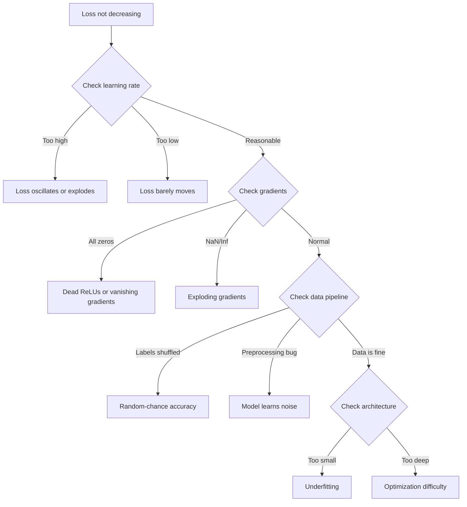
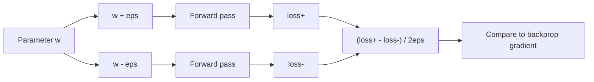
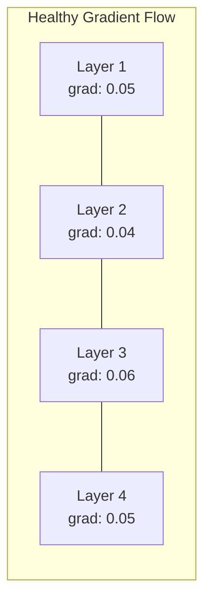
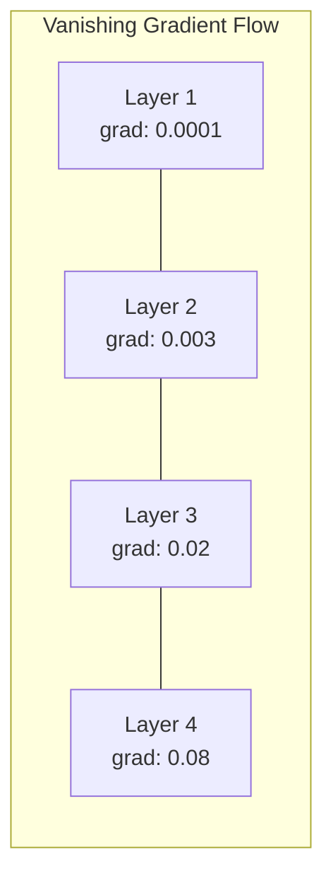
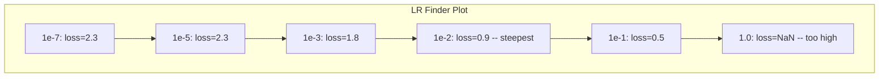

# 调试神经网络

> 你的网络编译通过了,跑起来了,输出了一个数字。数字是错的,但什么都没崩溃。欢迎来到最难的那类调试——没有报错信息的那种。

**类型:** 动手构建
**编程语言:** Python, PyTorch
**前置要求:** 第 03 阶段第 01–10 课(尤其是反向传播、损失函数、优化器)
**预计耗时:** 约 90 分钟

## 学习目标

- 用系统化的调试策略诊断常见神经网络故障(NaN 损失、损失曲线走平、过拟合、振荡)
- 用"过拟合单批次"技巧验证模型架构和训练循环是否正确
- 检查梯度幅度、激活分布和权重范数,识别梯度消失/爆炸问题
- 构建一份覆盖数据流水线、模型架构、损失函数、优化器和学习率问题的调试清单

## 问题

传统软件出故障时会崩溃:空指针抛异常,类型不匹配在编译期报错,差一错误产出明显错误的输出。

神经网络不会给你这种奢侈。

坏掉的神经网络会一路跑完,打印出损失值,输出预测结果。损失可能在下降,预测可能看着也像样。但模型在悄无声息地出错——学到了捷径、记住了噪声,或者收敛到了一个没用的局部极小。Google 的研究人员估计,ML 调试时间的 60–70% 都花在这类"沉默"bug 上:不报错,但模型质量被侵蚀。

能用的模型和坏掉的模型之间,常常只差一行放错位置的代码:一个漏掉的 `zero_grad()`、一个转置错的维度、一个差了 10 倍的学习率。经典文献《Recipe for Training Neural Networks》(2019)开篇就写道:"最常见的神经网络错误,是那些不会导致崩溃的 bug。"

本课教你把这些 bug 找出来。

## 概念

### 调试心态

丢掉"打印然后祈祷"式调试。神经网络调试必须系统化,原因有二:反馈回路慢(每训一轮要几分钟到几小时),症状又含糊(损失不对劲可能是 20 种不同原因)。

黄金法则:**从简单开始,一次只加一块复杂度,每一块都独立验证。**



### 症状 1:损失不下降

这是最常见的抱怨:训练循环在跑,epoch 一个个过去,损失却原地不动,或者剧烈振荡。

**学习率不对。** 太高:损失振荡或直接跳到 NaN。太低:损失下降慢到看起来像平的。用 Adam 就从 1e-3 起步,用 SGD 就从 1e-1 或 1e-2 起步。在下结论说是别的问题之前,先试 3 个各差 10 倍的学习率(比如 1e-2、1e-3、1e-4)。

**ReLU 死亡。** 如果某个 ReLU 神经元收到很大的负输入,它输出 0,梯度也是 0,从此再也不会激活。死掉的神经元够多,网络就学不动了。检查方法:在每个 ReLU 层之后,打印激活值恰好为 0 的比例。超过 50% 都死了,就换 LeakyReLU 或降低学习率。

**梯度消失。** 在用 sigmoid 或 tanh 激活的深层网络里,梯度反向传播时指数级缩小,传到第一层时已经约等于 0,前面的层停止学习。修复:换 ReLU/GELU、加残差连接,或用批归一化。

**梯度爆炸。** 相反的问题——梯度指数级增大。RNN 和超深网络里常见。损失跳到 NaN。修复:梯度裁剪(`torch.nn.utils.clip_grad_norm_`)、降低学习率,或加归一化。

### 症状 2:损失在降,但模型很差

损失在往下走,训练准确率到了 99%,测试准确率却只有 55%。或者模型在真实数据上产出莫名其妙的结果。

**过拟合。** 模型记住了训练数据,而不是学到规律。训练损失与验证损失的差距随时间拉大。修复:更多数据、dropout、权重衰减、早停、数据增强。

**数据泄漏。** 测试数据混进了训练。准确率高得可疑。常见原因:先打乱再划分、用全数据集的统计量做预处理、划分之间存在重复样本。修复:先划分,再预处理,查重。

**标签错误。** 大多数真实数据集中有 5–10% 的标签是错的(Northcutt et al., 2021——《Pervasive Label Errors in Test Sets》)。模型把噪声学了进去。修复:用置信学习(confident learning)找出并修正错误标注的样本,或用损失截断忽略高损失样本。

### 症状 3:损失出现 NaN 或 Inf

损失值变成 `nan` 或 `inf`,训练报废。

**学习率太高。** 梯度更新步子迈得太大,权重爆炸。修复:学习率除以 10。

**log(0) 或 log(负数)。** 交叉熵损失要算 `log(p)`。模型输出的概率恰好是 0 或是负数,log 就爆了。修复:把预测值钳制到 `[eps, 1-eps]`,其中 `eps=1e-7`。

**除以零。** 批归一化要除以标准差,而一个取值恒定的批次标准差为 0。修复:给分母加 epsilon(PyTorch 默认加了,但自己写的实现可能没加)。

**数值上溢。** 很大的激活值喂进 `exp()` 得到 Inf,softmax 尤其容易中招。修复:取指数前先减最大值(log-sum-exp 技巧)。

### 技巧 1:梯度检验

把解析梯度(来自反向传播)和数值梯度(来自有限差分)对比。两者对不上,说明你的反向传播有 bug。

参数 `w` 的数值梯度:

```
grad_numerical = (loss(w + eps) - loss(w - eps)) / (2 * eps)
```

一致性度量(相对差异):

```
rel_diff = |grad_analytical - grad_numerical| / max(|grad_analytical|, |grad_numerical|, 1e-8)
```

`rel_diff < 1e-5`:正确。`rel_diff > 1e-3`:几乎肯定有 bug。



### 技巧 2:激活统计

训练过程中监控每层激活值的均值和标准差。健康的网络,激活值均值接近 0、标准差接近 1(归一化之后),或者至少是有界的。

| 健康指标 | 均值 | 标准差 | 诊断 |
|-----------------|------|-----|-----------|
| 健康 | ~0 | ~1 | 网络学习正常 |
| 饱和 | >>0 或 <<0 | ~0 | 激活值卡在极端值 |
| 死亡 | 0 | 0 | 神经元死亡(全零) |
| 爆炸 | >>10 | >>10 | 激活值无界增长 |

### 技巧 3:梯度流可视化

画出每层的平均梯度幅度。健康网络中,各层梯度幅度应当大致相当。如果靠前的层梯度比靠后的层小 1000 倍,就是梯度消失。





### 技巧 4:过拟合单批次测试

深度学习中最重要的调试技巧,没有之一。

取一小批数据(8–32 个样本),用它训练 100 步以上。损失应当降到接近零,训练准确率应当到 100%。做不到,说明模型或训练循环有根本性 bug——先别进入完整训练。

这个测试能抓住:

- 坏掉的损失函数
- 坏掉的反向传播
- 小到无法表达数据的架构
- 优化器没连上模型参数
- 数据与标签错位

跑一遍只要 30 秒,省下的是几小时的完整训练调试。

### 技巧 5:学习率搜索器

Leslie Smith(2017)提出:在一个 epoch 内,把学习率从很小(1e-7)指数级扫到很大(10),同时记录损失,画出"损失 vs 学习率"曲线。最优学习率大致是损失下降最快处的 1/10。



这个例子里,最佳学习率约为 1e-3(比最陡点小一个数量级)。

### 常见 PyTorch bug

以下这些 bug,浪费了整个 PyTorch 社区最多的时间:

| Bug | 症状 | 修复 |
|-----|---------|-----|
| 忘了 `optimizer.zero_grad()` | 梯度跨批次累积,损失振荡 | 在 `loss.backward()` 前加 `optimizer.zero_grad()` |
| 测试时忘了 `model.eval()` | Dropout 和批归一化行为异常,测试准确率每次都不一样 | 加 `model.eval()` 和 `torch.no_grad()` |
| 张量形状不对 | 静默广播产生错误结果,但不报错 | 调试时在每个操作后打印形状 |
| CPU/GPU 不匹配 | `RuntimeError: expected CUDA tensor` | 模型和数据都要 `.to(device)` |
| 张量没 detach | 计算图无限增长,显存耗尽 | 用 `.detach()` 或 `with torch.no_grad()` |
| 原地操作破坏 autograd | `RuntimeError: modified by in-place operation` | 把 `x += 1` 换成 `x = x + 1` |
| 数据没归一化 | 损失卡在随机猜测水平 | 输入归一化到均值 0、标准差 1 |
| 标签类型不对 | 交叉熵要 `Long`,给了 `Float` | 转换标签:`labels.long()` |

### 调试总表

| 症状 | 可能原因 | 先试这个 |
|---------|-------------|-------------------|
| 损失卡在 -log(1/num_classes) | 模型输出均匀分布 | 检查数据流水线,确认标签与输入对应 |
| 几步后损失变 NaN | 学习率太高 | 学习率除以 10 |
| 立即出现 NaN | log(0) 或除以零 | 给 log/除法加 epsilon |
| 损失剧烈振荡 | 学习率太高或批次太小 | 降学习率,增大批次 |
| 损失下降后进入平台 | 对微调阶段来说学习率偏高 | 加学习率调度(余弦或阶梯衰减) |
| 训练准确率高、测试准确率低 | 过拟合 | 加 dropout、权重衰减、更多数据 |
| 训练准确率 = 测试准确率 = 随机水平 | 模型完全没在学 | 跑过拟合单批次测试 |
| 训练准确率 = 测试准确率但都低 | 欠拟合 | 更大模型、更多层、更多特征 |
| 梯度全为零 | ReLU 死亡或计算图被 detach | 换 LeakyReLU,检查 `.requires_grad` |
| 训练中显存耗尽 | 批次太大或图没释放 | 减小批次,评估时用 `torch.no_grad()` |

```figure
learning-curves
```

## 动手构建

一个监控激活、梯度和损失曲线的诊断工具箱。你会故意弄坏一个网络,再用这个工具箱逐个诊断问题。

### 第 1 步:NetworkDebugger 类

通过 hook 挂进 PyTorch 模型,逐层记录激活与梯度统计。

```python
import torch
import torch.nn as nn
import math


class NetworkDebugger:
    def __init__(self, model):
        self.model = model
        self.activation_stats = {}
        self.gradient_stats = {}
        self.loss_history = []
        self.lr_losses = []
        self.hooks = []
        self._register_hooks()

    def _register_hooks(self):
        for name, module in self.model.named_modules():
            if isinstance(module, (nn.Linear, nn.Conv2d, nn.ReLU, nn.LeakyReLU)):
                hook = module.register_forward_hook(self._make_activation_hook(name))
                self.hooks.append(hook)
                hook = module.register_full_backward_hook(self._make_gradient_hook(name))
                self.hooks.append(hook)

    def _make_activation_hook(self, name):
        def hook(module, input, output):
            with torch.no_grad():
                out = output.detach().float()
                self.activation_stats[name] = {
                    "mean": out.mean().item(),
                    "std": out.std().item(),
                    "fraction_zero": (out == 0).float().mean().item(),
                    "min": out.min().item(),
                    "max": out.max().item(),
                }
        return hook

    def _make_gradient_hook(self, name):
        def hook(module, grad_input, grad_output):
            if grad_output[0] is not None:
                with torch.no_grad():
                    grad = grad_output[0].detach().float()
                    self.gradient_stats[name] = {
                        "mean": grad.mean().item(),
                        "std": grad.std().item(),
                        "abs_mean": grad.abs().mean().item(),
                        "max": grad.abs().max().item(),
                    }
        return hook

    def record_loss(self, loss_value):
        self.loss_history.append(loss_value)

    def check_loss_health(self):
        if len(self.loss_history) < 2:
            return "NOT_ENOUGH_DATA"
        recent = self.loss_history[-10:]
        if any(math.isnan(v) or math.isinf(v) for v in recent):
            return "NAN_OR_INF"
        if len(self.loss_history) >= 20:
            first_half = sum(self.loss_history[:10]) / 10
            second_half = sum(self.loss_history[-10:]) / 10
            if second_half >= first_half * 0.99:
                return "NOT_DECREASING"
        if len(recent) >= 5:
            diffs = [recent[i+1] - recent[i] for i in range(len(recent)-1)]
            if max(diffs) - min(diffs) > 2 * abs(sum(diffs) / len(diffs)):
                return "OSCILLATING"
        return "HEALTHY"

    def check_activations(self):
        issues = []
        for name, stats in self.activation_stats.items():
            if stats["fraction_zero"] > 0.5:
                issues.append(f"DEAD_NEURONS: {name} has {stats['fraction_zero']:.0%} zero activations")
            if abs(stats["mean"]) > 10:
                issues.append(f"EXPLODING_ACTIVATIONS: {name} mean={stats['mean']:.2f}")
            if stats["std"] < 1e-6:
                issues.append(f"COLLAPSED_ACTIVATIONS: {name} std={stats['std']:.2e}")
        return issues if issues else ["HEALTHY"]

    def check_gradients(self):
        issues = []
        grad_magnitudes = []
        for name, stats in self.gradient_stats.items():
            grad_magnitudes.append((name, stats["abs_mean"]))
            if stats["abs_mean"] < 1e-7:
                issues.append(f"VANISHING_GRADIENT: {name} abs_mean={stats['abs_mean']:.2e}")
            if stats["abs_mean"] > 100:
                issues.append(f"EXPLODING_GRADIENT: {name} abs_mean={stats['abs_mean']:.2e}")
        if len(grad_magnitudes) >= 2:
            first_mag = grad_magnitudes[0][1]
            last_mag = grad_magnitudes[-1][1]
            if last_mag > 0 and first_mag / last_mag > 100:
                issues.append(f"GRADIENT_RATIO: first/last = {first_mag/last_mag:.0f}x (vanishing)")
        return issues if issues else ["HEALTHY"]

    def print_report(self):
        print("\n=== NETWORK DEBUGGER REPORT ===")
        print(f"\nLoss health: {self.check_loss_health()}")
        if self.loss_history:
            print(f"  Last 5 losses: {[f'{v:.4f}' for v in self.loss_history[-5:]]}")
        print("\nActivation diagnostics:")
        for item in self.check_activations():
            print(f"  {item}")
        print("\nGradient diagnostics:")
        for item in self.check_gradients():
            print(f"  {item}")
        print("\nPer-layer activation stats:")
        for name, stats in self.activation_stats.items():
            print(f"  {name}: mean={stats['mean']:.4f} std={stats['std']:.4f} zero={stats['fraction_zero']:.1%}")
        print("\nPer-layer gradient stats:")
        for name, stats in self.gradient_stats.items():
            print(f"  {name}: abs_mean={stats['abs_mean']:.2e} max={stats['max']:.2e}")

    def remove_hooks(self):
        for hook in self.hooks:
            hook.remove()
        self.hooks.clear()
```

### 第 2 步:过拟合单批次测试

```python
def overfit_one_batch(model, x_batch, y_batch, criterion, lr=0.01, steps=200):
    optimizer = torch.optim.Adam(model.parameters(), lr=lr)
    model.train()
    print("\n=== OVERFIT ONE BATCH TEST ===")
    print(f"Batch size: {x_batch.shape[0]}, Steps: {steps}")

    for step in range(steps):
        optimizer.zero_grad()
        output = model(x_batch)
        loss = criterion(output, y_batch)
        loss.backward()
        optimizer.step()

        if step % 50 == 0 or step == steps - 1:
            with torch.no_grad():
                preds = (output > 0).float() if output.shape[-1] == 1 else output.argmax(dim=1)
                targets = y_batch if y_batch.dim() == 1 else y_batch.squeeze()
                acc = (preds.squeeze() == targets).float().mean().item()
            print(f"  Step {step:3d} | Loss: {loss.item():.6f} | Accuracy: {acc:.1%}")

    final_loss = loss.item()
    if final_loss > 0.1:
        print(f"\n  FAIL: Loss did not converge ({final_loss:.4f}). Model or training loop is broken.")
        return False
    print(f"\n  PASS: Loss converged to {final_loss:.6f}")
    return True
```

### 第 3 步:学习率搜索器

```python
def find_learning_rate(model, x_data, y_data, criterion, start_lr=1e-7, end_lr=10, steps=100):
    import copy
    original_state = copy.deepcopy(model.state_dict())
    optimizer = torch.optim.SGD(model.parameters(), lr=start_lr)
    lr_mult = (end_lr / start_lr) ** (1 / steps)

    model.train()
    results = []
    best_loss = float("inf")
    current_lr = start_lr

    print("\n=== LEARNING RATE FINDER ===")

    for step in range(steps):
        optimizer.zero_grad()
        output = model(x_data)
        loss = criterion(output, y_data)

        if math.isnan(loss.item()) or loss.item() > best_loss * 10:
            break

        best_loss = min(best_loss, loss.item())
        results.append((current_lr, loss.item()))

        loss.backward()
        optimizer.step()

        current_lr *= lr_mult
        for param_group in optimizer.param_groups:
            param_group["lr"] = current_lr

    model.load_state_dict(original_state)

    if len(results) < 10:
        print("  Could not complete LR sweep -- loss diverged too quickly")
        return results

    min_loss_idx = min(range(len(results)), key=lambda i: results[i][1])
    suggested_lr = results[max(0, min_loss_idx - 10)][0]

    print(f"  Swept {len(results)} steps from {start_lr:.0e} to {results[-1][0]:.0e}")
    print(f"  Minimum loss {results[min_loss_idx][1]:.4f} at lr={results[min_loss_idx][0]:.2e}")
    print(f"  Suggested learning rate: {suggested_lr:.2e}")

    return results
```

### 第 4 步:梯度检验器

```python
def _flat_to_multi_index(flat_idx, shape):
    multi_idx = []
    remaining = flat_idx
    for dim in reversed(shape):
        multi_idx.insert(0, remaining % dim)
        remaining //= dim
    return tuple(multi_idx)


def gradient_check(model, x, y, criterion, eps=1e-4):
    model.train()
    x_double = x.double()
    y_double = y.double()
    model_double = model.double()

    print("\n=== GRADIENT CHECK ===")
    overall_max_diff = 0
    checked = 0

    for name, param in model_double.named_parameters():
        if not param.requires_grad:
            continue

        layer_max_diff = 0

        model_double.zero_grad()
        output = model_double(x_double)
        loss = criterion(output, y_double)
        loss.backward()
        analytical_grad = param.grad.clone()

        num_checks = min(5, param.numel())
        for i in range(num_checks):
            idx = _flat_to_multi_index(i, param.shape)
            original = param.data[idx].item()

            param.data[idx] = original + eps
            with torch.no_grad():
                loss_plus = criterion(model_double(x_double), y_double).item()

            param.data[idx] = original - eps
            with torch.no_grad():
                loss_minus = criterion(model_double(x_double), y_double).item()

            param.data[idx] = original

            numerical = (loss_plus - loss_minus) / (2 * eps)
            analytical = analytical_grad[idx].item()

            denom = max(abs(numerical), abs(analytical), 1e-8)
            rel_diff = abs(numerical - analytical) / denom

            layer_max_diff = max(layer_max_diff, rel_diff)
            checked += 1

        overall_max_diff = max(overall_max_diff, layer_max_diff)
        status = "OK" if layer_max_diff < 1e-5 else "MISMATCH"
        print(f"  {name}: max_rel_diff={layer_max_diff:.2e} [{status}]")

    model.float()

    print(f"\n  Checked {checked} parameters")
    if overall_max_diff < 1e-5:
        print("  PASS: Gradients match (rel_diff < 1e-5)")
    elif overall_max_diff < 1e-3:
        print("  WARN: Small differences (1e-5 < rel_diff < 1e-3)")
    else:
        print("  FAIL: Gradient mismatch detected (rel_diff > 1e-3)")
    return overall_max_diff
```

### 第 5 步:故意弄坏的网络

现在把工具箱用到这些坏网络上,逐个诊断。

```python
def demo_broken_networks():
    torch.manual_seed(42)
    x = torch.randn(64, 10)
    y = (x[:, 0] > 0).long()

    print("\n" + "=" * 60)
    print("BUG 1: Learning rate too high (lr=10)")
    print("=" * 60)
    model1 = nn.Sequential(nn.Linear(10, 32), nn.ReLU(), nn.Linear(32, 2))
    debugger1 = NetworkDebugger(model1)
    optimizer1 = torch.optim.SGD(model1.parameters(), lr=10.0)
    criterion = nn.CrossEntropyLoss()
    for step in range(20):
        optimizer1.zero_grad()
        out = model1(x)
        loss = criterion(out, y)
        debugger1.record_loss(loss.item())
        loss.backward()
        optimizer1.step()
    debugger1.print_report()
    debugger1.remove_hooks()

    print("\n" + "=" * 60)
    print("BUG 2: Dead ReLUs from bad initialization")
    print("=" * 60)
    model2 = nn.Sequential(nn.Linear(10, 32), nn.ReLU(), nn.Linear(32, 32), nn.ReLU(), nn.Linear(32, 2))
    with torch.no_grad():
        for m in model2.modules():
            if isinstance(m, nn.Linear):
                m.weight.fill_(-1.0)
                m.bias.fill_(-5.0)
    debugger2 = NetworkDebugger(model2)
    optimizer2 = torch.optim.Adam(model2.parameters(), lr=1e-3)
    for step in range(50):
        optimizer2.zero_grad()
        out = model2(x)
        loss = criterion(out, y)
        debugger2.record_loss(loss.item())
        loss.backward()
        optimizer2.step()
    debugger2.print_report()
    debugger2.remove_hooks()

    print("\n" + "=" * 60)
    print("BUG 3: Missing zero_grad (gradients accumulate)")
    print("=" * 60)
    model3 = nn.Sequential(nn.Linear(10, 32), nn.ReLU(), nn.Linear(32, 2))
    debugger3 = NetworkDebugger(model3)
    optimizer3 = torch.optim.SGD(model3.parameters(), lr=0.01)
    for step in range(50):
        out = model3(x)
        loss = criterion(out, y)
        debugger3.record_loss(loss.item())
        loss.backward()
        optimizer3.step()
    debugger3.print_report()
    debugger3.remove_hooks()

    print("\n" + "=" * 60)
    print("HEALTHY NETWORK: Correct setup for comparison")
    print("=" * 60)
    model_good = nn.Sequential(nn.Linear(10, 32), nn.ReLU(), nn.Linear(32, 2))
    debugger_good = NetworkDebugger(model_good)
    optimizer_good = torch.optim.Adam(model_good.parameters(), lr=1e-3)
    for step in range(50):
        optimizer_good.zero_grad()
        out = model_good(x)
        loss = criterion(out, y)
        debugger_good.record_loss(loss.item())
        loss.backward()
        optimizer_good.step()
    debugger_good.print_report()
    debugger_good.remove_hooks()

    print("\n" + "=" * 60)
    print("OVERFIT-ONE-BATCH TEST (healthy model)")
    print("=" * 60)
    model_test = nn.Sequential(nn.Linear(10, 32), nn.ReLU(), nn.Linear(32, 2))
    overfit_one_batch(model_test, x[:8], y[:8], criterion)

    print("\n" + "=" * 60)
    print("LEARNING RATE FINDER")
    print("=" * 60)
    model_lr = nn.Sequential(nn.Linear(10, 32), nn.ReLU(), nn.Linear(32, 2))
    find_learning_rate(model_lr, x, y, criterion)

    print("\n" + "=" * 60)
    print("GRADIENT CHECK")
    print("=" * 60)
    model_grad = nn.Sequential(nn.Linear(10, 8), nn.ReLU(), nn.Linear(8, 2))
    gradient_check(model_grad, x[:4], y[:4], criterion)
```

## 投入使用

### PyTorch 内置工具

```python
import torch
import torch.nn as nn

model = nn.Sequential(
    nn.Linear(768, 256),
    nn.ReLU(),
    nn.Linear(256, 10),
)

with torch.autograd.detect_anomaly():
    output = model(input_tensor)
    loss = criterion(output, target)
    loss.backward()

for name, param in model.named_parameters():
    if param.grad is not None:
        print(f"{name}: grad_mean={param.grad.abs().mean():.2e}")
```

### Weights & Biases 集成

```python
import wandb

wandb.init(project="debug-training")

for epoch in range(100):
    loss = train_one_epoch()
    wandb.log({
        "loss": loss,
        "lr": optimizer.param_groups[0]["lr"],
        "grad_norm": torch.nn.utils.clip_grad_norm_(model.parameters(), float("inf")),
    })

    for name, param in model.named_parameters():
        if param.grad is not None:
            wandb.log({f"grad/{name}": wandb.Histogram(param.grad.cpu().numpy())})
```

### TensorBoard

```python
from torch.utils.tensorboard import SummaryWriter

writer = SummaryWriter("runs/debug_experiment")

for epoch in range(100):
    loss = train_one_epoch()
    writer.add_scalar("Loss/train", loss, epoch)

    for name, param in model.named_parameters():
        writer.add_histogram(f"weights/{name}", param, epoch)
        if param.grad is not None:
            writer.add_histogram(f"gradients/{name}", param.grad, epoch)
```

### 调试清单(完整训练之前)

1. 跑过拟合单批次测试。失败就停下。
2. 打印模型摘要——确认参数量合理。
3. 用随机数据跑一次前向——检查输出形状。
4. 训练 5 个 epoch——确认损失在下降。
5. 检查激活统计——没有死亡的层,没有爆炸。
6. 检查梯度流——没有消失,没有爆炸。
7. 验证数据流水线——打印 5 个带标签的随机样本。

## 交付

本课产出:

- `outputs/prompt-nn-debugger.md` — 用于诊断神经网络训练故障的提示词
- `outputs/skill-debug-checklist.md` — 调试训练问题的决策树清单

调试的关键部署模式:

- 在生产训练脚本中加入监控 hook
- 每 N 步把激活与梯度统计记录到 W&B 或 TensorBoard
- 实现自动告警:NaN 损失、神经元死亡(零值占比 >80%)、梯度爆炸
- 改动架构或数据流水线时,永远先跑过拟合单批次测试

## 练习

1. **加一个梯度爆炸检测器。** 修改 `NetworkDebugger`:当梯度超过阈值时进行检测,并自动建议一个梯度裁剪值。在一个不做归一化的 20 层网络上测试。

2. **写一个死亡神经元复活器。** 写一个函数,识别死亡的 ReLU 神经元(永远输出 0),并用 Kaiming 初始化重新初始化它们的输入权重。展示它能让一个 >70% 神经元死亡的网络恢复过来。

3. **实现带绘图的学习率搜索器。** 扩展 `find_learning_rate`,把结果存成 CSV;再写一个独立脚本读 CSV,用 matplotlib 画出学习率-损失曲线。找出 ResNet-18 在 CIFAR-10 上的最优学习率。

4. **写一个数据流水线校验器。** 写一个函数检查:训练/测试划分间是否有重复样本、标签分布是否失衡(比例 >10:1)、输入是否归一化(均值接近 0、标准差接近 1)、数据中是否有 NaN/Inf。在一个故意污染过的数据集上运行它。

5. **调试一次真实故障。** 用第 10 课的迷你框架,引入一个隐蔽的 bug(比如在 backward 里把权重矩阵转置),用梯度检验精确定位哪个参数的梯度不正确。记录整个调试过程。

## 关键术语

| 术语 | 人们常说的是 | 实际含义是 |
|------|----------------|----------------------|
| 沉默 bug | "能跑但结果不对" | 不报错但侵蚀模型质量的 bug——ML 中的主要故障模式 |
| ReLU 死亡 | "神经元死了" | 输入恒为负的 ReLU 神经元,输出 0,梯度也永久为 0 |
| 梯度消失 | "前面的层不学了" | 梯度逐层指数缩小,前面层的权重实际上被冻结 |
| 梯度爆炸 | "损失变 NaN 了" | 梯度逐层指数增大,权重更新大到溢出 |
| 梯度检验 | "验证反向传播对不对" | 把反向传播的解析梯度与有限差分的数值梯度对比 |
| 过拟合单批次 | "最重要的调试测试" | 在一小批数据上训练,验证模型能不能学——不能学,说明有东西彻底坏了 |
| 学习率搜索器 | "扫一遍找合适学习率" | 一个 epoch 内指数级增大学习率,取损失发散前的那个值 |
| 数据泄漏 | "测试数据混进训练了" | 测试集信息污染训练过程,产生虚高的准确率 |
| 激活统计 | "监控层的健康状况" | 跟踪每层输出的均值、标准差和零值占比,检测死亡、饱和或爆炸的神经元 |
| 梯度裁剪 | "给梯度幅度封顶" | 梯度范数超过阈值时按比例缩小,防止爆炸式更新 |

## 延伸阅读

- Smith,《Cyclical Learning Rates for Training Neural Networks》(2017) — 提出学习率范围测试(LR finder)的论文
- Northcutt et al.,《Pervasive Label Errors in Test Sets Destabilize Machine Learning Benchmarks》(2021) — 证明 ImageNet、CIFAR-10 等主要基准中有 3–6% 的标签是错的
- Zhang et al.,《Understanding Deep Learning Requires Rethinking Generalization》(2017) — 证明神经网络能记住随机标签的论文,这正是过拟合单批次测试有效的原因
- PyTorch 文档中关于 `torch.autograd.detect_anomaly` 和 `torch.autograd.set_detect_anomaly` 的内置 NaN/Inf 检测
