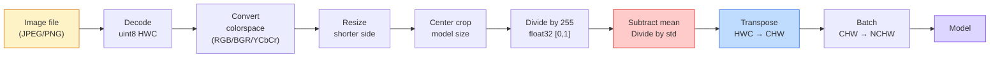
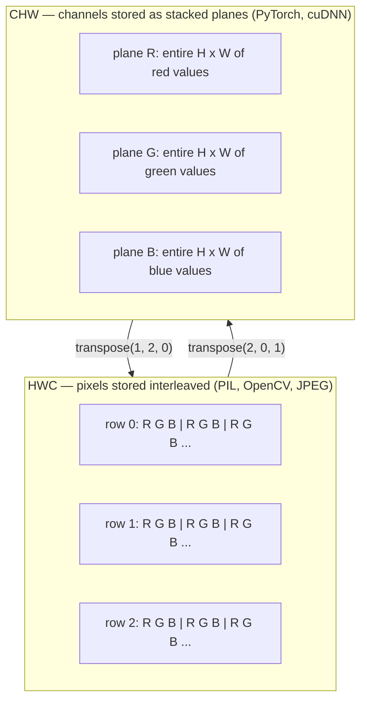

# 图像基础——像素、通道与色彩空间

> 图像,是对光的采样组成的张量。你这辈子会用到的每一个视觉模型,都从这一事实出发。

**类型:** 动手构建
**编程语言:** Python
**前置要求:** 第 1 阶段第 12 课(张量运算),第 3 阶段第 11 课(PyTorch 入门)
**预计耗时:** 约 45 分钟

## 学习目标

- 解释连续场景如何被离散化成像素,以及为什么采样/量化的选择决定了下游一切模型的上限
- 把图像当作 NumPy 数组来读取、切片和检查,并在 HWC 与 CHW 两种布局间自如切换
- 在 RGB、灰度、HSV、YCbCr 之间转换,并讲清每种色彩空间存在的理由
- 按照 torchvision 期望的方式,准确完成像素级预处理(归一化、标准化、缩放、通道置前)

## 问题

你将来读的每一篇论文、下载的每一个预训练权重、调用的每一个视觉 API,都假定输入采用某种特定编码。模型要 `float32`,你给了 `uint8`,它照样跑——然后默默产出垃圾。给在 RGB 上训练的网络喂 BGR,准确率直接掉十个点。模型期望通道置前,你给了通道置后,第一个卷积层就把高度当成了特征通道。这些都不会报错,只会毁掉你的指标,然后你花一个星期去找一个藏在"读文件方式"里的 bug。

卷积本身并不复杂,一旦你搞清楚它滑过的到底是什么。难的是"一张图像"对相机、JPEG 解码器、PIL、OpenCV、torchvision 和 CUDA kernel 来说,含义各不相同。每一层技术栈都有自己的轴序、字节范围和通道约定。理不清这些的视觉工程师,交付的就是坏掉的流水线。

本课把地基打牢,本阶段后面的内容才能往上盖。学完你会知道:像素到底是什么;为什么每个像素是三个数而不是一个;"用 ImageNet 统计量做归一化"到底干了什么;以及如何在本阶段后续课程都默认的两三种布局之间切换。

## 概念

### 预处理流水线一览

每一个生产级视觉系统,都是同一串可逆变换的组合。任何一步错了,模型看到的输入就和训练时不一样。



红色和蓝色两个框,就是 80% 隐性故障的藏身之处:标准化缺失、布局错误。

### 像素是一次采样,不是一个小方块

相机传感器统计落在微型探测器阵列上的光子。每个探测器对光积分一小段时间,输出与光子数量成正比的电压,传感器再把电压离散化成整数。一个探测器,对应一个像素。

```
Continuous scene                 Sensor grid                     Digital image
(infinite detail)                (H x W detectors)               (H x W integers)

    ~~~~~                        +--+--+--+--+--+                 210 198 180 155 120
   ~   ~   ~                     |  |  |  |  |  |                 205 195 178 152 118
  ~ light ~      ---->           +--+--+--+--+--+     ---->       200 190 175 150 115
   ~~~~~                         |  |  |  |  |  |                 195 185 170 148 112
                                 +--+--+--+--+--+                 188 180 165 145 108
```

这一步有两个选择,它们给下游的一切定下了天花板:

- **空间采样**决定场景中每度视角分到多少个探测器。太少,边缘会出现锯齿(混叠);太多,存储和算力爆炸。
- **强度量化**决定电压被切分得多细。8 bit 给出 256 级,是显示标准;10、12、16 bit 能呈现更平滑的渐变,对医学影像、HDR 和原始传感器流水线至关重要。

像素不是一块有面积的彩色小方块,它是一次测量。当你缩放或旋转图像时,你是在对那个测量网格重新采样。

### 为什么是三个通道

单个探测器对整个可见光谱计数——那是灰度图。要得到彩色,传感器在探测器阵列上覆一层红、绿、蓝滤镜组成的马赛克。经过去马赛克(demosaicing)后,每个空间位置都有三个整数:附近红滤镜、绿滤镜、蓝滤镜探测器各自的响应。这三个整数,就是一个像素的 RGB 三元组。

```
One pixel in memory:

    (R, G, B) = (210, 140, 30)   <- reddish-orange

An H x W RGB image:

    shape (H, W, 3)     stored as   H rows of W pixels of 3 values
                                    each in [0, 255] for uint8
```

"三"并没有什么神奇。深度相机会多一个 Z 通道,卫星会多红外和紫外波段,医学扫描常常只有一个通道(X 光、CT)或很多通道(高光谱)。通道数位于最后一个轴,卷积层学的就是沿这个轴做混合。

### 两种布局约定:HWC 与 CHW

同一个张量,两种轴序。每个库都站了一边。

```
HWC (height, width, channels)           CHW (channels, height, width)

   W ->                                    H ->
  +-----+-----+-----+                     +-----+-----+
H |R G B|R G B|R G B|                   C |R R R R R R|
| +-----+-----+-----+                   | +-----+-----+
v |R G B|R G B|R G B|                   v |G G G G G G|
  +-----+-----+-----+                     +-----+-----+
                                          |B B B B B B|
                                          +-----+-----+

   PIL, OpenCV, matplotlib,              PyTorch, most deep learning
   almost every image file on disk       frameworks, cuDNN kernels
```

CHW 存在的原因:卷积核在 H 和 W 上滑动。把通道轴放在最前,每个卷积核看到的就是每个通道一张连续的二维平面,向量化起来干净利落。磁盘格式保留 HWC,是因为传感器扫出一行行的扫描线本来就是那个顺序。

下面这行转换,你这辈子会敲上千遍:

```
img_chw = img_hwc.transpose(2, 0, 1)      # NumPy
img_chw = img_hwc.permute(2, 0, 1)        # PyTorch tensor
```

内存布局,画出来看:



### 字节范围与 dtype

三种主流约定:

| 约定 | dtype | 范围 | 出现在哪里 |
|------------|-------|-------|------------------|
| 原始值 | `uint8` | [0, 255] | 磁盘文件、PIL、OpenCV 输出 |
| 归一化 | `float32` | [0.0, 1.0] | `img.astype('float32') / 255` 之后 |
| 标准化 | `float32` | 大致 [-2, +2] | 减均值、除标准差之后 |

卷积网络是在标准化输入上训练的。ImageNet 统计量 `mean=[0.485, 0.456, 0.406]`、`std=[0.229, 0.224, 0.225]`,是在 [0, 1] 归一化像素上、对整个 ImageNet 训练集三个通道算出的算术均值和标准差。把原始 `uint8` 喂给期望标准化浮点数的模型,是应用视觉领域最常见的第一号隐性故障。

### 色彩空间及其存在的理由

RGB 是采集格式,但对模型来说,它并不总是最好用的表示。

```
 RGB               HSV                       YCbCr / YUV

 R red             H hue (angle 0-360)       Y luminance (brightness)
 G green           S saturation (0-1)        Cb chroma blue-yellow
 B blue            V value/brightness (0-1)  Cr chroma red-green

 Linear to         Separates color from      Separates brightness from
 sensor output     brightness. Useful for    color. JPEG and most video
                   color thresholding, UI    codecs compress the chroma
                   sliders, simple filters   channels harder because the
                                             human eye is less sensitive
                                             to chroma detail than to Y.
```

大多数现代 CNN 直接喂 RGB。你会在这些场合遇到其他色彩空间:

- **HSV** ——经典 CV 代码、基于颜色的分割、白平衡。
- **YCbCr** ——研读 JPEG 内部结构、视频流水线、只在 Y 通道上运算的超分辨率模型。
- **灰度** ——OCR、文档模型,以及一切颜色是干扰变量而非信号的场景。

RGB 转灰度是加权求和,而不是简单平均,因为人眼对绿色的敏感度高于红和蓝:

```
Y = 0.299 R + 0.587 G + 0.114 B       (ITU-R BT.601, the classic weights)
```

### 宽高比、缩放与插值

每个模型都有固定的输入尺寸(多数 ImageNet 分类器是 224x224,现代检测器是 384x384 或 512x512),而你的图像很少刚好匹配。三种要紧的缩放方案:

- **短边缩放 + 中心裁剪** ——标准 ImageNet 配方。保持宽高比,丢掉边缘一条像素。
- **缩放 + 填充** ——保持宽高比、保留全部像素,补黑边。检测和 OCR 的标准做法。
- **直接缩放到目标尺寸** ——拉伸图像。便宜,但扭曲几何;对很多分类任务来说够用。

当新网格与旧网格对不齐时,插值方法决定中间像素怎么算:

```
Nearest neighbour     fastest, blocky, only choice for masks/labels
Bilinear              fast, smooth, default for most image resizing
Bicubic               slower, sharper on upscaling
Lanczos               slowest, best quality, used for final display
```

经验法则:训练用双线性;给人看的成品图用双三次或 lanczos;凡是含整数类别 ID 的(掩码、标签),一律用最近邻。

```figure
conv-output-size
```

## 动手构建

### 第 1 步:加载图像并检查形状

用 Pillow 加载任意 JPEG 或 PNG,转成 NumPy,打印你拿到的东西。想要一个离线可跑的确定性例子,就合成一张。

```python
import numpy as np
from PIL import Image

def synthetic_rgb(h=128, w=192, seed=0):
    rng = np.random.default_rng(seed)
    yy, xx = np.meshgrid(np.linspace(0, 1, h), np.linspace(0, 1, w), indexing="ij")
    r = (np.sin(xx * 6) * 0.5 + 0.5) * 255
    g = yy * 255
    b = (1 - yy) * xx * 255
    rgb = np.stack([r, g, b], axis=-1) + rng.normal(0, 6, (h, w, 3))
    return np.clip(rgb, 0, 255).astype(np.uint8)

arr = synthetic_rgb()
# Or load from disk:
# arr = np.asarray(Image.open("your_image.jpg").convert("RGB"))

print(f"type:   {type(arr).__name__}")
print(f"dtype:  {arr.dtype}")
print(f"shape:  {arr.shape}     # (H, W, C)")
print(f"min:    {arr.min()}")
print(f"max:    {arr.max()}")
print(f"pixel at (0, 0): {arr[0, 0]}")
```

预期输出:`shape: (H, W, 3)`、`dtype: uint8`、范围 `[0, 255]`。无论字节来自相机、JPEG 解码器还是合成生成器,这都是标准的磁盘表示。

### 第 2 步:拆分通道并重排布局

分别取出 R、G、B,然后从 HWC 转成 PyTorch 要的 CHW。

```python
R = arr[:, :, 0]
G = arr[:, :, 1]
B = arr[:, :, 2]
print(f"R shape: {R.shape}, mean: {R.mean():.1f}")
print(f"G shape: {G.shape}, mean: {G.mean():.1f}")
print(f"B shape: {B.shape}, mean: {B.mean():.1f}")

arr_chw = arr.transpose(2, 0, 1)
print(f"\nHWC shape: {arr.shape}")
print(f"CHW shape: {arr_chw.shape}")
```

三张灰度平面,每通道一张。CHW 只是重排了轴;内存布局允许时,甚至不需要真正拷贝数据。

### 第 3 步:灰度与 HSV 转换

先做加权求和的灰度转换,再手写 RGB 转 HSV。

```python
def rgb_to_grayscale(rgb):
    weights = np.array([0.299, 0.587, 0.114], dtype=np.float32)
    return (rgb.astype(np.float32) @ weights).astype(np.uint8)

def rgb_to_hsv(rgb):
    rgb_f = rgb.astype(np.float32) / 255.0
    r, g, b = rgb_f[..., 0], rgb_f[..., 1], rgb_f[..., 2]
    cmax = np.max(rgb_f, axis=-1)
    cmin = np.min(rgb_f, axis=-1)
    delta = cmax - cmin

    h = np.zeros_like(cmax)
    mask = delta > 0
    rmax = mask & (cmax == r)
    gmax = mask & (cmax == g)
    bmax = mask & (cmax == b)
    h[rmax] = ((g[rmax] - b[rmax]) / delta[rmax]) % 6
    h[gmax] = ((b[gmax] - r[gmax]) / delta[gmax]) + 2
    h[bmax] = ((r[bmax] - g[bmax]) / delta[bmax]) + 4
    h = h * 60.0

    s = np.where(cmax > 0, delta / cmax, 0)
    v = cmax
    return np.stack([h, s, v], axis=-1)

gray = rgb_to_grayscale(arr)
hsv = rgb_to_hsv(arr)
print(f"gray shape: {gray.shape}, range: [{gray.min()}, {gray.max()}]")
print(f"hsv   shape: {hsv.shape}")
print(f"hue range: [{hsv[..., 0].min():.1f}, {hsv[..., 0].max():.1f}] degrees")
print(f"sat range: [{hsv[..., 1].min():.2f}, {hsv[..., 1].max():.2f}]")
print(f"val range: [{hsv[..., 2].min():.2f}, {hsv[..., 2].max():.2f}]")
```

色相以度数输出,饱和度和明度在 [0, 1] 区间,与 OpenCV 的 `hsv_full` 约定一致。

### 第 4 步:归一化、标准化,再还原

从原始字节一路走到预训练 ImageNet 模型期望的那个张量,再走回来。

```python
mean = np.array([0.485, 0.456, 0.406], dtype=np.float32)
std = np.array([0.229, 0.224, 0.225], dtype=np.float32)

def preprocess_imagenet(rgb_uint8):
    x = rgb_uint8.astype(np.float32) / 255.0
    x = (x - mean) / std
    x = x.transpose(2, 0, 1)
    return x

def deprocess_imagenet(chw_float32):
    x = chw_float32.transpose(1, 2, 0)
    x = x * std + mean
    x = np.clip(x * 255.0, 0, 255).astype(np.uint8)
    return x

x = preprocess_imagenet(arr)
print(f"preprocessed shape: {x.shape}     # (C, H, W)")
print(f"preprocessed dtype: {x.dtype}")
print(f"preprocessed mean per channel:  {x.mean(axis=(1, 2)).round(3)}")
print(f"preprocessed std  per channel:  {x.std(axis=(1, 2)).round(3)}")

roundtrip = deprocess_imagenet(x)
max_diff = np.abs(roundtrip.astype(int) - arr.astype(int)).max()
print(f"roundtrip max pixel diff: {max_diff}    # should be 0 or 1")
```

每通道均值应接近 0,标准差接近 1。这对 preprocess/deprocess 函数,正是每个 torchvision `transforms.Normalize` 调用在底层做的事。

### 第 5 步:用三种插值方法缩放

做一次放大,让最近邻、双线性和双三次的差异肉眼可见。

```python
target = (arr.shape[0] * 3, arr.shape[1] * 3)

nearest = np.asarray(Image.fromarray(arr).resize(target[::-1], Image.NEAREST))
bilinear = np.asarray(Image.fromarray(arr).resize(target[::-1], Image.BILINEAR))
bicubic = np.asarray(Image.fromarray(arr).resize(target[::-1], Image.BICUBIC))

def local_roughness(x):
    gy = np.diff(x.astype(float), axis=0)
    gx = np.diff(x.astype(float), axis=1)
    return float(np.abs(gy).mean() + np.abs(gx).mean())

for name, out in [("nearest", nearest), ("bilinear", bilinear), ("bicubic", bicubic)]:
    print(f"{name:>8}  shape={out.shape}  roughness={local_roughness(out):6.2f}")
```

最近邻的粗糙度得分最高,因为它保留了硬边。双线性最平滑。双三次居中,在不产生阶梯状伪影的前提下保住了观感锐度。

## 投入使用

`torchvision.transforms` 把上面的一切打包成一条可组合的流水线。下面的代码完整复现了 `preprocess_imagenet` 的行为,外加缩放和裁剪。

```python
import torch
from torchvision import transforms
from PIL import Image

img = Image.fromarray(synthetic_rgb(256, 256))

pipeline = transforms.Compose([
    transforms.Resize(256),
    transforms.CenterCrop(224),
    transforms.ToTensor(),
    transforms.Normalize(mean=[0.485, 0.456, 0.406], std=[0.229, 0.224, 0.225]),
])

x = pipeline(img)
print(f"tensor type:  {type(x).__name__}")
print(f"tensor dtype: {x.dtype}")
print(f"tensor shape: {tuple(x.shape)}      # (C, H, W)")
print(f"per-channel mean: {x.mean(dim=(1, 2)).tolist()}")
print(f"per-channel std:  {x.std(dim=(1, 2)).tolist()}")

batch = x.unsqueeze(0)
print(f"\nbatched shape: {tuple(batch.shape)}   # (N, C, H, W) — ready for a model")
```

四步,顺序必须严格如此:`Resize(256)` 把短边缩到 256;`CenterCrop(224)` 从中心裁出 224x224;`ToTensor()` 除以 255 并把 HWC 换成 CHW;`Normalize` 减 ImageNet 均值、除标准差。顺序一乱,到达模型的东西就悄悄变了。

## 交付

本课会产出:

- `outputs/prompt-vision-preprocessing-audit.md` ——一个提示词:把任何模型卡或数据集卡,变成一份团队必须遵守的预处理不变量检查清单。
- `outputs/skill-image-tensor-inspector.md` ——一个技能:给定任意图像形状的张量或数组,报告其 dtype、布局、取值范围,并判断它看起来是原始的、归一化的还是标准化的。

## 练习

1. **(易)** 分别用 OpenCV(`cv2.imread`)和 Pillow 加载同一张 JPEG,打印两者的形状和 `(0, 0)` 处的像素。解释通道序的差异,然后写一行转换,让 OpenCV 数组与 Pillow 数组完全一致。
2. **(中)** 实现 `standardize(img, mean, std)` 及其逆函数,使任意 uint8 图像满足 `roundtrip_max_diff <= 1` 的测试。要求同一调用既适用于 HWC 的单张图像,也适用于 NCHW 的批次。
3. **(难)** 取一个 ImageNet 标准化后的 3 通道张量,过一个 1x1 卷积,学习把 RGB 加权混合成单通道灰度。把权重初始化为 `[0.299, 0.587, 0.114]` 并冻结,验证输出与你手写的 `rgb_to_grayscale` 在浮点误差内一致。还有哪些经典色彩空间变换可以写成 1x1 卷积?

## 关键术语

| 术语 | 人们常说的 | 实际含义 |
|------|----------------|----------------------|
| 像素(Pixel) | "一个彩色小方块" | 网格某一位置上对光强的一次采样——彩色是三个数,灰度是一个数 |
| 通道(Channel) | "那个颜色" | 堆叠成图像张量的平行空间网格之一;HWC 中在最后一轴,CHW 中在第一轴 |
| HWC / CHW | "那个 shape" | 图像张量的两种轴序;磁盘和 PIL 用 HWC,PyTorch 和 cuDNN 用 CHW |
| 归一化(Normalize) | "把图像缩一下" | 除以 255,让像素落在 [0, 1]——必要但不充分 |
| 标准化(Standardize) | "零中心化" | 每通道减均值、除标准差,让输入分布与模型训练时一致 |
| 灰度转换 | "把通道平均一下" | 以 0.299/0.587/0.114 为系数的加权求和,符合人眼亮度感知 |
| 插值(Interpolation) | "缩放时怎么挑像素" | 新旧网格对不齐时决定输出取值的规则——标签用最近邻,训练用双线性,展示用双三次 |
| 宽高比(Aspect ratio) | "宽除以高" | 区分"缩放加填充"与"缩放加拉伸"的那个比值 |

## 延伸阅读

- [Charles Poynton — A Guided Tour of Color Space](https://poynton.ca/PDFs/Guided_tour.pdf) ——对"为什么有这么多色彩空间、各自何时重要"讲得最清楚的技术文章
- [PyTorch Vision Transforms Docs](https://pytorch.org/vision/stable/transforms.html) ——你在生产中会真正组合使用的完整变换流水线
- [How JPEG Works (Colt McAnlis)](https://www.youtube.com/watch?v=F1kYBnY6mwg) ——精彩的可视化讲解:色度子采样、DCT,以及 JPEG 为什么编码 YCbCr 而非 RGB
- [ImageNet Preprocessing Conventions (torchvision models)](https://pytorch.org/vision/stable/models.html) ——`mean=[0.485, 0.456, 0.406]` 的权威出处,以及为什么模型库里每个模型都指望它
