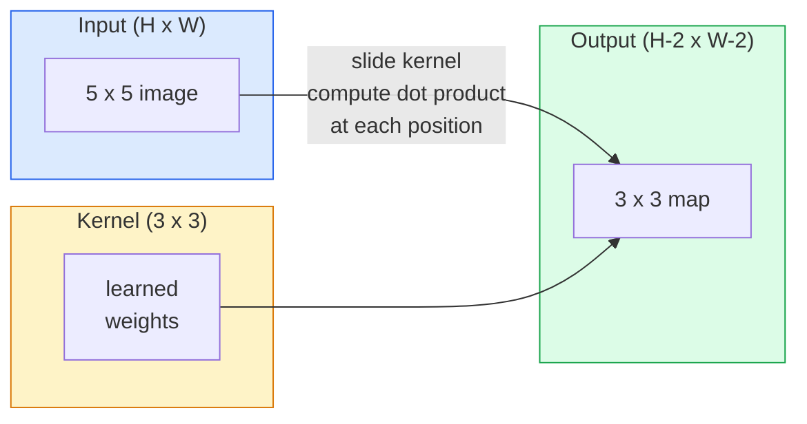
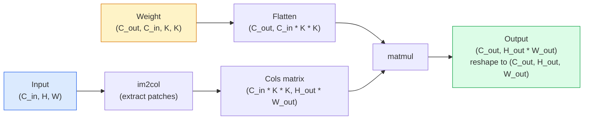

# 从零实现卷积

> 卷积就是一个迷你的全连接层:你在图像上滑动它,每个位置共享同一组权重。

**类型:** 动手构建
**编程语言:** Python
**前置要求:** 第 3 阶段(深度学习核心),第 4 阶段第 01 课(图像基础)
**预计耗时:** 约 75 分钟

## 学习目标

- 只用 NumPy 从零实现二维卷积:嵌套循环版和向量化的 `im2col` 版
- 对任意输入尺寸、卷积核大小、padding、stride 组合计算输出空间尺寸,并能讲清 `(H - K + 2P) / S + 1` 公式的由来
- 手工设计卷积核(边缘、模糊、锐化、Sobel),并解释每一个核为什么会产生那样的激活图案
- 把卷积堆叠成特征提取器,并把堆叠深度与感受野大小联系起来

## 问题

在 224x224 的 RGB 图像上用一个全连接层,每个神经元需要 224 * 224 * 3 = 150,528 个输入权重。一个 1,000 单元的隐藏层就已经是 1.5 亿参数——还什么有用的东西都没学到。更糟的是,这一层完全不知道"左上角的狗"和"右下角的狗"是同一个模式。它把每个像素位置当成独立的,而这对于图像恰恰是错的:把猫平移三个像素,不该逼着网络重新学习这个概念。

图像模型需要两个性质:**平移等变性(translation equivariance)**(输入平移,输出也跟着平移)和**参数共享(parameter sharing)**(同一个特征检测器在所有位置运行)。全连接层一个都给不了,卷积两个都免费送上。

卷积不是为深度学习发明的。JPEG 压缩、Photoshop 的高斯模糊、工业视觉里的边缘检测、史上每一个音频滤波器,背后都是同一个运算。CNN 之所以能在 2012 到 2020 年间统治 ImageNet,是因为卷积正是这类数据的正确先验:邻近的取值彼此相关,同一个模式可能出现在任何位置。

## 概念

### 一个核,滑过去

二维卷积取一个小权重矩阵——称为卷积核(kernel,也叫滤波器 filter)——在输入上滑动,在每个位置计算逐元素乘积之和。这个和,就是输出的一个像素。



一个具体例子:3x3 的核作用在 5x5 输入上(无 padding,stride 1):

```
Input X (5 x 5):                Kernel W (3 x 3):

  1  2  0  1  2                   1  0 -1
  0  1  3  1  0                   2  0 -2
  2  1  0  2  1                   1  0 -1
  1  0  2  1  3
  2  1  1  0  1

The kernel slides across every valid 3 x 3 window. Output Y is 3 x 3:

 Y[0,0] = sum( W * X[0:3, 0:3] )
 Y[0,1] = sum( W * X[0:3, 1:4] )
 Y[0,2] = sum( W * X[0:3, 2:5] )
 Y[1,0] = sum( W * X[1:4, 0:3] )
 ... and so on
```

这一条公式——**权重共享、局部性、滑动窗口**——就是全部思想。其余都是记账。

### 输出尺寸公式

给定输入空间尺寸 `H`、卷积核大小 `K`、padding `P`、stride `S`:

```
H_out = floor( (H - K + 2P) / S ) + 1
```

把这个背下来。每个架构你都要算上几十遍。

| 场景 | H | K | P | S | H_out |
|----------|---|---|---|---|-------|
| Valid 卷积,无 padding | 32 | 3 | 0 | 1 | 30 |
| Same 卷积(尺寸不变) | 32 | 3 | 1 | 1 | 32 |
| 2 倍下采样 | 32 | 3 | 1 | 2 | 16 |
| 2x2 池化 | 32 | 2 | 0 | 2 | 16 |
| 大感受野 | 32 | 7 | 3 | 2 | 16 |

"Same padding"是指:当 S == 1 时,选好 P 使 H_out == H。K 为奇数时,P = (K - 1) / 2。这就是 3x3 卷积核一统天下的原因——它是仍保有中心点的最小奇数核。

### Padding

不加 padding,每次卷积都会缩小特征图。堆 20 层,224x224 的图像就变成 184x184——既在边界上浪费算力,又让要求形状匹配的残差连接没法做。

```
Zero padding (P = 1) on a 5 x 5 input:

  0  0  0  0  0  0  0
  0  1  2  0  1  2  0
  0  0  1  3  1  0  0
  0  2  1  0  2  1  0       Now the kernel can centre on pixel
  0  1  0  2  1  3  0       (0, 0) and still have three rows and
  0  2  1  1  0  1  0       three columns of values to multiply.
  0  0  0  0  0  0  0
```

实践中会遇到的模式:`zero`(最常用)、`reflect`(镜像边缘,生成模型用它避免硬边界)、`replicate`(复制边缘)、`circular`(环绕,用于环面问题)。

### Stride

Stride 是滑动的步长。`stride=1` 是默认;`stride=2` 把空间尺寸减半,是在 CNN 内部下采样的经典手法,不需要单独的池化层——每一个现代架构(ResNet、ConvNeXt、MobileNet)都在某些地方用步幅卷积取代了 max-pool。

```
Stride 1 on a 5 x 5 input, 3 x 3 kernel:

  starts: (0,0) (0,1) (0,2)        -> output row 0
          (1,0) (1,1) (1,2)        -> output row 1
          (2,0) (2,1) (2,2)        -> output row 2

  Output: 3 x 3

Stride 2 on the same input:

  starts: (0,0) (0,2)              -> output row 0
          (2,0) (2,2)              -> output row 1

  Output: 2 x 2
```

### 多输入通道

真实图像有三个通道。RGB 输入上的 3x3 卷积,实际是一个 3x3x3 的立体核:每个输入通道一片 3x3。在每个空间位置,把三片对应位置相乘、全部加起来,再加一个偏置。

```
Input:   (C_in,  H,  W)        3 x 5 x 5
Kernel:  (C_in,  K,  K)        3 x 3 x 3 (one kernel)
Output:  (1,     H', W')       2D map

For a layer that produces C_out output channels, you stack C_out kernels:

Weight:  (C_out, C_in, K, K)   e.g. 64 x 3 x 3 x 3
Output:  (C_out, H', W')       64 x 3 x 3

Parameter count: C_out * C_in * K * K + C_out   (the + C_out is biases)
```

最后一行就是你规划模型时会算的那笔账。3 通道输入上出一个 64 通道的 3x3 卷积,参数量是 `64 * 3 * 3 * 3 + 64 = 1,792`。很便宜。

### im2col 技巧

嵌套循环易读但慢。GPU 想要的是大矩阵乘法。技巧是:把输入中每个感受野窗口拉平成大矩阵的一列,把卷积核拉平成一行,整个卷积就变成一次矩阵乘法。



所有生产级卷积实现都是这个思路的某种变体,再加上缓存分块技巧(直接卷积、Winograd、大核用的 FFT 卷积)。理解了 im2col,就理解了核心。

### 感受野

单个 3x3 卷积看 9 个输入像素。堆两个 3x3,第二层的一个神经元就能看到 5x5 的输入区域。三个 3x3 是 7x7。一般规律:

```
RF after L stacked K x K convs (stride 1) = 1 + L * (K - 1)

With strides:   RF grows multiplicatively with stride along each layer.
```

"一路 3x3 堆到底"之所以可行(VGG、ResNet、ConvNeXt),根本原因就在于此:两个 3x3 看到的输入区域和一个 5x5 一样大,但参数更少,中间还多一次非线性。

```figure
convolution-kernel
```

## 动手构建

### 第 1 步:给数组加 padding

从最小的原语开始:一个围绕 H x W 数组补零的函数。

```python
import numpy as np

def pad2d(x, p):
    if p == 0:
        return x
    h, w = x.shape[-2:]
    out = np.zeros(x.shape[:-2] + (h + 2 * p, w + 2 * p), dtype=x.dtype)
    out[..., p:p + h, p:p + w] = x
    return out

x = np.arange(9).reshape(3, 3)
print(x)
print()
print(pad2d(x, 1))
```

末尾轴技巧 `x.shape[:-2]` 让同一个函数无需修改就能用于 `(H, W)`、`(C, H, W)` 或 `(N, C, H, W)`。

### 第 2 步:嵌套循环实现二维卷积

参考实现——慢,但含义毫无歧义。`torch.nn.functional.conv2d` 在原理上做的就是这件事。

```python
def conv2d_naive(x, w, b=None, stride=1, padding=0):
    c_in, h, w_in = x.shape
    c_out, c_in_w, kh, kw = w.shape
    assert c_in == c_in_w

    x_pad = pad2d(x, padding)
    h_out = (h + 2 * padding - kh) // stride + 1
    w_out = (w_in + 2 * padding - kw) // stride + 1

    out = np.zeros((c_out, h_out, w_out), dtype=np.float32)
    for oc in range(c_out):
        for i in range(h_out):
            for j in range(w_out):
                hs = i * stride
                ws = j * stride
                patch = x_pad[:, hs:hs + kh, ws:ws + kw]
                out[oc, i, j] = np.sum(patch * w[oc])
        if b is not None:
            out[oc] += b[oc]
    return out
```

四层嵌套循环(输出通道、行、列,外加对 C_in、kh、kw 的隐式求和)。这是 ground truth,之后每个更快的实现都要跟它对答案。

### 第 3 步:用手工设计的卷积核验证

构造一个垂直 Sobel 核,作用在合成的阶跃图像上,看垂直边缘亮起来。

```python
def synthetic_step_image():
    img = np.zeros((1, 16, 16), dtype=np.float32)
    img[:, :, 8:] = 1.0
    return img

sobel_x = np.array([
    [[-1, 0, 1],
     [-2, 0, 2],
     [-1, 0, 1]]
], dtype=np.float32)[None]

x = synthetic_step_image()
y = conv2d_naive(x, sobel_x, padding=1)
print(y[0].round(1))
```

预期在第 7 列看到很大的正值(亮度从左到右跳变),其他地方为零。这一行打印就是你的数学正确性检查。

### 第 4 步:im2col

把输入中每个核大小的窗口变成矩阵的一列。`C_in=3, K=3` 时,每列是 27 个数。

```python
def im2col(x, kh, kw, stride=1, padding=0):
    c_in, h, w = x.shape
    x_pad = pad2d(x, padding)
    h_out = (h + 2 * padding - kh) // stride + 1
    w_out = (w + 2 * padding - kw) // stride + 1

    cols = np.zeros((c_in * kh * kw, h_out * w_out), dtype=x.dtype)
    col = 0
    for i in range(h_out):
        for j in range(w_out):
            hs = i * stride
            ws = j * stride
            patch = x_pad[:, hs:hs + kh, ws:ws + kw]
            cols[:, col] = patch.reshape(-1)
            col += 1
    return cols, h_out, w_out
```

它仍然是 Python 循环,但接下来的重活会交给一次向量化的矩阵乘法。

### 第 5 步:im2col + matmul 的快速卷积

用一次矩阵乘法换掉四重循环。

```python
def conv2d_im2col(x, w, b=None, stride=1, padding=0):
    c_out, c_in, kh, kw = w.shape
    cols, h_out, w_out = im2col(x, kh, kw, stride, padding)
    w_flat = w.reshape(c_out, -1)
    out = w_flat @ cols
    if b is not None:
        out += b[:, None]
    return out.reshape(c_out, h_out, w_out)
```

正确性检查:两个实现都跑一遍,对比结果。

```python
rng = np.random.default_rng(0)
x = rng.normal(0, 1, (3, 16, 16)).astype(np.float32)
w = rng.normal(0, 1, (8, 3, 3, 3)).astype(np.float32)
b = rng.normal(0, 1, (8,)).astype(np.float32)

y_naive = conv2d_naive(x, w, b, padding=1)
y_im2col = conv2d_im2col(x, w, b, padding=1)

print(f"max abs diff: {np.max(np.abs(y_naive - y_im2col)):.2e}")
```

`max abs diff` 应该在 `1e-5` 左右——差异来自浮点累加顺序,不是 bug。

### 第 6 步:一组手工设计的卷积核

五个滤波器,展示未经任何训练的单个卷积层能表达什么。

```python
KERNELS = {
    "identity": np.array([[0, 0, 0], [0, 1, 0], [0, 0, 0]], dtype=np.float32),
    "blur_3x3": np.ones((3, 3), dtype=np.float32) / 9.0,
    "sharpen": np.array([[0, -1, 0], [-1, 5, -1], [0, -1, 0]], dtype=np.float32),
    "sobel_x": np.array([[-1, 0, 1], [-2, 0, 2], [-1, 0, 1]], dtype=np.float32),
    "sobel_y": np.array([[-1, -2, -1], [0, 0, 0], [1, 2, 1]], dtype=np.float32),
}

def apply_kernel(img2d, kernel):
    x = img2d[None].astype(np.float32)
    w = kernel[None, None]
    return conv2d_im2col(x, w, padding=1)[0]
```

作用到任意灰度图上:blur 让画面变柔,sharpen 让边缘变脆,Sobel-x 点亮垂直边缘,Sobel-y 点亮水平边缘。这些正是 AlexNet 和 VGG *第一层*卷积在训练后自己学到的图案——因为不管后面接什么任务,好的图像模型都需要边缘和团块检测器。

## 投入使用

PyTorch 的 `nn.Conv2d` 把同一个运算包上了自动微分、CUDA kernel 和 cuDNN 优化。形状语义完全一致。

```python
import torch
import torch.nn as nn

conv = nn.Conv2d(in_channels=3, out_channels=64, kernel_size=3, stride=1, padding=1)
print(conv)
print(f"weight shape: {tuple(conv.weight.shape)}   # (C_out, C_in, K, K)")
print(f"bias shape:   {tuple(conv.bias.shape)}")
print(f"param count:  {sum(p.numel() for p in conv.parameters())}")

x = torch.randn(8, 3, 224, 224)
y = conv(x)
print(f"\ninput  shape: {tuple(x.shape)}")
print(f"output shape: {tuple(y.shape)}")
```

把 `padding=1` 换成 `padding=0`,输出掉到 222x222;把 `stride=1` 换成 `stride=2`,掉到 112x112。用的就是你上面背的那条公式。

## 交付

本课会产出:

- `outputs/prompt-cnn-architect.md` ——一个提示词:给定输入尺寸、参数预算和目标感受野,设计一串每步 K/S/P 都正确的 `Conv2d` 层堆叠。
- `outputs/skill-conv-shape-calculator.md` ——一个技能:逐层走读网络规格,返回每个模块的输出形状、感受野和参数量。

## 练习

1. **(易)** 给定 128x128 灰度输入和堆叠 `[Conv3x3(s=1,p=1), Conv3x3(s=2,p=1), Conv3x3(s=1,p=1), Conv3x3(s=2,p=1)]`,手算每层的输出空间尺寸和感受野。再用 PyTorch `nn.Sequential` 堆 dummy 卷积验证。
2. **(中)** 给 `conv2d_naive` 和 `conv2d_im2col` 扩展一个 `groups` 参数。证明 `groups=C_in=C_out` 时就是深度卷积(depthwise convolution),参数量从 `C * C * K * K` 降到 `C * K * K`。
3. **(难)** 手写 `conv2d_im2col` 的反向传播:给定输出的梯度,计算 `x` 和 `w` 的梯度。在相同输入和权重下与 `torch.autograd.grad` 对答案。诀窍:im2col 的梯度是 `col2im`,重叠窗口的梯度要累加回去。

## 关键术语

| 术语 | 人们常说的 | 实际含义 |
|------|----------------|----------------------|
| 卷积(Convolution) | "滑滤波器" | 在每个空间位置上、以共享权重做的可学习点积;数学上其实是互相关,但大家都叫它卷积 |
| 卷积核 / 滤波器(Kernel / filter) | "特征检测器" | 形状为 (C_in, K, K) 的小权重张量,与输入窗口做点积产生一个输出像素 |
| 步幅(Stride) | "一次跳多远" | 相邻两次卷积核放置之间的步长;stride 2 让每个空间维度减半 |
| 填充(Padding) | "边上补零" | 在输入周围添加额外取值,让卷积核能以边界像素为中心;`same` padding 保持输出尺寸等于输入尺寸 |
| 感受野(Receptive field) | "神经元能看多大" | 某个输出激活所依赖的原始输入区域,随深度和步幅增长 |
| im2col | "GEMM 技巧" | 把每个感受窗口重排成矩阵的列,让卷积变成一次大矩阵乘法——所有快速卷积 kernel 的核心 |
| 深度卷积(Depthwise conv) | "每通道一个核" | `groups == C_in` 的卷积,每个输出通道只由对应的输入通道算出;MobileNet 和 ConvNeXt 的骨干 |
| 平移等变性(Translation equivariance) | "输入移,输出跟着移" | 输入平移 k 个像素,输出也平移 k 个像素的性质;权重共享免费赠送 |

## 延伸阅读

- [A guide to convolution arithmetic for deep learning (Dumoulin & Visin, 2016)](https://arxiv.org/abs/1603.07285) ——padding/stride/空洞卷积的权威图解,所有课程都在悄悄抄它
- [CS231n: Convolutional Neural Networks for Visual Recognition](https://cs231n.github.io/convolutional-networks/) ——经典讲义,im2col 的原始解释就出自这里
- [The Annotated ConvNet (fast.ai)](https://nbviewer.org/github/fastai/fastbook/blob/master/13_convolutions.ipynb) ——一个 notebook,从手写卷积一路走到训练出的数字分类器
- [Receptive Field Arithmetic for CNNs (Dang Ha The Hien)](https://distill.pub/2019/computing-receptive-fields/) ——论文级的交互式感受野计算讲解
