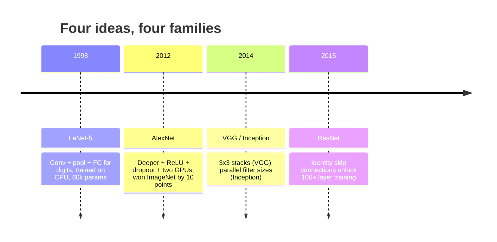
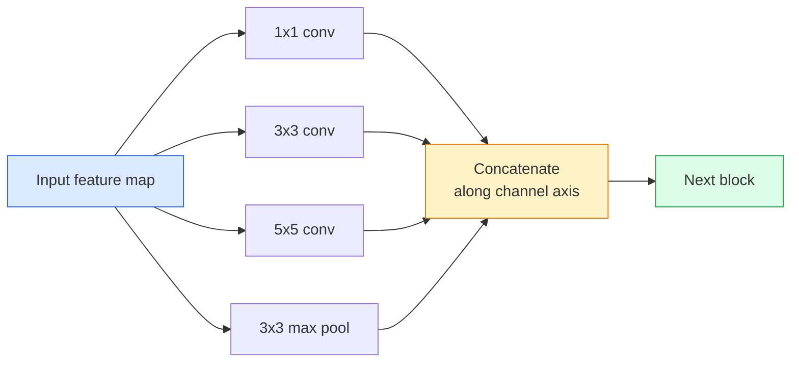
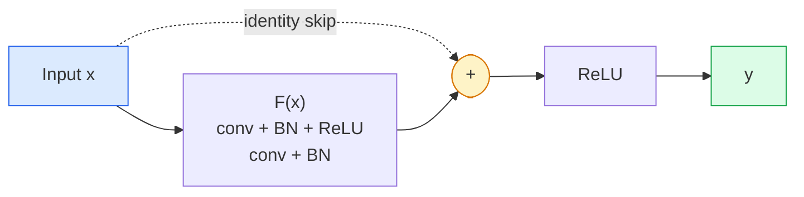

# CNN 架构——从 LeNet 到 ResNet

> 过去三十年所有重要的 CNN,都是同一个"卷积—非线性—下采样"配方,各自只加了一个新点子。按顺序把这些点子学会。

**类型:** 学习 + 动手构建
**编程语言:** Python
**前置要求:** 第 3 阶段第 11 课(PyTorch),第 4 阶段第 01 课(图像基础),第 4 阶段第 02 课(从零实现卷积)
**预计耗时:** 约 75 分钟

## 学习目标

- 梳理 LeNet-5 → AlexNet → VGG → Inception → ResNet 的架构传承谱系,说出每个家族贡献的那一个新点子
- 在 PyTorch 中实现 LeNet-5、一个 VGG 风格模块和一个 ResNet BasicBlock,每个不超过 40 行
- 解释为什么残差连接能让 1,000 层的网络从"无法训练"变成"业界最优"
- 阅读现代骨干网络(ResNet-18、ResNet-50),在看源码之前就能预测它的输出形状、感受野和参数量

## 问题

2011 年,最好的 ImageNet 分类器 top-5 准确率大约 74%。2012 年 AlexNet 做到 85%。2015 年 ResNet 做到 96%。数据没有变多,GPU 没有换代。提升全部来自架构上的新点子。一个干活的视觉工程师必须知道哪个点子出自哪篇论文,因为你在 2026 年交付的每一个生产骨干网络,都是那些老零件的重新组合——而且这些点子还在不断迁移:分组卷积从 CNN 走进了 Transformer,残差连接从 ResNet 走进了现存每一个大语言模型,批归一化活在扩散模型里。

按顺序研究这些网络,还能让你对一个常见错误免疫:遇到问题就抓最大的模型,而一个 LeNet 大小的网络本来就能解决。MNIST 不需要 ResNet。了解每个家族的规模—性能曲线,你才知道该坐在曲线的哪个位置。

## 概念

### 改变视觉的四个点子



在经典视觉领域,没有哪次进步能比得上这四次跳跃。

### LeNet-5(1998)

Yann LeCun 的数字识别器。60,000 个参数。两个"卷积—池化"模块,两个全连接层,tanh 激活。它定下了此后每个 CNN 都继承的模板:

```
input (1, 32, 32)
  conv 5x5 -> (6, 28, 28)
  avg pool 2x2 -> (6, 14, 14)
  conv 5x5 -> (16, 10, 10)
  avg pool 2x2 -> (16, 5, 5)
  flatten -> 400
  dense -> 120
  dense -> 84
  dense -> 10
```

现代世界称为 CNN 的一切——卷积与下采样交替、最后接一个小分类头——都是加了更多层、更宽通道和更好激活函数的 LeNet。

### AlexNet(2012)

三个改动合在一起,轰开了 ImageNet:

1. **ReLU** 取代 tanh。梯度不再消失,训练提速六倍。
2. **Dropout** 用在了全连接头部。正则化从"技巧"变成了"层"。
3. **深度与宽度**。五个卷积层,三个全连接层,60M 参数,拆到两块 GPU 上训练。

论文的图 2 至今还把 GPU 拆分画成两条并行的流。那种并行是硬件限制的变通,不是架构洞见——但上面三个点子,至今仍活在你用的每一个模型里。

### VGG(2014)

VGG 问了一个问题:如果只用 3x3 卷积,一路堆深,会发生什么?

```
stack:   conv 3x3 -> conv 3x3 -> pool 2x2
repeat:  16 or 19 conv layers
```

两个 3x3 看到的输入区域和一个 5x5 一样是 5x5,但参数更少(2*9*C^2 = 18C^2 对比 25*C^2),中间还多一次 ReLU。VGG 把这个观察变成了整个架构。它的简洁——一种模块,反复堆叠——让它成为后来一切的参照点。

代价:138M 参数,训练慢,推理贵。

### Inception(2014,同年)

Google 对"该用多大的卷积核?"的回答是:全都要,并排用。



每个分支各专一门——1x1 管通道混合,3x3 管局部纹理,5x5 管更大尺度的图案,池化管平移不变特征——拼接之后,下一层想取哪个分支就取哪个。Inception v1 还在每个分支内部用 1x1 卷积做瓶颈(bottleneck),把参数量控制在合理范围。

### 退化问题

到 2015 年,VGG-19 能工作,VGG-32 却不行。加深本该有帮助,但超过约 20 层后,训练损失和测试损失一起变差。这不是过拟合——是优化器找不到有用的权重,因为梯度每过一层就乘上一个因子,越乘越小。

```
Plain deep network:
  y = f_L( f_{L-1}( ... f_1(x) ... ) )

Gradient wrt early layer:
  dL/dW_1 = dL/dy * df_L/df_{L-1} * ... * df_2/df_1 * df_1/dW_1

Each multiplicative term has magnitude roughly (weight magnitude) * (activation gain).
Stack 100 of them with gains < 1 and the gradient is effectively zero.
```

VGG 能在 19 层工作,是因为批归一化(同期发表)把激活值维持在了合理的尺度上。但即便是批归一化,也救不了超过 30 层左右的深度。

### ResNet(2015)

何恺明、张祥雨、任少庆、孙剑提出了一个改动,解决了一切:

```
standard block:   y = F(x)
residual block:   y = F(x) + x
```

这个 `+ x` 意味着:层永远可以选择"什么都不做"——只要把 `F(x)` 学到零。一个 1,000 层的 ResNet,最差也就和一个 1 层网络一样差,因为每个额外的块都有一条零成本的逃生通道。有了这个保证,优化器就敢把每个块都调成*略有*用处——而"略有用处"堆上 100 次,就是业界最优。



两种模块变体随处可见:

- **BasicBlock**(ResNet-18、ResNet-34):两个 3x3 卷积,跳跃连接跨过这两个。
- **Bottleneck**(ResNet-50、-101、-152):1x1 降维,3x3 居中,1x1 升维,跳跃连接跨过三者。通道数高时更省。

当跳跃连接需要跨过下采样(stride=2)时,恒等路径要换成 1x1、stride=2 的卷积来对齐形状。

### 残差的意义不止于视觉

这个点子的意义本不在图像分类。它把深度网络从"祈祷梯度能活下来",变成了可靠、可扩展的工程工具。下一阶段你会读到的每一个 Transformer,每个块里都有完全相同的跳跃连接。没有 ResNet,就没有 GPT。

```figure
pooling
```

## 动手构建

### 第 1 步:LeNet-5

一个最小而忠实的 LeNet:tanh 激活,平均池化。唯一向现代妥协的地方,是下游用 `nn.CrossEntropyLoss` 取代了原来的高斯连接。

```python
import torch
import torch.nn as nn
import torch.nn.functional as F

class LeNet5(nn.Module):
    def __init__(self, num_classes=10):
        super().__init__()
        self.conv1 = nn.Conv2d(1, 6, kernel_size=5)
        self.conv2 = nn.Conv2d(6, 16, kernel_size=5)
        self.pool = nn.AvgPool2d(2)
        self.fc1 = nn.Linear(16 * 5 * 5, 120)
        self.fc2 = nn.Linear(120, 84)
        self.fc3 = nn.Linear(84, num_classes)

    def forward(self, x):
        x = self.pool(torch.tanh(self.conv1(x)))
        x = self.pool(torch.tanh(self.conv2(x)))
        x = torch.flatten(x, 1)
        x = torch.tanh(self.fc1(x))
        x = torch.tanh(self.fc2(x))
        return self.fc3(x)

net = LeNet5()
x = torch.randn(1, 1, 32, 32)
print(f"output: {net(x).shape}")
print(f"params: {sum(p.numel() for p in net.parameters()):,}")
```

预期输出:`output: torch.Size([1, 10])`,`params: 61,706`。这就是开启现代视觉的全部家当——一个数字分类器。

### 第 2 步:VGG 模块

一个可复用模块:两个 3x3 卷积,ReLU,批归一化,最大池化。

```python
class VGGBlock(nn.Module):
    def __init__(self, in_c, out_c):
        super().__init__()
        self.conv1 = nn.Conv2d(in_c, out_c, kernel_size=3, padding=1)
        self.bn1 = nn.BatchNorm2d(out_c)
        self.conv2 = nn.Conv2d(out_c, out_c, kernel_size=3, padding=1)
        self.bn2 = nn.BatchNorm2d(out_c)
        self.pool = nn.MaxPool2d(2)

    def forward(self, x):
        x = F.relu(self.bn1(self.conv1(x)))
        x = F.relu(self.bn2(self.conv2(x)))
        return self.pool(x)

class MiniVGG(nn.Module):
    def __init__(self, num_classes=10):
        super().__init__()
        self.stack = nn.Sequential(
            VGGBlock(3, 32),
            VGGBlock(32, 64),
            VGGBlock(64, 128),
        )
        self.head = nn.Sequential(
            nn.AdaptiveAvgPool2d(1),
            nn.Flatten(),
            nn.Linear(128, num_classes),
        )

    def forward(self, x):
        return self.head(self.stack(x))

net = MiniVGG()
x = torch.randn(1, 3, 32, 32)
print(f"output: {net(x).shape}")
print(f"params: {sum(p.numel() for p in net.parameters()):,}")
```

CIFAR 尺寸的输入上堆三个 VGG 模块,加一个自适应池化和一个线性层。约 29 万参数,对付 CIFAR-10 绰绰有余。

### 第 3 步:ResNet BasicBlock

ResNet-18 和 ResNet-34 的核心积木。

```python
class BasicBlock(nn.Module):
    def __init__(self, in_c, out_c, stride=1):
        super().__init__()
        self.conv1 = nn.Conv2d(in_c, out_c, kernel_size=3, stride=stride, padding=1, bias=False)
        self.bn1 = nn.BatchNorm2d(out_c)
        self.conv2 = nn.Conv2d(out_c, out_c, kernel_size=3, stride=1, padding=1, bias=False)
        self.bn2 = nn.BatchNorm2d(out_c)
        if stride != 1 or in_c != out_c:
            self.shortcut = nn.Sequential(
                nn.Conv2d(in_c, out_c, kernel_size=1, stride=stride, bias=False),
                nn.BatchNorm2d(out_c),
            )
        else:
            self.shortcut = nn.Identity()

    def forward(self, x):
        out = F.relu(self.bn1(self.conv1(x)))
        out = self.bn2(self.conv2(out))
        out = out + self.shortcut(x)
        return F.relu(out)
```

卷积层上的 `bias=False` 是批归一化的惯例——BN 的 beta 参数已经承担了偏置的作用,卷积再带偏置就是浪费。只有当 stride 或通道数变化时,`shortcut` 才需要一个真正的卷积;否则它就是个恒等直通。

### 第 4 步:一个迷你 ResNet

堆四组 BasicBlock,得到一个能处理 CIFAR 尺寸输入的可用 ResNet。

```python
class TinyResNet(nn.Module):
    def __init__(self, num_classes=10):
        super().__init__()
        self.stem = nn.Sequential(
            nn.Conv2d(3, 32, kernel_size=3, stride=1, padding=1, bias=False),
            nn.BatchNorm2d(32),
            nn.ReLU(inplace=True),
        )
        self.layer1 = self._make_group(32, 32, num_blocks=2, stride=1)
        self.layer2 = self._make_group(32, 64, num_blocks=2, stride=2)
        self.layer3 = self._make_group(64, 128, num_blocks=2, stride=2)
        self.layer4 = self._make_group(128, 256, num_blocks=2, stride=2)
        self.head = nn.Sequential(
            nn.AdaptiveAvgPool2d(1),
            nn.Flatten(),
            nn.Linear(256, num_classes),
        )

    def _make_group(self, in_c, out_c, num_blocks, stride):
        blocks = [BasicBlock(in_c, out_c, stride=stride)]
        for _ in range(num_blocks - 1):
            blocks.append(BasicBlock(out_c, out_c, stride=1))
        return nn.Sequential(*blocks)

    def forward(self, x):
        x = self.stem(x)
        x = self.layer1(x)
        x = self.layer2(x)
        x = self.layer3(x)
        x = self.layer4(x)
        return self.head(x)

net = TinyResNet()
x = torch.randn(1, 3, 32, 32)
print(f"output: {net(x).shape}")
print(f"params: {sum(p.numel() for p in net.parameters()):,}")
```

四组,每组两个块。第 2、3、4 组开头 stride 2。每次下采样通道数翻倍。约 280 万参数。这个标准配方可以干净地一路放大到 ResNet-152。

### 第 5 步:比较参数效率

让同一个输入依次通过三个网络,对比参数量。

```python
def summary(name, net, x):
    y = net(x)
    params = sum(p.numel() for p in net.parameters())
    print(f"{name:12s}  input {tuple(x.shape)} -> output {tuple(y.shape)}  params {params:>10,}")

x = torch.randn(1, 3, 32, 32)
summary("LeNet5",     LeNet5(),       torch.randn(1, 1, 32, 32))
summary("MiniVGG",    MiniVGG(),      x)
summary("TinyResNet", TinyResNet(),   x)
```

三个模型,三个时代,参数量差了三个数量级。训练几个 epoch 后,CIFAR-10 准确率大致是:LeNet 60%,MiniVGG 89%,TinyResNet 93%。

## 投入使用

`torchvision.models` 提供以上所有架构的预训练版本。各家族的调用签名完全一致——这正是骨干网络抽象的意义所在。

```python
from torchvision.models import resnet18, ResNet18_Weights, vgg16, VGG16_Weights

r18 = resnet18(weights=ResNet18_Weights.IMAGENET1K_V1)
r18.eval()

print(f"ResNet-18 params: {sum(p.numel() for p in r18.parameters()):,}")
print(r18.layer1[0])
print()

v16 = vgg16(weights=VGG16_Weights.IMAGENET1K_V1)
v16.eval()
print(f"VGG-16   params: {sum(p.numel() for p in v16.parameters()):,}")
```

ResNet-18 有 11.7M 参数,VGG-16 有 138M。ImageNet top-1 准确率相近(69.8% 对 71.6%)。残差连接换来了 12 倍的参数效率。这就是为什么从 2016 年到 2021 年 ViT 出现之前,ResNet 家族一直是统治者——而且在算力受限的真实部署中,至今仍是统治者。

做迁移学习,配方永远不变:加载预训练权重,冻结骨干,换掉分类头。

```python
for p in r18.parameters():
    p.requires_grad = False
r18.fc = nn.Linear(r18.fc.in_features, 10)
```

三行代码。你就得到了一个 10 类 CIFAR 分类器,白嫖了 ImageNet 花钱训出来的表示。

## 交付

本课会产出:

- `outputs/prompt-backbone-selector.md` ——一个提示词:根据任务、数据集规模和算力预算,选出合适的 CNN 家族(LeNet/VGG/ResNet/MobileNet/ConvNeXt)。
- `outputs/skill-residual-block-reviewer.md` ——一个技能:阅读 PyTorch 模块,标记跳跃连接的错误(stride 变化时缺 shortcut、shortcut 上激活顺序不对、BN 与加法的相对位置不对)。

## 练习

1. **(易)** 逐层手算 `TinyResNet` 的参数量,与 `sum(p.numel() for p in net.parameters())` 对比。参数大头去了哪里——卷积、BN,还是分类头?
2. **(中)** 实现 Bottleneck 块(1x1 → 3x3 → 1x1,带跳跃连接),用它搭一个 ResNet-50 风格的 CIFAR 网络,与 `TinyResNet` 对比参数量。
3. **(难)** 去掉 `BasicBlock` 的跳跃连接,在 CIFAR-10 上分别训练一个 34 块的"朴素"网络和一个 34 块的 ResNet,各训 10 个 epoch,画出两者的训练损失曲线。复现 He et al. 图 1 的结果:朴素深层网络的收敛损失比它更浅的孪生兄弟还高。

## 关键术语

| 术语 | 人们常说的 | 实际含义 |
|------|----------------|----------------------|
| 骨干网络(Backbone) | "那个模型" | 产生特征图、喂给任务头的那堆卷积模块 |
| 残差连接(Residual connection) | "跳跃连接" | `y = F(x) + x`;让优化器通过把 F 学到零来实现恒等映射,使任意深度可训练 |
| BasicBlock | "两个 3x3 加跳跃" | ResNet-18/34 的积木:conv-BN-ReLU-conv-BN-加-ReLU |
| Bottleneck | "1x1 降、3x3、1x1 升" | ResNet-50/101/152 的积木;通道数高时更便宜,因为 3x3 在压缩后的宽度上运行 |
| 退化问题(Degradation problem) | "越深越差" | 朴素卷积超过约 20 层后,训练误差和测试误差一起上升;靠残差连接解决,而不是靠更多数据 |
| Stem | "第一层" | 把 3 通道输入转成基础特征宽度的初始卷积;ImageNet 通常用 7x7 stride 2,CIFAR 用 3x3 stride 1 |
| 头部(Head) | "分类器" | 骨干最后一个块之后的层:自适应池化、flatten、线性层 |
| 迁移学习(Transfer learning) | "预训练权重" | 加载在 ImageNet 上训练好的骨干,只在你的任务上微调头部 |

## 延伸阅读

- [Deep Residual Learning for Image Recognition (He et al., 2015)](https://arxiv.org/abs/1512.03385) ——ResNet 论文,每张图都值得细读
- [Very Deep Convolutional Networks (Simonyan & Zisserman, 2014)](https://arxiv.org/abs/1409.1556) ——VGG 论文,至今仍是"为什么用 3x3"的最佳参考
- [ImageNet Classification with Deep CNNs (Krizhevsky et al., 2012)](https://papers.nips.cc/paper_files/paper/2012/hash/c399862d3b9d6b76c8436e924a68c45b-Abstract.html) ——AlexNet,终结手工特征时代的那篇论文
- [Going Deeper with Convolutions (Szegedy et al., 2014)](https://arxiv.org/abs/1409.4842) ——Inception v1,并行滤波器的点子至今仍在视觉 Transformer 中出现
