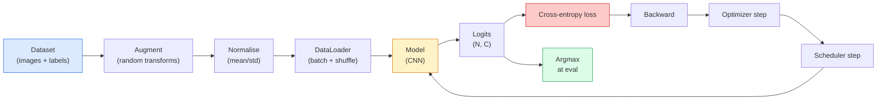

# 图像分类

> 分类器就是一个函数:从像素出发,输出一个关于各类别的概率分布。其余一切都是管道工程。

**类型:** 动手构建
**编程语言:** Python
**前置要求:** 第 2 阶段第 09 课(模型评估),第 3 阶段第 10 课(迷你框架),第 4 阶段第 03 课(CNN)
**预计耗时:** 约 75 分钟

## 学习目标

- 在 CIFAR-10 上搭建端到端的图像分类流水线:数据集、增强、模型、训练循环、评估
- 讲清每个组件(dataloader、损失、优化器、调度器、增强)的作用,并预测弄坏其中任何一个会在损失曲线上表现出什么症状
- 从零实现 mixup、cutout 和标签平滑,并说明各自何时值得加入
- 读懂混淆矩阵和逐类精确率/召回率表格,在整体准确率之外诊断数据集与模型的故障

## 问题

每一个交付的视觉任务,追到底都是某种图像分类。检测是在给区域分类,分割是在给像素分类,检索是按与类中心的相似度排序。把分类这件事做对——数据集循环、增强策略、损失、评估——是能迁移到本阶段其他一切任务的核心技能。

大多数分类 bug 不在模型里,而在流水线里:坏掉的归一化、没打乱的训练集、把标签扭歪的增强、被训练数据污染的验证集、第 30 个 epoch 之后悄悄发散的学习率。一个配置正确能在 CIFAR-10 上跑到 93% 的 CNN,配置出错时常常只有 70–75%,而损失曲线全程看起来都像模像样。

本课把整条流水线手工接线,让每个环节都看得见、查得到。你不会用 `torchvision.datasets` 里任何可能藏 bug 的东西。

## 概念

### 分类流水线



这个循环里的每一行都可能藏 bug。交叉熵吃的是原始 logits,不是 softmax 的输出,所以在损失前加一句 `model(x).softmax()`,算出的梯度就悄悄错了。增强只作用于输入,不作用于标签——mixup 除外,它两个都混。`optimizer.zero_grad()` 每步必须调一次;漏掉它,梯度就会累积,看起来就像学习率疯了一样不稳定。这些 bug 的共同点:把学习曲线压平,却一个报错都没有。

### 交叉熵、logits 与 softmax

分类器对每张图输出 `C` 个数,称为 logits。套上 softmax 就转成概率分布:

```
softmax(z)_i = exp(z_i) / sum_j exp(z_j)
```

交叉熵度量正确类别的负对数概率:

```
CE(z, y) = -log( softmax(z)_y )
        = -z_y + log( sum_j exp(z_j) )
```

右边的形式才是数值稳定的(log-sum-exp)。PyTorch 的 `nn.CrossEntropyLoss` 把 softmax + NLL 融合成一个算子,直接接收原始 logits。自己先手动 softmax 一次几乎必然是 bug——你算的是 log(softmax(softmax(z))),一个毫无意义的东西。

### 数据增强为什么有效

CNN 通过权重共享天然具备平移上的归纳偏置,但对裁剪、翻转、色彩抖动、遮挡并没有内建的不变性。教会它这些不变性的唯一办法,就是给它看能锻炼这些不变性的像素。训练时的每一次随机变换都在说:"这两张图是同一个标签;学会忽略它们之间的差异。"

```
Original crop:  "dog facing left"
Flip:           "dog facing right"       <- same label, different pixels
Rotate(+15):    "dog, slight tilt"
Colour jitter:  "dog in warmer light"
RandomErasing:  "dog with patch missing"
```

铁律:增强必须保持标签不变。在数字上做 cutout 和旋转会把 "6" 变成 "9";对这种数据集,要缩小旋转范围,挑选尊重数字特有不变性的增强方式。

### Mixup 与 Cutmix

普通增强只变换像素,标签仍是独热的。**Mixup** 和 **cutmix** 打破这一点:输入和标签一起插值。

```
Mixup:
  lambda ~ Beta(a, a)
  x = lambda * x_i + (1 - lambda) * x_j
  y = lambda * y_i + (1 - lambda) * y_j

Cutmix:
  paste a random rectangle of x_j into x_i
  y = area-weighted mix of y_i and y_j
```

为什么有效:模型不再死记尖锐的独热目标,而是学会在类别之间插值。训练损失上升,测试准确率上升。这是给任何分类器提升鲁棒性最便宜的一招。

### 标签平滑

mixup 的表亲。不再对着 `[0, 0, 1, 0, 0]` 训练,而是对着 `[eps/C, eps/C, 1-eps, eps/C, eps/C]` 训练,`eps` 取 0.1 这样的小值。它能阻止模型产生无限尖锐的 logits,几乎零成本地改善校准(calibration)。PyTorch 1.10 起内建:`nn.CrossEntropyLoss(label_smoothing=0.1)`。

### 准确率之外的评估

整体准确率会掩盖类别不均衡。一个 90/10 的二分类器,永远预测多数类也有 90 分。真正能告诉你发生了什么的工具:

- **逐类准确率** ——每类一个数字,表现差的类别立刻现形。
- **混淆矩阵** ——C x C 网格,第 i 行第 j 列是"真实为 i、预测为 j"的样本数;对角线是答对的,非对角线才是错误的藏身之处。
- **Top-1 / Top-5** ——正确类别是否落在概率最高的前 1 或前 5 个预测里。ImageNet 看重 Top-5,因为像"诺维奇梗"和"诺福克梗"这种类别本来就难分。
- **校准(ECE)** ——一个置信度 0.8 的预测,真的有 80% 的时候是对的吗?现代网络系统性地过度自信,可用温度缩放或标签平滑修正。

```figure
receptive-field
```

## 动手构建

### 第 1 步:确定性的合成数据集

CIFAR-10 存在磁盘上。为了让本课可复现且跑得快,我们构造一个长得像 CIFAR 的合成数据集——32x32 RGB 图像,每个类别带有模型必须学会的结构特征。同一条流水线搬到真实 CIFAR-10 上一字不改也能用。

```python
import numpy as np
import torch
from torch.utils.data import Dataset


def synthetic_cifar(num_per_class=1000, num_classes=10, seed=0):
    rng = np.random.default_rng(seed)
    X = []
    Y = []
    for c in range(num_classes):
        centre = rng.uniform(0, 1, (3,))
        freq = 2 + c
        for _ in range(num_per_class):
            yy, xx = np.meshgrid(np.linspace(0, 1, 32), np.linspace(0, 1, 32), indexing="ij")
            r = np.sin(xx * freq) * 0.5 + centre[0]
            g = np.cos(yy * freq) * 0.5 + centre[1]
            b = (xx + yy) * 0.5 * centre[2]
            img = np.stack([r, g, b], axis=-1)
            img += rng.normal(0, 0.08, img.shape)
            img = np.clip(img, 0, 1)
            X.append(img.astype(np.float32))
            Y.append(c)
    X = np.stack(X)
    Y = np.array(Y)
    idx = rng.permutation(len(X))
    return X[idx], Y[idx]


class ArrayDataset(Dataset):
    def __init__(self, X, Y, transform=None):
        self.X = X
        self.Y = Y
        self.transform = transform

    def __len__(self):
        return len(self.X)

    def __getitem__(self, i):
        img = self.X[i]
        if self.transform is not None:
            img = self.transform(img)
        img = torch.from_numpy(img).permute(2, 0, 1)
        return img, int(self.Y[i])
```

每个类别有自己的调色板和频率图案,外加高斯噪声,逼模型去学信号而不是背像素。十个类,每类一千张,已打乱。

### 第 2 步:归一化与数据增强

每条视觉流水线都有的两个变换。

```python
def standardize(mean, std):
    mean = np.array(mean, dtype=np.float32)
    std = np.array(std, dtype=np.float32)
    def _fn(img):
        return (img - mean) / std
    return _fn


def random_hflip(p=0.5):
    def _fn(img):
        if np.random.random() < p:
            return img[:, ::-1, :].copy()
        return img
    return _fn


def random_crop(pad=4):
    def _fn(img):
        h, w = img.shape[:2]
        padded = np.pad(img, ((pad, pad), (pad, pad), (0, 0)), mode="reflect")
        y = np.random.randint(0, 2 * pad)
        x = np.random.randint(0, 2 * pad)
        return padded[y:y + h, x:x + w, :]
    return _fn


def compose(*fns):
    def _fn(img):
        for fn in fns:
            img = fn(img)
        return img
    return _fn
```

裁剪前用反射填充(reflect-pad)而不是补零,因为黑边本身就是一种信号——模型会学着以一种没用的方式去忽略它。

### 第 3 步:Mixup

在训练步内混合两张图和两个标签。实现成批次变换,让它贴着前向传播,而不是藏进数据集里。

```python
def mixup_batch(x, y, num_classes, alpha=0.2):
    if alpha <= 0:
        return x, torch.nn.functional.one_hot(y, num_classes).float()
    lam = float(np.random.beta(alpha, alpha))
    idx = torch.randperm(x.size(0), device=x.device)
    x_mixed = lam * x + (1 - lam) * x[idx]
    y_onehot = torch.nn.functional.one_hot(y, num_classes).float()
    y_mixed = lam * y_onehot + (1 - lam) * y_onehot[idx]
    return x_mixed, y_mixed


def soft_cross_entropy(logits, soft_targets):
    log_probs = torch.log_softmax(logits, dim=-1)
    return -(soft_targets * log_probs).sum(dim=-1).mean()
```

`soft_cross_entropy` 是对软标签分布求交叉熵。当目标恰好是独热时,它就退化成普通版本。

### 第 4 步:训练循环

完整配方:数据过一遍,每个批次算一次梯度,每个 epoch 调一次调度器。

```python
import torch
import torch.nn as nn
from torch.utils.data import DataLoader
from torch.optim import SGD
from torch.optim.lr_scheduler import CosineAnnealingLR

def train_one_epoch(model, loader, optimizer, device, num_classes, use_mixup=True):
    model.train()
    total, correct, loss_sum = 0, 0, 0.0
    for x, y in loader:
        x, y = x.to(device), y.to(device)
        if use_mixup:
            x_m, y_soft = mixup_batch(x, y, num_classes)
            logits = model(x_m)
            loss = soft_cross_entropy(logits, y_soft)
        else:
            logits = model(x)
            loss = nn.functional.cross_entropy(logits, y, label_smoothing=0.1)
        optimizer.zero_grad()
        loss.backward()
        optimizer.step()
        loss_sum += loss.item() * x.size(0)
        total += x.size(0)
        # Training accuracy vs the un-mixed labels `y` is only an approximation
        # when mixup is on (the model saw soft targets, not y). Treat it as a
        # rough progress signal; rely on val accuracy for real performance.
        with torch.no_grad():
            pred = logits.argmax(dim=-1)
            correct += (pred == y).sum().item()
    return loss_sum / total, correct / total


@torch.no_grad()
def evaluate(model, loader, device, num_classes):
    model.eval()
    total, correct = 0, 0
    loss_sum = 0.0
    cm = torch.zeros(num_classes, num_classes, dtype=torch.long)
    for x, y in loader:
        x, y = x.to(device), y.to(device)
        logits = model(x)
        loss = nn.functional.cross_entropy(logits, y)
        pred = logits.argmax(dim=-1)
        for t, p in zip(y.cpu(), pred.cpu()):
            cm[t, p] += 1
        loss_sum += loss.item() * x.size(0)
        total += x.size(0)
        correct += (pred == y).sum().item()
    return loss_sum / total, correct / total, cm
```

每次写训练循环都要检查的五条不变量:

1. 训练前 `model.train()`,评估前 `model.eval()`——决定 dropout 和 batchnorm 的行为。
2. `.backward()` 之前 `.zero_grad()`。
3. 累积指标时用 `.item()`,不让任何东西拽着计算图不放。
4. 评估时加 `@torch.no_grad()`——省内存省时间,还能防一些隐蔽的事故。
5. 对原始 logits 取 argmax,而不是对 softmax——结果一样,少一次运算。

### 第 5 步:组装起来

用上一课的 `TinyResNet`,训几个 epoch,评估。

```python
from main import synthetic_cifar, ArrayDataset
from main import standardize, random_hflip, random_crop, compose
from main import mixup_batch, soft_cross_entropy
from main import train_one_epoch, evaluate
# TinyResNet comes from the previous lesson (03-cnns-lenet-to-resnet).
# Adjust the import path to wherever you stored the previous lesson's code.
from cnns_lenet_to_resnet import TinyResNet  # example placeholder

X, Y = synthetic_cifar(num_per_class=500)
split = int(0.9 * len(X))
X_train, Y_train = X[:split], Y[:split]
X_val, Y_val = X[split:], Y[split:]

mean = [0.5, 0.5, 0.5]
std = [0.25, 0.25, 0.25]
train_tf = compose(random_hflip(), random_crop(pad=4), standardize(mean, std))
eval_tf = standardize(mean, std)

train_ds = ArrayDataset(X_train, Y_train, transform=train_tf)
val_ds = ArrayDataset(X_val, Y_val, transform=eval_tf)

train_loader = DataLoader(train_ds, batch_size=128, shuffle=True, num_workers=0)
val_loader = DataLoader(val_ds, batch_size=256, shuffle=False, num_workers=0)

device = "cuda" if torch.cuda.is_available() else "cpu"
model = TinyResNet(num_classes=10).to(device)
optimizer = SGD(model.parameters(), lr=0.1, momentum=0.9, weight_decay=5e-4, nesterov=True)
scheduler = CosineAnnealingLR(optimizer, T_max=10)

for epoch in range(10):
    tr_loss, tr_acc = train_one_epoch(model, train_loader, optimizer, device, 10, use_mixup=True)
    va_loss, va_acc, _ = evaluate(model, val_loader, device, 10)
    scheduler.step()
    print(f"epoch {epoch:2d}  lr {scheduler.get_last_lr()[0]:.4f}  "
          f"train {tr_loss:.3f}/{tr_acc:.3f}  val {va_loss:.3f}/{va_acc:.3f}")
```

在合成数据集上,五个 epoch 内验证准确率就能接近满分——这正是目的:流水线是对的,模型确实学到了可学的东西。把数据集换成真实 CIFAR-10,同一个循环不用改就能训到 90% 左右。

### 第 6 步:读混淆矩阵

只看准确率,永远不知道模型在哪里栽跟头。混淆矩阵会告诉你。

```python
def print_confusion(cm, labels=None):
    c = cm.shape[0]
    labels = labels or [str(i) for i in range(c)]
    print(f"{'':>6}" + "".join(f"{l:>5}" for l in labels))
    for i in range(c):
        row = cm[i].tolist()
        print(f"{labels[i]:>6}" + "".join(f"{v:>5}" for v in row))
    print()
    tp = cm.diag().float()
    fp = cm.sum(dim=0).float() - tp
    fn = cm.sum(dim=1).float() - tp
    prec = tp / (tp + fp).clamp_min(1)
    rec = tp / (tp + fn).clamp_min(1)
    f1 = 2 * prec * rec / (prec + rec).clamp_min(1e-9)
    for i in range(c):
        print(f"{labels[i]:>6}  prec {prec[i]:.3f}  rec {rec[i]:.3f}  f1 {f1[i]:.3f}")

_, _, cm = evaluate(model, val_loader, device, 10)
print_confusion(cm)
```

行是真实类别,列是预测类别。如果第 3 类和第 5 类之间聚起一坨非对角线计数,说明模型分不清这两个类——这就给了你针对性收集数据或设计类专属增强的切入点。

## 投入使用

`torchvision` 把上面的一切包成了地道的组件。真实 CIFAR-10 的完整流水线只要四行,外加一个训练循环。

```python
from torchvision.datasets import CIFAR10
from torchvision.transforms import Compose, RandomCrop, RandomHorizontalFlip, ToTensor, Normalize

mean = (0.4914, 0.4822, 0.4465)
std = (0.2470, 0.2435, 0.2616)
train_tf = Compose([
    RandomCrop(32, padding=4, padding_mode="reflect"),
    RandomHorizontalFlip(),
    ToTensor(),
    Normalize(mean, std),
])
eval_tf = Compose([ToTensor(), Normalize(mean, std)])

train_ds = CIFAR10(root="./data", train=True,  download=True, transform=train_tf)
val_ds   = CIFAR10(root="./data", train=False, download=True, transform=eval_tf)
```

注意两点:这里的 mean/std 是**数据集专属**的——在 CIFAR-10 训练集上算的,不是 ImageNet 的;反射填充是社区默认的裁剪策略。把 ImageNet 统计量照抄过来,会漏掉约 1% 的准确率,直到有人给模型做性能分析才会发现。

## 交付

本课会产出:

- `outputs/prompt-classifier-pipeline-auditor.md` ——一个提示词:按上面五条不变量审计训练脚本,指出第一处违规。
- `outputs/skill-classification-diagnostics.md` ——一个技能:给定混淆矩阵和类别名清单,总结逐类故障,并给出收益最大的那一个修复建议。

## 练习

1. **(易)** 在合成数据集上,用和不用 mixup 各训五个 epoch,画出两种情况的训练和验证损失。解释为什么开了 mixup 训练损失更高,验证准确率却相当甚至更好。
2. **(中)** 实现 Cutout——在每张训练图里随机挖掉一个 8x8 的方块置零——并做消融对比:无增强、hflip+crop、hflip+crop+cutout、hflip+crop+mixup。报告各组验证准确率。
3. **(难)** 搭建 CIFAR-100 流水线(100 类,输入尺寸相同),把 ResNet-34 的训练复现到与公布准确率相差 1% 以内。加分项:扫三组学习率、两组权重衰减,日志写入本地 CSV,最后产出"混淆矩阵 Top 混淆对"表格。

## 关键术语

| 术语 | 人们常说的 | 实际含义 |
|------|----------------|----------------------|
| Logits | "原始输出" | 每张图 softmax 之前的那 C 个数;交叉熵要的是它们,不是 softmax 之后的值 |
| 交叉熵(Cross-entropy) | "那个损失" | 正确类别的负对数概率;把 log-softmax 和 NLL 融合成一个稳定算子 |
| DataLoader | "批处理器" | 给数据集包上打乱、分批和(可选的)多进程加载;一半的训练 bug 都赖在它头上 |
| 数据增强(Augmentation) | "随机变换" | 训练时任何保持标签不变的像素级变换;教会 CNN 它天生没有的不变性 |
| Mixup / Cutmix | "把两张图混起来" | 输入和标签一起混合,让分类器学到平滑的插值,而不是生硬的边界 |
| 标签平滑(Label smoothing) | "软一点的目标" | 把独热换成 (1-eps, eps/(C-1), ...);改善校准,还略提准确率 |
| Top-k 准确率 | "Top-5" | 正确类别落在概率最高的 k 个预测内;用于类别确实难分的数据集 |
| 混淆矩阵(Confusion matrix) | "错误住在哪" | C x C 表格,(i, j) 项统计真实为 i 却预测为 j 的图像数;对角线是答对的,非对角线告诉你该修什么 |

## 延伸阅读

- [CS231n: Training Neural Networks](https://cs231n.github.io/neural-networks-3/) ——至今仍是一页纸讲清训练流水线的最佳材料
- [Bag of Tricks for Image Classification (He et al., 2019)](https://arxiv.org/abs/1812.01187) ——一堆小技巧,加起来能让 ResNet 在 ImageNet 上多拿 3–4%
- [mixup: Beyond Empirical Risk Minimization (Zhang et al., 2017)](https://arxiv.org/abs/1710.09412) ——mixup 原始论文,三页理论加令人信服的实验
- [Why temperature scaling matters (Guo et al., 2017)](https://arxiv.org/abs/1706.04599) ——证明现代网络校准失准、并用一个标量参数修好的那篇论文
