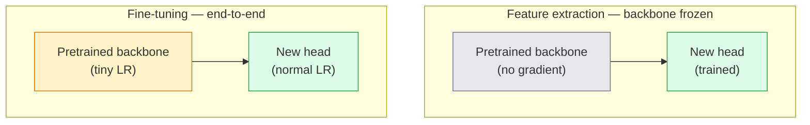

# 迁移学习与微调

> 别人已经烧了一百万 GPU 小时,教会网络边缘、纹理和物体部件长什么样。自己动手训练之前,先把这些特征借过来。

**类型:** 动手构建
**编程语言:** Python
**前置要求:** 第 4 阶段第 03 课(CNN),第 4 阶段第 04 课(图像分类)
**预计耗时:** 约 75 分钟

## 学习目标

- 区分特征提取与微调,并能根据数据集规模、领域距离和算力预算做出正确选择
- 加载预训练骨干、替换分类头,用不到 20 行代码只训练头部达到可用基线
- 配合分层学习率渐进解冻,让早期通用特征的更新幅度小于后期任务相关特征
- 诊断三种常见故障:解冻块学习率过高导致特征漂移、小数据集上 BN 统计量崩溃、灾难性遗忘

## 问题

在 ImageNet 上训练一个 ResNet-50 大约要烧 2,000 GPU 小时。没有多少团队能为每个交付的任务都掏出这笔预算。几乎所有团队实际交付的东西都是:一个预训练骨干,加上一个用几百到几千张任务相关图像训练的新头部。

这不是偷懒。任何 ImageNet 训练出来的 CNN,第一个卷积块学到的是边缘和类 Gabor 滤波器,接下来几块学到纹理和简单基元,中间几块学到物体部件,最后几块学到接近 1,000 个 ImageNet 类别的组合。这个层级结构的前 90%,几乎可以原封不动地迁移到医学影像、工业质检、卫星数据和任何其他视觉任务上——因为自然界中边缘和纹理的"词汇表"是有限的。你真正要训练的,只有最后那 10%。

把迁移做对,路上有三个 bug 等着你:学习率太高毁掉预训练特征;冻结太多让模型得不到信息;以及让 BatchNorm 的运行统计量漂移到一个其余网络从未学过的小数据集上。本课会把每一个都故意踩一遍。

## 概念

### 特征提取 vs 微调

两种模式,取决于你对预训练特征有多信任、手上有多少数据。



经验法则:

| 数据集规模 | 领域距离 | 配方 |
|--------------|-----------------|--------|
| < 1k 张 | 接近 ImageNet | 冻结骨干,只训练头部 |
| 1k–10k | 接近 | 冻结前 2–3 个 stage,微调其余 |
| 10k–100k | 任意 | 配合分层学习率端到端微调 |
| 100k+ | 远 | 全部微调;领域足够远时考虑从零训练 |

"接近 ImageNet"大致指:自然 RGB 照片,内容是物体。医学 CT、俯视卫星影像、显微图像属于远领域——特征仍然有用,但你要放开更多层去适应。

### 冻结为什么行得通

CNN 从 ImageNet 学到的特征,并不是为那 1,000 个类别量身定制的,而是为自然图像的统计特性定制的:特定朝向的边缘、纹理、对比度模式、形状基元。这些统计特性几乎在人类叫得出名字的所有视觉领域里都是稳定的。这就是为什么一个 ImageNet 上训练的模型,只换一个新的线性头(骨干完全不动),在 CIFAR-10 上零样本就能达到 80%+ 的准确率——头部学的只是:对这项任务,该给哪些已经学好的特征分配多大权重。

### 分层学习率

真要解冻时,靠前的层应该比靠后的层训得慢。前面的层编码的是你想保留的通用特征,后面的层编码的是需要大幅调整的任务相关结构。

```
Typical recipe:

  stage 0 (stem + first group): lr = base_lr / 100    (mostly fixed)
  stage 1:                       lr = base_lr / 10
  stage 2:                       lr = base_lr / 3
  stage 3 (last backbone group): lr = base_lr
  head:                          lr = base_lr  (or slightly higher)
```

在 PyTorch 里,这只是传给优化器的一个参数组列表。一个模型,五种学习率,零额外代码。

### BatchNorm 的问题

BN 层持有 `running_mean` 和 `running_var` 缓冲区,它们是在 ImageNet 上算出来的。如果你的任务有不同的像素分布——不同的光照、不同的传感器、不同的色彩空间——这些缓冲区的值就是错的。按优先级排列的三个选项:

1. **让 BN 处于 train 模式微调。** 让 BN 的运行统计量跟着其他参数一起更新。任务数据集达到中等规模(>= 5k 样本)时的默认选择。
2. **把 BN 冻结在 eval 模式。** 保留 ImageNet 统计量,只训练权重。数据集小到 BN 的移动平均会噪声很大时,这个是对的。
3. **把 BN 换成 GroupNorm。** 彻底消除移动平均问题。检测和分割骨干常用,因为那里每块 GPU 上的 batch size 很小。

这里搞错,准确率会无声无息地掉 5–15%。

### 头部设计

分类头就是 1–3 个线性层,可加一个 dropout。每个 torchvision 骨干都自带一个默认头部,你要做的就是换掉它:

```
backbone.fc = nn.Linear(backbone.fc.in_features, num_classes)          # ResNet
backbone.classifier[1] = nn.Linear(..., num_classes)                    # EfficientNet, MobileNet
backbone.heads.head = nn.Linear(..., num_classes)                       # torchvision ViT
```

小数据集上,一个线性层通常就够了。任务分布与骨干训练分布距离较远时,加一个隐藏层(Linear → ReLU → Dropout → Linear)会有帮助。

### 逐层学习率衰减

现代微调(BEiT、DINOv2、ViT-B 微调)用的更平滑版本。不再按 stage 分组,而是让每一层的学习率都比它上面一层略小:

```
lr_layer_k = base_lr * decay^(L - k)
```

decay = 0.75、L = 12 个 Transformer 块时,第一个块的训练速率是头部的 `0.75^11 ≈ 0.04` 倍。这对 Transformer 微调比对 CNN 更重要——CNN 按 stage 分组通常就够了。

### 该评估什么

迁移学习的实验,需要盯两个从零训练时不会关心的数字:

- **仅预训练准确率** ——骨干冻结时头部的准确率。这是你的下限。
- **微调后准确率** ——同一个模型端到端训练之后的准确率。这是你的上限。

如果微调后比仅预训练还低,你就是有学习率或 BN 的 bug。两个数字永远都要打印。

```figure
transfer-learning
```

## 动手构建

### 第 1 步:加载预训练骨干并检查

```python
import torch
import torch.nn as nn
from torchvision.models import resnet18, ResNet18_Weights

backbone = resnet18(weights=ResNet18_Weights.IMAGENET1K_V1)
print(backbone)
print()
print("classifier head:", backbone.fc)
print("feature dim:", backbone.fc.in_features)
```

`ResNet18` 有四个 stage(`layer1..layer4`),外加一个 stem 和一个 `fc` 头。每个 torchvision 分类骨干都有对应的结构。

### 第 2 步:特征提取——全部冻结,换掉头部

```python
def make_feature_extractor(num_classes=10):
    model = resnet18(weights=ResNet18_Weights.IMAGENET1K_V1)
    for p in model.parameters():
        p.requires_grad = False
    model.fc = nn.Linear(model.fc.in_features, num_classes)
    return model

model = make_feature_extractor(num_classes=10)
trainable = sum(p.numel() for p in model.parameters() if p.requires_grad)
frozen = sum(p.numel() for p in model.parameters() if not p.requires_grad)
print(f"trainable: {trainable:>10,}")
print(f"frozen:    {frozen:>10,}")
```

只有 `model.fc` 可训练,骨干是一个冻结的特征提取器。

### 第 3 步:分层学习率微调

一个按 stage 设定学习率的参数组构造函数。

```python
def discriminative_param_groups(model, base_lr=1e-3, decay=0.3):
    stages = [
        ["conv1", "bn1"],
        ["layer1"],
        ["layer2"],
        ["layer3"],
        ["layer4"],
        ["fc"],
    ]
    groups = []
    for i, names in enumerate(stages):
        lr = base_lr * (decay ** (len(stages) - 1 - i))
        params = [p for n, p in model.named_parameters()
                  if any(n.startswith(k) for k in names)]
        if params:
            groups.append({"params": params, "lr": lr, "name": "_".join(names)})
    return groups

model = resnet18(weights=ResNet18_Weights.IMAGENET1K_V1)
model.fc = nn.Linear(model.fc.in_features, 10)
for p in model.parameters():
    p.requires_grad = True

groups = discriminative_param_groups(model)
for g in groups:
    print(f"{g['name']:>10s}  lr={g['lr']:.2e}  params={sum(p.numel() for p in g['params']):>8,}")
```

`decay=0.3` 意味着每个 stage 的训练速率是下一个的 30%:`fc` 拿 `base_lr`,`layer4` 拿 `0.3 * base_lr`,`conv1` 拿 `0.3^5 * base_lr ≈ 0.00243 * base_lr`。听起来极端,实测有效。

### 第 4 步:处理 BatchNorm

一个工具函数:冻结 BN 的运行统计量,但不冻结它的权重。

```python
def freeze_bn_stats(model):
    for m in model.modules():
        if isinstance(m, (nn.BatchNorm1d, nn.BatchNorm2d, nn.BatchNorm3d)):
            m.eval()
            for p in m.parameters():
                p.requires_grad = False
    return model
```

在每个 epoch 开头调用 `model.train()` 之后调用它。`model.train()` 会把一切切到训练模式,这个函数只把 BN 层切回去。

### 第 5 步:最小端到端微调循环

```python
from torch.optim import SGD
from torch.utils.data import DataLoader
from torch.optim.lr_scheduler import CosineAnnealingLR
import torch.nn.functional as F

def fine_tune(model, train_loader, val_loader, device, epochs=5, base_lr=1e-3, freeze_bn=False):
    model = model.to(device)
    groups = discriminative_param_groups(model, base_lr=base_lr)
    optimizer = SGD(groups, momentum=0.9, weight_decay=1e-4, nesterov=True)
    scheduler = CosineAnnealingLR(optimizer, T_max=epochs)

    for epoch in range(epochs):
        model.train()
        if freeze_bn:
            freeze_bn_stats(model)
        tr_loss, tr_correct, tr_total = 0.0, 0, 0
        for x, y in train_loader:
            x, y = x.to(device), y.to(device)
            logits = model(x)
            loss = F.cross_entropy(logits, y, label_smoothing=0.1)
            optimizer.zero_grad()
            loss.backward()
            optimizer.step()
            tr_loss += loss.item() * x.size(0)
            tr_total += x.size(0)
            tr_correct += (logits.argmax(-1) == y).sum().item()
        scheduler.step()

        model.eval()
        va_total, va_correct = 0, 0
        with torch.no_grad():
            for x, y in val_loader:
                x, y = x.to(device), y.to(device)
                pred = model(x).argmax(-1)
                va_total += x.size(0)
                va_correct += (pred == y).sum().item()
        print(f"epoch {epoch}  train {tr_loss/tr_total:.3f}/{tr_correct/tr_total:.3f}  "
              f"val {va_correct/va_total:.3f}")
    return model
```

用上面的配方在 CIFAR-10 上训五个 epoch,`ResNet18-IMAGENET1K_V1` 能从约 70% 的零样本线性探测准确率升到约 93% 的微调准确率。只训头部不动骨干,会在 86% 左右封顶。

### 第 6 步:渐进解冻

一个从后往前、每个 epoch 解冻一个 stage 的调度。以多花几个 epoch 为代价,缓解特征漂移。

```python
def progressive_unfreeze_schedule(model):
    stages = ["layer4", "layer3", "layer2", "layer1"]
    yielded = set()

    def start():
        for p in model.parameters():
            p.requires_grad = False
        for p in model.fc.parameters():
            p.requires_grad = True

    def unfreeze(epoch):
        if epoch < len(stages):
            name = stages[epoch]
            yielded.add(name)
            for n, p in model.named_parameters():
                if n.startswith(name):
                    p.requires_grad = True
            return name
        return None

    return start, unfreeze
```

第一个 epoch 之前调一次 `start()`;每个 epoch 开头调 `unfreeze(epoch)`。可训练参数集合变化时要重建优化器——否则被冻结的参数还带着缓存的动量,会把优化器搞糊涂。

## 投入使用

大多数真实任务,`torchvision.models` 加三行就够了。上面那套较重的机器,是等你撞上库默认值解决不了的问题时才需要的。

```python
from torchvision.models import resnet50, ResNet50_Weights

model = resnet50(weights=ResNet50_Weights.IMAGENET1K_V2)
model.fc = nn.Linear(model.fc.in_features, num_classes)
optimizer = torch.optim.AdamW(model.parameters(), lr=1e-4, weight_decay=1e-4)
```

另外两个生产级默认选择:

- `timm` 提供约 800 个预训练视觉骨干,API 统一(`timm.create_model("resnet50", pretrained=True, num_classes=10)`)。超出 torchvision 模型库范围的微调,它是事实标准。
- 用 Transformer 时,`transformers.AutoModelForImageClassification.from_pretrained(name, num_labels=N)` 给你 ViT / BEiT / DeiT,加载语义与文本模型完全一致。

## 交付

本课会产出:

- `outputs/prompt-fine-tune-planner.md` ——一个提示词:根据数据集规模、领域距离和算力预算,在特征提取、渐进解冻、端到端微调之间做选择。
- `outputs/skill-freeze-inspector.md` ——一个技能:给定一个 PyTorch 模型,报告哪些参数可训练、哪些 BatchNorm 层处于 eval 模式、优化器是否真的收到了可训练参数。

## 练习

1. **(易)** 在同一个合成 CIFAR 数据集上,分别以线性探测(骨干冻结)和完整微调两种方式训练 `ResNet18`,并列报告两种准确率。解释哪个差距说明特征迁移得好,哪个差距说明迁移得不好。
2. **(中)** 故意引入一个 bug:把骨干 stage 的 `base_lr` 设成 `1e-1`。观察训练损失爆炸,然后用 `discriminative_param_groups` 修复。记录每个 stage 开始发散的学习率。
3. **(难)** 取一个医学影像数据集(如 CheXpert-small、PatchCamelyon 或 HAM10000),比较三种方案:(a) ImageNet 预训练冻结骨干 + 线性头;(b) ImageNet 预训练端到端微调;(c) 从零训练。报告各自的准确率与算力开销。数据集多大规模时,从零训练开始有竞争力?

## 关键术语

| 术语 | 人们常说的 | 实际含义 |
|------|----------------|----------------------|
| 特征提取(Feature extraction) | "冻住,只训头" | 骨干参数冻结,只有新分类头接收梯度 |
| 微调(Fine-tuning) | "端到端重训" | 所有参数可训练,学习率通常远小于从零训练 |
| 分层学习率(Discriminative LR) | "前面的层 LR 小一点" | 优化器参数组中,靠前 stage 的学习率是靠后 stage 的一个分数 |
| 逐层学习率衰减(Layer-wise LR decay) | "平滑的 LR 梯度" | 每层学习率乘以 decay^(L - k);Transformer 微调中常用 |
| 灾难性遗忘(Catastrophic forgetting) | "模型把 ImageNet 忘了" | 学习率过高,在新任务的信号学到之前就把预训练特征覆盖掉了 |
| BN 统计量漂移 | "running mean 不对了" | BatchNorm 的 running_mean/var 是在与当前任务不同的分布上算的,暗中拉低准确率 |
| 线性探测(Linear probe) | "冻骨干 + 线性头" | 对预训练特征的评估方式——冻结表示之上最优线性分类器的准确率 |
| 灾难性崩溃(Catastrophic collapse) | "全预测成一个类" | 微调学习率高到在头部梯度来得及稳定之前就毁掉了特征,就会出现这种情况 |

## 延伸阅读

- [How transferable are features in deep neural networks? (Yosinski et al., 2014)](https://arxiv.org/abs/1411.1792) ——量化各层特征可迁移性的那篇论文
- [Universal Language Model Fine-tuning (ULMFiT, Howard & Ruder, 2018)](https://arxiv.org/abs/1801.06146) ——分层学习率 / 渐进解冻配方的原始出处;这些思想可以直接搬到视觉
- [timm documentation](https://huggingface.co/docs/timm) ——现代视觉骨干的参考手册,含它们训练时用的精确微调默认值
- [A Simple Framework for Linear-Probe Evaluation (Kornblith et al., 2019)](https://arxiv.org/abs/1805.08974) ——为什么线性探测准确率重要,以及如何正确报告它
