# 目标检测——从零理解 YOLO

> 检测 = 分类 + 回归,在特征图的每个位置上跑一遍,最后用非极大值抑制收拾干净。

**类型:** 动手构建
**编程语言:** Python
**前置要求:** 第 4 阶段第 03 课(CNN),第 4 阶段第 04 课(图像分类),第 4 阶段第 05 课(迁移学习)
**预计耗时:** 约 75 分钟

## 学习目标

- 解释"网格 + 锚框"设计如何把检测变成稠密预测问题,并说清输出张量里每个数字的含义
- 计算框之间的交并比(IoU),并从零实现非极大值抑制(NMS)
- 在预训练骨干之上搭建一个最小的 YOLO 风格检测头,包含分类、objectness 和框回归三部分损失
- 读懂一行检测指标(precision@0.5、recall、mAP@0.5、mAP@0.5:0.95),并判断下一步该调哪个旋钮

## 问题

分类说:"这张图是狗。"检测说:"像素 (112, 40, 280, 210) 处有一只狗,(400, 180, 560, 310) 处有一只猫,画面里没有别的东西。"这一个结构性变化——从"每张图一个标签"变成"预测数量不定的带标签方框"——就是每一个自动驾驶系统、每一个安防产品、每一个文档版面解析器、每一条工厂视觉产线所依赖的东西。

检测也是视觉领域所有工程权衡集中爆发的地方。你要框准(回归头),要每个框的类别对(分类头),要模型知道"这里什么都没有"(objectness 分数),还要每个真实物体恰好只报一次(NMS)。漏掉任何一环,流水线就会漏检、报出幻觉框,或者把同一个物体以略有不同的位置报上十五遍。

YOLO(You Only Look Once,Redmon 等人 2016)是第一个用卷积网络单次前向就把这一切跑进实时的设计;同样的结构性决策至今仍是现代检测器的骨干(YOLOv8、YOLOv9、YOLO-NAS、RT-DETR)。学会核心,每个变体都只是同一堆零件的重新排列。

## 概念

### 检测即稠密预测

分类器对每张图输出 C 个数。YOLO 风格的检测器输出 `(S x S x (5 + C))` 个数,S 是空间网格尺寸。

```mermaid
flowchart LR
    IMG["Input 416x416 RGB"] --> BB["Backbone<br/>(ResNet, DarkNet, ...)"]
    BB --> FM["Feature map<br/>(C_feat, 13, 13)"]
    FM --> HEAD["Detection head<br/>(1x1 convs)"]
    HEAD --> OUT["Output tensor<br/>(13, 13, B * (5 + C))"]
    OUT --> DEC["Decode<br/>(grid + sigmoid + exp)"]
    DEC --> NMS["Non-max suppression"]
    NMS --> RESULT["Final boxes"]

    style IMG fill:#dbeafe,stroke:#2563eb
    style HEAD fill:#fef3c7,stroke:#d97706
    style NMS fill:#fecaca,stroke:#dc2626
    style RESULT fill:#dcfce7,stroke:#16a34a
```



`S * S` 个网格单元中的每一个预测 `B` 个框。每个框包含:

- 4 个描述几何的数:`tx, ty, tw, th`。
- 1 个 objectness 分数:"这个单元中心有物体吗?"
- C 个类别概率。

每个单元共 `B * (5 + C)` 个数。VOC 数据集上 `S=13, B=2, C=20`,即每格 50 个数。

### 为什么用网格和锚框

朴素回归会把每个物体的 `(x, y, w, h)` 当作绝对坐标直接预测。这对卷积网络很难——平移图像不该让所有预测都平移同样的量,因为每个物体在空间上是有锚定位置的。网格的解法是:把每个真值框分配给它的中心落入的那个网格单元,只有那个单元对这个物体负责。

锚框解决第二个问题。一个 3x3 卷积很难从感受野只有 16 像素的特征单元里,直接回归出一个 500 像素宽的框。于是我们在每个单元预定义 `B` 个先验框形状(锚框),只预测相对锚框的小偏移。模型学会的是:挑对锚框,然后微调它——而不是从零回归。

```
Anchor box priors (example for 416x416 input):

  small:   (30,  60)
  medium:  (75,  170)
  large:   (200, 380)

At each grid cell, every anchor emits (tx, ty, tw, th, obj, c_1, ..., c_C).
```

现代检测器常用 FPN,在不同分辨率的特征层上配不同的锚框组——浅层高分辨率图配小锚框,深层低分辨率图配大锚框。同一个思路,更多尺度。

### 解码预测值

原始的 `tx, ty, tw, th` 不是框坐标,是回归目标,画图前要先变换:

```
centre x  = (sigmoid(tx) + cell_x) * stride
centre y  = (sigmoid(ty) + cell_y) * stride
width     = anchor_w * exp(tw)
height    = anchor_h * exp(th)
```

`sigmoid` 把中心偏移约束在单元内部;`exp` 让宽高可以相对锚框自由缩放而不会变号;`stride` 把网格坐标换算回像素。这套解码自 YOLOv2 起,历代版本没变过。

### IoU

检测领域通用的框间相似度度量:

```
IoU(A, B) = area(A intersect B) / area(A union B)
```

IoU = 1 表示完全重合,IoU = 0 表示毫无重叠。预测框与真值框的 IoU,决定这个预测算不算真阳性(通常 IoU >= 0.5);两个预测框之间的 IoU,是 NMS 去重的依据。

### 非极大值抑制

在相邻锚框上训练的卷积网络,常常会对同一个物体报出多个互相重叠的框。NMS 保留置信度最高的那个,删掉与它 IoU 超过阈值的其他预测。

```
NMS(boxes, scores, iou_threshold):
    sort boxes by score descending
    keep = []
    while boxes not empty:
        pick the top-scoring box, add to keep
        remove every box with IoU > iou_threshold to the picked box
    return keep
```

典型阈值:目标检测用 0.45。近年的检测器有的换成 `soft-NMS`、`DIoU-NMS`,有的直接学习抑制过程(RT-DETR),但结构目的是一样的。

### 损失函数

YOLO 的损失是三个带权重的损失相加:

```
L = lambda_coord * L_box(pred, target, where obj=1)
  + lambda_obj   * L_obj(pred, 1,     where obj=1)
  + lambda_noobj * L_obj(pred, 0,     where obj=0)
  + lambda_cls   * L_cls(pred, target, where obj=1)
```

只有含物体的单元才计入框回归损失和分类损失;不含物体的单元只计入 objectness 损失(教模型保持沉默)。`lambda_noobj` 通常很小(约 0.5),因为绝大多数单元是空的,不压低权重它们会淹没总损失。

现代变体把 MSE 框损失换成 CIoU / DIoU(直接优化 IoU),用 focal loss 处理类别不均衡,用 quality focal loss 平衡 objectness。三件套结构没有变。

### 检测指标

分类的准确率在这里不顶用。管用的是四个数字:

- **Precision@IoU=0.5** ——被判为阳性的预测里,真正正确的比例。
- **Recall@IoU=0.5** ——真实物体里,被找到了多少。
- **AP@0.5** ——IoU 阈值 0.5 下 PR 曲线的面积,每类一个数。
- **mAP@0.5:0.95** ——在 IoU 阈值 0.5、0.55、……、0.95 上 AP 的平均。COCO 指标,最严也最有信息量。

四个都要报。一个 mAP@0.5 很高但 mAP@0.5:0.95 很低的检测器,是定位"大致对但不够紧"——换更好的框回归损失。一个高精确率、低召回的检测器是太保守了——降低置信度阈值或加大 objectness 权重。

```figure
object-detection-nms
```

## 动手构建

### 第 1 步:IoU

本课的主力函数。输入是两组 `(x1, y1, x2, y2)` 格式的框。

```python
import numpy as np

def box_iou(boxes_a, boxes_b):
    ax1, ay1, ax2, ay2 = boxes_a[:, 0], boxes_a[:, 1], boxes_a[:, 2], boxes_a[:, 3]
    bx1, by1, bx2, by2 = boxes_b[:, 0], boxes_b[:, 1], boxes_b[:, 2], boxes_b[:, 3]

    inter_x1 = np.maximum(ax1[:, None], bx1[None, :])
    inter_y1 = np.maximum(ay1[:, None], by1[None, :])
    inter_x2 = np.minimum(ax2[:, None], bx2[None, :])
    inter_y2 = np.minimum(ay2[:, None], by2[None, :])

    inter_w = np.clip(inter_x2 - inter_x1, 0, None)
    inter_h = np.clip(inter_y2 - inter_y1, 0, None)
    inter = inter_w * inter_h

    area_a = (ax2 - ax1) * (ay2 - ay1)
    area_b = (bx2 - bx1) * (by2 - by1)
    union = area_a[:, None] + area_b[None, :] - inter
    return inter / np.clip(union, 1e-8, None)
```

返回 `(N_a, N_b)` 的两两 IoU 矩阵。要和单个真值框比,让其中一个数组形状为 `(1, 4)` 即可。

### 第 2 步:非极大值抑制

```python
def nms(boxes, scores, iou_threshold=0.45):
    order = np.argsort(-scores)
    keep = []
    while len(order) > 0:
        i = order[0]
        keep.append(i)
        if len(order) == 1:
            break
        rest = order[1:]
        ious = box_iou(boxes[[i]], boxes[rest])[0]
        order = rest[ious <= iou_threshold]
    return np.array(keep, dtype=np.int64)
```

确定性算法,排序带来 `O(N log N)`,在相同输入上与 `torchvision.ops.nms` 行为一致。

### 第 3 步:框的编码与解码

在像素坐标与网络真正回归的 `(tx, ty, tw, th)` 目标之间互转。

```python
def encode(box_xyxy, cell_x, cell_y, stride, anchor_wh):
    x1, y1, x2, y2 = box_xyxy
    cx = 0.5 * (x1 + x2)
    cy = 0.5 * (y1 + y2)
    w = x2 - x1
    h = y2 - y1
    tx = cx / stride - cell_x
    ty = cy / stride - cell_y
    tw = np.log(w / anchor_wh[0] + 1e-8)
    th = np.log(h / anchor_wh[1] + 1e-8)
    return np.array([tx, ty, tw, th])


def decode(tx_ty_tw_th, cell_x, cell_y, stride, anchor_wh):
    tx, ty, tw, th = tx_ty_tw_th
    cx = (sigmoid(tx) + cell_x) * stride
    cy = (sigmoid(ty) + cell_y) * stride
    w = anchor_wh[0] * np.exp(tw)
    h = anchor_wh[1] * np.exp(th)
    return np.array([cx - w / 2, cy - h / 2, cx + w / 2, cy + h / 2])


def sigmoid(x):
    return 1.0 / (1.0 + np.exp(-x))
```

测试:编码一个框再解码——应当得到非常接近原框的结果(当 `tx` 不在 sigmoid 输出范围内时,逆变换不可能完美)。

### 第 4 步:最小 YOLO 检测头

特征图上的一层 1x1 卷积,reshape 成 `(B, S, S, num_anchors, 5 + C)`。

```python
import torch
import torch.nn as nn

class YOLOHead(nn.Module):
    def __init__(self, in_c, num_anchors, num_classes):
        super().__init__()
        self.num_anchors = num_anchors
        self.num_classes = num_classes
        self.conv = nn.Conv2d(in_c, num_anchors * (5 + num_classes), kernel_size=1)

    def forward(self, x):
        n, _, h, w = x.shape
        y = self.conv(x)
        y = y.view(n, self.num_anchors, 5 + self.num_classes, h, w)
        y = y.permute(0, 3, 4, 1, 2).contiguous()
        return y
```

输出形状:`(N, H, W, num_anchors, 5 + C)`。最后一维是 `[tx, ty, tw, th, obj, cls_0, ..., cls_{C-1}]`。

### 第 5 步:真值分配

对每个真值框,决定由哪个 `(单元, 锚框)` 负责。

```python
def assign_targets(boxes_xyxy, classes, anchors, stride, grid_size, num_classes):
    num_anchors = len(anchors)
    target = np.zeros((grid_size, grid_size, num_anchors, 5 + num_classes), dtype=np.float32)
    has_obj = np.zeros((grid_size, grid_size, num_anchors), dtype=bool)

    for box, cls in zip(boxes_xyxy, classes):
        x1, y1, x2, y2 = box
        cx, cy = 0.5 * (x1 + x2), 0.5 * (y1 + y2)
        gx, gy = int(cx / stride), int(cy / stride)
        bw, bh = x2 - x1, y2 - y1

        ious = np.array([
            (min(bw, aw) * min(bh, ah)) / (bw * bh + aw * ah - min(bw, aw) * min(bh, ah))
            for aw, ah in anchors
        ])
        best = int(np.argmax(ious))
        aw, ah = anchors[best]

        target[gy, gx, best, 0] = cx / stride - gx
        target[gy, gx, best, 1] = cy / stride - gy
        target[gy, gx, best, 2] = np.log(bw / aw + 1e-8)
        target[gy, gx, best, 3] = np.log(bh / ah + 1e-8)
        target[gy, gx, best, 4] = 1.0
        target[gy, gx, best, 5 + cls] = 1.0
        has_obj[gy, gx, best] = True
    return target, has_obj
```

锚框选择标准是"与真值框形状 IoU 最大"——一个便宜的代理,与 YOLOv2/v3 的分配方式一致。v5 及以后用更精巧的策略(task-aligned matching、dynamic k),是对同一思想的打磨。

### 第 6 步:三部分损失

```python
def yolo_loss(pred, target, has_obj, lambda_coord=5.0, lambda_obj=1.0, lambda_noobj=0.5, lambda_cls=1.0):
    has_obj_t = torch.from_numpy(has_obj).bool()
    target_t = torch.from_numpy(target).float()

    # box-regression loss: only on cells with objects
    box_pred = pred[..., :4][has_obj_t]
    box_true = target_t[..., :4][has_obj_t]
    loss_box = torch.nn.functional.mse_loss(box_pred, box_true, reduction="sum")

    # objectness loss
    obj_pred = pred[..., 4]
    obj_true = target_t[..., 4]
    loss_obj_pos = torch.nn.functional.binary_cross_entropy_with_logits(
        obj_pred[has_obj_t], obj_true[has_obj_t], reduction="sum")
    loss_obj_neg = torch.nn.functional.binary_cross_entropy_with_logits(
        obj_pred[~has_obj_t], obj_true[~has_obj_t], reduction="sum")

    # classification loss on cells with objects
    cls_pred = pred[..., 5:][has_obj_t]
    cls_true = target_t[..., 5:][has_obj_t]
    loss_cls = torch.nn.functional.binary_cross_entropy_with_logits(
        cls_pred, cls_true, reduction="sum")

    total = (lambda_coord * loss_box
             + lambda_obj * loss_obj_pos
             + lambda_noobj * loss_obj_neg
             + lambda_cls * loss_cls)
    return total, {"box": loss_box.item(), "obj_pos": loss_obj_pos.item(),
                   "obj_neg": loss_obj_neg.item(), "cls": loss_cls.item()}
```

五个超参数,每个 YOLO 教程要么硬编码要么网格搜索。比例才是重点:`lambda_coord=5, lambda_noobj=0.5` 沿用 YOLOv1 原论文,至今仍是合理的默认值。

### 第 7 步:推理流水线

解码检测头原始输出,套 sigmoid/exp,按 objectness 过滤,再过 NMS。

```python
def postprocess(pred_tensor, anchors, stride, img_size, conf_threshold=0.25, iou_threshold=0.45):
    pred = pred_tensor.detach().cpu().numpy()
    grid_h, grid_w = pred.shape[1], pred.shape[2]
    num_anchors = len(anchors)

    boxes, scores, classes = [], [], []
    for gy in range(grid_h):
        for gx in range(grid_w):
            for a in range(num_anchors):
                tx, ty, tw, th, obj, *cls = pred[0, gy, gx, a]
                score = sigmoid(obj) * sigmoid(np.array(cls)).max()
                if score < conf_threshold:
                    continue
                cls_idx = int(np.argmax(cls))
                cx = (sigmoid(tx) + gx) * stride
                cy = (sigmoid(ty) + gy) * stride
                w = anchors[a][0] * np.exp(tw)
                h = anchors[a][1] * np.exp(th)
                boxes.append([cx - w / 2, cy - h / 2, cx + w / 2, cy + h / 2])
                scores.append(float(score))
                classes.append(cls_idx)

    if not boxes:
        return np.zeros((0, 4)), np.zeros((0,)), np.zeros((0,), dtype=int)
    boxes = np.array(boxes)
    scores = np.array(scores)
    classes = np.array(classes)
    keep = nms(boxes, scores, iou_threshold)
    return boxes[keep], scores[keep], classes[keep]
```

这就是完整的评估路径:检测头 → 解码 → 阈值过滤 → NMS。

## 投入使用

`torchvision.models.detection` 提供生产级检测器,概念结构完全相同。加载预训练模型只要三行。

```python
import torch
from torchvision.models.detection import fasterrcnn_resnet50_fpn_v2

model = fasterrcnn_resnet50_fpn_v2(weights="DEFAULT")
model.eval()
with torch.no_grad():
    predictions = model([torch.randn(3, 400, 600)])
print(predictions[0].keys())
print(f"boxes:  {predictions[0]['boxes'].shape}")
print(f"scores: {predictions[0]['scores'].shape}")
print(f"labels: {predictions[0]['labels'].shape}")
```

实时推理流水线的事实标准是 `ultralytics`(YOLOv8/v9):`from ultralytics import YOLO; model = YOLO('yolov8n.pt'); model(img)`。模型内部完成解码和 NMS,返回的就是你上面亲手构建的 `boxes / scores / labels` 三元组。

## 交付

本课会产出:

- `outputs/prompt-detection-metric-reader.md` ——一个提示词:把 `precision, recall, AP, mAP@0.5:0.95` 这一行指标翻译成一句话诊断,外加最值得做的下一个实验。
- `outputs/skill-anchor-designer.md` ——一个技能:给定数据集的真值框,对 `(w, h)` 跑 k-means,输出每个 FPN 层级的锚框组,以及帮你决定锚框数量的覆盖率统计。

## 练习

1. **(易)** 实现 `box_iou`,在 1,000 对随机框上与 `torchvision.ops.box_iou` 对比,验证最大绝对误差小于 `1e-6`。
2. **(中)** 把 `yolo_loss` 改成用 `CIoU` 框损失替代 MSE 的版本。在 100 张图的合成数据集上,展示相同 epoch 数内 CIoU 收敛到的 mAP@0.5:0.95 优于 MSE。
3. **(难)** 实现多尺度推理:同一张图以三种分辨率送入模型,合并所有框预测,最后统一做一次 NMS。在留出集上测量相对单尺度推理的 mAP 提升。

## 关键术语

| 术语 | 人们常说的 | 实际含义 |
|------|----------------|----------------------|
| 锚框(Anchor) | "框的先验" | 每个网格单元上预定义的框形状,网络预测相对它的偏移,而不是绝对坐标 |
| IoU | "重叠度" | 两个框的交并比;检测领域通用的相似度度量 |
| NMS | "去重" | 贪心算法:保留最高分预测,删除与其重叠超过阈值的其他预测 |
| Objectness | "这里有没有东西" | 每个锚框、每个单元上的一个标量,预测该单元中心是否存在物体 |
| 网格步长(Grid stride) | "下采样倍率" | 每个网格单元对应的像素数;416 像素输入配 13 网格的检测头,stride 就是 32 |
| mAP | "平均精度均值" | PR 曲线下面积的平均,先按类别平均,(COCO 中)再按 IoU 阈值平均 |
| AP@0.5 | "PASCAL VOC AP" | IoU 阈值 0.5 下的平均精度,是宽松的版本 |
| mAP@0.5:0.95 | "COCO AP" | 在 IoU 阈值 0.5..0.95(步长 0.05)上取平均,是严格的版本,当前社区标准 |

## 延伸阅读

- [YOLOv1: You Only Look Once (Redmon et al., 2016)](https://arxiv.org/abs/1506.02640) ——开山论文;此后每一代 YOLO 都是对这个结构的打磨
- [YOLOv3 (Redmon & Farhadi, 2018)](https://arxiv.org/abs/1804.02767) ——引入多尺度 FPN 式检测头的论文,图示至今最清晰
- [Ultralytics YOLOv8 docs](https://docs.ultralytics.com) ——当前的生产参考,覆盖数据集格式、增强、训练配方
- [The Illustrated Guide to Object Detection (Jonathan Hui)](https://jonathan-hui.medium.com/object-detection-series-24d03a12f904) ——最通俗易懂的全检测器家族导览;理解 DETR、RetinaNet、FCOS 与 YOLO 之间关系的无价之宝
