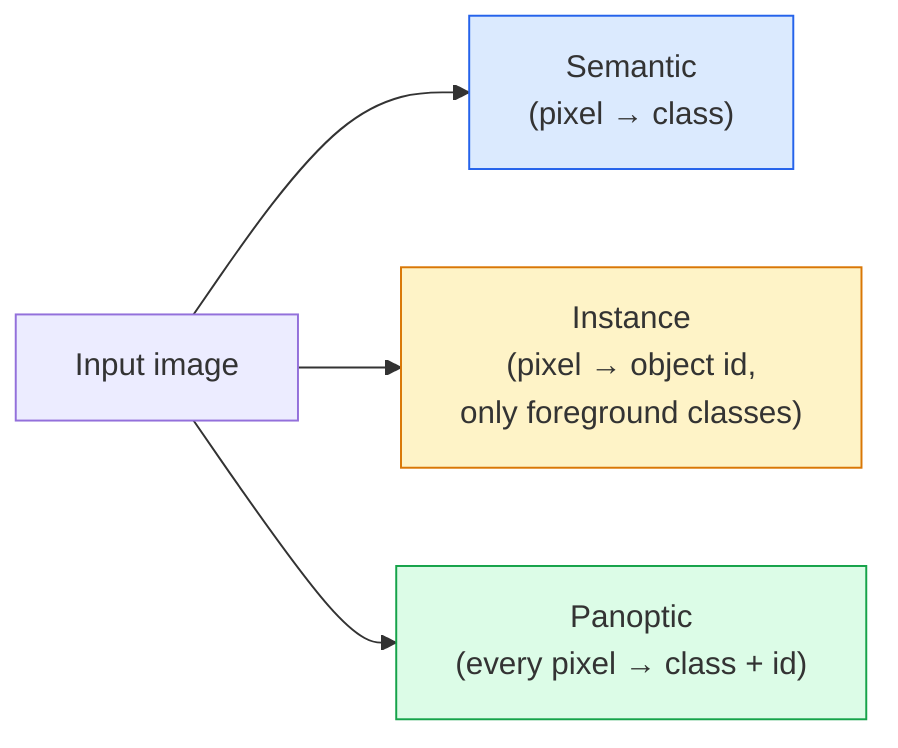
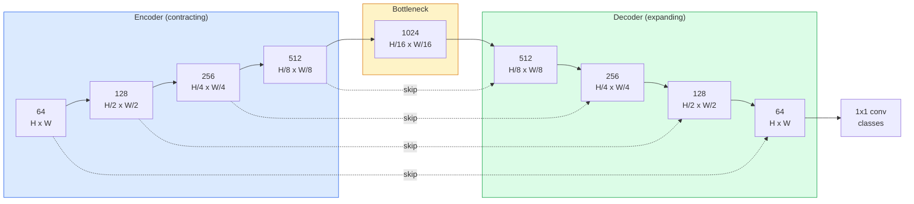

# 语义分割——U-Net

> 分割就是在每个像素上做分类。U-Net 的做法:一边下采样的编码器配一边上采样的解码器,中间用跳跃连接搭起桥。

**类型:** 动手构建
**编程语言:** Python
**前置要求:** 第 4 阶段第 03 课(CNN),第 4 阶段第 04 课(图像分类)
**预计耗时:** 约 75 分钟

## 学习目标

- 区分语义分割、实例分割和全景分割,能为给定问题选对任务
- 用 PyTorch 从零搭建 U-Net:编码器模块、瓶颈层、带转置卷积的解码器和跳跃连接
- 实现逐像素交叉熵、Dice 损失,以及当前医学与工业分割默认使用的组合损失
- 读懂逐类 IoU 与 Dice 指标,判断低分是小物体召回不足、边界不准,还是类别不均衡造成的

## 问题

分类每张图输出一个标签,检测每张图输出寥寥几个框,分割则为每个像素输出一个标签。输入是 `H x W`,输出就是 `H x W` 的张量(语义分割)或 `H x W x N_instances`(实例分割)。一张图就是上百万个预测,而不是一个。

正是这种结构,让分割撑起了几乎所有稠密预测类的视觉产品:医学影像(肿瘤掩码)、自动驾驶(道路、车道、障碍物)、卫星(建筑轮廓、农田边界)、文档解析(版面区域)、机器人(可抓取区域)。这些任务,框一个框是解决不了的——它们需要精确的轮廓。

架构层面的问题说起来简单,解决起来不简单:网络既要看到图像的全局上下文(这是什么场景),又要看到局部的像素细节(这个像素到底是路面还是人行道)。标准 CNN 靠压缩空间来换取上下文,细节就被丢掉了。U-Net 是第一个两者兼得的设计。

## 概念

### 语义 vs 实例 vs 全景



- **语义分割**说:"这个像素是路,那个像素是车。"紧挨着的两辆车会糊成一团。
- **实例分割**说:"这个像素是 3 号车,那个像素是 5 号车。"背景类("stuff",如天空、道路、草地)不管。
- **全景分割**把两者统一:每个像素都有类别标签,每个实例都有唯一 id,stuff 和 things 都分割。

本课讲语义分割。下一课(Mask R-CNN)讲实例分割。

### U-Net 的形状



编码器把空间分辨率减半四次,通道数随之翻倍;解码器反过来:分辨率翻倍四次,通道数减半。跳跃连接在每个分辨率上,把对应的编码器特征与解码器特征拼接起来。最后的 1x1 卷积在全分辨率上把 `64 -> num_classes`。

为什么跳跃连接必不可少:解码器走到要输出像素级预测的时候,它见过的只有小尺寸特征图。没有跳跃连接,它无法精确定位边缘——那些信息在编码器里早被压缩掉了。跳跃连接把编码器下行途中算出的高分辨率特征图,直接递到它手上。

### 转置卷积 vs 双线性上采样

解码器需要扩大空间尺寸,两个选项:

- **转置卷积**(`nn.ConvTranspose2d`)——可学习的上采样,U-Net 的历史默认。stride 和卷积核尺寸不能整除时,会产生棋盘格伪影。
- **双线性上采样 + 3x3 卷积**——先平滑上采样,再过卷积。伪影更少,参数更少,是现在的主流默认。

两种在野外都能见到。第一版 U-Net,用双线性更稳。

### 像素网格上的交叉熵

C 类语义分割的模型输出是 `(N, C, H, W)`,目标是 `(N, H, W)` 的整数类别 ID。交叉熵与分类情形完全一样,只是应用在每个空间位置上:

```
Loss = mean over (n, h, w) of -log( softmax(logits[n, :, h, w])[target[n, h, w]] )
```

PyTorch 的 `F.cross_entropy` 原生支持这种形状,无需 reshape。

### Dice 损失,以及为什么需要它

交叉熵对所有像素一视同仁。当某个类别统治了整个画面时,这就错了(医学影像:99% 背景,1% 肿瘤)。网络全部预测背景也能拿到 99% 的像素准确率,但它毫无用处。

Dice 损失的解法:直接优化预测掩码与真值掩码的重叠度。

```
Dice(p, y) = 2 * sum(p * y) / (sum(p) + sum(y) + epsilon)
Dice_loss = 1 - Dice
```

其中 `p` 是某类别的 sigmoid/softmax 概率图,`y` 是二值真值掩码。只有重叠完美时损失才为零。因为它是比值形式,类别不均衡就无关紧要了。

实践中用**组合损失**:

```
L = L_cross_entropy + lambda * L_dice       (lambda ~ 1)
```

交叉熵在训练早期提供稳定的梯度,Dice 在训练后期把注意力聚焦到"真的对上掩码形状"上。这个组合是医学影像的默认选择,在任何类别不均衡的数据集上都很难被击败。

### 评估指标

- **像素准确率** ——预测正确的像素百分比。便宜,但在不均衡数据上失真,原因和分类里的准确率一样。
- **逐类 IoU** ——每个类别掩码的交并比;各类平均即 mIoU。
- **Dice(像素级 F1)** ——与 IoU 类似:`Dice = 2 * IoU / (1 + IoU)`。医学影像圈爱用 Dice,自动驾驶圈爱用 IoU,两者单调相关。
- **边界 F1(Boundary F1)** ——度量预测边界与真值边界的贴合程度,哪怕很小的偏移也会受罚。半导体质检这类高精度任务很看重它。

要报逐类 IoU,别只报 mIoU。九个类 85%、一个类 15%,平均值会把那个 15% 悄悄藏起来。

### 输入分辨率的权衡

U-Net 的编码器把分辨率减半四次,所以输入尺寸必须能被 16 整除。医学影像常见 512x512 或 1024x1024,自动驾驶的裁剪是 2048x1024。U-Net 的显存开销随 `H * W * C_max` 增长,1024x1024 输入配上 1024 通道的瓶颈层,一次前向就要吃掉好几 GB 显存。

两个标准对策:
1. 切块(tiling)——按 256x256 带重叠地切,处理后拼接。
2. 把瓶颈层换成空洞卷积(dilated convolutions),保持较高空间分辨率的同时扩大感受野(DeepLab 家族)。

第一个模型,256x256 输入配 64 基础通道的 U-Net,8 GB 显存就能舒舒服服地训。

```figure
segmentation-flood
```

## 动手构建

### 第 1 步:编码器模块

两个 3x3 卷积,配批归一化和 ReLU。第一个卷积改变通道数,第二个保持不变。

```python
import torch
import torch.nn as nn
import torch.nn.functional as F

class DoubleConv(nn.Module):
    def __init__(self, in_c, out_c):
        super().__init__()
        self.net = nn.Sequential(
            nn.Conv2d(in_c, out_c, kernel_size=3, padding=1, bias=False),
            nn.BatchNorm2d(out_c),
            nn.ReLU(inplace=True),
            nn.Conv2d(out_c, out_c, kernel_size=3, padding=1, bias=False),
            nn.BatchNorm2d(out_c),
            nn.ReLU(inplace=True),
        )

    def forward(self, x):
        return self.net(x)
```

这个模块全篇复用。`bias=False`,因为 BN 的 beta 已经承担了偏置。

### 第 2 步:下行与上行模块

```python
class Down(nn.Module):
    def __init__(self, in_c, out_c):
        super().__init__()
        self.net = nn.Sequential(
            nn.MaxPool2d(2),
            DoubleConv(in_c, out_c),
        )

    def forward(self, x):
        return self.net(x)


class Up(nn.Module):
    def __init__(self, in_c, out_c):
        super().__init__()
        self.up = nn.Upsample(scale_factor=2, mode="bilinear", align_corners=False)
        self.conv = DoubleConv(in_c, out_c)

    def forward(self, x, skip):
        x = self.up(x)
        if x.shape[-2:] != skip.shape[-2:]:
            x = F.interpolate(x, size=skip.shape[-2:], mode="bilinear", align_corners=False)
        x = torch.cat([skip, x], dim=1)
        return self.conv(x)
```

只比较空间维度的形状检查(`shape[-2:]`),是为了兼容尺寸不能被 16 整除的输入——安全的 `F.interpolate` 会在拼接前对齐张量。如果比较完整形状,通道数不同也会误触发插值,而通道数不同应该大声报错,不该悄悄插值。

### 第 3 步:U-Net 本体

```python
class UNet(nn.Module):
    def __init__(self, in_channels=3, num_classes=2, base=64):
        super().__init__()
        self.inc = DoubleConv(in_channels, base)
        self.d1 = Down(base, base * 2)
        self.d2 = Down(base * 2, base * 4)
        self.d3 = Down(base * 4, base * 8)
        self.d4 = Down(base * 8, base * 16)
        self.u1 = Up(base * 16 + base * 8, base * 8)
        self.u2 = Up(base * 8 + base * 4, base * 4)
        self.u3 = Up(base * 4 + base * 2, base * 2)
        self.u4 = Up(base * 2 + base, base)
        self.outc = nn.Conv2d(base, num_classes, kernel_size=1)

    def forward(self, x):
        x1 = self.inc(x)
        x2 = self.d1(x1)
        x3 = self.d2(x2)
        x4 = self.d3(x3)
        x5 = self.d4(x4)
        x = self.u1(x5, x4)
        x = self.u2(x, x3)
        x = self.u3(x, x2)
        x = self.u4(x, x1)
        return self.outc(x)

net = UNet(in_channels=3, num_classes=2, base=32)
x = torch.randn(1, 3, 256, 256)
print(f"output: {net(x).shape}")
print(f"params: {sum(p.numel() for p in net.parameters()):,}")
```

输出形状 `(1, 2, 256, 256)`——与输入空间尺寸相同,`num_classes` 个通道。`base=32` 时约 770 万参数。

### 第 4 步:损失函数

```python
def dice_loss(logits, targets, num_classes, eps=1e-6):
    probs = F.softmax(logits, dim=1)
    targets_one_hot = F.one_hot(targets, num_classes).permute(0, 3, 1, 2).float()
    dims = (0, 2, 3)
    intersection = (probs * targets_one_hot).sum(dim=dims)
    denom = probs.sum(dim=dims) + targets_one_hot.sum(dim=dims)
    dice = (2 * intersection + eps) / (denom + eps)
    return 1 - dice.mean()


def combined_loss(logits, targets, num_classes, lam=1.0):
    ce = F.cross_entropy(logits, targets)
    dc = dice_loss(logits, targets, num_classes)
    return ce + lam * dc, {"ce": ce.item(), "dice": dc.item()}
```

Dice 按类别计算后取平均(macro Dice)。`eps` 防止批次中不存在的类别导致除零。

### 第 5 步:IoU 指标

```python
@torch.no_grad()
def iou_per_class(logits, targets, num_classes):
    preds = logits.argmax(dim=1)
    ious = torch.zeros(num_classes)
    for c in range(num_classes):
        pred_c = (preds == c)
        true_c = (targets == c)
        inter = (pred_c & true_c).sum().float()
        union = (pred_c | true_c).sum().float()
        ious[c] = (inter / union) if union > 0 else torch.tensor(float("nan"))
    return ious
```

返回长度为 C 的向量。`nan` 标记本批次中不存在的类别——算 mIoU 时不要对它们取平均。

### 第 6 步:端到端验证用的合成数据集

在彩色背景上生成各种形状,逼网络学形状,而不是记颜色。

```python
import numpy as np
from torch.utils.data import Dataset, DataLoader

def synthetic_segmentation(num_samples=200, size=64, seed=0):
    rng = np.random.default_rng(seed)
    images = np.zeros((num_samples, size, size, 3), dtype=np.float32)
    masks = np.zeros((num_samples, size, size), dtype=np.int64)
    for i in range(num_samples):
        bg = rng.uniform(0, 1, (3,))
        images[i] = bg
        masks[i] = 0
        num_shapes = rng.integers(1, 4)
        for _ in range(num_shapes):
            cls = int(rng.integers(1, 3))
            color = rng.uniform(0, 1, (3,))
            cx, cy = rng.integers(10, size - 10, size=2)
            r = int(rng.integers(4, 12))
            yy, xx = np.meshgrid(np.arange(size), np.arange(size), indexing="ij")
            if cls == 1:
                mask = (xx - cx) ** 2 + (yy - cy) ** 2 < r ** 2
            else:
                mask = (np.abs(xx - cx) < r) & (np.abs(yy - cy) < r)
            images[i][mask] = color
            masks[i][mask] = cls
        images[i] += rng.normal(0, 0.02, images[i].shape)
        images[i] = np.clip(images[i], 0, 1)
    return images, masks


class SegDataset(Dataset):
    def __init__(self, images, masks):
        self.images = images
        self.masks = masks

    def __len__(self):
        return len(self.images)

    def __getitem__(self, i):
        img = torch.from_numpy(self.images[i]).permute(2, 0, 1).float()
        mask = torch.from_numpy(self.masks[i]).long()
        return img, mask
```

三个类别:背景(0)、圆形(1)、方形(2)。网络必须学会分辨形状。

### 第 7 步:训练循环

```python
def train_one_epoch(model, loader, optimizer, device, num_classes):
    model.train()
    loss_sum, total = 0.0, 0
    iou_sum = torch.zeros(num_classes)
    for x, y in loader:
        x, y = x.to(device), y.to(device)
        logits = model(x)
        loss, _ = combined_loss(logits, y, num_classes)
        optimizer.zero_grad()
        loss.backward()
        optimizer.step()
        loss_sum += loss.item() * x.size(0)
        total += x.size(0)
        iou_sum += iou_per_class(logits, y, num_classes).nan_to_num(0)
    return loss_sum / total, iou_sum / len(loader)
```

在合成数据集上跑 10–30 个 epoch,形状类别的 mIoU 会爬过 0.9。注意这里的 `nan_to_num(0)` 把批次中不存在的类别当作零;要精确的逐类 IoU,应按类别是否出现做掩码,并在评估时跨批次用 `torch.nanmean`,而不是在这里直接平均。

## 投入使用

生产环境用 `segmentation_models_pytorch`(简称 smp):每一个标准分割架构配上任意 torchvision 或 timm 骨干。三行代码:

```python
import segmentation_models_pytorch as smp

model = smp.Unet(
    encoder_name="resnet34",
    encoder_weights="imagenet",
    in_channels=3,
    classes=3,
)
```

实际工作中还值得了解:
- **DeepLabV3+** 用空洞卷积取代基于 max-pool 的下采样,瓶颈层保持分辨率;在卫星和驾驶数据上边界更快更准。
- **SegFormer** 把卷积编码器换成分层 Transformer,是当前许多基准上的 SOTA。
- **Mask2Former** / **OneFormer** 把语义、实例、全景分割统一在一个架构里。

这三个都可以在 `smp` 或 `transformers` 里即插即用,数据加载器不用换。

## 交付

本课会产出:

- `outputs/prompt-segmentation-task-picker.md` ——一个提示词:在语义、实例、全景分割之间做选择,并为给定任务点名合适的架构。
- `outputs/skill-segmentation-mask-inspector.md` ——一个技能:报告类别分布、预测掩码统计量,指出哪些类别被少预测了、哪些边界糊了。

## 练习

1. **(易)** 为二分类分割任务(前景 vs 背景)实现 `bce_dice_loss`。在前景只占 5% 像素的合成二分类数据集上,验证组合损失比单用 BCE 收敛更快。
2. **(中)** 把 `nn.Upsample + conv` 的上行模块换成 `nn.ConvTranspose2d` 版本。在合成数据集上各训一遍,比较 mIoU,并观察转置卷积版本的棋盘格伪影出现在哪里。
3. **(难)** 取一个真实分割数据集(Oxford-IIIT Pets、Cityscapes 迷你划分或某个医学子集),把 U-Net 训到与 `smp.Unet` 参考结果相差 2 个 IoU 点以内。报告逐类 IoU,找出加入 Dice 后受益最大的类别。

## 关键术语

| 术语 | 人们常说的 | 实际含义 |
|------|----------------|----------------------|
| 语义分割(Semantic segmentation) | "给每个像素打标签" | 逐像素分类到 C 个类别;同类实例会合并 |
| 实例分割(Instance segmentation) | "给每个物体打标签" | 区分开同一类别的不同实例;只管前景 |
| 全景分割(Panoptic segmentation) | "语义 + 实例" | 每个像素都有类别;每个 thing 实例还有唯一 id |
| 跳跃连接(Skip connection) | "U-Net 的桥" | 把编码器特征拼接到相同分辨率的解码器特征上;保住高频细节 |
| 转置卷积(Transposed conv) | "反卷积" | 可学习的上采样;可能产生棋盘格伪影 |
| Dice 损失 | "重叠损失" | 1 - 2|A ∩ B| / (|A| + |B|);直接优化掩码重叠度,对类别不均衡稳健 |
| mIoU | "平均交并比" | 各类别 IoU 的平均;分割领域的社区标准指标 |
| 边界 F1(Boundary F1) | "边界准确率" | 只在边界像素上计算的 F1 分数;高精度任务看重它 |

## 延伸阅读

- [U-Net: Convolutional Networks for Biomedical Image Segmentation (Ronneberger et al., 2015)](https://arxiv.org/abs/1505.04597) ——原始论文;人人都在抄的那张图在第 2 页
- [Fully Convolutional Networks (Long et al., 2015)](https://arxiv.org/abs/1411.4038) ——最早把分割变成端到端卷积问题的论文
- [segmentation_models_pytorch](https://github.com/qubvel/segmentation_models.pytorch) ——生产级分割的参考库:所有标准架构 + 所有标准损失
- [Lessons learned from training SOTA segmentation (kaggle.com competitions)](https://www.kaggle.com/code/iafoss/carvana-unet-pytorch) ——一篇讲透 TTA、伪标签和类别权重在真实数据上为何重要的实战复盘
