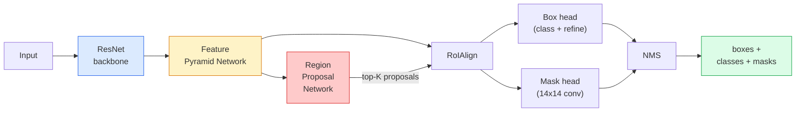

# 实例分割——Mask R-CNN

> 给 Faster R-CNN 检测器加一个小小的掩码分支,你就有了实例分割。难的部分是 RoIAlign——它比看上去更难。

**类型:** 学习 + 动手构建
**编程语言:** Python
**前置要求:** 第 4 阶段第 06 课(YOLO),第 4 阶段第 07 课(U-Net)
**预计耗时:** 约 75 分钟

## 学习目标

- 端到端理清 Mask R-CNN 架构:骨干、FPN、RPN、RoIAlign、框头、掩码头
- 从零实现 RoIAlign,并解释为什么 RoIPool 已被淘汰
- 使用 torchvision 的 `maskrcnn_resnet50_fpn_v2` 预训练模型产出生产级实例掩码,并正确解读其输出格式
- 通过替换框头和掩码头、冻结骨干,在小规模自定义数据集上微调 Mask R-CNN

## 问题

语义分割给每个类别一张掩码,实例分割给每个物体一张掩码——哪怕两个物体同属一个类。数个数、跨帧跟踪、量尺寸(墙上每一块砖的包围框、显微图像里每一个细胞),都需要实例分割。

Mask R-CNN(He et al., 2017)的解法,是把实例分割重新表述为"检测 + 一张掩码"。这个设计干净到此后五年,几乎每篇实例分割论文都是 Mask R-CNN 的变体;而 torchvision 的实现至今仍是中小数据集上的生产默认。

难啃的工程问题是采样:候选框的角点并不对齐像素边界,你怎么从框里裁出固定尺寸的特征区域?这一步做错,所有指标都跟着掉零点几个 mAP。RoIAlign 就是答案。

## 概念

### 架构



要理解的有五块:

1. **骨干(Backbone)** ——在 ImageNet 上训练的 ResNet-50 或 ResNet-101,产出 stride 4、8、16、32 的特征图层级。
2. **FPN(特征金字塔网络)** ——自顶向下 + 横向连接,让每个层级都有 C 通道的语义丰富特征。检测时按物体大小查询对应的 FPN 层级。
3. **RPN(区域建议网络)** ——一个小卷积头,在每个锚点位置预测"这里有物体吗?"以及"框该怎么修?"。每张图产出约 1,000 个候选框。
4. **RoIAlign** ——从任意 FPN 层级上的任意框中,采样出固定尺寸(如 7x7)的特征块。双线性采样,不做量化取整。
5. **头部** ——两层的框头负责精修框和分类;一个小卷积头为每个候选框输出 `28x28` 的二值掩码。

### 为什么是 RoIAlign,而不是 RoIPool

早期的 Fast R-CNN 用 RoIPool:把候选框切成网格,每格取最大特征,所有坐标四舍五入成整数。这个取整让特征图与输入像素坐标错位最多一个特征图像素——在 224x224 的图上是小事,在 stride 32 的特征图上就是灾难。

```
RoIPool:
  box (34.7, 51.3, 98.2, 142.9)
  round -> (34, 51, 98, 142)
  split grid -> round each cell boundary
  misalignment accumulates at every step

RoIAlign:
  box (34.7, 51.3, 98.2, 142.9)
  sample at exact float coordinates using bilinear interpolation
  no rounding anywhere
```

RoIAlign 在 COCO 上白捡 3–4 个掩码 AP 点。如今凡是在乎定位精度的检测器都在用它——YOLOv7 seg、RT-DETR、Mask2Former 无一例外。

### 一段话讲清 RPN

在特征图的每个位置,放 K 个不同大小和形状的锚框。为每个锚框预测一个 objectness 分数,以及一个把锚框修得更贴合的回归偏移。按分数保留前约 1,000 个框,以 IoU 0.7 做 NMS,把幸存者交给头部。RPN 用自己的小损失训练——结构与第 6 课的 YOLO 损失相同,只是类别只有两个(有物体 / 无物体)。

### 掩码头

每个候选框(经 RoIAlign 之后)经过一个小型 FCN:四个 3x3 卷积,一次 2 倍反卷积,最后一个 1x1 卷积,在 `28x28` 分辨率上输出 `num_classes` 个通道。只保留预测类别对应的那个通道,其余丢弃。这样掩码预测与分类就解耦了。

把 28x28 的掩码上采样回候选框的原始像素大小,就得到最终的二值掩码。

### 损失函数

Mask R-CNN 的损失是几部分相加:

```
L = L_rpn_cls + L_rpn_box + L_box_cls + L_box_reg + L_mask
```

- `L_rpn_cls`、`L_rpn_box` ——RPN 候选框的 objectness 与框回归。
- `L_box_cls` ——框头分类器在 (C+1) 个类别(含背景)上的交叉熵。
- `L_box_reg` ——框头框精修上的 smooth L1。
- `L_mask` ——28x28 掩码输出上的逐像素二元交叉熵。

每个损失有各自的默认权重,torchvision 实现把它们暴露为构造参数。

### 输出格式

`torchvision.models.detection.maskrcnn_resnet50_fpn_v2` 返回一个字典列表,每张图一个字典:

```
{
    "boxes":  (N, 4) in (x1, y1, x2, y2) pixel coordinates,
    "labels": (N,) class IDs, 0 = background so indices are 1-based,
    "scores": (N,) confidence scores,
    "masks":  (N, 1, H, W) float masks in [0, 1] — threshold at 0.5 for binary,
}
```

掩码已经是全图分辨率,28x28 的头部输出已在内部上采样过了。

```figure
cv3-roialign-sampling
```

## 动手构建

### 第 1 步:从零实现 RoIAlign

这是 Mask R-CNN 里唯一一个"看代码比看文字更好懂"的组件。

```python
import torch
import torch.nn.functional as F

def roi_align_single(feature, box, output_size=7, spatial_scale=1 / 16.0):
    """
    feature: (C, H, W) single-image feature map
    box: (x1, y1, x2, y2) in original image pixel coordinates
    output_size: side of the output grid (7 for box head, 14 for mask head)
    spatial_scale: reciprocal of the feature map stride
    """
    C, H, W = feature.shape
    x1, y1, x2, y2 = [c * spatial_scale - 0.5 for c in box]
    bin_w = (x2 - x1) / output_size
    bin_h = (y2 - y1) / output_size

    grid_y = torch.linspace(y1 + bin_h / 2, y2 - bin_h / 2, output_size)
    grid_x = torch.linspace(x1 + bin_w / 2, x2 - bin_w / 2, output_size)
    yy, xx = torch.meshgrid(grid_y, grid_x, indexing="ij")

    gx = 2 * (xx + 0.5) / W - 1
    gy = 2 * (yy + 0.5) / H - 1
    grid = torch.stack([gx, gy], dim=-1).unsqueeze(0)
    sampled = F.grid_sample(feature.unsqueeze(0), grid, mode="bilinear",
                            align_corners=False)
    return sampled.squeeze(0)
```

每个数都取自双线性采样的位置。不取整,不量化,不丢梯度。

### 第 2 步:与 torchvision 的 RoIAlign 对比

```python
from torchvision.ops import roi_align

feature = torch.randn(1, 16, 50, 50)
boxes = torch.tensor([[0, 10, 20, 100, 90]], dtype=torch.float32)  # (batch_idx, x1, y1, x2, y2)

ours = roi_align_single(feature[0], boxes[0, 1:].tolist(), output_size=7, spatial_scale=1/4)
theirs = roi_align(feature, boxes, output_size=(7, 7), spatial_scale=1/4, sampling_ratio=1, aligned=True)[0]

print(f"shape ours:   {tuple(ours.shape)}")
print(f"shape theirs: {tuple(theirs.shape)}")
print(f"max|diff|:    {(ours - theirs).abs().max().item():.3e}")
```

取 `sampling_ratio=1` 且 `aligned=True` 时,两者误差在 `1e-5` 以内。

### 第 3 步:加载预训练 Mask R-CNN

```python
import torch
from torchvision.models.detection import maskrcnn_resnet50_fpn_v2, MaskRCNN_ResNet50_FPN_V2_Weights

model = maskrcnn_resnet50_fpn_v2(weights=MaskRCNN_ResNet50_FPN_V2_Weights.DEFAULT)
model.eval()
print(f"params: {sum(p.numel() for p in model.parameters()):,}")
print(f"classes (including background): {len(model.roi_heads.box_predictor.cls_score.out_features * [0])}")
```

46M 参数,91 个类别(COCO)。第一类(id 0)是背景,模型真正检测的类别从 id 1 开始。

### 第 4 步:跑推理

```python
with torch.no_grad():
    x = torch.randn(3, 400, 600)
    predictions = model([x])
p = predictions[0]
print(f"boxes:  {tuple(p['boxes'].shape)}")
print(f"labels: {tuple(p['labels'].shape)}")
print(f"scores: {tuple(p['scores'].shape)}")
print(f"masks:  {tuple(p['masks'].shape)}")
```

掩码张量形状为 `(N, 1, H, W)`。以 0.5 为阈值得到每个物体的二值掩码:

```python
binary_masks = (p['masks'] > 0.5).squeeze(1)  # (N, H, W) boolean
```

### 第 5 步:为自定义类别数换头

常用的微调配方:复用骨干、FPN 和 RPN,替换两个分类头。

```python
from torchvision.models.detection.faster_rcnn import FastRCNNPredictor
from torchvision.models.detection.mask_rcnn import MaskRCNNPredictor

def build_custom_maskrcnn(num_classes):
    model = maskrcnn_resnet50_fpn_v2(weights=MaskRCNN_ResNet50_FPN_V2_Weights.DEFAULT)
    in_features = model.roi_heads.box_predictor.cls_score.in_features
    model.roi_heads.box_predictor = FastRCNNPredictor(in_features, num_classes)
    in_features_mask = model.roi_heads.mask_predictor.conv5_mask.in_channels
    hidden_layer = 256
    model.roi_heads.mask_predictor = MaskRCNNPredictor(in_features_mask, hidden_layer, num_classes)
    return model

custom = build_custom_maskrcnn(num_classes=5)
print(f"custom cls_score.out_features: {custom.roi_heads.box_predictor.cls_score.out_features}")
```

`num_classes` 必须包含背景类,所以数据集有 4 个物体类别时,要用 `num_classes=5`。

### 第 6 步:冻结不需要训练的部分

小数据集上,冻结骨干和 FPN,只让 RPN 的 objectness + 回归和两个头部学习。

```python
def freeze_backbone_and_fpn(model):
    # torchvision Mask R-CNN packs the FPN inside `model.backbone` (as
    # `model.backbone.fpn`), so iterating `model.backbone.parameters()` covers
    # both the ResNet feature layers and the FPN lateral/output convs.
    for p in model.backbone.parameters():
        p.requires_grad = False
    return model

custom = freeze_backbone_and_fpn(custom)
trainable = sum(p.numel() for p in custom.parameters() if p.requires_grad)
print(f"trainable after freeze: {trainable:,}")
```

在 500 张图的数据集上,这就是收敛与过拟合的分水岭。

## 投入使用

torchvision 里 Mask R-CNN 的完整训练循环约 40 行,不同任务之间基本没有变化——换数据集就能跑。

```python
def train_step(model, images, targets, optimizer):
    model.train()
    loss_dict = model(images, targets)
    losses = sum(loss for loss in loss_dict.values())
    optimizer.zero_grad()
    losses.backward()
    optimizer.step()
    return {k: v.item() for k, v in loss_dict.items()}
```

`targets` 列表中每图一个字典,必须包含 `boxes`、`labels` 和 `masks`(形状为 `(num_instances, H, W)` 的二值张量)。训练时模型返回四个损失组成的字典,评估时返回预测列表,由 `model.training` 状态决定。

`pycocotools` 评估器能同时给出框和掩码的 mAP@IoU=0.5:0.95;两个数字都要看,才知道瓶颈在框头还是掩码头。

## 交付

本课会产出:

- `outputs/prompt-instance-vs-semantic-router.md` ——一个提示词:问三个问题,在实例 / 语义 / 全景分割中做选择,并给出起手模型。
- `outputs/skill-mask-rcnn-head-swapper.md` ——一个技能:给定新的 `num_classes`,为任意 torchvision 检测模型生成换头所需的约 10 行代码。

## 练习

1. **(易)** 在 100 个随机框上,把你的 RoIAlign 与 `torchvision.ops.roi_align` 对比,报告最大绝对误差。再跑一遍 RoIPool(2017 年前的行为),展示它在靠近边界的框上会偏出约 1–2 个特征图像素。
2. **(中)** 在一个 50 张图的自定义数据集上微调 `maskrcnn_resnet50_fpn_v2`(任意两个类别:气球、鱼、坑洼、logo 均可)。冻结骨干,训 20 个 epoch,报告 mask AP@0.5。
3. **(难)** 把 Mask R-CNN 的掩码头换成在 56x56(而非 28x28)上预测的版本。测量改动前后的 mAP@IoU=0.75,并解释收益(或没有收益)与"边界精度 / 显存开销"权衡预期相符的原因。

## 关键术语

| 术语 | 人们常说的 | 实际含义 |
|------|----------------|----------------------|
| Mask R-CNN | "检测加掩码" | Faster R-CNN 加一个小型 FCN 头,为每个候选框的每个类别预测一张 28x28 掩码 |
| FPN | "特征金字塔" | 自顶向下 + 横向连接,让每个 stride 层级都有 C 通道的语义丰富特征 |
| RPN | "提候选框的" | 一个小卷积头,每张图产出约 1,000 个"有物体 / 无物体"候选框 |
| RoIAlign | "不取整的裁剪" | 从任意浮点坐标框中双线性采样出固定尺寸的特征网格 |
| RoIPool | "2017 年前的裁剪" | 目的与 RoIAlign 相同,但对框坐标取整;已淘汰 |
| 掩码 AP(Mask AP) | "实例 mAP" | 用掩码 IoU 代替框 IoU 计算的平均精度;COCO 实例分割指标 |
| 二值掩码头 | "逐类掩码" | 为每个候选框的每个类别预测一张二值掩码;只保留预测类别的通道 |
| 背景类 | "第 0 类" | 兜底的"无物体"类别;真实类别的索引从 1 开始 |

## 延伸阅读

- [Mask R-CNN (He et al., 2017)](https://arxiv.org/abs/1703.06870) ——原论文;第 3 节讲 RoIAlign 的部分是必读
- [FPN: Feature Pyramid Networks (Lin et al., 2017)](https://arxiv.org/abs/1612.03144) ——FPN 论文;每个现代检测器都在用它
- [torchvision Mask R-CNN tutorial](https://pytorch.org/tutorials/intermediate/torchvision_tutorial.html) ——微调循环的官方参考
- [Detectron2 model zoo](https://github.com/facebookresearch/detectron2/blob/main/MODEL_ZOO.md) ——生产级实现,几乎每种检测与分割变体都有训练好的权重
