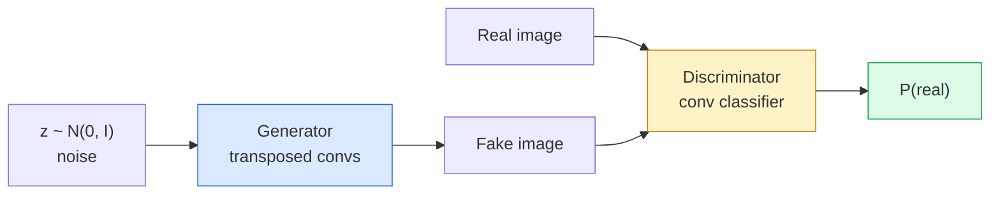
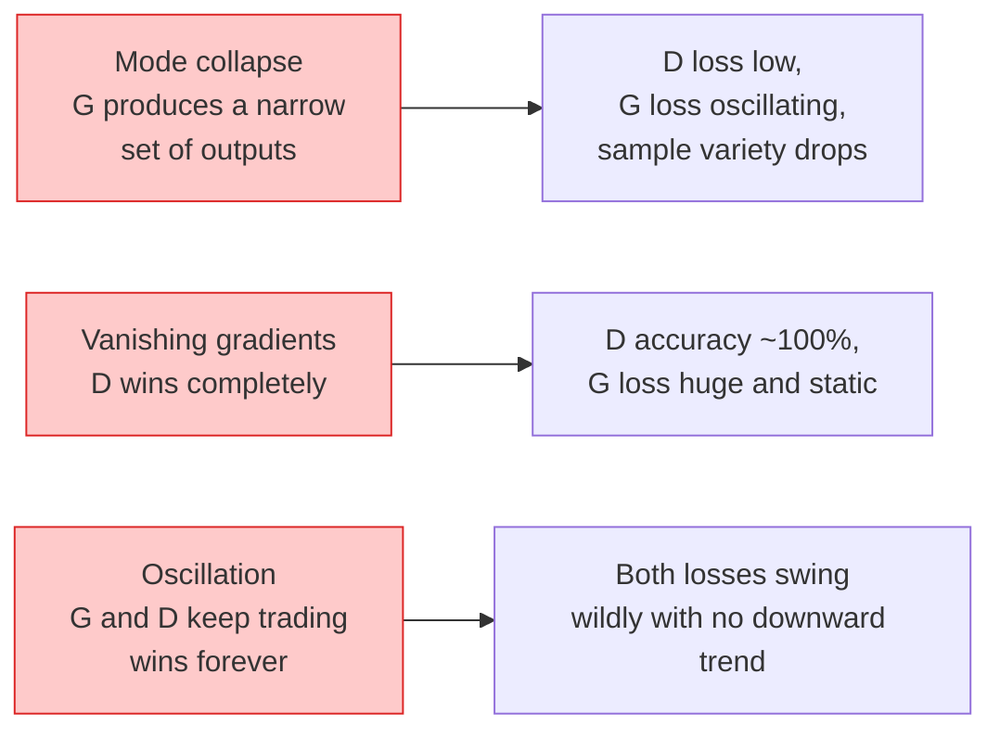

# 图像生成 —— GAN

> GAN 是两个神经网络之间的一场对局:一个负责画,一个负责挑刺。它们一起变强,直到画作骗过批评家。

**类型:** 动手构建
**编程语言:** Python
**前置要求:** 第 4 阶段第 03 课(CNN)、第 3 阶段第 06 课(优化器)、第 3 阶段第 07 课(正则化)
**预计耗时:** 约 75 分钟

## 学习目标

- 解释生成器与判别器之间的极小极大博弈,以及为什么均衡点对应 p_model = p_data
- 用 PyTorch 实现 DCGAN,在 60 行以内让它生成像样的 32x32 合成图像
- 用三个标准技巧稳定 GAN 训练:非饱和损失、谱归一化、TTUR(双时间尺度更新规则)
- 读懂训练曲线,区分健康收敛与模式崩塌、振荡、判别器完胜

## 问题

分类教会网络把图像映射到标签。生成则把问题倒过来:从同一个分布中采样出新的图像。这里没有可以拿来比对的"正确"输出,只有一个你想模仿的分布。

标准损失函数(MSE、交叉熵)无法度量"这个样本是否来自真实分布"。逐像素最小化误差,得到的是模糊的平均,不是真实的样本。突破点在于:把损失也学出来——训练第二个网络,专门分辨真假,再用它的判断去推生成器。

GAN(Goodfellow et al., 2014)定义了这个框架。到 2018 年,StyleGAN 已经能生成与照片难辨真伪的 1024x1024 人脸。后来扩散模型在质量和可控性上夺走了王座,但让扩散实用起来的每一个技巧——归一化选择、潜在空间、特征损失——最初都是在 GAN 上搞明白的。

## 概念

### 两个网络



**生成器** G 输入噪声向量 `z`,输出一张图像。**判别器** D 输入一张图像,输出一个标量:这张图是真实图像的概率。

### 博弈

G 想让 D 犯错,D 想判断正确。形式化地:

```
min_G max_D  E_x[log D(x)] + E_z[log(1 - D(G(z)))]
```

从右往左读:D 在最大化自己对真实图像(`log D(real)`)和生成图像(`log (1 - D(fake))`)的判断准确率;G 在最小化 D 对假图的判断准确率——它想让 `D(G(z))` 变高。

Goodfellow 证明了这个极小极大问题存在全局均衡:`p_G = p_data`,D 处处输出 0.5,生成分布与真实分布之间的 JS 散度为零。难的是怎么走到那一步。

### 非饱和损失

上面的形式在数值上不稳定。训练早期,每张假图的 `D(G(z))` 都接近零,`log(1 - D(G(z)))` 对 G 的梯度趋于消失。修复办法:把 G 的损失翻过来。

```
L_D = -E_x[log D(x)] - E_z[log(1 - D(G(z)))]
L_G = -E_z[log D(G(z))]                          # non-saturating
```

这样当 `D(G(z))` 接近零时,G 的损失很大,梯度信息充足。所有现代 GAN 都用这个变体训练。

### DCGAN 架构规则

Radford、Metz、Chintala(2015)把数年失败实验蒸馏成五条让 GAN 训练稳定的规则:

1. 用步幅卷积替代池化(两个网络都是)。
2. 生成器和判别器都用批归一化,但 G 的输出层和 D 的输入层除外。
3. 较深架构中去掉全连接层。
4. G 的所有层用 ReLU,输出层用 tanh(输出范围 [-1, 1])。
5. D 的所有层用 LeakyReLU(negative_slope=0.2)。

所有现代卷积 GAN(StyleGAN、BigGAN、GigaGAN)仍然从这些规则出发,再逐块替换。

### 失败模式及其特征



- **模式崩塌**:G 找到一张能骗过 D 的图,然后只产它。修复:加 minibatch 判别、谱归一化,或标签条件化。
- **判别器完胜**:D 太强太快,G 的梯度消失。修复:把 D 改小、降低 D 的学习率,或对真实标签做标签平滑。
- **振荡**:两个网络永远交替获胜,从不接近均衡。修复:TTUR(D 的学习率是 G 的 2–4 倍),或换 Wasserstein 损失。

### 评估

GAN 没有标准答案,怎么知道它有没有效?

- **样本检查** — 每个 epoch 结束时直接看 64 个样本。没有商量余地。
- **FID(Fréchet Inception Distance)** — 真实集与生成集在 Inception-v3 特征空间中的分布距离。越低越好。社区标准。
- **Inception Score** — 更老、更脆弱,优先用 FID。
- **生成模型的精确率/召回率** — 分别度量质量(精确率)与覆盖度(召回率),比单看 FID 信息量更大。

小规模的合成数据实验,样本检查就够了。

```figure
cv-gan-image
```

## 动手构建

### 第 1 步:生成器

一个小型 DCGAN 生成器:输入 64 维噪声,输出 32x32 图像。

```python
import torch
import torch.nn as nn

class Generator(nn.Module):
    def __init__(self, z_dim=64, img_channels=3, feat=64):
        super().__init__()
        self.net = nn.Sequential(
            nn.ConvTranspose2d(z_dim, feat * 4, kernel_size=4, stride=1, padding=0, bias=False),
            nn.BatchNorm2d(feat * 4),
            nn.ReLU(inplace=True),
            nn.ConvTranspose2d(feat * 4, feat * 2, kernel_size=4, stride=2, padding=1, bias=False),
            nn.BatchNorm2d(feat * 2),
            nn.ReLU(inplace=True),
            nn.ConvTranspose2d(feat * 2, feat, kernel_size=4, stride=2, padding=1, bias=False),
            nn.BatchNorm2d(feat),
            nn.ReLU(inplace=True),
            nn.ConvTranspose2d(feat, img_channels, kernel_size=4, stride=2, padding=1, bias=False),
            nn.Tanh(),
        )

    def forward(self, z):
        return self.net(z.view(z.size(0), -1, 1, 1))
```

四层转置卷积,每层 `kernel_size=4, stride=2, padding=1`,空间尺寸干净地翻倍。输出经 tanh 落在 [-1, 1]。

### 第 2 步:判别器

生成器的镜像:LeakyReLU、步幅卷积,末端输出一个标量 logit。

```python
class Discriminator(nn.Module):
    def __init__(self, img_channels=3, feat=64):
        super().__init__()
        self.net = nn.Sequential(
            nn.Conv2d(img_channels, feat, kernel_size=4, stride=2, padding=1),
            nn.LeakyReLU(0.2, inplace=True),
            nn.Conv2d(feat, feat * 2, kernel_size=4, stride=2, padding=1, bias=False),
            nn.BatchNorm2d(feat * 2),
            nn.LeakyReLU(0.2, inplace=True),
            nn.Conv2d(feat * 2, feat * 4, kernel_size=4, stride=2, padding=1, bias=False),
            nn.BatchNorm2d(feat * 4),
            nn.LeakyReLU(0.2, inplace=True),
            nn.Conv2d(feat * 4, 1, kernel_size=4, stride=1, padding=0),
        )

    def forward(self, x):
        return self.net(x).view(-1)
```

最后一层卷积把 `4x4` 特征图缩到 `1x1`。每张图输出一个标量,只在算损失时才过 sigmoid。

### 第 3 步:训练步

交替更新:每个批次先更新 D 一次,再更新 G 一次。

```python
import torch.nn.functional as F

def train_step(G, D, real, z, opt_g, opt_d, device):
    real = real.to(device)
    bs = real.size(0)

    # D step
    opt_d.zero_grad()
    d_real = D(real)
    d_fake = D(G(z).detach())
    loss_d = (F.binary_cross_entropy_with_logits(d_real, torch.ones_like(d_real))
              + F.binary_cross_entropy_with_logits(d_fake, torch.zeros_like(d_fake)))
    loss_d.backward()
    opt_d.step()

    # G step
    opt_g.zero_grad()
    d_fake = D(G(z))
    loss_g = F.binary_cross_entropy_with_logits(d_fake, torch.ones_like(d_fake))
    loss_g.backward()
    opt_g.step()

    return loss_d.item(), loss_g.item()
```

D 步里的 `G(z).detach()` 至关重要:我们不希望梯度在 D 更新时流进 G。忘了它,是经典的新手 bug。

### 第 4 步:在合成形状上跑完整训练循环

```python
from torch.utils.data import DataLoader, TensorDataset
import numpy as np

def synthetic_images(num=2000, size=32, seed=0):
    rng = np.random.default_rng(seed)
    imgs = np.zeros((num, 3, size, size), dtype=np.float32) - 1.0
    for i in range(num):
        r = rng.uniform(6, 12)
        cx, cy = rng.uniform(r, size - r, size=2)
        yy, xx = np.meshgrid(np.arange(size), np.arange(size), indexing="ij")
        mask = (xx - cx) ** 2 + (yy - cy) ** 2 < r ** 2
        color = rng.uniform(-0.5, 1.0, size=3)
        for c in range(3):
            imgs[i, c][mask] = color[c]
    return torch.from_numpy(imgs)

device = "cuda" if torch.cuda.is_available() else "cpu"
data = synthetic_images()
loader = DataLoader(TensorDataset(data), batch_size=64, shuffle=True)

G = Generator(z_dim=64, img_channels=3, feat=32).to(device)
D = Discriminator(img_channels=3, feat=32).to(device)
opt_g = torch.optim.Adam(G.parameters(), lr=2e-4, betas=(0.5, 0.999))
opt_d = torch.optim.Adam(D.parameters(), lr=2e-4, betas=(0.5, 0.999))

for epoch in range(10):
    for (batch,) in loader:
        z = torch.randn(batch.size(0), 64, device=device)
        ld, lg = train_step(G, D, batch, z, opt_g, opt_d, device)
    print(f"epoch {epoch}  D {ld:.3f}  G {lg:.3f}")
```

`Adam(lr=2e-4, betas=(0.5, 0.999))` 是 DCGAN 的默认配置——低 beta1 防止动量项把对抗博弈"稳定"得过了头。

### 第 5 步:采样

```python
@torch.no_grad()
def sample(G, n=16, z_dim=64, device="cpu"):
    G.eval()
    z = torch.randn(n, z_dim, device=device)
    imgs = G(z)
    imgs = (imgs + 1) / 2
    return imgs.clamp(0, 1)
```

采样前一定切到 eval 模式。对 DCGAN 这很关键:批归一化会用运行统计量,而不是当前批次的统计量。

### 第 6 步:谱归一化

判别器中 BN 的即插即用替代品,保证网络是 1-Lipschitz 的。能修掉大多数"D 赢得太狠"的故障。

```python
from torch.nn.utils import spectral_norm

def build_sn_discriminator(img_channels=3, feat=64):
    return nn.Sequential(
        spectral_norm(nn.Conv2d(img_channels, feat, 4, 2, 1)),
        nn.LeakyReLU(0.2, inplace=True),
        spectral_norm(nn.Conv2d(feat, feat * 2, 4, 2, 1)),
        nn.LeakyReLU(0.2, inplace=True),
        spectral_norm(nn.Conv2d(feat * 2, feat * 4, 4, 2, 1)),
        nn.LeakyReLU(0.2, inplace=True),
        spectral_norm(nn.Conv2d(feat * 4, 1, 4, 1, 0)),
    )
```

把 `Discriminator` 换成 `build_sn_discriminator()`,往往连 TTUR 都用不上。谱归一化是性价比最高的单项鲁棒性升级。

## 投入使用

严肃的生成任务,用预训练权重或者转投扩散模型。两个标准库:

- `torch_fidelity`:不写评估代码就能算你的生成器的 FID / IS。
- `pytorch-gan-zoo`(较老)和 `StudioGAN`:附带经过测试的 DCGAN、WGAN-GP、SN-GAN、StyleGAN、BigGAN 实现。

到 2026 年,GAN 仍然是以下场景的最佳选择:实时图像生成(延迟 <10 ms)、风格迁移、需要精确控制的图到图翻译(Pix2Pix、CycleGAN)。照片级真实感和文本条件生成,则是扩散模型的天下。

## 交付

本课产出:

- `outputs/prompt-gan-training-triage.md` — 一个提示词:读训练曲线描述,判断失败模式(模式崩塌、D 完胜、振荡)并给出唯一推荐修复方案。
- `outputs/skill-dcgan-scaffold.md` — 一个技能:根据 `z_dim`、目标 `image_size` 和 `num_channels` 生成 DCGAN 脚手架,含训练循环和样本保存器。

## 练习

1. **(易)** 在合成圆形数据集上训练上面的 DCGAN,每个 epoch 结束保存 16 个样本的网格。到第几个 epoch,生成的圆明显变圆了?
2. **(中)** 把判别器的批归一化换成谱归一化,两个版本并排训练。哪个收敛更快?三个随机种子下哪个方差更小?
3. **(难)** 实现条件 DCGAN:把类别标签同时喂给 G 和 D(G 里把 one-hot 拼到噪声上,D 里拼一个类别嵌入通道)。在第 7 课的"圆形 vs 方形"合成数据集上训练,通过按指定标签采样来证明类别条件确实生效。

## 关键术语

| 术语 | 人们常说的是 | 实际含义是 |
|------|----------------|----------------------|
| 生成器(G) | "画图的那个网" | 把噪声映射成图像;训练目标是骗过判别器 |
| 判别器(D) | "批评家" | 二分类器;训练目标是区分真实图像与生成图像 |
| 极小极大 | "博弈" | 对抗损失上对 G 取 min、对 D 取 max;均衡点是 p_G = p_data |
| 非饱和损失 | "数值上正常的版本" | G 的损失用 -log(D(G(z))) 而非 log(1 - D(G(z))),避免训练早期梯度消失 |
| 模式崩塌 | "生成器只会做一样东西" | G 只产出数据分布的一个小子集;用谱归一化、minibatch 判别或更大批次修复 |
| TTUR | "两个学习率" | D 学得比 G 快,通常快 2–4 倍;稳定训练 |
| 谱归一化 | "1-Lipschitz 层" | 一种约束每层 Lipschitz 常数的权重归一化;阻止 D 变得任意陡峭 |
| FID | "Fréchet Inception Distance" | 真实集与生成集 Inception-v3 特征分布之间的距离;标准评估指标 |

## 延伸阅读

- [Generative Adversarial Networks (Goodfellow et al., 2014)](https://arxiv.org/abs/1406.2661) — 开山之作
- [DCGAN (Radford, Metz, Chintala, 2015)](https://arxiv.org/abs/1511.06434) — 让 GAN 训得起来的架构规则
- [Spectral Normalization for GANs (Miyato et al., 2018)](https://arxiv.org/abs/1802.05957) — 最有用的单项稳定化技巧
- [StyleGAN3 (Karras et al., 2021)](https://arxiv.org/abs/2106.12423) — SOTA GAN,读起来像过去十年所有技巧的精选集
